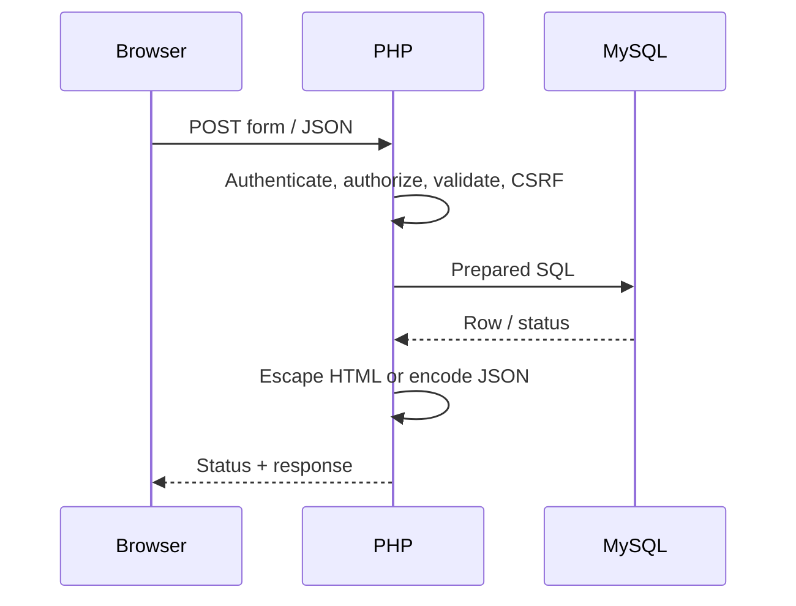

# ⚡ Appendix B: HTML, CSS, JavaScript, PHP and SQL Quick Reference

> **BCA Web Technology — Code Cheat Sheet**  
> Common syntax, patterns aur secure examples ek hi jagah.

---

## 🎯 Use Kaise Karein?

- Exam se pehle syntax revise karein.
- Practical mein exact pattern quickly find karein.
- Code copy karne se pehle names, paths and validation apne project ke according change karein.
- Security-marked examples ko skip na karein.

---

# 1. 🧱 HTML Quick Reference

## 1.1 Basic Document

```html
<!doctype html>
<html lang="en">
<head>
  <meta charset="utf-8">
  <meta name="viewport" content="width=device-width, initial-scale=1">
  <title>Page Title</title>
  <meta name="description" content="Short page description">
  <link rel="stylesheet" href="style.css">
  <script src="app.js" defer></script>
</head>
<body>
  <header>...</header>
  <main>
    <h1>Main Heading</h1>
  </main>
  <footer>...</footer>
</body>
</html>
```

## 1.2 Common Semantic Elements

| Element | Use |
|---|---|
| `<header>` | Page/section header |
| `<nav>` | Navigation links |
| `<main>` | Main unique content |
| `<section>` | Thematic section |
| `<article>` | Independent content |
| `<aside>` | Related/sidebar content |
| `<footer>` | Footer information |
| `<figure>` | Media with optional caption |
| `<time>` | Date/time |
| `<address>` | Relevant contact information |

## 1.3 Text

```html
<h1>Heading 1</h1>
<h2>Heading 2</h2>
<p>A paragraph with <strong>importance</strong>.</p>
<p><em>Emphasized text</em></p>
<blockquote cite="https://example.com/source">
  Short quotation.
</blockquote>
<code>const total = 10;</code>
<pre><code>Multi-line
code block</code></pre>
```

## 1.4 Links

```html
<a href="/about.html">About</a>
<a href="https://example.com">External Site</a>
<a href="mailto:help@example.com">Email Us</a>
<a href="tel:+911234567890">Call Us</a>
<a href="#contact">Jump to Contact</a>
```

New tab only when useful:

```html
<a
  href="https://example.com"
  target="_blank"
  rel="noopener noreferrer"
>
  External Site
</a>
```

## 1.5 Images and Responsive Images

```html

```

Decorative:

```html

```

## 1.6 Lists

```html
<ul>
  <li>HTML</li>
  <li>CSS</li>
</ul>

<ol>
  <li>Plan</li>
  <li>Code</li>
  <li>Test</li>
</ol>

<dl>
  <dt>HTTP</dt>
  <dd>Web communication protocol.</dd>
</dl>
```

## 1.7 Table

```html
<table>
  <caption>Student Marks</caption>
  <thead>
    <tr>
      <th scope="col">Roll No.</th>
      <th scope="col">Name</th>
      <th scope="col">Marks</th>
    </tr>
  </thead>
  <tbody>
    <tr>
      <td>BCA-101</td>
      <td>Aditi</td>
      <td>88</td>
    </tr>
  </tbody>
</table>
```

## 1.8 Accessible Form

```html
<form action="/register.php" method="post">
  <div>
    <label for="name">Full Name</label>
    <input
      id="name"
      name="name"
      type="text"
      minlength="2"
      maxlength="100"
      autocomplete="name"
      required
    >
  </div>

  <div>
    <label for="email">Email</label>
    <input
      id="email"
      name="email"
      type="email"
      autocomplete="email"
      required
    >
  </div>

  <div>
    <label for="course">Course</label>
    <select id="course" name="course" required>
      <option value="">Choose a course</option>
      <option value="BCA">BCA</option>
      <option value="BBA">BBA</option>
    </select>
  </div>

  <fieldset>
    <legend>Study Mode</legend>

    <label>
      <input type="radio" name="mode" value="regular" required>
      Regular
    </label>

    <label>
      <input type="radio" name="mode" value="online">
      Online
    </label>
  </fieldset>

  <label>
    <input type="checkbox" name="terms" value="1" required>
    I accept the terms
  </label>

  <button type="submit">Register</button>
</form>
```

> HTML validation user guidance hai. Server validation compulsory hai.

## 1.9 Audio and Video

```html
<audio controls>
  <source src="lecture.mp3" type="audio/mpeg">
  Your browser does not support audio.
</audio>

<video controls width="720" poster="poster.webp">
  <source src="lesson.mp4" type="video/mp4">
  <track
    kind="captions"
    src="captions-en.vtt"
    srclang="en"
    label="English"
    default
  >
</video>
```

## 1.10 Useful Entities

| Character | HTML Entity |
|---|---|
| `<` | `&lt;` |
| `>` | `&gt;` |
| `&` | `&amp;` |
| `"` | `&quot;` |
| © | `&copy;` |
| Non-breaking space | `&nbsp;` |

---

# 2. 🎨 CSS Quick Reference

## 2.1 CSS Syntax

```css
selector {
  property: value;
}
```

Link:

```html
<link rel="stylesheet" href="style.css">
```

## 2.2 Selectors

```css
p { color: #172033; }             /* Element */
.card { padding: 1rem; }          /* Class */
#main-title { font-size: 2rem; }   /* ID */
input[type="email"] { ... }        /* Attribute */
nav a { ... }                      /* Descendant */
nav > a { ... }                    /* Direct child */
h2 + p { ... }                     /* Next sibling */
button:hover { ... }               /* Pseudo-class */
input:focus-visible { ... }
li:nth-child(odd) { ... }
p::first-line { ... }              /* Pseudo-element */
```

## 2.3 Cascade Reminder

Priority broadly depends on:

1. origin and importance;
2. cascade layer;
3. specificity;
4. source order.

Avoid overusing `!important`.

## 2.4 Common Units

| Unit | Meaning |
|---|---|
| `px` | CSS pixel |
| `%` | Percentage |
| `em` | Current/parent font-relative |
| `rem` | Root font-relative |
| `vw` / `vh` | Viewport width/height |
| `dvh` | Dynamic viewport height |
| `ch` | Character-width approximation |
| `fr` | Grid fraction |

## 2.5 Box Model

```css
* {
  box-sizing: border-box;
}

.card {
  width: 320px;
  padding: 1rem;
  border: 1px solid #cbd5e1;
  margin: 1rem;
}
```

Order: content → padding → border → margin.

## 2.6 Colors and Variables

```css
:root {
  --primary: #2563eb;
  --surface: #ffffff;
  --text: #172033;
}

button {
  color: white;
  background-color: var(--primary);
}
```

## 2.7 Typography

```css
body {
  font-family: system-ui, sans-serif;
  font-size: 1rem;
  line-height: 1.6;
  color: #172033;
}

h1 {
  font-size: clamp(2rem, 5vw, 4rem);
  line-height: 1.1;
}
```

## 2.8 Flexbox

```css
.navbar {
  display: flex;
  align-items: center;
  justify-content: space-between;
  gap: 1rem;
  flex-wrap: wrap;
}

.item {
  flex: 1 1 220px;
}
```

| Property | Purpose |
|---|---|
| `flex-direction` | Main axis |
| `justify-content` | Main-axis alignment |
| `align-items` | Cross-axis alignment |
| `gap` | Item spacing |
| `flex-wrap` | Allow wrapping |
| `flex` | Grow, shrink, basis |

## 2.9 Grid

```css
.grid {
  display: grid;
  grid-template-columns:
    repeat(auto-fit, minmax(220px, 1fr));
  gap: 1rem;
}

.featured {
  grid-column: span 2;
}
```

## 2.10 Position

```css
.parent {
  position: relative;
}

.badge {
  position: absolute;
  inset-block-start: 0.5rem;
  inset-inline-end: 0.5rem;
}

.header {
  position: sticky;
  top: 0;
}
```

## 2.11 Responsive Design

```css
.container {
  width: min(1120px, 92%);
  margin-inline: auto;
}

.layout {
  display: grid;
  grid-template-columns: 1fr;
  gap: 1rem;
}

@media (min-width: 768px) {
  .layout {
    grid-template-columns: 2fr 1fr;
  }
}
```

## 2.12 Container Query

```css
.cards {
  container-type: inline-size;
}

@container (min-width: 500px) {
  .card {
    display: grid;
    grid-template-columns: 160px 1fr;
  }
}
```

## 2.13 Transition and Animation

```css
.button {
  transition:
    background-color 180ms ease,
    transform 180ms ease;
}

.button:hover {
  transform: translateY(-2px);
}

@keyframes fade-in {
  from { opacity: 0; }
  to { opacity: 1; }
}

.notice {
  animation: fade-in 300ms ease-out;
}

@media (prefers-reduced-motion: reduce) {
  *,
  *::before,
  *::after {
    scroll-behavior: auto !important;
    animation-duration: 0.01ms !important;
    animation-iteration-count: 1 !important;
    transition-duration: 0.01ms !important;
  }
}
```

## 2.14 Accessible Focus

```css
:focus-visible {
  outline: 3px solid #f59e0b;
  outline-offset: 3px;
}
```

---

# 3. 🟨 JavaScript Quick Reference

## 3.1 Variables and Types

```javascript
const name = "Aditi";
let semester = 5;

const marks = 88.5;       // Number
const active = true;      // Boolean
const city = null;        // Null
let phone;                // Undefined
const skills = ["HTML", "CSS"];
const student = { name, semester };
```

Prefer `const`; use `let` when reassignment needed.

## 3.2 Template Literals

```javascript
const message =
  `${name} is in semester ${semester}.`;
```

## 3.3 Equality

```javascript
5 === 5;     // true
5 === "5";   // false
5 !== "5";   // true
```

Prefer strict equality `===` / `!==`.

## 3.4 Conditions

```javascript
if (marks >= 75) {
  console.log("Distinction");
} else if (marks >= 40) {
  console.log("Pass");
} else {
  console.log("Fail");
}

const result = marks >= 40 ? "Pass" : "Fail";

switch (semester) {
  case 1:
    console.log("First semester");
    break;
  default:
    console.log("Other semester");
}
```

## 3.5 Loops

```javascript
for (let i = 0; i < 5; i++) {
  console.log(i);
}

for (const skill of skills) {
  console.log(skill);
}

for (const key in student) {
  console.log(key, student[key]);
}

let count = 0;
while (count < 3) {
  count++;
}
```

## 3.6 Functions

```javascript
function add(a, b) {
  return a + b;
}

const multiply = (a, b) => a * b;

function greet(name = "Student") {
  return `Hello, ${name}`;
}
```

## 3.7 Arrays

```javascript
const numbers = [10, 20, 30];

numbers.push(40);
numbers.pop();

const doubled = numbers.map((number) => number * 2);
const large = numbers.filter((number) => number >= 20);
const first = numbers.find((number) => number === 20);
const total = numbers.reduce((sum, number) => sum + number, 0);
const hasLarge = numbers.some((number) => number > 25);
const allPositive = numbers.every((number) => number > 0);
```

## 3.8 Objects and Destructuring

```javascript
const student = {
  id: 101,
  name: "Aditi",
  course: "BCA",
};

console.log(student.name);
console.log(student["course"]);

const { name, course } = student;

const updated = {
  ...student,
  semester: 5,
};
```

## 3.9 Optional Chaining and Nullish Coalescing

```javascript
const city = student.address?.city ?? "Unknown";
```

## 3.10 Strings

```javascript
const text = "  Web Technology  ";

text.trim();
text.toLowerCase();
text.toUpperCase();
text.includes("Web");
text.replace("Web", "Internet");
text.split(" ");
```

## 3.11 DOM Selection and Change

```javascript
const heading = document.querySelector("h1");
const cards = document.querySelectorAll(".card");

heading.textContent = "Student Portal";
heading.classList.add("highlight");
heading.classList.toggle("active");
heading.setAttribute("aria-live", "polite");

const item = document.createElement("li");
item.textContent = "New Student";
document.querySelector("ul").append(item);
```

Use `textContent` for untrusted text; avoid unsafe `innerHTML`.

## 3.12 Events

```javascript
const button = document.querySelector("#save");

button.addEventListener("click", (event) => {
  console.log("Button clicked", event);
});

const form = document.querySelector("#student-form");

form.addEventListener("submit", (event) => {
  event.preventDefault();
  // Validate and submit.
});
```

Event delegation:

```javascript
document.querySelector("#list").addEventListener(
  "click",
  (event) => {
    const button = event.target.closest("[data-delete-id]");

    if (!button) return;

    console.log(button.dataset.deleteId);
  }
);
```

## 3.13 Form Data

```javascript
const formData = new FormData(form);

const values = Object.fromEntries(formData.entries());
console.log(values);
```

## 3.14 JSON

```javascript
const jsonText = JSON.stringify(student, null, 2);

try {
  const value = JSON.parse(jsonText);
} catch (error) {
  console.error("Invalid JSON", error);
}
```

## 3.15 Promise and Async/Await

```javascript
function wait(ms) {
  return new Promise((resolve) => {
    setTimeout(resolve, ms);
  });
}

async function run() {
  await wait(500);
  console.log("Done");
}
```

## 3.16 Fetch GET

```javascript
async function getStudents() {
  const response = await fetch("/api/students", {
    headers: {
      Accept: "application/json",
    },
  });

  const data = await response.json();

  if (!response.ok) {
    throw new Error(data.message ?? `HTTP ${response.status}`);
  }

  return data;
}
```

## 3.17 Fetch POST JSON

```javascript
const response = await fetch("/api/students", {
  method: "POST",
  headers: {
    "Content-Type": "application/json",
    Accept: "application/json",
  },
  body: JSON.stringify({
    name: "Aditi",
    email: "aditi@example.com",
  }),
});
```

## 3.18 Error Handling

```javascript
try {
  const data = await getStudents();
  console.log(data);
} catch (error) {
  console.error(error);
} finally {
  console.log("Request finished");
}
```

## 3.19 Modules

```javascript
// math.js
export function add(a, b) {
  return a + b;
}

// app.js
import { add } from "./math.js";

console.log(add(2, 3));
```

HTML:

```html
<script type="module" src="app.js"></script>
```

## 3.20 Debounce

```javascript
function debounce(callback, delay = 300) {
  let timer;

  return (...args) => {
    clearTimeout(timer);
    timer = setTimeout(() => callback(...args), delay);
  };
}
```

---

# 4. 🐘 PHP Quick Reference

## 4.1 Basic Syntax

```php
<?php
declare(strict_types=1);

$name = 'Aditi';
$semester = 5;
$active = true;

echo "Student: $name";
```

## 4.2 Arrays

```php
$skills = ['HTML', 'CSS', 'PHP'];

$student = [
    'id' => 101,
    'name' => 'Aditi',
    'course' => 'BCA',
];

$skills[] = 'SQL';

echo $student['name'];
```

## 4.3 Conditions and Loops

```php
if ($marks >= 75) {
    $result = 'Distinction';
} elseif ($marks >= 40) {
    $result = 'Pass';
} else {
    $result = 'Fail';
}

foreach ($skills as $skill) {
    echo $skill;
}

for ($i = 0; $i < 5; $i++) {
    echo $i;
}
```

## 4.4 Functions

```php
function add(int $a, int $b): int
{
    return $a + $b;
}

function greet(string $name = 'Student'): string
{
    return "Hello, $name";
}
```

## 4.5 String and Array Helpers

```php
trim($name);
mb_strlen($name);
strtolower($email);
strtoupper($code);
str_contains($text, 'BCA');

count($skills);
in_array('PHP', $skills, true);
array_map(fn ($value) => strtoupper($value), $skills);
array_filter($marks, fn ($mark) => $mark >= 40);
```

## 4.6 Superglobals

| Variable | Contains |
|---|---|
| `$_GET` | Query parameters |
| `$_POST` | Form data |
| `$_FILES` | Uploaded files |
| `$_COOKIE` | Cookies |
| `$_SESSION` | Session data |
| `$_SERVER` | Request/server information |
| `$_ENV` | Environment variables |

## 4.7 Validate Input

```php
$email = trim($_POST['email'] ?? '');

if (!filter_var($email, FILTER_VALIDATE_EMAIL)) {
    $errors['email'] = 'Enter a valid email.';
}

$id = filter_input(
    INPUT_GET,
    'id',
    FILTER_VALIDATE_INT
);

if ($id === false || $id === null || $id < 1) {
    http_response_code(400);
    exit('Invalid ID.');
}
```

## 4.8 Escape HTML Output

```php
function e(?string $value): string
{
    return htmlspecialchars(
        $value ?? '',
        ENT_QUOTES | ENT_SUBSTITUTE,
        'UTF-8'
    );
}
```

Usage:

```php
<p><?= e($student['name']) ?></p>
```

## 4.9 Include/Require

```php
require __DIR__ . '/config/database.php';
require_once __DIR__ . '/helpers.php';
include __DIR__ . '/templates/header.php';
```

## 4.10 Session

```php
session_set_cookie_params([
    'lifetime' => 0,
    'path' => '/',
    'secure' => true,
    'httponly' => true,
    'samesite' => 'Lax',
]);

session_start();

session_regenerate_id(true);
$_SESSION['user_id'] = 101;
```

## 4.11 Password Hashing

```php
$hash = password_hash(
    $password,
    PASSWORD_DEFAULT
);

if (password_verify($password, $hash)) {
    echo 'Valid password';
}
```

## 4.12 CSRF Token

```php
if (empty($_SESSION['csrf_token'])) {
    $_SESSION['csrf_token'] =
        bin2hex(random_bytes(32));
}

function verifyCsrf(?string $token): void
{
    $stored = $_SESSION['csrf_token'] ?? '';

    if (
        $token === null ||
        $stored === '' ||
        !hash_equals($stored, $token)
    ) {
        http_response_code(403);
        exit('Invalid token.');
    }
}
```

## 4.13 File Read/Write

```php
$content = file_get_contents(__DIR__ . '/data.txt');

file_put_contents(
    __DIR__ . '/log.txt',
    "New line
",
    FILE_APPEND | LOCK_EX
);
```

Never use unvalidated user path.

## 4.14 Class

```php
final class Student
{
    public function __construct(
        private int $id,
        private string $name
    ) {}

    public function getName(): string
    {
        return $this->name;
    }
}

$student = new Student(101, 'Aditi');
echo $student->getName();
```

## 4.15 Interface

```php
interface Repository
{
    public function find(int $id): array|false;
}

final class StudentRepository implements Repository
{
    public function __construct(
        private PDO $pdo
    ) {}

    public function find(int $id): array|false
    {
        // Query implementation
        return false;
    }
}
```

## 4.16 Exception Handling

```php
try {
    riskyOperation();
} catch (Throwable $exception) {
    error_log($exception->getMessage());
    http_response_code(500);
    echo 'Operation failed.';
} finally {
    // Cleanup if required
}
```

## 4.17 JSON Response

```php
header('Content-Type: application/json; charset=utf-8');

echo json_encode(
    [
        'ok' => true,
        'data' => $students,
    ],
    JSON_UNESCAPED_UNICODE |
    JSON_THROW_ON_ERROR
);
```

## 4.18 Redirect

```php
header('Location: /students.php');
exit;
```

Header before output.

---

# 5. 🔌 PDO Quick Reference

## 5.1 Connection

```php
$dsn = 'mysql:host=127.0.0.1;port=3306;'
    . 'dbname=college;charset=utf8mb4';

$pdo = new PDO(
    $dsn,
    $username,
    $password,
    [
        PDO::ATTR_ERRMODE
            => PDO::ERRMODE_EXCEPTION,
        PDO::ATTR_DEFAULT_FETCH_MODE
            => PDO::FETCH_ASSOC,
        PDO::ATTR_EMULATE_PREPARES
            => false,
    ]
);
```

## 5.2 INSERT

```php
$stmt = $pdo->prepare(
    'INSERT INTO students
     (roll_number, name, email)
     VALUES (:roll_number, :name, :email)'
);

$stmt->execute([
    'roll_number' => $rollNumber,
    'name' => $name,
    'email' => $email,
]);

$id = (int) $pdo->lastInsertId();
```

## 5.3 SELECT One

```php
$stmt = $pdo->prepare(
    'SELECT student_id, name, email
     FROM students
     WHERE student_id = :id'
);

$stmt->execute(['id' => $id]);
$student = $stmt->fetch();
```

## 5.4 SELECT All

```php
$stmt = $pdo->query(
    'SELECT student_id, name
     FROM students
     ORDER BY name'
);

$students = $stmt->fetchAll();
```

## 5.5 UPDATE

```php
$stmt = $pdo->prepare(
    'UPDATE students
     SET name = :name,
         email = :email
     WHERE student_id = :id'
);

$stmt->execute([
    'name' => $name,
    'email' => $email,
    'id' => $id,
]);
```

## 5.6 DELETE

```php
$stmt = $pdo->prepare(
    'DELETE FROM students
     WHERE student_id = :id'
);

$stmt->execute(['id' => $id]);
```

## 5.7 Transaction

```php
try {
    $pdo->beginTransaction();

    // Related database operations

    $pdo->commit();
} catch (Throwable $exception) {
    if ($pdo->inTransaction()) {
        $pdo->rollBack();
    }

    throw $exception;
}
```

---

# 6. 🗄️ SQL and MySQL Quick Reference

## 6.1 Database Commands

```sql
SHOW DATABASES;

CREATE DATABASE college
CHARACTER SET utf8mb4
COLLATE utf8mb4_unicode_ci;

USE college;

DROP DATABASE college;
```

`DROP` dangerous and destructive hai.

## 6.2 Create Table

```sql
CREATE TABLE students (
    student_id INT UNSIGNED AUTO_INCREMENT PRIMARY KEY,
    roll_number VARCHAR(20) NOT NULL UNIQUE,
    name VARCHAR(100) NOT NULL,
    email VARCHAR(150) NOT NULL UNIQUE,
    semester TINYINT UNSIGNED NOT NULL,
    fees DECIMAL(10, 2) NOT NULL DEFAULT 0.00,
    created_at TIMESTAMP NOT NULL DEFAULT CURRENT_TIMESTAMP,

    CHECK (semester BETWEEN 1 AND 8),
    CHECK (fees >= 0)
);
```

## 6.3 Inspect Table

```sql
SHOW TABLES;
DESCRIBE students;
SHOW CREATE TABLE students;
```

## 6.4 ALTER TABLE

```sql
ALTER TABLE students
ADD COLUMN city VARCHAR(60);

ALTER TABLE students
MODIFY COLUMN city VARCHAR(100);

ALTER TABLE students
RENAME COLUMN city TO hometown;

ALTER TABLE students
DROP COLUMN hometown;
```

## 6.5 INSERT

```sql
INSERT INTO students
(roll_number, name, email, semester, fees)
VALUES
('BCA-101', 'Aditi Sharma', 'aditi@example.com', 1, 25000.00);

INSERT INTO students
(roll_number, name, email, semester, fees)
VALUES
('BCA-102', 'Rahul Verma', 'rahul@example.com', 3, 26000.00),
('BCA-103', 'Neha Singh', 'neha@example.com', 5, 27500.00);
```

## 6.6 SELECT

```sql
SELECT * FROM students;

SELECT student_id, name, email
FROM students;
```

## 6.7 WHERE Operators

```sql
SELECT *
FROM students
WHERE semester >= 3
  AND fees BETWEEN 25000 AND 30000
  AND name LIKE 'A%';

SELECT *
FROM students
WHERE city IN ('Delhi', 'Jaipur');

SELECT *
FROM students
WHERE phone IS NULL;
```

## 6.8 ORDER, LIMIT and Pagination

```sql
SELECT student_id, name, semester
FROM students
ORDER BY semester DESC, name ASC
LIMIT 10 OFFSET 20;
```

## 6.9 UPDATE

```sql
UPDATE students
SET fees = 27000.00,
    semester = 4
WHERE student_id = 2;
```

Always `WHERE` verify:

```sql
SELECT *
FROM students
WHERE student_id = 2;
```

## 6.10 DELETE

```sql
DELETE FROM students
WHERE student_id = 2;
```

| Command | Removes | Structure Remains? |
|---|---|---:|
| `DELETE` | Selected/all rows | Yes |
| `TRUNCATE` | All rows | Yes |
| `DROP TABLE` | Table + data | No |

## 6.11 Aggregate Functions

```sql
SELECT
    COUNT(*) AS total_students,
    AVG(fees) AS average_fees,
    MIN(fees) AS minimum_fees,
    MAX(fees) AS maximum_fees,
    SUM(fees) AS total_fees
FROM students;
```

## 6.12 GROUP BY and HAVING

```sql
SELECT
    semester,
    COUNT(*) AS total_students,
    AVG(fees) AS average_fees
FROM students
WHERE fees > 0
GROUP BY semester
HAVING COUNT(*) >= 2
ORDER BY semester;
```

`WHERE` rows before grouping; `HAVING` groups after grouping.

## 6.13 Foreign Key

```sql
CREATE TABLE courses (
    course_id INT UNSIGNED AUTO_INCREMENT PRIMARY KEY,
    title VARCHAR(100) NOT NULL UNIQUE
);

ALTER TABLE students
ADD COLUMN course_id INT UNSIGNED;

ALTER TABLE students
ADD CONSTRAINT fk_student_course
FOREIGN KEY (course_id)
REFERENCES courses(course_id)
ON UPDATE CASCADE
ON DELETE RESTRICT;
```

## 6.14 INNER JOIN

```sql
SELECT
    s.name,
    c.title
FROM students AS s
INNER JOIN courses AS c
    ON s.course_id = c.course_id;
```

## 6.15 LEFT JOIN

```sql
SELECT
    c.title,
    COUNT(s.student_id) AS total_students
FROM courses AS c
LEFT JOIN students AS s
    ON c.course_id = s.course_id
GROUP BY c.course_id, c.title;
```

## 6.16 Junction Table

```sql
CREATE TABLE enrollments (
    student_id INT UNSIGNED NOT NULL,
    course_id INT UNSIGNED NOT NULL,
    enrolled_on DATE NOT NULL,
    marks DECIMAL(5, 2),

    PRIMARY KEY (student_id, course_id),

    FOREIGN KEY (student_id)
        REFERENCES students(student_id)
        ON DELETE CASCADE,

    FOREIGN KEY (course_id)
        REFERENCES courses(course_id)
        ON DELETE RESTRICT,

    CHECK (marks IS NULL OR marks BETWEEN 0 AND 100)
);
```

## 6.17 Three-Table JOIN

```sql
SELECT
    s.name,
    c.title,
    e.marks
FROM enrollments AS e
JOIN students AS s
    ON e.student_id = s.student_id
JOIN courses AS c
    ON e.course_id = c.course_id
ORDER BY s.name, c.title;
```

## 6.18 Transaction

```sql
START TRANSACTION;

UPDATE accounts
SET balance = balance - 500
WHERE account_id = 1;

UPDATE accounts
SET balance = balance + 500
WHERE account_id = 2;

COMMIT;
-- Problem ho to ROLLBACK;
```

## 6.19 Index and EXPLAIN

```sql
CREATE INDEX idx_students_name
ON students (name);

EXPLAIN
SELECT student_id, name
FROM students
WHERE name = 'Aditi Sharma';
```

## 6.20 Useful String/Date Functions

```sql
SELECT
    UPPER(name),
    LOWER(email),
    CHAR_LENGTH(name),
    CONCAT(name, ' - ', roll_number),
    DATE(created_at),
    YEAR(created_at)
FROM students;
```

---

# 7. 🔗 Full-Stack Data Flow Reference



### Secure Order

```text
1. Check request method
2. Authenticate user
3. Authorize action/resource
4. Verify CSRF when cookie-authenticated state changes
5. Validate input
6. Use prepared SQL
7. Handle transaction/error
8. Escape output or encode JSON
9. Send correct status/redirect
10. Log safe security event
```

---

# 8. 🚨 Security Quick Checklist

| Risk | Primary Defense |
|---|---|
| SQL Injection | Prepared statements |
| XSS | Context-aware output escaping |
| CSRF | Session-bound CSRF token |
| Password theft | `password_hash()` / `password_verify()` |
| Broken access control | Per-request and per-record authorization |
| Session fixation | `session_regenerate_id(true)` |
| Upload abuse | Size/type check, random name, isolated storage |
| Secret leak | Environment configuration, never commit |
| Data loss | Automated and restore-tested backups |
| Error leak | Detailed logs, generic public message |

---

# 9. 🧠 Last-Minute Syntax Map

```text
HTML
  Structure → elements and attributes
  Form → label + input + name + method
  Accessibility → semantic HTML + focus + alt + labels

CSS
  Rule → selector { property: value; }
  Layout → Flexbox / Grid
  Responsive → media/container queries

JavaScript
  Data → const / let
  Logic → if / loops / functions
  DOM → querySelector + textContent
  Events → addEventListener
  Async → fetch + async/await + try/catch

PHP
  Input → $_GET / $_POST / php://input
  Validate → filter_var / business rules
  Output → htmlspecialchars
  Session → session_start
  Password → password_hash / password_verify
  Database → PDO prepared statements

SQL
  Structure → CREATE / ALTER / DROP
  Data → INSERT / SELECT / UPDATE / DELETE
  Filter → WHERE
  Group → GROUP BY / HAVING
  Relations → PK / FK / JOIN
  Reliability → TRANSACTION / COMMIT / ROLLBACK
```

---

## 🔗 Official References

- [MDN HTML](https://developer.mozilla.org/en-US/docs/Web/HTML)
- [MDN CSS](https://developer.mozilla.org/en-US/docs/Web/CSS)
- [MDN JavaScript](https://developer.mozilla.org/en-US/docs/Web/JavaScript)
- [PHP Manual](https://www.php.net/manual/en/)
- [MySQL Reference Manual](https://dev.mysql.com/doc/refman/en/)
- [OWASP Cheat Sheet Series](https://cheatsheetseries.owasp.org/)

---

[⬅️ Previous: Appendix A](a-important-technical-terms.md) · [📚 Table of Contents](../SUMMARY.md) · **Next: Appendix C — Practical Programs ➡️**
