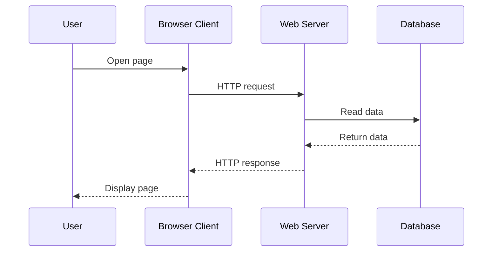
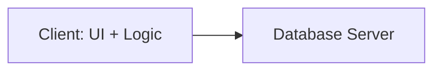
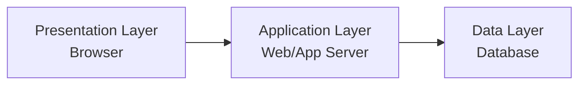
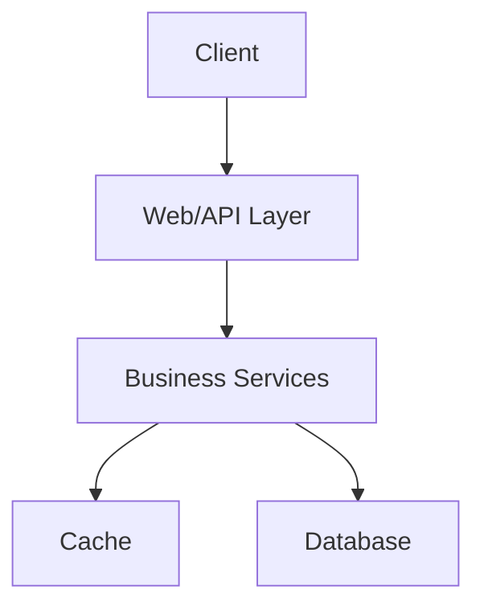

# 🖥️ Chapter 3: Client–Server Architecture


> [!TIP]
> **Chapter Goal:** Samajhna ki client request kaise bhejta hai, server usse kaise process karta hai aur response user tak kaise pahunchta hai.

---

## 🎯 3.1 Learning Objectives

After completing this chapter, you will be able to:

1. Define client–server architecture.
2. Explain the roles of a client, server and network.
3. Describe the request-response cycle.
4. Differentiate between client-side and server-side processing.
5. Understand one-tier, two-tier, three-tier and n-tier architectures.
6. Explain thin clients and thick clients.
7. Identify the advantages and limitations of client–server systems.
8. Apply the concept to real web applications.

---

## 🗣️ 3.2 Difficult Words: Pronunciation and Meaning

| 🔤 Word | 🔊 Pronunciation | 💡 Simple Meaning |
|---|---|---|
| Architecture | आर्किटेक्चर — *ar-ki-tek-cher* | System ka structure ya design |
| Client | क्लाइंट — *klai-unt* | Service request karne wala |
| Server | सर्वर — *sur-ver* | Service ya data provide karne wala |
| Request | रिक्वेस्ट — *ri-kwest* | Kisi resource ki maang |
| Response | रिस्पॉन्स — *ri-spons* | Request ka answer |
| Processing | प्रोसेसिंग — *pro-ses-ing* | Data par operation karna |
| Database | डेटाबेस — *day-tuh-base* | Organized data collection |
| Interface | इंटरफेस — *in-ter-face* | Interaction ka visible medium |
| Authentication | ऑथेन्टिकेशन — *aw-then-ti-kay-shun* | Identity verify karna |
| Scalability | स्केलेबिलिटी — *skay-luh-bil-uh-tee* | System ko growth ke liye expand karna |
| Availability | अवेलेबिलिटी — *uh-vay-luh-bil-uh-tee* | Service ka available hona |
| Middleware | मिडलवेयर — *mid-ul-wair* | Do system parts ko connect karne wala software |
| Latency | लेटेंसी — *lay-ten-see* | Response milne me delay |
| Concurrent | कनकरंट — *kun-kur-unt* | Ek samay par multiple operations |

---

## 💡 3.3 Meaning of Client–Server Architecture

### 3.3.1 English Explanation

Client–server architecture is a computing model in which a client requests a resource or service and a server receives the request, processes it and returns a response through a network.

A client may be a browser, mobile application or desktop program. A server may provide web pages, files, application logic, authentication or database data.

### 3.3.2 Hinglish Explanation

Client–Server Architecture ek system design hai jisme:

1. **Client** service ya data ki request bhejta hai.
2. **Server** request receive karta hai.
3. Server request ko process karta hai.
4. Server client ko response bhejta hai.

> [!IMPORTANT]
> **Client maangta hai; server provide karta hai.**

### 3.3.3 Everyday Example

Restaurant me:

| Restaurant | Client–Server System |
|---|---|
| Customer | Client |
| Food order | Request |
| Waiter/order system | Network or communication medium |
| Kitchen | Server |
| Prepared food | Response |

---

## 👤 3.4 Client

### 3.4.1 Definition

A client is a hardware device or software application that requests and uses services provided by a server.

### 3.4.2 Examples

- Web browser
- Mobile banking application
- Email application
- Desktop database application
- Smart television application

### 3.4.3 Main Functions of a Client

1. Provides a user interface.
2. Accepts user input.
3. Creates and sends requests.
4. Receives server responses.
5. Displays or processes results.
6. May perform client-side validation and calculations.

### Hinglish

Jab aap Chrome me website open karte ho, Chrome client ka work karta hai. Wo server ko request bhejta hai aur received page ko screen par display karta hai.

---

## 🗄️ 3.5 Server

### 3.5.1 Definition

A server is a computer or software system that listens for client requests and provides resources, data or services.

### 3.5.2 Main Functions of a Server

1. Listens for requests.
2. Verifies access when required.
3. Runs application logic.
4. Communicates with databases.
5. Manages shared resources.
6. Sends appropriate responses.
7. Handles multiple clients.

### 3.5.3 Types of Servers

| Server Type | Main Purpose |
|---|---|
| Web server | Delivers web pages and resources |
| Application server | Runs business or application logic |
| Database server | Stores and manages database data |
| File server | Stores and shares files |
| Mail server | Sends and receives email |
| DNS server | Resolves domain names |
| Authentication server | Verifies user identity |
| Proxy server | Works as an intermediary |

> [!NOTE]
> Ek physical computer multiple server programs chala sakta hai. Isi tarah ek large service multiple physical ya virtual servers use kar sakti hai.

---

## 🌐 3.6 Network and Communication

The client and server communicate through a network. This network may be:

- The Internet
- A local area network
- An Intranet
- A private cloud network

Web clients and servers commonly communicate using HTTP or HTTPS over TCP/IP.

---

## 🔄 3.7 Request–Response Cycle

### 3.7.1 Main Steps

1. User enters a URL or performs an action.
2. Client prepares a request.
3. Request travels through the network.
4. Server receives the request.
5. Server validates and processes it.
6. Server may communicate with a database.
7. Server prepares a response.
8. Response travels back to the client.
9. Client displays the result.

### 3.7.2 Visual Flow



### 3.7.3 Simple Example

User opens:

```text
https://example.com/students
```

Possible request:

```http
GET /students HTTP/1.1
Host: example.com
```

Possible response:

```http
HTTP/1.1 200 OK
Content-Type: text/html
```

The response body may contain HTML that the browser renders.

---

## 🧾 3.8 Request Components

A web request commonly includes:

1. **Method:** Desired action, such as GET or POST
2. **URL or path:** Requested resource
3. **Headers:** Additional information
4. **Body:** Data sent with some requests
5. **Cookies or token:** Session or authorization information when required

### Common HTTP Methods

| Method | Basic Purpose |
|---|---|
| GET | Retrieve data |
| POST | Submit or create data |
| PUT | Replace data |
| PATCH | Partially update data |
| DELETE | Remove data |

Detailed HTTP concepts will be covered in Chapter 6.

---

## 📦 3.9 Response Components

A web response commonly includes:

1. **Status code:** Result of the request
2. **Headers:** Information about the response
3. **Body:** HTML, JSON, image, file or other data

### Common Status Codes

| Code | Meaning |
|---|---|
| 200 | Request successful |
| 201 | Resource created |
| 400 | Bad request |
| 401 | Authentication required |
| 403 | Access forbidden |
| 404 | Resource not found |
| 500 | Internal server error |

---

## 💻 3.10 Client-Side and Server-Side Processing

### 3.10.1 Client-Side Processing

Processing performed on the user's device, usually inside the browser.

**Common technologies:**

- HTML
- CSS
- JavaScript

**Examples:**

- Showing a menu
- Changing page color
- Checking whether a required form field is empty
- Creating animations

### 3.10.2 Server-Side Processing

Processing performed on the server.

**Common technologies:**

- PHP
- Java
- Python
- Node.js
- .NET

**Examples:**

- Checking login credentials
- Reading database records
- Processing an order
- Generating a personalized dashboard

### 3.10.3 Difference

| Basis | Client Side | Server Side |
|---|---|---|
| Runs on | User's device/browser | Server |
| Code visibility | Often visible or downloadable | Normally hidden from user |
| Common work | Interface and interaction | Logic, security and data |
| Internet need | Some work can continue locally | Communication usually required |
| Examples | HTML, CSS, JavaScript | PHP, Python, Java, Node.js |

> [!CAUTION]
> Client-side validation useful hai, lekin security ke liye server-side validation bhi necessary hai. User browser ke client-side checks ko modify ya bypass kar sakta hai.

---

## 🏗️ 3.11 Types of Application Architecture

## 3.11.1 One-Tier Architecture

User interface, application logic and data are present in the same system.

```text
User Interface + Logic + Data
         One System
```

**Example:** A simple offline desktop application.

**Advantages:** Simple and fast for local use.  
**Limitation:** Sharing and centralized management are difficult.

---

## 3.11.2 Two-Tier Architecture

The client communicates directly with a database server.



**Example:** A desktop application connected directly to a central database.

**Advantages:**

- Simple design
- Suitable for small systems
- Direct database communication

**Limitations:**

- Harder to scale
- Business logic may be duplicated
- Direct database access creates security concerns

---

## 3.11.3 Three-Tier Architecture

The system is divided into three layers:

1. Presentation layer
2. Application or business-logic layer
3. Data layer



### Layer Explanation

| Layer | Responsibility |
|---|---|
| Presentation layer | User interface and user input |
| Application layer | Rules, processing and validation |
| Data layer | Data storage and retrieval |

**Example:** Most database-driven web applications.

**Advantages:**

- Better security
- Easier maintenance
- Improved scalability
- Clear separation of responsibilities

---

## 3.11.4 N-Tier Architecture

N-tier architecture divides an application into several layers or services. It may include a presentation layer, API gateway, application services, authentication service, caching layer and database layer.



**Use:** Large and complex applications.

> [!TIP]
> **Tier** usually indicates a separately deployed part of a system, while **layer** describes a logical responsibility. In basic study material, both words are sometimes used loosely.

---

## 🪶 3.12 Thin Client and Thick Client

### 3.12.1 Thin Client

A thin client performs limited processing and depends more on the server.

**Example:** A basic browser-based system where most logic runs on the server.

### 3.12.2 Thick Client

A thick client performs more processing on the user's device and may store local resources.

**Example:** A feature-rich desktop application connected to a server.

| Basis | Thin Client | Thick Client |
|---|---|---|
| Local processing | Less | More |
| Server dependence | Higher | Lower for some tasks |
| Installation | Usually lighter | Often larger |
| Updates | Often centralized | May require client updates |
| Offline ability | Usually limited | Often better |

---

## 🛒 3.13 Example: Online Shopping Application

When a user buys a product:

1. Browser shows the product page.
2. User clicks **Add to Cart**.
3. Client sends product information to the server.
4. Server checks product availability.
5. Server reads or updates database data.
6. Server returns the updated cart.
7. Browser displays the result.
8. During checkout, the server validates details and processes the order.

### Responsibilities

| Component | Responsibility |
|---|---|
| Client | Interface, clicks and form input |
| Web server | Receives web requests |
| Application logic | Cart, price and order rules |
| Database | Products, users and orders |
| Payment service | Payment authorization |

---

## 🔐 3.14 Security in Client–Server Systems

Basic security requirements include:

1. HTTPS for protected communication
2. User authentication
3. Authorization and access control
4. Server-side input validation
5. Secure password storage
6. Database protection
7. Regular software updates
8. Logging and monitoring
9. Backup and recovery
10. Protection against excessive requests

> [!WARNING]
> Password ko URL me send nahi karna chahiye. Sensitive data ko secure connection aur proper server-side protection ki zarurat hoti hai.

---

## ⚡ 3.15 Performance and Scalability

### 3.15.1 Caching

Frequently used data is stored temporarily for faster access.

### 3.15.2 Load Balancing

Client requests are distributed among multiple servers.

### 3.15.3 Database Optimization

Indexes, efficient queries and proper database design improve performance.

### 3.15.4 Content Delivery Network

Static resources can be delivered from servers closer to users.

### 3.15.5 Horizontal and Vertical Scaling

- **Vertical scaling:** Add more power to one server.
- **Horizontal scaling:** Add more servers.

---

## ✅ 3.16 Advantages of Client–Server Architecture

1. Centralized data management
2. Easier backup and recovery
3. Better access control
4. Resource sharing
5. Easier server-side updates
6. Support for multiple clients
7. Improved scalability
8. Consistent application rules

---

## ⚠️ 3.17 Limitations

1. Server failure can affect many clients.
2. Network failure can interrupt communication.
3. Heavy traffic may reduce performance.
4. Server setup and maintenance can be costly.
5. Central servers can become security targets.
6. Proper scaling requires planning.
7. Clients may depend strongly on server availability.

---

## 🔀 3.18 Client–Server vs Peer-to-Peer

| Basis | Client–Server | Peer-to-Peer |
|---|---|---|
| Control | More centralized | More distributed |
| Roles | Clients request; servers provide | Peers may both request and provide |
| Management | Usually easier | Can be more difficult |
| Data location | Often centralized | Distributed among peers |
| Example | Web application | Peer file-sharing system |

---

## 🚫 3.19 Common Mistakes

1. Client ko sirf physical computer samajhna.
2. Server ko sirf powerful hardware samajhna.
3. Database aur server ko exactly same samajhna.
4. Client-side validation ko complete security samajhna.
5. Request aur response ka direction reverse karna.
6. Three-tier architecture me browser ko database se directly connect karna.
7. HTTP status code ko application data samajhna.

---

## 📌 3.20 Key Points to Remember

- Client request bhejta hai; server response deta hai.
- Browser ek common web client hai.
- Server software resources aur services provide karta hai.
- Network client aur server ko connect karta hai.
- Request me method, path, headers aur optional body ho sakti hai.
- Three-tier architecture presentation, logic aur data ko separate karti hai.
- Server-side validation security ke liye essential hai.
- Caching, load balancing aur scaling performance improve kar sakte hain.

---

## 📝 3.21 Chapter Summary

Client–server architecture divides responsibilities between service-requesting clients and service-providing servers. A client sends a request through a network, and the server processes it and returns a response. Web applications often separate presentation, business logic and data into tiers. This separation improves maintenance, security and scalability. Modern systems may use multiple servers, services, caches and databases. A reliable design must consider performance, availability and security.

---

## 🎲 3.22 Multiple-Choice Questions

### 1. Which component normally initiates a web request?

A. Database  
B. Client  
C. Router only  
D. Printer  

**✅ Answer:** B

### 2. Which status code means “Not Found”?

A. 200  
B. 201  
C. 404  
D. 500  

**✅ Answer:** C

### 3. In three-tier architecture, business rules belong mainly to:

A. Presentation layer  
B. Application layer  
C. Keyboard  
D. Network cable  

**✅ Answer:** B

### 4. Which processing occurs in the browser?

A. Client-side processing  
B. Database-only processing  
C. Server-only processing  
D. Router processing  

**✅ Answer:** A

### 5. Load balancing is used to:

A. Delete all requests  
B. Distribute requests among servers  
C. Replace HTML  
D. Create passwords  

**✅ Answer:** B

### 6. Which is a server-side technology?

A. CSS  
B. HTML  
C. PHP  
D. Browser tab  

**✅ Answer:** C

### 7. A thin client depends more on:

A. Printer  
B. Server  
C. Keyboard  
D. Local battery  

**✅ Answer:** B

### 8. Which method is commonly used to retrieve data?

A. GET  
B. DELETE  
C. PATCH  
D. PRINT  

**✅ Answer:** A

---

## ✍️ 3.23 Fill in the Blanks

1. A __________ requests a service.
2. A server returns a __________.
3. The __________ layer stores and retrieves data.
4. HTTP status code __________ means resource not found.
5. Adding more servers is called __________ scaling.

<details>
<summary><strong>✅ View Answers</strong></summary>

1. client  
2. response  
3. data  
4. 404  
5. horizontal

</details>

---

## ❓ 3.24 Short-Answer Questions

1. Define client–server architecture.
2. What is a client?
3. What is a server?
4. Define request and response.
5. What is client-side processing?
6. What is server-side processing?
7. What is two-tier architecture?
8. Name the layers of three-tier architecture.
9. Define thin client.
10. What is load balancing?

---

## 📚 3.25 Long-Answer and Exam Questions

1. Explain client–server architecture with a diagram.
2. Describe the complete web request-response cycle.
3. Differentiate between client-side and server-side processing.
4. Explain one-tier, two-tier and three-tier architecture.
5. Explain n-tier architecture and its use.
6. Differentiate between thin and thick clients.
7. Discuss the advantages and limitations of client–server architecture.
8. Explain security and scalability in client–server systems.
9. Differentiate between client–server and peer-to-peer architecture.

---

## 🧪 3.26 Practical Activities

1. Open browser Developer Tools and observe network requests.
2. Visit a missing page and note its HTTP status code.
3. Draw a three-tier architecture diagram.
4. List five clients and five server types.
5. Identify client-side and server-side tasks in a login form.
6. Describe the request-response flow for an online shopping cart.
7. Compare a browser application with a desktop application.

---

## 🎤 3.27 Viva Questions

1. Who sends a request?
2. Who sends a response?
3. Is a browser a client?
4. Can one server handle multiple clients?
5. What does status code 200 mean?
6. What does status code 500 indicate?
7. Name the three layers of three-tier architecture.
8. Why is server-side validation required?
9. What is horizontal scaling?
10. What is the role of a database server?

<details>
<summary><strong>✅ View Short Viva Answers</strong></summary>

1. The client.  
2. The server.  
3. Yes.  
4. Yes.  
5. The request was successful.  
6. An internal server error.  
7. Presentation, application and data layers.  
8. Client checks can be changed or bypassed.  
9. Adding more servers.  
10. It stores and manages database data.

</details>

---

## 🏁 3.28 One-Minute Revision

| Question | Quick Answer |
|---|---|
| Client ka work? | Request bhejna aur result display karna |
| Server ka work? | Request process karke response dena |
| Browser kya hai? | Common web client |
| 200 ka meaning? | Success |
| 404 ka meaning? | Not found |
| Three tiers? | Presentation, application, data |
| Thin client? | Server par zyada dependent |
| Thick client? | Local processing zyada |
| Load balancing? | Requests ko multiple servers me distribute karna |
| Horizontal scaling? | More servers add karna |

---

[⬅️ Previous Chapter](02-internet-and-world-wide-web.md) · [📚 Table of Contents](../SUMMARY.md) · **Next: Web Browsers and Web Servers ➡️**
