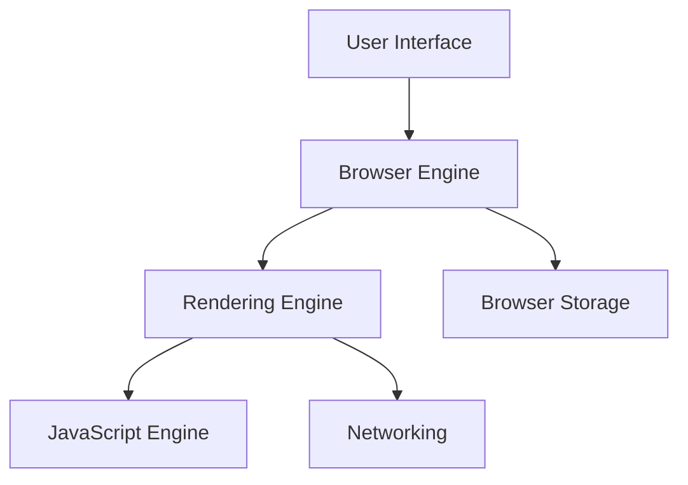
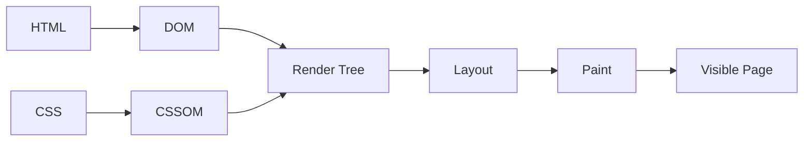
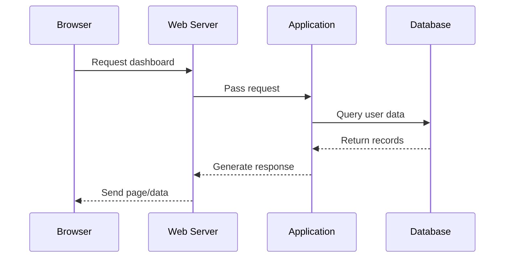
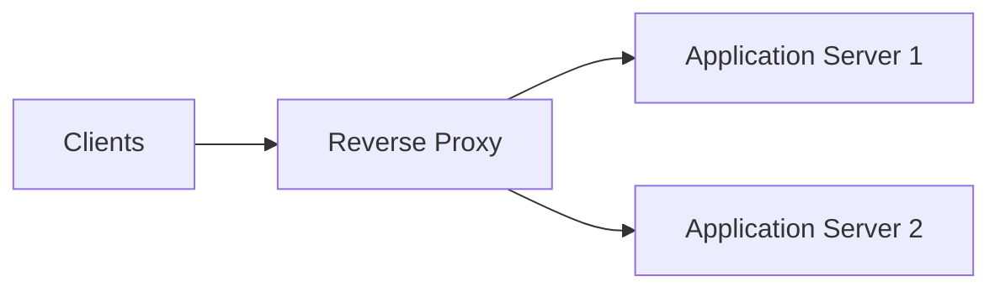
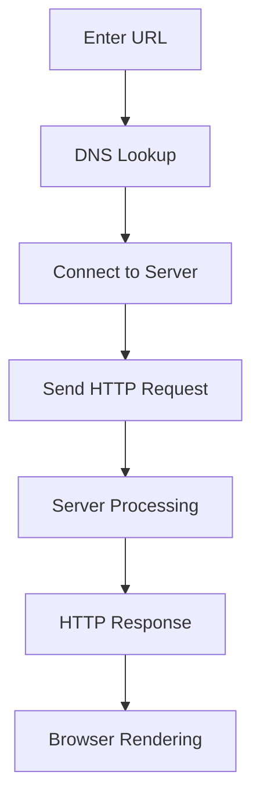

# 🌐 Chapter 4: Web Browsers and Web Servers


> [!TIP]
> **Chapter Goal:** Samajhna ki browser web content ko kaise request aur display karta hai, aur web server requests ko kaise handle karke resources return karta hai.

---

## 🎯 4.1 Learning Objectives

After completing this chapter, you will be able to:

1. Define a web browser and a web server.
2. Explain the main components of a browser.
3. Describe how a browser renders a web page.
4. Identify popular browser and server software.
5. Explain the functions and types of web servers.
6. Differentiate between browser, search engine and web server.
7. Understand static and dynamic content delivery.
8. Use basic browser developer tools.
9. Explain browser–server communication.

---

## 🗣️ 4.2 Difficult Words: Pronunciation and Meaning

| 🔤 Word | 🔊 Pronunciation | 💡 Simple Meaning |
|---|---|---|
| Browser | ब्राउज़र — *brow-zer* | Web pages open karne wala software |
| Server | सर्वर — *sur-ver* | Resources ya services provide karne wala system |
| Rendering | रेंडरिंग — *ren-der-ing* | Code ko visible page me badalna |
| Engine | इंजन — *en-jin* | Processing karne wala main component |
| Interface | इंटरफेस — *in-ter-face* | User ke interaction ka visible part |
| Navigation | नैविगेशन — *nav-i-gay-shun* | Pages ke beech move karna |
| Cache | कैश — *kash* | Fast access ke liye temporary storage |
| Cookie | कुकी — *koo-kee* | Website dwara browser me stored small data |
| Extension | एक्सटेंशन — *eks-ten-shun* | Browser me extra feature add karne wala program |
| Compatibility | कम्पैटिबिलिटी — *kum-pat-uh-bil-uh-tee* | Saath me properly work karne ki ability |
| Virtual Host | वर्चुअल होस्ट — *vur-choo-ul host* | Ek server par multiple websites chalane ka setup |
| Configuration | कॉन्फिगरेशन — *kun-fig-yuh-ray-shun* | System settings |
| Encryption | एन्क्रिप्शन — *en-krip-shun* | Data ko protected form me badalna |
| Interpreter | इंटरप्रेटर — *in-tur-pri-ter* | Code ko read aur execute karne wala component |

---

# 🟦 Part A: Web Browser

## 💡 4.3 What Is a Web Browser?

### 4.3.1 English Explanation

A web browser is client software that requests web resources from servers, interprets received HTML, CSS and JavaScript, and presents the result as an interactive web page.

### 4.3.2 Hinglish Explanation

Web browser ek client software hai jo server se web page mangta hai. Server se mile HTML, CSS aur JavaScript ko process karke browser readable aur interactive page ke form me screen par show karta hai.

> [!IMPORTANT]
> Browser Internet nahi hai. Browser Internet aur Web ko access karne ka ek software hai.

### 4.3.3 Popular Web Browsers

| Browser | Organization/Project | Rendering Engine |
|---|---|---|
| Google Chrome | Google | Blink |
| Microsoft Edge | Microsoft | Blink |
| Mozilla Firefox | Mozilla | Gecko |
| Safari | Apple | WebKit |
| Opera | Opera | Blink |

---

## 🛠️ 4.4 Main Functions of a Browser

A browser performs the following functions:

1. Accepts a URL from the user.
2. Sends HTTP or HTTPS requests.
3. Receives resources from web servers.
4. Interprets HTML.
5. Applies CSS rules.
6. Executes JavaScript.
7. Displays text, images, audio and video.
8. Provides navigation controls.
9. Stores cache, cookies and browsing history.
10. Enforces browser security rules.
11. Supports downloads, bookmarks and extensions.
12. Provides developer tools.

---

## 🧩 4.5 Main Components of a Browser

### 4.5.1 User Interface

The user interface includes visible controls such as:

- Address bar
- Back and Forward buttons
- Reload button
- Home button
- Tabs
- Bookmarks
- Menu
- Download panel

### 4.5.2 Browser Engine

The browser engine coordinates actions between the user interface and rendering engine.

### 4.5.3 Rendering Engine

The rendering engine reads HTML and CSS and converts them into a visual page.

**Examples:** Blink, WebKit and Gecko.

### 4.5.4 JavaScript Engine

The JavaScript engine reads and executes JavaScript code.

| Browser | JavaScript Engine |
|---|---|
| Chrome/Edge | V8 |
| Firefox | SpiderMonkey |
| Safari | JavaScriptCore |

### 4.5.5 Networking Component

It handles network communication, including HTTP/HTTPS requests and resource downloads.

### 4.5.6 Data Storage

Browsers can store:

- Cookies
- Cache
- Browsing history
- Local storage
- Session storage
- Saved passwords, with user permission

### 4.5.7 User Interface Backend

It draws basic controls such as buttons, input boxes and windows using the operating system or browser's own interface system.

### Browser Structure



---

## 🎨 4.6 How a Browser Renders a Web Page

### 4.6.1 Basic Rendering Steps

1. Browser receives HTML.
2. It parses HTML and creates the **DOM**.
3. It parses CSS and creates the **CSSOM**.
4. DOM and CSSOM are combined into a render tree.
5. Browser calculates element size and position during layout.
6. Browser paints colors, text, borders and images.
7. It combines painted layers and displays the final page.
8. JavaScript may change the DOM or styles, causing updates.



### 4.6.2 Hinglish Explanation

Browser HTML se page ka structure samajhta hai aur CSS se design. Dono ko combine karke elements ki position calculate karta hai. Uske baad text, color, image aur border screen par paint karta hai.

> [!NOTE]
> JavaScript page load hone ke baad bhi content aur styles change kar sakta hai. Isliye browser ko kuch parts dobara layout ya paint karne pad sakte hain.

---

## 🧭 4.7 Browser Navigation

### 4.7.1 Address Bar

Used to enter a URL or search query.

### 4.7.2 Back and Forward

Used to move through browsing history.

### 4.7.3 Reload

Requests or displays the page again.

### 4.7.4 Tabs

Allow multiple web pages to remain open in one browser window.

### 4.7.5 Bookmark

Stores a page address for quick future access.

### 4.7.6 History

Keeps a record of visited pages according to browser settings.

---

## 💾 4.8 Cache and Cookies

### 4.8.1 Browser Cache

Cache temporarily stores copies of resources such as images, CSS and JavaScript.

**Benefit:** Frequently used resources can load faster.

**Hinglish:** Browser har baar same image server se download karne ke bajay cached copy use kar sakta hai.

### 4.8.2 Cookies

Cookies are small pieces of data that a website asks the browser to store and send with relevant future requests.

Cookies may be used for:

- Session identification
- Login state
- Preferences
- Shopping cart
- Analytics

### 4.8.3 Cache vs Cookies

| Basis | Cache | Cookies |
|---|---|---|
| Main purpose | Faster resource loading | State or small information |
| Common data | Images, CSS, JavaScript | Session ID and preferences |
| Created from | Received resources and cache rules | Server instructions or browser code |
| Sent to server | Normally no | Relevant cookies may be sent |
| Typical size | Can be relatively large | Small |

> [!CAUTION]
> Cookies me plain-text password store nahi karna chahiye. Sensitive session cookies ko secure settings ke saath use kiya jana chahiye.

---

## 🧩 4.9 Browser Extensions

A browser extension adds extra features to a browser.

**Examples:**

- Password manager
- Grammar checker
- Accessibility tool
- Developer utility
- Content blocker

> [!WARNING]
> Extension install karne se pehle uski permissions aur source check karein. Untrusted extensions browsing data access kar sakti hain.

---

## 🔍 4.10 Browser vs Search Engine

| Browser | Search Engine |
|---|---|
| Device par chalne wala client software | Web par information search karne wali service |
| Websites ko request aur display karta hai | Relevant pages ke links find karta hai |
| Example: Chrome | Example: Google Search |
| Example: Firefox | Example: Bing |

**Example:** Google Search ko Chrome, Firefox ya Edge kisi bhi browser me open kiya ja sakta hai.

---

## 🧰 4.11 Browser Developer Tools

Modern browsers provide Developer Tools, commonly opened with **F12** or **Ctrl + Shift + I** on Windows/Linux.

### Important Panels

| Panel | Use |
|---|---|
| Elements/Inspector | HTML and CSS inspect karna |
| Console | JavaScript messages aur errors dekhna |
| Network | Requests, responses, time aur status inspect karna |
| Sources | JavaScript files aur debugging |
| Application/Storage | Cookies, cache and local storage inspect karna |
| Performance | Page performance analyze karna |
| Lighthouse | Quality checks in supported browsers |

### Simple Activity

1. Open a website.
2. Press **F12**.
3. Open the **Network** panel.
4. Reload the page.
5. Observe files, methods and status codes.

> [!TIP]
> Developer Tools me kiya gaya temporary HTML/CSS change original website ko permanently change nahi karta.

---

# 🟩 Part B: Web Server

## 🗄️ 4.12 What Is a Web Server?

### 4.12.1 English Explanation

A web server is software, and often the computer running that software, which receives HTTP/HTTPS requests and returns web resources or generated responses.

### 4.12.2 Hinglish Explanation

Web server client ki web request receive karta hai. Phir requested file directly return karta hai ya application code chala kar dynamic response generate karta hai.

> [!IMPORTANT]
> **Web server** word software aur us software ko chalane wale computer—dono ke liye use ho sakta hai. Context se meaning samjha jata hai.

---

## ⚙️ 4.13 Main Functions of a Web Server

1. Listens for client connections.
2. Accepts HTTP and HTTPS requests.
3. Locates requested resources.
4. Serves static files.
5. Passes dynamic requests to application code.
6. Sends status codes and response headers.
7. Supports encryption through TLS configuration.
8. Records request and error logs.
9. Controls access to resources.
10. Hosts one or multiple websites.
11. Applies caching and compression rules.
12. Handles many client connections.

---

## 🧱 4.14 Static and Dynamic Content

### 4.14.1 Static Content

Static content is sent mainly as stored.

**Examples:**

- HTML files
- CSS files
- JavaScript files
- Images
- PDF documents

### 4.14.2 Dynamic Content

Dynamic content is generated or customized when a request is processed.

**Examples:**

- User dashboard
- Search results
- Shopping cart
- Bank account summary
- Student marks page

### 4.14.3 Dynamic Response Flow



---

## 🧰 4.15 Popular Web Server Software

| Software | Main Characteristic |
|---|---|
| Apache HTTP Server | Popular, flexible and module-based |
| Nginx | Efficient for concurrent connections and reverse proxy use |
| Microsoft IIS | Integrated with Microsoft Windows Server |
| Caddy | Automatic HTTPS-focused configuration |
| LiteSpeed | Performance-focused commercial/open variants |

> [!NOTE]
> Server software ka selection application, operating system, traffic, skills aur deployment requirements par depend karta hai.

---

## 📂 4.16 Document Root

The document root is the main directory from which a web server serves website files.

Example:

```text
website-root/
├── index.html
├── css/
│   └── style.css
├── js/
│   └── app.js
└── images/
    └── logo.png
```

When the root URL is requested, the server may return a default file such as `index.html`.

---

## 🏠 4.17 Web Hosting and Virtual Hosts

### 4.17.1 Web Hosting

Web hosting provides server resources needed to make a website available through a network or the Internet.

### 4.17.2 Virtual Hosting

Virtual hosting allows multiple websites or domain names to be hosted on one server.

Example:

```text
One Web Server
├── example-one.com
├── example-two.com
└── college-portal.in
```

The server uses the requested host or domain to select the correct website.

---

## 🧾 4.18 Server Logs

### 4.18.1 Access Log

Records incoming requests and related information.

It may contain:

- Request time
- Client address
- Requested path
- HTTP method
- Status code
- Response size

### 4.18.2 Error Log

Records server problems and application-related errors.

**Uses of logs:**

1. Troubleshooting
2. Security monitoring
3. Traffic analysis
4. Performance investigation

> [!CAUTION]
> Logs me sensitive data unnecessarily record nahi karna chahiye. Log access bhi authorized users tak limited hona chahiye.

---

## 🔁 4.19 Proxy and Reverse Proxy

### 4.19.1 Forward Proxy

A forward proxy works on behalf of clients while accessing other servers.

### 4.19.2 Reverse Proxy

A reverse proxy receives requests on behalf of one or more back-end servers.

A reverse proxy may provide:

- Load balancing
- TLS termination
- Caching
- Compression
- Request routing
- Security filtering



---

## 🔐 4.20 Basic Server Security

1. Use HTTPS.
2. Keep server software updated.
3. Disable unnecessary services and modules.
4. Use strong authentication.
5. Apply correct file permissions.
6. Validate all user input.
7. Protect configuration and secret files.
8. Monitor access and error logs.
9. Use backups and recovery plans.
10. Apply firewall and rate-limit rules where appropriate.

---

# 🟪 Part C: Browser–Server Communication

## 🔄 4.21 Complete Communication Process

When a user opens a website:

1. User enters the URL in a browser.
2. Browser identifies the protocol and domain.
3. DNS resolves the domain into an IP address.
4. Browser establishes a network connection.
5. For HTTPS, a secure TLS connection is established.
6. Browser sends an HTTP request.
7. Web server receives and processes it.
8. Server returns an HTTP response.
9. Browser downloads referenced resources.
10. Browser renders and displays the page.



---

## 🆚 4.22 Browser vs Web Server

| Basis | Web Browser | Web Server |
|---|---|---|
| Role | Client | Service provider |
| Main work | Requests and displays content | Receives requests and sends content |
| Runs on | User device | Server system |
| Handles | Interface and rendering | Resources, routing and server rules |
| Example | Chrome | Apache |
| Sends first | Request | Response after request |
| Common technologies | HTML/CSS/JS engines | Apache, Nginx, IIS |

---

## 🧪 4.23 Example: Opening a College Website

Suppose the user opens:

```text
https://college.example/results
```

1. Browser resolves the domain.
2. It connects securely to the server.
3. Browser sends a request for `/results`.
4. Server checks the requested route.
5. Application may ask the user to log in.
6. After authentication, it reads result data.
7. Server returns HTML or data.
8. Browser renders the result page.

---

## 🌍 4.24 Cross-Browser Compatibility

A website should work properly across major browsers and devices.

### Common Causes of Differences

- Unsupported or differently implemented features
- Old browser versions
- Incorrect HTML or CSS
- Browser-specific default styles
- Device and screen differences

### Good Practices

1. Use standard HTML, CSS and JavaScript.
2. Test in multiple browsers.
3. Use responsive design.
4. Provide fallback behavior where needed.
5. Avoid unnecessary browser-specific code.
6. Test keyboard and assistive-technology access.

---

## 🕵️ 4.25 Private Browsing: Important Facts

Private or incognito mode usually prevents the browser from keeping normal local history, cookies and form data after the private session closes.

It does **not** automatically hide activity from:

- Visited websites
- Internet service provider
- College or office network administrator
- Malware on the device

> [!WARNING]
> Incognito mode complete anonymity tool nahi hai.

---

## 🚫 4.26 Common Mistakes

1. Browser aur search engine ko same samajhna.
2. Browser ko Internet kehna.
3. Web server ko sirf hardware samajhna.
4. Cache aur cookies ko same samajhna.
5. Developer Tools change ko permanent website change samajhna.
6. Incognito mode ko complete anonymity samajhna.
7. Client-side data ko automatically trusted samajhna.
8. Web server aur database server ko same samajhna.

---

## 📌 4.27 Key Points to Remember

- Browser web client software hai.
- Rendering engine HTML aur CSS ko visible page me convert karta hai.
- JavaScript engine JavaScript execute karta hai.
- Cache loading speed improve kar sakta hai.
- Cookies state aur small information store kar sakti hain.
- Web server HTTP/HTTPS requests handle karta hai.
- Server static files serve ya dynamic responses generate kar sakta hai.
- Virtual hosting ek server par multiple sites host kar sakti hai.
- Reverse proxy back-end servers ke behalf par requests receive karta hai.
- Browser aur server request-response model se communicate karte hain.

---

## 📝 4.28 Chapter Summary

A web browser is client software that requests, interprets and displays web content. Its major parts include the user interface, browser engine, rendering engine, JavaScript engine, networking component and storage. A web server receives HTTP/HTTPS requests and returns static resources or dynamic responses. Apache, Nginx and IIS are examples of web server software. Browsers and servers communicate through a request-response process. Secure and reliable web systems require correct configuration, standard code, careful storage handling and regular security updates.

---

## 🎲 4.29 Multiple-Choice Questions

### 1. Which component converts HTML and CSS into a visible page?

A. Database server  
B. Rendering engine  
C. Keyboard driver  
D. Search engine  

**✅ Answer:** B

### 2. Which is web server software?

A. Firefox  
B. Chrome  
C. Apache  
D. Google Search  

**✅ Answer:** C

### 3. Which browser uses the Gecko rendering engine?

A. Firefox  
B. Safari  
C. Edge  
D. Chrome  

**✅ Answer:** A

### 4. Browser cache is mainly used to:

A. Increase repeated loading speed  
B. Create domain names  
C. Replace the Internet  
D. Store databases permanently  

**✅ Answer:** A

### 5. Which log records incoming requests?

A. Access log  
B. Keyboard log  
C. CSS log  
D. Bookmark log  

**✅ Answer:** A

### 6. Multiple websites on one server can be supported through:

A. Virtual hosting  
B. Search history  
C. Incognito mode  
D. JavaScript alert  

**✅ Answer:** A

### 7. Which component executes JavaScript?

A. DNS server  
B. JavaScript engine  
C. Search engine  
D. File server  

**✅ Answer:** B

### 8. A reverse proxy works mainly on behalf of:

A. Back-end servers  
B. Keyboard users  
C. HTML tags  
D. Browser bookmarks  

**✅ Answer:** A

---

## ✍️ 4.30 Fill in the Blanks

1. A browser acts as a web __________.
2. The __________ engine displays HTML and CSS visually.
3. Apache and Nginx are __________ server software.
4. Small website-related data stored by a browser is called a __________.
5. The main website directory is often called the document __________.

<details>
<summary><strong>✅ View Answers</strong></summary>

1. client  
2. rendering  
3. web  
4. cookie  
5. root

</details>

---

## ❓ 4.31 Short-Answer Questions

1. Define a web browser.
2. Name four web browsers.
3. What is a rendering engine?
4. What is browser cache?
5. Define a cookie.
6. What are browser Developer Tools?
7. Define a web server.
8. Name three web server programs.
9. What is a document root?
10. Define virtual hosting.
11. What is a reverse proxy?
12. Differentiate between browser and search engine.

---

## 📚 4.32 Long-Answer and Exam Questions

1. Explain the main components of a web browser with a diagram.
2. Describe how a browser renders a web page.
3. Explain cache and cookies. Differentiate between them.
4. Define a web server and explain its major functions.
5. Differentiate between static and dynamic content.
6. Explain browser–server communication step by step.
7. Differentiate between a browser and a web server.
8. Explain virtual hosting, server logs and reverse proxy.
9. Discuss cross-browser compatibility and good development practices.
10. Explain basic browser and server security considerations.

---

## 🧪 4.33 Practical Activities

1. Open Developer Tools using **F12**.
2. Inspect the HTML of a heading.
3. Temporarily change its color in the Elements panel.
4. Open the Network panel and reload the page.
5. Note one request method and status code.
6. Find the browser's cookie and cache controls.
7. Compare the same page in two browsers.
8. Find the rendering engine used by your browser.
9. Create a folder containing `index.html` and open it locally.
10. List three differences between local file opening and server-based access.

---

## 🎤 4.34 Viva Questions

1. Is a browser a client or server?
2. What does a rendering engine do?
3. Name Chrome's JavaScript engine.
4. What is browser cache?
5. Why are cookies used?
6. Is Chrome a search engine?
7. What does a web server do?
8. Give two examples of web server software.
9. What is static content?
10. What is virtual hosting?
11. What does an access log contain?
12. Does incognito mode make a user completely anonymous?

<details>
<summary><strong>✅ View Short Viva Answers</strong></summary>

1. Client.  
2. It converts page structure and styles into a visual page.  
3. V8.  
4. Temporary storage used to speed up resource loading.  
5. To maintain small pieces of state or information.  
6. No, it is a browser.  
7. It receives web requests and returns resources or responses.  
8. Apache and Nginx.  
9. Content mainly sent as stored.  
10. Hosting multiple websites on one server.  
11. Request-related details such as path and status.  
12. No.

</details>

---

## 🏁 4.35 One-Minute Revision

| Question | Quick Answer |
|---|---|
| Browser kya hai? | Web client software |
| Browser ka main output? | Rendered web page |
| Rendering engine examples? | Blink, Gecko, WebKit |
| JavaScript engine example? | V8 |
| Cache ka use? | Faster loading |
| Cookie ka use? | Small state information |
| Web server ka work? | Request receive karke response dena |
| Server example? | Apache or Nginx |
| Virtual hosting? | One server, multiple websites |
| Reverse proxy? | Back-end servers ke behalf par request receiver |

---

[⬅️ Previous Chapter](03-client-server-architecture.md) · [📚 Table of Contents](../SUMMARY.md) · **Next: URLs, Domain Names, DNS and Web Hosting ➡️**
