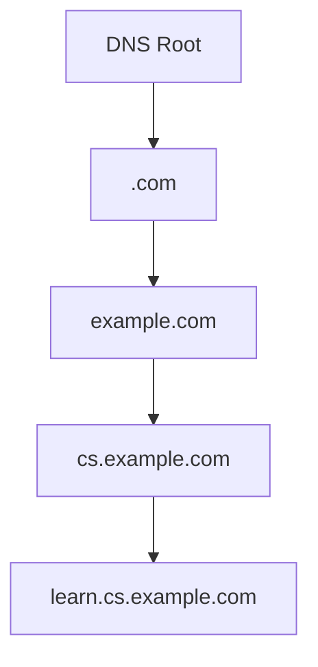
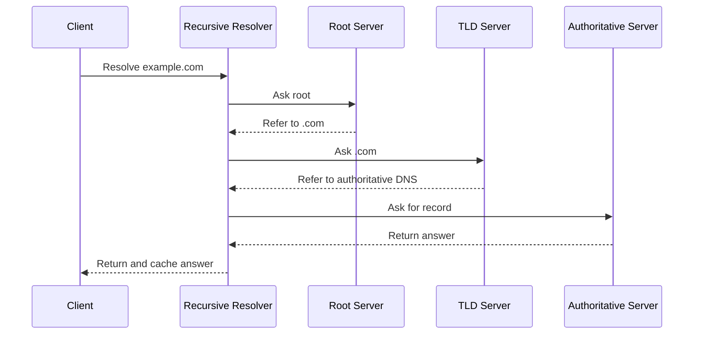
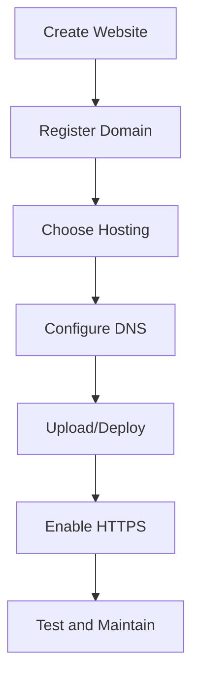

# 🔗 Chapter 5: URLs, Domain Names, DNS and Web Hosting


> [!TIP]
> **Chapter Goal:** Samajhna ki web resource ka address kaise banta hai, domain name IP address se kaise connect hota hai aur website Internet par host kaise hoti hai.

---

## 🎯 5.1 Learning Objectives

After completing this chapter, you will be able to:

1. Define URI, URL and URN.
2. Identify all major parts of a URL.
3. Explain absolute and relative URLs.
4. Understand domain names and their hierarchy.
5. Define DNS and explain DNS resolution.
6. Recognize common DNS record types.
7. Explain web hosting and its major types.
8. Differentiate between a domain and web hosting.
9. Describe the basic process of publishing a website.
10. Apply basic domain, DNS and hosting safety practices.

---

## 🗣️ 5.2 Difficult Words: Pronunciation and Meaning

| 🔤 Word | 🔊 Pronunciation | 💡 Simple Meaning |
|---|---|---|
| Locator | लोकेटर — *lo-kay-ter* | Location batane wala |
| Resource | रिसोर्स — *ree-sors* | Web par available page, file ya data |
| Domain | डोमेन — *do-main* | Website ka human-readable naam |
| Hierarchy | हाइरार्की — *hai-uh-raar-kee* | Levels me arranged structure |
| Registrar | रजिस्ट्रार — *rej-uh-straar* | Domain registration service dene wali company |
| Registry | रजिस्ट्री — *rej-uh-stree* | Domain extension records manage karne wali organization |
| Resolution | रेजोल्यूशन — *rez-uh-loo-shun* | Name ko address me convert karne ki process |
| Recursive | रिकर्सिव — *ri-kur-siv* | Answer find karne ke liye further queries karna |
| Authoritative | ऑथॉरिटेटिव — *aw-thor-uh-tay-tiv* | Official DNS answer dene wala |
| Hosting | होस्टिंग — *ho-sting* | Website ko server par available rakhna |
| Bandwidth | बैंडविड्थ — *band-width* | Data transfer capacity |
| Uptime | अपटाइम — *up-time* | Service available rehne ka samay |
| Subdomain | सबडोमेन — *sub-do-main* | Main domain ke under additional name |
| Propagation | प्रॉपगेशन — *prop-uh-gay-shun* | DNS changes ka caches me update hona |
| Deployment | डिप्लॉयमेंट — *di-ploy-ment* | Website ko users ke liye publish karna |

---

# 🟦 Part A: URI and URL

## 💡 5.3 What Is a URI?

**URI** stands for **Uniform Resource Identifier**.

A URI is a character sequence that identifies a resource. URL and URN are concepts within the broader URI category.

### Simple Relationship

```text
URI
├── URL: identifies a resource using its location/access method
└── URN: identifies a resource using a persistent name
```

> [!NOTE]
> Everyday web development me URI aur URL terms kabhi-kabhi loosely interchangeably use hote hain. Exam me unki conceptual difference clear rakhein.

---

## 🔗 5.4 What Is a URL?

### 5.4.1 English Explanation

A **URL**, or Uniform Resource Locator, is the address used to locate and access a resource on a network, especially the Web.

### 5.4.2 Hinglish Explanation

URL kisi web page, image, video, file ya API resource ka address hota hai. Browser URL ki help se samajhta hai ki resource kahan hai aur use kis method ya scheme se access karna hai.

### 5.4.3 Example

```text
https://www.example.com:443/products/laptop?id=25&color=black#reviews
```

---

## 🧩 5.5 Parts of a URL

Consider this URL:

```text
https://shop.example.com:443/products/laptop?id=25#reviews
```

| Part | Value | Purpose |
|---|---|---|
| Scheme | `https` | Access method/protocol |
| Host | `shop.example.com` | Server/domain identity |
| Subdomain | `shop` | Main domain ka subdivision |
| Domain | `example` | Registered name |
| Top-level domain | `.com` | Domain hierarchy ka upper category |
| Port | `443` | Server service endpoint |
| Path | `/products/laptop` | Resource location |
| Query string | `?id=25` | Request parameters |
| Fragment | `#reviews` | Resource ke specific section ka reference |

### Visual Structure

```text
https://shop.example.com:443/products/laptop?id=25#reviews
└─┬─┘   └──────┬───────┘ └┬┘ └──────┬───────┘ └─┬──┘ └──┬───┘
scheme         host        port       path         query   fragment
```

> [!IMPORTANT]
> Fragment, jaise `#reviews`, normally browser ke andar section locate karta hai aur standard HTTP request me server ko nahi bheja jata.

---

## 🔐 5.6 Common URL Schemes

| Scheme | Basic Use |
|---|---|
| `http` | Unencrypted web communication |
| `https` | Encrypted web communication |
| `mailto` | Email application open karna |
| `tel` | Supported device par phone action |
| `ftp` | File-transfer resource reference |
| `file` | Local file reference |

### Examples

```text
https://example.com
mailto:help@example.com
tel:+911234567890
```

---

## 🛣️ 5.7 Absolute and Relative URLs

### 5.7.1 Absolute URL

An absolute URL contains the complete address.

```html
<a href="https://example.com/about.html">About</a>
```

### 5.7.2 Relative URL

A relative URL is interpreted in relation to the current document or base URL.

```html
<a href="about.html">About</a>

```

### Difference

| Basis | Absolute URL | Relative URL |
|---|---|---|
| Address | Complete | Partial |
| Scheme and host | Included | Usually omitted |
| External resource | Suitable | Normally current site/context |
| Portability within site | May require domain changes | Often easier |
| Example | `https://example.com/a.html` | `a.html` |

---

## 📁 5.8 Relative Path Symbols

| Path | Meaning |
|---|---|
| `page.html` | Current directory ka file |
| `images/pic.jpg` | Current directory ke andar folder |
| `./page.html` | Explicitly current directory |
| `../page.html` | Parent directory |
| `/about` | Site root se path |

> [!WARNING]
> Filesystem path aur URL path related lag sakte hain, lekin same concept nahi hain. Server URL ko apni routing ya configuration ke according map kar sakta hai.

---

## 🔢 5.9 URL Encoding

URLs me kuch characters reserved hote hain. Unsupported ya special characters ko percent-encoded form me represent kiya ja sakta hai.

Example:

```text
space → %20
```

```text
https://example.com/search?q=web%20technology
```

### Good URL Practices

1. Short and meaningful paths use karein.
2. Words separate karne ke liye hyphens use karein.
3. Sensitive data URL me na rakhein.
4. Consistent lowercase paths prefer karein.
5. Unnecessary parameters avoid karein.
6. HTTPS use karein.

> [!CAUTION]
> Password, secret token ya highly sensitive personal data query string me nahi bhejna chahiye. URLs logs aur browser history me record ho sakte hain.

---

# 🟩 Part B: Domain Names

## 🌍 5.10 What Is a Domain Name?

### 5.10.1 English Explanation

A domain name is a human-readable name used to identify an Internet resource or service. DNS maps the domain name to technical information such as an IP address.

### 5.10.2 Hinglish Explanation

Computers network par IP addresses use karte hain, lekin humans ke liye names yaad rakhna easy hota hai. Domain name website ka readable naam hota hai, jaise:

```text
example.com
```

> [!IMPORTANT]
> Domain name website ki files nahi hota. Ye ek name hai jo DNS configuration ke through hosting service ya server ki taraf point kar sakta hai.

---

## 🏗️ 5.11 Domain Name Hierarchy

Consider:

```text
learn.cs.example.com
```

DNS hierarchy right to left samjhi jati hai:

| Level | Part | Meaning |
|---|---|---|
| Root | Final hidden dot | DNS hierarchy ka top |
| Top-level domain | `com` | Upper domain category |
| Second-level/registered label | `example` | Registered domain ka main label |
| Subdomain | `cs` | Registered domain ke under division |
| Further subdomain/host label | `learn` | Specific service or subdivision |



---

## 🏷️ 5.12 Types of Top-Level Domains

### 5.12.1 Generic Top-Level Domains

Examples:

- `.com`
- `.org`
- `.net`
- `.info`

### 5.12.2 Country-Code Top-Level Domains

Examples:

- `.in` — India
- `.uk` — United Kingdom
- `.jp` — Japan
- `.au` — Australia

### 5.12.3 Sponsored or Restricted Domains

Some extensions have specific eligibility or administrative rules.

Examples may include `.edu`, `.gov` and other specialized namespaces, depending on the governing policy.

---

## 🧱 5.13 Domain, Subdomain and Hostname

### Domain

```text
example.com
```

### Subdomain

```text
blog.example.com
```

### Hostname

A hostname identifies a host or service within the domain system. A fully qualified hostname may include all labels leading toward the DNS root.

> [!NOTE]
> `www` koi compulsory Internet rule nahi hai. Ye commonly used subdomain/host label hai. Website `example.com` aur `www.example.com` dono ya kisi ek par configured ho sakti hai.

---

## 📝 5.14 Domain Registration

A domain is registered through a domain registrar for a specified period.

### Important Parties

| Party | Role |
|---|---|
| Registrant | Domain register/use karne wala person or organization |
| Registrar | Registration service provide karta hai |
| Registry | Particular top-level domain ka database operate karti hai |
| DNS host/provider | Authoritative DNS records manage karta hai |

### Basic Registration Steps

1. Suitable domain name choose karein.
2. Availability check karein.
3. Trusted registrar select karein.
4. Registration details provide karein.
5. Required fee pay karein.
6. DNS/name-server settings configure karein.
7. Renewal date monitor karein.
8. Account security enable karein.

### Domain Safety

- Strong unique password use karein.
- Multi-factor authentication enable karein.
- Auto-renew carefully configure karein.
- Contact email updated rakhein.
- Domain-lock feature available ho to use karein.
- Renewal messages ko verify karein.
- Account recovery information secure rakhein.

---

# 🟨 Part C: Domain Name System

## 📖 5.15 What Is DNS?

**DNS** stands for **Domain Name System**.

### English Explanation

DNS is a distributed hierarchical naming system that maps domain names to information required to locate or use Internet services, such as IP addresses.

### Hinglish Explanation

DNS Internet ki phonebook jaisa work karta hai. User readable domain enter karta hai aur DNS us domain se related IP address ya dusri required information find karne me help karta hai.

```text
example.com → 192.0.2.10
```

The address above is only a documentation-style example.

---

## 🔄 5.16 DNS Resolution Process

When a user enters a domain:

1. Browser and operating system check local cache.
2. Query goes to a recursive DNS resolver if needed.
3. Resolver asks a root name server.
4. Root directs it toward the correct TLD name servers.
5. TLD service directs it to authoritative name servers.
6. Authoritative name server returns the requested record.
7. Resolver caches the answer according to its TTL.
8. Resolver returns the answer to the client.
9. Browser connects to the destination service.



> [!TIP]
> Cached answer available ho to resolver ko har baar complete hierarchy query nahi karni padti.

---

## 🧠 5.17 DNS Server Roles

### 5.17.1 Recursive Resolver

Client ki taraf se DNS answer find karta hai.

### 5.17.2 Root Name Server

Resolver ko suitable top-level domain name servers ki direction deta hai.

### 5.17.3 TLD Name Server

Relevant authoritative name servers ki information provide karta hai.

### 5.17.4 Authoritative Name Server

Domain ke official configured DNS records return karta hai.

---

## 📋 5.18 Common DNS Record Types

| Record | Main Purpose |
|---|---|
| A | Name ko IPv4 address se map karta hai |
| AAAA | Name ko IPv6 address se map karta hai |
| CNAME | Ek name ko dusre canonical name ka alias banata hai |
| MX | Domain ke mail servers specify karta hai |
| NS | Domain ke authoritative name servers specify karta hai |
| TXT | Text-based information store karta hai |
| SOA | DNS zone ki main administrative information |
| PTR | Reverse DNS mapping me address ko name se associate karta hai |
| SRV | Specific service ka host aur port identify karta hai |
| CAA | Certificate issue karne wali allowed authorities ko restrict kar sakta hai |

### Example-Style Records

```dns
example.com.        A       192.0.2.10
www.example.com.    CNAME   example.com.
example.com.        MX 10   mail.example.com.
```

> [!NOTE]
> Ye addresses aur records sirf learning examples hain. Real configuration hosting provider ke instructions ke according hoti hai.

---

## ⏳ 5.19 TTL and DNS Propagation

### 5.19.1 TTL

TTL means **Time to Live**. It tells DNS caches approximately how long a response may be stored before it should be refreshed.

### 5.19.2 DNS Propagation

“DNS propagation” common term hai jo DNS change ke baad different caches ke old records expire aur refresh hone ki process ko describe karta hai.

### Hinglish

DNS record change karne ke baad sab users ko new answer ek hi second me zaroori nahi milega. Kuch resolvers ke cache me old answer TTL complete hone tak reh sakta hai.

---

## 🧪 5.20 Basic DNS Commands

### Windows

```powershell
nslookup example.com
ipconfig /displaydns
```

### Linux/macOS

```bash
dig example.com
nslookup example.com
```

> [!TIP]
> Command availability operating system aur installed tools par depend karti hai.

---

# 🟪 Part D: Web Hosting

## 🏠 5.21 What Is Web Hosting?

### 5.21.1 English Explanation

Web hosting is a service that provides computing resources and network availability for storing and serving websites or web applications.

### 5.21.2 Hinglish Explanation

Web hosting website ki files aur application ko server par rakhti hai, jisse users Internet ke through website access kar saken.

Hosting may provide:

- Storage
- Processing power
- Memory
- Network connectivity
- Server software
- Databases
- Security features
- Backup tools
- Management panel

---

## ⚖️ 5.22 Domain vs Web Hosting

| Basis | Domain Name | Web Hosting |
|---|---|---|
| Meaning | Website/service ka readable name | Website resources ke liye server service |
| Example | `example.com` | Server storing the website |
| Main role | Users ko address deta hai | Files/application deliver karta hai |
| Analogy | Ghar ka address | Ghar/building |
| Connection | DNS se hosting ki taraf point karta hai | Domain request accept karne ke liye configured hoti hai |

> [!IMPORTANT]
> Domain aur hosting alag services hain. Dono same company se lena compulsory nahi hai.

---

## 🗂️ 5.23 Types of Web Hosting

### 5.23.1 Shared Hosting

Multiple customers share one server and its resources.

**Suitable for:** Small websites and beginners.

**Advantages:**

- Lower cost
- Easier management
- Basic control panel

**Limitations:**

- Limited resources
- Less configuration control
- Other users' load may affect performance

### 5.23.2 Virtual Private Server Hosting

A physical server is divided into isolated virtual server environments.

**Suitable for:** Growing sites and users requiring more control.

**Advantages:**

- More control
- Allocated resources
- Better customization

**Limitations:**

- More technical management
- Higher cost than basic shared hosting

### 5.23.3 Dedicated Hosting

One customer uses an entire physical server.

**Suitable for:** High-resource or specialized systems.

**Advantages:**

- High control
- Dedicated resources
- Custom configuration

**Limitations:**

- Expensive
- Requires administration skills

### 5.23.4 Cloud Hosting

Resources are delivered through cloud infrastructure and may be distributed across multiple systems.

**Advantages:**

- Flexible scaling
- Usage-based options
- High availability options

**Limitations:**

- Cost can be complex
- Configuration requires knowledge
- Provider dependence

### 5.23.5 Managed Hosting

The provider manages selected technical tasks such as updates, monitoring, backups or security.

### 5.23.6 Static Site Hosting

Designed primarily to deliver prebuilt HTML, CSS, JavaScript and media files.

**Suitable for:** Portfolio, documentation and front-end-only sites.

---

## 📊 5.24 Hosting Comparison

| Type | Cost | Control | Skill Needed | Suitable For |
|---|---:|---:|---:|---|
| Shared | Low | Low | Low | Beginner/small site |
| VPS | Medium | Medium–High | Medium | Growing application |
| Dedicated | High | High | High | Specialized/high-load use |
| Cloud | Flexible | Medium–High | Medium–High | Scalable application |
| Managed | Varies | Varies | Lower for managed tasks | Users wanting provider support |
| Static hosting | Low/varies | Focused | Low–Medium | Static sites and documentation |

---

## 📏 5.25 Important Hosting Terms

### 5.25.1 Storage

Space available for website files, databases and logs.

### 5.25.2 Bandwidth/Data Transfer

Amount or capacity of data transferred between hosting service and users.

### 5.25.3 Uptime

The period during which the hosted service remains available.

### 5.25.4 Control Panel

Interface used to manage domains, files, databases, email and settings.

### 5.25.5 SSL/TLS Certificate

Supports authenticated encrypted HTTPS communication.

### 5.25.6 Backup

A recoverable copy of website data and configuration.

### 5.25.7 Scalability

Ability to increase resources or capacity as demand grows.

---

## 🚀 5.26 How to Publish a Website

Basic publishing steps:

1. Create and test website files.
2. Choose a domain name.
3. Register the domain.
4. Select suitable hosting.
5. Add the domain to the hosting service.
6. Configure DNS records or name servers.
7. Upload or deploy website files.
8. Enable HTTPS.
9. Test important pages and forms.
10. Configure backups and monitoring.
11. Maintain and update the website.



---

## 📤 5.27 Common Upload and Deployment Methods

- Hosting control-panel file manager
- Secure file transfer
- Git-based deployment
- Continuous deployment service
- Hosting-provider command-line tool
- Container or cloud deployment

> [!CAUTION]
> Plain, unprotected credential transfer avoid karein. Hosting provider ke supported secure deployment method ka use karein.

---

## ✅ 5.28 Choosing a Hosting Service

Consider:

1. Website type
2. Expected visitors
3. Required programming language
4. Database support
5. Storage and transfer needs
6. Server location or delivery network
7. HTTPS support
8. Backup and recovery
9. Security features
10. Technical support
11. Scalability
12. Pricing and renewal terms
13. Data and legal requirements

---

## 🔐 5.29 Domain and Hosting Security

1. Use strong unique passwords.
2. Enable multi-factor authentication.
3. Protect registrar and hosting email accounts.
4. Keep software and dependencies updated.
5. Use HTTPS.
6. Take tested backups.
7. Apply least-privilege access.
8. Remove unused accounts and files.
9. Monitor domain expiry and DNS changes.
10. Never commit secret credentials to a public repository.
11. Verify renewal and support messages.
12. Keep recovery codes secure.

---

## 🚫 5.30 Common Mistakes

1. Domain aur hosting ko same samajhna.
2. URL aur domain ko exactly same samajhna.
3. `www` ko compulsory samajhna.
4. DNS ko website files store karne wali service samajhna.
5. Sensitive data query string me rakhna.
6. Domain renewal ignore karna.
7. DNS records bina existing values samjhe change karna.
8. Backup liye bina deployment karna.
9. HTTPS configure na karna.
10. Public repository me passwords ya API keys upload karna.

---

## 📌 5.31 Key Points to Remember

- URL web resource ka address hota hai.
- URL me scheme, host, port, path, query aur fragment ho sakte hain.
- Absolute URL complete address provide karta hai.
- Domain name human-readable identity hai.
- DNS domain ko IP address aur other service information se map karta hai.
- Recursive resolver answer find karta hai.
- Authoritative server official configured DNS record return karta hai.
- A and AAAA address records hain.
- Domain aur hosting separate services hain.
- Hosting website ko store aur deliver karne ke resources provide karti hai.

---

## 📝 5.32 Chapter Summary

A URL locates a web resource and may contain a scheme, host, port, path, query and fragment. Domain names provide readable Internet identities and are organized hierarchically. DNS is a distributed system that maps domain names to technical service information. Recursive, root, TLD and authoritative DNS servers participate in name resolution. Web hosting provides the computing and network resources needed to publish a website. Shared, VPS, dedicated, cloud, managed and static hosting meet different requirements. Secure publishing requires protected accounts, correct DNS, HTTPS, backups and regular maintenance.

---

## 🎲 5.33 Multiple-Choice Questions

### 1. What does URL stand for?

A. Uniform Resource Locator  
B. Universal Record Link  
C. User Resource Level  
D. Uniform Routing List  

**✅ Answer:** A

### 2. Which URL part usually begins with `?`?

A. Scheme  
B. Host  
C. Query  
D. Fragment  

**✅ Answer:** C

### 3. Which DNS record maps a name to an IPv4 address?

A. MX  
B. A  
C. TXT  
D. NS  

**✅ Answer:** B

### 4. Which record specifies mail servers?

A. MX  
B. CNAME  
C. PTR  
D. AAAA  

**✅ Answer:** A

### 5. A domain registrar mainly provides:

A. Domain registration service  
B. HTML rendering  
C. Browser history  
D. CSS compilation  

**✅ Answer:** A

### 6. Which hosting gives one customer an entire physical server?

A. Shared hosting  
B. Dedicated hosting  
C. Static hosting  
D. Free subdomain only  

**✅ Answer:** B

### 7. DNS TTL mainly controls:

A. Screen brightness  
B. Approximate cache duration  
C. HTML heading size  
D. Password length  

**✅ Answer:** B

### 8. Which URL part points to a page section?

A. Fragment  
B. Scheme  
C. Port  
D. TLD  

**✅ Answer:** A

### 9. Which DNS server gives official configured answers for a domain?

A. Authoritative name server  
B. Browser engine  
C. Web crawler  
D. File manager  

**✅ Answer:** A

### 10. Domain and web hosting are:

A. Always exactly the same service  
B. Separate concepts that can work together  
C. Types of browser  
D. HTML elements  

**✅ Answer:** B

---

## ✍️ 5.34 Fill in the Blanks

1. URL stands for Uniform Resource __________.
2. The `https` part of a URL is its __________.
3. DNS maps domain names to technical information such as an __________ address.
4. The __________ record specifies a mail server.
5. Website files are made publicly available using web __________.

<details>
<summary><strong>✅ View Answers</strong></summary>

1. Locator  
2. scheme  
3. IP  
4. MX  
5. hosting

</details>

---

## ❓ 5.35 Short-Answer Questions

1. Define URI.
2. Define URL.
3. List the main parts of a URL.
4. Differentiate between absolute and relative URLs.
5. What is URL encoding?
6. Define a domain name.
7. What is a subdomain?
8. What is DNS?
9. Define a recursive resolver.
10. What is an authoritative name server?
11. Define TTL.
12. What is web hosting?
13. Differentiate between domain and hosting.
14. What is shared hosting?
15. What is cloud hosting?

---

## 📚 5.36 Long-Answer and Exam Questions

1. Explain the structure of a URL with a suitable example.
2. Differentiate between absolute and relative URLs.
3. Explain the domain-name hierarchy with a diagram.
4. Describe the complete DNS resolution process.
5. Explain common DNS record types.
6. Differentiate between domain registration, DNS and web hosting.
7. Explain the major types of web hosting.
8. Discuss the factors used to select a hosting service.
9. Describe the complete process of publishing a website.
10. Explain important domain, DNS and hosting security practices.

---

## 🧪 5.37 Practical Activities

1. Break a complete URL into scheme, host, path, query and fragment.
2. Write three absolute and three relative URLs.
3. Find the domain and subdomain in five website addresses.
4. Use `nslookup example.com` and observe the result.
5. Compare A, AAAA, CNAME and MX records.
6. Create a small folder with HTML, CSS and image files using relative paths.
7. Compare shared, VPS and cloud hosting for a small college project.
8. Prepare a website-publishing checklist.
9. Inspect whether a selected site uses HTTPS.
10. Write safety steps for protecting a domain account.

---

## 🎤 5.38 Viva Questions

1. What is the full form of URL?
2. What is a URL scheme?
3. What does a fragment identify?
4. What is the difference between absolute and relative URLs?
5. What is a domain name?
6. Is `www` compulsory?
7. What is DNS?
8. What does an A record contain?
9. What does an MX record specify?
10. What is DNS TTL?
11. What is web hosting?
12. Name three hosting types.
13. Can domain and hosting be purchased separately?
14. Why is HTTPS important?
15. Why are backups required?

<details>
<summary><strong>✅ View Short Viva Answers</strong></summary>

1. Uniform Resource Locator.  
2. It identifies the access method, such as HTTPS.  
3. A section within a resource.  
4. Absolute is complete; relative depends on a base location.  
5. A human-readable Internet name.  
6. No.  
7. Domain Name System.  
8. An IPv4 address mapping.  
9. Mail servers.  
10. Approximate DNS cache lifetime.  
11. A service providing resources to publish a website.  
12. Shared, VPS and dedicated hosting.  
13. Yes.  
14. It protects communication using encryption and authentication.  
15. To recover from loss, failure or mistakes.

</details>

---

## 🏁 5.39 One-Minute Revision

| Question | Quick Answer |
|---|---|
| URL kya hai? | Web resource ka address |
| Scheme example? | HTTPS |
| Domain example? | example.com |
| Subdomain example? | blog.example.com |
| DNS ka work? | Name ko service information/IP se map karna |
| IPv4 record? | A |
| IPv6 record? | AAAA |
| Mail record? | MX |
| Domain vs hosting? | Address/name vs server resources |
| Shared hosting? | Multiple customers share a server |
| Dedicated hosting? | One customer gets full physical server |
| TTL? | DNS cache duration instruction |

---

[⬅️ Previous Chapter](04-web-browsers-and-web-servers.md) · [📚 Table of Contents](../SUMMARY.md) · **Next: HTTP and HTTPS ➡️**
