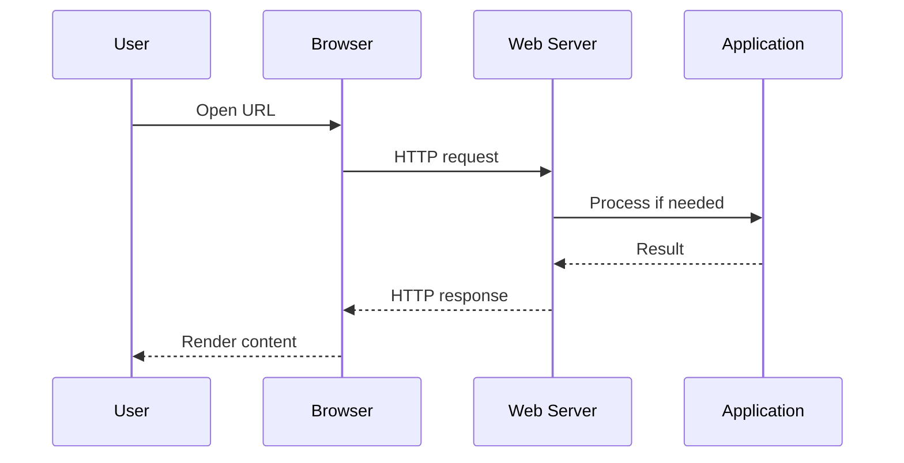
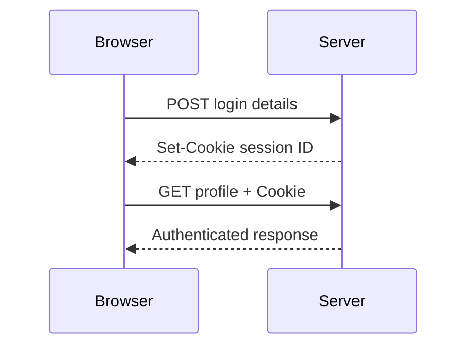
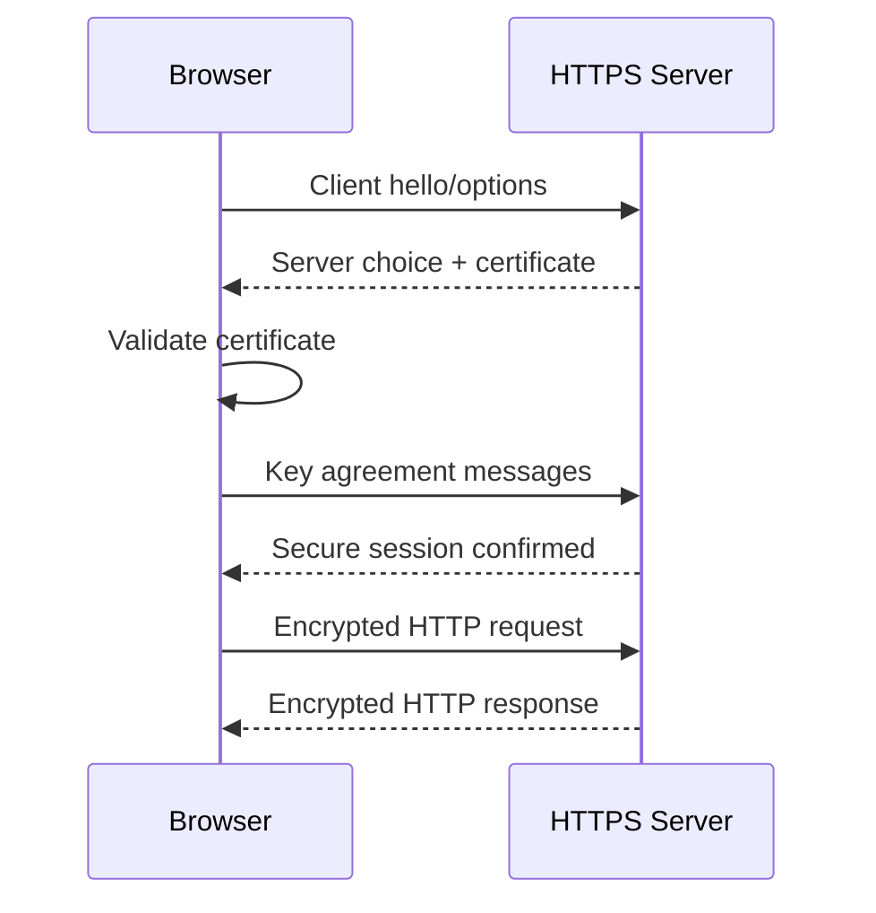

# 🔐 Chapter 6: HTTP and HTTPS


> [!TIP]
> **Chapter Goal:** Samajhna ki browser aur server HTTP messages ke through kaise communicate karte hain aur HTTPS is communication ko TLS ki help se kaise protect karta hai.

---

## 🎯 6.1 Learning Objectives

After completing this chapter, you will be able to:

1. Define HTTP and explain its main features.
2. Describe the HTTP request-response cycle.
3. Identify the parts of HTTP requests and responses.
4. Explain common HTTP methods, headers and status codes.
5. Understand statelessness, cookies, sessions and caching.
6. Differentiate among HTTP/1.1, HTTP/2 and HTTP/3 at a basic level.
7. Define HTTPS and explain the role of TLS certificates.
8. Differentiate between HTTP and HTTPS.
9. Inspect HTTP communication using browser Developer Tools.
10. Apply basic HTTP and HTTPS security practices.

---

## 🗣️ 6.2 Difficult Words: Pronunciation and Meaning

| 🔤 Word | 🔊 Pronunciation | 💡 Simple Meaning |
|---|---|---|
| Protocol | प्रोटोकॉल — *pro-to-kol* | Communication ke rules |
| Hypertext | हाइपरटेक्स्ट — *hai-per-tekst* | Links se connected digital text |
| Transfer | ट्रांसफर — *trans-fur* | Data ko bhejna |
| Stateless | स्टेटलेस — *state-less* | Previous request ko automatically yaad na rakhna |
| Method | मेथड — *meth-ud* | Request ka intended action |
| Header | हेडर — *hed-er* | Message ki extra information |
| Payload | पेलोड — *pay-load* | Message me carried main data |
| Representation | रिप्रेजेन्टेशन — *rep-ri-zen-tay-shun* | Resource ka transferred form |
| Authentication | ऑथेन्टिकेशन — *aw-then-ti-kay-shun* | Identity verify karna |
| Authorization | ऑथराइजेशन — *aw-thuh-rai-zay-shun* | Allowed permissions check karna |
| Encryption | एन्क्रिप्शन — *en-krip-shun* | Data ko protected unreadable form me badalna |
| Certificate | सर्टिफिकेट — *sur-tif-i-kut* | Digital identity document |
| Confidentiality | कॉन्फिडेन्शियलिटी — *kon-fi-den-shee-al-i-tee* | Data ko unauthorized reading se bachana |
| Integrity | इंटेग्रिटी — *in-teg-ri-tee* | Data unauthorized change na hona |
| Multiplexing | मल्टिप्लेक्सिंग — *mul-ti-plek-sing* | One connection par multiple streams |
| Idempotent | आइडेम्पोटेंट — *ai-dem-po-tent* | Repeat karne par intended effect same rehna |

---

# 🟦 Part A: HTTP Fundamentals

## 💡 6.3 What Is HTTP?

**HTTP** stands for **Hypertext Transfer Protocol**.

### 6.3.1 English Explanation

HTTP is a stateless application-level protocol used for communication between clients and servers in distributed information systems such as the Web. It defines the semantics of requests and responses.

### 6.3.2 Hinglish Explanation

HTTP browser aur server ke beech communication ke rules define karta hai. Client request bhejta hai aur server result batane wala response return karta hai.

```text
Client → HTTP Request → Server
Client ← HTTP Response ← Server
```

> [!IMPORTANT]
> HTTP sirf HTML transfer karne tak limited nahi hai. Iske through JSON, images, audio, video, documents aur other representations bhi transfer ho sakti hain.

---

## 🧠 6.4 Main Features of HTTP

### 6.4.1 Client–Server Model

Client request initiate karta hai aur server response deta hai.

### 6.4.2 Stateless Protocol

Each request can be understood independently. Server automatically previous request ka application state yaad nahi rakhta.

### 6.4.3 Extensible

Headers aur defined methods ke through HTTP ko different uses ke liye extend kiya ja sakta hai.

### 6.4.4 Media Independent

HTTP many content types transfer kar sakta hai. `Content-Type` header representation ka media type batata hai.

### 6.4.5 Request–Response Based

Communication messages normally requests aur responses ke form me organized hoti hai.

### 6.4.6 Cache Support

HTTP responses rules provide kar sakti hain jinke according clients aur intermediary caches reusable response store kar saken.

---

## 🔄 6.5 HTTP Request–Response Cycle

1. User browser me URL enter karta hai.
2. Browser server ki address information resolve karta hai.
3. Network connection establish hota hai.
4. Browser HTTP request bhejta hai.
5. Server request receive aur interpret karta hai.
6. Server application ya database ke saath process kar sakta hai.
7. Server HTTP response return karta hai.
8. Browser response process karta hai.
9. Browser required additional resources request karta hai.
10. Page render hota hai.



---

# 🟩 Part B: HTTP Request

## 📤 6.6 Structure of an HTTP Request

An HTTP/1.1-style request consists of:

1. Request line
2. Header fields
3. Empty line
4. Optional message content/body

### Example

```http
POST /students HTTP/1.1
Host: college.example
Content-Type: application/json
Accept: application/json
Content-Length: 41

{"name":"Aman","course":"BCA"}
```

> [!NOTE]
> Textual HTTP/1.1 example learning ke liye easy hai. HTTP/2 aur HTTP/3 wire format different framing use karte hain, lekin HTTP method, status aur field semantics broadly shared rehte hain.

---

## 🧾 6.7 Request Line

Example:

```http
GET /notes/chapter-1 HTTP/1.1
```

| Part | Meaning |
|---|---|
| `GET` | HTTP method |
| `/notes/chapter-1` | Request target/path |
| `HTTP/1.1` | Protocol version in this message syntax |

---

## 🛠️ 6.8 Common HTTP Methods

### 6.8.1 GET

Requests a current representation of a resource.

```http
GET /students/25 HTTP/1.1
```

### 6.8.2 HEAD

Works like GET but asks for response headers without representation content.

### 6.8.3 POST

Submits data for processing. It is commonly used to create a resource or perform an action.

```http
POST /students HTTP/1.1
```

### 6.8.4 PUT

Creates or completely replaces the state of a target resource according to the supplied representation.

### 6.8.5 PATCH

Requests partial modifications to a resource.

### 6.8.6 DELETE

Requests removal of a resource.

### 6.8.7 OPTIONS

Requests information about communication options for a resource or server.

### 6.8.8 CONNECT

Requests creation of a tunnel, commonly relevant to proxies.

### 6.8.9 TRACE

Performs a diagnostic loop-back request. It is often disabled because of security considerations.

### Method Comparison

| Method | Common Purpose | Request Body | Safe? | Idempotent? |
|---|---|---:|---:|---:|
| GET | Retrieve representation | Normally not used for content | Yes | Yes |
| HEAD | Retrieve headers | No | Yes | Yes |
| POST | Submit/process data | Usually | No | No |
| PUT | Create/replace target state | Usually | No | Yes |
| PATCH | Partially modify | Usually | No | Not guaranteed |
| DELETE | Remove target resource | Optional/varies | No | Yes |
| OPTIONS | Discover options | Optional | Yes | Yes |

### Safe and Idempotent

- **Safe:** Intended to be read-only from the client's perspective.
- **Idempotent:** Multiple identical requests have the same intended effect as one request.

> [!WARNING]
> “Idempotent” ka meaning ye nahi ki response har baar exactly same hoga. Logging, timestamps aur concurrent changes ki wajah se response differ kar sakta hai.

---

## 🧩 6.9 Common Request Headers

| Header | Purpose |
|---|---|
| `Host` | Requested host identify karta hai |
| `User-Agent` | Client software ki information |
| `Accept` | Client kis media type ko prefer/accept karta hai |
| `Accept-Language` | Preferred natural language |
| `Content-Type` | Sent content ka media type |
| `Content-Length` | Message content ki size |
| `Authorization` | Authentication credentials or token scheme |
| `Cookie` | Relevant stored cookies send karta hai |
| `Referer` | Previous page/resource context, when sent |
| `Cache-Control` | Caching instructions |
| `If-None-Match` | ETag-based conditional request |

### Example

```http
GET /profile HTTP/1.1
Host: example.com
Accept: text/html
Accept-Language: en
Cookie: session_id=abc123
```

---

## 📦 6.10 Request Body

Request body may contain submitted data.

### Form-Encoded Data

```text
name=Aman&course=BCA
```

### JSON Data

```json
{
  "name": "Aman",
  "course": "BCA"
}
```

### Multipart Data

Commonly used for forms containing file uploads.

> [!CAUTION]
> Request data client se aata hai, isliye server ko input validate aur authorize karna chahiye. Sirf client-side validation par trust nahi karna chahiye.

---

# 🟨 Part C: HTTP Response

## 📥 6.11 Structure of an HTTP Response

An HTTP/1.1-style response contains:

1. Status line
2. Header fields
3. Empty line
4. Optional message content/body

### Example

```http
HTTP/1.1 200 OK
Content-Type: application/json
Cache-Control: no-store

{"id":25,"name":"Aman","course":"BCA"}
```

---

## 🚦 6.12 HTTP Status-Code Classes

HTTP status codes contain three digits. Their first digit defines the response class.

| Range | Class | Meaning |
|---|---|---|
| 1xx | Informational | Request processing se related interim information |
| 2xx | Successful | Request successfully received/understood/accepted |
| 3xx | Redirection | Completion ke liye further action or another location |
| 4xx | Client Error | Request-side problem |
| 5xx | Server Error | Server request complete nahi kar saka |

---

## 📋 6.13 Common HTTP Status Codes

### 6.13.1 Informational — 1xx

| Code | Meaning |
|---|---|
| 100 | Continue |
| 101 | Switching Protocols |
| 103 | Early Hints |

### 6.13.2 Successful — 2xx

| Code | Meaning | Common Use |
|---|---|---|
| 200 | OK | Successful request |
| 201 | Created | New resource created |
| 202 | Accepted | Accepted for later processing |
| 204 | No Content | Successful, no response content |

### 6.13.3 Redirection — 3xx

| Code | Meaning | Common Use |
|---|---|---|
| 301 | Moved Permanently | Permanent redirect |
| 302 | Found | Temporary-style redirect |
| 304 | Not Modified | Cached representation may be reused |
| 307 | Temporary Redirect | Temporary redirect preserving method |
| 308 | Permanent Redirect | Permanent redirect preserving method |

### 6.13.4 Client Error — 4xx

| Code | Meaning | Common Use |
|---|---|---|
| 400 | Bad Request | Invalid request syntax/data |
| 401 | Unauthorized | Authentication required/failed |
| 403 | Forbidden | Server refuses access |
| 404 | Not Found | Resource not found |
| 405 | Method Not Allowed | Method unsupported for target |
| 409 | Conflict | Conflict with current resource state |
| 429 | Too Many Requests | Rate limit exceeded |

### 6.13.5 Server Error — 5xx

| Code | Meaning | Common Use |
|---|---|---|
| 500 | Internal Server Error | General server failure |
| 501 | Not Implemented | Functionality unsupported |
| 502 | Bad Gateway | Invalid upstream response |
| 503 | Service Unavailable | Temporary overload/maintenance |
| 504 | Gateway Timeout | Upstream response timeout |

> [!IMPORTANT]
> `401 Unauthorized` naam confusing ho sakta hai: practically ye authentication ki zarurat/failure ko indicate karta hai. `403 Forbidden` generally means server request samajhta hai lekin access refuse karta hai.

---

## 🧩 6.14 Common Response Headers

| Header | Purpose |
|---|---|
| `Content-Type` | Response representation ka media type |
| `Content-Length` | Content size |
| `Location` | Redirect ya newly created resource location |
| `Set-Cookie` | Browser ko cookie store karne ka instruction |
| `Cache-Control` | Caching behavior |
| `ETag` | Representation validator |
| `Last-Modified` | Resource modification time |
| `Content-Encoding` | Applied encoding, such as compression |
| `Content-Security-Policy` | Browser content restrictions define kar sakta hai |
| `Strict-Transport-Security` | Browser ko future HTTPS-only access instruct kar sakta hai |

---

## 🎭 6.15 Media Types

`Content-Type` representation ka format batata hai.

| Media Type | Content |
|---|---|
| `text/html` | HTML document |
| `text/css` | CSS |
| `application/javascript` | JavaScript |
| `application/json` | JSON data |
| `image/png` | PNG image |
| `image/jpeg` | JPEG image |
| `application/pdf` | PDF document |
| `multipart/form-data` | Multipart form/file data |

---

# 🟪 Part D: HTTP State and Performance

## 🧠 6.16 Statelessness

HTTP stateless hai: each request apni required context carry kar sakta hai, aur protocol automatically previous application interaction remember nahi karta.

### Then Login Kaise Remember Hota Hai?

Web applications additional mechanisms use karti hain:

- Cookies
- Server-side sessions
- Authorization tokens
- URL parameters in limited cases
- Browser storage for suitable client-side data

---

## 🍪 6.17 Cookies and Sessions

### 6.17.1 Basic Session Flow

1. User login data send karta hai.
2. Server credentials verify karta hai.
3. Server session create kar sakta hai.
4. Response `Set-Cookie` se session identifier bhejti hai.
5. Browser relevant future request me cookie bhejta hai.
6. Server identifier ke through session state find karta hai.



### Important Cookie Attributes

| Attribute | Purpose |
|---|---|
| `Secure` | Cookie only secure transport par send karne ke liye |
| `HttpOnly` | JavaScript access restrict karne ke liye |
| `SameSite` | Cross-site request behavior control karne ke liye |
| `Max-Age/Expires` | Cookie lifetime |
| `Path` | Applicable URL path |
| `Domain` | Applicable host/domain scope |

> [!WARNING]
> Session identifier ko guessable nahi hona chahiye. Login/logout, expiry, cookie security aur server-side session handling carefully implement karni chahiye.

---

## ⚡ 6.18 HTTP Caching

Caching repeated network work aur loading time reduce kar sakti hai.

### Common Cache-Control Directives

| Directive | Basic Meaning |
|---|---|
| `max-age=N` | Response approximately N seconds fresh |
| `no-store` | Response store na karein |
| `no-cache` | Reuse se pehle validation required |
| `private` | Shared cache me store nahi hona chahiye |
| `public` | Shared cache storage allowed where other rules permit |
| `must-revalidate` | Stale response use se pehle validation required |

> [!NOTE]
> `no-cache` aur `no-store` same nahi hain. `no-cache` commonly validation require karta hai; `no-store` storage ko prohibit karta hai.

### Conditional Request

```http
GET /style.css HTTP/1.1
If-None-Match: "file-version-25"
```

If unchanged, server may respond:

```http
HTTP/1.1 304 Not Modified
```

---

## 🤝 6.19 Content Negotiation

Client `Accept` family headers se preference express kar sakta hai.

Example:

```http
Accept: application/json
Accept-Language: hi, en;q=0.8
Accept-Encoding: gzip, br
```

Server supported option select karke relevant response fields return kar sakta hai.

---

# 🟥 Part E: HTTPS and TLS

## 🔒 6.20 What Is HTTPS?

**HTTPS** means HTTP communication protected using TLS.

### English Explanation

HTTPS applies HTTP semantics over a connection protected by Transport Layer Security. TLS is designed to provide confidentiality, integrity and authentication properties for communication.

### Hinglish Explanation

HTTPS me browser aur server ka HTTP communication TLS se secure hota hai. Network par data directly readable plain form me bhejne ke bajay protected connection me exchange hota hai.

```text
HTTPS = HTTP + TLS Protection
```

---

## 🛡️ 6.21 Security Goals of HTTPS

### 6.21.1 Confidentiality

Unauthorized network observer ko content read karne se protect karna.

### 6.21.2 Integrity

Transit me data unauthorized modification detect/protect karna.

### 6.21.3 Authentication

Certificate ke through client ko server identity verify karne me help karna.

> [!WARNING]
> HTTPS website ko automatically honest, malware-free ya legally trustworthy prove nahi karta. Ye connection aur verified certificate identity ke scope me protection provide karta hai.

---

## 📜 6.22 Digital Certificate

A TLS certificate binds a public key to one or more domain identities and contains certificate-related information.

It commonly includes:

- Subject/domain identity
- Public key
- Issuer
- Validity period
- Digital signature
- Supported names

### Certificate Authority

A Certificate Authority issues or signs certificates according to its validation process. Browsers and operating systems maintain trust stores containing trusted roots.

### Browser Validation

Browser checks may include:

1. Requested hostname matches certificate.
2. Certificate validity time is acceptable.
3. Certificate chain reaches a trusted root.
4. Signature verification succeeds.
5. Certificate is suitable for intended use.
6. Other policy and status checks as applicable.

---

## 🤝 6.23 Simplified TLS Handshake

1. Client connects and offers supported TLS options.
2. Server selects compatible parameters.
3. Server sends certificate information.
4. Client validates server identity.
5. Key agreement creates shared session secrets.
6. Both sides confirm handshake integrity.
7. Protected HTTP communication begins.



> [!NOTE]
> Actual TLS handshake cryptographically detailed hota hai. Ye diagram beginner-level simplified model hai.

---

## ⚖️ 6.24 HTTP vs HTTPS

| Basis | HTTP | HTTPS |
|---|---|---|
| Full concept | Hypertext Transfer Protocol | HTTP protected by TLS |
| URL scheme | `http://` | `https://` |
| Common default port | 80 | 443 |
| Network confidentiality | Not provided by HTTP alone | TLS protection |
| Integrity/authentication | Not provided by HTTP alone | TLS provides security properties |
| Certificate | Not required by HTTP | Server certificate normally required |
| Sensitive data | Unsafe without another secure tunnel | Appropriate baseline when correctly configured |

> [!IMPORTANT]
> Login, payment, personal data aur ordinary modern websites ke liye HTTPS use karna basic security requirement maana jana chahiye.

---

## 👁️ 6.25 What HTTPS Does and Does Not Hide

HTTPS protects HTTP content in transit after the TLS connection is established. However, communication se related kuch metadata network layers ya surrounding systems ko available ho sakti hai.

Potentially observable context may include:

- Destination IP address
- Timing and approximate data volume
- DNS lookups, depending on DNS protection
- Some connection-establishment information, depending on protocol and configuration

Browser history, server logs aur endpoint devices par data HTTPS se automatically hidden nahi hota.

---

## ↪️ 6.26 HTTP-to-HTTPS Redirection

A server may redirect HTTP requests to HTTPS:

```http
HTTP/1.1 301 Moved Permanently
Location: https://example.com/
```

### HSTS

HTTP Strict Transport Security response policy browser ko future requests HTTPS se karne ke liye instruct kar sakti hai.

Example:

```http
Strict-Transport-Security: max-age=31536000
```

> [!CAUTION]
> HSTS configuration carefully plan karni chahiye. Long-duration ya subdomain policies apply karne se pehle poori site ka HTTPS support verify karein.

---

# 🟧 Part F: HTTP Versions

## 🧱 6.27 HTTP/1.1

HTTP/1.1 defines textual message syntax, parsing and connection management.

Basic characteristics:

- Persistent connections supported
- Request and response messages
- Headers and optional content
- Multiple requests can reuse connections
- Pipelining concept exists but has practical limitations

---

## ⚡ 6.28 HTTP/2

HTTP/2 maintains HTTP semantics while using binary framing.

Basic improvements include:

- Multiple concurrent streams on one connection
- Header compression
- Stream prioritization mechanisms
- Reduced need for many parallel TCP connections

> [!NOTE]
> HTTP/2 ka “binary” meaning page content necessarily binary-only nahi hai. Protocol framing binary hai; transferred content HTML, JSON, images ya other media ho sakta hai.

---

## 🚀 6.29 HTTP/3

HTTP/3 maps HTTP semantics over QUIC.

Basic characteristics:

- QUIC transport
- Stream multiplexing
- Modern connection establishment behavior
- Avoids TCP-level head-of-line blocking between independent QUIC streams

### Basic Comparison

| Feature | HTTP/1.1 | HTTP/2 | HTTP/3 |
|---|---|---|---|
| Main transport | TCP | TCP | QUIC over UDP |
| Framing | Text-oriented messages | Binary framing | HTTP/3 framing |
| Multiplexing | Limited | Yes | Yes |
| HTTP semantics | Yes | Same core semantics | Same core semantics |
| Security in common browser deployment | Often HTTPS today | Commonly over TLS | QUIC includes TLS-based protection |

---

## 🧰 6.30 Inspecting HTTP in Developer Tools

1. Open a website.
2. Press **F12**.
3. Select the **Network** tab.
4. Reload the page.
5. Click any request.
6. Observe:

- Request URL
- Request method
- Status code
- Protocol
- Request headers
- Response headers
- Response or preview
- Timing
- Initiator
- Transferred size

### Useful Practice

Filter by:

- Document
- CSS
- JavaScript
- Image
- Fetch/XHR

> [!TIP]
> Developer Tools me displayed sensitive tokens ya cookies ko screenshot/share karne se pehle remove ya hide karein.

---

## 💻 6.31 Testing with curl

### Fetch Headers and Content Information

```bash
curl -i https://example.com/
```

### Request Headers Only

```bash
curl -I https://example.com/
```

### Send JSON

```bash
curl -X POST https://api.example.com/students \
  -H "Content-Type: application/json" \
  -d '{"name":"Aman","course":"BCA"}'
```

> [!WARNING]
> Unknown command ko blindly run na karein. Secret token command history, screenshots ya public logs me expose na karein.

---

## 🔐 6.32 HTTP Security Best Practices

1. Use HTTPS across the complete site.
2. Redirect HTTP safely to HTTPS.
3. Validate and sanitize input according to context.
4. Authenticate users securely.
5. Enforce authorization on every protected action.
6. Use secure cookie attributes.
7. Avoid secrets in URLs.
8. Configure caching carefully for sensitive responses.
9. Use appropriate security headers.
10. Hide unnecessary server details.
11. Keep TLS, server and application software updated.
12. Apply rate limits where required.
13. Log security-relevant events without exposing secrets.
14. Never trust client-controlled headers or body blindly.

---

## 🚫 6.33 Common Mistakes

1. HTTP ko only HTML protocol samajhna.
2. GET ko sensitive data bhejne ke liye use karna.
3. `401` aur `403` ko same samajhna.
4. `no-cache` aur `no-store` ko same samajhna.
5. HTTPS ko website trustworthiness ki complete guarantee samajhna.
6. Client-side validation ko enough security samajhna.
7. Status code ignore karke sirf response body dekhna.
8. POST ko automatically encrypted samajhna.
9. Session ID ko URL me expose karna.
10. Public screenshot me cookies ya authorization token dikhana.

---

## 📌 6.34 Key Points to Remember

- HTTP application-level request-response protocol hai.
- Client request initiate karta hai.
- Method requested action ki semantics batata hai.
- Response status code result ki class batata hai.
- HTTP stateless hai; cookies/sessions application state support karte hain.
- GET safe aur idempotent method hai.
- POST generally safe ya idempotent nahi maana jata.
- HTTPS means HTTP protected using TLS.
- TLS confidentiality, integrity aur authentication properties provide karta hai.
- HTTP/2 binary multiplexed framing use karta hai.
- HTTP/3 QUIC transport use karta hai.
- HTTPS ke bawajood endpoint security aur application security required hain.

---

## 📝 6.35 Chapter Summary

HTTP defines communication semantics between clients and servers through requests and responses. Requests contain a method, target, headers and optional content. Responses contain a status code, headers and optional content. Status codes are grouped into informational, successful, redirection, client-error and server-error classes. HTTP itself is stateless, while cookies and server sessions help applications maintain state. Caching and content negotiation improve efficiency and flexibility. HTTPS protects HTTP using TLS, providing confidentiality, integrity and server authentication properties. HTTP/1.1, HTTP/2 and HTTP/3 use different transport or framing approaches while retaining common HTTP semantics.

---

## 🎲 6.36 Multiple-Choice Questions

### 1. HTTP works mainly at which level?

A. Application level  
B. Keyboard level  
C. Monitor level  
D. Printer level  

**✅ Answer:** A

### 2. Which method normally retrieves a representation?

A. DELETE  
B. GET  
C. PATCH  
D. CONNECT  

**✅ Answer:** B

### 3. Which status-code class represents client errors?

A. 1xx  
B. 2xx  
C. 4xx  
D. 5xx  

**✅ Answer:** C

### 4. Which code means “Created”?

A. 200  
B. 201  
C. 301  
D. 404  

**✅ Answer:** B

### 5. Which code usually indicates authentication is required?

A. 204  
B. 304  
C. 401  
D. 503  

**✅ Answer:** C

### 6. Which header sets a cookie in a response?

A. `Set-Cookie`  
B. `Accept`  
C. `Host`  
D. `User-Agent`  

**✅ Answer:** A

### 7. HTTPS protects HTTP using:

A. CSS  
B. TLS  
C. SQL  
D. DNS only  

**✅ Answer:** B

### 8. HTTP/3 uses:

A. QUIC  
B. FTP  
C. SMTP  
D. HTML as transport  

**✅ Answer:** A

### 9. Which cache directive prevents storage?

A. `public`  
B. `max-age`  
C. `no-store`  
D. `Accept`  

**✅ Answer:** C

### 10. Which method is not guaranteed to be idempotent?

A. GET  
B. HEAD  
C. PUT  
D. POST  

**✅ Answer:** D

---

## ✍️ 6.37 Fill in the Blanks

1. HTTP stands for Hypertext Transfer __________.
2. HTTP is an application-level __________.
3. A successful response belongs to the __________ class.
4. HTTPS uses __________ to protect communication.
5. HTTP/3 uses the __________ transport protocol.

<details>
<summary><strong>✅ View Answers</strong></summary>

1. Protocol  
2. protocol  
3. 2xx  
4. TLS  
5. QUIC

</details>

---

## ❓ 6.38 Short-Answer Questions

1. Define HTTP.
2. Why is HTTP called stateless?
3. What is an HTTP method?
4. Define request header.
5. What is a response status code?
6. Differentiate between GET and POST.
7. Differentiate between PUT and PATCH.
8. What does status code 404 mean?
9. What is an HTTP cookie?
10. What is HTTP caching?
11. Define HTTPS.
12. What is a TLS certificate?
13. What is HSTS?
14. What is HTTP/2 multiplexing?
15. Which transport does HTTP/3 use?

---

## 📚 6.39 Long-Answer and Exam Questions

1. Explain the HTTP request-response cycle with a diagram.
2. Describe the structure of an HTTP request with an example.
3. Describe the structure of an HTTP response with an example.
4. Explain common HTTP methods and their properties.
5. Explain the five classes of HTTP status codes.
6. Discuss important HTTP request and response headers.
7. Explain HTTP statelessness, cookies and sessions.
8. Explain HTTP caching and conditional requests.
9. Define HTTPS and explain the simplified TLS handshake.
10. Differentiate between HTTP and HTTPS.
11. Compare HTTP/1.1, HTTP/2 and HTTP/3.
12. Discuss important HTTP and HTTPS security practices.

---

## 🧪 6.40 Practical Activities

1. Open Developer Tools and identify one GET request.
2. Record its request URL, status code and content type.
3. Find one cached response or caching header.
4. Identify cookies used by a test website without sharing their values.
5. Compare a 200 and a 404 response.
6. Use `curl -I https://example.com/` where curl is available.
7. Write a sample POST request carrying JSON.
8. Create a table of ten important status codes.
9. Check whether a selected site redirects HTTP to HTTPS.
10. Draw the simplified TLS handshake.

---

## 🎤 6.41 Viva Questions

1. What is the full form of HTTP?
2. Is HTTP stateful or stateless?
3. Who initiates an HTTP request?
4. What is the purpose of the GET method?
5. What does status code 200 mean?
6. What does status code 404 mean?
7. What does status code 500 indicate?
8. Which response header creates a cookie?
9. What is the difference between 401 and 403?
10. What is HTTPS?
11. What are the three basic TLS security goals?
12. What is a digital certificate?
13. Which default port is commonly used by HTTPS?
14. What is HTTP/2 multiplexing?
15. Which transport is used by HTTP/3?

<details>
<summary><strong>✅ View Short Viva Answers</strong></summary>

1. Hypertext Transfer Protocol.  
2. Stateless.  
3. The client.  
4. To retrieve a current resource representation.  
5. The request succeeded.  
6. Resource not found.  
7. Internal server error.  
8. `Set-Cookie`.  
9. 401 concerns authentication; 403 means access is refused.  
10. HTTP protected using TLS.  
11. Confidentiality, integrity and authentication.  
12. A signed digital identity and public-key document.  
13. Port 443.  
14. Multiple streams sharing one connection.  
15. QUIC.

</details>

---

## 🏁 6.42 One-Minute Revision

| Question | Quick Answer |
|---|---|
| HTTP full form? | Hypertext Transfer Protocol |
| HTTP nature? | Stateless request-response protocol |
| Retrieve method? | GET |
| Create response code? | 201 |
| Not found code? | 404 |
| Server error class? | 5xx |
| Cookie response header? | Set-Cookie |
| HTTPS formula? | HTTP + TLS |
| HTTPS default port? | 443 |
| HTTP/2 feature? | Multiplexed binary framing |
| HTTP/3 transport? | QUIC |
| TLS goals? | Confidentiality, integrity, authentication |

---

## 📚 6.43 Official Standards for Further Reading

1. [RFC 9110 — HTTP Semantics](https://www.rfc-editor.org/rfc/rfc9110.html)
2. [RFC 9112 — HTTP/1.1](https://www.rfc-editor.org/info/rfc9112/)
3. [RFC 9113 — HTTP/2](https://www.rfc-editor.org/info/rfc9113/)
4. [RFC 9114 — HTTP/3](https://www.rfc-editor.org/info/rfc9114/)
5. [RFC 8446 — TLS 1.3](https://www.rfc-editor.org/info/rfc8446/)

---

[⬅️ Previous Chapter](05-urls-domain-names-dns-and-web-hosting.md) · [📚 Table of Contents](../SUMMARY.md) · **Next: HTML Fundamentals ➡️**
