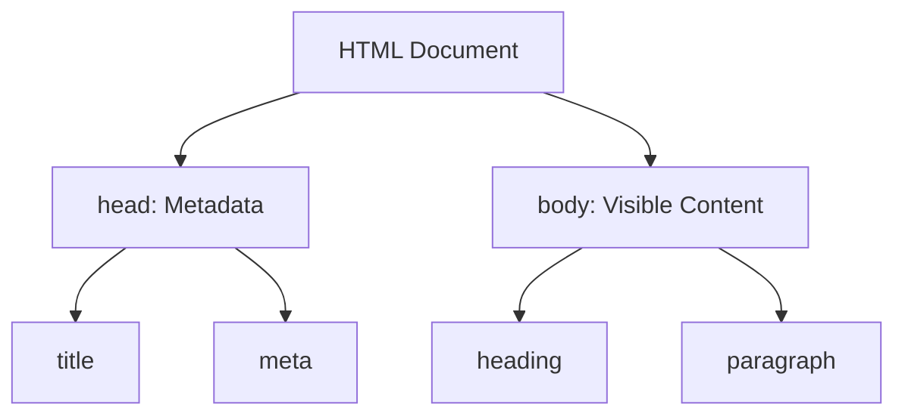

# 🧱 Chapter 7: HTML Fundamentals


> [!TIP]
> **Chapter Goal:** HTML ko zero level se samajhna aur correct structure ke saath apna first web page banana.

---

## 🎯 7.1 Learning Objectives

After completing this chapter, you will be able to:

1. Define HTML and explain its purpose.
2. Differentiate among a tag, element and attribute.
3. Write the basic structure of an HTML document.
4. Explain `DOCTYPE`, `html`, `head`, `title`, `meta` and `body`.
5. Use basic headings, paragraphs, line breaks and thematic breaks.
6. Add comments and character references.
7. Understand nesting, whitespace and void elements.
8. Create, save and open an HTML file.
9. Identify common HTML errors.
10. Build a complete beginner-level web page.

---

## 🗣️ 7.2 Difficult Words: Pronunciation and Meaning

| 🔤 Word | 🔊 Pronunciation | 💡 Simple Meaning |
|---|---|---|
| HTML | एच-टी-एम-एल — *aitch-tee-em-el* | Web-page structure ki language |
| Hypertext | हाइपरटेक्स्ट — *hai-per-tekst* | Links se connected digital text |
| Markup | मार्कअप — *mark-up* | Content ko elements se describe karna |
| Element | एलिमेंट — *el-uh-ment* | HTML document ka meaningful component |
| Tag | टैग — *tag* | Angle brackets me element notation |
| Attribute | एट्रिब्यूट — *uh-trib-yoot* | Element ki extra information |
| Syntax | सिन्टैक्स — *sin-taks* | Code likhne ke grammar rules |
| Metadata | मेटाडेटा — *met-uh-day-tuh* | Document ke baare me information |
| Encoding | एन्कोडिंग — *en-ko-ding* | Characters ko computer representation dena |
| Semantic | सिमैन्टिक — *si-man-tik* | Meaning ko clearly describe karne wala |
| Nesting | नेस्टिंग — *nes-ting* | Ek element ko dusre ke andar rakhna |
| Indentation | इंडेन्टेशन — *in-den-tay-shun* | Code ko spaces se readable arrange karna |
| Validator | वैलिडेटर — *val-i-day-ter* | Code rules check karne wala tool |
| Deprecated | डेप्रिकेटेड — *dep-ri-kay-tid* | Purana, discouraged feature |

---

# 🟦 Part A: Introduction to HTML

## 💡 7.3 What Is HTML?

**HTML** stands for **HyperText Markup Language**.

### 7.3.1 English Explanation

HTML is the standard markup language used to describe the structure and meaning of content in web documents. It uses elements to represent headings, paragraphs, links, images, lists, forms, sections and other content.

### 7.3.2 Hinglish Explanation

HTML web page ka basic structure banati hai. Isme elements use karke browser ko bataya jata hai ki kaunsa content heading hai, kaunsa paragraph hai, kahan image ya link hai aur page ke different parts ka meaning kya hai.

### 7.3.3 Full-Form Meaning

| Word | Meaning |
|---|---|
| HyperText | Aisa text jo hyperlinks ke through other resources se connect ho sakta hai |
| Markup | Tags/elements se content ka structure aur meaning describe karna |
| Language | Defined vocabulary aur syntax rules ka system |

> [!IMPORTANT]
> HTML ek **markup language** hai, general-purpose programming language nahi. HTML structure describe karti hai; application logic ke liye JavaScript jaise tools use hote hain.

---

## 🏗️ 7.4 Role of HTML, CSS and JavaScript

| Technology | Main Role | Human-Body Analogy |
|---|---|---|
| HTML | Structure and meaning | Skeleton |
| CSS | Design and layout | Clothes and appearance |
| JavaScript | Behavior and interaction | Actions and movement |

### Example

- HTML creates a button.
- CSS changes its color and size.
- JavaScript handles what happens when it is clicked.

---

## 🕰️ 7.5 Brief Development of HTML

HTML was created for publishing and linking documents on the Web. It developed through several historical specifications. Modern browsers follow the continuously maintained **HTML Living Standard**.

> [!NOTE]
> “HTML5” term ab bhi commonly modern HTML ke liye use hota hai, lekin current HTML ko continuously maintained living standard ke roop me samajhna better hai.

---

## 🧰 7.6 Tools Required

### 7.6.1 Text or Code Editor

Examples:

- Visual Studio Code
- Notepad
- Notepad++
- Sublime Text
- Any plain-text code editor

### 7.6.2 Web Browser

Examples:

- Google Chrome
- Mozilla Firefox
- Microsoft Edge
- Safari

> [!WARNING]
> Word processor me styled document ke form me HTML save na karein. Plain-text code editor use karein.

---

# 🟩 Part B: HTML Syntax

## 🏷️ 7.7 Tag, Element and Attribute

### 7.7.1 Tag

A tag is source-code notation written inside angle brackets.

```html
<p>
</p>
```

- `<p>` is a start tag.
- `</p>` is an end tag.

### 7.7.2 Element

An element is the complete HTML component, including tags and content where applicable.

```html
<p>Welcome to Web Technology.</p>
```

### 7.7.3 Attribute

An attribute provides additional information or configuration in a start tag.

```html
<p class="intro">Welcome to Web Technology.</p>
```

Here:

- `p` = element name
- `class` = attribute name
- `intro` = attribute value
- Text = element content

### Visual Breakdown

```text
<p class="intro">Welcome to HTML</p>
│  └────┬─────┘ └──────┬───────┘ │
│    attribute        content      │
└──────────── complete element ────┘
```

---

## 🧩 7.8 Paired and Void Elements

### 7.8.1 Elements with Start and End Tags

```html
<h1>Main Heading</h1>
<p>A paragraph.</p>
```

### 7.8.2 Void Elements

Some HTML elements do not have end tags and cannot contain child content.

```html
<br>
<hr>

<meta charset="UTF-8">
<link rel="stylesheet" href="style.css">
<input type="text">
```

> [!CAUTION]
> Void element ke liye invalid closing tag, jaise `</img>`, na likhein.

---

## 🪆 7.9 Nesting Elements

### Correct Nesting

```html
<p>This is <strong>important</strong> information.</p>
```

### Incorrect Nesting

```html
<p>This is <strong>incorrect.</p></strong>
```

Jo inner element baad me open hota hai, use pehle close karein.

```text
Open:  p → strong
Close: strong → p
```

---

## 🔡 7.10 Letter Case and Writing Style

HTML element and attribute names are generally ASCII case-insensitive in HTML syntax, but lowercase is the common coding style.

### Recommended

```html
<p class="note">Hello</p>
```

Use consistent:

- Lowercase element names
- Lowercase attribute names
- Quoted attribute values
- Clear indentation

---

## 📝 7.11 HTML Comments

```html
<!-- This is an HTML comment -->
```

Comments help with code explanation and maintenance.

> [!WARNING]
> Password, secret key ya private information comment me mat likhein. Comment page source me users ko visible ho sakta hai.

---

# 🟨 Part C: Basic HTML Document

## 🧱 7.12 Complete Document Structure

```html
<!DOCTYPE html>
<html lang="en">
<head>
    <meta charset="UTF-8">
    <meta name="viewport" content="width=device-width, initial-scale=1.0">
    <title>My First Web Page</title>
</head>
<body>
    <h1>Welcome to HTML</h1>
    <p>This is my first web page.</p>
</body>
</html>
```



---

## 📢 7.13 DOCTYPE Declaration

```html
<!DOCTYPE html>
```

The HTML doctype is a required preamble used to make browsers process the document in standards mode.

**Hinglish:** DOCTYPE browser ko modern standards mode me page process karne ka signal deta hai. Ye normal HTML element nahi hai.

---

## 🌳 7.14 The `html` Root Element

```html
<html lang="en">
    ...
</html>
```

The `html` element is the document root.

The `lang` attribute identifies the main language:

```html
<html lang="en">
<html lang="hi">
```

It helps screen readers, search tools and language-aware processing.

---

## 🧠 7.15 The `head` Element

The `head` contains metadata and resource references, not the main visible content.

```html
<head>
    <meta charset="UTF-8">
    <title>Student Portal</title>
</head>
```

Common contents include `title`, `meta`, `link`, `style` and suitable `script` references.

---

## 🏷️ 7.16 The `title` Element

```html
<title>HTML Fundamentals | BCA Web Technology</title>
```

The title is commonly used in the browser tab, bookmarks, history and search-result context.

> [!TIP]
> Har page ko clear aur meaningful title dein.

---

## 🔤 7.17 Character Encoding

```html
<meta charset="UTF-8">
```

Encoding browser ko batati hai ki file ko characters ke form me kaise read karna hai. UTF-8 Hindi, English aur many symbols support karti hai.

---

## 📱 7.18 Viewport Metadata

```html
<meta name="viewport" content="width=device-width, initial-scale=1.0">
```

This common setting helps the page use device width appropriately.

> [!NOTE]
> Ye setting responsive design support karti hai, lekin page ko automatically fully responsive nahi banati. Proper CSS bhi required hai.

---

## 👁️ 7.19 The `body` Element

The `body` contains the main rendered content.

```html
<body>
    <h1>College Website</h1>
    <p>Welcome to our website.</p>
</body>
```

It can contain headings, paragraphs, links, images, lists, tables, forms, sections, audio and video.

---

# 🟪 Part D: Basic Content Elements

## 📰 7.20 Headings

HTML provides six heading levels:

```html
<h1>Main Heading</h1>
<h2>Major Section</h2>
<h3>Subsection</h3>
<h4>Smaller Subsection</h4>
<h5>Lower-Level Heading</h5>
<h6>Lowest-Level Heading</h6>
```

Use headings for meaningful hierarchy, not merely for font size.

---

## 📄 7.21 Paragraph

```html
<p>HTML provides the structure of a web page.</p>
```

The `p` element represents a paragraph.

---

## ↩️ 7.22 Line Break

```html
Address Line 1<br>
Address Line 2
```

`br` creates a meaningful line break.

> [!WARNING]
> Page spacing banane ke liye multiple `<br>` use na karein. Spacing CSS se control karein.

---

## ➖ 7.23 Thematic Break

```html
<hr>
```

`hr` represents a thematic break between paragraph-level topics. It is not merely a decorative line.

---

## 📦 7.24 Generic Containers: `div` and `span`

### `div`

```html
<div class="student-card">
    <h2>Aman</h2>
    <p>BCA Student</p>
</div>
```

`div` is a generic container for grouping flow content.

### `span`

```html
<p>Your result is <span class="success">Pass</span>.</p>
```

`span` is a generic phrasing container used inside text.

> [!TIP]
> Meaningful semantic element available ho to unnecessary `div` ya `span` ke bajay semantic element prefer karein.

---

## ⬜ 7.25 Whitespace

Multiple normal spaces and line breaks are often collapsed during ordinary text rendering.

### Source

```html
<p>HTML        is
easy to start.</p>
```

### Typical Output

```text
HTML is easy to start.
```

Layout ke liye CSS use karein.

---

## 🔣 7.26 Character References

| Character | Named Reference |
|---|---|
| `<` | `&lt;` |
| `>` | `&gt;` |
| `&` | `&amp;` |
| Non-breaking space | `&nbsp;` |
| © | `&copy;` |

```html
<p>Use &lt;p&gt; to create a paragraph.</p>
<p>Copyright &copy; 2026</p>
```

---

# 🟥 Part E: Attributes

## ⚙️ 7.27 HTML Attributes

```html
<p id="intro" class="highlight" title="Introduction">
    Welcome to HTML.
</p>
```

Basic form:

```text
attribute-name="attribute value"
```

---

## 🌍 7.28 Global Attributes

| Attribute | Purpose |
|---|---|
| `id` | Document me unique identifier |
| `class` | Styling/scripting ke liye reusable group |
| `title` | Advisory information |
| `lang` | Content language |
| `dir` | Text direction |
| `hidden` | Element ki hidden state |
| `data-*` | Custom data attributes |
| `style` | Inline CSS |
| `tabindex` | Keyboard focus behavior |

### `id` vs `class`

| `id` | `class` |
|---|---|
| Document me unique hona chahiye | Multiple elements share kar sakte hain |
| One specific element identify karta hai | Group identify karti hai |
| `id="main-title"` | `class="note"` |

---

## ☑️ 7.29 Boolean Attributes

```html
<input type="text" required>
<button disabled>Submit</button>
```

Boolean attribute present ho to state true/enabled hoti hai according to its definition.

> [!IMPORTANT]
> `disabled="false"` likhne se attribute false nahi hota. False state ke liye attribute remove kiya jata hai.

---

## ✍️ 7.30 Attribute Practices

1. Names lowercase rakhein.
2. Values quote karein.
3. Duplicate attributes na likhein.
4. Meaningful `id` and `class` names use karein.
5. Sensitive data attributes me expose na karein.

---

# 🟧 Part F: First Web Page

## 💻 7.31 Creating an HTML File

### Step 1: Create Folder

```text
my-first-website
```

### Step 2: Create File

```text
index.html
```

### Step 3: Write Code

```html
<!DOCTYPE html>
<html lang="en">
<head>
    <meta charset="UTF-8">
    <meta name="viewport" content="width=device-width, initial-scale=1.0">
    <title>My First Website</title>
</head>
<body>
    <h1>Welcome to My Website</h1>
    <p>My name is Broun. I am learning HTML.</p>

    <hr>

    <h2>About This Page</h2>
    <p>This page is created using basic HTML elements.</p>
</body>
</html>
```

### Step 4: Save and Check

- File name `index.html` ho.
- Accidentally `index.html.txt` na ho.
- Encoding UTF-8 ho.

### Step 5: Open and Reload

Browser me file open karein. Code edit karne ke baad save karke browser reload karein.

---

## 📁 7.32 Basic Project Structure

```text
my-first-website/
├── index.html
├── css/
├── images/
└── js/
```

Beginning me only `index.html` required hai. Other folders later use honge.

---

## 🧪 7.33 Complete Practice Page

```html
<!DOCTYPE html>
<html lang="en">
<head>
    <meta charset="UTF-8">
    <meta name="viewport" content="width=device-width, initial-scale=1.0">
    <title>BCA Student Profile</title>
</head>
<body>
    <!-- Main page heading -->
    <h1>BCA Student Profile</h1>

    <p>Welcome to my first HTML practice page.</p>

    <hr>

    <h2>Course Information</h2>
    <p>Course: Bachelor of Computer Applications</p>
    <p>Subject: Web Technology</p>

    <h2>Learning Goal</h2>
    <p>My goal is to learn HTML, CSS and JavaScript.</p>

    <p>&copy; 2026 Student Practice Page</p>
</body>
</html>
```

---

## ✅ 7.34 Coding Best Practices

1. Include the doctype.
2. Declare document language.
3. Use UTF-8.
4. Add a meaningful title.
5. Use meaningful elements.
6. Keep nesting correct.
7. Write lowercase names.
8. Quote attribute values.
9. Indent code consistently.
10. Use comments only when helpful.
11. Avoid obsolete presentational elements.
12. Validate important pages.
13. Test in different browsers.
14. Keep content accessible.
15. Separate structure, presentation and behavior.

---

## 🔎 7.35 HTML Validation

Validation checks whether markup follows applicable HTML rules.

Use the [Nu HTML Checker](https://validator.w3.org/nu/) to check documents.

It can find:

- Incorrect nesting
- Missing required attributes
- Duplicate IDs
- Invalid elements or attributes
- Structural mistakes

> [!NOTE]
> Valid code automatically perfect accessibility, design, security ya content quality guarantee nahi karta.

---

## 🚫 7.36 Obsolete Presentational Markup

Avoid older presentation-only elements:

```html
<font color="red">Old style</font>
<center>Centered text</center>
```

Prefer meaningful HTML and CSS:

```html
<p class="warning">Modern structure</p>
```

> [!WARNING]
> Browser old element ko display kar de, iska meaning ye nahi ki new code me use karna correct hai.

---

## 🐞 7.37 Common Mistakes

1. File ko `index.html.txt` save karna.
2. Required end tag bhoolna.
3. Incorrect element nesting.
4. Attribute values ki quotes incorrectly likhna.
5. `lang` attribute omit karna.
6. Character encoding omit karna.
7. Headings ko only visual size ke liye use karna.
8. Visible content `head` me rakhna.
9. Void element ko invalid end tag dena.
10. Comments me secrets likhna.

---

## 📌 7.38 Key Points to Remember

- HTML stands for HyperText Markup Language.
- HTML structure aur meaning describe karti hai.
- Element, tag aur attribute different concepts hain.
- `<!DOCTYPE html>` standards mode support karta hai.
- `html` root element hai.
- `head` metadata contain karta hai.
- `body` main content contain karta hai.
- UTF-8 broad character support provide karta hai.
- Correct nesting essential hai.
- Void elements ke end tags nahi hote.
- HTML comments private nahi hote.
- Visual design CSS se karna chahiye.

---

## 📝 7.39 Chapter Summary

HTML is the standard markup language for structuring web documents. It uses elements represented in source by tags, while attributes provide additional information. A modern document begins with a doctype and contains an `html` root with `head` and `body`. Metadata belongs in the head, while visible content belongs in the body. Correct nesting, meaningful headings, quoted attributes, UTF-8 and consistent indentation create cleaner markup. Validation and browser testing help identify mistakes.

---

## 🎲 7.40 Multiple-Choice Questions

### 1. HTML stands for:

A. HyperText Markup Language  
B. HighText Machine Language  
C. Hyper Transfer Main Link  
D. Home Tool Markup Language  

**✅ Answer:** A

### 2. Which element contains visible content?

A. `head`  
B. `title`  
C. `body`  
D. `meta`  

**✅ Answer:** C

### 3. Which declaration supports standards mode?

A. `<html5>`  
B. `<!DOCTYPE html>`  
C. `<standard>`  
D. `<meta html>`  

**✅ Answer:** B

### 4. Which element sets the browser-tab title?

A. `h1`  
B. `header`  
C. `title`  
D. `caption`  

**✅ Answer:** C

### 5. Which is a void element?

A. `p`  
B. `h1`  
C. `br`  
D. `body`  

**✅ Answer:** C

### 6. Which attribute declares language?

A. `src`  
B. `lang`  
C. `href`  
D. `type`  

**✅ Answer:** B

### 7. Which syntax creates a comment?

A. `// comment`  
B. `/* comment */`  
C. `<!-- comment -->`  
D. `# comment`  

**✅ Answer:** C

### 8. Which element represents a paragraph?

A. `para`  
B. `p`  
C. `text`  
D. `pg`  

**✅ Answer:** B

### 9. Which attribute should be unique?

A. `class`  
B. `id`  
C. `title`  
D. `lang`  

**✅ Answer:** B

### 10. Which technology mainly controls design?

A. HTML  
B. CSS  
C. DNS  
D. HTTP  

**✅ Answer:** B

---

## ✍️ 7.41 Fill in the Blanks

1. HTML is a __________ language.
2. The __________ element is the document root.
3. Metadata is mainly placed inside __________.
4. Visible content is placed inside __________.
5. `class` and `id` are HTML __________.

<details>
<summary><strong>✅ View Answers</strong></summary>

1. markup  
2. `html`  
3. `head`  
4. `body`  
5. attributes

</details>

---

## ✅ 7.42 True or False

1. HTML structures web content.
2. `title` creates the main visible heading.
3. HTML comments are completely private.
4. `br` is a void element.
5. Multiple elements may share a class.
6. An ID should be unique.
7. CSS is preferred for styling.
8. Incorrect nesting is good practice.

<details>
<summary><strong>✅ View Answers</strong></summary>

1. True  
2. False  
3. False  
4. True  
5. True  
6. True  
7. True  
8. False

</details>

---

## ❓ 7.43 Short-Answer Questions

1. Define HTML.
2. Explain the full form of HTML.
3. Differentiate between a tag and an element.
4. What is an attribute?
5. What is a void element?
6. Define nesting.
7. What is the purpose of DOCTYPE?
8. What is the `head` element?
9. What is the `body` element?
10. Why is UTF-8 declared?
11. What is the use of `lang`?
12. Differentiate between `id` and `class`.
13. What is an HTML comment?
14. What is a character reference?
15. What is HTML validation?

---

## 📚 7.44 Long-Answer and Exam Questions

1. Define HTML and explain its uses.
2. Differentiate among tags, elements and attributes.
3. Explain the complete HTML document structure.
4. Explain `DOCTYPE`, `html`, `head`, `title`, `meta` and `body`.
5. Explain paired elements, void elements and nesting.
6. Describe headings, paragraphs, line breaks and thematic breaks.
7. Explain global and boolean attributes.
8. Discuss HTML coding best practices.
9. Explain character references and whitespace.
10. Create and explain a student-profile page.

---

## 🧪 7.45 Practical Exercises

1. Create `index.html`.
2. Add doctype, language, head and body.
3. Set UTF-8 and viewport metadata.
4. Add a meaningful title.
5. Create one `h1`, two `h2` and three paragraphs.
6. Add an HTML comment.
7. Use `hr` for a topic break.
8. Display `<p>` as text using references.
9. Add `id` and `class` attributes.
10. Validate the page.
11. Open it in two browsers.
12. Fix validation errors.

---

## 🎤 7.46 Viva Questions

1. What is HTML?
2. Is HTML a programming language?
3. What is a tag?
4. What is an element?
5. What is an attribute?
6. What is the purpose of DOCTYPE?
7. Which element is the root?
8. Which section contains metadata?
9. Which section contains visible content?
10. What does UTF-8 do?
11. Is `br` a paired element?
12. What is correct nesting?
13. Can multiple elements share a class?
14. Should multiple elements share an ID?
15. Are HTML comments secret?

<details>
<summary><strong>✅ View Short Viva Answers</strong></summary>

1. A markup language for web-document structure and meaning.  
2. No.  
3. Source notation inside angle brackets.  
4. A complete HTML component.  
5. Additional element information.  
6. It triggers standards-mode processing.  
7. `html`.  
8. `head`.  
9. `body`.  
10. It defines character encoding.  
11. No, it is void.  
12. Inner elements close before outer elements.  
13. Yes.  
14. No.  
15. No.

</details>

---

## 🏁 7.47 One-Minute Revision

| Question | Quick Answer |
|---|---|
| HTML full form? | HyperText Markup Language |
| HTML ka role? | Structure and meaning |
| Root element? | `html` |
| Metadata section? | `head` |
| Visible content? | `body` |
| Tab title? | `title` |
| Character encoding? | `meta charset="UTF-8"` |
| Main heading? | `h1` |
| Paragraph? | `p` |
| Comment syntax? | `<!-- ... -->` |
| Unique identifier? | `id` |
| Reusable group? | `class` |

---

## 📚 7.48 Official References

- [WHATWG HTML Living Standard](https://html.spec.whatwg.org/)
- [Nu HTML Checker](https://validator.w3.org/nu/)

---

[⬅️ Previous Chapter](06-http-and-https.md) · [📚 Table of Contents](../SUMMARY.md) · **Next: Text, Links, Images and Lists ➡️**
