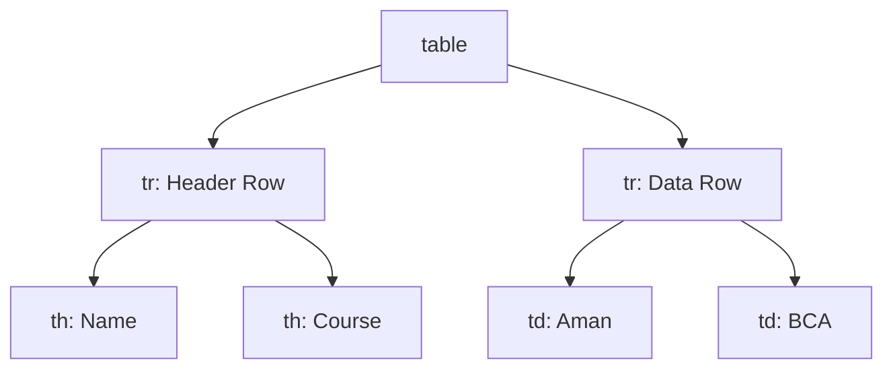
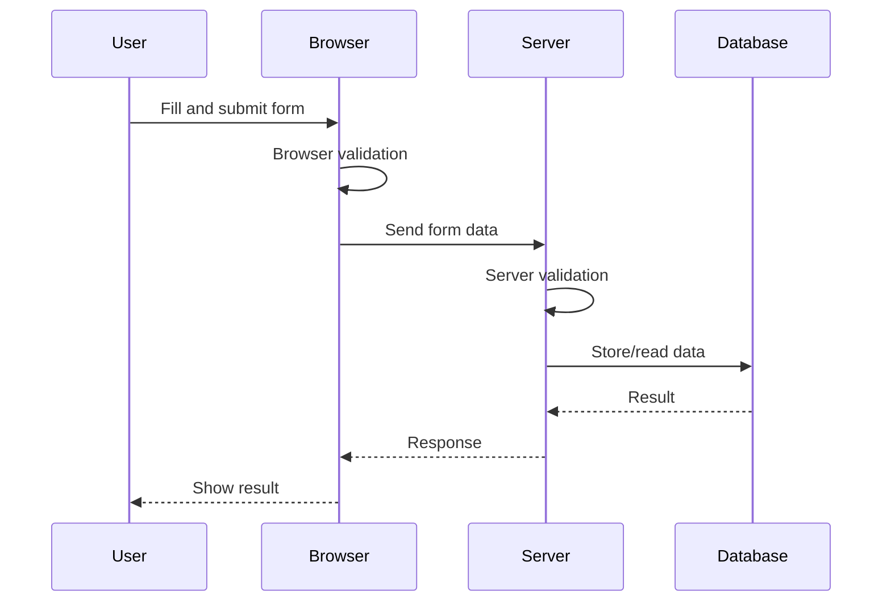

# 📋 Chapter 9: Tables, Forms and Input Elements


> [!TIP]
> **Chapter Goal:** Structured data ko accessible table me present karna aur users se correct, usable aur secure way me data collect karne ke liye HTML forms banana.

---

## 🎯 9.1 Learning Objectives

After completing this chapter, you will be able to:

1. Create simple and structured HTML tables.
2. Use captions, headers, rows and cells correctly.
3. Apply `rowspan` and `colspan`.
4. Build accessible data tables.
5. Define an HTML form and explain form submission.
6. Use labels, inputs, buttons, select menus and text areas.
7. Choose suitable input types.
8. Apply built-in validation attributes.
9. Differentiate between GET and POST.
10. Understand basic form security and accessibility.
11. Create a complete student-registration form.

---

## 🗣️ 9.2 Difficult Words: Pronunciation and Meaning

| 🔤 Word | 🔊 Pronunciation | 💡 Simple Meaning |
|---|---|---|
| Table | टेबल — *tay-bul* | Rows aur columns me data |
| Caption | कैप्शन — *kap-shun* | Table ka visible title |
| Header | हेडर — *hed-er* | Data category batane wala cell |
| Column | कॉलम — *kol-um* | Vertical data group |
| Row | रो — *roh* | Horizontal data group |
| Span | स्पैन — *span* | Multiple cells ki space cover karna |
| Form | फॉर्म — *form* | User data collect karne ka section |
| Input | इनपुट — *in-put* | User dwara diya gaya data |
| Label | लेबल — *lay-bul* | Control ka visible name |
| Submission | सबमिशन — *sub-mish-un* | Form data bhejne ki process |
| Validation | वैलिडेशन — *val-i-day-shun* | Data rules check karna |
| Constraint | कन्स्ट्रेन्ट — *kun-straynt* | Input rule ya limitation |
| Placeholder | प्लेसहोल्डर — *place-hol-der* | Input ke andar temporary hint |
| Checkbox | चेकबॉक्स — *chek-boks* | Multiple independent choices |
| Radio Button | रेडियो बटन — *ray-dee-oh but-un* | Group me one choice |
| Dropdown | ड्रॉपडाउन — *drop-down* | Expand hone wali option list |
| Credential | क्रेडेन्शल — *kri-den-shul* | Identity verify karne wali information |

---

# 🟦 Part A: HTML Tables

## 💡 9.3 What Is an HTML Table?

An HTML table represents data with relationships across rows and columns.

### Examples

- Student marks
- Attendance record
- Product comparison
- Class timetable
- Fee structure
- Monthly sales report

> [!IMPORTANT]
> Tables data ke liye use karein, complete page layout banane ke liye nahi. Page layout CSS se create karein.

---

## 🧱 9.4 Basic Table Structure

```html
<table>
    <tr>
        <th>Name</th>
        <th>Course</th>
        <th>Year</th>
    </tr>
    <tr>
        <td>Aman</td>
        <td>BCA</td>
        <td>First</td>
    </tr>
</table>
```

### Main Elements

| Element | Full Meaning/Role |
|---|---|
| `table` | Complete table container |
| `tr` | Table row |
| `th` | Header cell |
| `td` | Data cell |

### Visual Relationship



---

## 🏷️ 9.5 Table Caption

`caption` table ka visible title or description provide karta hai.

```html
<table>
    <caption>BCA First Semester Students</caption>
    <tr>
        <th>Name</th>
        <th>Roll Number</th>
    </tr>
    <tr>
        <td>Aman</td>
        <td>101</td>
    </tr>
</table>
```

> [!TIP]
> Caption users ko table ka purpose samajhne me help karti hai. Caption ko table ke first child ke roop me place karein.

---

## 🧩 9.6 Table Sections

Large table ko logical groups me divide kiya ja sakta hai.

| Element | Role |
|---|---|
| `thead` | Header rows ka group |
| `tbody` | Main data rows |
| `tfoot` | Summary/footer rows |

```html
<table>
    <caption>Student Marks</caption>

    <thead>
        <tr>
            <th scope="col">Student</th>
            <th scope="col">HTML</th>
            <th scope="col">CSS</th>
        </tr>
    </thead>

    <tbody>
        <tr>
            <th scope="row">Aman</th>
            <td>82</td>
            <td>76</td>
        </tr>
        <tr>
            <th scope="row">Riya</th>
            <td>91</td>
            <td>88</td>
        </tr>
    </tbody>

    <tfoot>
        <tr>
            <th scope="row">Average</th>
            <td>86.5</td>
            <td>82</td>
        </tr>
    </tfoot>
</table>
```

### Benefits

- Better structure
- Easier styling
- Clearer meaning
- Better processing and accessibility

---

## ♿ 9.7 Table Headers and `scope`

`th` identifies a header cell.

`scope` explains whether the header applies to a row, column or group.

### Column Header

```html
<th scope="col">Subject</th>
```

### Row Header

```html
<th scope="row">Aman</th>
```

Common values:

- `col`
- `row`
- `colgroup`
- `rowgroup`

> [!IMPORTANT]
> Visual bold text alone table relationship explain nahi karta. Correct `th` and header associations accessible navigation me help karte hain.

---

## 🔗 9.8 Merging Cells with `colspan`

`colspan` ek cell ko multiple columns cover karata hai.

```html
<table>
    <tr>
        <th colspan="3">BCA Subjects</th>
    </tr>
    <tr>
        <td>HTML</td>
        <td>CSS</td>
        <td>JavaScript</td>
    </tr>
</table>
```

Here, header three columns cover karta hai.

---

## ↕️ 9.9 Merging Cells with `rowspan`

`rowspan` ek cell ko multiple rows cover karata hai.

```html
<table>
    <tr>
        <th>Course</th>
        <th>Subject</th>
    </tr>
    <tr>
        <td rowspan="2">BCA</td>
        <td>Web Technology</td>
    </tr>
    <tr>
        <td>Database Management</td>
    </tr>
</table>
```

> [!CAUTION]
> Complex merged tables users ke liye difficult ho sakti hain. Structure unnecessarily complex na banayein.

---

## 🗓️ 9.10 Complete Timetable Example

```html
<table>
    <caption>BCA Weekly Timetable</caption>
    <thead>
        <tr>
            <th scope="col">Time</th>
            <th scope="col">Monday</th>
            <th scope="col">Tuesday</th>
            <th scope="col">Wednesday</th>
        </tr>
    </thead>
    <tbody>
        <tr>
            <th scope="row">10:00–11:00</th>
            <td>HTML</td>
            <td>Mathematics</td>
            <td>Database</td>
        </tr>
        <tr>
            <th scope="row">11:00–12:00</th>
            <td>CSS</td>
            <td>Programming</td>
            <td>HTML Lab</td>
        </tr>
        <tr>
            <th scope="row">12:00–1:00</th>
            <td colspan="3">Lunch Break</td>
        </tr>
    </tbody>
</table>
```

---

## 🎨 9.11 Basic Table Styling Preview

HTML structure banati hai; CSS appearance control karti hai.

```html
<style>
    table {
        border-collapse: collapse;
        width: 100%;
    }

    th,
    td {
        border: 1px solid #444;
        padding: 0.75rem;
        text-align: left;
    }

    th {
        background-color: #e8f0ff;
    }
</style>
```

Detailed CSS later units me cover hogi.

> [!WARNING]
> Old presentational attributes like `border`, `cellpadding` and `bgcolor` new code me avoid karein. CSS use karein.

---

## 📱 9.12 Responsive Table Consideration

Wide tables small screens par overflow kar sakti hain.

A basic wrapper:

```html
<div class="table-wrapper">
    <table>
        <!-- Table content -->
    </table>
</div>
```

```css
.table-wrapper {
    overflow-x: auto;
}
```

Responsive table design data complexity par depend karti hai. Important headers aur relationships preserve karna necessary hai.

---

## ✅ 9.13 Table Best Practices

1. Table only tabular data ke liye use karein.
2. Meaningful caption provide karein.
3. Headers ke liye `th` use karein.
4. Simple tables me `scope` apply karein.
5. `thead`, `tbody` and `tfoot` use karein where useful.
6. Logical row and column order rakhein.
7. Excessive merged cells avoid karein.
8. Empty cells ka meaning clear ho.
9. CSS se presentation control karein.
10. Keyboard and screen-reader experience test karein.

---

# 🟩 Part B: HTML Forms

## 📝 9.14 What Is an HTML Form?

An HTML form is a section containing interactive controls used to collect and submit user data.

### Common Uses

- Login
- Registration
- Search
- Contact enquiry
- Feedback
- Payment details
- File upload
- Online examination

### Basic Form

```html
<form action="/register" method="post">
    <label for="student-name">Name</label>
    <input type="text" id="student-name" name="student_name">

    <button type="submit">Register</button>
</form>
```

---

## ⚙️ 9.15 The `form` Element

Important attributes:

| Attribute | Purpose |
|---|---|
| `action` | Submission destination URL |
| `method` | Submission method, commonly GET or POST |
| `enctype` | Form-data encoding |
| `autocomplete` | Browser autocomplete guidance |
| `novalidate` | Built-in constraint validation bypass |
| `target` | Response browsing context |
| `name` | Form name |

### Example

```html
<form
    action="/students"
    method="post"
    autocomplete="on">
    <!-- Controls -->
</form>
```

---

## 🔄 9.16 How Form Submission Works

1. User control values enter/select karta hai.
2. Browser applicable validation perform karta hai.
3. Successful controls ke name-value pairs create hote hain.
4. Browser selected method and encoding se request prepare karta hai.
5. Request `action` URL par send hoti hai.
6. Server data validate karta hai.
7. Server processing/database operation karta hai.
8. Server response return karta hai.



---

## 🏷️ 9.17 Labels

Every form control should have a clear accessible label.

### Explicit Association

```html
<label for="email">Email Address</label>
<input type="email" id="email" name="email">
```

`for` value control ke `id` se match karti hai.

### Wrapped Association

```html
<label>
    Email Address
    <input type="email" name="email">
</label>
```

### Benefits

- Control purpose clear hota hai.
- Label click karne par control focus/activate ho sakta hai.
- Assistive technologies ko association milti hai.
- Small controls easier to use hote hain.

> [!WARNING]
> Placeholder proper visible label ka replacement nahi hai.

---

## 🔑 9.18 The `name` Attribute

`name` submitted data ka key banata hai.

```html
<input type="text" id="city" name="city" value="Lucknow">
```

Submitted pair:

```text
city=Lucknow
```

> [!IMPORTANT]
> Input me `id` ho lekin `name` na ho, to normal form submission me uska value usually submitted data set me include nahi hota.

---

## 🆔 9.19 `id`, `name` and `value`

| Attribute | Role |
|---|---|
| `id` | Document me unique identifier; label association |
| `name` | Submission key |
| `value` | Initial/current submitted value |

Example:

```html
<input
    type="text"
    id="course"
    name="course"
    value="BCA">
```

---

# 🟨 Part C: Input Types

## ✏️ 9.20 Text Input

```html
<label for="full-name">Full Name</label>
<input
    type="text"
    id="full-name"
    name="full_name"
    autocomplete="name"
    required>
```

Used for single-line text.

---

## 🔐 9.21 Password Input

```html
<label for="password">Password</label>
<input
    type="password"
    id="password"
    name="password"
    autocomplete="new-password"
    minlength="8"
    required>
```

Browser characters visually conceal karta hai.

> [!CAUTION]
> Password input visual concealment encryption nahi hai. Form HTTPS se submit hona chahiye, aur server passwords ko secure password-hashing process se protect kare.

---

## 📧 9.22 Email Input

```html
<label for="email">Email</label>
<input
    type="email"
    id="email"
    name="email"
    autocomplete="email"
    required>
```

Browser basic email-format validation aur suitable mobile keyboard provide kar sakta hai.

---

## 📞 9.23 Telephone Input

```html
<label for="phone">Phone Number</label>
<input
    type="tel"
    id="phone"
    name="phone"
    autocomplete="tel"
    inputmode="tel">
```

`tel` universal phone-format validation automatically define nahi karta. Required pattern application context ke according set karein.

---

## 🌐 9.24 URL Input

```html
<label for="portfolio">Portfolio URL</label>
<input
    type="url"
    id="portfolio"
    name="portfolio"
    placeholder="https://example.com">
```

---

## 🔢 9.25 Number Input

```html
<label for="semester">Semester</label>
<input
    type="number"
    id="semester"
    name="semester"
    min="1"
    max="6"
    step="1">
```

> [!NOTE]
> Phone number, roll number ya postal code ko number input banana zaroori nahi. Agar arithmetic value nahi hai ya leading zeros important hain, text/tel input more suitable ho sakta hai.

---

## 📏 9.26 Range Input

```html
<label for="confidence">HTML Confidence</label>
<input
    type="range"
    id="confidence"
    name="confidence"
    min="0"
    max="10"
    value="5">
```

Current value display karne ke liye JavaScript/output later use kiya ja sakta hai.

---

## 📅 9.27 Date and Time Inputs

```html
<label for="birth-date">Date of Birth</label>
<input type="date" id="birth-date" name="birth_date">

<label for="meeting-time">Meeting Time</label>
<input type="time" id="meeting-time" name="meeting_time">

<label for="appointment">Appointment</label>
<input
    type="datetime-local"
    id="appointment"
    name="appointment">
```

Other types include `month` and `week`.

Browser user interface platform ke according differ kar sakti hai.

---

## 🎨 9.28 Color Input

```html
<label for="favorite-color">Favorite Color</label>
<input
    type="color"
    id="favorite-color"
    name="favorite_color"
    value="#3366ff">
```

---

## 📁 9.29 File Input

```html
<label for="photo">Profile Photo</label>
<input
    type="file"
    id="photo"
    name="photo"
    accept="image/png, image/jpeg">
```

Multiple files:

```html
<input type="file" name="documents" multiple>
```

File-upload form commonly requires:

```html
<form
    action="/upload"
    method="post"
    enctype="multipart/form-data">
```

> [!WARNING]
> `accept` user-interface hint hai, complete security validation nahi. Server ko file type, content, size, name and storage rules validate karne chahiye.

---

## 🔘 9.30 Radio Buttons

Radio buttons same `name` ke group me normally one option select karne dete hain.

```html
<fieldset>
    <legend>Study Mode</legend>

    <label>
        <input
            type="radio"
            name="study_mode"
            value="online"
            required>
        Online
    </label>

    <label>
        <input
            type="radio"
            name="study_mode"
            value="offline">
        Offline
    </label>
</fieldset>
```

> [!IMPORTANT]
> Radio group ke options ka `name` same hona chahiye; submitted `value` alag hona chahiye.

---

## ☑️ 9.31 Checkboxes

Checkboxes independent yes/no states ya multiple choices ke liye suitable hain.

```html
<fieldset>
    <legend>Skills</legend>

    <label>
        <input type="checkbox" name="skills" value="html">
        HTML
    </label>

    <label>
        <input type="checkbox" name="skills" value="css">
        CSS
    </label>

    <label>
        <input type="checkbox" name="skills" value="javascript">
        JavaScript
    </label>
</fieldset>
```

Required agreement:

```html
<label>
    <input type="checkbox" name="terms" required>
    I agree to the terms.
</label>
```

Unchecked checkbox normal successful submission me value send nahi karti.

---

## 🔎 9.32 Search Input

```html
<label for="site-search">Search Notes</label>
<input
    type="search"
    id="site-search"
    name="q">
```

Semantically search query ke liye suitable hai.

---

## 👻 9.33 Hidden Input

```html
<input type="hidden" name="course_id" value="bca-101">
```

Hidden control visible nahi hota, lekin submitted ho sakta hai.

> [!CAUTION]
> Hidden input secure ya secret nahi hota. User is value ko inspect aur modify kar sakta hai. Server-side trust/authorization check required hai.

---

## 🔄 9.34 Reset, Submit and Button Inputs

```html
<input type="submit" value="Register">
<input type="reset" value="Clear Form">
<input type="button" value="Preview">
```

Usually `button` element more flexible hota hai.

---

# 🟪 Part D: Other Form Controls

## 🔽 9.35 Select Menu

```html
<label for="course">Course</label>
<select id="course" name="course" required>
    <option value="">Select a course</option>
    <option value="bca">BCA</option>
    <option value="bba">BBA</option>
    <option value="bsc">B.Sc.</option>
</select>
```

### Selected Option

```html
<option value="bca" selected>BCA</option>
```

### Option Groups

```html
<select name="subject">
    <optgroup label="Web">
        <option value="html">HTML</option>
        <option value="css">CSS</option>
    </optgroup>
    <optgroup label="Programming">
        <option value="c">C</option>
        <option value="java">Java</option>
    </optgroup>
</select>
```

### Multiple Selection

```html
<select name="skills" multiple size="4">
    <option value="html">HTML</option>
    <option value="css">CSS</option>
    <option value="js">JavaScript</option>
    <option value="php">PHP</option>
</select>
```

---

## 📝 9.36 Text Area

`textarea` multi-line text input ke liye use hota hai.

```html
<label for="address">Address</label>
<textarea
    id="address"
    name="address"
    rows="5"
    cols="40"
    maxlength="300"></textarea>
```

> [!NOTE]
> Textarea ka initial value opening aur closing tags ke beech hota hai, `value` attribute me nahi.

---

## 🔘 9.37 Button Element

```html
<button type="submit">Create Account</button>
<button type="reset">Reset</button>
<button type="button">Show Preview</button>
```

### Button Types

| Type | Work |
|---|---|
| `submit` | Form submit karta hai |
| `reset` | Controls ko initial values par reset karta hai |
| `button` | Default submission action nahi; scripting ke liye |

> [!WARNING]
> Form ke andar button ka `type` explicitly likhein. Unexpected submission avoid hoti hai.

---

## 🧱 9.38 Fieldset and Legend

Related controls ko group karne ke liye:

```html
<fieldset>
    <legend>Personal Information</legend>

    <label for="name">Name</label>
    <input type="text" id="name" name="name">

    <label for="email">Email</label>
    <input type="email" id="email" name="email">
</fieldset>
```

Radio and checkbox groups ke liye especially useful hai.

---

## 📊 9.39 Output, Progress and Meter

### Output

Calculation result represent karta hai.

```html
<output name="result">0</output>
```

### Progress

Task completion progress:

```html
<label for="upload-progress">Upload Progress</label>
<progress id="upload-progress" value="60" max="100">60%</progress>
```

### Meter

Known range ke andar scalar measurement:

```html
<label for="score">HTML Score</label>
<meter id="score" min="0" max="100" value="85">85%</meter>
```

`progress` aur `meter` interchangeable nahi hain.

---

## 📃 9.40 Datalist Suggestions

```html
<label for="city">City</label>
<input list="cities" id="city" name="city">

<datalist id="cities">
    <option value="Lucknow">
    <option value="Kanpur">
    <option value="Varanasi">
    <option value="Prayagraj">
</datalist>
```

User suggestion choose ya other allowed value type kar sakta hai.

---

# 🟥 Part E: Form Validation

## ✅ 9.41 Built-In Validation Attributes

| Attribute | Purpose |
|---|---|
| `required` | Value required |
| `minlength` | Minimum text length |
| `maxlength` | Maximum text length |
| `min` | Minimum numeric/date value |
| `max` | Maximum numeric/date value |
| `step` | Allowed numeric/date increments |
| `pattern` | Regular-expression pattern constraint |
| `type` | Type-specific constraint |
| `multiple` | Multiple values/files allow |
| `accept` | File-type selection hint |

### Example

```html
<label for="username">Username</label>
<input
    type="text"
    id="username"
    name="username"
    minlength="4"
    maxlength="20"
    pattern="[A-Za-z0-9_]+"
    required>
```

---

## 💬 9.42 Placeholder vs Label

```html
<label for="email">Email Address</label>
<input
    type="email"
    id="email"
    name="email"
    placeholder="name@example.com">
```

| Label | Placeholder |
|---|---|
| Control purpose batata hai | Example ya short hint |
| Value enter hone ke baad visible rehta hai | Typing par disappear ho sakta hai |
| Accessibility ke liye important | Label replacement nahi |
| Usually outside control | Control ke andar |

---

## 📴 9.43 Disabled vs Read-Only

### Disabled

```html
<input type="text" name="status" value="Approved" disabled>
```

- User edit/focus nahi kar sakta in normal interaction.
- Normal form submission me included nahi hota.

### Read-Only

```html
<input type="text" name="student_id" value="BCA101" readonly>
```

- User edit nahi kar sakta.
- Value normally submitted ho sakti hai.
- Applicable controls par focus behavior preserved ho sakta hai.

---

## ✨ 9.44 Autocomplete

`autocomplete` browser ko expected data purpose batata hai.

```html
<input
    type="text"
    name="full_name"
    autocomplete="name">

<input
    type="email"
    name="email"
    autocomplete="email">

<input
    type="password"
    name="password"
    autocomplete="new-password">
```

Correct tokens usability aur password-manager support improve kar sakte hain.

---

## 📱 9.45 Input Mode

`inputmode` virtual keyboard hint provide karta hai.

```html
<label for="pin-code">PIN Code</label>
<input
    type="text"
    id="pin-code"
    name="pin_code"
    inputmode="numeric"
    pattern="[0-9]{6}">
```

PIN code arithmetic number nahi hai; text input leading zeros preserve kar sakta hai.

---

## 🧠 9.46 Client-Side vs Server-Side Validation

| Client-Side Validation | Server-Side Validation |
|---|---|
| Browser/device par | Server par |
| Fast feedback | Security and data integrity ke liye essential |
| User modify/bypass kar sakta hai | Authoritative application rules |
| HTML attributes/JavaScript | Back-end code |

> [!IMPORTANT]
> Client-side validation user experience improve karti hai. Server-side validation compulsory hai because client data trusted nahi hota.

---

# 🟧 Part F: GET, POST and Encoding

## 📤 9.47 GET Method

```html
<form action="/search" method="get">
    <label for="query">Search</label>
    <input type="search" id="query" name="q">
    <button type="submit">Search</button>
</form>
```

Possible URL:

```text
/search?q=html
```

### Suitable For

- Search
- Filtering
- Bookmarkable read-only requests
- Non-sensitive query parameters

### Characteristics

- Data URL query me appear hota hai.
- URL bookmark/share ho sakta hai.
- Sensitive data ke liye unsuitable.
- Request safe/read-only intent hona chahiye.

---

## 📥 9.48 POST Method

```html
<form action="/register" method="post">
    <!-- Registration controls -->
</form>
```

### Suitable For

- Registration
- Login submission
- Creating/updating data
- File upload
- Actions with side effects

### Characteristics

- Form data request content/body me sent hota hai.
- URL me normal query form ki tarah directly show nahi hota.
- HTTPS ke bina automatically secure nahi hai.
- Server processing and validation required hai.

---

## ⚖️ 9.49 GET vs POST

| Basis | GET | POST |
|---|---|---|
| Common purpose | Retrieve/search | Submit/process/change |
| Data location | URL query | Request content/body |
| Bookmarkable | Usually yes | Normally no |
| Browser history visibility | URL data visible | Body not shown in URL |
| Sensitive data | Avoid | HTTPS ke saath use, still secure handling needed |
| File upload | Not suitable | Suitable with multipart encoding |
| Idempotent intent | Yes | Not guaranteed |

> [!WARNING]
> POST encryption nahi deta. Sensitive submission ke liye HTTPS necessary hai.

---

## 📦 9.50 Form Encoding Types

### URL-Encoded

Default for many forms:

```text
application/x-www-form-urlencoded
```

### Multipart

Files aur mixed data:

```text
multipart/form-data
```

### Plain Text

```text
text/plain
```

Primarily special/debug contexts; typical production data submission ke liye generally preferred nahi.

---

# 🟫 Part G: Form Accessibility and Security

## ♿ 9.51 Accessible Form Checklist

1. Every control ko visible label dein.
2. `for` and `id` correctly match karein.
3. Related controls `fieldset` and `legend` me group karein.
4. Required status clearly communicate karein.
5. Error message specific ho.
6. Error sirf color se indicate na karein.
7. Logical keyboard order preserve karein.
8. Placeholder ko label replacement na banayein.
9. Instructions control se pehle ya clearly associated rakhein.
10. Button text action explain kare.
11. Correct input type and autocomplete tokens use karein.
12. Touch targets usable rakhein.

---

## 🔐 9.52 Form Security Basics

1. Complete form and response flow par HTTPS use karein.
2. Server-side validation karein.
3. Output context ke according safely encode karein.
4. Authentication and authorization enforce karein.
5. Cross-site request protection apply karein where required.
6. Database queries safely parameterize karein.
7. Password securely hash karein.
8. File uploads strictly validate karein.
9. Rate limiting and abuse controls apply karein.
10. Sensitive values logs me expose na karein.
11. Hidden inputs par trust na karein.
12. User ko unnecessary personal data submit karne ko na kahe.

> [!CAUTION]
> HTML form banana easy hai, lekin submitted data safely process karna back-end security responsibility hai.

---

## 🧪 9.53 Complete Student Registration Form

```html
<!DOCTYPE html>
<html lang="en">
<head>
    <meta charset="UTF-8">
    <meta name="viewport" content="width=device-width, initial-scale=1.0">
    <title>BCA Student Registration</title>
</head>
<body>
    <h1>BCA Student Registration</h1>

    <form
        action="/register"
        method="post"
        enctype="multipart/form-data">

        <fieldset>
            <legend>Personal Information</legend>

            <p>
                <label for="full-name">Full Name</label><br>
                <input
                    type="text"
                    id="full-name"
                    name="full_name"
                    autocomplete="name"
                    minlength="2"
                    maxlength="80"
                    required>
            </p>

            <p>
                <label for="email">Email Address</label><br>
                <input
                    type="email"
                    id="email"
                    name="email"
                    autocomplete="email"
                    required>
            </p>

            <p>
                <label for="phone">Phone Number</label><br>
                <input
                    type="tel"
                    id="phone"
                    name="phone"
                    autocomplete="tel"
                    inputmode="tel">
            </p>

            <p>
                <label for="birth-date">Date of Birth</label><br>
                <input
                    type="date"
                    id="birth-date"
                    name="birth_date"
                    required>
            </p>
        </fieldset>

        <fieldset>
            <legend>Course Information</legend>

            <p>
                <label for="course">Course</label><br>
                <select id="course" name="course" required>
                    <option value="">Select a course</option>
                    <option value="bca">BCA</option>
                    <option value="bba">BBA</option>
                    <option value="bsc">B.Sc.</option>
                </select>
            </p>

            <p>
                <label for="semester">Semester</label><br>
                <input
                    type="number"
                    id="semester"
                    name="semester"
                    min="1"
                    max="6"
                    step="1"
                    required>
            </p>

            <fieldset>
                <legend>Study Mode</legend>

                <label>
                    <input
                        type="radio"
                        name="study_mode"
                        value="regular"
                        required>
                    Regular
                </label>

                <label>
                    <input
                        type="radio"
                        name="study_mode"
                        value="distance">
                    Distance
                </label>
            </fieldset>
        </fieldset>

        <fieldset>
            <legend>Skills and Documents</legend>

            <p>Skills:</p>

            <label>
                <input type="checkbox" name="skills" value="html">
                HTML
            </label>

            <label>
                <input type="checkbox" name="skills" value="css">
                CSS
            </label>

            <label>
                <input type="checkbox" name="skills" value="javascript">
                JavaScript
            </label>

            <p>
                <label for="photo">Profile Photo</label><br>
                <input
                    type="file"
                    id="photo"
                    name="photo"
                    accept="image/png, image/jpeg">
            </p>

            <p>
                <label for="address">Address</label><br>
                <textarea
                    id="address"
                    name="address"
                    rows="5"
                    maxlength="300"
                    autocomplete="street-address"></textarea>
            </p>
        </fieldset>

        <p>
            <label>
                <input type="checkbox" name="terms" required>
                I confirm that the provided information is correct.
            </label>
        </p>

        <button type="submit">Submit Registration</button>
        <button type="reset">Reset Form</button>
    </form>
</body>
</html>
```

> [!NOTE]
> `/register` example server endpoint hai. Sirf HTML file open karne se real registration save nahi hogi. Back-end program required hai.

---

## 🚫 9.54 Common Mistakes

### Table Mistakes

1. Page layout ke liye table use karna.
2. Header cells ke badle only bold `td` use karna.
3. Caption omit karna when table needs one.
4. `rowspan` and `colspan` se invalid grid banana.
5. Mobile overflow ignore karna.
6. Old presentation attributes use karna.

### Form Mistakes

1. Label omit karna.
2. Placeholder ko label banana.
3. `id` and label `for` mismatch.
4. `name` attribute omit karna.
5. Radio group me different names use karna.
6. Button `type` omit karna.
7. Password GET se submit karna.
8. POST ko automatically secure samajhna.
9. Client-side validation par fully trust karna.
10. File upload without server validation.
11. Hidden input ko secure value samajhna.
12. User ko clear error feedback na dena.

---

## 📌 9.55 Key Points to Remember

- `table` tabular data represent karta hai.
- `tr` row, `th` header cell aur `td` data cell hai.
- `caption` table purpose describe karti hai.
- `scope` simple table header relationships clarify karta hai.
- `form` controls aur submission configuration contain karta hai.
- `action` destination aur `method` submission method define karta hai.
- `label` control ka purpose batata hai.
- `name` submitted key hota hai.
- Radio buttons one group me same `name` use karte hain.
- Checkboxes independent/multiple selections allow karte hain.
- GET data URL me, POST data request body me bhejta hai.
- POST automatically encrypted nahi hai.
- Client and server dono validation required hain.
- File upload needs `multipart/form-data` and server security.
- Placeholder label ka replacement nahi hai.

---

## 📝 9.56 Chapter Summary

HTML tables organize related data into rows and columns using `table`, `tr`, `th` and `td`. Captions, header scope and table sections improve structure and accessibility. HTML forms collect user input through labeled controls. The form's `action` and `method` define where and how data is submitted, while each successful control's `name` becomes a submission key. HTML provides specialized input types, select menus, text areas, buttons and grouping elements. Built-in constraints improve feedback, but server-side validation remains essential. GET suits read-only, bookmarkable queries, while POST suits data submission and actions. Secure forms require HTTPS, careful validation, authorization and safe data handling.

---

## 🎲 9.57 Multiple-Choice Questions

### 1. Which element creates a table row?

A. `td`  
B. `tr`  
C. `th`  
D. `row`  

**✅ Answer:** B

### 2. Which element defines a header cell?

A. `th`  
B. `td`  
C. `thead` only  
D. `caption`  

**✅ Answer:** A

### 3. Which attribute merges columns?

A. `rowspan`  
B. `colspan`  
C. `columns`  
D. `merge`  

**✅ Answer:** B

### 4. Which form attribute defines the destination?

A. `method`  
B. `action`  
C. `target`  
D. `name`  

**✅ Answer:** B

### 5. Which input type hides typed characters visually?

A. `text`  
B. `hidden`  
C. `password`  
D. `secret`  

**✅ Answer:** C

### 6. Radio buttons in one group should share:

A. The same `name`  
B. The same `id`  
C. No value  
D. The same label text  

**✅ Answer:** A

### 7. Which control accepts multi-line text?

A. `input type="text"`  
B. `textarea`  
C. `select`  
D. `option`  

**✅ Answer:** B

### 8. File upload requires which encoding?

A. `text/plain` always  
B. `multipart/form-data`  
C. `application/json` in the form attribute  
D. `image/html`  

**✅ Answer:** B

### 9. Which attribute makes a value compulsory?

A. `needed`  
B. `required`  
C. `validate`  
D. `must`  

**✅ Answer:** B

### 10. Which method normally places form data in the URL query?

A. POST  
B. GET  
C. PATCH  
D. DELETE  

**✅ Answer:** B

---

## ✍️ 9.58 Fill in the Blanks

1. Table data cells use the __________ element.
2. A table's visible title uses __________.
3. A label's `for` value matches the control's __________.
4. Submitted form key comes from the __________ attribute.
5. Multi-line input uses __________.

<details>
<summary><strong>✅ View Answers</strong></summary>

1. `td`  
2. `caption`  
3. `id`  
4. `name`  
5. `textarea`

</details>

---

## ✅ 9.59 True or False

1. Tables should be used for full page layout.
2. `th` represents a header cell.
3. Placeholder fully replaces a label.
4. POST automatically encrypts data.
5. Server-side validation is essential.
6. Unchecked checkboxes normally submit their value.
7. Radio options in one group use the same name.
8. A hidden input is secure from modification.
9. `readonly` values may be submitted.
10. File type must be validated on the server.

<details>
<summary><strong>✅ View Answers</strong></summary>

1. False  
2. True  
3. False  
4. False  
5. True  
6. False  
7. True  
8. False  
9. True  
10. True

</details>

---

## ❓ 9.60 Short-Answer Questions

1. Define an HTML table.
2. Differentiate between `th` and `td`.
3. What is the use of `caption`?
4. Define `rowspan` and `colspan`.
5. What is the purpose of `scope`?
6. Define an HTML form.
7. Explain `action` and `method`.
8. Why is a label required?
9. Differentiate between `id` and `name` in a form.
10. Differentiate between radio buttons and checkboxes.
11. What is a textarea?
12. What is a select menu?
13. Define built-in form validation.
14. Differentiate between disabled and readonly.
15. Differentiate between GET and POST.

---

## 📚 9.61 Long-Answer and Exam Questions

1. Explain HTML table structure with a complete example.
2. Explain captions, headers, table sections and scope.
3. Explain `rowspan` and `colspan` with examples.
4. Define HTML forms and explain submission flow.
5. Explain important `form` attributes.
6. Describe all major input types with examples.
7. Explain labels, fieldsets and legends.
8. Discuss built-in validation attributes.
9. Differentiate between GET and POST.
10. Explain form accessibility best practices.
11. Discuss form security risks and precautions.
12. Create and explain a complete student-registration form.

---

## 🧪 9.62 Practical Exercises

1. Create a student-marks table.
2. Add caption, thead, tbody and tfoot.
3. Use row and column headers with scope.
4. Create a timetable using colspan.
5. Create a subject table using rowspan.
6. Create a contact form with labels.
7. Add text, email, phone and date controls.
8. Create a radio group and checkbox group.
9. Create a course select menu.
10. Add a textarea and file upload.
11. Apply required, minlength, maxlength, min and max.
12. Compare GET and POST using Developer Tools.
13. Build the complete registration form.
14. Validate the final HTML.

---

## 🎤 9.63 Viva Questions

1. What is the purpose of `table`?
2. What does `tr` represent?
3. What is the difference between `th` and `td`?
4. What is `caption`?
5. What does `colspan` do?
6. What is a form?
7. What does `action` define?
8. What does `method` define?
9. Why is `name` important?
10. How is a label associated with an input?
11. Which input type is used for email?
12. Which control accepts multiple lines?
13. What is a fieldset?
14. Which method exposes values in the URL query?
15. Is client-side validation sufficient for security?

<details>
<summary><strong>✅ View Short Viva Answers</strong></summary>

1. It represents tabular data.  
2. A table row.  
3. Header cell vs data cell.  
4. A visible table title/description.  
5. It makes a cell cover multiple columns.  
6. A section of controls for collecting/submitting data.  
7. Submission destination.  
8. Submission method.  
9. It becomes the submitted data key.  
10. Match label `for` with control `id`.  
11. `email`.  
12. `textarea`.  
13. A group of related form controls.  
14. GET.  
15. No.

</details>

---

## 🏁 9.64 One-Minute Revision

| Question | Quick Answer |
|---|---|
| Table container? | `table` |
| Row? | `tr` |
| Header cell? | `th` |
| Data cell? | `td` |
| Table title? | `caption` |
| Form container? | `form` |
| Destination? | `action` |
| Submission method? | `method` |
| Control key? | `name` |
| Label connection? | `for` ↔ `id` |
| One group choice? | Radio |
| Multiple choices? | Checkbox |
| Multi-line input? | `textarea` |
| URL query method? | GET |
| File form encoding? | `multipart/form-data` |

---

## 📚 9.65 Official Reference

- [WHATWG HTML Living Standard — Forms](https://html.spec.whatwg.org/multipage/forms.html)
- [WHATWG HTML Living Standard — Tables](https://html.spec.whatwg.org/multipage/tables.html)

---

[⬅️ Previous Chapter](08-text-links-images-and-lists.md) · [📚 Table of Contents](../SUMMARY.md) · **Next: Semantic HTML and Multimedia ➡️**
