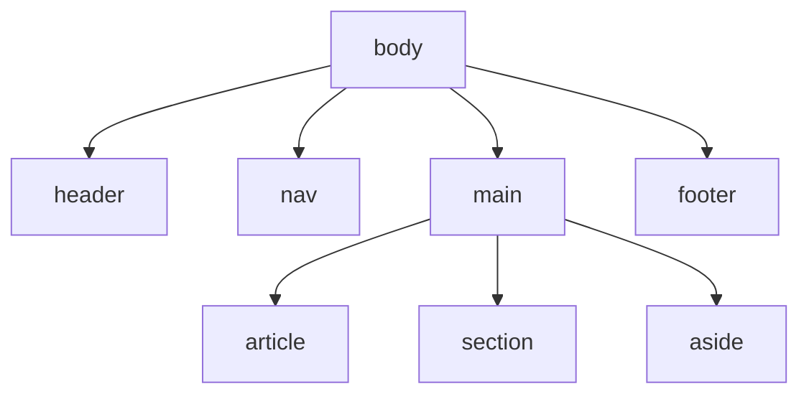

# 🎬 Chapter 10: Semantic HTML and Multimedia


> [!TIP]
> **Chapter Goal:** Web page ke different parts ko meaningful semantic elements se organize karna aur accessible audio, video aur embedded content add karna.

---

## 🎯 10.1 Learning Objectives

After completing this chapter, you will be able to:

1. Define semantic HTML.
2. Differentiate between semantic and generic elements.
3. Use `header`, `nav`, `main`, `section`, `article`, `aside` and `footer`.
4. Select suitable page-structure elements.
5. Use `figure` and `figcaption`.
6. Create disclosure widgets with `details` and `summary`.
7. Add audio and video with multiple sources.
8. Add captions and subtitles using `track`.
9. Embed external content using `iframe` safely.
10. Create a complete semantic multimedia webpage.

---

## 🗣️ 10.2 Difficult Words: Pronunciation and Meaning

| 🔤 Word | 🔊 Pronunciation | 💡 Simple Meaning |
|---|---|---|
| Semantic | सिमैन्टिक — *si-man-tik* | Meaning clearly batane wala |
| Structure | स्ट्रक्चर — *struk-cher* | Content ka organization |
| Landmark | लैंडमार्क — *land-mark* | Page ka identifiable major region |
| Navigation | नैविगेशन — *nav-i-gay-shun* | Pages/sections ke beech move karna |
| Article | आर्टिकल — *aar-ti-kul* | Independent content unit |
| Section | सेक्शन — *sek-shun* | Thematic content group |
| Complementary | कॉम्प्लिमेन्टरी — *kom-pli-men-tuh-ree* | Main content ko support karne wala |
| Multimedia | मल्टीमीडिया — *mul-tee-mee-dee-uh* | Text, audio, video aur images ka combination |
| Codec | कोडेक — *ko-dek* | Media encode/decode technology |
| Subtitle | सबटाइटल — *sub-tai-tul* | Dialogue ka translated/displayed text |
| Caption | कैप्शन — *kap-shun* | Speech aur relevant sounds ka text |
| Transcript | ट्रांसक्रिप्ट — *tran-skript* | Audio/video ka written version |
| Embedded | एम्बेडेड — *em-bed-id* | Page ke andar included |
| Sandbox | सैंडबॉक्स — *sand-boks* | Embedded content par restrictions |
| Autoplay | ऑटोप्ले — *aw-to-play* | Media ka automatically start hona |

---

# 🟦 Part A: Semantic HTML

## 💡 10.3 What Is Semantic HTML?

### 10.3.1 English Explanation

Semantic HTML uses elements according to the meaning and role of their content. The element name helps browsers, developers, search systems and assistive technologies understand the document structure.

### 10.3.2 Hinglish Explanation

Semantic HTML me element content ka purpose clearly batata hai. Example: navigation links ke group ke liye `nav` aur page ke main content ke liye `main`.

### Example

Less meaningful:

```html
<div class="navigation">...</div>
<div class="main-content">...</div>
```

More meaningful:

```html
<nav>...</nav>
<main>...</main>
```

> [!IMPORTANT]
> Semantic element ka selection uske meaning se karein, default appearance se nahi. Visual design CSS se control hoti hai.

---

## ⚖️ 10.4 Semantic vs Generic Elements

| Semantic Elements | Generic Elements |
|---|---|
| Content role describe karte hain | Built-in specific meaning nahi |
| Examples: `nav`, `main`, `article` | Examples: `div`, `span` |
| Document understanding improve karte hain | Grouping/styling hooks ke liye useful |
| Landmarks or structural meaning provide kar sakte hain | Meaning class/attributes/context se aata hai |

### When to Use `div`

`div` wrong element nahi hai. Use when:

- Suitable semantic element available nahi hai.
- Styling/layout grouping required hai.
- Script ko generic container chahiye.

---

## ✅ 10.5 Benefits of Semantic HTML

1. Clear source-code structure
2. Easier maintenance
3. Better accessibility foundation
4. Meaningful browser/assistive processing
5. Search systems ko better context
6. Less unnecessary class naming
7. Reusable and understandable components

> [!NOTE]
> Semantic HTML accessibility aur SEO me help karti hai, lekin alone complete accessibility ya ranking guarantee nahi karti.

---

# 🟩 Part B: Structural Elements

## 🏠 10.6 The `header` Element

`header` introductory content or navigational aids represent karta hai for its nearest sectioning/root context.

Possible contents:

- Logo
- Heading
- Introductory text
- Navigation
- Search
- Author information

```html
<header>
    <h1>BCA Web Technology</h1>
    <p>Beginner to Advanced Learning</p>
</header>
```

A page me more than one `header` ho sakta hai—for example page header and article header.

> [!NOTE]
> `header` automatically top par fixed nahi hota. Position CSS control karti hai.

---

## 🧭 10.7 The `nav` Element

`nav` major navigation links ka section represent karta hai.

```html
<nav aria-label="Main navigation">
    <ul>
        <li><a href="index.html">Home</a></li>
        <li><a href="chapters.html">Chapters</a></li>
        <li><a href="projects.html">Projects</a></li>
    </ul>
</nav>
```

Not every group of links must be inside `nav`. Major navigation blocks ke liye use karein.

Multiple navigation areas ho to accessible labels useful hote hain:

```html
<nav aria-label="Main navigation">...</nav>
<nav aria-label="Chapter navigation">...</nav>
```

---

## 🎯 10.8 The `main` Element

`main` document body ke dominant, unique content ko represent karta hai.

```html
<main>
    <h1>HTML Course</h1>
    <p>Learn modern HTML step by step.</p>
</main>
```

### Rules and Practices

- Visible page me generally one primary `main` region rakhein.
- Repeated site header, main navigation aur footer ko `main` ke outside rakhein.
- Main content page-specific hona chahiye.

---

## 📚 10.9 The `section` Element

`section` thematic grouping of content represent karta hai, usually with a heading.

```html
<section>
    <h2>Course Objectives</h2>
    <p>This course teaches web development fundamentals.</p>
</section>
```

### Use `section` When

- Content ek meaningful topic/group banata hai.
- Group ka heading logical hai.
- Document outline me section meaningful hai.

### Do Not Use Only for Styling

If grouping ka semantic topic nahi hai, `div` more suitable ho sakta hai.

---

## 📰 10.10 The `article` Element

`article` self-contained composition represent karta hai jo independently distribute, reuse or understand kiya ja sakta hai.

Examples:

- Blog post
- News story
- Forum post
- Product card in suitable context
- User comment
- Independent tutorial

```html
<article>
    <header>
        <h2>Why Learn HTML?</h2>
        <p>Published by Broun</p>
    </header>

    <p>HTML is the foundation of web content.</p>

    <footer>
        <p>Updated: 30 August 2026</p>
    </footer>
</article>
```

---

## 📎 10.11 The `aside` Element

`aside` content represent karta hai jo surrounding content se indirectly or tangentially related hai.

Examples:

- Related links
- Sidebar
- Glossary note
- Author bio
- Pull quote
- Related advertisement

```html
<aside>
    <h2>Related Topics</h2>
    <ul>
        <li><a href="css.html">CSS Basics</a></li>
        <li><a href="js.html">JavaScript Basics</a></li>
    </ul>
</aside>
```

> [!WARNING]
> `aside` ka meaning simply “right side” nahi hai. Visual position CSS determine karti hai.

---

## 🦶 10.12 The `footer` Element

`footer` nearest section or page ke footer information represent karta hai.

Possible contents:

- Author information
- Copyright
- Related navigation
- Contact details
- Publication information
- Legal links

```html
<footer>
    <p>&copy; 2026 Broun Verma</p>
    <a href="privacy.html">Privacy Policy</a>
</footer>
```

Page aur individual article dono ke footer ho sakte hain.

---

## 📍 10.13 The `address` Element

`address` nearest article or body ke relevant person/organization ki contact information represent karta hai.

```html
<address>
    Written by Broun Verma<br>
    Email: <a href="mailto:contact@example.com">contact@example.com</a>
</address>
```

Arbitrary postal address ya italic styling ke liye use na karein.

---

## 🔎 10.14 The `search` Element

`search` search or filtering controls ka region represent kar sakta hai.

```html
<search>
    <form action="/search" method="get">
        <label for="site-search">Search chapters</label>
        <input type="search" id="site-search" name="q">
        <button type="submit">Search</button>
    </form>
</search>
```

---

## 🧱 10.15 Typical Semantic Page Structure



### HTML Example

```html
<body>
    <header>
        <h1>College Portal</h1>
    </header>

    <nav aria-label="Main navigation">
        <!-- Main links -->
    </nav>

    <main>
        <article>
            <h2>Admission News</h2>
            <p>Admission forms are now available.</p>
        </article>

        <aside>
            <h2>Important Links</h2>
            <!-- Related links -->
        </aside>
    </main>

    <footer>
        <p>&copy; 2026 College Portal</p>
    </footer>
</body>
```

---

## 🧠 10.16 `section` vs `article` vs `div`

| Element | Main Question |
|---|---|
| `section` | Kya ye thematic section hai, usually heading ke saath? |
| `article` | Kya ye independently meaningful/reusable content unit hai? |
| `div` | Kya generic grouping needed hai and no better semantic element exists? |

### Example Decision

- Complete blog post → `article`
- Blog post ka “Benefits” topic → `section`
- Styling wrapper around cards → `div`

---

# 🟨 Part C: Supporting Semantic Elements

## 🖼️ 10.17 Figure and Figcaption

`figure` self-contained content represent karta hai jo main flow me referenced ho sakta hai.

```html
<figure>
    
    <figcaption>
        Figure 10.1: Basic client-server communication
    </figcaption>
</figure>
```

Figure can contain:

- Image
- Diagram
- Code listing
- Quotation
- Table
- Illustration

---

## 🔽 10.18 Details and Summary

`details` disclosure widget create karta hai. `summary` visible label hota hai.

```html
<details>
    <summary>What is semantic HTML?</summary>
    <p>
        Semantic HTML uses elements according to the meaning
        of their content.
    </p>
</details>
```

Open by default:

```html
<details open>
    <summary>Chapter Objectives</summary>
    <p>Learn page structure and multimedia.</p>
</details>
```

Suitable for:

- FAQ answers
- Extra notes
- Expandable explanations
- Optional details

> [!TIP]
> `summary` clear aur meaningful hona chahiye.

---

## 💬 10.19 Dialog Introduction

`dialog` dialog box or interactive component represent karta hai.

```html
<dialog id="course-dialog">
    <h2>Course Enquiry</h2>
    <p>Please contact the department office.</p>
    <button type="button">Close</button>
</dialog>
```

Dialog ko properly open/close karne aur focus manage karne ke liye JavaScript and accessibility handling required hoti hai. Detailed interaction later cover hogi.

---

# 🟪 Part D: Audio

## 🔊 10.20 The `audio` Element

`audio` page me sound content embed karta hai.

```html
<audio controls src="media/html-introduction.mp3">
    Your browser does not support embedded audio.
</audio>
```

### Important Attributes

| Attribute | Purpose |
|---|---|
| `controls` | Browser audio controls show karta hai |
| `autoplay` | Automatic play request |
| `loop` | Playback repeat |
| `muted` | Initially muted |
| `preload` | Loading hint |

> [!WARNING]
> Audio autoplay users ko disturb kar sakta hai aur browser block bhi kar sakta hai. User-initiated playback prefer karein.

---

## 🎵 10.21 Multiple Audio Sources

```html
<audio controls preload="metadata">
    <source src="media/lesson.ogg" type="audio/ogg">
    <source src="media/lesson.mp3" type="audio/mpeg">

    <p>
        Audio playback is unavailable.
        <a href="media/lesson.mp3">Download the lesson audio</a>.
    </p>
</audio>
```

Browser first supported source choose kar sakta hai.

---

## 📝 10.22 Audio Transcript

Audio information ko text transcript ke form me bhi provide karein.

```html
<section>
    <h2>HTML Audio Lesson</h2>

    <audio controls>
        <source src="media/html-lesson.mp3" type="audio/mpeg">
    </audio>

    <details>
        <summary>Read transcript</summary>
        <p>
            Welcome to the HTML lesson. In this lesson,
            we will learn semantic page structure.
        </p>
    </details>
</section>
```

Transcript users ko search, review aur non-audio access me help karta hai.

---

# 🟥 Part E: Video

## 🎥 10.23 The `video` Element

```html
<video
    controls
    width="800"
    height="450"
    poster="images/video-cover.jpg">
    <source src="media/html-course.mp4" type="video/mp4">

    <p>
        Your browser cannot play this video.
        <a href="media/html-course.mp4">Download the video</a>.
    </p>
</video>
```

### Important Attributes

| Attribute | Purpose |
|---|---|
| `controls` | Playback controls |
| `width` and `height` | Display/intrinsic dimensions |
| `poster` | Playback se pehle cover image |
| `autoplay` | Automatic play request |
| `muted` | Initially muted |
| `loop` | Repeat playback |
| `playsinline` | Suitable mobile inline playback hint |
| `preload` | Loading hint |

---

## 📦 10.24 Multiple Video Sources

```html
<video controls width="800" height="450">
    <source src="media/lesson.webm" type="video/webm">
    <source src="media/lesson.mp4" type="video/mp4">

    <p>
        Video is unavailable.
        <a href="media/lesson.mp4">Download MP4</a>.
    </p>
</video>
```

Actual support container, codec and browser/platform par depend karti hai.

---

## 💬 10.25 Captions and Subtitles with `track`

```html
<video controls width="800" height="450">
    <source src="media/lesson.mp4" type="video/mp4">

    <track
        kind="captions"
        src="captions/lesson-en.vtt"
        srclang="en"
        label="English"
        default>

    <track
        kind="subtitles"
        src="captions/lesson-hi.vtt"
        srclang="hi"
        label="Hindi">
</video>
```

### Track Kinds

| `kind` | Use |
|---|---|
| `captions` | Speech plus relevant non-speech audio text |
| `subtitles` | Dialogue translation/transcription |
| `descriptions` | Visual-content descriptions |
| `chapters` | Navigation chapters |
| `metadata` | Script-readable timed metadata |

### Captions vs Subtitles

- **Captions:** Dialogue ke saath meaningful sounds bhi represent karte hain.
- **Subtitles:** Usually spoken dialogue ka text/translation.

> [!IMPORTANT]
> Educational video me accurate synchronized captions provide karna accessibility ke liye important hai.

---

## 📄 10.26 Basic WebVTT File

File: `captions/lesson-en.vtt`

```text
WEBVTT

00:00:00.000 --> 00:00:04.000
Welcome to the HTML course.

00:00:04.500 --> 00:00:09.000
Today we will learn semantic page structure.
```

WebVTT file normally `WEBVTT` header se start hoti hai.

---

## ♿ 10.27 Accessible Multimedia Checklist

### Audio

1. Visible controls provide karein.
2. Transcript provide karein.
3. Autoplay avoid karein.
4. Important audio notification ka text alternative ho.

### Video

1. Accurate captions provide karein.
2. Transcript useful ho to add karein.
3. Visual information ke descriptions consider karein.
4. Keyboard-accessible controls ho.
5. Flashing content safety consider karein.
6. Meaning sirf color ya sound par depend na ho.
7. Poster meaningful ho, but captions replace nahi karta.

---

## ⚡ 10.28 Multimedia Performance

1. Media compress and optimize karein.
2. Suitable resolution use karein.
3. Multiple formats only when needed.
4. `preload` thoughtfully set karein.
5. Large media files CDN/streaming platform par serve ki ja sakti hain.
6. Poster image optimize karein.
7. Page load me unnecessary autoplay avoid karein.
8. User network and data cost consider karein.

### Preload Values

| Value | Basic Hint |
|---|---|
| `none` | Media preload na karne ka hint |
| `metadata` | Only metadata load preference |
| `auto` | Browser ko more data preload karne ki permission/hint |

Browser final behavior decide kar sakta hai.

---

# 🟧 Part F: Embedded Content

## 🪟 10.29 The `iframe` Element

`iframe` current page ke andar another browsing context/document embed karta hai.

```html
<iframe
    src="https://example.com/embedded-page"
    title="Example course preview"
    width="800"
    height="450"
    loading="lazy">
</iframe>
```

### Important Attributes

| Attribute | Purpose |
|---|---|
| `src` | Embedded page URL |
| `title` | Frame purpose ka accessible name |
| `width` and `height` | Dimensions |
| `loading="lazy"` | Off-screen loading defer hint |
| `allow` | Selected features/permissions policy |
| `sandbox` | Embedded content restrictions |
| `referrerpolicy` | Referrer behavior |

> [!IMPORTANT]
> Every meaningful iframe ko clear `title` dein.

---

## 🔐 10.30 Iframe Sandbox

A sandboxed frame par restrictions apply ki ja sakti hain.

```html
<iframe
    src="embedded-content.html"
    title="Student project preview"
    sandbox>
</iframe>
```

Selected capabilities tokens se allow ki ja sakti hain:

```html
<iframe
    src="trusted-tool.html"
    title="Trusted learning tool"
    sandbox="allow-scripts">
</iframe>
```

> [!CAUTION]
> Sandbox tokens bina samjhe add na karein. Powerful combinations restrictions ko reduce kar sakte hain. Least required permissions use karein.

---

## 🗺️ 10.31 External Video or Map Embed

Provider embed code use karte waqt:

1. Source trusted ho.
2. User privacy consider karein.
3. `title` add karein.
4. Required features only allow karein.
5. Lazy loading consider karein.
6. Consent requirements applicable hon to follow karein.
7. Fallback link provide karein where helpful.

---

## 📦 10.32 `embed` and `object` Introduction

### `embed`

External content/resource embed kar sakta hai.

```html
<embed
    src="documents/syllabus.pdf"
    type="application/pdf"
    width="800"
    height="600">
```

### `object`

External resource represent kar sakta hai with fallback content.

```html
<object
    data="documents/syllabus.pdf"
    type="application/pdf"
    width="800"
    height="600">
    <p>
        PDF preview unavailable.
        <a href="documents/syllabus.pdf">Download the syllabus</a>.
    </p>
</object>
```

Browser support and accessibility vary. Direct download/view link useful fallback hai.

---

# 🟫 Part G: Complete Practical Page

## 🧪 10.33 Semantic Multimedia Course Page

### Project Structure

```text
semantic-course/
├── index.html
├── images/
│   ├── course-cover.jpg
│   └── video-cover.jpg
├── media/
│   ├── introduction.mp3
│   └── html-lesson.mp4
└── captions/
    └── html-lesson-en.vtt
```

### Complete HTML

```html
<!DOCTYPE html>
<html lang="en">
<head>
    <meta charset="UTF-8">
    <meta name="viewport" content="width=device-width, initial-scale=1.0">
    <title>HTML Learning Hub</title>
</head>
<body>
    <header>
        <h1>HTML Learning Hub</h1>
        <p>Learn semantic HTML and multimedia step by step.</p>
    </header>

    <nav aria-label="Main navigation">
        <ul>
            <li><a href="#overview">Overview</a></li>
            <li><a href="#audio-lesson">Audio Lesson</a></li>
            <li><a href="#video-lesson">Video Lesson</a></li>
            <li><a href="#faq">FAQ</a></li>
        </ul>
    </nav>

    <main>
        <article>
            <header>
                <h2 id="overview">Semantic HTML Course</h2>
                <p>
                    Published on
                    <time datetime="2026-08-30">30 August 2026</time>
                </p>
            </header>

            <figure>
                
                <figcaption>
                    Start your semantic HTML journey.
                </figcaption>
            </figure>

            <section>
                <h3>Course Overview</h3>
                <p>
                    This course explains meaningful page structure,
                    audio, video and accessible embedded content.
                </p>
            </section>

            <section id="audio-lesson">
                <h3>Audio Introduction</h3>

                <audio controls preload="metadata">
                    <source
                        src="media/introduction.mp3"
                        type="audio/mpeg">

                    <p>
                        Audio playback unavailable.
                        <a href="media/introduction.mp3">
                            Download the audio
                        </a>.
                    </p>
                </audio>

                <details>
                    <summary>Read audio transcript</summary>
                    <p>
                        Welcome to the semantic HTML course.
                        Semantic elements describe the purpose of content.
                    </p>
                </details>
            </section>

            <section id="video-lesson">
                <h3>Video Lesson</h3>

                <video
                    controls
                    width="800"
                    height="450"
                    poster="images/video-cover.jpg"
                    preload="metadata">

                    <source
                        src="media/html-lesson.mp4"
                        type="video/mp4">

                    <track
                        kind="captions"
                        src="captions/html-lesson-en.vtt"
                        srclang="en"
                        label="English"
                        default>

                    <p>
                        Video playback unavailable.
                        <a href="media/html-lesson.mp4">
                            Download the video
                        </a>.
                    </p>
                </video>
            </section>

            <section id="faq">
                <h3>Frequently Asked Questions</h3>

                <details>
                    <summary>Is semantic HTML difficult?</summary>
                    <p>
                        No. Start by selecting elements according
                        to the meaning of their content.
                    </p>
                </details>

                <details>
                    <summary>Are captions required?</summary>
                    <p>
                        Accurate captions make video content
                        accessible to more users.
                    </p>
                </details>
            </section>

            <footer>
                <p>Course author: Broun Verma</p>
            </footer>
        </article>

        <aside>
            <h2>Related Chapters</h2>
            <ul>
                <li>
                    <a href="html-fundamentals.html">
                        HTML Fundamentals
                    </a>
                </li>
                <li>
                    <a href="forms.html">
                        HTML Forms
                    </a>
                </li>
            </ul>
        </aside>
    </main>

    <footer>
        <address>
            Contact:
            <a href="mailto:course@example.com">
                course@example.com
            </a>
        </address>
        <p><small>&copy; 2026 HTML Learning Hub</small></p>
    </footer>
</body>
</html>
```

---

## ♿ 10.34 Semantic Accessibility Checklist

1. Page me one clear `h1` use karein.
2. Headings logical hierarchy me ho.
3. Main page content `main` me ho.
4. Major navigation `nav` me ho.
5. Multiple navigation regions ko labels dein.
6. `section` ko meaningful heading dein.
7. Independent content ke liye `article` use karein.
8. Complementary content ke liye `aside` use karein.
9. Images ko correct alt text dein.
10. Audio transcript provide karein.
11. Video captions provide karein.
12. Iframe ko descriptive title dein.
13. Keyboard navigation test karein.
14. Semantics ko only visual layout se confuse na karein.

---

## 🚫 10.35 Common Mistakes

1. Har container ko `div` banana.
2. Har group ko unnecessary `section` banana.
3. `section` ko heading ke bina use karna when a heading is expected.
4. `article` ko simple styling wrapper samajhna.
5. `aside` ko only right-side box samajhna.
6. Multiple visible primary `main` regions use karna.
7. Header/footer ko automatically fixed position samajhna.
8. Audio/video ko controls ke bina add karna.
9. Autoplay with sound use karna.
10. Captions aur subtitles ko same samajhna.
11. Video caption file ka wrong path.
12. Iframe title omit karna.
13. External embeds ko unlimited permissions dena.
14. Huge unoptimized media file upload karna.
15. Fallback link/content omit karna.

---

## 📌 10.36 Key Points to Remember

- Semantic HTML content ka role describe karti hai.
- `header` introductory content represent karta hai.
- `nav` major navigation links ke liye hai.
- `main` unique dominant page content contain karta hai.
- `section` thematic group hai.
- `article` independent content unit hai.
- `aside` indirectly related content hai.
- `footer` section/page footer information hai.
- `details` and `summary` disclosure widget create karte hain.
- `audio` and `video` media embed karte hain.
- `source` multiple formats provide kar sakta hai.
- `track` captions/subtitles add karta hai.
- `iframe` external document embed karta hai.
- Multimedia ko accessible alternatives chahiye.
- Semantic structure CSS layout ka replacement nahi hai.

---

## 📝 10.37 Chapter Summary

Semantic HTML uses elements according to the meaning and role of content. Structural elements such as `header`, `nav`, `main`, `section`, `article`, `aside` and `footer` make documents easier to understand and maintain. `figure` and `figcaption` describe self-contained referenced content, while `details` and `summary` create native disclosures. HTML provides `audio` and `video` for media, `source` for alternative files and `track` for timed text such as captions. External documents can be embedded with `iframe`, but they require descriptive titles, limited permissions and privacy consideration. Accessible multimedia includes controls, captions, transcripts and suitable fallbacks.

---

## 🎲 10.38 Multiple-Choice Questions

### 1. Which element contains the dominant page content?

A. `aside`  
B. `main`  
C. `footer`  
D. `span`  

**✅ Answer:** B

### 2. Which element represents independent content?

A. `article`  
B. `div` only  
C. `br`  
D. `meta`  

**✅ Answer:** A

### 3. Which element is suitable for major navigation?

A. `nav`  
B. `address`  
C. `figure`  
D. `code`  

**✅ Answer:** A

### 4. Which element provides a figure caption?

A. `caption`  
B. `figcaption`  
C. `legend`  
D. `summary`  

**✅ Answer:** B

### 5. Which element embeds sound content?

A. `sound`  
B. `audio`  
C. `music`  
D. `source` only  

**✅ Answer:** B

### 6. Which element adds timed captions?

A. `caption`  
B. `track`  
C. `text`  
D. `subtitle`  

**✅ Answer:** B

### 7. Which attribute displays video controls?

A. `play`  
B. `controls`  
C. `buttons`  
D. `interface`  

**✅ Answer:** B

### 8. Which element embeds another document?

A. `iframe`  
B. `article`  
C. `main`  
D. `track`  

**✅ Answer:** A

### 9. Which element creates a disclosure widget?

A. `details`  
B. `aside`  
C. `dialog` only  
D. `footer`  

**✅ Answer:** A

### 10. Which attribute helps restrict iframe capabilities?

A. `sandbox`  
B. `poster`  
C. `preload`  
D. `caption`  

**✅ Answer:** A

---

## ✍️ 10.39 Fill in the Blanks

1. Major navigation uses the __________ element.
2. Independent reusable content uses __________.
3. Complementary content uses __________.
4. Video captions are added using __________.
5. An iframe should have a descriptive __________.

<details>
<summary><strong>✅ View Answers</strong></summary>

1. `nav`  
2. `article`  
3. `aside`  
4. `track`  
5. `title`

</details>

---

## ✅ 10.40 True or False

1. Semantic elements describe content roles.
2. `aside` always appears on the right.
3. A page may contain an article header and a page header.
4. `main` should contain repeated site navigation.
5. Captions and subtitles are always identical.
6. Autoplay with sound is always good practice.
7. `iframe` should have a meaningful title.
8. `details` can create expandable content.
9. CSS determines visual placement.
10. Semantic HTML alone guarantees accessibility.

<details>
<summary><strong>✅ View Answers</strong></summary>

1. True  
2. False  
3. True  
4. False  
5. False  
6. False  
7. True  
8. True  
9. True  
10. False

</details>

---

## ❓ 10.41 Short-Answer Questions

1. Define semantic HTML.
2. Differentiate between semantic and generic elements.
3. What is the use of `header`?
4. What is the use of `nav`?
5. Define `main`.
6. Differentiate between `section` and `article`.
7. What is `aside`?
8. What is `footer`?
9. Explain `figure` and `figcaption`.
10. What are `details` and `summary`?
11. Define multimedia.
12. What is the `source` element?
13. What is the purpose of `track`?
14. Differentiate between captions and subtitles.
15. What is an iframe sandbox?

---

## 📚 10.42 Long-Answer and Exam Questions

1. Define semantic HTML and explain its advantages.
2. Explain all major semantic page-structure elements.
3. Differentiate among `section`, `article` and `div`.
4. Create and explain a complete semantic page structure.
5. Explain the `audio` element with multiple sources.
6. Explain the `video` element and its attributes.
7. Explain captions, subtitles, transcripts and WebVTT.
8. Discuss multimedia accessibility and performance.
9. Explain `iframe` and its security attributes.
10. Create a complete semantic multimedia course page.

---

## 🧪 10.43 Practical Exercises

1. Convert a div-only page into semantic HTML.
2. Create header, nav, main and footer regions.
3. Create an article with header and footer.
4. Add a section and related aside.
5. Add a figure with caption.
6. Create an FAQ using details and summary.
7. Embed audio with controls and transcript.
8. Embed video with poster and fallback.
9. Create a basic WebVTT caption file.
10. Add captions using track.
11. Embed a trusted page using iframe and title.
12. Compare iframe with and without sandbox.
13. Build the complete semantic multimedia project.
14. Validate the final HTML.

---

## 🎤 10.44 Viva Questions

1. What is semantic HTML?
2. Name five semantic elements.
3. What does `main` represent?
4. Can a page contain multiple headers?
5. What is an article?
6. What is an aside?
7. Is `div` obsolete?
8. What does `figcaption` do?
9. Which element embeds audio?
10. Which element embeds video?
11. What is the use of `poster`?
12. What is WebVTT?
13. Which element adds captions?
14. Why should iframe have a title?
15. Should multimedia autoplay with sound?

<details>
<summary><strong>✅ View Short Viva Answers</strong></summary>

1. HTML using elements according to content meaning.  
2. `header`, `nav`, `main`, `article` and `footer`.  
3. Dominant unique page content.  
4. Yes, in different relevant contexts.  
5. An independent content unit.  
6. Indirectly related or complementary content.  
7. No.  
8. It provides a figure caption.  
9. `audio`.  
10. `video`.  
11. It provides a video cover image.  
12. A timed-text format.  
13. `track`.  
14. To identify the embedded content's purpose.  
15. Generally no.

</details>

---

## 🏁 10.45 One-Minute Revision

| Question | Quick Answer |
|---|---|
| Semantic HTML? | Meaningful elements |
| Page introduction? | `header` |
| Major links? | `nav` |
| Dominant content? | `main` |
| Thematic group? | `section` |
| Independent unit? | `article` |
| Related side content? | `aside` |
| Footer info? | `footer` |
| Expandable disclosure? | `details` |
| Sound? | `audio` |
| Moving media? | `video` |
| Alternative media files? | `source` |
| Captions? | `track` |
| Embedded document? | `iframe` |

---

## 📚 10.46 Official References

- [WHATWG HTML Living Standard — Sections](https://html.spec.whatwg.org/multipage/sections.html)
- [WHATWG HTML Living Standard — Embedded Content](https://html.spec.whatwg.org/multipage/embedded-content.html)
- [WHATWG HTML Living Standard — Interactive Elements](https://html.spec.whatwg.org/multipage/interactive-elements.html)

---

[⬅️ Previous Chapter](09-tables-forms-and-input-elements.md) · [📚 Table of Contents](../SUMMARY.md) · **Next: HTML Best Practices and Accessibility ➡️**
