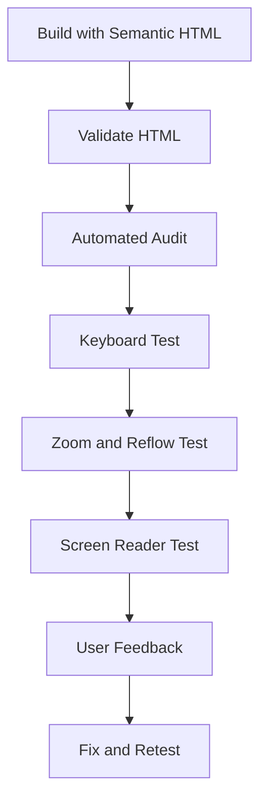

# ♿ Chapter 11: HTML Best Practices and Accessibility


> [!TIP]
> **Chapter Goal:** Clean, meaningful, maintainable aur accessible HTML likhna, jise keyboard, screen reader, mobile aur different abilities wale users effectively use kar saken.

---

## 🎯 11.1 Learning Objectives

After completing this chapter, you will be able to:

1. Explain HTML coding best practices.
2. Define web accessibility and its importance.
3. Understand the four WCAG principles.
4. Create meaningful page structure and headings.
5. Make links, images, forms, tables and media more accessible.
6. Support keyboard and visible-focus navigation.
7. Understand basic color and contrast requirements.
8. Use native HTML before ARIA.
9. Apply basic ARIA attributes carefully.
10. Test a page with automated and manual methods.
11. Build an accessible student-information page.

---

## 🗣️ 11.2 Difficult Words: Pronunciation and Meaning

| 🔤 Word | 🔊 Pronunciation | 💡 Simple Meaning |
|---|---|---|
| Accessibility | एक्सेसिबिलिटी — *ak-ses-uh-bil-uh-tee* | Different users ke liye usability |
| Disability | डिसएबिलिटी — *dis-uh-bil-uh-tee* | Ability ko affect karne wali condition |
| Assistive | असिस्टिव — *uh-sis-tiv* | User ko task perform karne me help karne wala |
| Perceivable | परसीवेबल — *per-see-vuh-bul* | Jise user sense/receive kar sake |
| Operable | ऑपरेबल — *op-er-uh-bul* | Jise user operate kar sake |
| Understandable | अंडरस्टैन्डेबल — *un-der-stand-uh-bul* | Jise samjha ja sake |
| Robust | रोबस्ट — *roh-bust* | Different technologies ke saath reliable |
| Contrast | कॉन्ट्रास्ट — *kon-trast* | Foreground aur background ka difference |
| Focus | फोकस — *fo-kus* | Currently active keyboard element |
| Landmark | लैंडमार्क — *land-mark* | Page ka major identifiable region |
| Alternative | ऑल्टरनेटिव — *awl-tur-nuh-tiv* | Same purpose ka another format |
| Transcript | ट्रांसक्रिप्ट — *tran-skript* | Audio/video ka written text |
| Conformance | कनफॉर्मेन्स — *kun-for-muns* | Standard requirements follow karna |
| Remediation | रिमीडिएशन — *ri-mee-dee-ay-shun* | Accessibility problems fix karna |
| Redundant | रिडन्डन्ट — *ri-dun-dunt* | Unnecessary duplicate |

---

# 🟦 Part A: HTML Best Practices

## ✅ 11.3 Why Best Practices Matter

Good HTML should be:

1. Valid
2. Semantic
3. Readable
4. Maintainable
5. Accessible
6. Securely designed
7. Performance-conscious
8. Responsive-friendly

Benefits:

- Fewer bugs
- Easy team collaboration
- Better accessibility foundation
- Easier CSS and JavaScript
- Consistent browser behavior
- Simpler maintenance

---

## 🧱 11.4 Use a Correct Document Structure

```html
<!DOCTYPE html>
<html lang="en">
<head>
    <meta charset="UTF-8">
    <meta name="viewport" content="width=device-width, initial-scale=1.0">
    <title>Meaningful Page Title</title>
</head>
<body>
    <!-- Visible page content -->
</body>
</html>
```

Checklist:

- Modern doctype
- Correct document language
- UTF-8 encoding
- Viewport metadata
- Unique meaningful title
- Visible content in `body`

---

## 🏷️ 11.5 Use Semantic Elements

Prefer:

```html
<header>...</header>
<nav>...</nav>
<main>...</main>
<article>...</article>
<aside>...</aside>
<footer>...</footer>
```

Instead of making every region:

```html
<div class="header">...</div>
<div class="navigation">...</div>
<div class="main">...</div>
```

> [!NOTE]
> `div` and `span` useful generic elements hain. Suitable semantic element available na ho tab use karein.

---

## 🪆 11.6 Keep Nesting Correct

Correct:

```html
<p>This is <strong>important</strong>.</p>
```

Incorrect:

```html
<p>This is <strong>important.</p></strong>
```

Use indentation to make structure visible:

```html
<section>
    <h2>Course Details</h2>
    <p>BCA Web Technology</p>
</section>
```

---

## ✍️ 11.7 Use Consistent Coding Style

Recommended practices:

1. Lowercase element names
2. Lowercase attribute names
3. Quoted attribute values
4. Consistent indentation
5. Meaningful class and ID names
6. One style across the project
7. Short, helpful comments
8. No trailing unnecessary markup

Good:

```html
<p class="course-description">Learn web development.</p>
```

Unclear:

```html
<P CLASS=x1>Learn web development.</P>
```

---

## 🆔 11.8 Use IDs and Classes Correctly

### ID

- Document me unique
- Fragment, label association, CSS or scripting ke liye

```html
<h2 id="admission">Admission</h2>
```

### Class

- Multiple elements share kar sakte hain
- Reusable grouping/styling hook

```html
<p class="important-note">Bring your ID card.</p>
```

Use purpose-based names:

- `student-card`
- `error-message`
- `main-navigation`

Avoid only appearance-based names where possible:

- `red-text`
- `left-box`

---

## 💬 11.9 Write Useful Comments

Good:

```html
<!-- Primary course navigation -->
<nav>...</nav>
```

Avoid:

```html
<!-- This is a nav -->
<nav>...</nav>
```

Never put secrets in comments:

```html
<!-- API key: secret-value -->
```

> [!WARNING]
> HTML comments page source me users dekh sakte hain.

---

## 🧹 11.10 Avoid Obsolete Presentational Markup

Avoid:

```html
<center>Welcome</center>
<font color="blue">Course</font>
```

Use semantic HTML and CSS:

```html
<h1 class="page-title">Welcome</h1>
<p class="course-name">Course</p>
```

Structure → HTML  
Presentation → CSS  
Behavior → JavaScript

---

## 📁 11.11 Organize Files Clearly

```text
accessible-site/
├── index.html
├── about.html
├── css/
│   └── styles.css
├── js/
│   └── app.js
├── images/
│   └── college.jpg
└── media/
    └── introduction.mp4
```

File-name practices:

- Lowercase names
- Hyphens between words
- Avoid spaces where possible
- Meaningful names
- Consistent extensions

Example:

```text
student-registration.html
course-details.html
```

---

## 🔎 11.12 Validate and Test

Useful checks:

1. HTML validation
2. Broken-link testing
3. Keyboard testing
4. Multiple browser testing
5. Mobile viewport testing
6. Accessibility testing
7. Performance testing
8. Real user testing where possible

> [!IMPORTANT]
> Automated tool only some problems detect karta hai. Manual review and user testing bhi required hain.

---

# 🟩 Part B: Web Accessibility

## ♿ 11.13 What Is Web Accessibility?

### English Explanation

Web accessibility means designing and developing websites and applications so that people with disabilities can perceive, understand, navigate, interact with and contribute to the Web.

### Hinglish Explanation

Accessible website aisi hoti hai jise different abilities wale users use kar saken—keyboard, screen reader, zoom, voice input, captions ya other assistive tools ke through.

Accessibility can support people with:

- Visual disabilities
- Hearing disabilities
- Mobility disabilities
- Speech disabilities
- Cognitive and learning disabilities
- Neurological disabilities
- Temporary limitations
- Situational limitations

### Situational Examples

- Bright sunlight me low contrast text difficult
- Noisy place me video audio hear nahi hota
- Broken mouse ke time keyboard navigation needed
- Slow network par text alternative useful
- Injured hand ke time limited input ability

---

## 🌍 11.14 Why Accessibility Matters

1. Equal access
2. Better user experience
3. Wider audience
4. Mobile and situational usability
5. Cleaner semantic structure
6. Better compatibility
7. Social responsibility
8. Legal or policy compliance where applicable
9. Improved maintainability
10. Better search and content understanding

> [!NOTE]
> Applicable legal requirements country, organization and service ke according differ karte hain. Technical guidance legal advice ka replacement nahi hai.

---

## 🧭 11.15 WCAG and POUR Principles

WCAG means **Web Content Accessibility Guidelines**.

WCAG 2.2 is organized around four principles:

### 11.15.1 Perceivable

Information users ko aise form me available ho jise they can perceive.

Examples:

- Image alt text
- Video captions
- Sufficient contrast
- Resizable text

### 11.15.2 Operable

Interface keyboard aur other supported input methods se operate ho sake.

Examples:

- Keyboard access
- Visible focus
- Enough time
- No harmful flashing
- Clear navigation

### 11.15.3 Understandable

Information aur interface behavior clear and predictable ho.

Examples:

- Simple language
- Consistent navigation
- Clear labels
- Helpful error messages

### 11.15.4 Robust

Content different browsers and assistive technologies ke saath reliably work kare.

Examples:

- Valid semantic HTML
- Correct accessible names
- Standards-based components
- Careful ARIA

### Memory Word

```text
P — Perceivable
O — Operable
U — Understandable
R — Robust
```

---

## 🏅 11.16 WCAG Conformance Levels

WCAG success criteria are organized into:

| Level | General Meaning |
|---|---|
| A | Foundational requirements |
| AA | Additional widely targeted requirements |
| AAA | Highest set; not always achievable for all content |

> [!CAUTION]
> A single automated score does not prove WCAG conformance. Conformance requires evaluating applicable success criteria across the content and processes.

---

# 🟨 Part C: Accessible Page Structure

## 🌐 11.17 Document Language

```html
<html lang="en">
```

Hindi page:

```html
<html lang="hi">
```

Language change within page:

```html
<p>
    HTML ka full form
    <span lang="en">HyperText Markup Language</span> hai.
</p>
```

Correct language screen-reader pronunciation and language processing improve karti hai.

---

## 🏷️ 11.18 Meaningful Page Title

```html
<title>Admission Form | ABC College</title>
```

Avoid:

```html
<title>Page</title>
```

Each page ka unique purpose title me reflect hona chahiye.

---

## 📰 11.19 Heading Structure

```html
<h1>BCA Web Technology</h1>

<h2>HTML</h2>
<h3>HTML Elements</h3>

<h2>CSS</h2>
<h3>CSS Selectors</h3>
```

Headings:

- Content hierarchy describe karein
- Visual size ke liye select na hon
- Empty na hon
- Clear and concise hon

> [!TIP]
> Screen-reader users headings ke through page navigate kar sakte hain.

---

## 🗺️ 11.20 Landmark Regions

```html
<header>...</header>

<nav aria-label="Main navigation">...</nav>

<main id="main-content">
    ...
</main>

<aside>...</aside>

<footer>...</footer>
```

Multiple same-type landmarks ko labels dein:

```html
<nav aria-label="Main navigation">...</nav>
<nav aria-label="Chapter navigation">...</nav>
```

---

## ⏭️ 11.21 Skip Link

Keyboard users ko repeated navigation skip karne ke liye:

```html
<a class="skip-link" href="#main-content">
    Skip to main content
</a>

<header>...</header>
<nav>...</nav>

<main id="main-content">
    ...
</main>
```

CSS skip link ko focus par visible bana sakti hai.

---

# 🟪 Part D: Keyboard and Focus

## ⌨️ 11.22 Keyboard Accessibility

Interactive functionality keyboard se usable honi chahiye.

Test keys:

- `Tab`
- `Shift + Tab`
- `Enter`
- `Space`
- Arrow keys for widgets where expected
- `Escape` for dismissible components where expected

### Keyboard Test

1. Mouse side me rakh dein.
2. Tab se page navigate karein.
3. Focus visible hai ya nahi check karein.
4. Every link/button activate karein.
5. Form complete karein.
6. Confirm focus trap nahi hota.

---

## 🎯 11.23 Visible Focus

Avoid:

```css
*:focus {
    outline: none;
}
```

Better:

```css
:focus-visible {
    outline: 3px solid #005fcc;
    outline-offset: 3px;
}
```

> [!WARNING]
> Default focus indicator remove karna without accessible replacement keyboard users ke liye serious problem create karta hai.

---

## 🔘 11.24 Use Correct Interactive Elements

For navigation:

```html
<a href="courses.html">View Courses</a>
```

For an action:

```html
<button type="button">Open Menu</button>
```

Avoid fake button:

```html
<div onclick="submitForm()">Submit</div>
```

Native `button` automatically important keyboard and semantic behavior provide karta hai.

---

## 🔢 11.25 Tab Order

Natural DOM order logical rakhein.

Avoid unnecessary positive `tabindex`:

```html
<button tabindex="5">Submit</button>
```

Common values:

| Value | Meaning |
|---|---|
| `tabindex="0"` | Natural tab order me include |
| `tabindex="-1"` | Programmatically focusable, normal tab order se outside |
| Positive value | Custom order; generally avoid |

---

## 🪤 11.26 Keyboard Trap

Keyboard focus a component me enter karke escape na kar sake to trap problem ho sakti hai.

Exceptions carefully designed modal interactions ho sakte hain, but:

- Escape/dismiss mechanism provide karein.
- Focus correctly manage karein.
- Dialog close hone par logical location restore karein.

---

# 🟥 Part E: Accessible Content

## 🔗 11.27 Accessible Links

Good:

```html
<a href="admission-guide.pdf">
    Download the BCA admission guide (PDF)
</a>
```

Avoid:

```html
<a href="admission-guide.pdf">Click here</a>
```

Checklist:

1. Link purpose text se clear ho.
2. Same text different destinations ke liye avoid karein where confusing.
3. New tab behavior communicate karein where important.
4. Links visually identifiable hon.
5. Empty links na banayein.
6. Image links ko meaningful alt text dein.

---

## 🖼️ 11.28 Accessible Images

### Informative

```html

```

### Decorative

```html

```

### Functional

```html
<a href="index.html">
    
</a>
```

### Complex Image

Complex chart/diagram ke liye:

- Concise alt text
- Nearby detailed explanation
- Underlying data table where useful
- Figure and caption

> [!IMPORTANT]
> Alt text image ke page-context purpose par depend karta hai.

---

## 🎨 11.29 Color and Contrast

Do not rely on color alone.

Problem:

```html
<p>Required fields are shown in red.</p>
```

Better:

```html
<p>Required fields are marked with “Required”.</p>
```

WCAG 2.2 common contrast targets include:

- Normal text: at least **4.5:1**
- Large text: at least **3:1**
- Many meaningful interface graphics and component boundaries: at least **3:1**

Exceptions and exact definitions apply in the standard.

> [!TIP]
> Contrast checker use karein; visual guess par depend na karein.

---

## 🔍 11.30 Zoom and Reflow

Good page:

- Text zoom par readable rahe
- Content overlap na kare
- Controls hidden na hon
- Horizontal scrolling unnecessarily required na ho
- Fixed pixel heights text cut na karein
- Responsive layout support ho

Do not disable user zoom:

```html
<meta
    name="viewport"
    content="width=device-width, initial-scale=1.0">
```

Avoid restrictive values that block scaling.

---

## 🎬 11.31 Multimedia Accessibility

### Audio

- Transcript
- User controls
- No unexpected autoplay
- Text alternative for important sounds

### Video

- Synchronized captions
- Transcript
- Audio description or equivalent when required
- Keyboard-accessible controls
- Avoid unsafe flashing

```html
<video controls>
    <source src="lesson.mp4" type="video/mp4">
    <track
        kind="captions"
        src="lesson-en.vtt"
        srclang="en"
        label="English"
        default>
</video>
```

---

## ✍️ 11.32 Clear Language

1. Short sentences
2. Familiar words
3. Expanded abbreviations
4. Clear instructions
5. Consistent terminology
6. Descriptive headings
7. Helpful examples
8. Avoid unnecessary jargon

```html
<p>
    <abbr title="Bachelor of Computer Applications">BCA</abbr>
    students can apply online.
</p>
```

---

# 🟧 Part F: Forms and Tables

## 📝 11.33 Accessible Forms

### Label Every Control

```html
<label for="email">Email Address</label>
<input
    type="email"
    id="email"
    name="email"
    autocomplete="email"
    required>
```

### Group Related Controls

```html
<fieldset>
    <legend>Preferred Contact Method</legend>

    <label>
        <input type="radio" name="contact" value="email">
        Email
    </label>

    <label>
        <input type="radio" name="contact" value="phone">
        Phone
    </label>
</fieldset>
```

### Instructions and Errors

```html
<label for="password">Password</label>
<p id="password-help">
    Use at least 8 characters.
</p>
<input
    type="password"
    id="password"
    name="password"
    minlength="8"
    aria-describedby="password-help"
    autocomplete="new-password"
    required>
```

Error should:

- Identify the field
- Explain the problem
- Suggest correction
- Be programmatically associated
- Not rely only on color
- Preserve entered valid data

> [!WARNING]
> Placeholder visible label ka replacement nahi hai.

---

## 📊 11.34 Accessible Tables

```html
<table>
    <caption>BCA Student Marks</caption>
    <thead>
        <tr>
            <th scope="col">Student</th>
            <th scope="col">HTML</th>
            <th scope="col">CSS</th>
        </tr>
    </thead>
    <tbody>
        <tr>
            <th scope="row">Aman</th>
            <td>82</td>
            <td>76</td>
        </tr>
    </tbody>
</table>
```

Checklist:

1. Tables only data ke liye.
2. Caption where useful.
3. Header cells `th`.
4. Simple relationships with `scope`.
5. Complex tables carefully associate headers.
6. Avoid unnecessary merged cells.
7. Mobile overflow handle karein.
8. Summary information visible content me provide karein.

---

# 🟫 Part G: ARIA Basics

## 🧠 11.35 What Is ARIA?

ARIA stands for **Accessible Rich Internet Applications**.

ARIA attributes can add or clarify accessibility semantics where native HTML alone does not provide the required meaning for a custom interface.

ARIA categories include:

- Roles
- States
- Properties

Examples:

```html
<nav aria-label="Chapter navigation">...</nav>

<button
    type="button"
    aria-expanded="false"
    aria-controls="chapter-menu">
    Chapters
</button>
```

---

## 🥇 11.36 Native HTML First Rule

Prefer:

```html
<button type="button">Save</button>
```

Instead of:

```html
<div role="button" tabindex="0">Save</div>
```

Native `button` already provides:

- Button semantics
- Keyboard activation
- Focus behavior
- Disabled state support
- Form integration

> [!IMPORTANT]
> Incorrect ARIA no ARIA se worse ho sakti hai. Native HTML use karein whenever suitable.

---

## 🏷️ 11.37 Accessible Name

Interactive element ko clear accessible name chahiye.

### Visible Text

```html
<button type="button">Close Menu</button>
```

### ARIA Label for Icon-Only Button

```html
<button type="button" aria-label="Close menu">
    <span aria-hidden="true">×</span>
</button>
```

### Referencing Visible Heading

```html
<section aria-labelledby="course-heading">
    <h2 id="course-heading">BCA Course</h2>
    <p>Course information...</p>
</section>
```

> [!TIP]
> Visible text label generally best hoti hai because all users purpose dekh sakte hain.

---

## 🙈 11.38 `aria-hidden`

```html
<span aria-hidden="true">★</span>
<span>Featured course</span>
```

Decorative symbol assistive accessibility tree se hide ho sakta hai.

> [!CAUTION]
> Focusable ya important content par `aria-hidden="true"` use na karein.

---

## 🔄 11.39 Dynamic States

Example menu button:

```html
<button
    type="button"
    aria-expanded="false"
    aria-controls="course-menu">
    Courses
</button>

<ul id="course-menu" hidden>
    <li><a href="bca.html">BCA</a></li>
    <li><a href="bba.html">BBA</a></li>
</ul>
```

When menu opens:

- `hidden` state update ho
- `aria-expanded` becomes `true`
- Keyboard interaction work kare
- Focus behavior logical ho

ARIA state change alone functionality create nahi karta; JavaScript required hoti hai.

---

# 🟪 Part H: Testing Accessibility

## 🧪 11.40 Manual Testing Checklist

### Keyboard

- Tab order logical?
- Focus visible?
- All controls reachable?
- All actions usable?
- No trap?

### Structure

- Unique meaningful title?
- Correct language?
- One clear main content region?
- Logical headings?
- Landmarks useful?

### Content

- Links descriptive?
- Images have correct alt?
- Color not sole indicator?
- Zoom/reflow works?
- Instructions clear?

### Forms

- Labels present?
- Required status clear?
- Errors helpful and associated?
- Autocomplete suitable?
- Groups have legends?

### Multimedia

- Captions?
- Transcript?
- Controls?
- No unexpected autoplay?

---

## 🛠️ 11.41 Automated Testing

Automated tools can detect some issues:

- Missing alt attributes
- Missing form labels
- Invalid ARIA
- Some contrast failures
- Duplicate IDs
- Structural warnings

Possible tools:

- Browser accessibility inspector
- Lighthouse accessibility audit
- axe-based tools
- HTML validator
- Contrast checker

> [!WARNING]
> Automated pass ka meaning fully accessible nahi hai. Keyboard, screen reader, zoom and real-user testing needed hai.

---

## 🗣️ 11.42 Screen Reader Testing Basics

Screen readers examples include:

- NVDA
- JAWS
- VoiceOver
- TalkBack

Basic testing:

1. Page title sunen.
2. Headings list inspect karein.
3. Landmark navigation try karein.
4. Links names check karein.
5. Form labels and errors check karein.
6. Image alternatives sunen.
7. Dynamic changes confirm karein.

Screen reader testing skill practice demand karti hai. Actual users ke feedback ko value dein.

---

## 🐞 11.43 Accessibility Testing Flow



Accessibility one-time final check nahi; complete development lifecycle ka part hai.

---

# 🟥 Part I: Complete Accessible Page

## 💻 11.44 Accessible Student Information Page

```html
<!DOCTYPE html>
<html lang="en">
<head>
    <meta charset="UTF-8">
    <meta name="viewport" content="width=device-width, initial-scale=1.0">
    <title>BCA Student Help | ABC College</title>
</head>
<body>
    <a href="#main-content">Skip to main content</a>

    <header>
        <h1>ABC College Student Help</h1>
        <p>Information and support for BCA students</p>
    </header>

    <nav aria-label="Main navigation">
        <ul>
            <li><a href="index.html">Home</a></li>
            <li><a href="courses.html">Courses</a></li>
            <li><a href="support.html" aria-current="page">Support</a></li>
        </ul>
    </nav>

    <main id="main-content">
        <section aria-labelledby="help-heading">
            <h2 id="help-heading">Request Student Support</h2>

            <p id="required-note">
                Fields marked “Required” must be completed.
            </p>

            <form action="/support" method="post">
                <p>
                    <label for="student-name">
                        Full Name (Required)
                    </label><br>
                    <input
                        type="text"
                        id="student-name"
                        name="student_name"
                        autocomplete="name"
                        required>
                </p>

                <p>
                    <label for="student-email">
                        Email Address (Required)
                    </label><br>
                    <input
                        type="email"
                        id="student-email"
                        name="student_email"
                        autocomplete="email"
                        required>
                </p>

                <fieldset>
                    <legend>Support Category</legend>

                    <label>
                        <input
                            type="radio"
                            name="category"
                            value="admission"
                            required>
                        Admission
                    </label>

                    <label>
                        <input
                            type="radio"
                            name="category"
                            value="examination">
                        Examination
                    </label>

                    <label>
                        <input
                            type="radio"
                            name="category"
                            value="technical">
                        Technical
                    </label>
                </fieldset>

                <p>
                    <label for="message">
                        Describe Your Problem (Required)
                    </label><br>
                    <textarea
                        id="message"
                        name="message"
                        rows="6"
                        maxlength="1000"
                        aria-describedby="message-help"
                        required></textarea>
                </p>

                <p id="message-help">
                    Do not include passwords or financial information.
                </p>

                <button type="submit">Send Support Request</button>
            </form>
        </section>

        <section aria-labelledby="resources-heading">
            <h2 id="resources-heading">Helpful Resources</h2>

            <ul>
                <li>
                    <a href="admission-guide.pdf">
                        Download the admission guide (PDF)
                    </a>
                </li>
                <li>
                    <a href="exam-schedule.html">
                        View the examination schedule
                    </a>
                </li>
            </ul>
        </section>

        <section aria-labelledby="marks-heading">
            <h2 id="marks-heading">Example Marks</h2>

            <div class="table-wrapper">
                <table>
                    <caption>BCA Web Technology Marks</caption>
                    <thead>
                        <tr>
                            <th scope="col">Student</th>
                            <th scope="col">Theory</th>
                            <th scope="col">Practical</th>
                        </tr>
                    </thead>
                    <tbody>
                        <tr>
                            <th scope="row">Aman</th>
                            <td>78</td>
                            <td>85</td>
                        </tr>
                    </tbody>
                </table>
            </div>
        </section>
    </main>

    <footer>
        <address>
            Email:
            <a href="mailto:support@example.com">
                support@example.com
            </a>
        </address>
        <p><small>&copy; 2026 ABC College</small></p>
    </footer>
</body>
</html>
```

---

## 🚫 11.45 Common Mistakes

1. `lang` attribute omit karna.
2. Every page ka title “Home” rakhna.
3. Headings only font size ke liye use karna.
4. Focus outline remove karna.
5. Clickable `div` ko button banana.
6. Positive tabindex se artificial order banana.
7. Link text “click here” rakhna.
8. Images ka alt omit karna.
9. Decorative image ko noisy alt dena.
10. Placeholder ko label samajhna.
11. Error only red color se show karna.
12. Table headers ko plain `td` banana.
13. Video without captions publish karna.
14. Zoom disable karna.
15. Native HTML ke badle unnecessary ARIA use karna.
16. Automated score ko complete proof samajhna.
17. Accessibility ko project end tak postpone karna.

---

## 📌 11.46 Key Points to Remember

- Clean HTML maintainability improve karti hai.
- Semantic HTML accessibility foundation hai.
- Accessibility different disabilities and situations support karti hai.
- WCAG principles are Perceivable, Operable, Understandable and Robust.
- Keyboard se all important actions usable hone chahiye.
- Focus indicator visible rehna chahiye.
- Links ka purpose clear hona chahiye.
- Images ko context-appropriate alt text chahiye.
- Form controls ko visible labels chahiye.
- Tables need correct headers and relationships.
- Captions and transcripts multimedia access improve karte hain.
- Native HTML ARIA se pehle prefer karein.
- Automated and manual testing dono required hain.

---

## 📝 11.47 Chapter Summary

HTML best practices include valid document structure, semantic elements, correct nesting, consistent naming, clear organization and regular validation. Web accessibility ensures that people with different abilities can use web content and applications. WCAG organizes accessibility around four principles: Perceivable, Operable, Understandable and Robust. Accessible pages need correct language, titles, headings, landmarks, keyboard support, visible focus, descriptive links, suitable image alternatives, labeled forms, structured tables and accessible multimedia. Native HTML should be preferred before ARIA. Effective testing combines validation, automated checks, keyboard navigation, zoom, screen-reader review and user feedback.

---

## 🎲 11.48 Multiple-Choice Questions

### 1. Which is a WCAG principle?

A. Printable  
B. Perceivable  
C. Profitable  
D. Programmable  

**✅ Answer:** B

### 2. Which element should be used for an action?

A. `div`  
B. `button`  
C. `span`  
D. `p`  

**✅ Answer:** B

### 3. Which attribute declares page language?

A. `title`  
B. `lang`  
C. `src`  
D. `role`  

**✅ Answer:** B

### 4. Decorative images commonly use:

A. Missing alt  
B. `alt=""`  
C. Long filename  
D. `title="image"` only  

**✅ Answer:** B

### 5. Which is a common minimum contrast target for normal text?

A. 1:1  
B. 2:1  
C. 4.5:1  
D. 10:1 always  

**✅ Answer:** C

### 6. Which attribute associates help text?

A. `aria-describedby`  
B. `aria-hidden`  
C. `srcset`  
D. `colspan`  

**✅ Answer:** A

### 7. What should be preferred before ARIA?

A. Custom divs  
B. Native HTML  
C. Image buttons  
D. Positive tabindex  

**✅ Answer:** B

### 8. Which test cannot be fully replaced by automation?

A. Real keyboard and user testing  
B. File-name check only  
C. Extension check only  
D. Code coloring  

**✅ Answer:** A

### 9. Which element identifies a table header?

A. `td`  
B. `th`  
C. `tr`  
D. `div`  

**✅ Answer:** B

### 10. Which makes video dialogue accessible?

A. Autoplay  
B. Captions  
C. Large file size  
D. Background music  

**✅ Answer:** B

---

## ✍️ 11.49 Fill in the Blanks

1. WCAG has __________ main principles.
2. Keyboard focus should remain __________.
3. Every form control needs a clear __________.
4. Native __________ should be preferred before ARIA.
5. Automated tests detect only __________ accessibility issues.

<details>
<summary><strong>✅ View Answers</strong></summary>

1. four  
2. visible  
3. label  
4. HTML  
5. some

</details>

---

## ✅ 11.50 True or False

1. Accessibility only benefits blind users.
2. Focus outlines should always be removed.
3. Semantic HTML provides useful structure.
4. Placeholder fully replaces a label.
5. Color should not be the only indicator.
6. Native buttons support keyboard behavior.
7. Automated score proves complete conformance.
8. Video should provide accurate captions.
9. ARIA automatically adds all interaction behavior.
10. Accessibility should be tested throughout development.

<details>
<summary><strong>✅ View Answers</strong></summary>

1. False  
2. False  
3. True  
4. False  
5. True  
6. True  
7. False  
8. True  
9. False  
10. True

</details>

---

## ❓ 11.51 Short-Answer Questions

1. Define web accessibility.
2. Why is accessibility important?
3. Expand POUR.
4. What is WCAG?
5. What are conformance levels?
6. Why is the `lang` attribute required?
7. What is a skip link?
8. What is visible focus?
9. Why should positive tabindex be avoided?
10. Explain accessible link text.
11. How are decorative images handled?
12. What is accessible form validation?
13. Why are table headers important?
14. Define ARIA.
15. Explain the native HTML first rule.

---

## 📚 11.52 Long-Answer and Exam Questions

1. Explain HTML coding best practices.
2. Define web accessibility and discuss its benefits.
3. Explain the four WCAG principles with examples.
4. Explain accessible document structure and landmarks.
5. Discuss keyboard accessibility and focus management.
6. Explain accessible links, images and multimedia.
7. Explain accessible forms with examples.
8. Explain accessible tables.
9. Define ARIA and discuss its careful use.
10. Explain automated, manual and user accessibility testing.
11. Create and explain an accessible student-support page.
12. Prepare a complete accessibility checklist.

---

## 🧪 11.53 Practical Exercises

1. Add correct language and title to a page.
2. Create logical heading hierarchy.
3. Add header, nav, main and footer landmarks.
4. Create a skip link.
5. Navigate a page using only keyboard.
6. Add a visible focus style.
7. Replace a clickable div with a button.
8. Improve five unclear link texts.
9. Write alt text for informative, functional and decorative images.
10. Create a labeled form with fieldset and legend.
11. Add helpful error instructions.
12. Create an accessible data table.
13. Add captions to a video.
14. Run validation and an automated audit.
15. Test zoom, reflow and screen-reader output.
16. Build the complete accessible page.

---

## 🎤 11.54 Viva Questions

1. What is accessibility?
2. What does WCAG stand for?
3. Name the four principles.
4. What is a landmark?
5. What is a skip link?
6. Why must focus be visible?
7. Which element should perform a button action?
8. What is meaningful link text?
9. What alt value suits a decorative image?
10. Is placeholder a label?
11. What makes a table accessible?
12. Why are captions required?
13. What is ARIA?
14. Does ARIA create keyboard behavior?
15. Can automation find every issue?

<details>
<summary><strong>✅ View Short Viva Answers</strong></summary>

1. Designing content usable by people with different abilities.  
2. Web Content Accessibility Guidelines.  
3. Perceivable, Operable, Understandable and Robust.  
4. An identifiable major page region.  
5. A link that skips repeated content.  
6. So keyboard users know their current position.  
7. `button`.  
8. Text that explains the link destination or purpose.  
9. `alt=""`.  
10. No.  
11. Captions, headers and correct relationships.  
12. To provide synchronized text for audio information.  
13. Accessible Rich Internet Applications.  
14. No.  
15. No.

</details>

---

## 🏁 11.55 One-Minute Revision

| Question | Quick Answer |
|---|---|
| Accessibility? | Web usable for different abilities |
| WCAG principles? | POUR |
| Main language? | `lang` |
| Repeated-content shortcut? | Skip link |
| Keyboard position? | Visible focus |
| Navigation? | `a` |
| Action? | `button` |
| Informative image? | Meaningful alt |
| Decorative image? | `alt=""` |
| Form control? | Visible label |
| Table header? | `th` |
| Video access? | Captions |
| First choice? | Native HTML |
| ARIA purpose? | Accessibility semantics |
| Complete testing? | Automated + manual + users |

---

## 📚 11.56 Official References

1. [W3C Web Content Accessibility Guidelines (WCAG) 2.2](https://www.w3.org/TR/WCAG22/)
2. [WAI Accessibility Tutorials](https://www.w3.org/WAI/tutorials/)
3. [ARIA Authoring Practices Guide](https://www.w3.org/WAI/ARIA/apg/)
4. [Nu HTML Checker](https://validator.w3.org/nu/)

---

[⬅️ Previous Chapter](10-semantic-html-and-multimedia.md) · [📚 Table of Contents](../SUMMARY.md) · **Next: CSS Fundamentals ➡️**
