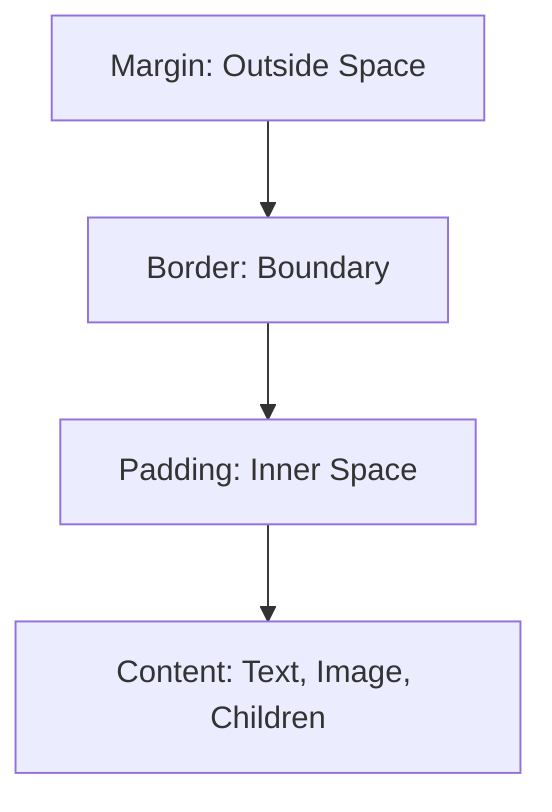

# 📦 Chapter 14: Box Model, Display and Positioning


> [!TIP]
> **Chapter Goal:** Har HTML element ke rectangular box ko samajhna aur `display`, `position`, offsets, overflow aur stacking ke through layout control karna.

---

## 🎯 14.1 Learning Objectives

After completing this chapter, you will be able to:

1. Explain the CSS box model.
2. Calculate an element's total occupied width and height.
3. Differentiate between `content-box` and `border-box`.
4. Use margin, border and padding correctly.
5. Understand margin collapsing.
6. Control overflowing content.
7. Use block, inline, inline-block and other display values.
8. Differentiate between hidden and removed elements.
9. Apply static, relative, absolute, fixed and sticky positioning.
10. Use inset properties and z-index.
11. Understand containing blocks and stacking contexts.
12. Build a positioned card-based dashboard.

---

## 🗣️ 14.2 Difficult Words: Pronunciation and Meaning

| 🔤 Word | 🔊 Pronunciation | 💡 Simple Meaning |
|---|---|---|
| Box Model | बॉक्स मॉडल — *boks mod-ul* | Element ke rectangular layers |
| Content | कॉन्टेन्ट — *kon-tent* | Element ka main text/media |
| Padding | पैडिंग — *pad-ing* | Content aur border ke beech space |
| Border | बॉर्डर — *bor-der* | Box ki boundary |
| Margin | मार्जिन — *maar-jin* | Box ke outside space |
| Dimension | डाइमेंशन — *dai-men-shun* | Width ya height |
| Overflow | ओवरफ्लो — *oh-ver-flow* | Box se bahar nikalta content |
| Collapse | कोलैप्स — *kuh-laps* | Margins ka combine hona |
| Positioning | पोजिशनिंग — *puh-zish-un-ing* | Element ki location control karna |
| Offset | ऑफसेट — *off-set* | Normal/reference position se distance |
| Containing Block | कन्टेनिंग ब्लॉक — *kun-tay-ning blok* | Positioned/sized element ka reference box |
| Stacking | स्टैकिंग — *stak-ing* | Elements ka front-back order |
| Clipping | क्लिपिंग — *klip-ing* | Box se bahar content ko cut karna |
| Viewport | व्यूपोर्ट — *vyoo-port* | Browser ka visible area |
| Sticky | स्टिकी — *stik-ee* | Scroll threshold ke baad attached behavior |

---

# 🟦 Part A: CSS Box Model

## 💡 14.3 What Is the Box Model?

Browser most elements ko rectangular boxes ke form me layout karta hai. Each box may contain four layers:

1. Content
2. Padding
3. Border
4. Margin



### Hinglish Explanation

Element ke center me content hota hai. Content ke around padding, padding ke around border aur border ke outside margin hota hai.

---

## 🧱 14.4 Box-Model Layers

### 14.4.1 Content Box

Element ka main content area.

```css
.card {
    width: 300px;
    height: 150px;
}
```

### 14.4.2 Padding Box

Content aur border ke beech space.

```css
.card {
    padding: 20px;
}
```

Background generally padding area ke through paint hota hai unless background rules change kiye gaye hon.

### 14.4.3 Border Box

Padding ke outside boundary.

```css
.card {
    border: 2px solid #123a70;
}
```

### 14.4.4 Margin Box

Border ke outside transparent spacing.

```css
.card {
    margin: 24px;
}
```

Margin background color accept nahi karta.

---

## 🧮 14.5 Total Size with `content-box`

Default `box-sizing` commonly `content-box` hai.

```css
.card {
    box-sizing: content-box;
    width: 300px;
    padding: 20px;
    border: 5px solid;
    margin: 10px;
}
```

### Border-Box Width

```text
300 content
+ 40 left/right padding
+ 10 left/right border
= 350px border-box width
```

### Space Including Margins

```text
350 border-box
+ 20 left/right margins
= 370px outer horizontal space
```

Formula:

```text
Total outer width =
margin-left
+ border-left
+ padding-left
+ width
+ padding-right
+ border-right
+ margin-right
```

---

## ✅ 14.6 `box-sizing: border-box`

```css
.card {
    box-sizing: border-box;
    width: 300px;
    padding: 20px;
    border: 5px solid;
}
```

Now declared `width: 300px` includes content, padding and border.

Common project rule:

```css
*,
*::before,
*::after {
    box-sizing: border-box;
}
```

> [!IMPORTANT]
> `border-box` responsive sizing easier banata hai, but margin still declared width ke outside hota hai.

---

## 📏 14.7 Width and Height Properties

| Property | Purpose |
|---|---|
| `width` | Preferred/used inline dimension in horizontal writing |
| `height` | Preferred/used block dimension |
| `min-width` | Minimum width |
| `max-width` | Maximum width |
| `min-height` | Minimum height |
| `max-height` | Maximum height |

Responsive example:

```css
.content {
    width: 90%;
    max-width: 70rem;
    margin-inline: auto;
}
```

Image:

```css
img {
    max-width: 100%;
    height: auto;
}
```

> [!WARNING]
> Text containers ko unnecessary fixed height dene se zoom ya long content par clipping/overflow ho sakta hai.

---

## ↔️ 14.8 Logical Sizing Properties

Logical properties writing mode ke according adapt karti hain:

| Physical | Logical |
|---|---|
| `width` | `inline-size` |
| `height` | `block-size` |
| `min-width` | `min-inline-size` |
| `max-width` | `max-inline-size` |

```css
.article {
    inline-size: 90%;
    max-inline-size: 70ch;
}
```

---

# 🟩 Part B: Margin, Border and Padding

## 📐 14.9 Margin

### All Sides

```css
.card {
    margin: 20px;
}
```

### Individual Sides

```css
.card {
    margin-top: 10px;
    margin-right: 20px;
    margin-bottom: 30px;
    margin-left: 40px;
}
```

### Shorthand

```css
/* All sides */
margin: 20px;

/* Vertical | Horizontal */
margin: 20px 40px;

/* Top | Horizontal | Bottom */
margin: 10px 20px 30px;

/* Top | Right | Bottom | Left */
margin: 10px 20px 30px 40px;
```

Clockwise memory:

```text
Top → Right → Bottom → Left
```

---

## 🎯 14.10 Centering with Auto Margins

```css
.container {
    width: 90%;
    max-width: 900px;
    margin-inline: auto;
}
```

A block with constrained width can use remaining inline space as automatic margins.

> [!NOTE]
> `margin: auto` har element ko vertically center nahi karta. Layout context and axis matter karte hain.

---

## 🧬 14.11 Margin Collapsing

Some vertical margins of block boxes in normal flow can collapse rather than add.

Example:

```css
.first {
    margin-bottom: 30px;
}

.second {
    margin-top: 20px;
}
```

Gap commonly 50px nahi; adjoining margins may collapse according to rules, often resulting in 30px.

Margin collapsing can occur between:

- Adjacent block siblings
- Parent and first/last child in some conditions
- Empty blocks in some conditions

It generally does not occur in the same way:

- Flex layout items
- Grid layout items
- Absolutely positioned elements
- Floating elements
- Certain formatting contexts

> [!TIP]
> Unexpected gap me DevTools box model inspect karein. Padding, border or flow-root can change collapse conditions, but reason samajhkar fix karein.

---

## 📦 14.12 Padding

```css
.card {
    padding: 1.5rem;
}
```

Logical versions:

```css
.card {
    padding-block: 1.5rem;
    padding-inline: 2rem;
}
```

Padding negative nahi ho sakta.

Use padding for inner breathing space and larger touch/click target area where appropriate.

---

## 🖼️ 14.13 Border

```css
.card {
    border-width: 2px;
    border-style: solid;
    border-color: #cbd5e1;
}
```

Shorthand:

```css
.card {
    border: 2px solid #cbd5e1;
}
```

Common styles:

- `solid`
- `dashed`
- `dotted`
- `double`
- `none`

No visible border if style remains `none`.

---

## ⭕ 14.14 Border Radius

```css
.card {
    border-radius: 1rem;
}
```

Individual corners:

```css
.card {
    border-top-left-radius: 1rem;
    border-bottom-right-radius: 1rem;
}
```

Circular image:

```css
.avatar {
    width: 8rem;
    aspect-ratio: 1;
    border-radius: 50%;
    object-fit: cover;
}
```

---

## 📐 14.15 Outline vs Border

```css
button:focus-visible {
    outline: 3px solid #ffbf47;
    outline-offset: 3px;
}
```

| Border | Outline |
|---|---|
| Box model size affect kar sakta hai | Normal box dimensions me space reserve nahi karta |
| Every side separately styled | Focus indication ke liye useful |
| Radius/structure boundary | Element ke outside draw hota hai |

> [!WARNING]
> Focus outline remove na karein without equally visible accessible replacement.

---

## 📏 14.16 Aspect Ratio

```css
.video-card {
    aspect-ratio: 16 / 9;
}
```

Useful for:

- Images
- Videos
- Cards
- Placeholders

One dimension auto/available ho to ratio sizing guide kar sakta hai.

---

# 🟨 Part C: Overflow

## 🌊 14.17 What Is Overflow?

Content box me fit na ho to overflow hota hai.

```css
.box {
    width: 250px;
    height: 100px;
    border: 2px solid;
}
```

Long content box se bahar draw ho sakta hai by default.

---

## 🧰 14.18 Overflow Values

```css
.box {
    overflow: auto;
}
```

| Value | Basic Behavior |
|---|---|
| `visible` | Content may paint outside |
| `hidden` | Overflow clipped; scrolling UI absent |
| `clip` | Overflow clipped without scroll container behavior |
| `scroll` | Scrolling mechanism shown/provided |
| `auto` | Browser adds scrolling when needed |

Axis-specific:

```css
.table-wrapper {
    overflow-x: auto;
    overflow-y: hidden;
}
```

---

## 📝 14.19 Text Overflow

Single-line ellipsis pattern:

```css
.file-name {
    overflow: hidden;
    text-overflow: ellipsis;
    white-space: nowrap;
}
```

> [!CAUTION]
> Truncated text ka full value user access kar sake—context ke according title, expansion or accessible detail provide karein.

---

## 🔤 14.20 Word Breaking

```css
.content {
    overflow-wrap: anywhere;
}
```

Useful for long URLs or unbroken strings.

Other related properties:

- `word-break`
- `hyphens`
- `white-space`

Language and readability test karein.

---

# 🟪 Part D: Display

## 💡 14.21 The `display` Property

`display` element ke box-generation and layout behavior ko control karta hai.

Common values:

- `block`
- `inline`
- `inline-block`
- `none`
- `flow-root`
- `flex`
- `grid`
- `contents`

Flex and Grid next chapters me detail se.

---

## 🧱 14.22 Block Display

```css
section {
    display: block;
}
```

Typical behavior in normal flow:

- New line start
- Available inline width fill kar sakta hai
- Width/height/margin/padding rules block box ke according work karte hain

Common default block-level boxes:

- `div`
- `p`
- `section`
- headings

Default styles user-agent stylesheet par depend karte hain.

---

## ✏️ 14.23 Inline Display

```css
span {
    display: inline;
}
```

Typical behavior:

- Text flow me continue
- New line automatically start nahi
- Inline-axis margin/padding work
- Width/height properties normal inline non-replaced element par expected block behavior nahi dete
- Line layout influence karta hai

Common default inline elements:

- `span`
- `a`
- `strong`
- `em`

---

## 🧩 14.24 Inline-Block

```css
.badge {
    display: inline-block;
    padding: 0.25rem 0.75rem;
}
```

- Inline flow me participate
- Box dimensions and padding/border more like block container
- Badges, small components ke liye useful

---

## 🙈 14.25 `display: none`

```css
.hidden {
    display: none;
}
```

Element box generate nahi karta and usually accessibility tree se bhi absent hota hai.

Use for content currently not part of interface.

> [!WARNING]
> Important accessible text ko casually `display: none` na karein if assistive users ko access chahiye.

---

## 👻 14.26 `visibility: hidden`

```css
.invisible {
    visibility: hidden;
}
```

Element visible nahi hota, but its layout space generally remain karta hai.

Comparison:

| Technique | Visible? | Layout Space? |
|---|---:|---:|
| `display: none` | No | No |
| `visibility: hidden` | No | Yes |
| `opacity: 0` | No visually | Yes |

`opacity: 0` element interactive/focusable remain kar sakta hai, so hidden UI ke liye careless use dangerous hai.

---

## 🌱 14.27 `display: flow-root`

```css
.container {
    display: flow-root;
}
```

New block formatting context create karta hai and floats containment/margin behavior situations me useful ho sakta hai.

---

## 🧬 14.28 `display: contents`

```css
.wrapper {
    display: contents;
}
```

Element's own principal box remove hota hai while children layout me participate karte hain.

> [!CAUTION]
> Semantics/accessibility and browser behavior test karein. Structural elements par blindly use na karein.

---

# 🟥 Part E: Normal Flow and Positioning

## 🌊 14.29 Normal Document Flow

Without special layout/positioning:

- Block boxes one after another flow karte hain.
- Inline content lines me flow karta hai.
- Each element next elements ki placement affect karta hai.

Good practice: normal flow se start karein; position only when needed.

---

## 📍 14.30 `position: static`

Default positioning:

```css
.card {
    position: static;
}
```

Inset properties `top`, `right`, `bottom`, `left` normally static element ko offset nahi karte.

---

## ↔️ 14.31 `position: relative`

```css
.badge {
    position: relative;
    top: 5px;
    left: 10px;
}
```

Behavior:

- Element normal flow me original space retain karta hai.
- Visual box offset ho sakta hai.
- Positioned descendants ke containing block ke liye commonly reference create karta hai.

Most common use:

```css
.card {
    position: relative;
}

.card-badge {
    position: absolute;
    top: 1rem;
    right: 1rem;
}
```

---

## 🎯 14.32 `position: absolute`

```css
.card-badge {
    position: absolute;
    inset-block-start: 1rem;
    inset-inline-end: 1rem;
}
```

Behavior:

- Element normal flow se removed hota hai.
- Space reserve nahi karta.
- Offset containing block ke relative calculate hote hain.
- Nearby positioned ancestor commonly reference hota hai.

> [!WARNING]
> Large page layout ko excessive absolute positioning se na banayein. Content overlap and responsiveness problems ho sakti hain.

---

## 📌 14.33 `position: fixed`

```css
.help-button {
    position: fixed;
    right: 1rem;
    bottom: 1rem;
}
```

Usually viewport ke relative fixed rehta hai and scrolling par same visible position maintain karta hai. Certain ancestors/properties containing behavior affect kar sakte hain.

Use cases:

- Floating help button
- Fixed action bar
- Cookie notice

Accessibility:

- Content cover na kare
- Zoom par usable ho
- Keyboard focus reachable ho
- Small screens test ho

---

## 📎 14.34 `position: sticky`

```css
.chapter-nav {
    position: sticky;
    top: 1rem;
}
```

Sticky element normal flow me participate karta hai, then scrolling threshold par its scroll container/reference constraints ke within attached behavior show karta hai.

Sticky not working checklist:

1. Suitable inset, e.g. `top`, provided?
2. Ancestor overflow behavior?
3. Enough scrolling space?
4. Element/parent dimensions?
5. Correct scroll container?

---

## ⚖️ 14.35 Position Comparison

| Position | In Normal Flow? | Offset Reference | Common Use |
|---|---:|---|---|
| `static` | Yes | Not positioned | Default |
| `relative` | Yes | Own normal position | Small offset/absolute reference |
| `absolute` | No | Containing block | Badge/overlay |
| `fixed` | No | Usually viewport | Floating UI |
| `sticky` | Yes initially | Scroll container constraints | Sticky nav/header |

---

## 🧭 14.36 Inset Properties

Physical:

- `top`
- `right`
- `bottom`
- `left`

Shorthand:

```css
.overlay {
    position: absolute;
    inset: 0;
}
```

Logical:

- `inset-block-start`
- `inset-block-end`
- `inset-inline-start`
- `inset-inline-end`
- `inset-block`
- `inset-inline`

Logical properties writing modes support karte hain.

---

## 🎯 14.37 Centering an Absolute Element

```css
.modal {
    position: absolute;
    top: 50%;
    left: 50%;
    transform: translate(-50%, -50%);
}
```

Modern layout me Flexbox/Grid often simpler centering provide karte hain. This technique specific positioned context me useful hai.

---

# 🟧 Part F: Stacking and z-index

## 📚 14.38 What Is Stacking?

Elements overlap hone par browser determines which box front me paint hoga.

`z-index` stack level influence karta hai in applicable stacking contexts.

```css
.card {
    position: relative;
    z-index: 1;
}

.menu {
    position: absolute;
    z-index: 10;
}
```

---

## 🧱 14.39 Stacking Context

Stacking context elements ka local stacking system hai.

Common triggers can include:

- Root element
- Positioned element with non-auto `z-index`
- Fixed or sticky positioned elements in relevant rules
- Opacity less than 1
- Transform not none
- Certain filter, isolation, containment and other properties

A child with huge z-index parent stacking context ke outside unrelated context ko necessarily cross nahi kar sakta.

> [!TIP]
> “z-index 999999 still not working” problem me ancestor stacking contexts inspect karein.

---

## 🗂️ 14.40 Organizing z-index

Avoid random huge values:

```css
:root {
    --z-base: 0;
    --z-dropdown: 100;
    --z-sticky: 200;
    --z-modal: 300;
    --z-toast: 400;
}
```

Use:

```css
.modal {
    z-index: var(--z-modal);
}
```

Custom properties later detail se cover ho sakti hain.

---

# 🟫 Part G: Float Introduction

## 🖼️ 14.41 Float

`float` originally content such as images ke around text wrap karne ke liye useful hai.

```css
.article-image {
    float: inline-start;
    width: 40%;
    margin-inline-end: 1rem;
    margin-block-end: 0.5rem;
}
```

Modern main layouts ke liye Flexbox and Grid prefer karein.

---

## 🧹 14.42 Clear and Flow Root

```css
.next-section {
    clear: both;
}
```

Float container:

```css
.article {
    display: flow-root;
}
```

`flow-root` float containment ke liye clearfix-like situations me clean solution ho sakta hai.

---

# 🟪 Part H: Complete Practical

## 🧪 14.43 Student Dashboard Cards

### HTML

```html
<!DOCTYPE html>
<html lang="en">
<head>
    <meta charset="UTF-8">
    <meta name="viewport" content="width=device-width, initial-scale=1.0">
    <title>BCA Student Dashboard</title>
    <link rel="stylesheet" href="css/dashboard.css">
</head>
<body>
    <a class="skip-link" href="#main-content">
        Skip to main content
    </a>

    <header class="site-header">
        <h1>BCA Student Dashboard</h1>
    </header>

    <nav class="chapter-nav" aria-label="Dashboard navigation">
        <a href="#courses">Courses</a>
        <a href="#progress">Progress</a>
        <a href="#support">Support</a>
    </nav>

    <main id="main-content" class="dashboard">
        <section id="courses" class="dashboard-card">
            <span class="status-badge">Active</span>
            <h2>Web Technology</h2>
            <p>Continue learning CSS Box Model.</p>
            <a class="card-action" href="course.html">Open Course</a>
        </section>

        <section id="progress" class="dashboard-card">
            <span class="status-badge">72%</span>
            <h2>Course Progress</h2>
            <p>You have completed 13 chapters.</p>
        </section>

        <section id="support" class="dashboard-card">
            <h2>Student Support</h2>
            <p>Need help with your course?</p>
            <button class="card-action" type="button">
                Request Help
            </button>
        </section>
    </main>

    <button class="floating-help" type="button">
        Help
    </button>

    <footer class="site-footer">
        <p>&copy; 2026 BCA Learning Hub</p>
    </footer>
</body>
</html>
```

### CSS

```css
*,
*::before,
*::after {
    box-sizing: border-box;
}

:root {
    --color-primary: #123a70;
    --color-primary-dark: #0b274b;
    --color-accent: #005fcc;
    --color-focus: #ffbf47;
    --color-page: #f4f7fb;
    --color-card: #ffffff;
    --color-border: #cbd5e1;
    --color-text: #1f2937;
    --z-sticky: 100;
    --z-floating: 200;
}

html {
    scroll-behavior: smooth;
}

body {
    margin: 0;
    background-color: var(--color-page);
    color: var(--color-text);
    font-family: system-ui, sans-serif;
    line-height: 1.6;
}

.skip-link {
    position: fixed;
    z-index: var(--z-floating);
    inset-block-start: -5rem;
    inset-inline-start: 1rem;
    padding: 0.75rem 1rem;
    background-color: #ffffff;
    color: #000000;
}

.skip-link:focus {
    inset-block-start: 1rem;
}

.site-header {
    padding: 3rem 1rem;
    background-color: var(--color-primary);
    color: #ffffff;
    text-align: center;
}

.site-header h1 {
    margin: 0;
}

.chapter-nav {
    position: sticky;
    z-index: var(--z-sticky);
    top: 0;
    padding: 1rem;
    background-color: var(--color-primary-dark);
    text-align: center;
}

.chapter-nav a {
    display: inline-block;
    margin-inline: 0.5rem;
    padding: 0.5rem;
    color: #ffffff;
}

.dashboard {
    width: min(90%, 70rem);
    margin: 2rem auto;
}

.dashboard-card {
    position: relative;
    margin-block-end: 1.5rem;
    padding: 1.5rem;
    border: 1px solid var(--color-border);
    border-radius: 1rem;
    background-color: var(--color-card);
    box-shadow: 0 6px 18px rgb(15 23 42 / 10%);
    overflow-wrap: anywhere;
}

.dashboard-card h2 {
    margin-block-start: 0;
    color: var(--color-primary);
}

.status-badge {
    position: absolute;
    inset-block-start: 1rem;
    inset-inline-end: 1rem;
    display: inline-block;
    padding: 0.25rem 0.65rem;
    border-radius: 999px;
    background-color: #e6f4ea;
    color: #1b5e20;
    font-size: 0.875rem;
    font-weight: 700;
}

.card-action {
    display: inline-block;
    padding: 0.7rem 1rem;
    border: 0;
    border-radius: 0.5rem;
    background-color: var(--color-accent);
    color: #ffffff;
    font: inherit;
    font-weight: 700;
    text-decoration: none;
    cursor: pointer;
}

.card-action:hover {
    background-color: #004a9f;
}

a:focus-visible,
button:focus-visible {
    outline: 3px solid var(--color-focus);
    outline-offset: 3px;
}

.floating-help {
    position: fixed;
    z-index: var(--z-floating);
    inset-inline-end: 1rem;
    inset-block-end: 1rem;
    min-width: 3.5rem;
    min-height: 3.5rem;
    border: 0;
    border-radius: 50%;
    background-color: var(--color-accent);
    color: #ffffff;
    font: inherit;
    font-weight: 700;
    cursor: pointer;
}

.site-footer {
    padding: 1.5rem;
    background-color: var(--color-primary-dark);
    color: #ffffff;
    text-align: center;
}
```

---

## ♿ 14.44 Accessibility and Responsive Checklist

1. Fixed/sticky content main content cover na kare.
2. Zoom 200%+ par overlap test karein.
3. Focus indicators visible rakhein.
4. DOM order logical rakhein.
5. Absolute positioning se reading order change na karein.
6. Content containers ko unnecessary fixed height na dein.
7. Overflow me keyboard-accessible scrolling test karein.
8. Hidden content ki accessibility state correct ho.
9. Touch targets usable size me hon.
10. Small viewport par fixed buttons check karein.
11. Text wrapping allow karein.
12. Landscape and portrait modes test karein.

---

## 🚫 14.45 Common Mistakes

1. Width calculation me padding/border forget karna.
2. `border-box` me margin included samajhna.
3. Margin and padding confuse karna.
4. Vertical margin collapse ignore karna.
5. Every element ko fixed height dena.
6. `overflow: hidden` se important content clip karna.
7. Inline element par width expect karna.
8. `display: none` content assistive users ko available samajhna.
9. `opacity: 0` ko safe hidden state samajhna.
10. Absolute element ka positioned ancestor omit karna.
11. Whole page absolute positioning se banana.
12. Sticky element me inset omit karna.
13. z-index without stacking context understanding.
14. Huge random z-index values.
15. Fixed UI se content cover karna.
16. Main layout ke liye floats use karna.

---

## 📌 14.46 Key Points to Remember

- Box model contains content, padding, border and margin.
- `content-box` declared size content box par apply karta hai.
- `border-box` declared size me padding and border include karta hai.
- Margin outside and padding inside space hai.
- Some vertical margins collapse kar sakti hain.
- Overflow content box se bahar content behavior control karta hai.
- `display` box and layout behavior define karta hai.
- Normal flow default layout foundation hai.
- Relative position original flow space preserve karta hai.
- Absolute and fixed boxes normal flow se removed hote hain.
- Sticky needs scroll space and an inset.
- z-index stacking context ke inside operate karta hai.
- Modern layout ke liye Flexbox and Grid prefer karein.

---

## 📝 14.47 Chapter Summary

The CSS box model describes every element using content, padding, border and margin areas. Under `content-box`, declared dimensions apply to content; under `border-box`, padding and border are included. Margin controls outer spacing, while padding controls inner spacing. Overflow properties manage content that exceeds a box. The display property determines box generation and layout behavior, including block, inline, inline-block and hidden states. Positioning can be static, relative, absolute, fixed or sticky. Offsets use physical or logical inset properties. Overlapping elements are controlled through painting order, stacking contexts and z-index. Reliable layouts begin with normal flow, avoid unnecessary fixed dimensions and preserve accessibility at different zoom levels and screen sizes.

---

## 🎲 14.48 Multiple-Choice Questions

### 1. Which box-model layer is outside the border?

A. Content  
B. Padding  
C. Margin  
D. Background  

**✅ Answer:** C

### 2. Which `box-sizing` includes padding and border in declared width?

A. `content-box`  
B. `border-box`  
C. `padding-box`  
D. `margin-box`  

**✅ Answer:** B

### 3. Which property controls inner space?

A. `margin`  
B. `padding`  
C. `outline`  
D. `position`  

**✅ Answer:** B

### 4. Which display value removes the element's box?

A. `block`  
B. `inline`  
C. `none`  
D. `visible`  

**✅ Answer:** C

### 5. Which position keeps original normal-flow space while offset?

A. `absolute`  
B. `fixed`  
C. `relative`  
D. `static` only  

**✅ Answer:** C

### 6. Which position is usually relative to a containing block and removed from flow?

A. `absolute`  
B. `static`  
C. `sticky`  
D. `inline`  

**✅ Answer:** A

### 7. Which position can remain attached during viewport scrolling?

A. `static`  
B. `fixed`  
C. `inline`  
D. `block`  

**✅ Answer:** B

### 8. Sticky positioning normally requires:

A. An inset like `top`  
B. A table  
C. An image  
D. A form  

**✅ Answer:** A

### 9. Which property controls front-back stack level?

A. `display`  
B. `z-index`  
C. `overflow`  
D. `margin`  

**✅ Answer:** B

### 10. Which value adds scrollbars only when needed?

A. `overflow: auto`  
B. `overflow: visible`  
C. `overflow: none`  
D. `overflow: static`  

**✅ Answer:** A

---

## ✍️ 14.49 Fill in the Blanks

1. Space between content and border is __________.
2. Space outside the border is __________.
3. The default common box sizing is __________.
4. An absolutely positioned element is removed from normal __________.
5. Front-back grouping is affected by stacking __________.

<details>
<summary><strong>✅ View Answers</strong></summary>

1. padding  
2. margin  
3. `content-box`  
4. flow  
5. contexts

</details>

---

## ✅ 14.50 True or False

1. Margin is included in `border-box` width.
2. Padding can have a background behind it.
3. Negative padding is valid.
4. Vertical margins may collapse.
5. Inline elements behave exactly like block elements.
6. `visibility: hidden` normally preserves layout space.
7. `opacity: 0` always removes keyboard interaction.
8. Absolute positioning reserves original flow space.
9. Sticky behavior depends on scroll context.
10. A child z-index always escapes its parent's stacking context.

<details>
<summary><strong>✅ View Answers</strong></summary>

1. False  
2. True  
3. False  
4. True  
5. False  
6. True  
7. False  
8. False  
9. True  
10. False

</details>

---

## ❓ 14.51 Short-Answer Questions

1. Define the CSS box model.
2. Explain content, padding, border and margin.
3. Differentiate between `content-box` and `border-box`.
4. What is margin collapsing?
5. What is overflow?
6. Differentiate between block and inline display.
7. What is inline-block?
8. Compare `display: none` and `visibility: hidden`.
9. Explain normal flow.
10. Define relative positioning.
11. Define absolute positioning.
12. Define fixed positioning.
13. Define sticky positioning.
14. What is a containing block?
15. What is a stacking context?

---

## 📚 14.52 Long-Answer and Exam Questions

1. Explain the box model with a diagram and calculation.
2. Compare `content-box` and `border-box`.
3. Explain margin, padding, borders and margin collapsing.
4. Discuss width, height and logical sizing properties.
5. Explain overflow values and text overflow.
6. Compare block, inline and inline-block display.
7. Explain all five positioning modes.
8. Explain inset properties and containing blocks.
9. Discuss z-index and stacking contexts.
10. Explain floats and modern alternatives.
11. Discuss responsive and accessible positioning.
12. Create and explain a positioned student dashboard.

---

## 🧪 14.53 Practical Exercises

1. Create a box with content, padding, border and margin.
2. Calculate its total outer width.
3. Compare content-box and border-box.
4. Test vertical margin collapsing.
5. Create an overflowing text box.
6. Compare block, inline and inline-block.
7. Compare display none, visibility hidden and opacity zero.
8. Create a relative card with absolute badge.
9. Create a fixed help button.
10. Create a sticky chapter navigation.
11. Test z-index in nested stacking contexts.
12. Make a responsive circular avatar.
13. Use logical margin and padding.
14. Build the complete dashboard.
15. Test zoom, keyboard focus and small screens.

---

## 🎤 14.54 Viva Questions

1. What are the four box-model layers?
2. What does padding do?
3. What does margin do?
4. What is border-box?
5. Does margin belong inside border-box width?
6. What is margin collapsing?
7. What is overflow?
8. What is inline-block?
9. Which display value removes layout space?
10. What is normal flow?
11. What does relative positioning do?
12. What is absolute positioning relative to?
13. What is fixed positioning?
14. What does sticky need?
15. What is z-index?

<details>
<summary><strong>✅ View Short Viva Answers</strong></summary>

1. Content, padding, border and margin.  
2. Creates space inside the border.  
3. Creates space outside the border.  
4. A sizing model including padding and border.  
5. No.  
6. Some adjoining vertical margins combine.  
7. Content exceeding a box.  
8. Inline flow with a dimension-capable box.  
9. `display: none`.  
10. Default document layout sequence.  
11. Offsets a box while preserving its flow space.  
12. Its containing block.  
13. A box usually attached to the viewport.  
14. A scroll context and non-auto inset.  
15. A property influencing stack level.

</details>

---

## 🏁 14.55 One-Minute Revision

| Question | Quick Answer |
|---|---|
| Box layers? | Content, padding, border, margin |
| Inner space? | Padding |
| Outer space? | Margin |
| Easier sizing? | `border-box` |
| Excess content? | Overflow |
| New-line box? | Block |
| Text-flow box? | Inline |
| Hidden and no space? | `display: none` |
| Default position? | Static |
| Offset, space kept? | Relative |
| Out of flow? | Absolute |
| Viewport attached? | Fixed |
| Scroll attached? | Sticky |
| Front-back order? | z-index |
| Local stack system? | Stacking context |

---

## 📚 14.56 Official References

1. [W3C CSS Box Model](https://www.w3.org/TR/css-box-4/)
2. [W3C CSS Display](https://www.w3.org/TR/css-display-3/)
3. [W3C CSS Positioning](https://www.w3.org/TR/css-position-3/)
4. [W3C CSS Overflow](https://www.w3.org/TR/css-overflow-3/)

---

[⬅️ Previous Chapter](13-selectors-colors-units-and-typography.md) · [📚 Table of Contents](../SUMMARY.md) · **Next: Flexbox and CSS Grid ➡️**
