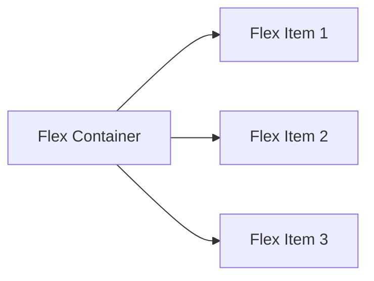

# 🧭 Chapter 15: Flexbox and CSS Grid


> [!TIP]
> **Chapter Goal:** Flexbox se one-dimensional aur CSS Grid se two-dimensional responsive layouts banana aur correct layout system choose karna.

---

## 🎯 15.1 Learning Objectives

After completing this chapter, you will be able to:

1. Explain normal flow, Flexbox and Grid.
2. Define flex container, flex item and flex axes.
3. Use direction, wrapping, alignment and gap.
4. Control individual flex items.
5. Define grid container, tracks, lines, cells and areas.
6. Create explicit and implicit grids.
7. Use `fr`, `repeat()`, `minmax()`, `auto-fit` and `auto-fill`.
8. Align and place grid items.
9. Create layouts using named grid areas.
10. Choose between Flexbox and Grid.
11. Build a responsive dashboard using both systems.

---

## 🗣️ 15.2 Difficult Words: Pronunciation and Meaning

| 🔤 Word | 🔊 Pronunciation | 💡 Simple Meaning |
|---|---|---|
| Flexbox | फ्लेक्सबॉक्स — *fleks-boks* | Flexible one-dimensional layout |
| Grid | ग्रिड — *grid* | Rows aur columns ka layout |
| Dimension | डाइमेंशन — *dai-men-shun* | Direction/measurement |
| Axis | ऐक्सिस — *ak-sis* | Layout direction line |
| Alignment | अलाइनमेंट — *uh-line-ment* | Items ko arrange karna |
| Distribution | डिस्ट्रिब्यूशन — *dis-tri-byoo-shun* | Available space baantna |
| Wrapping | रैपिंग — *rap-ing* | Items ko next line me move karna |
| Track | ट्रैक — *trak* | Grid row ya column |
| Gutter | गटर — *gut-er* | Tracks/items ke beech gap |
| Explicit | एक्सप्लिसिट — *eks-plis-it* | Developer dwara directly defined |
| Implicit | इम्प्लिसिट — *im-plis-it* | Automatically created |
| Fraction | फ्रैक्शन — *frak-shun* | Available space ka hissa |
| Placement | प्लेसमेंट — *place-ment* | Item ki grid location |
| Intrinsic | इन्ट्रिन्सिक — *in-trin-zik* | Content ki natural size se related |
| Responsive | रिस्पॉन्सिव — *ri-spon-siv* | Available space/device ke according adapt karna |

---

# 🟦 Part A: Layout Foundations

## 💡 15.3 Normal Flow

Normal flow browser ka default layout system hai:

- Block boxes one below another.
- Inline content lines me flow karta hai.
- Each element next content ki position influence karta hai.

Flexbox/Grid use karne se pehle meaningful HTML and normal flow maintain karein.

---

## ⚖️ 15.4 Flexbox vs Grid

| Flexbox | CSS Grid |
|---|---|
| Mainly one-dimensional | Two-dimensional |
| Row **or** column focus | Rows **and** columns |
| Content-driven arrangement | Layout-driven arrangement |
| Navigation, toolbar, cards row | Page layout, gallery, dashboard |
| Items distribute and align | Tracks define and items place |

> [!IMPORTANT]
> Flexbox aur Grid competitors nahi hain. Ek project me dono saath use hote hain.

---

# 🟩 Part B: Flexbox Fundamentals

## 📦 15.5 Flex Container and Items

HTML:

```html
<div class="flex-container">
    <div>HTML</div>
    <div>CSS</div>
    <div>JavaScript</div>
</div>
```

CSS:

```css
.flex-container {
    display: flex;
}
```

- `flex-container` becomes flex container.
- Its in-flow direct children become flex items.
- Deeper descendants automatically flex items nahi bante.



---

## 🧭 15.6 Main Axis and Cross Axis

Flexbox has:

- **Main axis:** `flex-direction` determines.
- **Cross axis:** Main axis ke perpendicular.

Default:

```css
.container {
    display: flex;
    flex-direction: row;
}
```

In a left-to-right horizontal writing context, main axis commonly left-to-right and cross axis top-to-bottom hota hai. Writing mode and direction exact orientation affect karte hain.

---

## ↔️ 15.7 `flex-direction`

```css
.container {
    display: flex;
    flex-direction: row;
}
```

Values:

| Value | Basic Direction |
|---|---|
| `row` | Main axis inline direction |
| `row-reverse` | Reverse inline direction |
| `column` | Main axis block direction |
| `column-reverse` | Reverse block direction |

> [!CAUTION]
> Reverse directions visual order change kar sakti hain without changing DOM/read/focus order. Meaningful sequence ke liye HTML order correct rakhein.

---

## 🧵 15.8 `flex-wrap`

Default flex items one line me fit karne ki try karte hain:

```css
.container {
    display: flex;
    flex-wrap: nowrap;
}
```

Wrapping:

```css
.container {
    display: flex;
    flex-wrap: wrap;
}
```

Values:

- `nowrap`
- `wrap`
- `wrap-reverse`

Shorthand:

```css
.container {
    flex-flow: row wrap;
}
```

---

## ↔️ 15.9 Main-Axis Alignment: `justify-content`

```css
.container {
    display: flex;
    justify-content: center;
}
```

Common values:

- `flex-start`
- `flex-end`
- `center`
- `space-between`
- `space-around`
- `space-evenly`
- `start`
- `end`

### Concept

```text
Main axis free-space distribution → justify-content
```

---

## ↕️ 15.10 Cross-Axis Alignment: `align-items`

```css
.container {
    display: flex;
    align-items: center;
}
```

Common values:

- `stretch`
- `flex-start`
- `flex-end`
- `center`
- `baseline`
- `start`
- `end`

---

## 📚 15.11 Multiple-Line Alignment: `align-content`

```css
.container {
    display: flex;
    flex-wrap: wrap;
    align-content: space-between;
}
```

`align-content` multiple flex lines ke beech cross-axis space distribute karta hai.

> [!NOTE]
> Single flex line ho ya cross-axis extra space na ho to visible effect nahi ho sakta.

---

## ↔️ 15.12 Gap

```css
.container {
    display: flex;
    gap: 1rem;
}
```

Specific:

```css
.container {
    row-gap: 1rem;
    column-gap: 2rem;
}
```

Gap items ke between spacing provide karta hai without outer-edge margin side effects.

---

# 🟨 Part C: Flex Items

## 📈 15.13 `flex-grow`

Available positive free space me item ka growth factor.

```css
.item {
    flex-grow: 1;
}
```

Example:

```css
.primary {
    flex-grow: 2;
}

.secondary {
    flex-grow: 1;
}
```

Factors proportions define karte hain, but final sizing base sizes and constraints se bhi influence hoti hai.

---

## 📉 15.14 `flex-shrink`

Insufficient space me shrink factor.

```css
.item {
    flex-shrink: 1;
}
```

Prevent shrinking in suitable case:

```css
.logo {
    flex-shrink: 0;
}
```

> [!CAUTION]
> Shrink disable karne se small screens par overflow ho sakta hai.

---

## 📏 15.15 `flex-basis`

Flexing se pehle main-size base.

```css
.card {
    flex-basis: 18rem;
}
```

Responsive card row:

```css
.cards {
    display: flex;
    flex-wrap: wrap;
    gap: 1rem;
}

.card {
    flex: 1 1 18rem;
}
```

---

## 🧩 15.16 `flex` Shorthand

```css
.item {
    flex: 1 1 18rem;
}
```

Order:

```text
flex-grow | flex-shrink | flex-basis
```

Common:

```css
.item {
    flex: 1;
}
```

Shorthand expansion depends on syntax; explicit three values learning and predictable intent ke liye useful hain.

---

## 🎯 15.17 `align-self`

One item cross-axis alignment override:

```css
.featured {
    align-self: flex-start;
}
```

---

## 🔢 15.18 `order`

```css
.featured {
    order: -1;
}
```

Visual order change karta hai.

> [!WARNING]
> `order` screen-reader/keyboard/source order necessarily change nahi karta. Logical content order HTML me correct rakhein.

---

## 🧱 15.19 Flex Item Minimum Size Issue

Flex items content ke intrinsic minimum size ki wajah se expected se less shrink ho sakte hain.

Common fix in suitable context:

```css
.flex-item {
    min-width: 0;
}
```

Logical:

```css
.flex-item {
    min-inline-size: 0;
}
```

Long content ke saath overflow handling bhi test karein.

---

## 🧭 15.20 Common Flex Patterns

### Centering

```css
.center {
    display: flex;
    justify-content: center;
    align-items: center;
    min-height: 20rem;
}
```

### Navigation

```css
.navigation {
    display: flex;
    flex-wrap: wrap;
    gap: 0.75rem 1.5rem;
    align-items: center;
}
```

### Push Item to End

```css
.login-link {
    margin-inline-start: auto;
}
```

### Equal Cards

```css
.cards {
    display: flex;
    flex-wrap: wrap;
    gap: 1rem;
}

.card {
    flex: 1 1 16rem;
}
```

---

# 🟪 Part D: CSS Grid Fundamentals

## 🧱 15.21 Grid Container and Items

HTML:

```html
<div class="grid-container">
    <article>HTML</article>
    <article>CSS</article>
    <article>JavaScript</article>
</div>
```

CSS:

```css
.grid-container {
    display: grid;
}
```

Direct in-flow children become grid items.

---

## 🗺️ 15.22 Grid Terminology

| Term | Meaning |
|---|---|
| Grid container | Element with grid display |
| Grid item | Direct child participating in grid |
| Grid line | Track boundaries |
| Grid track | Row or column |
| Grid cell | One row-column intersection |
| Grid area | Multiple connected cells |
| Gap/gutter | Tracks ke between space |
| Explicit grid | Developer-defined tracks |
| Implicit grid | Automatically created tracks |

```text
       Column Track     Column Track
Line 1 ┃    Cell     ┃    Cell     ┃ Line 3
       ┣━━━━━━━━━━━━━╋━━━━━━━━━━━━━┫
Line 2 ┃    Cell     ┃    Cell     ┃
       ┗━━━━━━━━━━━━━┻━━━━━━━━━━━━━┛
```

---

## 📐 15.23 Defining Columns and Rows

```css
.grid {
    display: grid;
    grid-template-columns: 200px 1fr 1fr;
    grid-template-rows: auto 300px;
}
```

This creates:

- Three columns
- Two explicit rows

---

## 🧮 15.24 The `fr` Unit

`fr` available grid-container space ka fraction represent karta hai after relevant sizing.

```css
.grid {
    display: grid;
    grid-template-columns: 1fr 2fr;
}
```

Second flexible track gets twice the fraction share of first.

---

## 🔁 15.25 `repeat()`

```css
.grid {
    display: grid;
    grid-template-columns: repeat(3, 1fr);
}
```

Equivalent:

```css
grid-template-columns: 1fr 1fr 1fr;
```

Repeated pattern:

```css
grid-template-columns: repeat(2, 1fr 2fr);
```

---

## 📏 15.26 `minmax()`

```css
.grid {
    grid-template-columns: repeat(3, minmax(12rem, 1fr));
}
```

Track minimum and maximum size range define karta hai.

Avoid overflow when available width too small—wrapping strategy with auto-fit may be needed.

---

## 📱 15.27 Responsive Grid with `auto-fit`

```css
.cards {
    display: grid;
    grid-template-columns:
        repeat(auto-fit, minmax(min(100%, 16rem), 1fr));
    gap: 1rem;
}
```

Behavior:

- As many columns as fit
- Items wrap into new rows
- Each column minimum desired width, but small container me overflow avoid
- Remaining space distributed

---

## 🔄 15.28 `auto-fit` vs `auto-fill`

Both responsive repeated tracks create karte hain.

Simplified difference:

- `auto-fill` empty possible tracks preserve/fill kar sakta hai.
- `auto-fit` empty tracks collapse karke existing items stretch kar sakta hai.

Exact effect available space and track sizing par depend karta hai. DevTools grid overlay se compare karein.

---

## ↔️ 15.29 Grid Gap

```css
.grid {
    display: grid;
    gap: 1rem 2rem;
}
```

First value row gap, second column gap.

---

# 🟥 Part E: Grid Item Placement

## 📍 15.30 Grid Lines

```css
.grid {
    display: grid;
    grid-template-columns: repeat(4, 1fr);
}

.featured {
    grid-column-start: 1;
    grid-column-end: 3;
}
```

Shorthand:

```css
.featured {
    grid-column: 1 / 3;
}
```

Rows:

```css
.featured {
    grid-row: 1 / 3;
}
```

---

## ↔️ 15.31 Spanning Tracks

```css
.featured {
    grid-column: span 2;
}
```

Full available explicit columns when known:

```css
.header {
    grid-column: 1 / -1;
}
```

`-1` explicit grid ka last line reference karta hai.

---

## 🏷️ 15.32 Named Grid Lines

```css
.layout {
    display: grid;
    grid-template-columns:
        [sidebar-start] 16rem
        [sidebar-end content-start] 1fr
        [content-end];
}

.sidebar {
    grid-column: sidebar-start / sidebar-end;
}
```

Complex layouts readability improve ho sakti hai.

---

## 🗺️ 15.33 Named Grid Areas

CSS:

```css
.page-layout {
    display: grid;
    grid-template-areas:
        "header header"
        "sidebar main"
        "footer footer";
    grid-template-columns: 16rem 1fr;
    gap: 1rem;
}

.site-header {
    grid-area: header;
}

.sidebar {
    grid-area: sidebar;
}

.main-content {
    grid-area: main;
}

.site-footer {
    grid-area: footer;
}
```

> [!WARNING]
> Visual grid placement DOM reading/focus order replace nahi karti. HTML order logical rakhein.

---

## 🌱 15.34 Implicit Grid

Extra items explicit tracks ke outside placed hon to implicit tracks create ho sakte hain.

Control:

```css
.grid {
    display: grid;
    grid-template-columns: repeat(3, 1fr);
    grid-auto-rows: minmax(8rem, auto);
}
```

Auto-placement direction:

```css
.grid {
    grid-auto-flow: row;
}
```

Values may include `row`, `column` and dense variants.

> [!CAUTION]
> Dense placement visual order fill kar sakti hai but source-order understanding differ ho sakta hai. Accessibility test karein.

---

# 🟧 Part F: Grid Alignment

## ↔️ 15.35 `justify-items` and `align-items`

Within each grid area/cell:

```css
.grid {
    justify-items: center;
    align-items: center;
}
```

Shorthand:

```css
.grid {
    place-items: center;
}
```

---

## 🎯 15.36 `justify-self` and `align-self`

Individual item:

```css
.special {
    justify-self: end;
    align-self: start;
}
```

Shorthand:

```css
.special {
    place-self: start end;
}
```

---

## 📦 15.37 `justify-content` and `align-content`

Complete grid tracks container ke inside smaller hon to:

```css
.grid {
    justify-content: center;
    align-content: start;
}
```

Shorthand:

```css
.grid {
    place-content: start center;
}
```

Difference:

- `*-items` → items within grid areas
- `*-content` → complete grid within container

---

## 🧭 15.38 Grid Centering

```css
.center-grid {
    display: grid;
    place-items: center;
    min-height: 20rem;
}
```

---

# 🟫 Part G: Advanced Grid Introduction

## 🔗 15.39 Subgrid

A nested grid can use parent grid tracks with `subgrid` where supported and appropriate.

```css
.cards {
    display: grid;
    grid-template-columns: repeat(3, 1fr);
}

.card {
    display: grid;
    grid-template-rows: subgrid;
    grid-row: span 3;
}
```

Useful for aligning nested card contents across parent tracks. Browser targets and implementation behavior test karein.

---

## 🧱 15.40 Masonry Note

Masonry-style layout capabilities and syntax have evolved across CSS proposals and implementations. Production use se pehle current target-browser support verify karein. Stable Grid/Flexbox alternatives or progressive enhancement consider karein.

---

# 🟦 Part H: Choosing Flexbox or Grid

## ⚖️ 15.41 Decision Guide

Use Flexbox when:

- Main concern one axis hai.
- Item size content-driven hai.
- Navigation/toolbar banana hai.
- Items distribute or align karne hain.
- Small component layout hai.

Use Grid when:

- Rows and columns simultaneously control karne hain.
- Page regions define karni hain.
- Cards aligned tracks me chahiye.
- Named areas helpful hain.
- Two-dimensional placement needed hai.

Use both:

- Page structure Grid se.
- Header/navigation Flexbox se.
- Card collection Grid se.
- Card internal actions Flexbox se.

---

## 🧠 15.42 Common Combined Pattern

```css
.dashboard {
    display: grid;
    grid-template-columns: 16rem 1fr;
}

.toolbar {
    display: flex;
    align-items: center;
    gap: 1rem;
}
```

---

# 🟪 Part I: Complete Responsive Dashboard

## 🧪 15.43 HTML

```html
<!DOCTYPE html>
<html lang="en">
<head>
    <meta charset="UTF-8">
    <meta name="viewport" content="width=device-width, initial-scale=1.0">
    <title>BCA Learning Dashboard</title>
    <link rel="stylesheet" href="css/dashboard.css">
</head>
<body>
    <a class="skip-link" href="#main-content">
        Skip to main content
    </a>

    <div class="page-layout">
        <header class="site-header">
            <a class="brand" href="index.html">
                BCA Learning Hub
            </a>

            <nav class="main-nav" aria-label="Main navigation">
                <a href="index.html" aria-current="page">Dashboard</a>
                <a href="courses.html">Courses</a>
                <a href="profile.html">Profile</a>
            </nav>
        </header>

        <aside class="sidebar">
            <h2>Study Menu</h2>
            <nav aria-label="Study navigation">
                <ul>
                    <li><a href="#courses">My Courses</a></li>
                    <li><a href="#progress">Progress</a></li>
                    <li><a href="#tasks">Tasks</a></li>
                </ul>
            </nav>
        </aside>

        <main id="main-content" class="main-content">
            <section class="welcome">
                <div>
                    <p class="eyebrow">Welcome back</p>
                    <h1>Broun Verma</h1>
                    <p>Continue your Web Technology course.</p>
                </div>

                <a class="primary-action" href="continue.html">
                    Continue Learning
                </a>
            </section>

            <section id="progress" aria-labelledby="stats-heading">
                <h2 id="stats-heading">Course Statistics</h2>

                <div class="stats-grid">
                    <article class="stat-card">
                        <h3>Chapters</h3>
                        <p class="stat-value">15</p>
                    </article>

                    <article class="stat-card">
                        <h3>Progress</h3>
                        <p class="stat-value">33%</p>
                    </article>

                    <article class="stat-card">
                        <h3>Projects</h3>
                        <p class="stat-value">4</p>
                    </article>
                </div>
            </section>

            <section id="courses" aria-labelledby="courses-heading">
                <h2 id="courses-heading">My Courses</h2>

                <div class="course-grid">
                    <article class="course-card">
                        <span class="course-level">Beginner</span>
                        <h3>HTML</h3>
                        <p>Structure accessible web pages.</p>
                        <a href="html-course.html">Open HTML Course</a>
                    </article>

                    <article class="course-card featured">
                        <span class="course-level">Current</span>
                        <h3>CSS</h3>
                        <p>Create responsive layouts and design.</p>
                        <a href="css-course.html">Open CSS Course</a>
                    </article>

                    <article class="course-card">
                        <span class="course-level">Next</span>
                        <h3>JavaScript</h3>
                        <p>Add behavior and application logic.</p>
                        <a href="javascript-course.html">
                            Open JavaScript Course
                        </a>
                    </article>
                </div>
            </section>

            <section id="tasks" aria-labelledby="tasks-heading">
                <div class="section-heading">
                    <h2 id="tasks-heading">Upcoming Tasks</h2>
                    <a href="tasks.html">View All Tasks</a>
                </div>

                <ul class="task-list">
                    <li>
                        <span>Complete Flexbox exercise</span>
                        <time datetime="2026-09-02">2 September</time>
                    </li>
                    <li>
                        <span>Create responsive card grid</span>
                        <time datetime="2026-09-05">5 September</time>
                    </li>
                </ul>
            </section>
        </main>

        <footer class="site-footer">
            <p>&copy; 2026 BCA Learning Hub</p>
        </footer>
    </div>
</body>
</html>
```

---

## 🎨 15.44 CSS

```css
*,
*::before,
*::after {
    box-sizing: border-box;
}

:root {
    --primary: #123a70;
    --primary-dark: #0b274b;
    --accent: #005fcc;
    --focus: #ffbf47;
    --page: #f4f7fb;
    --surface: #ffffff;
    --border: #cbd5e1;
    --text: #1f2937;
    --muted: #4b5563;
}

body {
    margin: 0;
    background-color: var(--page);
    color: var(--text);
    font-family: system-ui, sans-serif;
    line-height: 1.6;
}

.skip-link {
    position: fixed;
    z-index: 100;
    top: -5rem;
    left: 1rem;
    padding: 0.75rem 1rem;
    background: #ffffff;
    color: #000000;
}

.skip-link:focus {
    top: 1rem;
}

/* Main page grid */
.page-layout {
    min-height: 100dvh;
    display: grid;
    grid-template-areas:
        "header header"
        "sidebar main"
        "footer footer";
    grid-template-columns: 16rem minmax(0, 1fr);
    grid-template-rows: auto 1fr auto;
}

.site-header {
    grid-area: header;
    display: flex;
    flex-wrap: wrap;
    gap: 1rem 2rem;
    align-items: center;
    padding: 1rem max(1rem, 4vw);
    background-color: var(--primary-dark);
    color: #ffffff;
}

.brand {
    color: #ffffff;
    font-size: 1.25rem;
    font-weight: 800;
    text-decoration: none;
}

.main-nav {
    display: flex;
    flex-wrap: wrap;
    gap: 0.5rem 1rem;
    margin-inline-start: auto;
}

.main-nav a {
    padding: 0.5rem;
    color: #ffffff;
}

.sidebar {
    grid-area: sidebar;
    padding: 1.5rem;
    background-color: var(--surface);
    border-inline-end: 1px solid var(--border);
}

.sidebar ul {
    padding: 0;
    list-style: none;
}

.sidebar a {
    display: block;
    padding: 0.65rem;
    color: var(--accent);
}

.main-content {
    grid-area: main;
    min-width: 0;
    width: min(100%, 80rem);
    padding: clamp(1rem, 3vw, 2.5rem);
}

.welcome {
    display: flex;
    flex-wrap: wrap;
    gap: 1.5rem;
    justify-content: space-between;
    align-items: center;
    margin-bottom: 2rem;
    padding: clamp(1.25rem, 4vw, 2.5rem);
    border-radius: 1rem;
    background-color: var(--primary);
    color: #ffffff;
}

.welcome h1,
.welcome p {
    margin-block: 0.25rem;
}

.eyebrow {
    font-weight: 700;
    text-transform: uppercase;
    letter-spacing: 0.06em;
}

.primary-action {
    display: inline-block;
    padding: 0.75rem 1rem;
    border-radius: 0.5rem;
    background-color: #ffffff;
    color: var(--primary-dark);
    font-weight: 700;
    text-decoration: none;
}

/* Responsive repeated grid */
.stats-grid,
.course-grid {
    display: grid;
    grid-template-columns:
        repeat(auto-fit, minmax(min(100%, 15rem), 1fr));
    gap: 1rem;
}

.stat-card,
.course-card {
    min-width: 0;
    padding: 1.25rem;
    border: 1px solid var(--border);
    border-radius: 0.75rem;
    background-color: var(--surface);
}

.stat-value {
    margin: 0;
    color: var(--primary);
    font-size: 2rem;
    font-weight: 800;
}

.course-card {
    display: flex;
    flex-direction: column;
}

.course-card.featured {
    border: 2px solid var(--accent);
}

.course-card a {
    margin-top: auto;
    color: var(--accent);
    font-weight: 700;
}

.course-level {
    align-self: flex-start;
    padding: 0.2rem 0.6rem;
    border-radius: 999px;
    background-color: #e6f0ff;
    color: var(--primary);
    font-size: 0.875rem;
    font-weight: 700;
}

.section-heading {
    display: flex;
    flex-wrap: wrap;
    gap: 1rem;
    justify-content: space-between;
    align-items: baseline;
    margin-top: 2rem;
}

.task-list {
    display: grid;
    gap: 0.75rem;
    padding: 0;
    list-style: none;
}

.task-list li {
    display: flex;
    flex-wrap: wrap;
    gap: 0.75rem 1.5rem;
    justify-content: space-between;
    padding: 1rem;
    border: 1px solid var(--border);
    border-radius: 0.5rem;
    background-color: var(--surface);
}

.site-footer {
    grid-area: footer;
    padding: 1.5rem;
    background-color: var(--primary-dark);
    color: #ffffff;
    text-align: center;
}

a:focus-visible {
    outline: 3px solid var(--focus);
    outline-offset: 3px;
}

/* Responsive page-layout change */
@media (max-width: 48rem) {
    .page-layout {
        grid-template-areas:
            "header"
            "sidebar"
            "main"
            "footer";
        grid-template-columns: 1fr;
    }

    .sidebar {
        border-inline-end: 0;
        border-bottom: 1px solid var(--border);
    }

    .sidebar ul {
        display: flex;
        flex-wrap: wrap;
        gap: 0.5rem;
    }

    .main-nav {
        width: 100%;
        margin-inline-start: 0;
    }
}
```

---

## ♿ 15.45 Accessibility and Layout Checklist

1. DOM order logical rakhein.
2. Visual reorder se reading order confuse na karein.
3. Keyboard focus order source order follow kare.
4. Flex/Grid items ko small screens par wrap/reflow karne dein.
5. Fixed track widths se overflow avoid karein.
6. `minmax()` and `min-width: 0` use karein where needed.
7. Zoom par content overlap test karein.
8. Focus indicators visible rakhein.
9. Cards ko clickable div na banayein; real links/buttons use karein.
10. Grid areas meaningful HTML landmarks ke saath use karein.
11. CSS fail ho to document reading order sensible rahe.
12. Dense auto-placement carefully test karein.

---

## 🚫 15.46 Common Mistakes

### Flexbox

1. Flex container properties items par lagana.
2. Main and cross axes confuse karna.
3. `align-content` single line par use karke result expect karna.
4. Shrink behavior ignore karna.
5. `order` se semantic order fix karna.
6. Gap ke saath unnecessary child margins.
7. Long content ke liye `min-width: 0` issue ignore karna.

### Grid

1. Grid properties non-container par lagana.
2. `fr` ko absolute fraction samajhna.
3. `auto-fit` and `auto-fill` identical samajhna.
4. Explicit and implicit tracks confuse karna.
5. Line numbers incorrectly count karna.
6. Grid placement se DOM order replace karna.
7. Fixed columns se mobile overflow.
8. Grid and Flexbox ko mutually exclusive samajhna.

---

## 📌 15.47 Key Points to Remember

- Flexbox mainly one-dimensional hai.
- Grid two-dimensional hai.
- Flex direct children flex items bante hain.
- `justify-content` main-axis distribution control karta hai.
- `align-items` cross-axis item alignment control karta hai.
- `flex-wrap` multiple lines allow karta hai.
- `flex` grow, shrink and basis shorthand hai.
- Grid tracks rows and columns hote hain.
- `fr` available space fraction hai.
- `repeat()` repeated tracks simplify karta hai.
- `minmax()` track range define karta hai.
- `auto-fit` responsive card grids me useful hai.
- Grid areas page layout readable bana sakti hain.
- Flexbox and Grid together use kiye ja sakte hain.
- Visual order logical source order ka replacement nahi hai.

---

## 📝 15.48 Chapter Summary

Flexbox is a one-dimensional layout system organized around main and cross axes. A flex container controls direction, wrapping, alignment and spacing, while individual items can grow, shrink, set a basis and override alignment. CSS Grid is a two-dimensional layout system built from rows, columns, lines, cells and areas. Explicit tracks are developer-defined, while implicit tracks are automatically created. Grid supports fractions, repeat patterns, minimum-maximum sizing, automatic fitting, named areas and precise placement. Flexbox is ideal for component-level alignment along one axis, while Grid is ideal for two-dimensional page and card layouts. Accessible implementations preserve logical DOM order, visible focus and responsive reflow.

---

## 🎲 15.49 Multiple-Choice Questions

### 1. Flexbox is mainly:

A. Three-dimensional  
B. One-dimensional  
C. Database-driven  
D. Audio-based  

**✅ Answer:** B

### 2. Which property sets the flex main-axis direction?

A. `flex-direction`  
B. `align-items`  
C. `grid-flow`  
D. `position`  

**✅ Answer:** A

### 3. Which property distributes main-axis free space?

A. `align-items`  
B. `justify-content`  
C. `align-self`  
D. `font-align`  

**✅ Answer:** B

### 4. Which property allows flex items to move to new lines?

A. `flex-wrap`  
B. `grid-row`  
C. `position`  
D. `float`  

**✅ Answer:** A

### 5. Which shorthand includes grow, shrink and basis?

A. `flex`  
B. `flow`  
C. `place`  
D. `grid`  

**✅ Answer:** A

### 6. CSS Grid is mainly:

A. One-dimensional only  
B. Two-dimensional  
C. Text-only  
D. Server-side  

**✅ Answer:** B

### 7. Which unit represents a grid-space fraction?

A. `px`  
B. `fr`  
C. `em`  
D. `vh`  

**✅ Answer:** B

### 8. Which function repeats grid tracks?

A. `repeat()`  
B. `loop()`  
C. `tracks()`  
D. `clone()`  

**✅ Answer:** A

### 9. Which function sets track minimum and maximum?

A. `clamp()` only  
B. `minmax()`  
C. `range()`  
D. `fit()`  

**✅ Answer:** B

### 10. Which should preserve meaningful sequence?

A. DOM/source order  
B. Random z-index  
C. Visual order only  
D. File size  

**✅ Answer:** A

---

## ✍️ 15.50 Fill in the Blanks

1. Flexbox has main and __________ axes.
2. Flex items are __________ children of the flex container.
3. Grid rows and columns are called __________.
4. `fr` means a __________ of available space.
5. Named layout regions use grid-template-__________.

<details>
<summary><strong>✅ View Answers</strong></summary>

1. cross  
2. direct  
3. tracks  
4. fraction  
5. areas

</details>

---

## ✅ 15.51 True or False

1. Flexbox directly makes all descendants flex items.
2. Main axis depends on flex direction.
3. `align-content` always affects one flex line.
4. Grid controls rows and columns.
5. `fr` is a fixed physical unit.
6. Grid can create implicit tracks.
7. `order` changes DOM order.
8. Flexbox and Grid can be combined.
9. Auto-fit can help create responsive grids.
10. Visual placement guarantees accessible reading order.

<details>
<summary><strong>✅ View Answers</strong></summary>

1. False  
2. True  
3. False  
4. True  
5. False  
6. True  
7. False  
8. True  
9. True  
10. False

</details>

---

## ❓ 15.52 Short-Answer Questions

1. Define Flexbox.
2. What are flex container and flex item?
3. Define main and cross axes.
4. Explain `justify-content` and `align-items`.
5. What is flex wrapping?
6. Explain flex grow, shrink and basis.
7. Define CSS Grid.
8. What are grid tracks, lines and cells?
9. Differentiate explicit and implicit grids.
10. What is the `fr` unit?
11. Explain `repeat()` and `minmax()`.
12. Differentiate `auto-fit` and `auto-fill`.
13. What are named grid areas?
14. Explain grid alignment.
15. When should Flexbox or Grid be used?

---

## 📚 15.53 Long-Answer and Exam Questions

1. Explain Flexbox architecture and axes.
2. Explain flex-container properties with examples.
3. Explain flex-item properties with examples.
4. Create and explain a responsive Flexbox card row.
5. Explain CSS Grid terminology.
6. Explain explicit and implicit grids.
7. Discuss grid track-sizing functions.
8. Explain grid-item placement using lines and areas.
9. Explain Grid alignment properties.
10. Compare Flexbox and Grid.
11. Discuss accessibility issues caused by visual reordering.
12. Create and explain a responsive dashboard using both.

---

## 🧪 15.54 Practical Exercises

1. Create a horizontal flex navigation.
2. Change it to a column.
3. Create wrapping flex cards.
4. Test justify-content values.
5. Test align-items values.
6. Create flexible grow and shrink examples.
7. Create a three-column grid.
8. Use `fr` and `repeat()`.
9. Build responsive cards with auto-fit and minmax.
10. Place an item across two columns.
11. Create a named-area page layout.
12. Test implicit grid rows.
13. Combine Grid page layout with Flex toolbar.
14. Build the complete dashboard.
15. Test keyboard, zoom and small-screen reflow.

---

## 🎤 15.55 Viva Questions

1. Is Flexbox one-dimensional?
2. What is a flex container?
3. What determines the main axis?
4. What does justify-content do?
5. What does align-items do?
6. What does flex-wrap do?
7. What are flex grow and shrink?
8. Is Grid two-dimensional?
9. What is a grid track?
10. What does `fr` mean?
11. What does `repeat()` do?
12. What does `minmax()` do?
13. What is an implicit grid?
14. What are grid areas?
15. Can Flexbox and Grid work together?

<details>
<summary><strong>✅ View Short Viva Answers</strong></summary>

1. Yes.  
2. An element with flex display.  
3. `flex-direction`.  
4. Distributes main-axis free space.  
5. Aligns items on the cross axis.  
6. Allows multiple flex lines.  
7. Positive and negative free-space factors.  
8. Yes.  
9. A grid row or column.  
10. A fraction of available grid space.  
11. Repeats track patterns.  
12. Defines minimum and maximum track size.  
13. Automatically created tracks.  
14. Named or positioned groups of cells.  
15. Yes.

</details>

---

## 🏁 15.56 One-Minute Revision

| Question | Quick Answer |
|---|---|
| One axis? | Flexbox |
| Two axes? | Grid |
| Flex direction? | `flex-direction` |
| Main-axis space? | `justify-content` |
| Cross-axis align? | `align-items` |
| Multiple lines? | `flex-wrap` |
| Item shorthand? | `flex` |
| Grid fraction? | `fr` |
| Repeat tracks? | `repeat()` |
| Track range? | `minmax()` |
| Responsive repeat? | `auto-fit` |
| Track spacing? | `gap` |
| Named layout? | `grid-template-areas` |
| Individual align? | `align-self` / `justify-self` |
| Correct reading sequence? | DOM order |

---

## 📚 15.57 Official References

1. [W3C CSS Flexible Box Layout](https://www.w3.org/TR/css-flexbox-1/)
2. [W3C CSS Grid Layout](https://www.w3.org/TR/css-grid-2/)
3. [W3C CSS Box Alignment](https://www.w3.org/TR/css-align-3/)

---

[⬅️ Previous Chapter](14-box-model-display-and-positioning.md) · [📚 Table of Contents](../SUMMARY.md) · **Next: Responsive Web Design ➡️**
