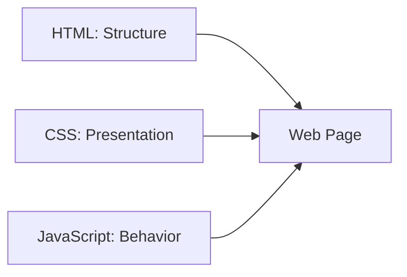

# ⚡ Chapter 18: JavaScript Fundamentals


> [!TIP]
> **Chapter Goal:** JavaScript ko zero level se samajhna, browser me safely connect karna, console use karna aur apna first interactive web program banana.

---

## 🎯 18.1 Learning Objectives

After completing this chapter, you will be able to:

1. Define JavaScript and explain its role.
2. Differentiate JavaScript from Java.
3. Explain ECMAScript, engine and host environment.
4. Identify client-side and server-side JavaScript uses.
5. Add JavaScript inline, internally and externally.
6. Explain classic scripts, `defer`, `async` and modules.
7. Use browser console and Developer Tools.
8. Understand statements, expressions, comments and case sensitivity.
9. Identify basic syntax, runtime and logical errors.
10. Use strict mode at a beginner level.
11. Follow basic JavaScript coding practices.
12. Build a first interactive greeting page.

---

## 🗣️ 18.2 Difficult Words: Pronunciation and Meaning

| 🔤 Word | 🔊 Pronunciation | 💡 Simple Meaning |
|---|---|---|
| JavaScript | जावास्क्रिप्ट — *jaa-vuh-script* | Web programming language |
| ECMAScript | एक्मास्क्रिप्ट — *ek-muh-script* | JavaScript language standard |
| Engine | इंजन — *en-jin* | JavaScript code execute karne wala software component |
| Runtime | रनटाइम — *run-time* | Code execution environment/time |
| Host | होस्ट — *host* | JavaScript ko APIs dene wala environment |
| Syntax | सिन्टैक्स — *sin-taks* | Code grammar rules |
| Statement | स्टेटमेंट — *stayt-ment* | Program instruction |
| Expression | एक्सप्रेशन — *eks-presh-un* | Value produce karne wala code |
| Identifier | आइडेन्टिफायर — *ai-den-ti-fai-er* | Variable/function ka name |
| Literal | लिटरल — *lit-er-ul* | Code me directly written value |
| Console | कन्सोल — *kon-sohl* | Messages/output and debugging panel |
| Debugging | डीबगिंग — *dee-bug-ing* | Error find aur fix karna |
| Synchronous | सिंक्रोनस — *sin-kruh-nus* | Ordered/blocking flow me |
| Asynchronous | एसिंक्रोनस — *ay-sin-kruh-nus* | Later/non-blocking completion model |
| Module | मॉड्यूल — *mod-yool* | Reusable isolated code file/unit |
| Interactive | इन्टरैक्टिव — *in-ter-ak-tiv* | User action ka response dene wala |

---

# 🟦 Part A: Introduction to JavaScript

## 💡 18.3 What Is JavaScript?

### 18.3.1 English Explanation

JavaScript is a general-purpose programming language standardized as ECMAScript. In web browsers, it is used to add behavior, interactivity and dynamic updates to web pages. It can also run in servers and other host environments.

### 18.3.2 Hinglish Explanation

JavaScript website ko interactive banati hai. User button click kare, form fill kare, menu open kare ya server se data aaye—to JavaScript page ko respond aur update kar sakti hai.

### Simple Example

```javascript
console.log("Hello, JavaScript!");
```

---

## 🧱 18.4 HTML, CSS and JavaScript

| Technology | Main Role | Example |
|---|---|---|
| HTML | Structure and meaning | Button create karna |
| CSS | Presentation and layout | Button ka color/style |
| JavaScript | Behavior and logic | Click par action |



---

## ☕ 18.5 JavaScript vs Java

JavaScript and Java different languages hain.

| JavaScript | Java |
|---|---|
| ECMAScript-based language | Java platform language |
| Browser scripting me widely used | JVM-based applications me widely used |
| Dynamic typing | Statically typed language |
| Prototype-based object model | Class-centered object model |
| Syntax similarities exist | Different runtime and ecosystem |

> [!IMPORTANT]
> Similar name ka meaning same language nahi hai.

---

## 📜 18.6 Brief History

- JavaScript was created by Brendan Eich at Netscape in 1995.
- Early names included Mocha and LiveScript.
- The language was standardized under the name ECMAScript.
- JavaScript engines and web APIs expanded over time.
- Modern JavaScript supports modules, classes, promises, async functions and many other features.

> [!NOTE]
> ECMAScript specification continuously evolves. Production code ke liye target runtime/browser support verify karein.

---

## 📖 18.7 JavaScript and ECMAScript

### ECMAScript

Language syntax, values, objects and behavior ka standard.

### JavaScript

ECMAScript language ka widely used implementation/name plus host-provided APIs in practical environments.

### Web APIs

Browser JavaScript ko additional capabilities deta hai:

- DOM
- Events
- Fetch
- Timers
- Storage
- Geolocation with permission
- Canvas
- Media APIs

> [!IMPORTANT]
> `document`, `fetch` and `localStorage` ECMAScript core language ke parts nahi; they are browser/host APIs.

---

## ⚙️ 18.8 JavaScript Engine

Engine source code parse, compile/interpret and execute karta hai.

Examples:

| Browser/Runtime | Engine |
|---|---|
| Chrome/Edge | V8 |
| Firefox | SpiderMonkey |
| Safari | JavaScriptCore |

Exact engine implementation internal details differ kar sakte hain.

---

## 🌍 18.9 Host Environments

JavaScript different hosts me run ho sakti hai.

### Browser

Provides:

- `window`
- `document`
- User events
- Network APIs
- Storage
- Timers

### Server Runtime

Can provide:

- File-system APIs
- Network servers
- Process APIs
- Database libraries

### Other Environments

- Desktop applications
- Mobile applications
- Embedded devices
- Automation tools
- Cloud/serverless functions

---

## 🛠️ 18.10 Uses of JavaScript

1. Form validation
2. Menu and dialog behavior
3. Dynamic page updates
4. Calculators
5. Games
6. Data visualization
7. API communication
8. Single-page applications
9. Server-side applications
10. Build and developer tools
11. Browser extensions
12. Real-time applications

---

# 🟩 Part B: Running JavaScript

## 🧰 18.11 Tools Required

1. Code editor
2. Modern browser
3. Browser Developer Tools
4. HTML file
5. JavaScript file

Project:

```text
javascript-start/
├── index.html
└── js/
    └── app.js
```

---

## 🖥️ 18.12 Browser Console

Steps:

1. Page open karein.
2. Press `F12` or supported Developer Tools shortcut.
3. Console tab open karein.
4. Type:

```javascript
2 + 3
```

Output:

```text
5
```

Log message:

```javascript
console.log("JavaScript is working.");
```

> [!WARNING]
> Unknown person ka code browser console me paste na karein. It may access data or perform actions in the current page context.

---

## 📝 18.13 Inline Event Code

```html
<button onclick="alert('Hello!')">
    Click Me
</button>
```

### Advantage

- Quick demo

### Limitations

- HTML and behavior mix
- Maintenance difficult
- Reuse poor
- Security policy conflicts
- Modern event handling less clean

Use for understanding only; normal project me external JS and event listeners prefer karein.

---

## 📄 18.14 Internal JavaScript

```html
<!DOCTYPE html>
<html lang="en">
<head>
    <meta charset="UTF-8">
    <title>Internal JavaScript</title>
</head>
<body>
    <h1>JavaScript Demo</h1>

    <script>
        console.log("Internal JavaScript");
    </script>
</body>
</html>
```

Script often body end par rakha jata tha so HTML already parsed ho. Modern external loading attributes better control de sakte hain.

---

## 📁 18.15 External JavaScript

HTML:

```html
<script src="js/app.js"></script>
```

JavaScript file:

```javascript
console.log("External JavaScript loaded.");
```

### Advantages

1. Reusable code
2. Cleaner HTML
3. Easier maintenance
4. Browser caching
5. Better project organization
6. Easier testing

> [!IMPORTANT]
> Normal projects me external JavaScript preferred hai.

---

## 🧭 18.16 Script Placement

Classic script in body end:

```html
<body>
    <!-- Page content -->

    <script src="js/app.js"></script>
</body>
```

Script in head with defer:

```html
<head>
    <script src="js/app.js" defer></script>
</head>
```

---

## ⏳ 18.17 The `defer` Attribute

```html
<script src="js/app.js" defer></script>
```

For classic external scripts, `defer` generally:

- Fetching ko document parsing ke alongside allow karta hai.
- Execution document parsing complete hone ke baad hoti hai.
- Deferred scripts document order maintain karte hain.
- Document readiness timing ke saath coordinated hote hain.

> [!TIP]
> DOM-based normal external scripts ke liye `defer` commonly useful hai.

---

## ⚡ 18.18 The `async` Attribute

```html
<script src="analytics.js" async></script>
```

Async script:

- Fetching parallel ho sakti hai.
- Available hote hi execute ho sakti hai.
- Relative execution order guaranteed nahi.
- Independent scripts ke liye suitable ho sakti hai.

### Examples

- Independent analytics
- Independent advertising integration
- Self-contained widget

> [!CAUTION]
> Ek dusre par dependent scripts ko careless `async` ke saath use na karein.

---

## 📦 18.19 JavaScript Modules

```html
<script type="module" src="js/app.js"></script>
```

Module scripts:

- Module scope provide karte hain.
- `import` and `export` support karte hain.
- Deferred-style document processing behavior use karte hain.
- Strict mode automatically apply hota hai.
- Module dependency graph load kar sakte hain.

Example:

```javascript
import { greet } from "./greeting.js";

greet("Broun");
```

> [!NOTE]
> Local file URLs par module loading browser security rules ki wajah se fail ho sakti hai. Local development server use karein.

---

## ⚖️ 18.20 Classic, Defer, Async and Module

| Method | Execution Idea | Order |
|---|---|---|
| Plain classic script | Parsing block kar sakta hai | Document order |
| `defer` classic | Parse ke baad | Document order |
| `async` classic | Ready hote hi | Not guaranteed |
| Module | Module graph, deferred behavior | Module rules |

---

## 🚫 18.21 Do Not Use Self-Closing Script Tag

Incorrect in HTML syntax:

```html
<script src="app.js" />
```

Correct:

```html
<script src="app.js"></script>
```

---

# 🟨 Part C: JavaScript Syntax Basics

## 🔤 18.22 Case Sensitivity

JavaScript case-sensitive hai.

```javascript
const studentName = "Broun";
const studentname = "Aman";
```

These are different identifiers.

`console.log` correct; `Console.log` different/undefined ho sakta hai.

---

## 📝 18.23 Statements

Statement program instruction hota hai.

```javascript
console.log("Hello");
```

Multiple:

```javascript
const course = "BCA";
console.log(course);
```

---

## 🧮 18.24 Expressions

Expression value produce karta hai.

```javascript
2 + 3
```

```javascript
"Web" + " Technology"
```

```javascript
course === "BCA"
```

Statement expression contain kar sakta hai:

```javascript
console.log(2 + 3);
```

---

## 🏷️ 18.25 Identifiers

Identifiers variables, functions, classes and other program bindings ke names hote hain.

Examples:

```javascript
studentName
totalMarks
calculateResult
```

Basic rules:

1. Letter, underscore or dollar sign se start kar sakta hai.
2. Later characters me digits allowed.
3. Reserved keywords use nahi kar sakte.
4. Case-sensitive.
5. Meaningful names use karein.

Good:

```javascript
const totalMarks = 450;
```

Poor:

```javascript
const x = 450;
```

When `x` meaning obvious na ho.

---

## 🔢 18.26 Literals

Code me directly written values.

### Number

```javascript
42
3.14
```

### String

```javascript
"Hello"
'BCA'
```

### Boolean

```javascript
true
false
```

### Array Literal

```javascript
["HTML", "CSS", "JavaScript"]
```

### Object Literal

```javascript
{
    name: "Broun",
    course: "BCA"
}
```

Variables and types next chapter me detail se.

---

## ➿ 18.27 Semicolons

```javascript
const course = "BCA";
console.log(course);
```

JavaScript Automatic Semicolon Insertion (ASI) some missing semicolons insert kar sakti hai, but not always as expected.

Consistent semicolon style use karein. Beginner code me explicit semicolons clarity improve karte hain.

> [!CAUTION]
> Some line breaks code meaning change kar sakte hain. Formatter/linter use karna helpful hai.

---

## 🧱 18.28 Blocks

Curly braces statements ko group karte hain:

```javascript
{
    const message = "Inside a block";
    console.log(message);
}
```

Blocks commonly:

- Conditions
- Loops
- Functions
- Try/catch

---

## 💬 18.29 Comments

Single-line:

```javascript
// Display a welcome message
console.log("Welcome");
```

Multi-line:

```javascript
/*
  This program displays
  a course message.
*/
console.log("BCA Web Technology");
```

> [!WARNING]
> Comments me secrets, passwords or tokens mat store karein.

---

## ⬜ 18.30 Whitespace

Spaces and line breaks mostly code readability improve karte hain, but strings, tokens and automatic semicolon situations me meaning matter kar sakta hai.

Readable:

```javascript
const total = price * quantity;
```

Hard to read:

```javascript
const total=price*quantity;
```

---

## 🔑 18.31 Reserved Words

Language keywords identifiers ke roop me use nahi kiye ja sakte.

Examples:

- `const`
- `let`
- `if`
- `else`
- `for`
- `while`
- `function`
- `return`
- `class`
- `import`
- `export`

Incorrect:

```javascript
const for = 10;
```

---

# 🟪 Part D: Output and Interaction

## 🖥️ 18.32 `console.log()`

```javascript
console.log("Hello, JavaScript!");
console.log(10 + 20);
```

Debugging and learning ke liye.

Other methods:

```javascript
console.info("Course loaded");
console.warn("Password is weak");
console.error("Unable to save");
console.table([
    { name: "HTML", progress: 100 },
    { name: "CSS", progress: 70 }
]);
```

> [!CAUTION]
> Production console logs me passwords, tokens or personal data expose na karein.

---

## 🚨 18.33 `alert()`

```javascript
alert("Welcome to Web Technology!");
```

Blocking dialog show karta hai.

Use limited demonstrations ke liye. Normal interface me accessible page content/dialog patterns better hote hain.

---

## ⌨️ 18.34 `prompt()`

```javascript
const name = prompt("What is your name?");
console.log(name);
```

User cancel kare to `null` return ho sakta hai.

Blocking and limited UI; beginner exercise ke liye.

---

## ✅ 18.35 `confirm()`

```javascript
const accepted = confirm("Do you want to continue?");
console.log(accepted);
```

Returns boolean.

---

## 🧾 18.36 `document.write()` Warning

```javascript
document.write("Hello");
```

Existing page load ke baad use karne par document replace or unexpected behavior ho sakta hai.

> [!WARNING]
> Modern DOM updates ke liye `document.write()` avoid karein.

---

# 🟥 Part E: Errors and Debugging

## 🐞 18.37 Types of Errors

### 18.37.1 Syntax Error

Grammar incorrect:

```javascript
console.log("Hello";
```

### 18.37.2 Runtime Error

Code parses, but execution ke time problem:

```javascript
console.log(unknownStudent);
```

### 18.37.3 Logical Error

Code runs but result wrong:

```javascript
const total = 10 - 5; // Wanted addition
```

---

## 🔍 18.38 Reading Console Errors

Error message may show:

- Error type
- Description
- File
- Line number
- Column
- Stack trace

Example:

```text
ReferenceError: studentName is not defined
    at app.js:5
```

Debug steps:

1. First relevant error read karein.
2. File and line open karein.
3. Spelling/case check karein.
4. Variable defined hai?
5. Syntax surrounding line check karein.
6. Fix and reload.
7. New error separately solve karein.

---

## 🛑 18.39 Breakpoints

Developer Tools Sources/Debugger panel me breakpoint code execution pause karta hai.

Use to inspect:

- Current line
- Variable values
- Call stack
- Scope
- Step over
- Step into
- Step out

---

## 🧪 18.40 Debugging with Logs

```javascript
console.log("Program started");

const course = "CSS";
console.log("Course:", course);

console.log("Program finished");
```

Structured log labels use karein. Debug logs task complete hone ke baad clean karein.

---

# 🟧 Part F: Strict Mode and Good Practices

## 🔒 18.41 Strict Mode

Classic script/function me:

```javascript
"use strict";

console.log("Strict mode enabled");
```

Strict mode certain error-prone behavior ko restrict or change karta hai and mistakes ko errors me surface kar sakta hai.

Modules automatically strict mode me execute hote hain.

> [!NOTE]
> Strict mode legacy code behavior affect kar sakta hai. Modern new code/modules me useful default hai.

---

## ✅ 18.42 Coding Best Practices

1. Use external files.
2. Prefer `defer` or modules where suitable.
3. Use meaningful names.
4. Keep one consistent style.
5. Indent code properly.
6. Use comments for “why,” not obvious “what.”
7. Avoid global variables where possible.
8. Do not use inline event handlers in normal projects.
9. Check browser console.
10. Validate user input.
11. Never trust client-side code for security.
12. Do not expose secrets.
13. Keep functions focused.
14. Use formatter and linter.
15. Test keyboard and error states.

---

## 🔐 18.43 Client-Side Security Reality

Browser JavaScript user ko delivered hoti hai. User can:

- View source
- Inspect code
- Modify local execution
- Send custom requests
- Bypass client checks

Therefore:

- Secret API keys frontend code me mat put karein.
- Authorization server par enforce karein.
- Validation server par repeat karein.
- Sensitive calculations only client par trust na karein.
- DOM me untrusted content safely handle karein.

---

# 🟫 Part G: First Interactive Project

## 🧪 18.44 Project Structure

```text
js-greeting/
├── index.html
├── css/
│   └── styles.css
└── js/
    └── app.js
```

---

## 🧱 18.45 HTML

```html
<!DOCTYPE html>
<html lang="en">
<head>
    <meta charset="UTF-8">
    <meta name="viewport" content="width=device-width, initial-scale=1.0">
    <title>JavaScript Greeting</title>
    <link rel="stylesheet" href="css/styles.css">
    <script src="js/app.js" defer></script>
</head>
<body>
    <main class="greeting-card">
        <h1>JavaScript Greeting</h1>

        <label for="student-name">Enter Your Name</label>
        <input
            type="text"
            id="student-name"
            name="student_name"
            autocomplete="name">

        <button id="greet-button" type="button">
            Show Greeting
        </button>

        <p id="greeting-output" aria-live="polite">
            Your greeting will appear here.
        </p>
    </main>
</body>
</html>
```

---

## 🎨 18.46 CSS

```css
* {
    box-sizing: border-box;
}

body {
    min-height: 100dvh;
    margin: 0;
    display: grid;
    place-items: center;
    padding: 1rem;
    background-color: #f4f7fb;
    color: #1f2937;
    font-family: system-ui, sans-serif;
}

.greeting-card {
    width: min(100%, 32rem);
    padding: 2rem;
    border: 1px solid #cbd5e1;
    border-radius: 1rem;
    background-color: #ffffff;
    box-shadow: 0 8px 24px rgb(15 23 42 / 10%);
}

label,
input,
button {
    display: block;
    width: 100%;
}

input,
button {
    margin-top: 0.5rem;
    padding: 0.75rem;
    font: inherit;
}

button {
    margin-top: 1rem;
    border: 0;
    border-radius: 0.5rem;
    background-color: #005fcc;
    color: #ffffff;
    font-weight: 700;
    cursor: pointer;
}

button:focus-visible,
input:focus-visible {
    outline: 3px solid #ffbf47;
    outline-offset: 3px;
}

#greeting-output {
    min-height: 3rem;
    margin-top: 1.5rem;
    padding: 1rem;
    background-color: #e8f0ff;
}
```

---

## ⚡ 18.47 JavaScript

```javascript
"use strict";

console.log("Greeting application loaded.");

const nameInput = document.querySelector("#student-name");
const greetButton = document.querySelector("#greet-button");
const output = document.querySelector("#greeting-output");

greetButton.addEventListener("click", () => {
    const studentName = nameInput.value.trim();

    if (studentName === "") {
        output.textContent = "Please enter your name.";
        nameInput.focus();
        return;
    }

    output.textContent =
        "Hello, " + studentName + "! Welcome to JavaScript.";
});
```

---

## 🧠 18.48 How the Program Works

1. Strict mode enabled.
2. Console load message displays.
3. `querySelector()` HTML elements find karta hai.
4. `addEventListener()` button click listen karta hai.
5. Input value read hoti hai.
6. `trim()` outer whitespace remove karta hai.
7. Empty input condition check hoti hai.
8. `textContent` safe text output set karta hai.
9. `focus()` user ko empty input par return karta hai.

> [!NOTE]
> DOM, events, conditions and functions later chapters me detail se cover honge. Yahan complete working preview diya gaya hai.

---

## 🧪 18.49 Practice Changes

1. Greeting text change karein.
2. Course name input add karein.
3. Console me entered name print karein.
4. Empty state message improve karein.
5. Button text change karein.
6. `defer` remove karke placement behavior test karein carefully.
7. Script path wrong karke Network/Console error observe karein.
8. One syntax error create and fix karein.
9. Internal script version banayein.
10. Module script version try karein using local server.

---

## ♿ 18.50 Accessibility Checklist

1. Real button use karein.
2. Input ka visible label ho.
3. Keyboard click/activation work kare.
4. Focus visible ho.
5. Dynamic output announced where appropriate.
6. Error text clear ho.
7. Error only color se na ho.
8. Focus intentionally manage ho.
9. JavaScript fail ho to basic page understandable ho.
10. Blocking alerts overuse na karein.

---

## 🚫 18.51 Common Mistakes

1. JavaScript ko Java samajhna.
2. `Console.log` instead of `console.log`.
3. Wrong script path.
4. External JS file me `<script>` tags likhna.
5. Self-closing script tag.
6. DOM script too early without defer.
7. Dependent scripts par async use karna.
8. Semicolon/line-break behavior ignore karna.
9. Identifier case mismatch.
10. Reserved word as variable name.
11. Console errors ignore karna.
12. `document.write()` for modern updates.
13. Inline handlers everywhere.
14. Frontend code me secrets rakhna.
15. Client validation ko security samajhna.

---

## 📌 18.52 Key Points to Remember

- JavaScript programming language hai.
- ECMAScript language standard define karta hai.
- Browser APIs ECMAScript core se separate hain.
- Engine JavaScript execute karta hai.
- External JS normal projects ke liye preferred hai.
- `defer` parsing ke baad ordered classic execution support karta hai.
- `async` independent ready-when-loaded execution ke liye.
- Modules import/export and module scope provide karte hain.
- JavaScript case-sensitive hai.
- Statements instructions and expressions values produce karte hain.
- Console debugging ka primary beginner tool hai.
- Client-side code trusted security boundary nahi hai.

---

## 📝 18.53 Chapter Summary

JavaScript is a general-purpose programming language standardized as ECMAScript. Browsers combine the language with host APIs such as the DOM, events, networking and storage. JavaScript can also run in server and other environments. Scripts can be inline, internal or external; external files are best for organization. Classic scripts may block parsing, while `defer`, `async` and modules provide different loading and execution behavior. JavaScript is case-sensitive and consists of statements, expressions, identifiers, literals, blocks and comments. Browser Developer Tools provide a console, debugger and error information. Safe beginner practice includes external scripts, meaningful names, console inspection, no exposed secrets and server-side validation.

---

## 🎲 18.54 Multiple-Choice Questions

### 1. JavaScript is standardized as:

A. HTML  
B. ECMAScript  
C. CSS  
D. SQL  

**✅ Answer:** B

### 2. Which component executes JavaScript?

A. Rendering color  
B. JavaScript engine  
C. DNS record  
D. HTML table  

**✅ Answer:** B

### 3. Which method prints to the console?

A. `print.log()`  
B. `console.log()`  
C. `document.console()`  
D. `log.console()`  

**✅ Answer:** B

### 4. Which attribute preserves deferred classic script order?

A. `async`  
B. `defer`  
C. `hidden`  
D. `loading`  

**✅ Answer:** B

### 5. Which script type supports import/export?

A. `text`  
B. `module`  
C. `style`  
D. `classic-only`  

**✅ Answer:** B

### 6. JavaScript identifiers are:

A. Case-insensitive  
B. Case-sensitive  
C. Number-only  
D. Space-only  

**✅ Answer:** B

### 7. Which syntax creates a single-line comment?

A. `# comment`  
B. `// comment`  
C. `<!-- comment -->`  
D. `** comment`  

**✅ Answer:** B

### 8. Which error means code runs but gives wrong result?

A. Syntax error  
B. Logical error  
C. Network protocol  
D. CSS error only  

**✅ Answer:** B

### 9. Module scripts automatically use:

A. Quirks mode  
B. Strict mode  
C. No scope  
D. Inline events  

**✅ Answer:** B

### 10. Where should authorization be enforced?

A. Only CSS  
B. Server  
C. Only browser console  
D. HTML comment  

**✅ Answer:** B

---

## ✍️ 18.55 Fill in the Blanks

1. JavaScript's language standard is called __________.
2. Messages can be printed with console.__________.
3. JavaScript is __________ sensitive.
4. A value-producing code unit is an __________.
5. Code grammar mistakes are __________ errors.

<details>
<summary><strong>✅ View Answers</strong></summary>

1. ECMAScript  
2. `log()`  
3. case  
4. expression  
5. syntax

</details>

---

## ✅ 18.56 True or False

1. JavaScript and Java are the same.
2. `document` is a browser-provided API.
3. External scripts improve reuse.
4. Async scripts always preserve document order.
5. Modules support imports.
6. JavaScript is case-insensitive.
7. Console errors should be read.
8. Comments are safe for passwords.
9. Client-side validation provides complete security.
10. Strict mode can expose mistakes.

<details>
<summary><strong>✅ View Answers</strong></summary>

1. False  
2. True  
3. True  
4. False  
5. True  
6. False  
7. True  
8. False  
9. False  
10. True

</details>

---

## ❓ 18.57 Short-Answer Questions

1. Define JavaScript.
2. Differentiate between JavaScript and Java.
3. What is ECMAScript?
4. What is a JavaScript engine?
5. What is a host environment?
6. Name five JavaScript uses.
7. Explain inline, internal and external JavaScript.
8. What does `defer` do?
9. What does `async` do?
10. What is a module script?
11. Define statement and expression.
12. What is an identifier?
13. What is a literal?
14. What is strict mode?
15. Name three error categories.

---

## 📚 18.58 Long-Answer and Exam Questions

1. Define JavaScript and explain its features and uses.
2. Explain ECMAScript, engines and host APIs.
3. Compare client-side and server-side JavaScript.
4. Explain three methods of adding JavaScript.
5. Compare plain, defer, async and module scripts.
6. Explain basic JavaScript syntax.
7. Explain statements, expressions, identifiers and literals.
8. Discuss browser Console and debugging.
9. Explain syntax, runtime and logical errors.
10. Discuss JavaScript coding and security practices.
11. Create and explain the interactive greeting project.
12. Explain progressive enhancement for JavaScript pages.

---

## 🧪 18.59 Practical Exercises

1. Run arithmetic in browser Console.
2. Print text using `console.log()`.
3. Create internal JavaScript.
4. Move it to an external file.
5. Test script at head without defer and with defer.
6. Create an independent async-script example.
7. Create a module script using local server.
8. Write single-line and multi-line comments.
9. Create and fix a syntax error.
10. Observe a reference error.
11. Create a logical calculation error and fix it.
12. Use a debugger breakpoint.
13. Build the greeting project.
14. Test keyboard and empty-input state.
15. Confirm no secrets are present in frontend code.

---

## 🎤 18.60 Viva Questions

1. What is JavaScript?
2. What is ECMAScript?
3. Who created JavaScript?
4. Is JavaScript the same as Java?
5. What is a JavaScript engine?
6. Name two engines.
7. What is the Console?
8. How is external JavaScript linked?
9. What does defer do?
10. What does async do?
11. What is a module?
12. Is JavaScript case-sensitive?
13. What is a statement?
14. What is an expression?
15. What is strict mode?

<details>
<summary><strong>✅ View Short Viva Answers</strong></summary>

1. A general-purpose programming language used widely on the Web.  
2. The JavaScript language standard.  
3. Brendan Eich.  
4. No.  
5. Software that executes JavaScript.  
6. V8 and SpiderMonkey.  
7. A developer output and debugging panel.  
8. With `script src="..."`.  
9. Runs an external classic script after parsing in order.  
10. Runs an independent classic script when ready.  
11. A scoped reusable code unit supporting imports/exports.  
12. Yes.  
13. A program instruction.  
14. Code that produces a value.  
15. A stricter execution mode.

</details>

---

## 🏁 18.61 One-Minute Revision

| Question | Quick Answer |
|---|---|
| Web behavior language? | JavaScript |
| Language standard? | ECMAScript |
| Code executor? | JS engine |
| Browser API example? | DOM |
| Debug output? | `console.log()` |
| External script? | `script src` |
| Parse then ordered run? | `defer` |
| Independent ready run? | `async` |
| Import/export? | Module |
| Case sensitive? | Yes |
| Instruction? | Statement |
| Produces value? | Expression |
| Direct value? | Literal |
| Grammar problem? | Syntax error |
| Safer modern mode? | Strict mode |

---

## 📚 18.62 Official References

1. [TC39 ECMAScript Language Specification](https://tc39.es/ecma262/)
2. [WHATWG HTML — Scripting](https://html.spec.whatwg.org/multipage/scripting.html)
3. [MDN JavaScript Guide](https://developer.mozilla.org/docs/Web/JavaScript/Guide)

---

[⬅️ Previous Chapter](17-transitions-transformations-and-animations.md) · [📚 Table of Contents](../SUMMARY.md) · **Next: Variables, Data Types and Operators ➡️**
