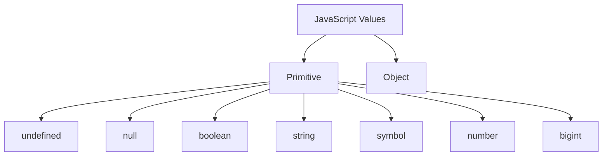

# 🧮 Chapter 19: Variables, Data Types and Operators


> [!TIP]
> **Chapter Goal:** JavaScript me data ko variables me store karna, types ko correctly understand/convert karna aur operators se calculations aur comparisons perform karna.

---

## 🎯 19.1 Learning Objectives

After completing this chapter, you will be able to:

1. Declare variables using `let`, `const` and `var`.
2. Differentiate declaration, initialization and assignment.
3. Explain block, function and global scope.
4. Understand hoisting and the temporal dead zone at a beginner level.
5. Identify JavaScript primitive and object types.
6. Use `typeof` and recognize its important quirks.
7. Convert values explicitly using Number, String and Boolean.
8. Explain implicit type coercion.
9. Use arithmetic, assignment and comparison operators.
10. Use logical, nullish and conditional operators.
11. Understand operator precedence and short-circuit evaluation.
12. Create a marks-calculator program.

---

## 🗣️ 19.2 Difficult Words: Pronunciation and Meaning

| 🔤 Word | 🔊 Pronunciation | 💡 Simple Meaning |
|---|---|---|
| Variable | वेरिएबल — *vair-ee-uh-bul* | Named data storage/binding |
| Declaration | डेक्लेरेशन — *dek-luh-ray-shun* | Variable name create karna |
| Initialization | इनिशियलाइजेशन — *i-nish-uh-lai-zay-shun* | First value dena |
| Assignment | असाइनमेंट — *uh-sain-ment* | Value set/change karna |
| Constant | कॉन्स्टन्ट — *kon-stunt* | Reassignment na hone wala binding |
| Scope | स्कोप — *skohp* | Name accessible hone ka region |
| Hoisting | होइस्टिंग — *hoi-sting* | Declaration processing behavior |
| Temporal | टेम्पोरल — *tem-puh-rul* | Time/order se related |
| Primitive | प्रिमिटिव — *prim-i-tiv* | Basic non-object value |
| Coercion | कोअर्शन — *koh-ur-shun* | Automatic type conversion |
| Operator | ऑपरेटर — *op-uh-ray-ter* | Values par operation karne wala symbol |
| Operand | ऑपरेन्ड — *op-uh-rand* | Operator jis value par work kare |
| Precedence | प्रेसीडन्स — *pres-i-duns* | Operation priority order |
| Associativity | असोसिएटिविटी — *uh-soh-see-uh-tiv-i-tee* | Same priority operations ki grouping direction |
| Short-Circuit | शॉर्ट सर्किट — *short sur-kit* | Result clear hote hi evaluation stop |

---

# 🟦 Part A: Variables

## 💡 19.3 What Is a Variable?

A variable is a named binding used to refer to a value.

```javascript
const studentName = "Broun";
let totalMarks = 450;
```

### Hinglish Explanation

Variable data ko meaningful naam ke through access karne deta hai. Program me same value ko use, update ya calculate karna easy ho jata hai.

---

## 🧱 19.4 Declaration, Initialization and Assignment

### Declaration

```javascript
let course;
```

### Initialization

```javascript
let course = "BCA";
```

### Assignment/Reassignment

```javascript
course = "MCA";
```

`const` must be initialized during declaration:

```javascript
const college = "ABC College";
```

Incorrect:

```javascript
const college;
```

---

## 🔑 19.5 `let`

```javascript
let score = 50;
score = 75;
```

Features:

- Block-scoped
- Reassignment allowed
- Same scope me redeclaration not allowed
- Declaration se pehle TDZ restrictions

Use when binding's value later change karni hai.

---

## 🔒 19.6 `const`

```javascript
const course = "BCA";
```

Reassignment not allowed:

```javascript
course = "MCA"; // TypeError
```

Use by default when reassignment needed nahi hai.

### Important: Object Can Still Mutate

```javascript
const student = {
    name: "Broun"
};

student.name = "Aman"; // Allowed
```

But binding reassignment not allowed:

```javascript
student = {}; // TypeError
```

> [!IMPORTANT]
> `const` binding ko reassign hone se rokta hai; object ko automatically immutable nahi banata.

---

## 🕰️ 19.7 `var`

```javascript
var oldStyleVariable = "value";
```

Features:

- Function-scoped rather than block-scoped
- Same scope redeclaration allowed
- Hoisted and initialized with `undefined`
- Global-script behavior can differ from `let`/`const`

Modern code:

- Prefer `const` by default.
- Use `let` when reassignment needed.
- `var` mainly legacy code understanding ke liye.

---

## ⚖️ 19.8 `let` vs `const` vs `var`

| Feature | `let` | `const` | `var` |
|---|---:|---:|---:|
| Block scope | Yes | Yes | No |
| Reassignment | Yes | No | Yes |
| Same-scope redeclaration | No | No | Yes |
| Must initialize immediately | No | Yes | No |
| TDZ before declaration | Yes | Yes | No |
| Modern recommendation | When changing | Default choice | Avoid in new code |

---

## 🏷️ 19.9 Variable Naming Rules

Valid:

```javascript
const studentName = "Broun";
const _score = 85;
const $price = 500;
const semester2 = "Second";
```

Invalid:

```javascript
const 2semester = "Second";
const student-name = "Broun";
const class = "BCA";
```

Basic rules:

1. Letter, underscore or dollar sign se start.
2. Later digits allowed.
3. Hyphen not allowed in identifier.
4. Spaces not allowed.
5. Reserved words not allowed.
6. Case-sensitive.

---

## ✍️ 19.10 Naming Conventions

### camelCase

```javascript
const studentName = "Broun";
let totalMarks = 0;
```

Common for variables/functions.

### PascalCase

```javascript
class StudentProfile {}
```

Common for classes/constructors.

### UPPER_SNAKE_CASE

```javascript
const MAX_LOGIN_ATTEMPTS = 5;
```

Common for fixed configuration constants by project convention.

### Good Names

```javascript
const courseFee = 25000;
const isRegistered = true;
```

Poor:

```javascript
const x = 25000;
const flag = true;
```

Unless context makes meaning clear.

---

# 🟩 Part B: Scope and Hoisting

## 🌍 19.11 Global Scope

Top-level script binding broader script/program context me available ho sakti hai.

```javascript
const collegeName = "ABC College";

function showCollege() {
    console.log(collegeName);
}
```

Excess global bindings:

- Name conflicts
- Hard testing
- Accidental changes
- Tight coupling

Modules global pollution reduce karte hain.

---

## 📦 19.12 Block Scope

`let` and `const` block-scoped hain.

```javascript
{
    const subject = "JavaScript";
    let score = 90;

    console.log(subject);
}

console.log(subject); // ReferenceError
```

Blocks include:

- `if`
- `for`
- `while`
- Standalone braces
- Function body

---

## ⚙️ 19.13 Function Scope

`var` function-scoped hai.

```javascript
function example() {
    if (true) {
        var message = "Hello";
    }

    console.log(message); // Available inside function
}
```

Outside function unavailable.

---

## ⬆️ 19.14 Hoisting

Hoisting is a common explanatory term for how declarations are processed before code execution in their scope.

### `var` Example

```javascript
console.log(score); // undefined
var score = 80;
```

Conceptually similar for learning:

```javascript
var score;
console.log(score);
score = 80;
```

### Function Declaration

```javascript
greet();

function greet() {
    console.log("Hello");
}
```

Function declarations can be called earlier in their scope under normal rules.

> [!NOTE]
> “Code physically moves upward” exact implementation description nahi hai. It is a learning model for declaration-instantiation behavior.

---

## ⏳ 19.15 Temporal Dead Zone

`let` and `const` binding block start se exist karti hain, but declaration initialization se before access prohibited hota hai.

```javascript
console.log(course); // ReferenceError
const course = "BCA";
```

This region is called Temporal Dead Zone (TDZ).

Best practice: variable ko use karne se pehle declare karein.

---

## 🌑 19.16 Shadowing

Inner scope same name declare kar sakti hai:

```javascript
const course = "BCA";

{
    const course = "MCA";
    console.log(course); // MCA
}

console.log(course); // BCA
```

Excessive shadowing confusion create kar sakti hai.

---

# 🟨 Part C: JavaScript Data Types

## 💡 19.17 Dynamic Typing

JavaScript dynamically typed hai. Binding different type values receive kar sakti hai if reassignable.

```javascript
let value = 10;
value = "Ten";
value = true;
```

Type value ka property hai, variable declaration ka fixed annotation nahi in plain JavaScript.

> [!TIP]
> Dynamic typing flexibility deta hai, but clear names and consistent data shapes important hain.

---

## 🧱 19.18 ECMAScript Language Types

JavaScript language types:

### Primitive Types

1. Undefined
2. Null
3. Boolean
4. String
5. Symbol
6. Number
7. BigInt

### Object Type

8. Object



---

## ❓ 19.19 Undefined

Declared but uninitialized variable:

```javascript
let result;
console.log(result); // undefined
```

`undefined` often means value not assigned/present.

---

## ⭕ 19.20 Null

```javascript
const selectedCourse = null;
```

`null` intentional absence of an object/value ko represent karne ke liye commonly use hota hai.

> [!NOTE]
> `undefined` and `null` both absence-like values hain but different values and meanings.

---

## ✅ 19.21 Boolean

```javascript
const isLoggedIn = true;
const hasPaidFee = false;
```

Only two boolean values:

- `true`
- `false`

---

## 🔤 19.22 String

```javascript
const firstName = "Broun";
const course = 'BCA';
const message = `Welcome, ${firstName}!`;
```

The last line uses template literal backticks after placeholder replacement in final file.

Escapes:

```javascript
const quote = "He said, \"Hello\".";
const lineBreak = "First line\nSecond line";
```

Template literal:

```javascript
const studentName = "Broun";
const greeting = `Hello, ${studentName}!`;
```

Supports:

- Interpolation
- Multi-line strings
- Expressions

---

## 🔢 19.23 Number

```javascript
const age = 20;
const percentage = 87.5;
const negative = -10;
```

Number type includes:

- Integers
- Floating-point values
- `NaN`
- `Infinity`
- `-Infinity`

### Floating-Point Precision

```javascript
console.log(0.1 + 0.2); // 0.30000000000000004
```

Binary floating-point representation ki wajah se.

For money:

- Smallest units (paise/cents) integers me store karna
- Proper decimal library
- Domain-specific rounding

---

## 🚫 19.24 NaN

NaN means **Not-a-Number**, but its JavaScript type is number.

```javascript
const result = Number("hello");

console.log(result); // NaN
console.log(typeof result); // "number"
```

Reliable check:

```javascript
Number.isNaN(result);
```

```javascript
console.log(NaN === NaN); // false
```

---

## ♾️ 19.25 Infinity

```javascript
console.log(1 / 0);  // Infinity
console.log(-1 / 0); // -Infinity
```

Use `Number.isFinite()` to check finite numeric value.

---

## 🔢 19.26 BigInt

Large integers beyond safe Number integer range:

```javascript
const largeValue = 9007199254740993n;
```

BigInt literal ends with `n`.

Cannot directly mix Number and BigInt in arithmetic:

```javascript
1n + 1; // TypeError
```

Convert intentionally and consider precision.

BigInt not for decimal/fraction values.

---

## 🔣 19.27 Symbol

```javascript
const id = Symbol("id");
```

Symbols are unique primitive values often used as object property keys.

```javascript
const first = Symbol("id");
const second = Symbol("id");

console.log(first === second); // false
```

Advanced object usage later.

---

## 📦 19.28 Object

Objects store collections of properties and other structured behavior/data.

```javascript
const student = {
    name: "Broun",
    course: "BCA",
    semester: 1
};
```

Arrays and functions are objects in important JavaScript classification senses:

```javascript
const subjects = ["HTML", "CSS", "JavaScript"];

function greet() {
    return "Hello";
}
```

Objects, arrays and functions later chapters me detail se.

---

## 🔍 19.29 `typeof` Operator

```javascript
typeof 42;              // "number"
typeof "BCA";           // "string"
typeof true;            // "boolean"
typeof undefined;       // "undefined"
typeof 10n;             // "bigint"
typeof Symbol("id");    // "symbol"
typeof {};              // "object"
typeof [];              // "object"
typeof function () {};  // "function"
```

Important historical quirk:

```javascript
typeof null; // "object"
```

To check array:

```javascript
Array.isArray([]);
```

To check null:

```javascript
value === null;
```

---

## 🧬 19.30 Primitive vs Object Behavior

Primitive values are immutable.

```javascript
let text = "hello";
text[0] = "H";

console.log(text); // "hello"
```

Object properties can mutate:

```javascript
const student = {
    name: "Broun"
};

student.name = "Aman";
```

Assignment difference:

```javascript
let firstNumber = 10;
let secondNumber = firstNumber;
secondNumber = 20;

console.log(firstNumber); // 10
```

Object references:

```javascript
const firstStudent = { name: "Broun" };
const secondStudent = firstStudent;

secondStudent.name = "Aman";

console.log(firstStudent.name); // Aman
```

Both bindings reference same object.

---

# 🟪 Part D: Type Conversion

## 🔄 19.31 Explicit Conversion

Developer intentionally convert karta hai.

### To String

```javascript
String(100);       // "100"
String(true);      // "true"
```

### To Number

```javascript
Number("100");     // 100
Number("3.14");    // 3.14
Number("");        // 0
Number("hello");   // NaN
```

### To Boolean

```javascript
Boolean(1);        // true
Boolean(0);        // false
Boolean("");       // false
Boolean("hello");  // true
```

---

## 🔢 19.32 Parsing Numbers

```javascript
Number.parseInt("42px", 10);    // 42
Number.parseFloat("3.14rem");   // 3.14
```

But:

```javascript
Number("42px"); // NaN
```

> [!CAUTION]
> Parsing partial strings can accept trailing characters. Input format validate karein.

Always radix with parseInt where clarity matters:

```javascript
Number.parseInt("101", 10);
```

---

## 🪄 19.33 Implicit Coercion

JavaScript operator/context ke according automatically conversion kar sakti hai.

```javascript
"5" + 2; // "52"
"5" - 2; // 3
```

Why:

- Plus supports string concatenation.
- Minus numeric conversion expect karta hai.

> [!WARNING]
> Implicit coercion surprising results create kar sakti hai. Input values explicitly convert karein.

---

## 🧾 19.34 Form Values Are Strings

```javascript
const first = document.querySelector("#first-number").value;
const second = document.querySelector("#second-number").value;

console.log(first + second);
```

If values “10” and “20”, result may be “1020”.

Correct numeric conversion:

```javascript
const firstNumber = Number(first);
const secondNumber = Number(second);

console.log(firstNumber + secondNumber); // 30
```

---

## ✅ 19.35 Truthy and Falsy Values

Boolean context me values convert hoti hain.

Common falsy values:

- `false`
- `0`
- `-0`
- `0n`
- `""`
- `null`
- `undefined`
- `NaN`

Most other values truthy, including:

- `"0"`
- `"false"`
- `[]`
- `{}`

Example:

```javascript
Boolean("false"); // true
Boolean([]);      // true
```

---

# 🟥 Part E: Arithmetic Operators

## ➕ 19.36 Basic Arithmetic

```javascript
const a = 10;
const b = 3;

a + b; // 13
a - b; // 7
a * b; // 30
a / b; // 3.333...
a % b; // 1
a ** b; // 1000
```

| Operator | Work |
|---|---|
| `+` | Addition/concatenation |
| `-` | Subtraction |
| `*` | Multiplication |
| `/` | Division |
| `%` | Remainder |
| `**` | Exponentiation |

---

## ➕ 19.37 Unary Plus and Minus

```javascript
+"42"; // 42
-10;   // -10
```

For clarity, `Number("42")` often more explicit.

---

## ⬆️ 19.38 Increment and Decrement

```javascript
let count = 5;

count++;
count--;
```

Prefix vs postfix:

```javascript
let a = 5;
const b = a++; // b = 5, a = 6

let x = 5;
const y = ++x; // x = 6, y = 6
```

> [!TIP]
> Complex expressions me increment side effects avoid karein. Separate statement clarity improve karta hai.

---

# 🟧 Part F: Assignment Operators

## 📝 19.39 Simple Assignment

```javascript
let score = 80;
```

---

## ➕ 19.40 Compound Assignment

```javascript
let total = 100;

total += 20; // 120
total -= 10; // 110
total *= 2;  // 220
total /= 4;  // 55
total %= 6;  // 1
total **= 2; // 1
```

Equivalent idea:

```javascript
total = total + 20;
```

---

## ❓ 19.41 Logical Assignment

```javascript
let name = "";
name ||= "Guest";
```

`||=` assigns when left side falsy.

```javascript
let attempts = 0;
attempts ??= 3;
```

`??=` assigns only when left side nullish (`null` or `undefined`).

```javascript
let enabled = true;
enabled &&= false;
```

`&&=` assigns if left side truthy.

---

# 🟫 Part G: Comparison Operators

## ⚖️ 19.42 Relational Comparison

```javascript
10 > 5;   // true
10 < 5;   // false
10 >= 10; // true
5 <= 4;   // false
```

Strings can be compared lexicographically based on code-unit ordering:

```javascript
"apple" < "banana"; // true
```

Human-language sorting ke liye locale-aware APIs more suitable ho sakti hain.

---

## 🟰 19.43 Strict Equality

```javascript
5 === 5;   // true
5 === "5"; // false
```

Strict inequality:

```javascript
5 !== "5"; // true
```

Strict equality coercion nahi karti.

---

## ⚠️ 19.44 Loose Equality

```javascript
5 == "5"; // true
```

Loose equality conversion rules apply karti hai.

Surprising examples:

```javascript
0 == false;  // true
"" == false; // true
```

> [!IMPORTANT]
> Beginner and most application code me `===` and `!==` prefer karein unless loose equality behavior intentionally understood hai.

---

## 🧩 19.45 Object Equality

```javascript
{} === {}; // false
[] === []; // false
```

Different objects have different identities.

```javascript
const first = {};
const second = first;

first === second; // true
```

---

## 🔍 19.46 `Object.is()`

```javascript
Object.is(NaN, NaN); // true
Object.is(0, -0);    // false
```

`===` se mostly similar but special numeric cases differ.

---

# 🟦 Part H: Logical and Modern Operators

## ✅ 19.47 Logical AND

```javascript
const canAccess = isLoggedIn && hasPaidFee;
```

Returns first falsy operand, otherwise last operand.

```javascript
"Hello" && 42; // 42
0 && "Hello";  // 0
```

---

## 🔀 19.48 Logical OR

```javascript
const displayName = userName || "Guest";
```

Returns first truthy operand, otherwise last operand.

Problem when valid falsy value should be preserved:

```javascript
const count = 0;
const result = count || 10; // 10
```

---

## ❔ 19.49 Nullish Coalescing

```javascript
const result = count ?? 10;
```

Fallback only when left side:

- `null`
- `undefined`

```javascript
0 ?? 10;  // 0
"" ?? "Default"; // ""
null ?? 10; // 10
```

---

## 🚫 19.50 Logical NOT

```javascript
!true;  // false
!false; // true
```

Convert to boolean:

```javascript
!!"hello"; // true
!!0;       // false
```

`Boolean(value)` often clearer.

---

## 🔗 19.51 Short-Circuit Evaluation

```javascript
isLoggedIn && showDashboard();
```

If `isLoggedIn` falsy, function call evaluate nahi hota.

```javascript
cachedValue || loadValue();
```

If cached value truthy, load function call nahi hoti.

Short-circuit expressions values return karte hain, only booleans nahi.

---

## 🔒 19.52 Optional Chaining

```javascript
const city = student.address?.city;
```

If address nullish, result `undefined` instead of immediate property-access error.

Method:

```javascript
student.printProfile?.();
```

Array:

```javascript
const firstSubject = subjects?.[0];
```

> [!CAUTION]
> Optional chaining every missing-data bug hide karne ke liye use na karein. Required data validate karein.

---

## ❓ 19.53 Conditional Operator

```javascript
const result = score >= 40 ? "Pass" : "Fail";
```

Syntax:

```text
condition ? valueIfTrue : valueIfFalse
```

Good for simple value selection. Complex nested ternaries avoid karein.

---

## 🧾 19.54 Comma Operator Note

```javascript
const value = (1, 2, 3); // 3
```

Evaluates operands left to right and returns last value. Normal beginner application code me rarely needed; confusing use avoid karein.

---

## 🔣 19.55 Bitwise Operators Introduction

Operators:

- `&`
- `|`
- `^`
- `~`
- `<<`
- `>>`
- `>>>`

Example:

```javascript
5 & 1; // 1
```

They operate on integer bit representations under JavaScript conversion rules. Common web beginner code me less frequent. Logical `&&` and `||` se confuse na karein.

---

# 🟩 Part I: Operator Precedence

## 📊 19.56 Precedence

```javascript
const result = 2 + 3 * 4;
```

Multiplication first:

```text
2 + 12 = 14
```

Parentheses:

```javascript
const result = (2 + 3) * 4; // 20
```

> [!TIP]
> Even when precedence known ho, parentheses intention clear banati hain.

---

## ↔️ 19.57 Associativity

Same-precedence operators ka grouping direction.

Subtraction left-to-right:

```javascript
10 - 5 - 2; // (10 - 5) - 2 = 3
```

Exponentiation right-to-left:

```javascript
2 ** 3 ** 2; // 2 ** (3 ** 2) = 512
```

Assignment right-to-left:

```javascript
let a;
let b;

a = b = 10;
```

---

## 🧠 19.58 Simplified Precedence Order

High to lower, simplified:

1. Grouping `()`
2. Property access/call
3. Unary operators
4. Exponentiation
5. Multiplication/division/remainder
6. Addition/subtraction
7. Relational comparisons
8. Equality
9. Logical AND
10. Logical OR / nullish (mixing restrictions apply)
11. Conditional
12. Assignment

Use official reference for complete table.

> [!WARNING]
> `??` ko `&&` or `||` ke saath bina parentheses directly mix karna syntax restriction produce kar sakta hai.

Correct:

```javascript
const value = (storedValue ?? defaultValue) || fallback;
```

---

# 🟪 Part J: Complete Marks Calculator

## 🧪 19.59 HTML

```html
<!DOCTYPE html>
<html lang="en">
<head>
    <meta charset="UTF-8">
    <meta name="viewport" content="width=device-width, initial-scale=1.0">
    <title>BCA Marks Calculator</title>
    <link rel="stylesheet" href="css/styles.css">
    <script src="js/calculator.js" defer></script>
</head>
<body>
    <main class="calculator">
        <h1>BCA Marks Calculator</h1>

        <div class="form-field">
            <label for="html-marks">HTML Marks (0–100)</label>
            <input
                type="number"
                id="html-marks"
                min="0"
                max="100"
                required>
        </div>

        <div class="form-field">
            <label for="css-marks">CSS Marks (0–100)</label>
            <input
                type="number"
                id="css-marks"
                min="0"
                max="100"
                required>
        </div>

        <div class="form-field">
            <label for="js-marks">JavaScript Marks (0–100)</label>
            <input
                type="number"
                id="js-marks"
                min="0"
                max="100"
                required>
        </div>

        <button id="calculate-button" type="button">
            Calculate Result
        </button>

        <section class="result" aria-live="polite">
            <h2>Result</h2>
            <p id="result-output">
                Enter marks and press Calculate Result.
            </p>
        </section>
    </main>
</body>
</html>
```

---

## ⚡ 19.60 JavaScript

```javascript
"use strict";

const htmlInput = document.querySelector("#html-marks");
const cssInput = document.querySelector("#css-marks");
const jsInput = document.querySelector("#js-marks");
const calculateButton = document.querySelector("#calculate-button");
const output = document.querySelector("#result-output");

const totalSubjects = 3;
const maximumPerSubject = 100;
const maximumTotal = totalSubjects * maximumPerSubject;

calculateButton.addEventListener("click", () => {
    const htmlMarks = Number(htmlInput.value);
    const cssMarks = Number(cssInput.value);
    const jsMarks = Number(jsInput.value);

    const total = htmlMarks + cssMarks + jsMarks;
    const percentage = (total / maximumTotal) * 100;
    const roundedPercentage = percentage.toFixed(2);

    const allValuesEntered =
        htmlInput.value !== "" &&
        cssInput.value !== "" &&
        jsInput.value !== "";

    const valuesInRange =
        htmlMarks >= 0 &&
        htmlMarks <= maximumPerSubject &&
        cssMarks >= 0 &&
        cssMarks <= maximumPerSubject &&
        jsMarks >= 0 &&
        jsMarks <= maximumPerSubject;

    const message =
        allValuesEntered && valuesInRange
            ? `Total: ${total}/${maximumTotal} | Percentage: ${roundedPercentage}%`
            : "Please enter marks from 0 to 100 for every subject.";

    output.textContent = message;
});
```

---

## 🧠 19.61 Program Explanation

1. DOM elements stored in `const` bindings.
2. Maximum values declared as constants.
3. Input `value` strings explicitly converted with `Number()`.
4. Addition calculates total.
5. Division and multiplication calculate percentage.
6. `toFixed(2)` returns formatted string.
7. Strict comparisons validate empty values.
8. Logical AND combines conditions.
9. Conditional operator selects output message.
10. Template literal builds result.
11. `textContent` safely writes text.

> [!NOTE]
> Conditions/functions/DOM later chapters me deeper coverage. Project chapter ke operators ko real use me show karta hai.

---

## 🧪 19.62 Practice Changes

1. Add fourth subject.
2. Change maximum marks.
3. Calculate average.
4. Add student name.
5. Test empty string conversion.
6. Test decimal marks.
7. Show types using `typeof`.
8. Replace `||` fallback with `??` and compare.
9. Test strict and loose equality in console.
10. Create an object and observe reference assignment.
11. Display grade later using conditions.
12. Validate `NaN` using `Number.isNaN()`.

---

## 🚫 19.63 Common Mistakes

1. `const` object ko fully immutable samajhna.
2. `var` block-scoped samajhna.
3. Variable before declaration use karna.
4. Identifier case mismatch.
5. Form values ko number convert na karna.
6. `+` se accidental concatenation.
7. `==` and `===` confuse karna.
8. `typeof null` result par blindly trust.
9. Array check with only `typeof`.
10. `NaN === NaN` expect true.
11. Number and BigInt mix karna.
12. `||` se valid zero/empty value replace karna.
13. Complex nested ternaries.
14. Operator precedence assume karna.
15. Object copy samajhkar same reference mutate karna.
16. Floating-point currency calculations without strategy.

---

## 📌 19.64 Key Points to Remember

- `const` default choice; `let` for reassignment.
- `var` function-scoped legacy declaration hai.
- `let` and `const` block-scoped hain.
- TDZ declaration se before access prohibit karta hai.
- JavaScript dynamically typed hai.
- Seven primitive types and one Object type category hai.
- `typeof null` historical `"object"` result deta hai.
- Form values strings hoti hain.
- Explicit conversion surprises reduce karti hai.
- `===` and `!==` generally preferred.
- `||` falsy fallback; `??` nullish fallback.
- Logical operators short-circuit karte hain.
- Optional chaining nullish access errors reduce karti hai.
- Parentheses operator intent clear karti hain.

---

## 📝 19.65 Chapter Summary

Variables are named bindings declared with `let`, `const` or legacy `var`. `const` prevents reassignment, while `let` allows it; both are block-scoped and have temporal dead zones. JavaScript values include seven primitive types—Undefined, Null, Boolean, String, Symbol, Number and BigInt—and the Object type. JavaScript is dynamically typed and may perform implicit coercion, so explicit conversion is often safer. Operators perform arithmetic, assignment, comparison, logical selection, nullish fallback and conditional value selection. Strict equality avoids coercion. Logical operators return operand values and short-circuit. Operator precedence and associativity determine grouping, while parentheses improve clarity.

---

## 🎲 19.66 Multiple-Choice Questions

### 1. Which declaration is preferred when reassignment is not needed?

A. `var`  
B. `const`  
C. `dynamic`  
D. `fixed`  

**✅ Answer:** B

### 2. Which declaration is block-scoped and reassignable?

A. `let`  
B. `var` only  
C. `const`  
D. `value`  

**✅ Answer:** A

### 3. How many primitive language types are listed?

A. Five  
B. Six  
C. Seven  
D. Nine  

**✅ Answer:** C

### 4. What is `typeof null`?

A. `"null"`  
B. `"object"`  
C. `"undefined"`  
D. `"boolean"`  

**✅ Answer:** B

### 5. Which checks an array?

A. `typeof value === "array"`  
B. `Array.isArray(value)`  
C. `value.isArray`  
D. `Number.isArray(value)`  

**✅ Answer:** B

### 6. Which equality avoids coercion?

A. `==`  
B. `===`  
C. `=`  
D. `!=` only  

**✅ Answer:** B

### 7. Which operator provides null/undefined fallback?

A. `||` only  
B. `??`  
C. `&&`  
D. `**`  

**✅ Answer:** B

### 8. Which operator calculates remainder?

A. `/`  
B. `%`  
C. `**`  
D. `+`  

**✅ Answer:** B

### 9. Which operator performs exponentiation?

A. `^`  
B. `**`  
C. `^^`  
D. `exp`  

**✅ Answer:** B

### 10. Form input values are normally read as:

A. Strings  
B. BigInts  
C. Symbols  
D. Arrays  

**✅ Answer:** A

---

## ✍️ 19.67 Fill in the Blanks

1. A reassignable block-scoped binding uses __________.
2. An uninitialized variable commonly has value __________.
3. Automatic type conversion is called __________.
4. Strict equality uses __________.
5. A BigInt literal may end with __________.

<details>
<summary><strong>✅ View Answers</strong></summary>

1. `let`  
2. `undefined`  
3. coercion  
4. `===`  
5. `n`

</details>

---

## ✅ 19.68 True or False

1. `const` makes every object deeply immutable.
2. `let` is block-scoped.
3. `var` is block-scoped.
4. JavaScript is dynamically typed.
5. `typeof []` returns `"array"`.
6. `NaN === NaN` is true.
7. `5 === "5"` is false.
8. `"5" + 2` may produce `"52"`.
9. `??` replaces zero with a fallback.
10. Objects may share the same reference.

<details>
<summary><strong>✅ View Answers</strong></summary>

1. False  
2. True  
3. False  
4. True  
5. False  
6. False  
7. True  
8. True  
9. False  
10. True

</details>

---

## ❓ 19.69 Short-Answer Questions

1. Define variable.
2. Differentiate declaration, initialization and assignment.
3. Compare `let`, `const` and `var`.
4. What is block scope?
5. What is hoisting?
6. Define the temporal dead zone.
7. List JavaScript primitive types.
8. Differentiate undefined and null.
9. Explain Number, BigInt and NaN.
10. What is dynamic typing?
11. Explain explicit and implicit conversion.
12. What are truthy and falsy values?
13. Differentiate `==` and `===`.
14. Differentiate `||` and `??`.
15. What is optional chaining?

---

## 📚 19.70 Long-Answer and Exam Questions

1. Explain JavaScript variable declarations with examples.
2. Explain scope, hoisting and temporal dead zone.
3. Describe all JavaScript data types.
4. Explain primitive and object assignment behavior.
5. Explain `typeof` and its special cases.
6. Discuss explicit conversion and implicit coercion.
7. Explain arithmetic and assignment operators.
8. Explain comparison and equality operators.
9. Discuss logical, nullish and optional-chaining operators.
10. Explain precedence and associativity.
11. Explain truthy and falsy values.
12. Create and explain a marks calculator.

---

## 🧪 19.71 Practical Exercises

1. Declare values using let and const.
2. Test block scope.
3. Observe var function scope.
4. Produce a TDZ reference error.
5. Use typeof on all primitive types.
6. Check arrays and null correctly.
7. Convert strings to numbers.
8. Compare Number and parseInt.
9. Test arithmetic operators.
10. Compare strict and loose equality.
11. List all falsy values in Console.
12. Compare `||` and `??` with zero.
13. Use optional chaining on nested objects.
14. Test precedence with and without parentheses.
15. Build the marks calculator.
16. Add average and a fourth subject.

---

## 🎤 19.72 Viva Questions

1. What is a variable?
2. Which keyword allows reassignment?
3. Which keyword is preferred by default?
4. Is const object immutable?
5. What is scope?
6. What is TDZ?
7. Name seven primitive types.
8. What is typeof null?
9. How do you check an array?
10. What is NaN?
11. What is type coercion?
12. Which equality is preferred?
13. What is the difference between OR and nullish coalescing?
14. What is short-circuit evaluation?
15. What does optional chaining do?

<details>
<summary><strong>✅ View Short Viva Answers</strong></summary>

1. A named binding to a value.  
2. `let`.  
3. `const`.  
4. No, only its binding cannot be reassigned.  
5. Region where a name is accessible.  
6. Pre-declaration access-restricted region for let/const.  
7. Undefined, Null, Boolean, String, Symbol, Number, BigInt.  
8. `"object"`.  
9. `Array.isArray()`.  
10. A special Number value meaning not-a-number result.  
11. Automatic type conversion.  
12. `===`.  
13. OR uses falsiness; nullish uses null/undefined.  
14. Stopping evaluation once result is determined.  
15. Safely accesses through a nullish reference.

</details>

---

## 🏁 19.73 One-Minute Revision

| Question | Quick Answer |
|---|---|
| Default binding? | `const` |
| Reassignable? | `let` |
| Legacy declaration? | `var` |
| Seven basics? | Primitive types |
| Structured type? | Object |
| No assigned value? | `undefined` |
| Intentional absence? | `null` |
| Invalid numeric result? | `NaN` |
| Large integer? | BigInt |
| Type check? | `typeof` |
| Array check? | `Array.isArray()` |
| Strict equality? | `===` |
| Falsy fallback? | `||` |
| Nullish fallback? | `??` |
| Safe property access? | `?.` |

---

## 📚 19.74 Official References

1. [TC39 ECMAScript — Data Types and Values](https://tc39.es/ecma262/multipage/ecmascript-data-types-and-values.html)
2. [TC39 ECMAScript — Expressions](https://tc39.es/ecma262/multipage/ecmascript-language-expressions.html)
3. [MDN JavaScript Grammar and Types](https://developer.mozilla.org/docs/Web/JavaScript/Guide/Grammar_and_types)
4. [MDN Expressions and Operators](https://developer.mozilla.org/docs/Web/JavaScript/Guide/Expressions_and_operators)

---

[⬅️ Previous Chapter](18-javascript-fundamentals.md) · [📚 Table of Contents](../SUMMARY.md) · **Next: Conditions, Loops and Functions ➡️**
