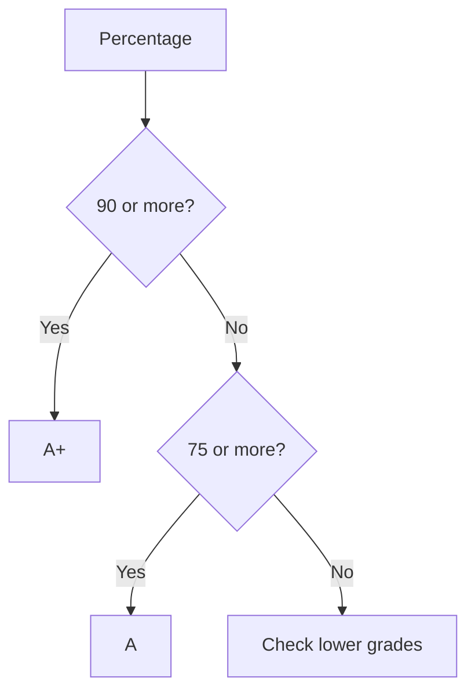
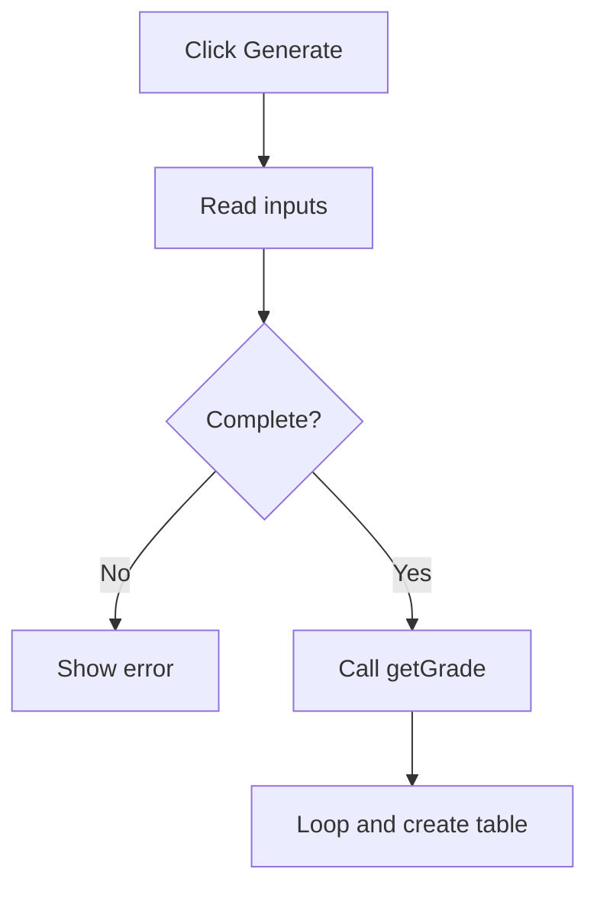

# 🔀 Chapter 20: Conditions, Loops and Functions


> [!TIP]
> **Chapter Goal:** JavaScript me decisions lena, repeated tasks automate karna aur reusable functions banana.

---

## 🎯 20.1 Learning Objectives

Is chapter ke baad aap:

- `if`, `else if`, `else` aur `switch` use kar payenge.
- `for`, `while` aur `do...while` loops likh payenge.
- `break`, `continue` aur nested loops samjhenge.
- Functions declare/call karenge.
- Parameters, arguments, return values aur scope explain karenge.
- Function expressions, arrow functions, callbacks aur recursion ka introduction samjhenge.
- Grade aur multiplication-table generator banayenge.

---

## 🗣️ 20.2 Difficult Words

| Word | Pronunciation | Simple Meaning |
|---|---|---|
| Condition | कंडीशन — *kun-di-shun* | True/false test |
| Iteration | इटरेशन — *it-uh-ray-shun* | Loop ka ek cycle |
| Infinite | इनफिनिट — *in-fi-nit* | Jiska end na ho |
| Function | फंक्शन — *funk-shun* | Reusable code block |
| Parameter | पैरामीटर — *puh-ram-i-ter* | Function definition ka input name |
| Argument | आर्ग्युमेंट — *aar-gyu-ment* | Function call ki actual value |
| Return | रिटर्न — *ri-turn* | Function se result bhejna |
| Callback | कॉलबैक — *kawl-bak* | Dusre function ko diya gaya function |
| Recursion | रिकर्शन — *ri-kur-zhun* | Function ka khud ko call karna |

---

# 🟦 Part A: Conditions

## 20.3 `if` Statement

```javascript
const marks = 72;

if (marks >= 40) {
    console.log("Pass");
}
```

Condition truthy hone par braces ka code run hota hai.

## 20.4 `if...else`

```javascript
const isLoggedIn = false;

if (isLoggedIn) {
    console.log("Welcome!");
} else {
    console.log("Please log in.");
}
```

Dono me se sirf ek branch run hoti hai.

## 20.5 `else if` Ladder

```javascript
const percentage = 78;

if (percentage >= 90) {
    console.log("Grade A+");
} else if (percentage >= 75) {
    console.log("Grade A");
} else if (percentage >= 60) {
    console.log("Grade B");
} else if (percentage >= 40) {
    console.log("Grade C");
} else {
    console.log("Fail");
}
```

> [!IMPORTANT]
> Highest/specific range pehle check karein. Wrong order se wrong grade aa sakta hai.



## 20.6 Nested and Logical Conditions

```javascript
const marks = 70;
const attendance = 80;

if (marks >= 40 && attendance >= 75) {
    console.log("Eligible");
} else {
    console.log("Not eligible");
}
```

- `&&`: dono conditions truthy
- `||`: koi ek condition truthy
- `!`: Boolean meaning reverse

Deep nesting ko helper functions se simplify karein.

## 20.7 `switch` Statement

```javascript
const day = 2;

switch (day) {
    case 1:
        console.log("Monday");
        break;
    case 2:
        console.log("Tuesday");
        break;
    case 3:
        console.log("Wednesday");
        break;
    default:
        console.log("Invalid day");
}
```

`switch` strict equality se match karta hai. `break` na ho to next case bhi run ho sakta hai—ise fall-through kehte hain.

| Use `if...else` | Use `switch` |
|---|---|
| Ranges and complex rules | One value, fixed choices |
| Different expressions | Menu, role, weekday |
| Logical combinations | Clear case labels |

## 20.8 Conditional Operator

```javascript
const result = marks >= 40 ? "Pass" : "Fail";
```

Simple value selection ke liye useful; difficult nested ternaries avoid karein.

---

# 🟩 Part B: Loops

## 20.9 `for` Loop

```javascript
for (let count = 1; count <= 5; count++) {
    console.log(`Count: ${count}`);
}
```

Order:

1. Initialization once
2. Condition check
3. Body execution
4. Update
5. Repeat

### Sum Example

```javascript
let total = 0;

for (let number = 1; number <= 10; number++) {
    total += number;
}

console.log(total); // 55
```

### Multiplication Table

```javascript
const tableOf = 7;

for (let multiplier = 1; multiplier <= 10; multiplier++) {
    console.log(
        `${tableOf} × ${multiplier} = ${tableOf * multiplier}`
    );
}
```

## 20.10 `while` Loop

```javascript
let count = 1;

while (count <= 5) {
    console.log(count);
    count++;
}
```

Exact repetition count unknown ho, but continuing condition clear ho, tab useful hai.

## 20.11 `do...while` Loop

```javascript
let count = 1;

do {
    console.log(count);
    count++;
} while (count <= 5);
```

Condition baad me check hoti hai, isliye body at least once run hoti hai.

## 20.12 `break` and `continue`

```javascript
for (let number = 1; number <= 10; number++) {
    if (number === 6) break;
    console.log(number);
}
```

`break` nearest loop stop karta hai.

```javascript
for (let number = 1; number <= 5; number++) {
    if (number === 3) continue;
    console.log(number);
}
```

`continue` current iteration ka remaining work skip karta hai.

## 20.13 Nested Loops

```javascript
for (let row = 1; row <= 3; row++) {
    let line = "";

    for (let column = 1; column <= 3; column++) {
        line += "⭐ ";
    }

    console.log(line);
}
```

Inner body total outer × inner times execute hoti hai.

## 20.14 Infinite Loops

```javascript
let count = 1;

while (count <= 5) {
    console.log(count);
    // Error: count update nahi ho raha
}
```

> [!CAUTION]
> Infinite loop browser ko freeze kar sakta hai. Confirm karein ki update ke baad condition eventually false hogi.

## 20.15 `for...of` Preview

```javascript
const subjects = ["HTML", "CSS", "JavaScript"];

for (const subject of subjects) {
    console.log(subject);
}
```

Array values ke liye `for...of` useful hai. Arrays Chapter 21 me detail se padhenge.

---

# 🟨 Part C: Functions

## 20.16 Function Declaration

```javascript
function greet() {
    console.log("Welcome to BCA!");
}

greet();
greet();
```

Functions duplication reduce aur code ko organized banate hain.

## 20.17 Parameters and Arguments

```javascript
function greetStudent(name) {
    console.log(`Hello, ${name}!`);
}

greetStudent("Broun");
```

- `name` = parameter
- `"Broun"` = argument

## 20.18 Return Value

```javascript
function add(firstNumber, secondNumber) {
    return firstNumber + secondNumber;
}

const total = add(10, 20);
console.log(total);
```

`return` result caller ko bhejta hai aur current function execution end karta hai.

| `console.log` | `return` |
|---|---|
| Console me display | Caller ko value |
| Debugging/output | Further calculation |
| Returned result nahi | Function execution end |

## 20.19 Early Return

```javascript
function checkAge(age) {
    if (age < 0) {
        return "Invalid age";
    }

    return age >= 18 ? "Adult" : "Minor";
}
```

Invalid case early handle karne se nesting kam hoti hai.

## 20.20 Default Parameters

```javascript
function greet(name = "Student") {
    return `Hello, ${name}!`;
}

greet();          // Hello, Student!
greet("Broun");   // Hello, Broun!
```

Default missing or `undefined` argument par apply hota hai.

## 20.21 Function Expression

```javascript
const square = function (number) {
    return number * number;
};

console.log(square(5));
```

Assignment complete hone se pehle ise call nahi kar sakte.

## 20.22 Arrow Function

```javascript
const add = (a, b) => {
    return a + b;
};

const square = number => number * number;
```

> [!NOTE]
> Arrow functions ka apna `this` aur `arguments` nahi hota. Ye difference later chapters me important hoga.

| Function Form | Early Call | Own `this` |
|---|---:|---:|
| Declaration | Usually yes | Yes |
| Expression | No | Yes |
| Arrow | No | No |

## 20.23 Function Scope

```javascript
const college = "ABC College";

function showStudent() {
    const student = "Broun";
    console.log(college);
    console.log(student);
}

showStudent();
console.log(student); // ReferenceError
```

Inner scope outer binding access kar sakta hai; outer scope inner local binding access nahi kar sakta.

## 20.24 Pure Function

```javascript
function calculateTax(amount, rate) {
    return amount * rate;
}
```

Same inputs par same output aur outside state change nahi—testing easy hoti hai.

## 20.25 Callback Introduction

```javascript
function processResult(score, formatter) {
    return formatter(score);
}

const message = processResult(
    85,
    score => `Score: ${score}`
);
```

Callback ek function hai jo another function ko argument ke roop me diya jata hai.

## 20.26 Recursion Introduction

```javascript
function countdown(number) {
    if (number <= 0) {
        console.log("Done!");
        return;
    }

    console.log(number);
    countdown(number - 1);
}

countdown(3);
```

Base case recursion ko stop karta hai. Base case missing ho to stack overflow ho sakta hai.

---

# 🟪 Part D: Complete Practical

## 20.27 Grade and Table Generator

### HTML

```html
<label for="marks">Marks (0–100)</label>
<input id="marks" type="number" min="0" max="100">

<label for="table-number">Table number</label>
<input id="table-number" type="number">

<button id="generate-button" type="button">Generate</button>
<p id="grade-output" aria-live="polite"></p>
<ol id="table-output"></ol>

<script src="app.js"></script>
```

### JavaScript

```javascript
"use strict";

const marksInput = document.querySelector("#marks");
const tableInput = document.querySelector("#table-number");
const button = document.querySelector("#generate-button");
const gradeOutput = document.querySelector("#grade-output");
const tableOutput = document.querySelector("#table-output");

function getGrade(marks) {
    if (marks < 0 || marks > 100 || Number.isNaN(marks)) {
        return "Invalid marks";
    }

    if (marks >= 90) return "A+";
    if (marks >= 75) return "A";
    if (marks >= 60) return "B";
    if (marks >= 40) return "C";
    return "Fail";
}

function createTable(number, limit = 10) {
    tableOutput.replaceChildren();

    for (let multiplier = 1; multiplier <= limit; multiplier++) {
        const item = document.createElement("li");
        item.textContent =
            `${number} × ${multiplier} = ${number * multiplier}`;
        tableOutput.append(item);
    }
}

function generateResult() {
    if (marksInput.value === "" || tableInput.value === "") {
        gradeOutput.textContent = "Please complete both fields.";
        tableOutput.replaceChildren();
        return;
    }

    const marks = Number(marksInput.value);
    const tableNumber = Number(tableInput.value);

    gradeOutput.textContent = `Grade: ${getGrade(marks)}`;
    createTable(tableNumber);
}

button.addEventListener("click", generateResult);
```



---

## 🚫 20.28 Common Mistakes

1. `=` ko `===` ki jagah use karna.
2. `if (condition);` ke baad accidental semicolon.
3. Grade ranges wrong order me rakhna.
4. `switch` me `break` bhoolna.
5. Loop counter update bhoolna.
6. `<` aur `<=` ka off-by-one error.
7. Function ko `()` ke bina refer karna when call intended.
8. Parameter aur argument confuse karna.
9. Reusable result return karne ke bajay only print karna.
10. Arrow function se own `this` expect karna.
11. Recursion me base case omit karna.
12. Ek function me bahut saari responsibilities rakhna.

---

## 📌 20.29 Best Practices

- Braces always use karein.
- Strict equality `===` prefer karein.
- Complex conditions ko meaningful helper functions me split karein.
- Loop termination obvious rakhein.
- Small, focused and descriptive functions banayein.
- Inputs validate karein.
- Global state mutation minimize karein.
- Simple value selection ke liye ternary, fixed choices ke liye `switch` use karein.

---

## 📝 20.30 Chapter Summary

Conditions decide which code runs. `if...else` ranges aur complex rules ke liye, while `switch` fixed choices ke liye useful hai. Loops repeat code: `for` counted repetition, `while` pre-check aur `do...while` post-check loop hai. `break` loop stops; `continue` iteration skips. Functions reusable behavior organize karte hain through parameters, arguments and return values. JavaScript function declarations, expressions aur arrow functions support karta hai. Callbacks behavior pass karte hain, while recursion ko base case chahiye.

---

## 🎲 20.31 MCQs

1. Range check ke liye best? **B. `if...else`**  
   A. `break` · B. `if...else` · C. `return` · D. `continue`

2. Kaunsa loop at least once runs? **C. `do...while`**  
   A. `for` · B. `while` · C. `do...while` · D. None

3. Nearest loop stop? **B. `break`**  
   A. `continue` · B. `break` · C. `skip` · D. `case`

4. Current iteration skip? **A. `continue`**  
   A. `continue` · B. `return` · C. `default` · D. `stop`

5. Function call ki actual value? **B. Argument**  
   A. Parameter · B. Argument · C. Scope · D. Return

6. Caller ko result? **C. `return`**  
   A. `case` · B. `break` · C. `return` · D. `switch`

7. Own `this` nahi hota? **B. Arrow function**  
   A. Declaration · B. Arrow function · C. All · D. None

8. Recursion needs? **B. Base case**  
   A. Switch · B. Base case · C. DOM · D. Global variable

---

## ✍️ 20.32 Fill in the Blanks

1. One loop cycle is an __________.
2. Current iteration skip: __________.
3. Definition ka input name: __________.
4. Caller ko result bhejne ka keyword: __________.
5. Passed function: __________.

<details>
<summary><strong>✅ Answers</strong></summary>

1. iteration  
2. `continue`  
3. parameter  
4. `return`  
5. callback

</details>

---

## ✅ 20.33 True or False

1. `while` always executes once — **False**
2. `do...while` executes at least once — **True**
3. `break` only skips one iteration — **False**
4. Function without explicit return gives `undefined` — **True**
5. Arrow function has its own `this` — **False**
6. Recursion needs a stopping rule — **True**

---

## ❓ 20.34 Exam Questions

### Short Answer

1. What is a condition?
2. Explain fall-through.
3. Differentiate all three basic loops.
4. Explain `break` and `continue`.
5. What causes an infinite loop?
6. Differentiate parameter and argument.
7. What does `return` do?
8. What are callback and recursion?

### Long Answer

1. Explain conditional statements with examples.
2. Explain JavaScript loops and their control statements.
3. Explain functions, scope, parameters and return values.
4. Compare declaration, expression and arrow functions.
5. Build and explain the grade-and-table generator.

---

## 🧪 20.35 Practical Exercises

1. Positive, negative or zero checker.
2. Largest of three numbers.
3. Leap-year checker.
4. Weekday switch.
5. Print even numbers from 2–50.
6. Sum and factorial program.
7. Any-number multiplication table.
8. Nested-loop star pattern.
9. Simple-interest function.
10. Switch-based calculator.
11. Custom grade function.
12. Grade-and-table generator with user-selected limit.

---

## 🎤 20.36 Viva Questions

1. What does `if` do?
2. Why does condition order matter?
3. Why use `break` in `switch`?
4. Which loop checks condition after body?
5. What is an infinite loop?
6. What is a function call?
7. Parameter vs argument?
8. What does `return` do?
9. What is local scope?
10. What is an arrow function?
11. What is a callback?
12. What is a recursion base case?

---

## 🏁 20.37 One-Minute Revision

| Question | Quick Answer |
|---|---|
| Decision? | `if...else` |
| Fixed choices? | `switch` |
| Counted repetition? | `for` |
| Pre-check loop? | `while` |
| Post-check loop? | `do...while` |
| Stop loop? | `break` |
| Skip iteration? | `continue` |
| Reusable code? | Function |
| Definition input? | Parameter |
| Call input? | Argument |
| Send result? | `return` |
| Passed function? | Callback |

---

## 📚 20.38 Official References

1. [MDN — Control Flow](https://developer.mozilla.org/docs/Web/JavaScript/Guide/Control_flow_and_error_handling)
2. [MDN — Loops and Iteration](https://developer.mozilla.org/docs/Web/JavaScript/Guide/Loops_and_iteration)
3. [MDN — Functions](https://developer.mozilla.org/docs/Web/JavaScript/Guide/Functions)
4. [TC39 — Statements and Declarations](https://tc39.es/ecma262/multipage/ecmascript-language-statements-and-declarations.html)

---

[⬅️ Previous Chapter](19-variables-data-types-and-operators.md) · [📚 Table of Contents](../SUMMARY.md) · **Next: Arrays, Objects and Strings ➡️**
