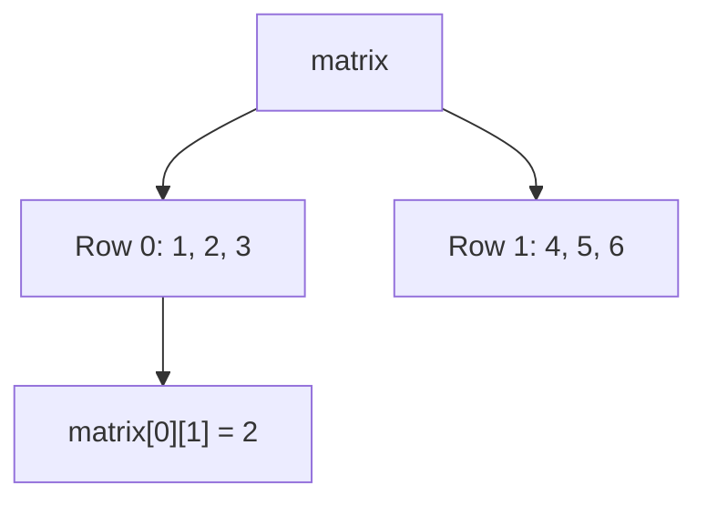
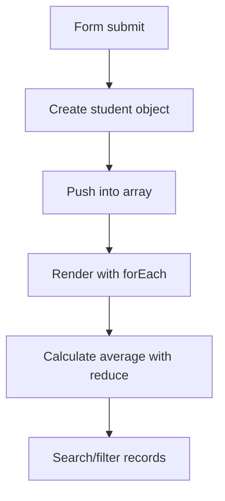

# 🧺 Chapter 21: Arrays, Objects and Strings


> [!TIP]
> **Chapter Goal:** Related values ko arrays me, structured information ko objects me aur text ko strings ke through efficiently store aur process karna.

---

## 🎯 21.1 Learning Objectives

Is chapter ke baad aap:

- Arrays create, access aur update kar payenge.
- Common array methods use karenge.
- Arrays ko loops aur callback methods se process karenge.
- Objects, properties aur methods samjhenge.
- Dot aur bracket notation use karenge.
- Destructuring, spread aur rest syntax ka basic use karenge.
- Strings aur unke common methods use karenge.
- Student Record Manager practical bana payenge.

---

## 🗣️ 21.2 Difficult Words

| Word | Pronunciation | Simple Meaning |
|---|---|---|
| Array | अरे — *uh-ray* | Ordered values ka collection |
| Element | एलिमेंट — *el-uh-ment* | Array ki ek value |
| Index | इंडेक्स — *in-deks* | Element ki position |
| Object | ऑब्जेक्ट — *ob-jekt* | Key-value data collection |
| Property | प्रॉपर्टी — *prop-er-tee* | Object ki named value |
| Method | मेथड — *meth-ud* | Object se connected function |
| Mutate | म्यूटेट — *myoo-tayt* | Existing value ko change karna |
| Destructure | डी-स्ट्रक्चर — *dee-struk-cher* | Values ko unpack karna |
| Concatenate | कनकैटनेट — *kon-kat-uh-nayt* | Values/text ko jodna |
| Immutable | इम्यूटेबल — *i-myoo-tuh-bul* | Directly change na hone wala |
| Shallow | शैलो — *shal-oh* | Sirf first level tak |
| Iterate | इटरेट — *it-uh-rayt* | Values par one-by-one chalna |

---

# 🟦 Part A: Arrays

## 21.3 What Is an Array?

Array multiple values ko ek ordered collection me store karta hai.

```javascript
const subjects = ["HTML", "CSS", "JavaScript"];
```

Individual value ko **element** kehte hain. Har element ka numeric **index** hota hai.

> [!IMPORTANT]
> JavaScript array indexing `0` se start hoti hai.

```text
Value:  HTML   CSS   JavaScript
Index:    0     1        2
```

---

## 21.4 Creating Arrays

### Array Literal

```javascript
const marks = [78, 85, 91];
```

### Array Constructor

```javascript
const colors = new Array("red", "green", "blue");
```

Array literal simpler aur commonly preferred hai.

Mixed values technically allowed:

```javascript
const mixed = ["Broun", 21, true, null];
```

Lekin related, consistent values rakhna code ko clearer banata hai.

---

## 21.5 Accessing and Updating Elements

```javascript
const subjects = ["HTML", "CSS", "JavaScript"];

console.log(subjects[0]); // HTML
console.log(subjects[2]); // JavaScript

subjects[1] = "Advanced CSS";
console.log(subjects);
```

Missing index:

```javascript
console.log(subjects[10]); // undefined
```

---

## 21.6 Array Length

```javascript
const subjects = ["HTML", "CSS", "JavaScript"];

console.log(subjects.length); // 3
console.log(subjects[subjects.length - 1]); // JavaScript
```

Last element ka index always `length - 1` hota hai.

---

## 21.7 Adding and Removing Elements

| Method | Work | Original Array Change? |
|---|---|---:|
| `push()` | End me add | Yes |
| `pop()` | End se remove | Yes |
| `unshift()` | Start me add | Yes |
| `shift()` | Start se remove | Yes |

```javascript
const topics = ["CSS"];

topics.push("JavaScript");
topics.unshift("HTML");

console.log(topics); // HTML, CSS, JavaScript

const lastTopic = topics.pop();
const firstTopic = topics.shift();
```

`pop()` and `shift()` removed value return karte hain.

---

## 21.8 Finding Elements

```javascript
const subjects = ["HTML", "CSS", "JavaScript", "CSS"];

subjects.includes("CSS");       // true
subjects.indexOf("CSS");        // 1
subjects.lastIndexOf("CSS");    // 3
```

`includes()` existence check ke liye readable choice hai.

---

## 21.9 `slice()` and `splice()`

### `slice()` — Copy a Portion

```javascript
const values = [10, 20, 30, 40, 50];
const selected = values.slice(1, 4);

console.log(selected); // [20, 30, 40]
console.log(values);   // unchanged
```

End index included nahi hota.

### `splice()` — Modify Original Array

```javascript
const subjects = ["HTML", "CSS", "PHP"];

subjects.splice(2, 1, "JavaScript");

console.log(subjects); // HTML, CSS, JavaScript
```

Arguments: start index, delete count, new items.

> [!WARNING]
> `slice()` original array change nahi karta; `splice()` karta hai.

---

## 21.10 Joining and Combining Arrays

```javascript
const frontend = ["HTML", "CSS"];
const scripting = ["JavaScript"];

const combined = frontend.concat(scripting);
const modernCombined = [...frontend, ...scripting];

console.log(combined.join(" | "));
```

Output:

```text
HTML | CSS | JavaScript
```

---

## 21.11 Iterating with a Loop

```javascript
const subjects = ["HTML", "CSS", "JavaScript"];

for (let index = 0; index < subjects.length; index++) {
    console.log(`${index}: ${subjects[index]}`);
}
```

With `for...of`:

```javascript
for (const subject of subjects) {
    console.log(subject);
}
```

---

## 21.12 `forEach()`

```javascript
subjects.forEach((subject, index) => {
    console.log(`${index + 1}. ${subject}`);
});
```

`forEach()` each element ke liye callback run karta hai. Ye new array return nahi karta.

---

## 21.13 `map()`

`map()` every element transform karke new array return karta hai.

```javascript
const marks = [50, 60, 70];

const bonusMarks = marks.map(mark => mark + 5);

console.log(bonusMarks); // [55, 65, 75]
console.log(marks);      // unchanged
```

---

## 21.14 `filter()`

`filter()` matching elements ka new array banata hai.

```javascript
const marks = [25, 48, 75, 32, 90];

const passingMarks = marks.filter(mark => mark >= 40);

console.log(passingMarks); // [48, 75, 90]
```

Callback ka truthy result element ko include karta hai.

---

## 21.15 `find()` and `findIndex()`

```javascript
const marks = [25, 48, 75, 90];

const firstHighMark = marks.find(mark => mark >= 70);
const position = marks.findIndex(mark => mark >= 70);

console.log(firstHighMark); // 75
console.log(position);      // 2
```

No match:

- `find()` returns `undefined`.
- `findIndex()` returns `-1`.

---

## 21.16 `some()` and `every()`

```javascript
const marks = [45, 60, 82];

const hasDistinction = marks.some(mark => mark >= 75);
const allPassed = marks.every(mark => mark >= 40);
```

- `some()`: at least one matches.
- `every()`: all match.

---

## 21.17 `reduce()`

```javascript
const marks = [70, 80, 90];

const total = marks.reduce(
    (accumulator, mark) => accumulator + mark,
    0
);

console.log(total); // 240
```

`0` initial accumulator value hai.

> [!TIP]
> Sum ke liye loop bhi perfectly valid hai. `reduce()` tab use karein jab logic readable rahe.

---

## 21.18 Sorting Arrays

Default sorting strings jaisa compare kar sakti hai:

```javascript
const numbers = [100, 2, 25];
numbers.sort();

console.log(numbers); // [100, 2, 25]
```

Numeric ascending:

```javascript
numbers.sort((a, b) => a - b);
```

Numeric descending:

```javascript
numbers.sort((a, b) => b - a);
```

`sort()` original array mutate karta hai. Copy first:

```javascript
const sortedCopy = [...numbers].sort((a, b) => a - b);
```

---

## 21.19 Multidimensional Arrays

```javascript
const matrix = [
    [1, 2, 3],
    [4, 5, 6]
];

console.log(matrix[0][1]); // 2
console.log(matrix[1][2]); // 6
```



---

# 🟩 Part B: Objects

## 21.20 What Is an Object?

Object related data ko named key-value pairs me store karta hai.

```javascript
const student = {
    name: "Broun",
    course: "BCA",
    semester: 1,
    isActive: true
};
```

`name`, `course` etc. properties hain.

---

## 21.21 Accessing Properties

### Dot Notation

```javascript
console.log(student.name);
console.log(student.course);
```

### Bracket Notation

```javascript
console.log(student["name"]);

const propertyName = "semester";
console.log(student[propertyName]);
```

Bracket notation dynamic key ya spaces/special property names ke liye useful hai.

---

## 21.22 Adding, Updating and Deleting

```javascript
const student = {
    name: "Broun",
    course: "BCA"
};

student.city = "Prayagraj";
student.course = "BCA Web Technology";
delete student.city;
```

Check a property:

```javascript
Object.hasOwn(student, "name"); // true
```

---

## 21.23 Object Methods

```javascript
const student = {
    name: "Broun",
    greet() {
        return `Hello, I am ${this.name}.`;
    }
};

console.log(student.greet());
```

A function stored as an object property is called a method.

> [!NOTE]
> Regular method syntax me `this` call ke object ko refer kar sakta hai. Arrow function ka own `this` nahi hota.

---

## 21.24 Nested Objects

```javascript
const student = {
    name: "Broun",
    address: {
        city: "Prayagraj",
        state: "Uttar Pradesh"
    }
};

console.log(student.address.city);
```

Optional chaining:

```javascript
console.log(student.contact?.phone); // undefined
```

---

## 21.25 Arrays of Objects

```javascript
const students = [
    { id: 1, name: "Broun", marks: 82 },
    { id: 2, name: "Aman", marks: 67 },
    { id: 3, name: "Neha", marks: 91 }
];

const topper = students.find(student => student.marks >= 90);
const names = students.map(student => student.name);
const passed = students.filter(student => student.marks >= 40);
```

Real applications me arrays of objects bahut common hain.

---

## 21.26 Object Utility Methods

```javascript
const student = {
    name: "Broun",
    course: "BCA"
};

Object.keys(student);    // ["name", "course"]
Object.values(student);  // ["Broun", "BCA"]
Object.entries(student); // [["name", "Broun"], ["course", "BCA"]]
```

Iterate entries:

```javascript
for (const [key, value] of Object.entries(student)) {
    console.log(`${key}: ${value}`);
}
```

---

## 21.27 Object Destructuring

```javascript
const student = {
    name: "Broun",
    course: "BCA",
    city: "Prayagraj"
};

const { name, course } = student;
console.log(name, course);
```

Rename/default:

```javascript
const {
    name: studentName,
    semester = 1
} = student;
```

---

## 21.28 Array Destructuring

```javascript
const colors = ["red", "green", "blue"];

const [firstColor, secondColor] = colors;
console.log(firstColor);
```

Skip and rest:

```javascript
const [first, , third] = colors;
const [primary, ...remaining] = colors;
```

---

## 21.29 Spread and Rest Syntax

### Spread — Expand/Copy

```javascript
const original = [10, 20];
const copy = [...original];
const combined = [...original, 30, 40];

const student = { name: "Broun", course: "BCA" };
const updatedStudent = { ...student, semester: 2 };
```

### Rest — Collect

```javascript
function addAll(...numbers) {
    return numbers.reduce((total, number) => total + number, 0);
}

addAll(10, 20, 30);
```

> [!WARNING]
> Spread produces a **shallow copy**. Nested objects may still share references.

---

## 21.30 Reference Behavior

```javascript
const first = { name: "Broun" };
const second = first;

second.name = "Aman";

console.log(first.name); // Aman
```

Both variables same object reference kar rahe hain.

Shallow copy:

```javascript
const secondCopy = { ...first };
secondCopy.name = "Neha";
```

---

# 🟨 Part C: Strings

## 21.31 Creating Strings

```javascript
const single = 'BCA';
const double = "Web Technology";
const template = `Course: ${single}`;
```

Strings are immutable primitive values.

---

## 21.32 String Length and Characters

```javascript
const course = "JavaScript";

console.log(course.length); // 10
console.log(course[0]);     // J
console.log(course.at(-1)); // t
```

Direct character assignment string ko change nahi karta.

---

## 21.33 Case and Whitespace Methods

```javascript
const text = "  Web Technology  ";

text.toUpperCase();
text.toLowerCase();
text.trim();
text.trimStart();
text.trimEnd();
```

Methods new string return karte hain; original unchanged rehta hai.

---

## 21.34 Searching in Strings

```javascript
const message = "Learn JavaScript step by step";

message.includes("JavaScript"); // true
message.startsWith("Learn");    // true
message.endsWith("step");       // true
message.indexOf("step");        // 17
```

Most searches case-sensitive hote hain.

---

## 21.35 Extracting Text

```javascript
const text = "JavaScript";

text.slice(0, 4);     // Java
text.substring(4, 10); // Script
```

`slice()` negative indexes support karta hai:

```javascript
text.slice(-6); // Script
```

---

## 21.36 Replacing Text

```javascript
const message = "HTML is easy. HTML is useful.";

message.replace("HTML", "CSS");
message.replaceAll("HTML", "JavaScript");
```

`replace()` normally first match; `replaceAll()` all matches replace karta hai.

---

## 21.37 Split and Join

```javascript
const csv = "HTML,CSS,JavaScript";
const subjects = csv.split(",");

console.log(subjects);
console.log(subjects.join(" | "));
```

`split()` string → array.  
`join()` array → string.

---

## 21.38 Template Literals

```javascript
const name = "Broun";
const marks = 85;

const result = `${name} scored ${marks} marks.`;
```

They support:

- Interpolation
- Expressions
- Multi-line text

```javascript
const card = `
Student: ${name}
Result: ${marks >= 40 ? "Pass" : "Fail"}
`;
```

---

# 🟪 Part D: Complete Practical

## 21.39 Student Record Manager

### HTML

```html
<form id="student-form">
    <input id="student-name" placeholder="Student name" required>
    <input id="student-marks" type="number"
           min="0" max="100" required>
    <button type="submit">Add Student</button>
</form>

<input id="search-input" placeholder="Search student">
<button id="show-passed" type="button">Show Passed</button>
<button id="show-all" type="button">Show All</button>

<p id="summary" aria-live="polite"></p>
<ul id="student-list"></ul>

<script src="app.js"></script>
```

### JavaScript

```javascript
"use strict";

const students = [];

const form = document.querySelector("#student-form");
const nameInput = document.querySelector("#student-name");
const marksInput = document.querySelector("#student-marks");
const searchInput = document.querySelector("#search-input");
const list = document.querySelector("#student-list");
const summary = document.querySelector("#summary");
const showPassedButton = document.querySelector("#show-passed");
const showAllButton = document.querySelector("#show-all");

function getGrade(marks) {
    if (marks >= 90) return "A+";
    if (marks >= 75) return "A";
    if (marks >= 60) return "B";
    if (marks >= 40) return "C";
    return "Fail";
}

function renderStudents(records) {
    list.replaceChildren();

    records.forEach(student => {
        const item = document.createElement("li");
        item.textContent =
            `${student.name} — ${student.marks} — ${getGrade(student.marks)}`;
        list.append(item);
    });

    const total = records.reduce(
        (sum, student) => sum + student.marks,
        0
    );

    const average = records.length === 0
        ? 0
        : total / records.length;

    summary.textContent =
        `Students: ${records.length} | Average: ${average.toFixed(2)}`;
}

form.addEventListener("submit", event => {
    event.preventDefault();

    const name = nameInput.value.trim();
    const marks = Number(marksInput.value);

    if (!name || marks < 0 || marks > 100) return;

    students.push({
        id: Date.now(),
        name,
        marks
    });

    renderStudents(students);
    form.reset();
    nameInput.focus();
});

searchInput.addEventListener("input", () => {
    const query = searchInput.value.trim().toLowerCase();

    const matches = students.filter(student =>
        student.name.toLowerCase().includes(query)
    );

    renderStudents(matches);
});

showPassedButton.addEventListener("click", () => {
    const passed = students.filter(student => student.marks >= 40);
    renderStudents(passed);
});

showAllButton.addEventListener("click", () => {
    renderStudents(students);
});
```



---

## 🚫 21.40 Common Mistakes

1. First array index ko `1` samajhna.
2. Last element ke liye `array.length` use karna.
3. `slice()` aur `splice()` confuse karna.
4. `map()` ka returned array ignore karna.
5. Numeric array ko comparison callback ke bina sort karna.
6. `find()` se array expect karna.
7. Dot notation me dynamic variable use karna.
8. Missing nested property access se error lana.
9. Object copy ke bajay same reference share karna.
10. Spread ko deep copy samajhna.
11. String methods se original string change expect karna.
12. Case-sensitive search ko ignore karna.

---

## 📌 21.41 Best Practices

- Related and consistent values arrays me rakhein.
- Singular element aur plural array names use karein.
- Mutation karne wale methods ko pehchanein.
- Transformation ke liye `map()`, selection ke liye `filter()`.
- Objects me meaningful property names rakhein.
- Dynamic keys ke liye bracket notation use karein.
- Optional values ko safely access karein.
- String input ko `trim()` karke validate karein.
- Nested references aur shallow copying ko carefully handle karein.

---

## 📝 21.42 Chapter Summary

Arrays ordered collections hain aur zero-based indexes use karte hain. Common methods elements add/remove, search, transform, filter, reduce aur sort karte hain. Objects named properties ke through structured data store karte hain. Dot/bracket notation, object methods, destructuring aur spread code ko expressive banate hain. Arrays of objects real applications ka common data model hain. Strings immutable text values hain; their methods search, extract, normalize, replace, split aur combine text karte hain.

---

## 🎲 21.43 MCQs

1. First array index? **B. `0`**  
   A. `1` · B. `0` · C. `-1` · D. Depends

2. End me element add? **A. `push()`**  
   A. `push()` · B. `shift()` · C. `pop()` · D. `slice()`

3. New transformed array? **C. `map()`**  
   A. `find()` · B. `forEach()` · C. `map()` · D. `some()`

4. Matching elements ka array? **B. `filter()`**  
   A. `find()` · B. `filter()` · C. `every()` · D. `join()`

5. Dynamic object key access? **C. Bracket notation**  
   A. Dot only · B. Colon · C. Bracket notation · D. Spread

6. Object key-value pairs return? **D. `Object.entries()`**  
   A. `keys()` · B. `values()` · C. `map()` · D. `Object.entries()`

7. String to array? **A. `split()`**  
   A. `split()` · B. `join()` · C. `slice()` · D. `trim()`

8. Strings are? **B. Immutable**  
   A. Mutable · B. Immutable · C. Arrays · D. Objects

---

## ✍️ 21.44 Fill in the Blanks

1. Array positions are called __________.
2. Last element index is length minus __________.
3. First matching element returns from __________.
4. Object's named value is a __________.
5. String ko array me convert karne ka method __________.

<details>
<summary><strong>✅ Answers</strong></summary>

1. indexes  
2. one  
3. `find()`  
4. property  
5. `split()`

</details>

---

## ✅ 21.45 True or False

1. Arrays start at index 1 — **False**
2. `push()` mutates an array — **True**
3. `slice()` changes original array — **False**
4. `filter()` returns all matching elements — **True**
5. Spread always creates a deep copy — **False**
6. Strings are immutable — **True**
7. `trim()` removes inner spaces — **False**
8. `join()` converts array to string — **True**

---

## ❓ 21.46 Exam Questions

### Short Answer

1. Define array and index.
2. Differentiate `push()` and `unshift()`.
3. Differentiate `slice()` and `splice()`.
4. Explain `map()`, `filter()` and `reduce()`.
5. Define object, property and method.
6. Compare dot and bracket notation.
7. Explain destructuring and spread.
8. List important string methods.

### Long Answer

1. Explain arrays and their methods with examples.
2. Explain callback-based array methods.
3. Explain objects, nested objects and arrays of objects.
4. Discuss destructuring, spread, rest and reference behavior.
5. Explain strings and common processing methods.
6. Build and explain Student Record Manager.

---

## 🧪 21.47 Practical Exercises

1. Find array sum, average, minimum and maximum.
2. Remove duplicates from an array.
3. Sort marks ascending and descending.
4. Filter passing students.
5. Create student objects.
6. Display all object entries.
7. Copy and update an object with spread.
8. Count words in a string.
9. Reverse a string.
10. Perform case-insensitive search.
11. Create a marks report from an array of objects.
12. Extend Student Record Manager with delete and sorting.

---

## 🎤 21.48 Viva Questions

1. What is an array?
2. Why does indexing start at zero?
3. What does `length` return?
4. Which methods mutate arrays?
5. `map()` vs `forEach()`?
6. `find()` vs `filter()`?
7. What is an object property?
8. Dot vs bracket notation?
9. What is an object method?
10. What is destructuring?
11. What is a shallow copy?
12. Are strings mutable?
13. `slice()` does what?
14. `split()` vs `join()`?
15. Why use template literals?

---

## 🏁 21.49 One-Minute Revision

| Question | Quick Answer |
|---|---|
| Ordered collection? | Array |
| First index? | `0` |
| Add at end? | `push()` |
| Remove from start? | `shift()` |
| Transform all? | `map()` |
| Select matches? | `filter()` |
| First match? | `find()` |
| Combine to one value? | `reduce()` |
| Named data collection? | Object |
| Dynamic property? | Bracket notation |
| Unpack values? | Destructuring |
| Copy/expand? | Spread |
| Remove outer spaces? | `trim()` |
| String to array? | `split()` |
| Array to string? | `join()` |

---

## 📚 21.50 Official References

1. [MDN — Indexed Collections](https://developer.mozilla.org/docs/Web/JavaScript/Guide/Indexed_collections)
2. [MDN — Working with Objects](https://developer.mozilla.org/docs/Web/JavaScript/Guide/Working_with_objects)
3. [MDN — Array](https://developer.mozilla.org/docs/Web/JavaScript/Reference/Global_Objects/Array)
4. [MDN — String](https://developer.mozilla.org/docs/Web/JavaScript/Reference/Global_Objects/String)

---

[⬅️ Previous Chapter](20-conditions-loops-and-functions.md) · [📚 Table of Contents](../SUMMARY.md) · **Next: DOM and Event Handling ➡️**
