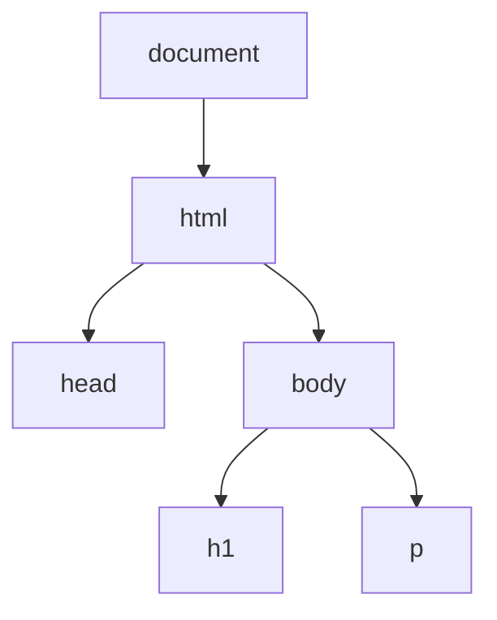
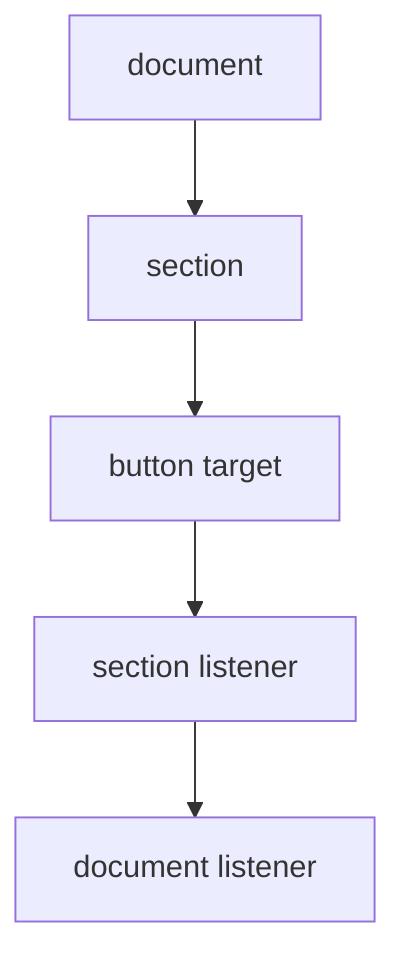

# 🌳 Chapter 22: DOM and Event Handling


> [!TIP]
> **Chapter Goal:** JavaScript se webpage ke elements ko select, change, create aur remove karna; user actions ko events ke through handle karna.

---

## 🎯 22.1 Learning Objectives

Is chapter ke baad aap:

- DOM aur DOM tree explain kar payenge.
- Elements ko different selectors se select karenge.
- Text, HTML, attributes, classes aur styles change karenge.
- Elements create, insert, replace aur remove karenge.
- Event listeners attach aur remove karenge.
- Event object, bubbling, capturing aur delegation samjhenge.
- Keyboard, mouse, input aur form events handle karenge.
- Accessible interactive To-Do application banayenge.

---

## 🗣️ 22.2 Difficult Words

| Word | Pronunciation | Simple Meaning |
|---|---|---|
| Document | डॉक्यूमेंट — *dok-yuh-ment* | Loaded webpage |
| Object Model | ऑब्जेक्ट मॉडल — *ob-jekt mod-ul* | Page ka object-based representation |
| Node | नोड — *nohd* | DOM tree ka ek point |
| Traverse | ट्रैवर्स — *truh-vurs* | Tree me move karna |
| Selector | सिलेक्टर — *si-lek-ter* | Element choose karne ka pattern |
| Attribute | एट्रिब्यूट — *at-ri-byoot* | Element ki extra information |
| Listener | लिसनर — *lis-uh-ner* | Event ka wait karne wala function |
| Propagation | प्रॉपगेशन — *prop-uh-gay-shun* | Event ka DOM path par travel |
| Bubbling | बबलिंग — *bub-ling* | Target se ancestors ki taraf event travel |
| Capturing | कैप्चरिंग — *kap-cher-ing* | Ancestors se target ki taraf event travel |
| Delegation | डेलिगेशन — *del-i-gay-shun* | Parent listener se child events handle karna |
| Interface | इंटरफेस — *in-ter-fays* | Interaction ka defined structure |

---

# 🟦 Part A: DOM Fundamentals

## 22.3 What Is the DOM?

DOM ka full form **Document Object Model** hai. Browser HTML document ko objects ke tree me represent karta hai. JavaScript isi model ke through page ko access aur change karti hai.

```html
<body>
    <h1>My Book</h1>
    <p>Learn Web Technology</p>
</body>
```



> [!IMPORTANT]
> HTML source aur DOM related hain, but exactly same concept nahi. Browser HTML parse karke current in-memory DOM banata hai, jise JavaScript modify kar sakti hai.

---

## 22.4 Browser Object vs DOM

- `window` browser window ka global object hai.
- `document` current webpage ko represent karta hai.
- `document`, `window` ki property hai.

```javascript
console.log(window.document);
console.log(document.title);
console.log(document.URL);
```

Common properties:

| Property | Meaning |
|---|---|
| `document.title` | Page title |
| `document.URL` | Current URL |
| `document.body` | Body element |
| `document.head` | Head element |
| `document.documentElement` | Root `html` element |

---

## 22.5 Types of DOM Nodes

Important node types:

1. Document node
2. Element node
3. Text node
4. Comment node

```html
<p>Hello <strong>Student</strong></p>
```

Here `p` and `strong` element nodes hain; visible words text nodes hain.

---

# 🟩 Part B: Selecting Elements

## 22.6 `getElementById()`

```html
<h1 id="page-title">Web Technology</h1>
```

```javascript
const title = document.getElementById("page-title");
console.log(title);
```

ID unique honi chahiye. No match par `null` milta hai.

---

## 22.7 `querySelector()`

First matching element return karta hai.

```javascript
const title = document.querySelector("#page-title");
const firstCard = document.querySelector(".card");
const button = document.querySelector("button");
```

Valid CSS selector use hota hai.

---

## 22.8 `querySelectorAll()`

All matching elements ka static `NodeList` return karta hai.

```javascript
const cards = document.querySelectorAll(".card");

cards.forEach(card => {
    console.log(card.textContent);
});
```

No match par empty NodeList milti hai.

---

## 22.9 Other Selection Methods

```javascript
document.getElementsByClassName("card");
document.getElementsByTagName("p");
document.getElementsByName("course");
```

`getElementsByClassName()` and `getElementsByTagName()` live HTMLCollections return karte hain. Modern code me CSS selector flexibility ke liye `querySelector()` methods common hain.

---

## 22.10 Selector Comparison

| Method | Result | No Match | Collection Nature |
|---|---|---|---|
| `getElementById()` | One element | `null` | — |
| `querySelector()` | First match | `null` | — |
| `querySelectorAll()` | All matches | Empty NodeList | Usually static |
| `getElementsByClassName()` | All matches | Empty collection | Live |
| `getElementsByTagName()` | All matches | Empty collection | Live |

---

# 🟨 Part C: Reading and Changing Content

## 22.11 `textContent`

```javascript
const message = document.querySelector("#message");

console.log(message.textContent);
message.textContent = "Welcome, Broun!";
```

Text safely set karne ke liye good default hai. Markup interpret nahi hota.

---

## 22.12 `innerHTML`

```javascript
const result = document.querySelector("#result");
result.innerHTML = "<strong>Pass</strong>";
```

HTML markup parse hota hai.

> [!WARNING]
> Untrusted user input ko `innerHTML` me directly insert karna Cross-Site Scripting (XSS) risk create kar sakta hai. User text ke liye `textContent` use karein.

---

## 22.13 `innerText`

`innerText` rendered/visible text ko consider karta hai and layout-related behavior involve kar sakta hai. Normal text read/write ke liye often `textContent` simpler hota hai.

---

## 22.14 Attributes

```javascript
const link = document.querySelector("#course-link");

link.getAttribute("href");
link.setAttribute("title", "Open course");
link.hasAttribute("target");
link.removeAttribute("target");
```

Direct properties bhi available hoti hain:

```javascript
link.href = "https://example.com";
const input = document.querySelector("#name");
input.disabled = true;
```

Boolean attributes ko properties se manage karna often clearer hai.

---

## 22.15 Data Attributes

HTML:

```html
<button data-student-id="42" data-action="delete">
    Delete
</button>
```

JavaScript:

```javascript
const button = document.querySelector("button");

console.log(button.dataset.studentId); // "42"
console.log(button.dataset.action);    // "delete"
```

`data-student-id` JavaScript me `dataset.studentId` banta hai.

---

## 22.16 Classes

```javascript
const card = document.querySelector(".card");

card.classList.add("active");
card.classList.remove("hidden");
card.classList.toggle("selected");
card.classList.contains("active");
```

`classList` CSS classes manage karne ka clean method hai.

Toggle with explicit condition:

```javascript
card.classList.toggle("error", hasError);
```

---

## 22.17 Inline Styles

```javascript
const box = document.querySelector(".box");

box.style.backgroundColor = "royalblue";
box.style.color = "white";
```

CSS property names camelCase me:

- `background-color` → `backgroundColor`
- `font-size` → `fontSize`

> [!TIP]
> Multiple design changes ke liye inline styles ke bajay CSS class add/remove karein.

---

# 🟪 Part D: Traversing the DOM

## 22.18 Parent, Children and Siblings

```javascript
const item = document.querySelector(".item");

item.parentElement;
item.children;
item.firstElementChild;
item.lastElementChild;
item.previousElementSibling;
item.nextElementSibling;
```

Element-based properties whitespace text nodes ke confusion ko reduce karti hain.

---

## 22.19 `closest()` and `matches()`

```javascript
const button = document.querySelector(".delete-button");

const card = button.closest(".card");
const isDangerButton = button.matches(".danger");
```

- `closest()` self se upward nearest match find karta hai.
- `matches()` check karta hai ki current element selector se match karta hai ya nahi.

---

# 🟥 Part E: Creating and Removing Elements

## 22.20 Creating Elements

```javascript
const item = document.createElement("li");
item.textContent = "Learn DOM";
item.classList.add("task");

const list = document.querySelector("#task-list");
list.append(item);
```

Safe process:

1. Element create
2. Content set
3. Attributes/classes set
4. DOM me insert

---

## 22.21 Inserting Elements

```javascript
const list = document.querySelector("#task-list");
const item = document.createElement("li");

list.append(item);       // End
list.prepend(item);      // Beginning
list.before(item);       // Before list
list.after(item);        // After list
```

`append()` strings aur multiple nodes accept kar sakta hai.

---

## 22.22 Removing and Replacing

```javascript
item.remove();
oldElement.replaceWith(newElement);
list.replaceChildren();
```

`replaceChildren()` container ko empty bhi kar sakta hai or new children set kar sakta hai.

---

## 22.23 Efficient Multiple Insertions

```javascript
const fragment = document.createDocumentFragment();

for (let number = 1; number <= 100; number++) {
    const item = document.createElement("li");
    item.textContent = `Item ${number}`;
    fragment.append(item);
}

list.append(fragment);
```

Document fragment se many nodes ko group karke insert kar sakte hain.

---

# 🟧 Part F: Events

## 22.24 What Is an Event?

Event browser me hone wali action/occurrence hai:

- Mouse click
- Keyboard key
- Form submission
- Input change
- Page load
- Focus or blur
- Pointer movement

JavaScript listener event hone par function run karta hai.

---

## 22.25 `addEventListener()`

```javascript
const button = document.querySelector("#save-button");

button.addEventListener("click", () => {
    console.log("Saved!");
});
```

Named handler:

```javascript
function handleSave() {
    console.log("Saved!");
}

button.addEventListener("click", handleSave);
```

Named reference se listener remove kiya ja sakta hai:

```javascript
button.removeEventListener("click", handleSave);
```

---

## 22.26 Why Not Inline Events?

Avoid:

```html
<button onclick="saveData()">Save</button>
```

Prefer:

```javascript
button.addEventListener("click", saveData);
```

This keeps HTML structure aur JavaScript behavior separate, and multiple listeners allow karta hai.

---

## 22.27 Event Object

```javascript
button.addEventListener("click", event => {
    console.log(event.type);
    console.log(event.target);
    console.log(event.currentTarget);
});
```

- `target`: event actually kaha start hua.
- `currentTarget`: jis element ka current listener run ho raha hai.

---

## 22.28 Common Mouse and Pointer Events

| Event | When It Occurs |
|---|---|
| `click` | Activation/click |
| `dblclick` | Double click |
| `mouseenter` | Pointer enters |
| `mouseleave` | Pointer leaves |
| `pointerdown` | Pointer pressed |
| `pointerup` | Pointer released |

Pointer events mouse, pen aur touch ko unified way me handle kar sakte hain.

---

## 22.29 Keyboard Events

```javascript
const input = document.querySelector("#search");

input.addEventListener("keydown", event => {
    if (event.key === "Enter") {
        console.log("Search:", input.value);
    }

    if (event.key === "Escape") {
        input.value = "";
    }
});
```

Meaningful `event.key` values use karein, jaise `Enter` and `Escape`.

---

## 22.30 Input and Change Events

```javascript
input.addEventListener("input", () => {
    console.log(input.value);
});
```

`input` value change ke saath generally immediately fires.

```javascript
const course = document.querySelector("#course");

course.addEventListener("change", () => {
    console.log(course.value);
});
```

`change` often committed selection/change par fires.

---

## 22.31 Form Submit Event

```javascript
const form = document.querySelector("#student-form");

form.addEventListener("submit", event => {
    event.preventDefault();

    const formData = new FormData(form);
    console.log(formData.get("studentName"));
});
```

Submit event ko form par handle karein—sirf button click par nahi. Isse Enter key submission bhi handle hoti hai.

---

## 22.32 `preventDefault()` and `stopPropagation()`

`preventDefault()` browser ki default action stop karta hai:

```javascript
link.addEventListener("click", event => {
    event.preventDefault();
});
```

`stopPropagation()` event ka propagation stop karta hai:

```javascript
button.addEventListener("click", event => {
    event.stopPropagation();
});
```

> [!CAUTION]
> `stopPropagation()` unnecessarily use na karein; event delegation aur other listeners break ho sakte hain.

---

# 🟫 Part G: Event Propagation

## 22.33 Capturing, Target and Bubbling

Event path ke main phases:

1. Capturing: ancestors → target
2. Target phase
3. Bubbling: target → ancestors



Most listeners default bubbling phase me work karte hain.

Capturing listener:

```javascript
section.addEventListener(
    "click",
    handleClick,
    { capture: true }
);
```

---

## 22.34 Event Delegation

One parent listener dynamically created children ke events handle kar sakta hai.

```javascript
const list = document.querySelector("#task-list");

list.addEventListener("click", event => {
    const deleteButton = event.target.closest(".delete-button");

    if (!deleteButton || !list.contains(deleteButton)) {
        return;
    }

    deleteButton.closest(".task").remove();
});
```

Benefits:

- Fewer listeners
- Dynamic elements automatically handled
- Centralized logic

---

## 22.35 Listener Options

```javascript
button.addEventListener(
    "click",
    handleClick,
    { once: true }
);
```

Common options:

- `once: true` — first execution ke baad remove
- `capture: true` — capturing phase
- `passive: true` — listener default action prevent nahi karega; scrolling-related use cases me useful

---

## 22.36 DOM Ready and Script Loading

Recommended:

```html
<script src="app.js" defer></script>
```

`defer` script download parallel karta hai and HTML parsing complete hone ke baad ordered execution allow karta hai.

Alternative:

```javascript
document.addEventListener("DOMContentLoaded", () => {
    // DOM-dependent code
});
```

---

# 🟦 Part H: Complete To-Do Practical

## 22.37 HTML

```html
<!DOCTYPE html>
<html lang="en">
<head>
    <meta charset="UTF-8">
    <meta name="viewport" content="width=device-width, initial-scale=1.0">
    <title>BCA Task Manager</title>
    <link rel="stylesheet" href="styles.css">
    <script src="app.js" defer></script>
</head>
<body>
    <main class="app">
        <h1>📚 BCA Task Manager</h1>

        <form id="task-form">
            <label for="task-input">New task</label>
            <input
                id="task-input"
                name="task"
                required
                maxlength="100"
                autocomplete="off">
            <button type="submit">Add Task</button>
        </form>

        <p id="status" aria-live="polite">No tasks yet.</p>
        <ul id="task-list"></ul>
    </main>
</body>
</html>
```

## 22.38 CSS

```css
:root {
    color-scheme: light;
    font-family: system-ui, sans-serif;
}

body {
    margin: 0;
    min-height: 100vh;
    display: grid;
    place-items: center;
    background: linear-gradient(135deg, #dbeafe, #f3e8ff);
}

.app {
    width: min(90%, 650px);
    padding: 2rem;
    border-radius: 1rem;
    background: white;
    box-shadow: 0 1rem 3rem rgb(30 41 59 / 15%);
}

form,
.task {
    display: flex;
    gap: 0.75rem;
}

input {
    flex: 1;
    padding: 0.75rem;
}

.task {
    justify-content: space-between;
    align-items: center;
    margin-block: 0.75rem;
    padding: 0.75rem;
    border-left: 0.35rem solid #7c3aed;
    background: #f8fafc;
}

.task.completed .task-text {
    text-decoration: line-through;
    opacity: 0.6;
}
```

## 22.39 JavaScript

```javascript
"use strict";

const form = document.querySelector("#task-form");
const input = document.querySelector("#task-input");
const list = document.querySelector("#task-list");
const status = document.querySelector("#status");

let taskCount = 0;

function updateStatus() {
    const remaining = list.querySelectorAll(
        ".task:not(.completed)"
    ).length;

    status.textContent =
        `Total: ${taskCount} | Remaining: ${remaining}`;
}

function createTask(taskText) {
    const item = document.createElement("li");
    item.className = "task";

    const text = document.createElement("span");
    text.className = "task-text";
    text.textContent = taskText;

    const completeButton = document.createElement("button");
    completeButton.type = "button";
    completeButton.dataset.action = "toggle";
    completeButton.textContent = "Complete";

    const deleteButton = document.createElement("button");
    deleteButton.type = "button";
    deleteButton.dataset.action = "delete";
    deleteButton.textContent = "Delete";

    item.append(text, completeButton, deleteButton);
    return item;
}

form.addEventListener("submit", event => {
    event.preventDefault();

    const taskText = input.value.trim();

    if (!taskText) {
        status.textContent = "Please enter a task.";
        return;
    }

    list.append(createTask(taskText));
    taskCount++;

    form.reset();
    input.focus();
    updateStatus();
});

list.addEventListener("click", event => {
    const button = event.target.closest("button");

    if (!button || !list.contains(button)) {
        return;
    }

    const task = button.closest(".task");
    const action = button.dataset.action;

    if (action === "toggle") {
        const isCompleted = task.classList.toggle("completed");
        button.textContent = isCompleted ? "Undo" : "Complete";
    }

    if (action === "delete") {
        task.remove();
        taskCount--;
    }

    updateStatus();
});
```

## 22.40 Practical Explanation

1. Form submit event default reload stop karta hai.
2. `trim()` blank-only input reject karne me help karta hai.
3. `createElement()` safe DOM nodes banata hai.
4. `textContent` user text ko markup ki tarah parse nahi karta.
5. `dataset.action` button ka intended action store karta hai.
6. Parent `ul` event delegation use karta hai.
7. `closest()` clicked button aur task locate karta hai.
8. `classList.toggle()` completed state change karta hai.
9. `aria-live` status updates announce karne me assistive technology ki help karta hai.
10. DOM queries remaining tasks calculate karti hain.

---

## 🚫 22.41 Common Mistakes

1. Script ko DOM ready hone se pehle run karna.
2. Selector me `#` or `.` bhoolna.
3. Possible `null` element par method call karna.
4. `querySelectorAll()` se single element expect karna.
5. User input ko unsafe `innerHTML` me insert karna.
6. CSS classes ke bajay many inline styles set karna.
7. Function call ko listener me pass karna: `addEventListener("click", save())`.
8. Anonymous handler ko later remove karne ki expectation.
9. `target` aur `currentTarget` confuse karna.
10. Form submit handle karne ke bajay only click handle karna.
11. Unnecessary `stopPropagation()` use karna.
12. Dynamic elements par individual listeners repeatedly attach karna.
13. Default button type ko ignore karna.
14. Keyboard accessibility bhoolna.

---

## 📌 22.42 Best Practices

- Scripts ko `defer` ke saath load karein.
- Elements ek baar select karke descriptive constants me store karein.
- User text ke liye `textContent` prefer karein.
- Visual changes CSS classes se karein.
- Dynamic collections ke liye event delegation use karein.
- Form ke `submit` event ko handle karein.
- Real `button` elements use karein for actions.
- Accessible labels aur live feedback provide karein.
- Event handler ko small focused functions me split karein.
- Unnecessary DOM updates avoid karein.

---

## 📝 22.43 Chapter Summary

DOM browser ka object-based webpage model hai. JavaScript selectors se elements find kar sakti hai, content, attributes, classes aur styles change kar sakti hai, aur new nodes create/remove kar sakti hai. Events user/browser actions represent karte hain. `addEventListener()` behavior attach karta hai, while event object target and interaction details provide karta hai. Events capturing, target aur bubbling phases se travel karte hain. Event delegation parent listener ke through dynamic child elements efficiently handle karta hai.

---

## 🎲 22.44 MCQs

1. DOM full form?  
   A. Data Object Method · **B. Document Object Model** · C. Digital Order Model · D. Document Output Map

2. First CSS selector match?  
   A. `querySelectorAll()` · **B. `querySelector()`** · C. `getElements()` · D. `find()`

3. Safe user text set?  
   A. `innerHTML` · **B. `textContent`** · C. `outerHTML` · D. `document.write()`

4. Class manage?  
   A. `styleList` · **B. `classList`** · C. `classes()` · D. `attributeList`

5. Browser default action stop?  
   A. `stopPropagation()` · **B. `preventDefault()`** · C. `remove()` · D. `break`

6. Actual event-start element?  
   A. `currentTarget` · **B. `target`** · C. `document` · D. `parent`

7. Target se ancestor travel?  
   A. Capturing · **B. Bubbling** · C. Rendering · D. Parsing

8. Parent listener se child actions?  
   A. Recursion · **B. Event delegation** · C. Hoisting · D. Polling

---

## ✍️ 22.45 Fill in the Blanks

1. DOM tree ka ek point __________ kehlata hai.
2. All selector matches ke liye __________ use hota hai.
3. New element banane ka method __________ hai.
4. Event default action rokne ka method __________ hai.
5. Target se parent direction ko __________ kehte hain.

<details>
<summary><strong>✅ Answers</strong></summary>

1. node  
2. `querySelectorAll()`  
3. `createElement()`  
4. `preventDefault()`  
5. bubbling

</details>

---

## ✅ 22.46 True or False

1. DOM only HTML source text hai — **False**
2. `querySelector()` first match return karta hai — **True**
3. `innerHTML` untrusted input ke liye always safe hai — **False**
4. `classList.toggle()` class state change kar sakta hai — **True**
5. `append()` node insert kar sakta hai — **True**
6. Form Enter submission ko submit event handle kar sakta hai — **True**
7. `target` and `currentTarget` always same hote hain — **False**
8. Event delegation dynamic children handle kar sakta hai — **True**

---

## ❓ 22.47 Exam Questions

### Short Answer

1. Define DOM and DOM tree.
2. Explain common element-selection methods.
3. Differentiate `textContent`, `innerText` and `innerHTML`.
4. Explain attributes, dataset and classList.
5. Describe DOM traversal methods.
6. How are elements created and inserted?
7. Define event and event listener.
8. Differentiate target and currentTarget.
9. Explain preventDefault and stopPropagation.
10. What is event delegation?

### Long Answer

1. Explain DOM structure and node types with a diagram.
2. Explain DOM selection and manipulation methods.
3. Discuss element creation, insertion and removal.
4. Explain common browser events and event object.
5. Describe event propagation phases.
6. Explain event delegation with example.
7. Build and explain the interactive To-Do application.

---

## 🧪 22.48 Practical Exercises

1. Button se heading text change karein.
2. Dark-mode class toggle banayein.
3. Character counter banayein.
4. Dynamic list items add/remove karein.
5. Image attribute changer banayein.
6. Password visibility toggle banayein.
7. Keyboard shortcut handle karein.
8. Form data page par display karein.
9. Event bubbling demo banayein.
10. Delegated table-row delete banayein.
11. Tabs or accordion component banayein.
12. To-Do app me edit and clear-completed feature add karein.

---

## 🎤 22.49 Viva Questions

1. DOM kya hai?
2. `window` aur `document` me difference?
3. DOM node kya hai?
4. ID se element kaise select karte hain?
5. NodeList kya hai?
6. `textContent` kab use karna chahiye?
7. `innerHTML` ka security risk kya hai?
8. Class kaise toggle karte hain?
9. New element kaise banate hain?
10. Event listener kya hai?
11. Event object kya deta hai?
12. `preventDefault()` kya karta hai?
13. Bubbling kya hai?
14. Delegation kya hai?
15. `defer` kyun use karte hain?

---

## 🏁 22.50 One-Minute Revision

| Question | Quick Answer |
|---|---|
| Page object model? | DOM |
| Current page? | `document` |
| First CSS match? | `querySelector()` |
| All CSS matches? | `querySelectorAll()` |
| Safe text? | `textContent` |
| Class handling? | `classList` |
| Create node? | `createElement()` |
| Insert at end? | `append()` |
| Delete node? | `remove()` |
| Attach event? | `addEventListener()` |
| Stop default? | `preventDefault()` |
| Actual source? | `event.target` |
| Target to ancestors? | Bubbling |
| Parent handles children? | Delegation |
| DOM-ready script? | `defer` |

---

## 📚 22.51 Official References

1. [MDN — Introduction to the DOM](https://developer.mozilla.org/docs/Web/API/Document_Object_Model/Introduction)
2. [MDN — Document](https://developer.mozilla.org/docs/Web/API/Document)
3. [MDN — EventTarget.addEventListener](https://developer.mozilla.org/docs/Web/API/EventTarget/addEventListener)
4. [MDN — Event Bubbling](https://developer.mozilla.org/docs/Learn_web_development/Core/Scripting/Event_bubbling)

---

[⬅️ Previous Chapter](21-arrays-objects-and-strings.md) · [📚 Table of Contents](../SUMMARY.md) · **Next: Form Validation ➡️**
