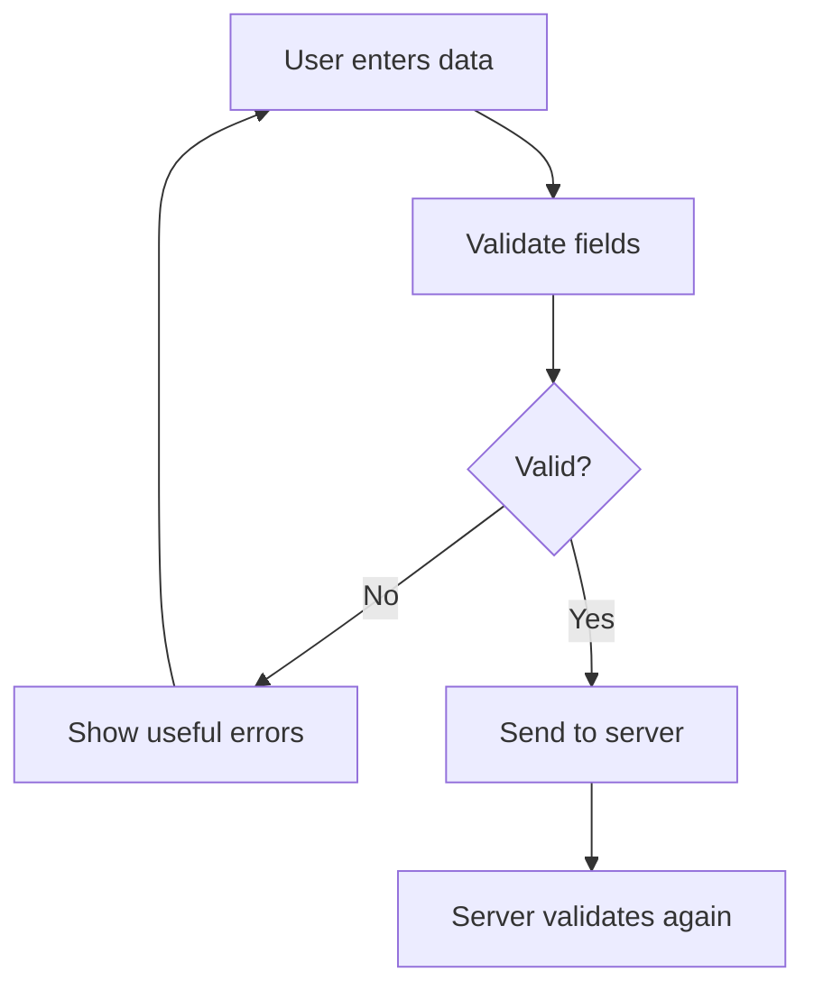
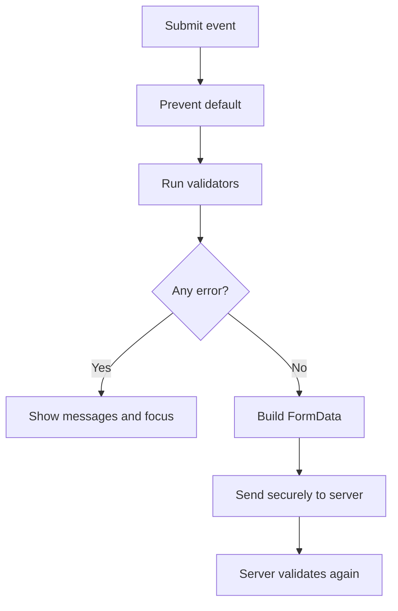

# ✅ Chapter 23: Form Validation


> [!TIP]
> **Chapter Goal:** User input ko submit hone se pehle check karna, clear error messages dikhana aur accessible, secure registration form banana.

---

## 🎯 23.1 Learning Objectives

Is chapter ke baad aap:

- Form validation ka purpose explain kar payenge.
- Client-side aur server-side validation compare karenge.
- HTML validation attributes use karenge.
- Constraint Validation API use karenge.
- JavaScript se fields aur complete forms validate karenge.
- Regular expressions ka basic use samjhenge.
- Accessible error messages show karenge.
- Complete registration form practical bana payenge.

---

## 🗣️ 23.2 Difficult Words

| Word | Pronunciation | Simple Meaning |
|---|---|---|
| Validation | वैलिडेशन — *val-i-day-shun* | Data rules check karna |
| Constraint | कन्स्ट्रेन्ट — *kun-straynt* | Input par lagaya rule |
| Sanitization | सैनिटाइजेशन — *san-i-tai-zay-shun* | Unsafe content ko safe banana |
| Authentication | ऑथेन्टिकेशन — *aw-then-ti-kay-shun* | Identity verify karna |
| Pattern | पैटर्न — *pat-ern* | Text ka required format |
| Regular Expression | रेग्युलर एक्सप्रेशन | Text matching rule |
| Feedback | फीडबैक — *feed-bak* | User ko result/message |
| Credential | क्रेडेन्शल — *kruh-den-shul* | Login identity information |
| Constraint API | कन्स्ट्रेन्ट एपीआई | Browser validation interface |
| Accessible | एक्सेसिबल — *ak-ses-uh-bul* | Sab users ke liye usable |
| Tamper | टैम्पर — *tam-per* | Data ko unauthorized change karna |
| Normalize | नॉर्मलाइज — *nor-muh-laiz* | Data ko consistent form me lana |

---

# 🟦 Part A: Validation Fundamentals

## 23.3 What Is Form Validation?

Form validation checks whether user-entered data required rules follow karta hai.

Examples:

- Name empty na ho.
- Email correct format me ho.
- Age allowed range me ho.
- Password minimum length meet kare.
- Confirm password match kare.
- Terms accepted hon.



---

## 23.4 Why Validation Is Important

Validation:

1. Data quality improve karti hai.
2. User mistakes jaldi identify karti hai.
3. Server ko meaningless requests reduce karti hai.
4. User experience improve karti hai.
5. Application rules enforce karne me help karti hai.

> [!WARNING]
> Client-side validation security boundary nahi hai. User browser validation bypass ya request modify kar sakta hai.

---

## 23.5 Client-Side vs Server-Side Validation

| Client-Side | Server-Side |
|---|---|
| Browser me hoti hai | Server par hoti hai |
| Fast feedback | Authoritative verification |
| HTML/JavaScript rules | PHP/Node/other backend rules |
| Bypass ho sakti hai | Must always be enforced |
| UX improve karti hai | Security and data integrity protect karti hai |

> [!IMPORTANT]
> Same important business rules server par dobara validate karna mandatory hai.

---

## 23.6 Validation vs Sanitization

**Validation:** Data acceptable hai ya nahi?

```javascript
const isValidAge = age >= 18 && age <= 100;
```

**Sanitization/normalization:** Data ko safe or consistent form me process karna.

```javascript
const normalizedEmail = email.trim().toLowerCase();
```

Validation aur sanitization related hain, but same nahi.

---

# 🟩 Part B: Native HTML Validation

## 23.7 The `required` Attribute

```html
<label for="name">Full name</label>
<input id="name" name="name" required>
```

Empty value submit hone se browser rok sakta hai.

---

## 23.8 Input Types

```html
<input type="email" name="email">
<input type="url" name="portfolio">
<input type="number" name="age">
<input type="date" name="birthDate">
```

Correct type:

- Validation semantics deta hai.
- Mobile par helpful keyboard show kar sakta hai.
- Browser/user-agent features provide karta hai.

> [!NOTE]
> `type="tel"` telephone keyboard hint de sakta hai, but format automatically enforce nahi karta.

---

## 23.9 Length Constraints

```html
<input
    id="username"
    name="username"
    minlength="3"
    maxlength="20"
    required>
```

- `minlength` minimum characters
- `maxlength` maximum characters

---

## 23.10 Numeric Constraints

```html
<input
    type="number"
    id="age"
    name="age"
    min="18"
    max="100"
    step="1"
    required>
```

- `min` minimum value
- `max` maximum value
- `step` allowed increment

Decimal example:

```html
<input type="number" min="0" max="100" step="0.01">
```

---

## 23.11 The `pattern` Attribute

```html
<input
    id="student-code"
    name="studentCode"
    pattern="[A-Z]{3}-[0-9]{4}"
    title="Use format ABC-1234"
    required>
```

Valid example: `BCA-2026`

Pattern entire value se match hota hai under HTML constraint rules. User ko visible instructions bhi dein; only `title` par depend na karein.

---

## 23.12 Checkbox and Radio Validation

Required checkbox:

```html
<label>
    <input type="checkbox" name="terms" required>
    I accept the terms
</label>
```

Required radio group:

```html
<fieldset>
    <legend>Study mode</legend>

    <label>
        <input type="radio" name="mode" value="online" required>
        Online
    </label>

    <label>
        <input type="radio" name="mode" value="offline">
        Offline
    </label>
</fieldset>
```

Same `name` radios ko group karta hai.

---

## 23.13 Select Validation

```html
<label for="course">Course</label>
<select id="course" name="course" required>
    <option value="">Choose a course</option>
    <option value="bca">BCA</option>
    <option value="mca">MCA</option>
</select>
```

Placeholder option ka empty `value` required validation ko useful banata hai.

---

## 23.14 CSS Validation States

```css
input:focus-visible {
    outline: 3px solid #60a5fa;
    outline-offset: 2px;
}

input:user-invalid {
    border-color: #dc2626;
}

input:user-valid {
    border-color: #16a34a;
}
```

Browser support/context differ kar sakta hai. Error ko only color se communicate na karein.

---

## 23.15 The `novalidate` Attribute

```html
<form id="registration-form" novalidate>
```

`novalidate` native validation submission blocking disable karta hai. Custom JavaScript UI ke liye useful ho sakta hai, but then complete validation and accessible feedback aapko implement karna hota hai.

---

# 🟨 Part C: Constraint Validation API

## 23.16 `checkValidity()`

```javascript
const emailInput = document.querySelector("#email");

if (emailInput.checkValidity()) {
    console.log("Email field is valid");
}
```

Form check:

```javascript
const form = document.querySelector("form");

if (form.checkValidity()) {
    console.log("All constrained fields are valid");
}
```

Returns Boolean and may fire `invalid` events.

---

## 23.17 `reportValidity()`

```javascript
form.reportValidity();
```

Browser validation messages display karne aur validity report karne ki request karta hai.

---

## 23.18 The `validity` Object

```javascript
const input = document.querySelector("#username");

console.log(input.validity.valid);
console.log(input.validity.valueMissing);
console.log(input.validity.tooShort);
console.log(input.validity.patternMismatch);
```

Important properties:

| Property | Meaning |
|---|---|
| `valid` | All constraints satisfied |
| `valueMissing` | Required value absent |
| `typeMismatch` | Email/URL type mismatch |
| `tooShort` | Below minlength |
| `tooLong` | Above maxlength |
| `rangeUnderflow` | Below min |
| `rangeOverflow` | Above max |
| `stepMismatch` | Invalid step |
| `patternMismatch` | Pattern mismatch |
| `customError` | Custom validity message set |

---

## 23.19 `validationMessage`

```javascript
if (!emailInput.validity.valid) {
    console.log(emailInput.validationMessage);
}
```

Browser-generated localized message return ho sakta hai.

---

## 23.20 `setCustomValidity()`

```javascript
const password = document.querySelector("#password");
const confirmPassword = document.querySelector("#confirm-password");

function validatePasswordMatch() {
    if (confirmPassword.value !== password.value) {
        confirmPassword.setCustomValidity(
            "Passwords do not match."
        );
    } else {
        confirmPassword.setCustomValidity("");
    }
}
```

> [!IMPORTANT]
> Valid state restore karne ke liye empty string se custom error clear karna zaroori hai.

---

# 🟪 Part D: JavaScript Validation

## 23.21 Form Submit Validation

```javascript
const form = document.querySelector("#student-form");

form.addEventListener("submit", event => {
    if (!form.checkValidity()) {
        event.preventDefault();
        form.reportValidity();
        return;
    }

    console.log("Ready to submit");
});
```

---

## 23.22 Reading Form Values

Direct selection:

```javascript
const name = document.querySelector("#name").value.trim();
```

With `FormData`:

```javascript
const formData = new FormData(form);

const name = String(formData.get("name")).trim();
const email = String(formData.get("email")).trim();
```

Checkbox:

```javascript
const accepted = document.querySelector("#terms").checked;
```

---

## 23.23 Reusable Validator Functions

```javascript
function isRequired(value) {
    return value.trim() !== "";
}

function hasMinimumLength(value, minimum) {
    return value.length >= minimum;
}

function isInRange(number, minimum, maximum) {
    return number >= minimum && number <= maximum;
}
```

Small functions test aur reuse karna easy banati hain.

---

## 23.24 Email Validation

Browser email constraint:

```html
<input type="email" id="email" required>
```

JavaScript me generally browser validity or server-side email library use karein.

Simple educational check:

```javascript
function looksLikeEmail(value) {
    return /^[^s@]+@[^s@]+.[^s@]+$/.test(value);
}
```

> [!CAUTION]
> Email formats complex hote hain. Overly strict regex valid addresses reject kar sakti hai. Actual ownership verify karne ke liye confirmation email required hoti hai.

---

## 23.25 Password Validation

```javascript
function getPasswordErrors(password) {
    const errors = [];

    if (password.length < 8) {
        errors.push("Use at least 8 characters.");
    }

    if (!/[A-Z]/.test(password)) {
        errors.push("Add an uppercase letter.");
    }

    if (!/[a-z]/.test(password)) {
        errors.push("Add a lowercase letter.");
    }

    if (!/[0-9]/.test(password)) {
        errors.push("Add a number.");
    }

    return errors;
}
```

> [!NOTE]
> Real authentication systems should favor sufficient length, allow password managers/paste, securely hash passwords on server, and avoid silently changing the password.

---

## 23.26 Confirm Password

```javascript
function passwordsMatch(password, confirmation) {
    return password === confirmation;
}
```

Confirmation field transmission/storage ki need backend design par depend karti hai. Password ko plain text me store kabhi na karein.

---

## 23.27 Date and Age Validation

```javascript
function calculateAge(dateOfBirth) {
    const birthDate = new Date(dateOfBirth);
    const today = new Date();

    let age = today.getFullYear() - birthDate.getFullYear();

    const birthdayPassed =
        today.getMonth() > birthDate.getMonth() ||
        (
            today.getMonth() === birthDate.getMonth() &&
            today.getDate() >= birthDate.getDate()
        );

    if (!birthdayPassed) {
        age--;
    }

    return age;
}
```

Dates/time zones tricky hote hain. Backend par authoritative validation dobara karein.

---

# 🟥 Part E: Regular Expressions

## 23.28 What Is a Regular Expression?

Regular expression (regex) text pattern match karne ka rule hai.

```javascript
const digitsOnly = /^[0-9]+$/;

digitsOnly.test("12345"); // true
digitsOnly.test("12A45"); // false
```

---

## 23.29 Common Regex Symbols

| Symbol | Meaning |
|---|---|
| `^` | Start |
| `$` | End |
| `.` | Almost any character |
| `\d` | Digit |
| `\s` | Whitespace |
| `[A-Z]` | Uppercase range |
| `[^...]` | Not listed characters |
| `+` | One or more |
| `*` | Zero or more |
| `?` | Optional/zero or one |
| `{n}` | Exactly n |
| `{m,n}` | Between m and n |
| `(...)` | Group |
| `|` | OR |

---

## 23.30 Regex Examples

Indian PIN code structure:

```javascript
const pinPattern = /^[1-9][0-9]{5}$/;
```

Basic student code:

```javascript
const studentCodePattern = /^[A-Z]{3}-[0-9]{4}$/;
```

Username:

```javascript
const usernamePattern = /^[A-Za-z][A-Za-z0-9_]{2,19}$/;
```

> [!WARNING]
> Regex format check karti hai, truth/authenticity nahi. Valid-looking PIN or phone number actually assigned hai, ye regex confirm nahi kar sakti.

---

# 🟧 Part F: Accessible Validation

## 23.31 Good Error Messages

Weak:

```text
Invalid input
```

Better:

```text
Enter a username containing 3–20 letters, numbers or underscores.
```

Good message:

- Problem bataye
- Correct format bataye
- Field ke paas visible ho
- Technical jargon avoid kare
- User-entered value unnecessarily erase na kare

---

## 23.32 Connecting Error to Field

```html
<label for="email">Email address</label>
<input
    id="email"
    name="email"
    type="email"
    aria-describedby="email-hint email-error"
    required>

<p id="email-hint">Example: student@example.com</p>
<p id="email-error" class="error"></p>
```

Error state:

```javascript
emailInput.setAttribute("aria-invalid", "true");
emailError.textContent = "Enter a valid email address.";
```

Clear state:

```javascript
emailInput.removeAttribute("aria-invalid");
emailError.textContent = "";
```

---

## 23.33 Error Summary and Focus

Large form me submission ke baad error summary useful ho sakti hai.

```html
<div
    id="error-summary"
    role="alert"
    tabindex="-1"
    hidden>
</div>
```

```javascript
errorSummary.hidden = false;
errorSummary.textContent =
    "Please correct the highlighted fields.";
errorSummary.focus();
```

First invalid field focus karna:

```javascript
form.querySelector(":invalid")?.focus();
```

> [!TIP]
> Har keystroke par harsh errors na dikhayein. Usually submit/blur ke baad error, then input ke saath correction update useful hota hai.

---

## 23.34 Do Not Use Color Alone

Error identify karne ke liye combine:

- Error text
- Icon where appropriate
- Border/style
- `aria-invalid`
- Clear instruction

Red/green color alone color-vision differences wale users ke liye insufficient ho sakta hai.

---

# 🟫 Part G: Security Rules

## 23.35 Client Validation Can Be Bypassed

Attacker:

- JavaScript disable kar sakta hai.
- HTML attributes edit kar sakta hai.
- Direct HTTP request bhej sakta hai.
- Hidden fields change kar sakta hai.

Therefore server must validate:

- Required fields
- Type and length
- Allowed range/format
- Authorization
- Business rules
- File type/size/content
- Uniqueness where needed

---

## 23.36 Output Encoding and Injection

Validation alone XSS prevent nahi karti.

Safe text output:

```javascript
output.textContent = userValue;
```

Avoid:

```javascript
output.innerHTML = userValue;
```

Backend context ke according output encode kare aur parameterized queries use kare. SQL/security later chapters me detail se cover honge.

---

## 23.37 Never Trust Hidden Fields

```html
<input type="hidden" name="price" value="100">
```

User value modify kar sakta hai. Server price, role, permission aur totals trusted database/session data se calculate kare.

---

# 🟦 Part H: Complete Registration Form

## 23.38 HTML

```html
<!DOCTYPE html>
<html lang="en">
<head>
    <meta charset="UTF-8">
    <meta name="viewport" content="width=device-width, initial-scale=1.0">
    <title>BCA Registration</title>
    <link rel="stylesheet" href="styles.css">
    <script src="app.js" defer></script>
</head>
<body>
    <main class="registration">
        <h1>🎓 BCA Registration</h1>

        <div
            id="error-summary"
            class="error-summary"
            role="alert"
            tabindex="-1"
            hidden>
        </div>

        <form id="registration-form" novalidate>
            <div class="field">
                <label for="full-name">Full name</label>
                <input
                    id="full-name"
                    name="fullName"
                    minlength="2"
                    maxlength="50"
                    autocomplete="name"
                    aria-describedby="name-error"
                    required>
                <p id="name-error" class="error"></p>
            </div>

            <div class="field">
                <label for="email">Email</label>
                <input
                    id="email"
                    name="email"
                    type="email"
                    autocomplete="email"
                    aria-describedby="email-error"
                    required>
                <p id="email-error" class="error"></p>
            </div>

            <div class="field">
                <label for="age">Age</label>
                <input
                    id="age"
                    name="age"
                    type="number"
                    min="16"
                    max="100"
                    step="1"
                    aria-describedby="age-error"
                    required>
                <p id="age-error" class="error"></p>
            </div>

            <div class="field">
                <label for="password">Password</label>
                <input
                    id="password"
                    name="password"
                    type="password"
                    minlength="8"
                    autocomplete="new-password"
                    aria-describedby="password-hint password-error"
                    required>
                <p id="password-hint">
                    Use 8+ characters with uppercase, lowercase and number.
                </p>
                <p id="password-error" class="error"></p>
            </div>

            <div class="field">
                <label for="confirm-password">Confirm password</label>
                <input
                    id="confirm-password"
                    name="confirmPassword"
                    type="password"
                    autocomplete="new-password"
                    aria-describedby="confirm-error"
                    required>
                <p id="confirm-error" class="error"></p>
            </div>

            <label>
                <input
                    id="terms"
                    name="terms"
                    type="checkbox"
                    aria-describedby="terms-error"
                    required>
                I accept the terms
            </label>
            <p id="terms-error" class="error"></p>

            <button type="submit">Create Account</button>
        </form>

        <p id="success-message" role="status"></p>
    </main>
</body>
</html>
```

---

## 23.39 CSS

```css
:root {
    font-family: system-ui, sans-serif;
    color: #172554;
    background: linear-gradient(135deg, #dbeafe, #f3e8ff);
}

body {
    min-height: 100vh;
    margin: 0;
    display: grid;
    place-items: center;
}

.registration {
    width: min(90%, 650px);
    margin-block: 2rem;
    padding: 2rem;
    border-radius: 1rem;
    background: white;
    box-shadow: 0 1rem 3rem rgb(30 41 59 / 15%);
}

.field {
    margin-block: 1rem;
}

label {
    display: block;
    font-weight: 700;
}

input:not([type="checkbox"]) {
    box-sizing: border-box;
    width: 100%;
    margin-top: 0.35rem;
    padding: 0.75rem;
    border: 2px solid #94a3b8;
    border-radius: 0.5rem;
}

input:focus-visible {
    outline: 3px solid #60a5fa;
    outline-offset: 2px;
}

input[aria-invalid="true"] {
    border-color: #dc2626;
}

.error {
    min-height: 1.25rem;
    margin: 0.25rem 0;
    color: #b91c1c;
    font-weight: 600;
}

.error-summary {
    padding: 1rem;
    border-left: 0.4rem solid #dc2626;
    background: #fef2f2;
    color: #991b1b;
}

button {
    padding: 0.75rem 1.25rem;
    border: 0;
    border-radius: 0.5rem;
    background: #6d28d9;
    color: white;
    font-weight: 700;
    cursor: pointer;
}
```

---

## 23.40 JavaScript

```javascript
"use strict";

const form = document.querySelector("#registration-form");
const errorSummary = document.querySelector("#error-summary");
const successMessage = document.querySelector("#success-message");

const fields = {
    name: {
        input: document.querySelector("#full-name"),
        error: document.querySelector("#name-error")
    },
    email: {
        input: document.querySelector("#email"),
        error: document.querySelector("#email-error")
    },
    age: {
        input: document.querySelector("#age"),
        error: document.querySelector("#age-error")
    },
    password: {
        input: document.querySelector("#password"),
        error: document.querySelector("#password-error")
    },
    confirmation: {
        input: document.querySelector("#confirm-password"),
        error: document.querySelector("#confirm-error")
    },
    terms: {
        input: document.querySelector("#terms"),
        error: document.querySelector("#terms-error")
    }
};

function showError(field, message) {
    field.input.setAttribute("aria-invalid", "true");
    field.error.textContent = message;
}

function clearError(field) {
    field.input.removeAttribute("aria-invalid");
    field.error.textContent = "";
}

function validateName() {
    const field = fields.name;
    const value = field.input.value.trim();

    if (value.length < 2) {
        showError(field, "Enter at least 2 characters.");
        return false;
    }

    clearError(field);
    return true;
}

function validateEmail() {
    const field = fields.email;

    if (!field.input.validity.valid) {
        showError(field, "Enter a valid email address.");
        return false;
    }

    clearError(field);
    return true;
}

function validateAge() {
    const field = fields.age;
    const age = Number(field.input.value);

    if (
        field.input.value === "" ||
        !Number.isInteger(age) ||
        age < 16 ||
        age > 100
    ) {
        showError(field, "Enter a whole-number age from 16 to 100.");
        return false;
    }

    clearError(field);
    return true;
}

function validatePassword() {
    const field = fields.password;
    const value = field.input.value;
    const errors = [];

    if (value.length < 8) errors.push("8 characters");
    if (!/[A-Z]/.test(value)) errors.push("an uppercase letter");
    if (!/[a-z]/.test(value)) errors.push("a lowercase letter");
    if (!/[0-9]/.test(value)) errors.push("a number");

    if (errors.length > 0) {
        showError(
            field,
            `Password needs: ${errors.join(", ")}.`
        );
        return false;
    }

    clearError(field);
    return true;
}

function validateConfirmation() {
    const field = fields.confirmation;

    if (
        field.input.value === "" ||
        field.input.value !== fields.password.input.value
    ) {
        showError(field, "Passwords do not match.");
        return false;
    }

    clearError(field);
    return true;
}

function validateTerms() {
    const field = fields.terms;

    if (!field.input.checked) {
        showError(field, "Accept the terms to continue.");
        return false;
    }

    clearError(field);
    return true;
}

function validateForm() {
    const results = [
        validateName(),
        validateEmail(),
        validateAge(),
        validatePassword(),
        validateConfirmation(),
        validateTerms()
    ];

    return results.every(Boolean);
}

form.addEventListener("submit", event => {
    event.preventDefault();
    successMessage.textContent = "";

    if (!validateForm()) {
        errorSummary.hidden = false;
        errorSummary.textContent =
            "Please correct the errors below.";
        errorSummary.focus();

        form.querySelector('[aria-invalid="true"]')?.focus();
        return;
    }

    errorSummary.hidden = true;

    const formData = new FormData(form);
    const safeName = String(formData.get("fullName")).trim();

    successMessage.textContent =
        `Registration data for ${safeName} is ready to send securely.`;

    form.reset();

    Object.values(fields).forEach(clearError);
});

fields.name.input.addEventListener("blur", validateName);
fields.email.input.addEventListener("blur", validateEmail);
fields.age.input.addEventListener("blur", validateAge);
fields.password.input.addEventListener("blur", validatePassword);

fields.confirmation.input.addEventListener(
    "input",
    validateConfirmation
);

fields.terms.input.addEventListener("change", validateTerms);
```

> [!IMPORTANT]
> Demo success message real account create nahi karta. Production me data HTTPS se server ko bhejna aur server-side validation karna hoga.

---

## 23.41 Practical Flow



---

## 🚫 23.42 Common Mistakes

1. Only client-side validation par trust karna.
2. Correct `type` or `required` attributes omit karna.
3. Input ko `trim()` na karna.
4. Empty numeric input ko blindly `Number()` se zero banana.
5. Overly strict email regex use karna.
6. Regex ko authenticity check samajhna.
7. Error ko only red color se show karna.
8. Error message ko field se associate na karna.
9. Submit ke baad focus management ignore karna.
10. Password ko trim/modify karna without clear policy.
11. Password paste disable karna.
12. Plain-text password store/log karna.
13. Hidden fields ko trusted data samajhna.
14. User data ko unsafe `innerHTML` me output karna.
15. Validity restore karte time custom error clear na karna.

---

## 📌 23.43 Best Practices

- HTML constraints se start karein.
- JavaScript se UX and cross-field rules improve karein.
- Server par every trusted rule repeat karein.
- Specific, actionable errors dikhayein.
- Invalid field ko `aria-invalid` dein.
- Error and hint ko `aria-describedby` se connect karein.
- User data preserve karein after errors.
- Correct form labels and fieldsets use karein.
- Password managers and paste support karein.
- Output safely encode/render karein.
- Validation logic reusable functions me rakhein.
- Success sirf actual server confirmation ke baad show karein in production.

---

## 📝 23.44 Chapter Summary

Form validation input ko defined rules ke against check karti hai. HTML attributes—`required`, correct input types, `min`, `max`, `minlength`, `maxlength` and `pattern`—native constraints provide karte hain. Constraint Validation API validity inspect aur custom errors set karne deta hai. JavaScript cross-field rules and better feedback add karti hai. Regex limited format matching ke liye useful hai, but data truth verify nahi karti. Accessible validation clear messages, field association, focus management and more than color use karti hai. Client validation bypass ho sakti hai, so server-side validation mandatory hai.

---

## 🎲 23.45 MCQs

1. Client validation ka main benefit?  
   A. Complete security · **B. Fast feedback** · C. Database protection · D. Authorization

2. Empty field prevent?  
   A. `pattern` · **B. `required`** · C. `checked` · D. `selected`

3. Numeric upper limit?  
   A. `maxlength` · **B. `max`** · C. `upper` · D. `limit`

4. Browser constraints check?  
   A. `isValid()` · **B. `checkValidity()`** · C. `validate()` · D. `test()`

5. Custom validity clear?  
   A. `null` · **B. Empty string** · C. `false` · D. `undefined`

6. Regex matching method?  
   A. `matchOnly()` · **B. `test()`** · C. `check()` · D. `find()`

7. Error field state attribute?  
   A. `aria-error` · **B. `aria-invalid`** · C. `data-invalid` only · D. `role-invalid`

8. Final trusted validation kaha?  
   A. CSS · B. Browser only · **C. Server** · D. HTML comments

---

## ✍️ 23.46 Fill in the Blanks

1. Minimum string length ke liye __________.
2. Numeric range lower limit ke liye __________.
3. Browser validation interface ko __________ API kehte hain.
4. Custom message set karne ka method __________.
5. Client checks ko server par __________ karna chahiye.

<details>
<summary><strong>✅ Answers</strong></summary>

1. `minlength`  
2. `min`  
3. Constraint Validation  
4. `setCustomValidity()`  
5. repeat / revalidate

</details>

---

## ✅ 23.47 True or False

1. Client-side validation bypass nahi ho sakti — **False**
2. `type="email"` format constraint deta hai — **True**
3. `maxlength` numeric maximum define karta hai — **False**
4. `checkValidity()` Boolean return karta hai — **True**
5. Regex email ownership verify karti hai — **False**
6. Errors only color se show karna sufficient hai — **False**
7. Hidden inputs user modify kar sakta hai — **True**
8. Server-side validation mandatory hai — **True**

---

## ❓ 23.48 Exam Questions

### Short Answer

1. Define form validation.
2. Compare client-side and server-side validation.
3. Validation and sanitization me difference?
4. Explain common HTML validation attributes.
5. What is Constraint Validation API?
6. Explain validity object.
7. What does setCustomValidity do?
8. Define regular expression.
9. What makes an error message accessible?
10. Why should hidden fields not be trusted?

### Long Answer

1. Explain HTML form validation with examples.
2. Describe Constraint Validation API in detail.
3. Explain JavaScript validation using reusable functions.
4. Discuss regex symbols and validation examples.
5. Explain accessible form validation.
6. Discuss form-validation security rules.
7. Build and explain the complete registration form.

---

## 🧪 23.49 Practical Exercises

1. Required name/email form banayein.
2. Age range validate karein.
3. Student code pattern check karein.
4. PIN format validator banayein.
5. Password-strength checklist banayein.
6. Confirm-password validation karein.
7. Live character counter banayein.
8. Accessible error summary banayein.
9. FormData values display karein using `textContent`.
10. Registration form me phone and course fields add karein.
11. Submit button disable kiye bina validation improve karein.
12. Server validation ke liye field-rules table design karein.

---

## 🎤 23.50 Viva Questions

1. Validation kya hai?
2. Client validation ka purpose?
3. Server validation kyun required hai?
4. `required` kya karta hai?
5. `min` vs `minlength`?
6. `pattern` kya karta hai?
7. `novalidate` kya karta hai?
8. `checkValidity()` kya return karta hai?
9. `validity.valueMissing` kab true hota hai?
10. Custom error kaise clear hota hai?
11. Regex kya hai?
12. Error messages kaise hone chahiye?
13. `aria-invalid` kyun use karte hain?
14. Hidden fields trusted kyun nahi?
15. Password plain text me kyun store nahi karna chahiye?

---

## 🏁 23.51 One-Minute Revision

| Question | Quick Answer |
|---|---|
| Data rule check? | Validation |
| Empty prevent? | `required` |
| Text length? | `minlength` / `maxlength` |
| Number range? | `min` / `max` |
| Format rule? | `pattern` |
| Check constraints? | `checkValidity()` |
| Display native feedback? | `reportValidity()` |
| Custom error? | `setCustomValidity()` |
| Pattern language? | Regex |
| Invalid accessibility state? | `aria-invalid` |
| Read form fields? | `FormData` |
| Final validation? | Server-side |
| Safe text output? | `textContent` |

---

## 📚 23.52 Official References

1. [MDN — Client-side Form Validation](https://developer.mozilla.org/docs/Learn_web_development/Extensions/Forms/Form_validation)
2. [MDN — Constraint Validation](https://developer.mozilla.org/docs/Web/HTML/Guides/Constraint_validation)
3. [MDN — ValidityState](https://developer.mozilla.org/docs/Web/API/ValidityState)
4. [WAI — Forms Tutorial](https://www.w3.org/WAI/tutorials/forms/)

---

[⬅️ Previous Chapter](22-dom-and-event-handling.md) · [📚 Table of Contents](../SUMMARY.md) · **Next: Modern JavaScript and Error Handling ➡️**
