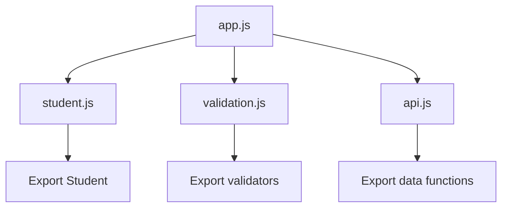
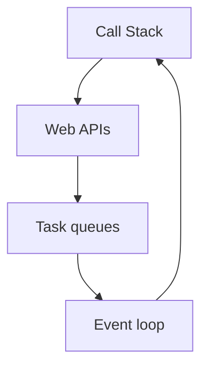

# ⚡ Chapter 24: Modern JavaScript and Error Handling


> [!TIP]
> **Chapter Goal:** Modern JavaScript syntax se clean code likhna, modules me organize karna, asynchronous work handle karna aur errors ko safely manage karna.

---

## 🎯 24.1 Learning Objectives

Is chapter ke baad aap:

- Modern JavaScript features explain kar payenge.
- Template literals, destructuring, spread/rest aur optional chaining use karenge.
- ES modules me code split karenge.
- Synchronous aur asynchronous execution compare karenge.
- Promises aur `async/await` use karenge.
- `try...catch...finally` se errors handle karenge.
- Built-in aur custom errors samjhenge.
- `fetch()` based API viewer practical banayenge.

---

## 🗣️ 24.2 Difficult Words

| Word | Pronunciation | Simple Meaning |
|---|---|---|
| Modern | मॉडर्न — *mod-ern* | New/current approach |
| Module | मॉड्यूल — *mod-yool* | Reusable code file |
| Asynchronous | एसिंक्रोनस — *ay-sing-kruh-nus* | Wait kiye bina other work continue |
| Promise | प्रॉमिस — *prom-is* | Future result represent karne wala object |
| Resolve | रिज़ॉल्व — *ri-zolv* | Promise successful hona |
| Reject | रिजेक्ट — *ri-jekt* | Promise fail hona |
| Exception | एक्सेप्शन — *ik-sep-shun* | Runtime me thrown error |
| Debug | डीबग — *dee-bug* | Problem find aur fix karna |
| Stack Trace | स्टैक ट्रेस — *stak trays* | Error tak function-call path |
| Fallback | फॉलबैक — *fawl-bak* | Main value fail ho to alternative |
| Concurrent | कनकरन्ट — *kun-kur-unt* | Overlapping progress |
| Immutable | इम्यूटेबल — *i-myoo-tuh-bul* | Directly change na hone wala |

---

# 🟦 Part A: Modern JavaScript Syntax

## 24.3 What Is Modern JavaScript?

Modern JavaScript usually ECMAScript 2015 (ES6) aur later additions ko refer karta hai.

Important features:

- `let` and `const`
- Template literals
- Arrow functions
- Default parameters
- Destructuring
- Spread and rest
- Classes
- Modules
- Promises
- `async/await`
- Optional chaining
- Nullish coalescing

Inme se kuch concepts previous chapters me aaye; yahan unhe combined practical style me use karenge.

---

## 24.4 Template Literals

```javascript
const student = "Broun";
const marks = 85;

const message = `${student} scored ${marks} marks.`;
```

Expressions:

```javascript
const result = `Result: ${marks >= 40 ? "Pass" : "Fail"}`;
```

Multi-line:

```javascript
const report = `
Student: ${student}
Marks: ${marks}
`;
```

---

## 24.5 Default Parameters

```javascript
function calculateFee(amount, discount = 0) {
    return amount - amount * discount;
}

calculateFee(1000);       // 1000
calculateFee(1000, 0.1);  // 900
```

Default value missing or `undefined` argument par apply hoti hai.

---

## 24.6 Destructuring

Object:

```javascript
const student = {
    name: "Broun",
    course: "BCA",
    semester: 2
};

const { name, course, semester = 1 } = student;
```

Rename:

```javascript
const { name: studentName } = student;
```

Array:

```javascript
const colors = ["red", "green", "blue"];

const [primary, secondary] = colors;
const [, , thirdColor] = colors;
```

Function parameter:

```javascript
function printStudent({ name, course }) {
    return `${name} studies ${course}.`;
}
```

---

## 24.7 Spread Syntax

Arrays:

```javascript
const frontend = ["HTML", "CSS"];
const fullStack = [...frontend, "JavaScript", "PHP"];

const copy = [...frontend];
```

Objects:

```javascript
const student = { name: "Broun", course: "BCA" };

const updatedStudent = {
    ...student,
    semester: 2
};
```

Later property same key ko overwrite karti hai.

> [!WARNING]
> Spread shallow copy banata hai. Nested objects ki references shared ho sakti hain.

---

## 24.8 Rest Parameters and Rest Properties

Function arguments collect:

```javascript
function addAll(...numbers) {
    return numbers.reduce((total, number) => total + number, 0);
}

addAll(10, 20, 30); // 60
```

Destructuring remaining values:

```javascript
const [first, ...remaining] = [10, 20, 30, 40];

const user = {
    id: 1,
    name: "Broun",
    password: "secret"
};

const { password, ...safeUser } = user;
```

> [!CAUTION]
> Sensitive data ko object se remove karke frontend me manage karna server security ka replacement nahi hai. Server ko sensitive values bhejni hi nahi chahiye when unnecessary.

---

## 24.9 Optional Chaining

```javascript
const city = student.address?.city;
const firstSubject = student.subjects?.[0];
student.printProfile?.();
```

Nullish reference par error ke badle `undefined` milta hai.

---

## 24.10 Nullish Coalescing

```javascript
const displayName = user.name ?? "Guest";
```

`??` only `null` or `undefined` par fallback deta hai.

```javascript
0 || 10;  // 10
0 ?? 10;  // 0

"" || "Default"; // Default
"" ?? "Default"; // ""
```

Valid zero/empty string preserve karna ho to `??` useful hai.

---

## 24.11 Logical Assignment

```javascript
let theme;
theme ??= "light";

let title = "";
title ||= "Untitled";

let enabled = true;
enabled &&= false;
```

- `??=` nullish par assign
- `||=` falsy par assign
- `&&=` truthy par assign

---

## 24.12 Enhanced Object Literals

Property shorthand:

```javascript
const name = "Broun";
const course = "BCA";

const student = { name, course };
```

Computed property:

```javascript
const field = "marks";

const record = {
    [field]: 85
};
```

Method shorthand:

```javascript
const calculator = {
    add(a, b) {
        return a + b;
    }
};
```

---

# 🟩 Part B: Classes

## 24.13 Class Syntax

```javascript
class Student {
    constructor(name, course) {
        this.name = name;
        this.course = course;
    }

    introduce() {
        return `I am ${this.name}, studying ${this.course}.`;
    }
}

const student = new Student("Broun", "BCA");
console.log(student.introduce());
```

Class JavaScript ke prototype-based behavior par cleaner syntax provide karti hai.

---

## 24.14 Inheritance

```javascript
class Person {
    constructor(name) {
        this.name = name;
    }

    introduce() {
        return `My name is ${this.name}.`;
    }
}

class Student extends Person {
    constructor(name, course) {
        super(name);
        this.course = course;
    }

    introduce() {
        return `${super.introduce()} Course: ${this.course}.`;
    }
}
```

- `extends` parent class connect karta hai.
- `super()` parent constructor call karta hai.
- `super.method()` parent method call karta hai.

---

## 24.15 Private Fields

```javascript
class Account {
    #balance = 0;

    deposit(amount) {
        if (amount > 0) {
            this.#balance += amount;
        }
    }

    getBalance() {
        return this.#balance;
    }
}
```

`#balance` class ke outside directly accessible nahi hai.

---

## 24.16 Static Methods

```javascript
class Validator {
    static isPassing(mark) {
        return mark >= 40;
    }
}

Validator.isPassing(75); // true
```

Static method instance ke bajay class par call hota hai.

---

# 🟨 Part C: ES Modules

## 24.17 Why Modules?

Modules help:

- Code ko small files me divide karna
- Reuse
- Clear dependencies
- Name collisions reduce karna
- Maintenance/testing improve karna



---

## 24.18 Named Exports and Imports

`math.js`:

```javascript
export function add(a, b) {
    return a + b;
}

export const PI = 3.14159;
```

`app.js`:

```javascript
import { add, PI } from "./math.js";

console.log(add(10, 20));
console.log(PI);
```

Rename import:

```javascript
import { add as calculateTotal } from "./math.js";
```

---

## 24.19 Default Export

`student.js`:

```javascript
export default class Student {
    constructor(name) {
        this.name = name;
    }
}
```

`app.js`:

```javascript
import Student from "./student.js";
```

One module can have only one default export, but many named exports.

---

## 24.20 Loading a Module

```html
<script type="module" src="app.js"></script>
```

Module behavior:

- Strict mode automatically
- Own module scope
- Deferred by default
- Imports use exact paths
- Usually served through HTTP, not simply unreliable `file://` opening

Development server use karein.

---

## 24.21 Dynamic Import

```javascript
const button = document.querySelector("#load-chart");

button.addEventListener("click", async () => {
    const chartModule = await import("./chart.js");
    chartModule.drawChart();
});
```

Feature needed hone par module load kar sakte hain.

---

# 🟪 Part D: Asynchronous JavaScript

## 24.22 Synchronous Execution

```javascript
console.log("First");
console.log("Second");
console.log("Third");
```

Statements order me execute hote hain.

---

## 24.23 Asynchronous Execution

```javascript
console.log("Start");

setTimeout(() => {
    console.log("Timer complete");
}, 1000);

console.log("End");
```

Likely output:

```text
Start
End
Timer complete
```

Timer main code ko block nahi karta. Callback later scheduled hota hai.

---

## 24.24 Event Loop: Beginner View



Simplified idea:

1. Synchronous code call stack par runs.
2. Browser async operations manage karta hai.
3. Ready callbacks queues me aate hain.
4. Event loop stack empty hone par eligible work run karwata hai.

> [!NOTE]
> Promises ke reactions microtask queue me schedule hote hain, jo typical timer tasks se pehle process hoti hai after current synchronous work.

---

# 🟥 Part E: Promises

## 24.25 What Is a Promise?

Promise future asynchronous result represent karta hai.

States:

1. Pending
2. Fulfilled
3. Rejected

Once settled, promise state change nahi hoti.

---

## 24.26 Creating a Promise

```javascript
const resultPromise = new Promise((resolve, reject) => {
    const success = true;

    if (success) {
        resolve("Data loaded");
    } else {
        reject(new Error("Loading failed"));
    }
});
```

Normally APIs already promises return karti hain; har operation ke liye manually promise banana needed nahi.

---

## 24.27 Consuming a Promise

```javascript
resultPromise
    .then(result => {
        console.log(result);
    })
    .catch(error => {
        console.error(error.message);
    })
    .finally(() => {
        console.log("Operation finished");
    });
```

- `then()` fulfillment handle
- `catch()` rejection handle
- `finally()` settlement ke baad cleanup

---

## 24.28 Promise Chaining

```javascript
fetch("/api/student")
    .then(response => {
        if (!response.ok) {
            throw new Error(`HTTP ${response.status}`);
        }

        return response.json();
    })
    .then(student => {
        console.log(student.name);
    })
    .catch(error => {
        console.error(error.message);
    });
```

> [!IMPORTANT]
> `fetch()` HTTP 404/500 par automatically reject normally nahi karta. `response.ok` manually check karein.

---

## 24.29 Promise Combinators

### `Promise.all()`

```javascript
const [student, courses] = await Promise.all([
    fetchStudent(),
    fetchCourses()
]);
```

All fulfill hone par results; any one reject hone par combined promise rejects.

### `Promise.allSettled()`

```javascript
const results = await Promise.allSettled([
    fetchStudent(),
    fetchCourses()
]);
```

Every promise ka final status deta hai.

### `Promise.race()`

First settled promise ka outcome.

### `Promise.any()`

First fulfilled promise; all reject ho to aggregate rejection.

---

# 🟧 Part F: Async and Await

## 24.30 `async` Functions

```javascript
async function getMessage() {
    return "Hello";
}

getMessage().then(console.log);
```

`async` function always promise return karti hai.

---

## 24.31 Using `await`

```javascript
async function loadStudent() {
    const response = await fetch("/api/student");

    if (!response.ok) {
        throw new Error(`HTTP error: ${response.status}`);
    }

    const student = await response.json();
    return student;
}
```

`await` surrounding async function ko suspend karta hai; entire browser thread ko freeze nahi karta.

---

## 24.32 Sequential vs Concurrent Await

Sequential:

```javascript
const student = await fetchStudent();
const courses = await fetchCourses();
```

If independent, concurrent start better:

```javascript
const studentPromise = fetchStudent();
const coursesPromise = fetchCourses();

const [student, courses] = await Promise.all([
    studentPromise,
    coursesPromise
]);
```

Dependent operations sequential honi chahiye.

---

# 🟫 Part G: Error Handling

## 24.33 Types of Errors

### Syntax Error

```javascript
if (true {
    console.log("Missing parenthesis");
}
```

Code parse nahi hota.

### Reference Error

```javascript
console.log(unknownVariable);
```

### Type Error

```javascript
const value = null;
value.toUpperCase();
```

### Range Error

```javascript
const array = new Array(-1);
```

### Logical Error

Program runs, but result wrong:

```javascript
const average = total / (subjectCount - 1);
```

Logical errors automatically throw zaroori nahi.

---

## 24.34 `try...catch`

```javascript
try {
    const data = JSON.parse('{"name":"Broun"}');
    console.log(data.name);
} catch (error) {
    console.error("Could not parse data:", error.message);
}
```

Only expected risky code ko `try` me rakhein.

---

## 24.35 `finally`

```javascript
let loading = true;

try {
    await loadStudent();
} catch (error) {
    console.error(error);
} finally {
    loading = false;
    hideLoadingIndicator();
}
```

`finally` success or error dono cases ke baad runs, usually cleanup ke liye.

---

## 24.36 Throwing Errors

```javascript
function calculatePercentage(total, maximum) {
    if (maximum <= 0) {
        throw new RangeError(
            "Maximum marks must be greater than zero."
        );
    }

    return (total / maximum) * 100;
}
```

Throw meaningful `Error` object rather than plain string.

---

## 24.37 Custom Error Class

```javascript
class ValidationError extends Error {
    constructor(message, field) {
        super(message);
        this.name = "ValidationError";
        this.field = field;
    }
}

function validateMarks(marks) {
    if (marks < 0 || marks > 100) {
        throw new ValidationError(
            "Marks must be from 0 to 100.",
            "marks"
        );
    }
}
```

Handle by type:

```javascript
try {
    validateMarks(120);
} catch (error) {
    if (error instanceof ValidationError) {
        console.log(error.field, error.message);
    } else {
        throw error;
    }
}
```

Unknown error ko silently hide na karein.

---

## 24.38 Error Properties and Stack

```javascript
try {
    riskyOperation();
} catch (error) {
    console.error(error.name);
    console.error(error.message);
    console.error(error.stack);
}
```

Stack trace development/debugging me useful hai. Users ko raw internal stack trace dikhana avoid karein.

---

## 24.39 Handling Async Errors

`async/await`:

```javascript
async function loadData() {
    try {
        const response = await fetch("/api/data");

        if (!response.ok) {
            throw new Error(`Request failed: ${response.status}`);
        }

        return await response.json();
    } catch (error) {
        console.error("Load failed:", error.message);
        throw error;
    }
}
```

Promise chain:

```javascript
loadData().catch(error => {
    showError(error.message);
});
```

Every promise rejection ko intentionally handle or return karein.

---

## 24.40 User-Friendly Error Messages

Developer log:

```text
TypeError: Cannot read properties of undefined at app.js:42
```

User message:

```text
We could not load the student record. Please try again.
```

Good strategy:

- User ko actionable message
- Developer ko technical context/log
- Sensitive data log na karein
- Retry where safe
- Loading state always clear karein

---

# 🟦 Part H: Complete API Viewer Practical

## 24.41 Project Structure

```text
api-viewer/
├── index.html
├── styles.css
└── js/
    ├── api.js
    ├── ui.js
    └── app.js
```

---

## 24.42 HTML

```html
<!DOCTYPE html>
<html lang="en">
<head>
    <meta charset="UTF-8">
    <meta name="viewport" content="width=device-width, initial-scale=1.0">
    <title>User Profile Viewer</title>
    <link rel="stylesheet" href="styles.css">
    <script type="module" src="js/app.js"></script>
</head>
<body>
    <main class="app">
        <h1>👤 User Profile Viewer</h1>

        <form id="user-form">
            <label for="user-id">User ID (1–10)</label>
            <input
                id="user-id"
                type="number"
                min="1"
                max="10"
                value="1"
                required>
            <button type="submit">Load User</button>
        </form>

        <p id="status" role="status"></p>
        <section id="profile" aria-live="polite"></section>
    </main>
</body>
</html>
```

---

## 24.43 API Module

`js/api.js`:

```javascript
const API_BASE = "https://jsonplaceholder.typicode.com";

export class HttpError extends Error {
    constructor(message, status) {
        super(message);
        this.name = "HttpError";
        this.status = status;
    }
}

export async function fetchUser(userId) {
    const response = await fetch(
        `${API_BASE}/users/${userId}`
    );

    if (!response.ok) {
        throw new HttpError(
            "The requested user could not be loaded.",
            response.status
        );
    }

    return response.json();
}
```

---

## 24.44 UI Module

`js/ui.js`:

```javascript
const status = document.querySelector("#status");
const profile = document.querySelector("#profile");

export function showLoading() {
    status.textContent = "Loading user…";
    profile.replaceChildren();
}

export function showError(message) {
    status.textContent = message;
    profile.replaceChildren();
}

export function showUser({
    name,
    email,
    phone,
    company: { name: companyName } = {}
}) {
    status.textContent = "User loaded successfully.";
    profile.replaceChildren();

    const heading = document.createElement("h2");
    heading.textContent = name ?? "Unknown user";

    const details = document.createElement("p");
    details.textContent =
        `Email: ${email ?? "Not available"} | ` +
        `Phone: ${phone ?? "Not available"} | ` +
        `Company: ${companyName ?? "Not available"}`;

    profile.append(heading, details);
}
```

---

## 24.45 App Module

`js/app.js`:

```javascript
import { fetchUser, HttpError } from "./api.js";
import {
    showLoading,
    showError,
    showUser
} from "./ui.js";

const form = document.querySelector("#user-form");
const idInput = document.querySelector("#user-id");
const submitButton = form.querySelector("button");

form.addEventListener("submit", async event => {
    event.preventDefault();

    const userId = Number(idInput.value);

    if (!Number.isInteger(userId) || userId < 1 || userId > 10) {
        showError("Enter a whole-number ID from 1 to 10.");
        return;
    }

    submitButton.disabled = true;
    showLoading();

    try {
        const user = await fetchUser(userId);
        showUser(user);
    } catch (error) {
        if (error instanceof HttpError && error.status === 404) {
            showError("No user was found with that ID.");
        } else {
            showError(
                "Unable to load the user. Check your connection and retry."
            );
        }

        console.error(error);
    } finally {
        submitButton.disabled = false;
    }
});
```

---

## 24.46 Project Explanation

1. `type="module"` app ko modules me load karta hai.
2. Named exports dependencies clear karte hain.
3. `fetchUser()` promise-returning async function hai.
4. HTTP status manually check hota hai.
5. Custom `HttpError` status preserve karta hai.
6. `await` asynchronous code readable banata hai.
7. `try/catch` expected request errors handle karta hai.
8. `finally` button state restore karta hai.
9. Destructuring response properties unpack karti hai.
10. Default nested object destructuring missing company handle karta hai.
11. Nullish coalescing fallback text provide karta hai.
12. `textContent` remote data ko safe text ke roop me render karta hai.

> [!NOTE]
> Public demo API learning ke liye hai. Production API rules, authentication, privacy, timeout, retry and rate limits separately handle karne honge.

---

## 🚫 24.47 Common Mistakes

1. `var` use karna when `const`/`let` better ho.
2. Spread ko deep clone samajhna.
3. Optional chaining se required-data bugs hide karna.
4. `||` se valid zero/empty value replace karna.
5. Import path me extension bhoolna.
6. Module ko `file://` se run karna.
7. Independent awaits ko unnecessarily sequential rakhna.
8. Promise return/await bhoolna.
9. Rejection ko handle na karna.
10. `fetch()` par HTTP error automatic rejection expect karna.
11. Too-broad `try` block.
12. Empty `catch` se error silently swallow karna.
13. Plain string throw karna.
14. User ko raw stack trace dikhana.
15. `finally` me state cleanup bhoolna.
16. Remote/user content ko `innerHTML` me inject karna.

---

## 📌 24.48 Best Practices

- `const` by default, `let` for reassignment.
- Clear modern syntax use karein, clever code nahi.
- Modules ko single responsibility dein.
- Named imports/exports consistent rakhein.
- Async operations ke loading, success, empty and error states design karein.
- HTTP `response.ok` check karein.
- Independent async work ko `Promise.all()` se coordinate karein where appropriate.
- Meaningful Error objects throw karein.
- Expected errors handle, unexpected errors log/rethrow karein.
- Users ko simple actionable feedback dein.
- Sensitive information logs me na rakhein.
- Cleanup `finally` me karein.

---

## 📝 24.49 Chapter Summary

Modern JavaScript destructuring, spread/rest, optional chaining, nullish coalescing, classes and modules se concise, maintainable code support karti hai. Modules explicit exports/imports ke through files connect karte hain. Asynchronous operations future results ko promises se represent karti hain. `async/await` promise-based code ko readable banata hai. Errors syntax, reference, type, range or logic related ho sakte hain. `try...catch...finally` failures handle and cleanup manage karta hai. Custom Error classes domain-specific context add karti hain. Robust applications loading, success and failure states clearly handle karti hain.

---

## 🎲 24.50 MCQs

1. Null/undefined fallback?  
   A. `||` only · **B. `??`** · C. `&&` · D. `?.`

2. Remaining arguments collect?  
   A. Spread only · **B. Rest parameter** · C. Import · D. Class

3. Module load attribute?  
   A. `defer-module` · **B. `type="module"`** · C. `module="true"` · D. `async-module`

4. Promise success state?  
   A. Pending · **B. Fulfilled** · C. Rejected · D. Caught

5. `async` function returns?  
   A. String always · **B. Promise** · C. Array · D. Event

6. Cleanup block?  
   A. `else` · **B. `finally`** · C. `default` · D. `then`

7. HTTP 404 with fetch normally?  
   A. Always rejects · **B. Response resolves; check `ok`** · C. Syntax error · D. Browser closes

8. Custom error should extend?  
   A. Promise · **B. Error** · C. Object only · D. Event

---

## ✍️ 24.51 Fill in the Blanks

1. Future async result represent karne wala object __________.
2. Promise successful hone ko __________ kehte hain.
3. Promise value wait karne ka keyword __________.
4. Error throw karne ka keyword __________.
5. Success/failure dono ke baad cleanup block __________.

<details>
<summary><strong>✅ Answers</strong></summary>

1. Promise  
2. fulfilled/resolved  
3. `await`  
4. `throw`  
5. `finally`

</details>

---

## ✅ 24.52 True or False

1. Spread always deep copy banata hai — **False**
2. Modules have their own scope — **True**
3. Async function always promise return karti hai — **True**
4. Await entire browser freeze karta hai — **False**
5. Fetch every HTTP error par reject karta hai — **False**
6. Finally only success par runs — **False**
7. Logical error necessarily exception throw karta hai — **False**
8. Custom errors Error extend kar sakte hain — **True**

---

## ❓ 24.53 Exam Questions

### Short Answer

1. Modern JavaScript kya hai?
2. Explain destructuring.
3. Spread aur rest me difference?
4. Optional chaining and nullish coalescing explain karein.
5. ES module kya hai?
6. Promise states list karein.
7. `async` and `await` explain karein.
8. Differentiate synchronous and asynchronous execution.
9. Explain `try...catch...finally`.
10. Custom error class kya hai?

### Long Answer

1. Explain modern JavaScript syntax with examples.
2. Describe classes and inheritance.
3. Explain ES modules and dynamic imports.
4. Explain asynchronous JavaScript and event loop.
5. Discuss promises and combinators.
6. Explain async/await with error handling.
7. Describe JavaScript error types and custom errors.
8. Build and explain the modular API viewer.

---

## 🧪 24.54 Practical Exercises

1. Object and array destructuring examples banayein.
2. Spread se immutable-style update karein.
3. Rest-parameter calculator banayein.
4. Student class with method banayein.
5. Inherited GraduateStudent class banayein.
6. Math utilities ko module me export/import karein.
7. Timer promise banayein.
8. Promise chain ko async/await me rewrite karein.
9. Independent promises with `Promise.all()` run karein.
10. JSON parse error handle karein.
11. ValidationError class create karein.
12. API viewer me retry button and timeout add karein.

---

## 🎤 24.55 Viva Questions

1. ES6 kya hai?
2. Destructuring kya hai?
3. Spread and rest syntax same dots hote hue different kaise?
4. Optional chaining kya return karti hai?
5. `??` and `||` me difference?
6. Class constructor kya karta hai?
7. Module ka benefit?
8. Named vs default export?
9. Promise ki three states?
10. `async` function kya return karti hai?
11. Await kya karta hai?
12. Fetch response.ok kyun check karte hain?
13. Try-catch kya karta hai?
14. Finally ka use?
15. Custom error kyun banate hain?

---

## 🏁 24.56 One-Minute Revision

| Question | Quick Answer |
|---|---|
| Unpack values? | Destructuring |
| Expand/copy? | Spread |
| Collect values? | Rest |
| Safe nested access? | `?.` |
| Nullish fallback? | `??` |
| Reusable code file? | Module |
| Export/import loader? | `type="module"` |
| Future result? | Promise |
| Success handler? | `then()` |
| Failure handler? | `catch()` |
| Promise wait? | `await` |
| Handle exception? | `try...catch` |
| Cleanup? | `finally` |
| Create exception? | `throw` |
| HTTP success check? | `response.ok` |

---

## 📚 24.57 Official References

1. [MDN — JavaScript Guide](https://developer.mozilla.org/docs/Web/JavaScript/Guide)
2. [MDN — JavaScript Modules](https://developer.mozilla.org/docs/Web/JavaScript/Guide/Modules)
3. [MDN — Using Promises](https://developer.mozilla.org/docs/Web/JavaScript/Guide/Using_promises)
4. [MDN — Async Function](https://developer.mozilla.org/docs/Web/JavaScript/Reference/Statements/async_function)
5. [MDN — Control Flow and Error Handling](https://developer.mozilla.org/docs/Web/JavaScript/Guide/Control_flow_and_error_handling)

---

[⬅️ Previous Chapter](23-form-validation.md) · [📚 Table of Contents](../SUMMARY.md) · **Next: Bootstrap Fundamentals ➡️**
