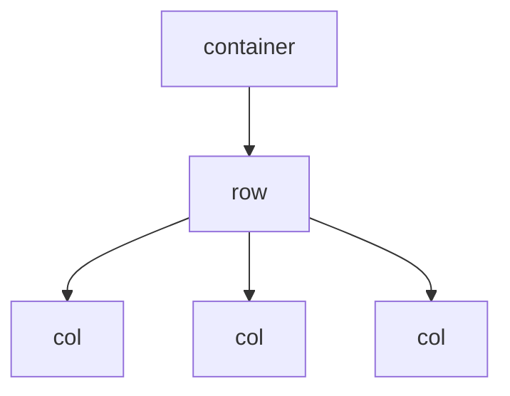

# 🅱️ Chapter 25: Bootstrap Fundamentals


> [!TIP]
> **Chapter Goal:** Bootstrap 5.3 ke grid, utilities, forms aur components se responsive website quickly banana aur custom CSS se apni design identity maintain karna.

> [!NOTE]
> Examples current Bootstrap **5.3.8** documentation ke according hain. Future version me CDN URLs or classes verify karein.

---

## 🎯 25.1 Learning Objectives

Is chapter ke baad aap:

- Bootstrap aur CSS framework explain kar payenge.
- CDN or package manager se Bootstrap add karenge.
- Containers, breakpoints aur 12-column grid use karenge.
- Spacing, display, flex, color and sizing utilities apply karenge.
- Buttons, cards, alerts, tables and forms style karenge.
- Responsive navbar, accordion and modal use karenge.
- Bootstrap ko accessible aur semantic HTML ke saath use karenge.
- Responsive BCA portfolio page bana payenge.

---

## 🗣️ 25.2 Difficult Words

| Word | Pronunciation | Simple Meaning |
|---|---|---|
| Framework | फ्रेमवर्क — *fraym-wurk* | Ready structure and tools |
| Toolkit | टूलकिट — *tool-kit* | Reusable tools ka collection |
| Component | कम्पोनेंट — *kum-poh-nent* | Ready UI part |
| Utility | यूटिलिटी — *yoo-til-i-tee* | One-purpose helper class |
| Responsive | रिस्पॉन्सिव — *ri-spon-siv* | Screen ke according adjust |
| Breakpoint | ब्रेकपॉइंट — *brayk-point* | Layout-change screen width |
| Container | कंटेनर — *kun-tay-ner* | Content wrapper |
| Gutter | गटर — *gut-er* | Columns ke beech gap |
| Customize | कस्टमाइज — *kus-tuh-maiz* | Apne according change |
| CDN | सी-डी-एन | Remote content delivery network |
| Bundle | बंडल — *bun-dul* | Combined JavaScript package |
| Sass | सैस — *sas* | CSS preprocessor |

---

# 🟦 Part A: Bootstrap Introduction

## 25.3 What Is Bootstrap?

Bootstrap ek feature-rich front-end toolkit hai. Isme ready CSS classes aur JavaScript components milte hain for:

- Responsive layout
- Typography
- Forms
- Buttons
- Cards
- Navigation
- Modals
- Accordions
- Utilities

Bootstrap website instantly “complete” nahi banata. Good semantic HTML, content, accessibility aur custom design decisions phir bhi needed hain.

---

## 25.4 Advantages

1. Rapid development
2. Mobile-first grid
3. Consistent reusable classes
4. Common components
5. Responsive utilities
6. Strong documentation
7. Customization with CSS variables and Sass

## 25.5 Limitations

1. Unchanged defaults se websites similar lag sakti hain.
2. Extra CSS/JS unused ho sakta hai.
3. Many classes markup ko crowded bana sakti hain.
4. Framework knowledge basic CSS ka replacement nahi.
5. Incorrect components accessibility issues create kar sakte hain.

---

## 25.6 Bootstrap 5 Important Changes

Bootstrap 5:

- jQuery dependency use nahi karta.
- JavaScript components vanilla JavaScript par work karte hain.
- `data-bs-*` attributes use karta hai.
- Six responsive breakpoints provide karta hai.
- CSS custom properties ka growing use karta hai.
- RTL and color modes support karta hai.

> [!WARNING]
> Bootstrap 4 tutorials ke `data-toggle`, `data-target`, `ml-*` or `mr-*` examples ko Bootstrap 5 code me blindly copy na karein.

---

# 🟩 Part B: Setup

## 25.7 CDN Setup

```html
<!doctype html>
<html lang="en">
<head>
    <meta charset="utf-8">
    <meta name="viewport"
          content="width=device-width, initial-scale=1">

    <title>Bootstrap Demo</title>

    <link
        href="https://cdn.jsdelivr.net/npm/bootstrap@5.3.8/dist/css/bootstrap.min.css"
        rel="stylesheet"
        integrity="sha384-sRIl4kxILFvY47J16cr9ZwB07vP4J8+LH7qKQnuqkuIAvNWLzeN8tE5YBujZqJLB"
        crossorigin="anonymous">
</head>
<body>
    <h1 class="text-center text-primary">Hello Bootstrap!</h1>

    <script
        src="https://cdn.jsdelivr.net/npm/bootstrap@5.3.8/dist/js/bootstrap.bundle.min.js"
        integrity="sha384-FKyoEForCGlyvwx9Hj09JcYn3nv7wiPVlz7YYwJrWVcXK/BmnVDxM+D2scQbITxI"
        crossorigin="anonymous">
    </script>
</body>
</html>
```

Bundle me Popper included hota hai, jo dropdowns, tooltips/popovers jaise positioned components ke liye used hota hai.

> [!IMPORTANT]
> Version update karte waqt CDN URL aur matching `integrity` hash dono official docs se update karein.

---

## 25.8 Download or npm Setup

Install:

```bash
npm install bootstrap@5.3.8
```

JavaScript module:

```javascript
import "bootstrap";
import "bootstrap/dist/css/bootstrap.min.css";
```

Actual bundler configuration tool ke according differ karegi.

### CDN vs Local/npm

| CDN | Local/npm |
|---|---|
| Fast beginner setup | Build tools ke saath suitable |
| Internet needed on first uncached load | Dependency project me controlled |
| Full ready files | Selective/custom build possible |
| Simple prototype | Production customization |

---

## 25.9 Correct File Order

```html
<link rel="stylesheet" href="bootstrap.min.css">
<link rel="stylesheet" href="styles.css">
```

Custom stylesheet Bootstrap ke baad load karein so normal cascade me your overrides later aa sakein.

---

# 🟨 Part C: Containers and Breakpoints

## 25.10 Containers

Fixed responsive container:

```html
<div class="container">
    <p>Centered responsive content</p>
</div>
```

Full-width:

```html
<div class="container-fluid">
    <p>Full viewport width</p>
</div>
```

Breakpoint container:

```html
<div class="container-lg">
    <p>Fluid before lg, constrained from lg onward</p>
</div>
```

---

## 25.11 Mobile-First Breakpoints

Bootstrap 5.3 default breakpoints:

| Name | Class Infix | Minimum Width |
|---|---|---:|
| Extra small | None | Below 576px |
| Small | `sm` | 576px |
| Medium | `md` | 768px |
| Large | `lg` | 992px |
| Extra large | `xl` | 1200px |
| Extra extra large | `xxl` | 1400px |

Classes min-width based hoti hain. Example `col-md-6` medium aur usse larger widths par 6 columns leta hai unless later breakpoint override kare.

---

# 🟪 Part D: Grid System

## 25.12 Grid Structure

Bootstrap grid containers, rows aur columns use karta hai.

```html
<div class="container">
    <div class="row">
        <div class="col">Column 1</div>
        <div class="col">Column 2</div>
        <div class="col">Column 3</div>
    </div>
</div>
```



Rules:

1. Grid ko container me rakhein.
2. Columns normally row ke direct children hote hain.
3. Content columns ke andar rakhein.
4. Grid 12 logical columns use karta hai.
5. Gutters columns ke beech spacing provide karte hain.

---

## 25.13 Twelve-Column Grid

```html
<div class="row">
    <div class="col-4">4/12</div>
    <div class="col-8">8/12</div>
</div>
```

Total 12. More than 12 column units next line wrap kar sakte hain.

---

## 25.14 Responsive Columns

```html
<div class="row g-4">
    <div class="col-12 col-md-6 col-lg-4">
        Card 1
    </div>
    <div class="col-12 col-md-6 col-lg-4">
        Card 2
    </div>
    <div class="col-12 col-md-6 col-lg-4">
        Card 3
    </div>
</div>
```

Behavior:

- Extra-small: 1 card per row
- Medium: 2 per row
- Large: 3 per row

---

## 25.15 Row Columns

```html
<div class="row row-cols-1 row-cols-md-2 row-cols-lg-4 g-3">
    <div class="col">One</div>
    <div class="col">Two</div>
    <div class="col">Three</div>
    <div class="col">Four</div>
</div>
```

Parent row classes number of columns per row control karti hain.

---

## 25.16 Gutters

```html
<div class="row g-4">...</div>
<div class="row gx-5 gy-2">...</div>
```

- `g-*` both axes
- `gx-*` horizontal
- `gy-*` vertical
- Values commonly `0` to `5`

---

## 25.17 Alignment and Ordering

Vertical alignment:

```html
<div class="row align-items-center">
```

Horizontal alignment:

```html
<div class="row justify-content-center">
```

Order:

```html
<div class="col order-2 order-md-1">Main</div>
<div class="col order-1 order-md-2">Sidebar</div>
```

> [!CAUTION]
> Visual order ko DOM reading order se very different banana keyboard/screen-reader experience confuse kar sakta hai.

---

## 25.18 Offset Columns

```html
<div class="row">
    <div class="col-md-6 offset-md-3">
        Centered six-column content
    </div>
</div>
```

---

# 🟥 Part E: Utility Classes

## 25.19 Spacing Utilities

Format:

```text
{property}{side}-{size}
{property}{side}-{breakpoint}-{size}
```

Properties:

- `m` margin
- `p` padding

Sides:

- `t` top
- `b` bottom
- `s` start
- `e` end
- `x` horizontal
- `y` vertical
- no side = all

Examples:

```html
<section class="mt-4 p-3">
<div class="mx-auto">
<div class="p-2 p-md-4">
```

Bootstrap 5 logical `s`/`e` uses start/end instead of left/right.

---

## 25.20 Color Utilities

```html
<p class="text-primary">Primary text</p>
<p class="text-success">Success text</p>
<div class="text-bg-dark p-3">Dark background</div>
```

Common contextual names:

- primary
- secondary
- success
- danger
- warning
- info
- light
- dark

> [!WARNING]
> Color alone meaning communicate na karein. Text/icon/label bhi use karein, and contrast verify karein.

---

## 25.21 Display Utilities

```html
<div class="d-none d-md-block">
    Visible from medium screens
</div>

<div class="d-block d-lg-none">
    Hidden from large screens
</div>
```

Accessibility-important content ko simply hide karne se pehle impact consider karein.

---

## 25.22 Flex Utilities

```html
<div class="d-flex justify-content-between align-items-center gap-3">
    <span>Logo</span>
    <nav>Navigation</nav>
</div>
```

Responsive:

```html
<div class="d-flex flex-column flex-md-row gap-3">
```

Useful classes:

- `d-flex`
- `flex-row` / `flex-column`
- `justify-content-*`
- `align-items-*`
- `flex-wrap`
- `gap-*`

---

## 25.23 Sizing, Borders and Shadows

```html
<div class="w-75 border rounded-3 shadow p-4">
    Styled box
</div>
```

Examples:

- `w-25`, `w-50`, `w-75`, `w-100`
- `border`, `border-0`
- `rounded`, `rounded-circle`
- `shadow-sm`, `shadow`, `shadow-lg`

---

## 25.24 Typography Utilities

```html
<h1 class="display-4 fw-bold">Portfolio</h1>
<p class="lead text-body-secondary">BCA Web Developer</p>
<p class="text-center text-md-start">Responsive text alignment</p>
```

Other utilities:

- `fs-*` font size
- `fw-bold` / `fw-semibold`
- `fst-italic`
- `text-uppercase`
- `text-decoration-none`
- `lh-*` line height

---

## 25.25 Images and Ratios

Responsive image:

```html

```

Thumbnail:

```html

```

Responsive video:

```html
<div class="ratio ratio-16x9">
    <iframe src="..." title="Project demonstration"></iframe>
</div>
```

---

# 🟧 Part F: Content and Forms

## 25.26 Tables

```html
<div class="table-responsive">
    <table class="table table-striped table-hover align-middle">
        <caption>Semester marks</caption>
        <thead class="table-dark">
            <tr>
                <th scope="col">Subject</th>
                <th scope="col">Marks</th>
            </tr>
        </thead>
        <tbody>
            <tr>
                <td>Web Technology</td>
                <td>88</td>
            </tr>
        </tbody>
    </table>
</div>
```

`table-responsive` small screens par horizontal scrolling provide karta hai.

---

## 25.27 Form Controls

```html
<div class="mb-3">
    <label for="email" class="form-label">Email address</label>
    <input
        type="email"
        class="form-control"
        id="email"
        aria-describedby="email-help">
    <div id="email-help" class="form-text">
        We will not share your email.
    </div>
</div>
```

Select:

```html
<select class="form-select" aria-label="Choose course">
    <option selected>Choose course</option>
    <option value="bca">BCA</option>
</select>
```

Checkbox:

```html
<div class="form-check">
    <input class="form-check-input" type="checkbox" id="terms">
    <label class="form-check-label" for="terms">
        Accept terms
    </label>
</div>
```

---

## 25.28 Input Groups

```html
<div class="input-group">
    <span class="input-group-text">@</span>
    <input
        type="text"
        class="form-control"
        aria-label="Username">
</div>
```

Visible label still preferable where context needs it.

---

## 25.29 Validation Styles

```html
<input class="form-control is-valid" aria-describedby="valid-feedback">
<div id="valid-feedback" class="valid-feedback">
    Looks good!
</div>

<input class="form-control is-invalid"
       aria-invalid="true"
       aria-describedby="invalid-feedback">
<div id="invalid-feedback" class="invalid-feedback">
    Enter a valid value.
</div>
```

Client and server validation Chapter 23 ke rules still apply.

---

# 🟫 Part G: Components

## 25.30 Buttons

```html
<button class="btn btn-primary">Primary</button>
<button class="btn btn-outline-success">Success</button>
<button class="btn btn-danger btn-sm">Delete</button>
<a class="btn btn-secondary" href="#" role="button">Open</a>
```

Action ke liye button, navigation ke liye link semantic element use karein.

---

## 25.31 Alerts and Badges

```html
<div class="alert alert-success" role="alert">
    Registration successful.
</div>

<span class="badge text-bg-primary">New</span>
```

Dismissible alert requires Bootstrap JS:

```html
<div class="alert alert-warning alert-dismissible fade show" role="alert">
    Check your details.
    <button
        type="button"
        class="btn-close"
        data-bs-dismiss="alert"
        aria-label="Close">
    </button>
</div>
```

---

## 25.32 Cards

```html
<article class="card h-100 shadow-sm">
    

    <div class="card-body">
        <h2 class="card-title h5">Student Portal</h2>
        <p class="card-text">
            Responsive portal created with HTML, CSS and JavaScript.
        </p>
        <a href="#" class="btn btn-primary">View Project</a>
    </div>
</article>
```

`h-100` grid cards equal height banane me help kar sakta hai.

---

## 25.33 Navbar

```html
<nav class="navbar navbar-expand-lg bg-dark" data-bs-theme="dark">
    <div class="container">
        <a class="navbar-brand" href="#">Broun.dev</a>

        <button
            class="navbar-toggler"
            type="button"
            data-bs-toggle="collapse"
            data-bs-target="#main-nav"
            aria-controls="main-nav"
            aria-expanded="false"
            aria-label="Toggle navigation">
            <span class="navbar-toggler-icon"></span>
        </button>

        <div class="collapse navbar-collapse" id="main-nav">
            <ul class="navbar-nav ms-auto">
                <li class="nav-item">
                    <a class="nav-link active"
                       aria-current="page"
                       href="#home">Home</a>
                </li>
                <li class="nav-item">
                    <a class="nav-link" href="#projects">Projects</a>
                </li>
                <li class="nav-item">
                    <a class="nav-link" href="#contact">Contact</a>
                </li>
            </ul>
        </div>
    </div>
</nav>
```

Navbar collapse ke liye Bootstrap JavaScript bundle needed hai.

---

## 25.34 Accordion

```html
<div class="accordion" id="faq">
    <div class="accordion-item">
        <h2 class="accordion-header">
            <button
                class="accordion-button"
                type="button"
                data-bs-toggle="collapse"
                data-bs-target="#answer-one"
                aria-expanded="true"
                aria-controls="answer-one">
                What is Bootstrap?
            </button>
        </h2>

        <div
            id="answer-one"
            class="accordion-collapse collapse show"
            data-bs-parent="#faq">
            <div class="accordion-body">
                Bootstrap is a front-end toolkit.
            </div>
        </div>
    </div>
</div>
```

IDs and `aria-controls` correctly match hone chahiye.

---

## 25.35 Modal

Trigger:

```html
<button
    class="btn btn-primary"
    data-bs-toggle="modal"
    data-bs-target="#contact-modal">
    Contact Me
</button>
```

Modal:

```html
<div
    class="modal fade"
    id="contact-modal"
    tabindex="-1"
    aria-labelledby="contact-title"
    aria-hidden="true">
    <div class="modal-dialog">
        <div class="modal-content">
            <div class="modal-header">
                <h2 class="modal-title fs-5" id="contact-title">
                    Contact
                </h2>
                <button
                    type="button"
                    class="btn-close"
                    data-bs-dismiss="modal"
                    aria-label="Close">
                </button>
            </div>
            <div class="modal-body">
                Email: student@example.com
            </div>
        </div>
    </div>
</div>
```

> [!CAUTION]
> Modal me necessary content hi rakhein. Complex or long workflows normal page par often better hote hain.

---

## 25.36 Spinner and Progress

```html
<div class="spinner-border text-primary" role="status">
    <span class="visually-hidden">Loading...</span>
</div>
```

Progress:

```html
<div
    class="progress"
    role="progressbar"
    aria-label="Course progress"
    aria-valuenow="70"
    aria-valuemin="0"
    aria-valuemax="100">
    <div class="progress-bar" style="width: 70%">70%</div>
</div>
```

---

# 🟦 Part H: Customization

## 25.37 Custom CSS

```css
:root {
    --brand-color: #6d28d9;
}

.hero {
    background:
        linear-gradient(135deg, rgb(109 40 217 / 95%), rgb(37 99 235 / 90%));
}

.btn-brand {
    --bs-btn-bg: var(--brand-color);
    --bs-btn-border-color: var(--brand-color);
    --bs-btn-color: white;
}
```

Framework utilities aur project-specific classes ko balanced way me combine karein.

---

## 25.38 Color Modes

Bootstrap 5.3 color modes support karta hai.

```html
<html lang="en" data-bs-theme="dark">
```

Specific section:

```html
<section data-bs-theme="dark" class="bg-body p-4">
```

Theme toggle JavaScript:

```javascript
const themeButton = document.querySelector("#theme-button");

themeButton.addEventListener("click", () => {
    const root = document.documentElement;
    const nextTheme =
        root.dataset.bsTheme === "dark" ? "light" : "dark";

    root.dataset.bsTheme = nextTheme;
});
```

---

## 25.39 Bootstrap Icons

Bootstrap Icons separate library hai; core Bootstrap CSS me automatically included nahi hoti. Official Icons package/CDN separately add karna hota hai.

Accessible icon button ko text alternative/label dein:

```html
<button class="btn btn-primary" aria-label="Search">
    <i class="bi bi-search" aria-hidden="true"></i>
</button>
```

---

# 🟩 Part I: Complete Responsive Portfolio

## 25.40 Portfolio Structure

```text
portfolio/
├── index.html
├── css/
│   └── styles.css
└── images/
    ├── profile.jpg
    └── project.jpg
```

---

## 25.41 Complete HTML

```html
<!doctype html>
<html lang="en" data-bs-theme="light">
<head>
    <meta charset="utf-8">
    <meta name="viewport"
          content="width=device-width, initial-scale=1">

    <title>BCA Developer Portfolio</title>

    <link
        href="https://cdn.jsdelivr.net/npm/bootstrap@5.3.8/dist/css/bootstrap.min.css"
        rel="stylesheet"
        integrity="sha384-sRIl4kxILFvY47J16cr9ZwB07vP4J8+LH7qKQnuqkuIAvNWLzeN8tE5YBujZqJLB"
        crossorigin="anonymous">

    <link rel="stylesheet" href="css/styles.css">
</head>
<body>
    <nav class="navbar navbar-expand-lg bg-dark sticky-top"
         data-bs-theme="dark">
        <div class="container">
            <a class="navbar-brand fw-bold" href="#home">Broun.dev</a>

            <button
                class="navbar-toggler"
                type="button"
                data-bs-toggle="collapse"
                data-bs-target="#portfolio-nav"
                aria-controls="portfolio-nav"
                aria-expanded="false"
                aria-label="Toggle navigation">
                <span class="navbar-toggler-icon"></span>
            </button>

            <div class="collapse navbar-collapse" id="portfolio-nav">
                <ul class="navbar-nav ms-auto">
                    <li class="nav-item">
                        <a class="nav-link" href="#about">About</a>
                    </li>
                    <li class="nav-item">
                        <a class="nav-link" href="#skills">Skills</a>
                    </li>
                    <li class="nav-item">
                        <a class="nav-link" href="#projects">Projects</a>
                    </li>
                </ul>

                <button id="theme-button"
                        class="btn btn-outline-light ms-lg-3"
                        type="button">
                    Change theme
                </button>
            </div>
        </div>
    </nav>

    <header id="home" class="hero text-white py-5">
        <div class="container py-lg-5">
            <div class="row align-items-center g-5">
                <div class="col-12 col-lg-7">
                    <p class="text-uppercase fw-semibold">BCA Student</p>
                    <h1 class="display-3 fw-bold">
                        Learning to build useful web experiences
                    </h1>
                    <p class="lead">
                        HTML, CSS, Bootstrap and JavaScript developer.
                    </p>
                    <a href="#projects" class="btn btn-light btn-lg">
                        View Projects
                    </a>
                </div>

                <div class="col-12 col-lg-5 text-center">
                    
                </div>
            </div>
        </div>
    </header>

    <main>
        <section id="about" class="py-5">
            <div class="container">
                <div class="row g-4">
                    <div class="col-12 col-lg-8">
                        <h2 class="fw-bold">About Me</h2>
                        <p class="lead">
                            I am learning web development from beginner
                            to advanced level.
                        </p>
                    </div>
                    <div class="col-12 col-lg-4">
                        <div class="alert alert-primary mb-0" role="note">
                            Currently learning responsive front-end development.
                        </div>
                    </div>
                </div>
            </div>
        </section>

        <section id="skills" class="py-5 bg-body-tertiary">
            <div class="container">
                <h2 class="text-center fw-bold mb-4">Skills</h2>

                <div class="row row-cols-2 row-cols-md-4 g-3 text-center">
                    <div class="col">
                        <div class="p-3 border rounded shadow-sm bg-body">HTML</div>
                    </div>
                    <div class="col">
                        <div class="p-3 border rounded shadow-sm bg-body">CSS</div>
                    </div>
                    <div class="col">
                        <div class="p-3 border rounded shadow-sm bg-body">Bootstrap</div>
                    </div>
                    <div class="col">
                        <div class="p-3 border rounded shadow-sm bg-body">JavaScript</div>
                    </div>
                </div>
            </div>
        </section>

        <section id="projects" class="py-5">
            <div class="container">
                <h2 class="text-center fw-bold mb-4">Projects</h2>

                <div class="row row-cols-1 row-cols-md-2 row-cols-lg-3 g-4">
                    <div class="col">
                        <article class="card h-100 shadow-sm">
                            
                            <div class="card-body d-flex flex-column">
                                <h3 class="card-title h5">Student Portal</h3>
                                <p class="card-text">
                                    A responsive dashboard interface.
                                </p>
                                <a href="#"
                                   class="btn btn-primary mt-auto">
                                    View Project
                                </a>
                            </div>
                        </article>
                    </div>

                    <div class="col">
                        <article class="card h-100 shadow-sm">
                            <div class="card-body d-flex flex-column">
                                <h3 class="card-title h5">Task Manager</h3>
                                <p class="card-text">
                                    Interactive JavaScript task application.
                                </p>
                                <a href="#"
                                   class="btn btn-primary mt-auto">
                                    View Project
                                </a>
                            </div>
                        </article>
                    </div>

                    <div class="col">
                        <article class="card h-100 shadow-sm">
                            <div class="card-body d-flex flex-column">
                                <h3 class="card-title h5">Registration Form</h3>
                                <p class="card-text">
                                    Accessible validated student form.
                                </p>
                                <a href="#"
                                   class="btn btn-primary mt-auto">
                                    View Project
                                </a>
                            </div>
                        </article>
                    </div>
                </div>
            </div>
        </section>
    </main>

    <footer class="bg-dark text-white py-4">
        <div class="container text-center">
            <p class="mb-0">
                © 2026 Broun — BCA Web Technology Portfolio
            </p>
        </div>
    </footer>

    <script
        src="https://cdn.jsdelivr.net/npm/bootstrap@5.3.8/dist/js/bootstrap.bundle.min.js"
        integrity="sha384-FKyoEForCGlyvwx9Hj09JcYn3nv7wiPVlz7YYwJrWVcXK/BmnVDxM+D2scQbITxI"
        crossorigin="anonymous">
    </script>

    <script>
        const themeButton = document.querySelector("#theme-button");

        themeButton.addEventListener("click", () => {
            const root = document.documentElement;
            root.dataset.bsTheme =
                root.dataset.bsTheme === "dark" ? "light" : "dark";
        });
    </script>
</body>
</html>
```

---

## 25.42 Custom CSS

```css
:root {
    --portfolio-purple: #6d28d9;
    scroll-padding-top: 5rem;
}

html {
    scroll-behavior: smooth;
}

.hero {
    background:
        linear-gradient(135deg, #6d28d9, #1d4ed8);
}

.profile-image {
    width: min(100%, 320px);
    aspect-ratio: 1;
    object-fit: cover;
}

.card {
    transition:
        transform 180ms ease,
        box-shadow 180ms ease;
}

.card:hover {
    transform: translateY(-0.35rem);
}

@media (prefers-reduced-motion: reduce) {
    html {
        scroll-behavior: auto;
    }

    .card {
        transition: none;
    }
}
```

---

## 25.43 Practical Explanation

1. CDN CSS framework styling load karta hai.
2. Viewport meta mobile rendering ensure karta hai.
3. Navbar `navbar-expand-lg` se large screen par expands.
4. `ms-auto` navigation ko inline end ki taraf push karta hai.
5. Hero grid mobile par stack aur large screen par two columns hota hai.
6. `row-cols-*` responsive project-card count control karta hai.
7. `h-100` cards ko column height fill karata hai.
8. `d-flex flex-column` and `mt-auto` card buttons bottom align karte hain.
9. Custom CSS unique brand and motion behavior add karti hai.
10. `data-bs-theme` light/dark color mode switch karta hai.
11. Semantic headings, landmarks aur alt text accessibility improve karte hain.
12. JS bundle collapsed navbar behavior provide karta hai.

---

## 🚫 25.44 Common Mistakes

1. Viewport meta tag omit karna.
2. Bootstrap CSS wrong order me load karna.
3. Container/row/column structure break karna.
4. Breakpoints ko max-width samajhna.
5. Bootstrap 4 classes Bootstrap 5 me use karna.
6. `col-*` totals and wrapping ignore karna.
7. Excess utility classes se unclear markup.
8. Custom CSS me unnecessarily `!important` use karna.
9. JavaScript bundle omit karke navbar/modal expect karna.
10. Duplicate component IDs use karna.
11. Buttons/links ki semantics wrong rakhna.
12. Color-only meaning and poor contrast.
13. Placeholder ko label ka replacement banana.
14. CDN update karke integrity hash old rakhna.
15. Framework par depend karke CSS fundamentals ignore karna.

---

## 📌 25.45 Best Practices

- Current official version docs follow karein.
- Mobile-first layout design karein.
- Semantic HTML pehle, Bootstrap classes baad me.
- Repeated project-specific styling ke liye custom class banayein.
- Components ka official markup and ARIA pattern follow karein.
- Only required components/assets ship karne par consider karein.
- Images optimize aur alt text meaningful rakhein.
- Breakpoints par real content test karein.
- Keyboard, zoom, focus and contrast test karein.
- Bootstrap defaults ko brand ke according customize karein.

---

## 📝 25.46 Chapter Summary

Bootstrap responsive front-end toolkit hai. CDN or package manager se add kiya ja sakta hai. Its mobile-first grid containers, rows, columns, gutters and six breakpoints use karta hai. Utility classes spacing, display, flex, color, typography, sizing and borders quickly apply karti hain. Components buttons, cards, forms, alerts, navbar, accordion and modal provide karte hain; interactive components ko Bootstrap JS bundle chahiye. Custom CSS, CSS variables and color modes design personalize karte hain. Framework speed improve karta hai, but semantic HTML, accessibility and CSS understanding still essential hain.

---

## 🎲 25.47 MCQs

1. Bootstrap kya hai?  
   A. Database · **B. Front-end toolkit** · C. Server · D. Browser

2. Grid kitne logical columns use karta hai?  
   A. 10 · **B. 12** · C. 16 · D. 24

3. Full-width container?  
   A. `container-full` · **B. `container-fluid`** · C. `fluid` · D. `row-fluid`

4. Medium breakpoint minimum?  
   A. 576px · **B. 768px** · C. 992px · D. 1200px

5. Padding utility prefix?  
   A. `m` · **B. `p`** · C. `s` · D. `g`

6. Responsive image class?  
   A. `image-responsive` · **B. `img-fluid`** · C. `w-image` · D. `fluid-img`

7. Bootstrap 5 data prefix?  
   A. `data-*` only · **B. `data-bs-*`** · C. `bs-data-*` · D. `bootstrap-*`

8. JS bundle kya includes karta hai?  
   A. jQuery · **B. Bootstrap JS and Popper** · C. React · D. PHP

---

## ✍️ 25.48 Fill in the Blanks

1. Bootstrap ka layout approach __________ first hai.
2. Grid ka content wrapper __________ kehlata hai.
3. Horizontal and vertical gutter utility __________ hai.
4. Start margin auto class __________ hai.
5. Dark color mode attribute __________ hai.

<details>
<summary><strong>✅ Answers</strong></summary>

1. mobile  
2. container  
3. `g-*`  
4. `ms-auto`  
5. `data-bs-theme="dark"`

</details>

---

## ✅ 25.49 True or False

1. Bootstrap 5 ko jQuery required hai — **False**
2. `col-md-6` md and larger par apply hota hai — **True**
3. `container-fluid` full width hota hai — **True**
4. Bootstrap Icons core CSS me included hain — **False**
5. Modal ko Bootstrap JavaScript behavior chahiye — **True**
6. Utility classes semantic HTML replace karti hain — **False**
7. `table-responsive` small-screen overflow help karta hai — **True**
8. Color alone error communicate karna sufficient hai — **False**

---

## ❓ 25.50 Exam Questions

### Short Answer

1. Define Bootstrap.
2. Bootstrap ke advantages and limitations batayein.
3. CDN setup explain karein.
4. Container and container-fluid compare karein.
5. Breakpoint kya hai?
6. 12-column grid explain karein.
7. Utility class kya hai?
8. Bootstrap form classes list karein.
9. Which components require JavaScript?
10. Bootstrap customization kaise hoti hai?

### Long Answer

1. Explain Bootstrap setup and architecture.
2. Describe responsive grid with examples.
3. Explain spacing, flex and display utilities.
4. Discuss Bootstrap content and form styling.
5. Explain common components with markup.
6. Discuss accessibility and customization.
7. Build and explain responsive portfolio project.

---

## 🧪 25.51 Practical Exercises

1. CDN-based starter page banayein.
2. Two-column responsive layout banayein.
3. Four responsive cards create karein.
4. Utility classes se profile card style karein.
5. Responsive marks table banayein.
6. Bootstrap registration form banayein.
7. Collapsible navbar create karein.
8. FAQ accordion banayein.
9. Contact modal create karein.
10. Light/dark theme toggle banayein.
11. Portfolio ko own colors/content se customize karein.
12. Mobile, tablet and desktop widths par test karein.

---

## 🎤 25.52 Viva Questions

1. Bootstrap kya hai?
2. Current chapter kis Bootstrap version par based hai?
3. CDN kya hota hai?
4. Viewport meta tag kyun?
5. Container kya karta hai?
6. Grid me row ka role?
7. Breakpoint kya hai?
8. `col-12 col-md-6` ka behavior?
9. Gutter kya hai?
10. `m` and `p` ka meaning?
11. `d-none` kya karta hai?
12. `img-fluid` kya karta hai?
13. Navbar collapse ko kya chahiye?
14. `data-bs-*` kya hai?
15. Custom CSS Bootstrap ke baad kyun?

---

## 🏁 25.53 One-Minute Revision

| Question | Quick Answer |
|---|---|
| Front-end toolkit? | Bootstrap |
| Current version used? | 5.3.8 |
| Mobile wrapper? | Viewport meta |
| Fixed responsive wrapper? | `container` |
| Full-width wrapper? | `container-fluid` |
| Grid units? | 12 |
| Grid parent? | `row` |
| Gap? | Gutter |
| Medium breakpoint? | 768px |
| Margin? | `m-*` |
| Padding? | `p-*` |
| Flex? | `d-flex` |
| Responsive image? | `img-fluid` |
| Interactive behavior? | Bootstrap JS bundle |
| Theme attribute? | `data-bs-theme` |

---

## 📚 25.54 Official References

1. [Bootstrap 5.3 — Getting Started](https://getbootstrap.com/docs/5.3/getting-started/introduction/)
2. [Bootstrap 5.3 — Breakpoints](https://getbootstrap.com/docs/5.3/layout/breakpoints/)
3. [Bootstrap 5.3 — Grid](https://getbootstrap.com/docs/5.3/layout/grid/)
4. [Bootstrap 5.3 — Utilities](https://getbootstrap.com/docs/5.3/utilities/api/)
5. [Bootstrap 5.3 — Components](https://getbootstrap.com/docs/5.3/components/)
6. [Bootstrap 5.3 — Forms](https://getbootstrap.com/docs/5.3/forms/overview/)

---

[⬅️ Previous Chapter](24-modern-javascript-and-error-handling.md) · [📚 Table of Contents](../SUMMARY.md) · **Next: Browser Developer Tools and Debugging ➡️**
