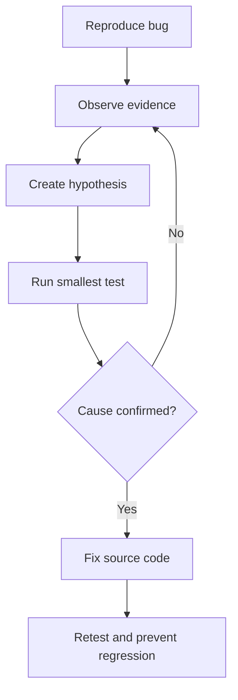

# 🛠️ Chapter 26: Browser Developer Tools and Debugging


> [!TIP]
> **Chapter Goal:** Browser DevTools se HTML, CSS, JavaScript, network requests, storage, responsiveness, accessibility aur performance problems systematically find aur fix karna.

> [!NOTE]
> DevTools ka interface browser/version ke saath change ho sakta hai. Concepts same rehte hain, but panel names or locations slightly different ho sakti hain.

---

## 🎯 26.1 Learning Objectives

Is chapter ke baad aap:

- Browser Developer Tools open aur navigate kar payenge.
- Live DOM and CSS inspect/edit karenge.
- Console messages aur JavaScript expressions use karenge.
- Breakpoints se JavaScript step-by-step debug karenge.
- Network requests, status codes, headers and timing inspect karenge.
- Local/session storage and cookies examine karenge.
- Responsive, accessibility and performance checks karenge.
- Evidence-based debugging workflow follow karenge.
- Broken Student Dashboard practical debug karenge.

---

## 🗣️ 26.2 Difficult Words

| Word | Pronunciation | Simple Meaning |
|---|---|---|
| Debugging | डीबगिंग — *dee-bug-ing* | Problem find aur fix karna |
| Inspect | इंस्पेक्ट — *in-spekt* | Detail me examine karna |
| Breakpoint | ब्रेकपॉइंट — *brayk-point* | Execution pause location |
| Call Stack | कॉल स्टैक — *kawl stak* | Active function calls ka order |
| Scope | स्कोप — *skohp* | Available variables ka area |
| Request | रिक्वेस्ट — *ri-kwest* | Resource/data ki demand |
| Response | रिस्पॉन्स — *ri-spons* | Server ka answer |
| Payload | पेलोड — *pay-lohd* | Request me sent data |
| Latency | लेटेंसी — *lay-ten-see* | Response start hone ka delay |
| Throttling | थ्रॉटलिंग — *throt-ling* | Slow network/CPU simulate karna |
| Cache | कैश — *kash* | Reuse ke liye saved resource |
| Profiling | प्रोफाइलिंग — *proh-fai-ling* | Performance behavior measure karna |
| Watch | वॉच — *woch* | Expression ko continuously observe karna |
| Override | ओवरराइड — *oh-ver-raid* | Existing behavior/style replace karna |

---

# 🟦 Part A: DevTools Fundamentals

## 26.3 What Are Browser Developer Tools?

Browser DevTools built-in tools ka set hai jo web developers ko help karta hai:

- HTML and CSS inspect/edit
- JavaScript test/debug
- Network traffic analyze
- Storage inspect
- Responsive devices emulate
- Accessibility information inspect
- Performance measure

DevTools changes temporary hote hain unless a supported local override/workspace setup use ho. Page reload usually live edits remove kar deta hai.

---

## 26.4 Opening DevTools

Common methods:

| Action | Windows/Linux | macOS |
|---|---|---|
| Open DevTools | `F12` or `Ctrl+Shift+I` | `Cmd+Option+I` |
| Inspect element | Right-click → Inspect | Right-click → Inspect |
| Console | `Ctrl+Shift+J` | `Cmd+Option+J` |
| Responsive mode | `Ctrl+Shift+M` | `Cmd+Shift+M` in Chrome; browser shortcut may vary |

> [!TIP]
> Right-click an exact element → **Inspect** is often the fastest starting point for layout/style bugs.

---

## 26.5 Main Panels

| Chrome Name | Firefox Equivalent | Main Work |
|---|---|---|
| Elements | Inspector | DOM and CSS |
| Console | Console | Logs and live JavaScript |
| Sources | Debugger | Files and breakpoints |
| Network | Network | Requests and responses |
| Performance | Performance | Runtime performance |
| Application | Storage | Storage, cache, service workers |
| Lighthouse | Other audit tools | Automated audits |

Panel availability browser/version/viewport par depend kar sakti hai. Hidden panels often overflow menu me milte hain.

---

## 26.6 A Scientific Debugging Mindset

Random changes ke bajay:



Good bug report contains:

1. Expected behavior
2. Actual behavior
3. Exact reproduction steps
4. Browser/device/version
5. Console/network errors
6. Minimal example or relevant code
7. Screenshots where useful

---

# 🟩 Part B: Elements / Inspector Panel

## 26.7 Inspecting the Live DOM

Elements panel browser ka current live DOM show karta hai.

You can:

- Expand/collapse nodes
- Search selector/text
- Edit text or attributes
- Add/remove elements
- Move nodes
- Inspect event listeners
- View accessibility information

> [!IMPORTANT]
> DOM may differ from original HTML because JavaScript elements add/remove/change kar sakti hai and browser invalid markup correct kar sakta hai.

---

## 26.8 Editing HTML Temporarily

Example source:

```html
<h1 class="title">Welcom</h1>
```

DevTools me text edit:

```html
<h1 class="title">Welcome</h1>
```

Use live edits to confirm fix. Then actual project file me same fix save karein.

---

## 26.9 Styles Pane

Selected element ke matching CSS rules show hote hain.

You can:

- Property checkbox toggle
- Values edit
- New property add
- Rule source file/line locate
- Pseudo-state force
- CSS variables inspect
- Invalid/overridden declarations identify

```css
.card {
    width: 300px;
    padding: 1rem;
    border: 1px solid #ccc;
}
```

Struck-through declaration often indicates another declaration cascade/specificity/order ki wajah se win kar rahi hai, or property inactive/invalid context me ho sakti hai.

---

## 26.10 Computed Styles

Computed pane final resolved values show karta hai.

Useful for:

- Final width/height
- Actual font
- Final color
- Display and position
- Inherited properties
- Source of winning rule

If “CSS correct lag rahi hai” but result wrong hai, computed value verify karein.

---

## 26.11 Box Model Debugging

Box model visualization shows:

- Content
- Padding
- Border
- Margin
- Dimensions

Common width bug:

```css
.box {
    width: 300px;
    padding: 30px;
    border: 5px solid;
}
```

With `content-box` total visible width becomes:

```text
300 + 60 padding + 10 border = 370px
```

Fix where appropriate:

```css
.box {
    box-sizing: border-box;
}
```

---

## 26.12 Flexbox and Grid Overlays

Layout tools can highlight:

- Grid tracks and line numbers
- Gaps
- Flex direction
- Item alignment
- Wrapping
- Container badges/overlays

Common flex diagnosis:

1. Confirm parent `display: flex`.
2. Check main axis.
3. Inspect `justify-content` and `align-items`.
4. Check child width/flex properties.
5. Check wrapping and gaps.

---

## 26.13 Force Element States

DevTools can force states such as:

- `:hover`
- `:active`
- `:focus`
- `:focus-visible`
- `:focus-within`

This is useful for menus/buttons that are difficult to inspect while active.

---

## 26.14 CSS Specificity Debugging

```html
<button id="save" class="btn primary">Save</button>
```

```css
button {
    color: black;
}

.btn {
    color: blue;
}

#save {
    color: red;
}
```

Computed color red because ID selector stronger hai. But cascade layers, `!important`, inline styles, inheritance and source order bhi outcome affect kar sakte hain.

> [!CAUTION]
> Problem ko repeatedly `!important` se hide na karein. Winning rule and architecture understand karein.

---

# 🟨 Part C: Console

## 26.15 Console Uses

Chrome Console ke two core uses:

1. Logged messages view karna
2. JavaScript execute karna

```javascript
console.log("Application started");
console.warn("Storage is almost full");
console.error("Could not load profile");
```

---

## 26.16 Structured Logging

```javascript
const student = {
    id: 1,
    name: "Broun",
    marks: 85
};

console.table([student]);
console.dir(document.body);
```

Grouped messages:

```javascript
console.group("Registration");
console.log("Name checked");
console.log("Email checked");
console.groupEnd();
```

Timing:

```javascript
console.time("calculation");
// operation
console.timeEnd("calculation");
```

Assertions:

```javascript
console.assert(marks >= 0, "Marks cannot be negative");
```

---

## 26.17 Reading Error Messages

Example:

```text
Uncaught TypeError: Cannot read properties of null
    at app.js:18:12
```

Read from top:

- Error type: `TypeError`
- Message: attempted property access on `null`
- File: `app.js`
- Line: `18`
- Column: `12`

Likely selector returned `null` or script executed before element existed.

---

## 26.18 Live Expressions

Console:

```javascript
document.querySelector("#page-title");
document.body.dataset;
localStorage.getItem("theme");
window.innerWidth;
```

Selected element helpers may include `$0` for currently inspected element in Chromium/Firefox consoles.

```javascript
$0.classList;
$0.getBoundingClientRect();
```

> [!WARNING]
> Console me unknown/untrusted code paste na karein. It can access page/session data and perform actions as you.

---

## 26.19 Logpoints

Logpoint breakpoint ki tarah line par attach hota hai but execution pause kiye bina message log kar sakta hai. Source code me temporary `console.log()` add kiye bina values inspect karne me useful hai.

---

# 🟪 Part D: Sources / Debugger Panel

## 26.20 Why Use a Debugger?

`console.log()` useful hai, but debugger allows:

- Exact line par pause
- Variable values inspect
- One statement at a time execute
- Call stack see
- Scope variables inspect
- Expression watch
- Conditional pause
- DOM/event exceptions trace

---

## 26.21 Line Breakpoints

```javascript
function calculateTotal(price, quantity) {
    const total = price * quantity;
    return total;
}
```

`const total...` line number click karke breakpoint set karein. Function call hone par execution pause hota hai.

---

## 26.22 Step Controls

| Control | Meaning |
|---|---|
| Resume | Next breakpoint tak continue |
| Step over | Current line run, called function ke andar na jaye |
| Step into | Called function ke andar enter |
| Step out | Current function se caller tak complete |
| Restart frame | Current function execution restart where supported |

---

## 26.23 Scope and Watch

Paused state me:

- Local scope
- Closure scope
- Global scope
- `this`
- Function arguments

inspect kar sakte hain.

Watch expressions:

```javascript
price * quantity
student?.marks
items.length
```

They update as execution steps.

---

## 26.24 Call Stack

```javascript
function saveStudent(student) {
    validateStudent(student);
}

function validateStudent(student) {
    validateMarks(student.marks);
}

function validateMarks(marks) {
    throw new Error("Invalid marks");
}
```

Call stack path show karega:

```text
validateMarks
validateStudent
saveStudent
```

This tells error tak code kis route se aaya.

---

## 26.25 Conditional Breakpoints

Pause only when condition true:

```javascript
student.id === 42
```

Loop example:

```javascript
index === 999
```

Large loop me specific problematic iteration find karne ke liye powerful hai.

---

## 26.26 Event Listener Breakpoints

Pause when events occur:

- Mouse click
- Keyboard input
- Form submit
- Timer
- Fetch/XHR
- DOM mutation (tool-dependent)

Unknown handler bug me useful: event trigger karein and debugger responsible JavaScript par pause karega.

---

## 26.27 Exception Breakpoints

Options commonly include:

- Pause on uncaught exceptions
- Pause on caught exceptions

Caught exception par pause hidden underlying problem expose kar sakta hai, but third-party libraries me many expected exceptions bhi show ho sakti hain.

---

## 26.28 The `debugger` Statement

```javascript
function calculateResult(marks) {
    debugger;
    return marks >= 40 ? "Pass" : "Fail";
}
```

DevTools open hone par execution pause ho sakta hai. Commit before `debugger` statements remove karein unless intentionally needed.

---

## 26.29 Source Maps

Bundled/minified code ko original source files se map karte hain.

```javascript
//# sourceMappingURL=app.js.map
```

Source maps development debugging easy banate hain. Production exposure policy/security implications project needs ke according evaluate karein.

---

# 🟥 Part E: Network Panel

## 26.30 What the Network Panel Shows

Every loaded/requested resource:

- HTML
- CSS
- JavaScript
- Images/fonts
- Fetch/XHR
- Documents
- Media

Inspect:

- URL
- Method
- Status
- Type
- Size
- Initiator
- Timing

---

## 26.31 Record Requests Correctly

Basic steps:

1. Network panel open.
2. Recording active confirm.
3. Page reload.
4. Bug reproduce.
5. Filter relevant request.
6. Request details inspect.

Preserve log navigation/reloads across requests when needed. Cache-related tests me **Disable cache** option DevTools open state me useful ho sakta hai.

---

## 26.32 HTTP Status Codes

| Range | Meaning | Examples |
|---|---|---|
| 2xx | Success | 200, 201, 204 |
| 3xx | Redirect/cache | 301, 302, 304 |
| 4xx | Client/request issue | 400, 401, 403, 404 |
| 5xx | Server issue | 500, 502, 503 |

Status alone full cause nahi batata. Response body, headers and server logs bhi inspect karein.

---

## 26.33 Request Details

Typical tabs:

- Headers
- Payload
- Preview
- Response
- Initiator
- Timing
- Cookies

Check:

```text
Request URL
Request method
Status
Query parameters
Request headers
Request body
Response headers
Response body
```

> [!CAUTION]
> Screenshots/HAR files share karte waqt authorization headers, cookies, personal data and request bodies redact karein.

---

## 26.34 Common Network Problems

### 404 Not Found

- Wrong path
- Filename case mismatch
- Missing deployed file
- Incorrect base URL

### CORS Error

Console error + request headers inspect karein. CORS server response policy issue hota hai; browser protection ko disable karke production fix nahi hota.

### Failed Fetch

Possible:

- Offline/network failure
- DNS/TLS issue
- CORS blocking
- Server unreachable
- Request aborted

### Cached Old File

- Request status/size inspect
- Cache disabled reload test
- Versioned assets/build deployment verify
- Service worker behavior inspect

---

## 26.35 Throttling

Simulate:

- Slow mobile network
- Offline
- CPU slowdown (panel support dependent)

Throttling helps find:

- Loading UI missing
- Timeout assumptions
- Layout shift
- Large resources
- Race conditions

Emulation real device/network testing ka complete replacement nahi.

---

## 26.36 Copy as cURL and HAR

Network request often “Copy as cURL” se reproduce ho sakta hai.

HAR (HTTP Archive) network session export karta hai.

Security:

- Tokens/cookies may be included
- Private endpoints/data may appear
- Share only after inspection/redaction

---

# 🟧 Part F: Storage and Application

## 26.37 Storage Types

| Storage | Lifetime | Server Automatically Receives? |
|---|---|---|
| Local Storage | Until cleared | No |
| Session Storage | Tab/session | No |
| Cookies | Expiry/session | Usually matching requests par |
| IndexedDB | Until cleared | No |
| Cache Storage | Until managed/cleared | No |

---

## 26.38 Inspecting Local Storage

```javascript
localStorage.setItem("theme", "dark");
localStorage.getItem("theme");
localStorage.removeItem("theme");
```

DevTools me key/value edit or delete kar sakte hain.

> [!WARNING]
> Local Storage me passwords, long-lived secrets or sensitive tokens store karna dangerous ho sakta hai. Any page JavaScript running in that origin may access it.

---

## 26.39 Cookies

Inspect:

- Name/value
- Domain
- Path
- Expires/Max-Age
- Secure
- HttpOnly
- SameSite

`HttpOnly` cookie page JavaScript se inaccessible hoti hai, which certain token theft risks reduce kar sakta hai. Complete authentication security design backend chapter me cover hoga.

---

## 26.40 Service Workers and Cache

Application/Storage panel can help:

- Service worker status
- Update/unregister
- Offline behavior
- Cache Storage entries
- Manifest inspect

“Changes deployed but browser old version dikha raha hai” issue me service worker/cache investigate karein.

---

# 🟫 Part G: Responsive and Accessibility Testing

## 26.41 Device/Responsive Mode

Test:

- Viewport width/height
- Orientation
- Touch emulation
- Device pixel ratio
- Network/CPU conditions where supported
- CSS media queries

> [!IMPORTANT]
> Device toolbar viewport simulate karta hai; real hardware, browser chrome, performance, input methods and OS behavior fully reproduce nahi karta.

---

## 26.42 Responsive Testing Checklist

At widths around content breakpoints:

1. Horizontal overflow?
2. Text readable without zoom?
3. Navigation usable?
4. Buttons large enough?
5. Images scale/crop correctly?
6. Forms and keyboard flow work?
7. No hidden essential content?
8. Landscape and portrait okay?
9. 200% zoom workable?
10. Content reflow understandable?

---

## 26.43 Accessibility Inspection

Elements accessibility information may show:

- Computed role
- Accessible name
- ARIA attributes
- Accessibility tree
- Focusability

Debug button:

```html
<div class="save-button">Save</div>
```

It lacks native button semantics/keyboard behavior.

Better:

```html
<button type="button">Save</button>
```

Automated tools help but manual keyboard and screen-reader testing still needed.

---

## 26.44 Focus and Contrast

Check:

- Tab order
- Visible focus indicator
- Accessible name
- Keyboard activation
- Color contrast
- Zoom/reflow
- Error announcements

Force `:focus-visible` state in Elements panel to inspect focus styling.

---

# 🟦 Part H: Performance Tools

## 26.45 Performance Panel

Typical workflow:

1. Open Performance.
2. Start recording.
3. Perform slow interaction.
4. Stop recording.
5. Inspect timeline, tasks, rendering and frames.
6. Find long main-thread work.
7. Optimize and record again.

Measure before and after; intuition alone often misleading hoti hai.

---

## 26.46 Common Performance Problems

- Large/unoptimized images
- Render-blocking resources
- Too much JavaScript
- Long tasks
- Repeated layout/reflow
- Excess DOM nodes
- Expensive event handlers
- Memory leaks
- Slow third-party scripts
- No caching/compression

---

## 26.47 Performance Measurements in Code

```javascript
performance.mark("calculation-start");

runCalculation();

performance.mark("calculation-end");

performance.measure(
    "calculation",
    "calculation-start",
    "calculation-end"
);

console.table(performance.getEntriesByName("calculation"));
```

For simple debugging:

```javascript
console.time("render");
renderPage();
console.timeEnd("render");
```

---

## 26.48 Lighthouse and Automated Audits

Audits may report:

- Performance
- Accessibility
- Best practices
- SEO
- Progressive Web App-related checks depending on tool/version

Use audit as evidence and starting point, not a final guarantee. Test conditions affect scores.

---

# 🟩 Part I: Complete Debugging Practical

## 26.49 Broken Student Dashboard

### Broken HTML

```html
<!DOCTYPE html>
<html lang="en">
<head>
    <meta charset="UTF-8">
    <meta name="viewport"
          content="width=device-width, initial-scale=1.0">
    <title>Student Dashboard</title>
    <link rel="stylesheet" href="style.css">
    <script src="app.js"></script>
</head>
<body>
    <main class="dashboard">
        <h1 id="page-title">Student Dashboard</h1>

        <button id="load-button" type="button">
            Load Student
        </button>

        <p id="status"></p>
        <section id="profile"></section>
    </main>
</body>
</html>
```

### Broken CSS

```css
.dashboard {
    width: 700px;
    padding: 40px;
    border: 5px solid #6d28d9;
}

@media (max-width: 600px) {
    .dashbord {
        width: 100%;
    }
}
```

### Broken JavaScript

```javascript
const button = document.querySelector("#load-btn");
const status = document.querySelector("#status");
const profile = document.querySelector("#profile");

button.addEventListener("click", loadStudent);

async function loadStudent() {
    status.textContent = "Loading...";

    const response = await fetch(
        "https://jsonplaceholder.typicode.com/users/100"
    );

    const student = await response.json();

    profile.innerHTML = `
        <h2>${student.name}</h2>
        <p>${student.email}</p>
    `;

    status.textContent = "Loaded";
}
```

---

## 26.50 Reproduce and Observe

Expected: button click loads profile.

Actual evidence:

1. Console: Cannot read properties of `null` for `addEventListener`.
2. Element exists with ID `load-button`.
3. JS selector uses `#load-btn`.
4. Script runs in head without `defer`, so even corrected selector may run before DOM.
5. Mobile layout overflows.
6. Media query selector typo: `.dashbord`.
7. Network user ID 100 returns 404 in this demo API.
8. HTTP status not checked.
9. Async failure has no `try/catch`.
10. Remote values use `innerHTML`.

---

## 26.51 Use Breakpoints and Network

After basic selector fix:

1. Put breakpoint inside `loadStudent()`.
2. Click button.
3. Step to `fetch()`.
4. Network request select.
5. See status 404.
6. Inspect Response.
7. Add response status check.
8. Use valid demo ID.
9. Test throttled network to confirm loading state.
10. Test offline to confirm error state.

---

## 26.52 Fixed HTML

```html
<!DOCTYPE html>
<html lang="en">
<head>
    <meta charset="UTF-8">
    <meta name="viewport"
          content="width=device-width, initial-scale=1.0">
    <title>Student Dashboard</title>
    <link rel="stylesheet" href="style.css">
    <script src="app.js" defer></script>
</head>
<body>
    <main class="dashboard">
        <h1 id="page-title">Student Dashboard</h1>

        <button id="load-button" type="button">
            Load Student
        </button>

        <p id="status" role="status"></p>
        <section id="profile" aria-live="polite"></section>
    </main>
</body>
</html>
```

---

## 26.53 Fixed CSS

```css
* {
    box-sizing: border-box;
}

body {
    margin: 0;
    min-height: 100vh;
    display: grid;
    place-items: center;
    padding: 1rem;
    font-family: system-ui, sans-serif;
    background: #eef2ff;
}

.dashboard {
    width: min(100%, 700px);
    padding: clamp(1rem, 5vw, 2.5rem);
    border: 5px solid #6d28d9;
    border-radius: 1rem;
    background: white;
}

button {
    padding: 0.75rem 1rem;
}
```

Fixed-width mobile media query no longer needed.

---

## 26.54 Fixed JavaScript

```javascript
"use strict";

const button = document.querySelector("#load-button");
const status = document.querySelector("#status");
const profile = document.querySelector("#profile");

button.addEventListener("click", loadStudent);

async function loadStudent() {
    button.disabled = true;
    status.textContent = "Loading student…";
    profile.replaceChildren();

    try {
        const response = await fetch(
            "https://jsonplaceholder.typicode.com/users/1"
        );

        if (!response.ok) {
            throw new Error(
                `Request failed with status ${response.status}`
            );
        }

        const student = await response.json();

        const heading = document.createElement("h2");
        heading.textContent = student.name ?? "Unknown student";

        const email = document.createElement("p");
        email.textContent =
            `Email: ${student.email ?? "Not available"}`;

        profile.append(heading, email);
        status.textContent = "Student loaded.";
    } catch (error) {
        console.error(error);
        status.textContent =
            "Could not load the student. Please retry.";
    } finally {
        button.disabled = false;
    }
}
```

---

## 26.55 Regression Checklist

After fix:

- Console has no unexpected errors.
- Correct selector found.
- Click and keyboard activation work.
- Loading, success and offline error states work.
- Network status and response correct.
- Mobile widths have no horizontal overflow.
- 200% zoom works.
- Text output safely rendered.
- Button re-enabled after failure.
- Page reload still works because source files fixed.

---

# 🟥 Part J: Debugging Strategies

## 26.56 Divide and Conquer

Large issue ko smaller parts me split:

```text
Input → Validation → Function → Request → Response → Render
```

Each boundary par value/behavior inspect karein.

---

## 26.57 Minimal Reproduction

Remove unrelated parts until bug remains:

- Smallest HTML
- Relevant CSS
- One JavaScript function
- Same failing data

Minimal example root cause clearer banata hai.

---

## 26.58 Rubber-Duck Explanation

Code ko line-by-line explain karein:

- Is line ka input?
- Expected type?
- Actual value?
- When does it run?
- What can be null?
- What side effect happens?

Explanation assumptions expose karti hai.

---

## 26.59 Binary Search Through Changes

Agar known-good and broken versions available hain, commits/changes ke middle point test karke culprit range narrow karein. Git bisect later Git chapter me relevant hoga.

---

## 26.60 Fix Cause, Not Symptom

Symptom:

```css
.card {
    margin-left: -37px;
}
```

Possible actual cause:

- Wrong container width
- Unexpected padding
- Default body margin
- Incorrect grid markup
- Overflowing child

DevTools computed layout se cause locate karein.

---

## 🚫 26.61 Common Mistakes

1. Bug reproduce kiye bina code change karna.
2. First error ignore karke later errors chase karna.
3. Console sirf last me check karna.
4. DevTools live edit ko saved fix samajhna.
5. Network panel open karne ke baad reload na karna.
6. HTTP 200 ko correct data guarantee samajhna.
7. Cache/service worker ignore karna.
8. Mobile emulation ko real-device replacement samajhna.
9. Only one viewport test karna.
10. `console.log()` secrets/personal data expose karna.
11. Production me `debugger` statement leave karna.
12. CORS/browser security disable karke “fix” karna.
13. Performance optimize before measuring.
14. Automated accessibility score ko complete proof samajhna.
15. HAR/screenshot me tokens share karna.

---

## 📌 26.62 Best Practices

- Exact bug consistently reproduce karein.
- First meaningful error se start karein.
- Console and Network open rakhein.
- One hypothesis at a time test karein.
- Breakpoints and call stack use karein.
- Actual types/values inspect karein; assume na karein.
- Slow network/offline/error paths test karein.
- Fix project source, then reload/retest.
- Related behavior ka regression test karein.
- Accessibility and responsive behavior manually test karein.
- Sensitive DevTools evidence safely redact karein.
- Investigation and final fix document karein.

---

## 📝 26.63 Chapter Summary

Browser DevTools HTML, CSS, JavaScript, network, storage, accessibility and performance inspect karne ke built-in tools hain. Elements/Inspector live DOM and computed styles show karta hai. Console logs and JavaScript evaluation provide karta hai. Sources/Debugger breakpoints, scope, watches and call stacks se execution trace karta hai. Network panel requests, status, headers, payload, response and timing reveal karta hai. Application/Storage client data and service-worker state inspect karta hai. Responsive and performance tools simulations and measurements provide karte hain. Effective debugging reproducible evidence, focused hypotheses, source-code fixes and regression testing par based hoti hai.

---

## 🎲 26.64 MCQs

1. DOM/CSS inspect panel?  
   A. Network · **B. Elements/Inspector** · C. Storage · D. Performance

2. JavaScript execute kaha?  
   A. Elements · **B. Console** · C. Application · D. Memory only

3. Execution pause point?  
   A. Watch · **B. Breakpoint** · C. Cookie · D. Header

4. Function-call route?  
   A. Payload · **B. Call stack** · C. Cache · D. DOM tree

5. HTTP requests inspect?  
   A. Sources · **B. Network** · C. Elements · D. Console only

6. 404 means?  
   A. Success · **B. Not found** · C. Server crash always · D. Redirect

7. Persistent origin key/value storage?  
   A. Call stack · **B. Local Storage** · C. Breakpoint · D. CSSOM

8. Slow connection simulation?  
   A. Minification · **B. Throttling** · C. Hoisting · D. Delegation

---

## ✍️ 26.65 Fill in the Blanks

1. Execution pause location ko __________ kehte hain.
2. Final CSS values __________ pane me milte hain.
3. Server response code Network panel ka __________ field dikhata hai.
4. Function calls ka order __________ kehlata hai.
5. Slow network simulation ko __________ kehte hain.

<details>
<summary><strong>✅ Answers</strong></summary>

1. breakpoint  
2. Computed  
3. Status  
4. call stack  
5. throttling

</details>

---

## ✅ 26.66 True or False

1. DevTools live CSS edits automatically source file save karti hain — **False**
2. Console JavaScript expressions run kar sakti hai — **True**
3. Conditional breakpoint always pauses — **False**
4. Network panel response body show kar sakta hai — **True**
5. HTTP 200 always logically correct data guarantee karta hai — **False**
6. Local Storage automatically every request me server ko jata hai — **False**
7. Device emulation real device ka exact replacement hai — **False**
8. Performance should be measured before optimization — **True**

---

## ❓ 26.67 Exam Questions

### Short Answer

1. Define Browser Developer Tools.
2. Elements panel ke uses batayein.
3. Computed styles kya hain?
4. Console ke main uses kya hain?
5. Breakpoint kya hai?
6. Step over and step into compare karein.
7. Call stack kya show karta hai?
8. Network panel kya inspect karta hai?
9. Throttling kya hai?
10. DevTools edits temporary kyun hain?

### Long Answer

1. Explain major DevTools panels.
2. Describe HTML/CSS debugging workflow.
3. Explain JavaScript debugging with breakpoints.
4. Discuss Network panel and HTTP diagnosis.
5. Explain browser storage inspection.
6. Discuss responsive, accessibility and performance testing.
7. Explain scientific debugging workflow.
8. Debug the Student Dashboard practical step-by-step.

---

## 🧪 26.68 Practical Exercises

1. DevTools shortcuts practice karein.
2. Live heading and CSS edit karein.
3. Box model overflow diagnose karein.
4. Flex/Grid overlay inspect karein.
5. Console logging methods test karein.
6. TypeError file/line locate karein.
7. Line and conditional breakpoints set karein.
8. Call stack trace karein.
9. 404 request Network panel me diagnose karein.
10. Offline/slow network state test karein.
11. Local Storage value inspect/edit karein.
12. Page at mobile widths and 200% zoom test karein.
13. Keyboard focus and accessible names inspect karein.
14. Performance recording compare karein.
15. Broken Dashboard ko independently fix karein.

---

## 🎤 26.69 Viva Questions

1. DevTools kya hai?
2. Kaise open karte hain?
3. Inspector kya dikhata hai?
4. Live edit permanent hai?
5. Computed style kya hai?
6. Box model parts?
7. Console ka use?
8. Breakpoint kya karta hai?
9. Watch expression kya hai?
10. Call stack kya hai?
11. Network status kaha dikhta hai?
12. Disable cache kab useful?
13. Throttling kya simulate karti hai?
14. Local and Session Storage difference?
15. Real-device testing kyun needed hai?

---

## 🏁 26.70 One-Minute Revision

| Question | Quick Answer |
|---|---|
| Open tools? | `F12` / `Ctrl+Shift+I` |
| HTML/CSS? | Elements/Inspector |
| Logs/JS? | Console |
| Code debugging? | Sources/Debugger |
| Pause line? | Breakpoint |
| Function path? | Call stack |
| Requests? | Network |
| Missing resource? | 404 |
| Client data? | Application/Storage |
| Responsive simulation? | Device mode |
| Slow connection? | Throttling |
| Final CSS? | Computed |
| Runtime measurement? | Performance |
| Good workflow? | Reproduce → Evidence → Hypothesis → Test |

---

## 📚 26.71 Official References

1. [Chrome DevTools — Overview](https://developer.chrome.com/docs/devtools/overview)
2. [Chrome DevTools — Elements](https://developer.chrome.com/docs/devtools/elements)
3. [Chrome DevTools — Console](https://developer.chrome.com/docs/devtools/console)
4. [Chrome DevTools — Sources](https://developer.chrome.com/docs/devtools/sources)
5. [Chrome DevTools — Network](https://developer.chrome.com/docs/devtools/network)
6. [Chrome DevTools — Performance](https://developer.chrome.com/docs/devtools/performance/)
7. [Firefox Developer Tools — User Docs](https://firefox-source-docs.mozilla.org/devtools-user/)

---

[⬅️ Previous Chapter](25-bootstrap-fundamentals.md) · [📚 Table of Contents](../SUMMARY.md) · **Next: Git and GitHub Fundamentals ➡️**
