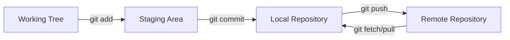
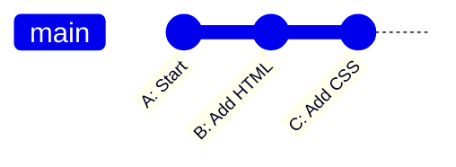
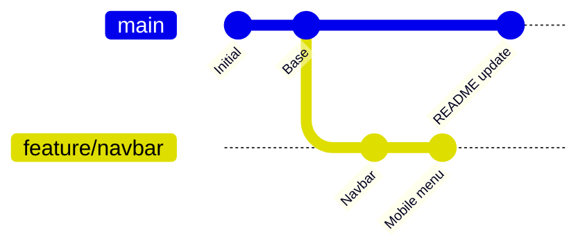
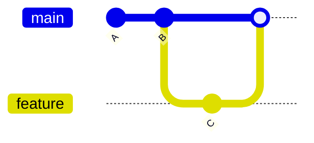
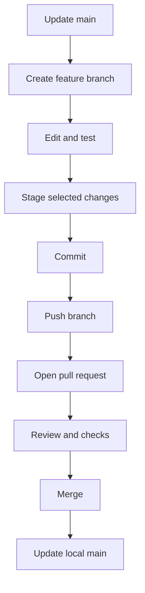

# 🌿 Chapter 27: Git and GitHub Fundamentals


> [!TIP]
> **Chapter Goal:** Git se code history safely manage karna aur GitHub par repository, branches, issues aur pull requests ke through project publish/collaborate karna.

---

## 🎯 27.1 Learning Objectives

Is chapter ke baad aap:

- Git aur GitHub ka difference explain kar payenge.
- Repository initialize ya clone karenge.
- Working tree, staging area aur commits samjhenge.
- Status, diff, log, restore and stash use karenge.
- Branch create, switch, merge aur delete karenge.
- Merge conflict safely resolve karenge.
- GitHub remote add karke fetch, pull and push karenge.
- README, `.gitignore`, issues and pull requests use karenge.
- Secure authentication practices follow karenge.
- Complete feature-branch workflow perform karenge.

---

## 🗣️ 27.2 Difficult Words

| Word | Pronunciation | Simple Meaning |
|---|---|---|
| Version Control | वर्ज़न कंट्रोल | Changes ki history management |
| Repository | रिपॉजिटरी — *ri-poz-i-tor-ee* | Project aur history ka store |
| Commit | कमिट — *kuh-mit* | Saved history snapshot |
| Staging | स्टेजिंग — *stay-jing* | Next commit ki preparation |
| Branch | ब्रांच — *branch* | Independent development line |
| Merge | मर्ज — *murj* | Branch changes combine karna |
| Conflict | कॉन्फ्लिक्ट — *kon-flikt* | Incompatible changes |
| Remote | रिमोट — *ri-moht* | Network-hosted repository reference |
| Clone | क्लोन — *klohn* | Repository ki local copy |
| Fork | फोर्क — *fork* | GitHub par own server-side copy |
| Pull Request | पुल रिक्वेस्ट | Changes review/merge proposal |
| Authentication | ऑथेन्टिकेशन | Identity verify karna |
| Hash | हैश — *hash* | Commit/object identifier |
| Rebase | रीबेस — *ree-bays* | Commits ko new base par replay karna |

---

# 🟦 Part A: Version Control Fundamentals

## 27.3 What Is Version Control?

Version control system files ke changes record karta hai so that you can:

- Previous versions inspect/restore
- Who changed what see
- Parallel features develop
- Experiments isolate
- Team collaboration
- Release history maintain

Without version control, files like these create confusion:

```text
project-final.zip
project-final-new.zip
project-final-new-last.zip
project-final-really-last.zip
```

---

## 27.4 What Is Git?

Git distributed version control system hai. Every normal clone project history ki local copy rakhta hai.

Git local computer par bhi work karta hai; internet required nahi for normal commits, branches and history.

---

## 27.5 What Is GitHub?

GitHub Git repositories host karne wali online platform/service hai. It adds:

- Remote hosting
- Pull requests
- Issues
- Code review
- Actions/automation
- Releases
- Project collaboration
- Access control

### Git vs GitHub

| Git | GitHub |
|---|---|
| Version control software | Hosting/collaboration platform |
| Local operations | Web-based remote features |
| Commits and branches | PRs, issues, Actions |
| Can work offline | Network needed for online sync |
| Open-source project | Commercial hosted service |

> [!IMPORTANT]
> Git and GitHub same cheez nahi hain. GitHub Git use karta hai.

---

## 27.6 Git's Main Areas



- **Working tree:** Current files being edited
- **Staging area/index:** Next commit me selected changes
- **Local repository:** Saved commit history
- **Remote:** Shared hosted history

---

# 🟩 Part B: Installation and Configuration

## 27.7 Installing Git

Download from official Git website:

```text
https://git-scm.com/downloads
```

Verify:

```bash
git --version
```

Git Bash Windows par Unix-like command environment provide kar sakta hai. VS Code terminal, PowerShell or other supported shell bhi use kar sakte hain.

---

## 27.8 Configure Identity

```bash
git config --global user.name "Broun Verma"
git config --global user.email "your-email@example.com"
```

Verify:

```bash
git config --global --list
```

This identity commit metadata me use hoti hai. GitHub contribution association ke liye verified account email or GitHub-provided no-reply email use ki ja sakti hai.

> [!WARNING]
> Example email ko apne actual chosen email se replace karein. Private email public commits me expose na karna ho to GitHub privacy/no-reply option understand karein.

---

## 27.9 Default Branch Name

New repositories ke liye:

```bash
git config --global init.defaultBranch main
```

Existing repository ki branch automatically rename nahi hoti.

---

## 27.10 Useful Configuration

Default editor example:

```bash
git config --global core.editor "code --wait"
```

Line endings platform/team according configure karne chahiye. Blindly configuration copy na karein; repository ka `.gitattributes` cross-platform rules centralize kar sakta hai.

---

# 🟨 Part C: Creating and Inspecting a Repository

## 27.11 Initialize a Repository

```bash
mkdir my-portfolio
cd my-portfolio
git init
```

This creates hidden `.git` directory containing repository metadata/history.

> [!CAUTION]
> `.git` folder manually delete karne se local Git history/config remove ho sakti hai.

---

## 27.12 Check Status

```bash
git status
```

Status tells:

- Current branch
- Untracked files
- Modified files
- Staged changes
- Conflicts
- Ahead/behind remote information where available

Short form:

```bash
git status --short
```

Common codes:

| Code | Meaning |
|---|---|
| `??` | Untracked |
| `M` | Modified |
| `A` | Added |
| `D` | Deleted |
| `UU` | Unmerged conflict |

Two columns may represent index and working-tree state.

---

## 27.13 Add Files to Staging

One file:

```bash
git add index.html
```

Multiple specific files:

```bash
git add index.html styles.css app.js
```

All current path changes:

```bash
git add .
```

Interactive/partial staging:

```bash
git add -p
```

> [!TIP]
> `git add .` se pehle `git status` and `git diff` check karein so secrets, build output or unrelated changes accidentally stage na hon.

---

## 27.14 View Differences

Unstaged changes:

```bash
git diff
```

Staged changes:

```bash
git diff --staged
```

Specific file:

```bash
git diff -- styles.css
```

Diff markers:

- `-` removed line
- `+` added line

They actual file characters nahi, diff representation hote hain.

---

## 27.15 Create a Commit

```bash
git commit -m "Add responsive navigation"
```

A good commit:

- One logical change
- Reviewable size
- Clear message
- Working state where practical
- No secrets/generated junk

Message examples:

Good:

```text
Add mobile navigation toggle
Fix email validation for empty values
Update installation instructions
```

Weak:

```text
changes
final
fix
stuff
```

---

## 27.16 View History

Compact:

```bash
git log --oneline
```

Graph:

```bash
git log --oneline --graph --decorate --all
```

Specific commit:

```bash
git show COMMIT_HASH
```

File history:

```bash
git log --oneline -- index.html
```

A short unique prefix of commit hash often works where unambiguous.

---

## 27.17 Understanding Commits

Commit stores project snapshot relationships and metadata:

- Tree/snapshot reference
- Parent commit(s)
- Author
- Committer
- Timestamp
- Message

`HEAD` usually current checked-out branch's latest commit ko point karta hai.



---

# 🟪 Part D: Ignoring Files

## 27.18 The `.gitignore` File

Example:

```gitignore
# Dependencies
node_modules/

# Environment secrets
.env
.env.*

# Build output
dist/
build/

# Editor/OS files
.vscode/
.DS_Store
Thumbs.db

# Logs
*.log
```

Negation:

```gitignore
.env.*
!.env.example
```

Use `.env.example` with placeholder names, never real secrets.

---

## 27.19 Important `.gitignore` Rules

- Blank lines ignored
- `#` comments
- `*` wildcard
- Trailing `/` directory
- Leading `/` repository-root relative
- `!` re-include pattern

> [!IMPORTANT]
> `.gitignore` already tracked file ko automatically untrack nahi karta.

Stop tracking but keep local file:

```bash
git rm --cached .env
```

Then commit. If secret already committed/pushed, assume compromised: revoke/rotate it. Merely deleting latest file does not erase prior history.

---

# 🟥 Part E: Undoing Changes Safely

## 27.20 Restore Unstaged File

```bash
git restore styles.css
```

This discards unstaged changes in that file.

> [!WARNING]
> Uncommitted discarded changes may be difficult to recover. Check `git diff` first.

---

## 27.21 Unstage a File

```bash
git restore --staged styles.css
```

File changes working tree me remain karte hain; only staging se remove hote hain.

---

## 27.22 Amend Latest Commit

```bash
git add forgotten-file.md
git commit --amend
```

Message only:

```bash
git commit --amend -m "Add complete setup guide"
```

Amend creates new commit identity/history. Already shared commit amend karne se collaborators affected ho sakte hain.

---

## 27.23 Revert a Published Commit

```bash
git revert COMMIT_HASH
```

Revert old commit ko delete nahi karta; inverse change ka new commit creates. Shared history ke liye usually safer than rewriting.

---

## 27.24 Reset Warning

`git reset` branch/index/working tree state change kar sakta hai depending on mode.

```bash
git reset --soft HEAD~1
git reset --mixed HEAD~1
git reset --hard HEAD~1
```

- `--soft` commit pointer moves, changes staged
- `--mixed` changes unstaged
- `--hard` tracked working changes discard

> [!CAUTION]
> Beginner stage me `reset --hard` avoid karein unless exact consequences and recoverability understood ho. Shared history rewrite team coordination ke bina na karein.

---

## 27.25 Stashing Temporary Work

```bash
git stash push -m "Work in progress: navbar"
```

List:

```bash
git stash list
```

Apply and retain stash:

```bash
git stash apply
```

Apply and remove:

```bash
git stash pop
```

Include untracked files if intended:

```bash
git stash push -u -m "WIP"
```

Stash long-term backup ka replacement nahi.

---

# 🟧 Part F: Branching and Merging

## 27.26 What Is a Branch?

Branch commit history me movable pointer hai. Features/fixes ko main line se isolate karta hai.



---

## 27.27 List and Create Branches

List:

```bash
git branch
```

Create:

```bash
git branch feature/navbar
```

Create and switch:

```bash
git switch -c feature/navbar
```

Switch existing:

```bash
git switch main
```

Current branch has `*` in `git branch` output.

---

## 27.28 Naming Branches

Useful examples:

```text
feature/contact-form
fix/mobile-overflow
docs/setup-guide
refactor/validation
```

Names short, lowercase and descriptive rakhein. Team convention follow karein.

---

## 27.29 Merge a Branch

First target branch:

```bash
git switch main
```

Update and merge:

```bash
git merge feature/navbar
```

Possible results:

- Fast-forward
- Merge commit
- Conflict

After successful integration:

```bash
git branch -d feature/navbar
```

`-d` unmerged work deletion se protect karta hai; `-D` force deletes and should be used carefully.

---

## 27.30 Fast-Forward vs Merge Commit

Fast-forward: main branch has no new divergent commits, pointer simply moves.



When both histories diverge, merge may create a commit with two parents.

---

## 27.31 Merge Conflicts

Conflict markers:

```text
<<<<<<< HEAD
<h1>My Portfolio</h1>
=======
<h1>BCA Developer Portfolio</h1>
>>>>>>> feature/title
```

Resolve:

1. `git status` run.
2. Conflicting file open.
3. Correct final content choose/combine.
4. All markers remove.
5. Test result.
6. `git add FILE`.
7. `git commit` or continue shown operation.

Abort merge if appropriate:

```bash
git merge --abort
```

> [!IMPORTANT]
> Conflict resolution means understand both intentions. Markers blindly delete karna enough nahi.

---

## 27.32 Rebase Introduction

```bash
git switch feature/navbar
git rebase main
```

Rebase feature commits ko updated main ke top par replay karta hai, creating new commit identities.

Benefits:

- Linear history
- Feature branch updated before PR

Risk:

- Shared published commits rewrite karne se collaborators disrupt

Beginner rule: already shared branch rebase/force-push karne se pehle team policy follow karein.

---

# 🟫 Part G: Remote Repositories

## 27.33 View Remotes

```bash
git remote -v
```

Common remote name: `origin`. It is a convention, magic requirement nahi.

---

## 27.34 Add a GitHub Remote

HTTPS:

```bash
git remote add origin https://github.com/USERNAME/REPOSITORY.git
```

SSH:

```bash
git remote add origin git@github.com:USERNAME/REPOSITORY.git
```

Verify:

```bash
git remote -v
```

Change URL:

```bash
git remote set-url origin NEW_URL
```

---

## 27.35 Clone a Repository

```bash
git clone https://github.com/USERNAME/REPOSITORY.git
cd REPOSITORY
```

Clone:

- Working copy
- Git history
- Remote configuration
- Default branch checkout

Fork and clone differ: fork GitHub-side copy; clone local copy.

---

## 27.36 Fetch

```bash
git fetch origin
```

Fetch remote objects/refs download karta hai but current working branch automatically integrate nahi karta.

Inspect:

```bash
git log --oneline main..origin/main
```

---

## 27.37 Pull

```bash
git pull origin main
```

Conceptually fetch + integration into current branch. Integration may merge or rebase depending command/config.

Explicit options:

```bash
git pull --ff-only
git pull --rebase
```

Choose project policy intentionally. Working changes clean/committed/stashed rakhna safer hota hai.

---

## 27.38 Push

First push and upstream:

```bash
git push -u origin main
```

Later:

```bash
git push
```

Feature branch:

```bash
git push -u origin feature/navbar
```

Push rejected if remote has changes your local history does not contain. Fetch/pull, understand changes, resolve, then push.

> [!WARNING]
> `git push --force` shared history overwrite kar sakta hai. If history rewrite truly required and team permits, `--force-with-lease` safer guard provides, but still caution needed.

---

## 27.39 Tracking Branches

`-u` / `--set-upstream` local branch ko remote branch se associate karta hai.

See:

```bash
git branch -vv
```

Remote-tracking branch such as `origin/main` remote state ka last fetched local reference hai; it updates on network fetch/pull, not continuously.

---

# 🟦 Part H: GitHub Authentication and Security

## 27.40 HTTPS Authentication

GitHub command-line Git operations over HTTPS ke liye account password authentication removed hai. Common secure approaches:

- Git Credential Manager
- GitHub CLI authentication
- Personal access token (PAT)
- SSH keys

If HTTPS prompt “password” asks, PAT may be used in place of password where applicable.

> [!IMPORTANT]
> Token ko repository file, code, screenshot, chat or commit me paste na karein.

---

## 27.41 Personal Access Tokens

Prefer fine-grained token where supported and grant:

- Minimum repositories
- Minimum permissions
- Limited expiration appropriate to use

If exposed:

1. Revoke immediately.
2. Create replacement if needed.
3. Remove from active code/config.
4. Clean repository history if necessary.
5. Investigate access/logs.

Deleting token from latest commit alone insufficient hai.

---

## 27.42 SSH Authentication

Basic flow:

1. Generate SSH key.
2. Add public key to GitHub.
3. Keep private key secret.
4. Use SSH remote URL.
5. Protect key with passphrase where practical.

Never upload:

```text
id_ed25519
id_rsa
private-key.pem
```

Public `.pub` content GitHub account settings me add kiya jata hai, but keys carefully identify/manage karein.

---

## 27.43 Secrets Checklist

Never commit:

- `.env` credentials
- API private keys
- Database passwords
- Access tokens
- Private SSH keys
- Cloud credentials
- Production customer data

Before commit:

```bash
git status
git diff
git diff --staged
```

---

# 🟩 Part I: GitHub Repository Features

## 27.44 README

`README.md` explains:

- Project purpose
- Features
- Screenshot/demo
- Installation
- Usage
- Tech stack
- Project structure
- Contribution rules
- License

Example:

```markdown
# BCA Portfolio

A responsive portfolio built with HTML, CSS and JavaScript.

## Run Locally

Open `index.html` using a local development server.
```

---

## 27.45 Issues

Issue bug, feature or task track karta hai.

Good issue:

```markdown
## Problem

Navigation overlaps content at 320px width.

## Steps to Reproduce

1. Open home page.
2. Set viewport to 320px.
3. Expand menu.

## Expected

Menu should not cover the heading.

## Actual

Heading becomes hidden.
```

Add labels, assignee, milestone where useful.

---

## 27.46 Pull Requests

Pull request (PR) branch changes ko review and merge propose karta hai.

Good PR includes:

- What changed
- Why
- How tested
- Screenshots for UI
- Related issue
- Known limitations
- Small focused diff

PR is collaboration/review feature, not `git pull` command.

---

## 27.47 Fork Workflow

External repository contribution:

1. Fork on GitHub.
2. Clone your fork.
3. Add original repository as `upstream`.
4. Create feature branch.
5. Commit and push to fork.
6. Open PR to original repository.

```bash
git remote add upstream https://github.com/ORIGINAL/REPOSITORY.git
git fetch upstream
```

Keep main synced according to project instructions.

---

## 27.48 Code Review

Reviewer checks:

- Correctness
- Security
- Tests
- Accessibility
- Maintainability
- Scope
- Documentation

Respond constructively:

- Clarify intent
- Ask if feedback unclear
- Push follow-up commits
- Resolve conversation after addressed
- Avoid personal language; review code/change

---

## 27.49 Releases and Tags

Annotated tag:

```bash
git tag -a v1.0.0 -m "First stable release"
git push origin v1.0.0
```

GitHub Release can add:

- Release notes
- Binary/download assets
- Changelog
- Marking pre-release

Do not move published tags casually.

---

# 🟨 Part J: Complete Collaboration Workflow

## 27.50 New Local Project to GitHub

Local:

```bash
mkdir bca-portfolio
cd bca-portfolio

git init
git branch -M main

git add .
git commit -m "Create initial portfolio structure"
```

After empty GitHub repository creation:

```bash
git remote add origin https://github.com/USERNAME/bca-portfolio.git
git push -u origin main
```

If GitHub repository was created with initial README/license, histories may already differ. Beginner-friendly option: clone that repository first and add project files inside it, instead of independently initializing both sides.

---

## 27.51 Feature Branch Workflow

Start updated:

```bash
git switch main
git pull --ff-only
```

Create feature:

```bash
git switch -c feature/contact-form
```

Work and inspect:

```bash
git status
git diff
```

Commit:

```bash
git add index.html styles.css app.js
git diff --staged
git commit -m "Add accessible contact form"
```

Push:

```bash
git push -u origin feature/contact-form
```

Then GitHub par pull request open karein.

---

## 27.52 Updating Feature Branch

Fetch latest:

```bash
git fetch origin
```

Team strategy ke according merge:

```bash
git merge origin/main
```

Or rebase only when project policy/branch ownership permits:

```bash
git rebase origin/main
```

Resolve conflicts, run tests, push changes.

---

## 27.53 After PR Merge

```bash
git switch main
git pull --ff-only
git branch -d feature/contact-form
git fetch --prune
```

Delete remote feature branch through GitHub or:

```bash
git push origin --delete feature/contact-form
```

Only delete after verifying merge/work no longer needed.

---

## 27.54 Workflow Diagram



---

# 🟪 Part K: Practical Merge Conflict

## 27.55 Create Conflicting Changes

On main:

```bash
git switch main
```

`index.html`:

```html
<h1>BCA Student Portfolio</h1>
```

Commit:

```bash
git add index.html
git commit -m "Update portfolio heading on main"
```

Feature branch has same line:

```html
<h1>Web Developer Portfolio</h1>
```

Merge:

```bash
git merge feature/title
```

---

## 27.56 Resolve Properly

Conflict:

```text
<<<<<<< HEAD
<h1>BCA Student Portfolio</h1>
=======
<h1>Web Developer Portfolio</h1>
>>>>>>> feature/title
```

Choose combined intention:

```html
<h1>BCA Web Developer Portfolio</h1>
```

Then:

```bash
git add index.html
git status
git commit
```

Test page before commit. After merge, verify graph:

```bash
git log --oneline --graph --decorate --all
```

---

# 🟥 Part L: Common Problems

## 27.57 “Not a Git Repository”

Cause: Wrong directory or repository not initialized.

Check:

```bash
pwd
git status
```

Navigate correct folder or initialize intended directory. Do not run `git init` randomly inside unrelated/nested folder.

---

## 27.58 Push Rejected

Likely remote has commits not in local.

Safe approach:

```bash
git fetch origin
git status
git log --oneline --graph --decorate --all
```

Then integrate according to team policy and push. Do not immediately force push.

---

## 27.59 Detached HEAD

You may be viewing a commit instead of branch.

Check:

```bash
git status
```

If changes should be kept:

```bash
git switch -c recovery/my-work
```

Then commit safely.

---

## 27.60 Wrong Files Committed

Before published:

- Amend if latest and private/unshared
- Interactive rebase for advanced local cleanup

After published:

- New corrective commit/revert is usually safer
- Secret exposure requires rotation and history cleanup plan

---

## 27.61 Line-Ending Noise

If every line appears changed:

- Check line endings
- Use project `.gitattributes`
- Avoid editor mass conversion
- Coordinate before normalization commit
- Keep normalization separate from feature changes

Example:

```gitattributes
* text=auto
*.sh text eol=lf
*.bat text eol=crlf
```

---

## 🚫 27.62 Common Mistakes

1. Git and GitHub ko same samajhna.
2. Wrong directory me `git init`.
3. `git status`/diff check kiye bina stage.
4. One commit me unrelated changes.
5. Weak commit messages.
6. Generated files and secrets commit.
7. `.gitignore` se tracked secret erase expect.
8. Shared commit amend/rebase without coordination.
9. Push rejection par force push.
10. Conflict markers accidentally commit.
11. Main branch par every feature directly develop.
12. Pull request ko `git pull` samajhna.
13. Local changes save kiye bina switching/restore.
14. GitHub password command-line auth expect.
15. Repository ko backup strategy ka complete replacement samajhna.

---

## 📌 27.63 Best Practices

- Small logical commits.
- Descriptive imperative messages.
- Work start se pehle main update.
- Each task ke liye branch.
- Stage exact changes.
- `git diff --staged` before commit.
- Secrets never commit.
- Pull request small and focused.
- Tests/accessibility checks before push.
- Protected main and review rules for team projects.
- Shared history rewrite avoid.
- Important work remote/offsite backup rakhein.
- Official docs and repository CONTRIBUTING rules follow karein.

---

## 📝 27.64 Chapter Summary

Git distributed version control system hai; GitHub Git repositories ka hosted collaboration platform hai. Changes working tree se staging area and commit history me move hote hain. Branches parallel work isolate karte hain, merge changes combine karta hai and conflicts manual resolution require kar sakte hain. Remotes shared history reference karte hain; fetch downloads, pull fetches plus integrates, and push publishes. `.gitignore` unwanted untracked files exclude karta hai but tracked secrets remove nahi karta. GitHub issues, pull requests, reviews and releases team workflow improve karte hain. Authentication HTTPS tokens/credential helpers or SSH se hoti hai, and credentials must remain secret.

---

## 🎲 27.65 MCQs

1. Git kya hai?  
   A. Hosting website · **B. Version control system** · C. CSS framework · D. Database

2. Next commit area?  
   A. Remote · **B. Staging area** · C. Issue · D. Fork

3. Stage command?  
   A. `git save` · **B. `git add`** · C. `git push` · D. `git branch`

4. History command?  
   A. `git status` · **B. `git log`** · C. `git init` · D. `git clone`

5. Create and switch branch?  
   A. `git branch -d` · **B. `git switch -c`** · C. `git merge` · D. `git pull`

6. Remote changes download without integrate?  
   A. `push` · **B. `fetch`** · C. `commit` · D. `restore`

7. Shared commit undo safer command?  
   A. Hard reset · **B. `git revert`** · C. Delete `.git` · D. Force push

8. Review proposal on GitHub?  
   A. Pull command · **B. Pull request** · C. Stash · D. Tag

---

## ✍️ 27.66 Fill in the Blanks

1. Project history store ko __________ kehte hain.
2. Saved snapshot ko __________ kehte hain.
3. Remote default conventional name __________ hai.
4. Temporary work store command __________ hai.
5. Two incompatible changes ko __________ kehte hain.

<details>
<summary><strong>✅ Answers</strong></summary>

1. repository  
2. commit  
3. `origin`  
4. `git stash`  
5. conflict

</details>

---

## ✅ 27.67 True or False

1. Git requires GitHub — **False**
2. `git add` permanent commit creates — **False**
3. Branch parallel work isolate karti hai — **True**
4. `git fetch` current branch automatically merge karta hai — **False**
5. `git pull` fetch plus integration karta hai — **True**
6. `.gitignore` already tracked file untrack karta hai — **False**
7. GitHub password HTTPS Git auth still accepted — **False**
8. Revert new inverse commit create karta hai — **True**

---

## ❓ 27.68 Exam Questions

### Short Answer

1. Define version control.
2. Git and GitHub compare karein.
3. Working tree and staging area explain karein.
4. `git status` and `git diff` uses kya hain?
5. Commit kya hai?
6. `.gitignore` kya karta hai?
7. Branch and merge define karein.
8. Merge conflict kya hai?
9. Fetch, pull and push compare karein.
10. Pull request kya hai?

### Long Answer

1. Explain Git architecture and workflow.
2. Describe repository initialization and commits.
3. Explain branching, merging and conflict resolution.
4. Discuss remote repository commands.
5. Explain safe undo techniques.
6. Describe GitHub collaboration features.
7. Discuss authentication and secret security.
8. Explain complete feature-branch workflow.

---

## 🧪 27.69 Practical Exercises

1. Git install/configure karein.
2. Portfolio repository initialize karein.
3. Three logical commits create karein.
4. Status and both diff modes compare karein.
5. `.gitignore` add karein.
6. Feature branch create/merge karein.
7. Controlled conflict create/resolve karein.
8. Stash apply/pop test karein.
9. GitHub remote add/push karein.
10. Existing repository clone karein.
11. Issue and feature branch banayein.
12. Pull request open and review description likhein.
13. Tag/release create karein.
14. Accidental tracked `.env` safely handle karein.
15. Full collaboration workflow repeat karein.

---

## 🎤 27.70 Viva Questions

1. Git kya hai?
2. GitHub kya hai?
3. Repository kya hai?
4. Staging area kya hai?
5. Commit kya hai?
6. HEAD kya refer karta hai?
7. `git status` kya dikhata hai?
8. `git diff --staged` kya dikhata hai?
9. Branch kyun use karte hain?
10. Merge conflict kaise solve hota hai?
11. Fetch and pull difference?
12. Clone and fork difference?
13. Origin kya hai?
14. PAT kya hai?
15. Force push risky kyun hai?

---

## 🏁 27.71 One-Minute Revision

| Question | Quick Answer |
|---|---|
| Version control? | Git |
| Hosted collaboration? | GitHub |
| Start repository? | `git init` |
| Copy repository? | `git clone` |
| Check state? | `git status` |
| Stage? | `git add` |
| Save snapshot? | `git commit` |
| History? | `git log` |
| Create/switch branch? | `git switch -c` |
| Combine branch? | `git merge` |
| Download only? | `git fetch` |
| Download + integrate? | `git pull` |
| Upload commits? | `git push` |
| Temporary shelf? | `git stash` |
| Review proposal? | Pull request |

---

## 📚 27.72 Official References

1. [Git — Official Reference](https://git-scm.com/docs)
2. [Git — Official Tutorial](https://git-scm.com/docs/gittutorial)
3. [GitHub Docs — Git Basics](https://docs.github.com/en/get-started/git-basics)
4. [GitHub Docs — About Remote Repositories](https://docs.github.com/en/get-started/git-basics/about-remote-repositories)
5. [GitHub Docs — Pull Requests](https://docs.github.com/en/pull-requests)
6. [GitHub Docs — Authentication](https://docs.github.com/en/authentication)

---

[⬅️ Previous Chapter](26-browser-developer-tools-and-debugging.md) · [📚 Table of Contents](../SUMMARY.md) · **Next: Building and Publishing a Responsive Website ➡️**
