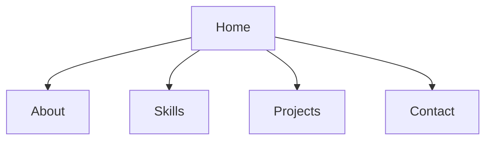
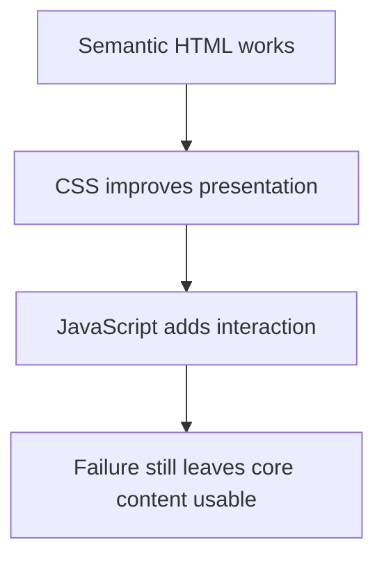
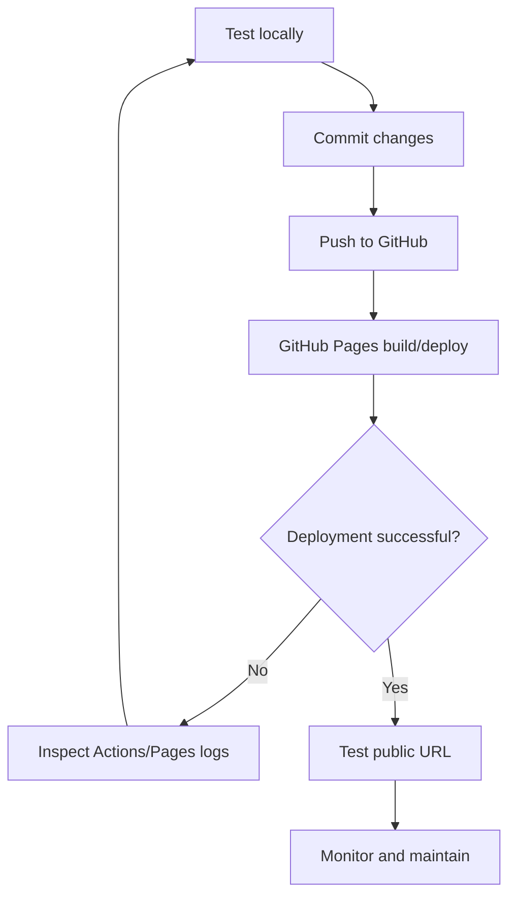
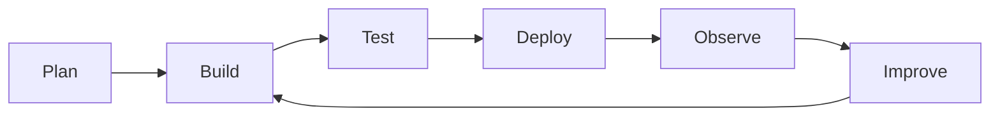

# 🚀 Chapter 28: Building and Publishing a Responsive Website


> [!TIP]
> **Chapter Goal:** Requirement planning se lekar responsive coding, testing, optimization, Git version control aur GitHub Pages deployment tak complete website workflow perform karna.

---

## 🎯 28.1 Learning Objectives

Is chapter ke baad aap:

- Website requirements aur target audience define karenge.
- Sitemap, content plan and wireframe banayenge.
- Semantic, mobile-first project structure create karenge.
- Responsive multi-section website build karenge.
- Accessibility, performance, SEO and security checks apply karenge.
- Cross-browser and device testing karenge.
- Git/GitHub workflow use karenge.
- GitHub Pages se static website publish karenge.
- Deployment problems identify aur fix karenge.
- Post-launch maintenance plan banayenge.

---

## 🗣️ 28.2 Difficult Words

| Word | Pronunciation | Simple Meaning |
|---|---|---|
| Requirement | रिक्वायरमेंट — *ri-kwai-er-ment* | Project ki need/rule |
| Audience | ऑडियन्स — *aw-dee-ens* | Website ke target users |
| Sitemap | साइटमैप — *sait-map* | Pages ka structure |
| Wireframe | वायरफ्रेम — *wai-er-fraym* | Basic layout sketch |
| Prototype | प्रोटोटाइप — *proh-tuh-taip* | Testable early model |
| Deployment | डिप्लॉयमेंट — *di-ploy-ment* | Website live publish karna |
| Production | प्रोडक्शन — *pruh-duk-shun* | Live user-facing environment |
| Optimization | ऑप्टिमाइजेशन | Speed/quality improve karna |
| Metadata | मेटाडेटा — *met-uh-day-tuh* | Page ke baare me information |
| Canonical | कैनॉनिकल — *kuh-non-i-kul* | Preferred official URL |
| Regression | रिग्रेशन — *ri-gresh-un* | Fix/change se old feature break |
| Maintenance | मेंटेनेंस — *mayn-tuh-nens* | Ongoing care and updates |
| Hosting | होस्टिंग — *hoh-sting* | Website files serve karna |
| Domain | डोमेन — *doh-mayn* | Human-readable web address |

---

# 🟦 Part A: Project Planning

## 28.3 Start with the Problem

Code start karne se pehle answer:

1. Website kis problem ko solve karegi?
2. Primary users kaun hain?
3. User ka main action kya hoga?
4. Required content kya hai?
5. Success kaise measure hoga?
6. Deadline and constraints kya hain?

Example project:

```text
Goal: BCA student portfolio
Audience: Recruiters, teachers, classmates
Primary action: View projects and contact student
Constraints: Static site, mobile-first, GitHub Pages
```

---

## 28.4 Functional and Non-Functional Requirements

### Functional Requirements

Website kya karegi:

- Navigation sections open kare
- Project cards display kare
- Contact links work karein
- Theme toggle work kare
- Form validate kare if included

### Non-Functional Requirements

Website ka quality behavior:

- Responsive
- Accessible
- Fast
- Secure
- Maintainable
- Cross-browser compatible

---

## 28.5 Content Inventory

| Section | Content | Asset |
|---|---|---|
| Home | Name, role, CTA | Profile image |
| About | Introduction, education | Resume link |
| Skills | Technical skills | Icons optional |
| Projects | Title, description, demo/code | Screenshots |
| Contact | Email/social links | No sensitive data |
| Footer | Copyright and links | — |

Real content early use karein. Lorem ipsum se actual text length/layout issues hide ho sakte hain.

---

## 28.6 Sitemap

Small one-page portfolio:



Multi-page site example:

```text
Home
├── About
├── Projects
│   ├── Student Portal
│   └── Task Manager
└── Contact
```

---

## 28.7 Wireframe

Wireframe visual styling se pehle layout/content hierarchy decide karta hai.

```text
Header: Logo + Navigation
Hero: Introduction + CTA + Image
About: Heading + Description
Skills: Responsive Cards
Projects: Project Grid
Contact: Links/Form
Footer: Copyright
```

Wireframe low-fidelity ho sakta hai: paper, whiteboard or design tool.

---

## 28.8 Design System Basics

Decide:

- Primary/secondary colors
- Neutral colors
- Typography scale
- Spacing scale
- Border radius
- Shadows
- Button states
- Container width
- Breakpoint strategy

CSS variables:

```css
:root {
    --color-primary: #6d28d9;
    --color-secondary: #2563eb;
    --color-text: #172033;
    --color-surface: #ffffff;
    --color-background: #f5f7ff;

    --space-1: 0.25rem;
    --space-2: 0.5rem;
    --space-3: 1rem;
    --space-4: 1.5rem;
    --space-5: 2rem;

    --radius: 0.75rem;
    --content-width: 70rem;
}
```

---

# 🟩 Part B: Project Setup

## 28.9 Recommended Structure

```text
bca-portfolio/
├── index.html
├── 404.html
├── README.md
├── .gitignore
├── assets/
│   ├── css/
│   │   └── styles.css
│   ├── js/
│   │   └── app.js
│   └── images/
│       ├── profile.webp
│       └── project-portal.webp
└── docs/
    └── testing-checklist.md
```

Use lowercase filenames, hyphens and predictable paths.

> [!WARNING]
> GitHub Pages paths are case-sensitive. `Profile.webp` and `profile.webp` different files hain.

---

## 28.10 Initial Git Setup

```bash
mkdir bca-portfolio
cd bca-portfolio

git init
git branch -M main
```

After base files:

```bash
git add .
git commit -m "Create portfolio project structure"
```

Continue with feature branches:

```bash
git switch -c feature/homepage
```

---

## 28.11 HTML Foundation

```html
<!doctype html>
<html lang="en">
<head>
    <meta charset="utf-8">
    <meta name="viewport"
          content="width=device-width, initial-scale=1">

    <title>Broun | BCA Web Developer</title>

    <meta
        name="description"
        content="BCA student portfolio featuring responsive web-development projects.">

    <link rel="stylesheet" href="assets/css/styles.css">
    <script src="assets/js/app.js" defer></script>
</head>
<body>
    <a class="skip-link" href="#main-content">
        Skip to main content
    </a>

    <header>...</header>

    <main id="main-content">
        ...
    </main>

    <footer>...</footer>
</body>
</html>
```

---

## 28.12 Relative Paths

From root `index.html`:

```html
<link rel="stylesheet" href="assets/css/styles.css">

```

Avoid development-machine paths:

```html

```

Avoid root-absolute path for project sites when base path matters:

```html

```

For GitHub project Pages, relative paths are often simpler because site may live under `/repository-name/`.

---

# 🟨 Part C: Semantic Responsive Build

## 28.13 Complete Page Landmarks

```html
<body>
    <a class="skip-link" href="#main-content">
        Skip to main content
    </a>

    <header class="site-header">
        <nav class="navigation" aria-label="Primary navigation">
            ...
        </nav>
    </header>

    <main id="main-content">
        <section id="home">...</section>
        <section id="about">...</section>
        <section id="skills">...</section>
        <section id="projects">...</section>
        <section id="contact">...</section>
    </main>

    <footer class="site-footer">...</footer>
</body>
```

Use one clear page `h1` and logical heading hierarchy.

---

## 28.14 Responsive Navigation HTML

```html
<header class="site-header">
    <nav class="navigation container" aria-label="Primary">
        <a class="brand" href="#home">Broun.dev</a>

        <button
            class="nav-toggle"
            type="button"
            aria-expanded="false"
            aria-controls="primary-menu">
            <span class="visually-hidden">Open navigation</span>
            <span aria-hidden="true">☰</span>
        </button>

        <ul id="primary-menu" class="nav-list">
            <li><a href="#about">About</a></li>
            <li><a href="#skills">Skills</a></li>
            <li><a href="#projects">Projects</a></li>
            <li><a href="#contact">Contact</a></li>
        </ul>
    </nav>
</header>
```

---

## 28.15 Hero Section

```html
<section id="home" class="hero">
    <div class="container hero-layout">
        <div>
            <p class="eyebrow">BCA Student & Web Developer</p>

            <h1>Building accessible and responsive websites</h1>

            <p class="hero-text">
                I create web projects using HTML, CSS and JavaScript.
            </p>

            <div class="hero-actions">
                <a class="button button-primary" href="#projects">
                    View Projects
                </a>
                <a class="button button-secondary" href="#contact">
                    Contact Me
                </a>
            </div>
        </div>

        
    </div>
</section>
```

Explicit image dimensions layout shift reduce karne me help karti hain.

---

## 28.16 Project Cards

```html
<section id="projects" class="section">
    <div class="container">
        <h2>Projects</h2>

        <div class="project-grid">
            <article class="project-card">
                

                <div class="project-content">
                    <h3>Student Portal</h3>

                    <p>
                        Responsive dashboard built using semantic HTML,
                        CSS Grid and JavaScript.
                    </p>

                    <ul class="tag-list" aria-label="Technologies">
                        <li>HTML</li>
                        <li>CSS</li>
                        <li>JavaScript</li>
                    </ul>

                    <div class="project-links">
                        <a href="https://example.com">Live Demo</a>
                        <a href="https://github.com/USERNAME/PROJECT">
                            Source Code
                        </a>
                    </div>
                </div>
            </article>
        </div>
    </div>
</section>
```

Replace example URLs before publishing.

---

## 28.17 Contact Section

For a static site, direct links:

```html
<section id="contact" class="section contact-section">
    <div class="container">
        <h2>Contact</h2>

        <p>
            Want to discuss a web project or opportunity?
        </p>

        <a class="button button-primary"
           href="mailto:your-public-email@example.com">
            Send Email
        </a>
    </div>
</section>
```

> [!CAUTION]
> Static HTML form alone email send/store nahi karta. External form service or backend use karte waqt privacy, spam protection and data handling understand karein.

---

# 🟪 Part D: Mobile-First CSS

## 28.18 Base Styles

```css
*,
*::before,
*::after {
    box-sizing: border-box;
}

html {
    scroll-behavior: smooth;
    scroll-padding-top: 5rem;
}

body {
    margin: 0;
    color: var(--color-text);
    background: var(--color-background);
    font-family: system-ui, sans-serif;
    line-height: 1.6;
}

img {
    display: block;
    max-width: 100%;
    height: auto;
}

a {
    color: inherit;
}

.container {
    width: min(100% - 2rem, var(--content-width));
    margin-inline: auto;
}

.section {
    padding-block: clamp(3rem, 8vw, 6rem);
}
```

---

## 28.19 Skip Link and Focus

```css
.skip-link {
    position: fixed;
    z-index: 1000;
    inset-block-start: 0.5rem;
    inset-inline-start: 0.5rem;
    padding: 0.75rem 1rem;
    color: white;
    background: #111827;
    transform: translateY(-150%);
}

.skip-link:focus {
    transform: translateY(0);
}

:focus-visible {
    outline: 3px solid #f59e0b;
    outline-offset: 3px;
}
```

---

## 28.20 Mobile Navigation CSS

```css
.site-header {
    position: sticky;
    z-index: 100;
    top: 0;
    background: var(--color-surface);
    box-shadow: 0 1px 10px rgb(15 23 42 / 10%);
}

.navigation {
    min-height: 4.5rem;
    display: flex;
    align-items: center;
    justify-content: space-between;
}

.brand {
    font-size: 1.25rem;
    font-weight: 800;
    text-decoration: none;
}

.nav-toggle {
    padding: 0.6rem;
    border: 0;
    background: transparent;
    font-size: 1.5rem;
}

.nav-list {
    display: none;
    position: absolute;
    inset: 4.5rem 1rem auto;
    margin: 0;
    padding: 1rem;
    list-style: none;
    background: var(--color-surface);
    border-radius: var(--radius);
    box-shadow: 0 1rem 2rem rgb(15 23 42 / 15%);
}

.nav-list.is-open {
    display: grid;
    gap: 1rem;
}
```

---

## 28.21 Hero and Cards CSS

```css
.hero {
    padding-block: clamp(4rem, 10vw, 8rem);
    color: white;
    background:
        linear-gradient(135deg, #6d28d9, #1d4ed8);
}

.hero-layout {
    display: grid;
    gap: 2.5rem;
    align-items: center;
}

.hero h1 {
    max-width: 15ch;
    margin-block: 0.5rem 1rem;
    font-size: clamp(2.25rem, 8vw, 4.75rem);
    line-height: 1.05;
}

.hero-actions,
.project-links {
    display: flex;
    flex-wrap: wrap;
    gap: 0.75rem;
}

.profile-image {
    width: min(100%, 24rem);
    aspect-ratio: 1;
    object-fit: cover;
    border: 0.5rem solid rgb(255 255 255 / 35%);
    border-radius: 50%;
}

.project-grid {
    display: grid;
    gap: 1.5rem;
}

.project-card {
    overflow: hidden;
    border: 1px solid #dbe2ef;
    border-radius: var(--radius);
    background: var(--color-surface);
    box-shadow: 0 0.75rem 2rem rgb(15 23 42 / 8%);
}

.project-content {
    padding: 1.25rem;
}

.tag-list {
    display: flex;
    flex-wrap: wrap;
    gap: 0.5rem;
    padding: 0;
    list-style: none;
}

.tag-list li {
    padding: 0.25rem 0.65rem;
    border-radius: 999px;
    background: #ede9fe;
    color: #4c1d95;
}
```

---

## 28.22 Button CSS

```css
.button {
    display: inline-flex;
    min-height: 2.75rem;
    align-items: center;
    justify-content: center;
    padding: 0.65rem 1rem;
    border: 2px solid transparent;
    border-radius: 0.5rem;
    font-weight: 700;
    text-decoration: none;
}

.button-primary {
    color: #1e1b4b;
    background: white;
}

.button-secondary {
    color: white;
    border-color: white;
    background: transparent;
}

.button:hover {
    transform: translateY(-2px);
}
```

---

## 28.23 Desktop Breakpoint

Choose breakpoint based on content, not specific device brand.

```css
@media (min-width: 48rem) {
    .nav-toggle {
        display: none;
    }

    .nav-list {
        position: static;
        display: flex;
        gap: 1.25rem;
        padding: 0;
        background: transparent;
        box-shadow: none;
    }

    .hero-layout {
        grid-template-columns: minmax(0, 1.3fr) minmax(16rem, 0.7fr);
    }

    .project-grid {
        grid-template-columns: repeat(2, minmax(0, 1fr));
    }
}

@media (min-width: 70rem) {
    .project-grid {
        grid-template-columns: repeat(3, minmax(0, 1fr));
    }
}
```

---

## 28.24 Reduced Motion

```css
@media (prefers-reduced-motion: reduce) {
    html {
        scroll-behavior: auto;
    }

    *,
    *::before,
    *::after {
        scroll-behavior: auto !important;
        transition-duration: 0.01ms !important;
        animation-duration: 0.01ms !important;
        animation-iteration-count: 1 !important;
    }
}
```

Motion preference respect karein while preserving functionality.

---

# 🟥 Part E: JavaScript Interaction

## 28.25 Navigation Toggle

```javascript
"use strict";

const navToggle = document.querySelector(".nav-toggle");
const navList = document.querySelector("#primary-menu");
const toggleText = navToggle.querySelector(".visually-hidden");

function closeNavigation() {
    navList.classList.remove("is-open");
    navToggle.setAttribute("aria-expanded", "false");
    toggleText.textContent = "Open navigation";
}

navToggle.addEventListener("click", () => {
    const isOpen = navList.classList.toggle("is-open");

    navToggle.setAttribute("aria-expanded", String(isOpen));
    toggleText.textContent =
        isOpen ? "Close navigation" : "Open navigation";
});

navList.addEventListener("click", event => {
    if (event.target.matches("a")) {
        closeNavigation();
    }
});

document.addEventListener("keydown", event => {
    if (event.key === "Escape") {
        closeNavigation();
        navToggle.focus();
    }
});
```

---

## 28.26 Current Year

HTML:

```html
<p>
    © <span id="current-year"></span> Broun.
    All rights reserved.
</p>
```

JavaScript:

```javascript
document.querySelector("#current-year").textContent =
    new Date().getFullYear();
```

Essential content only JavaScript par depend na kare where server/static alternative easy ho.

---

## 28.27 Progressive Enhancement

Start with working HTML links/content. CSS enhances layout. JavaScript enhances menu behavior.



No-JavaScript strategy for mobile menu can be designed with CSS/HTML alternatives, or class added by JS to change menu behavior.

---

# 🟧 Part F: Quality Assurance

## 28.28 HTML and CSS Validation

Check:

- Correct nesting
- Unique IDs
- Valid attributes
- Closed tags
- Correct heading order
- CSS syntax
- No broken selectors

Validators find syntax issues, not all usability/accessibility issues.

Official tools:

```text
https://validator.w3.org/
https://jigsaw.w3.org/css-validator/
```

---

## 28.29 Functional Testing

| Feature | Test |
|---|---|
| Navigation | Every link reaches correct section |
| Menu | Mouse, touch and keyboard |
| Project links | Correct URL and no placeholder |
| Email link | Correct public email |
| Theme/form | All states and errors |
| Images | Load and have useful alt text |
| 404 page | Unknown URL behavior |

---

## 28.30 Responsive Testing

Test widths, not just device presets:

- 320px
- 375px
- 768px
- 1024px
- Large desktop
- Content-driven in-between widths

Check:

1. Horizontal overflow
2. Navigation
3. Text line length
4. Image scaling
5. Button wrapping
6. Touch targets
7. 200% and 400% zoom/reflow
8. Portrait/landscape

---

## 28.31 Keyboard Testing

Without mouse:

- Tab reaches interactive elements
- Order logical
- Focus visible
- Enter/Space activates correct controls
- Escape closes dismissible UI
- No keyboard trap
- Skip link works
- Hidden content not focusable

---

## 28.32 Screen Reader and Accessibility Checks

Check:

- Page title
- Language
- Landmarks
- Heading hierarchy
- Link purpose
- Button names/state
- Image alternatives
- Form labels/errors
- Dynamic announcements
- Color contrast

Automated audit + manual test use karein. Perfect automated score complete accessibility guarantee nahi.

---

## 28.33 Cross-Browser Testing

At minimum project requirements ke according:

- Chromium browser
- Firefox
- Safari/WebKit where accessible
- Mobile browser/real device

Look for:

- Layout differences
- Font rendering
- Form controls
- Focus styles
- JavaScript support
- Media behavior

Use feature detection and progressive enhancement, browser sniffing avoid karein.

---

# 🟫 Part G: Performance Optimization

## 28.34 Optimize Images

Images often page ke heaviest resources hote hain.

Actions:

- Correct display dimensions
- Compress
- Modern format such as WebP/AVIF where appropriate
- SVG for simple vector art
- Width/height attributes
- Lazy-load below-fold images
- Responsive sources

```html

```

Hero/LCP candidate image ko blindly lazy-load na karein.

---

## 28.35 CSS and JavaScript

- Remove unused code
- Avoid huge libraries for tiny feature
- Minify production assets when workflow supports
- Load scripts with `defer` or modules
- Split code where useful
- Avoid blocking third-party scripts
- Cache/version assets where hosting supports
- Measure before optimizing

---

## 28.36 Fonts

- System fonts fastest/simple option
- Limit custom families/weights
- Use appropriate `font-display`
- Preload only critical fonts carefully
- Test fallback and layout shift
- Licensing confirm karein

---

## 28.37 Lighthouse and Network Checks

Before launch:

1. Run local and deployed audits.
2. Inspect large requests.
3. Test slow network.
4. Check unused resources.
5. Verify caching/compression behavior.
6. Fix major accessibility/SEO errors.
7. Record before/after evidence.

Lab results testing environment se vary kar sakte hain.

---

# 🟦 Part H: Basic SEO and Metadata

## 28.38 Essential Metadata

```html
<title>Broun | BCA Web Developer</title>

<meta
    name="description"
    content="Explore responsive web projects created by BCA student Broun.">

<meta name="robots" content="index,follow">
```

Each page needs descriptive unique title and description.

---

## 28.39 Social Sharing Metadata

```html
<meta property="og:title"
      content="Broun | BCA Web Developer">
<meta property="og:description"
      content="Responsive web-development portfolio and projects.">
<meta property="og:type" content="website">
<meta property="og:url"
      content="https://USERNAME.github.io/bca-portfolio/">
<meta property="og:image"
      content="https://USERNAME.github.io/bca-portfolio/assets/images/social-card.png">
```

Absolute URLs use karein. Replace placeholders.

---

## 28.40 Favicon and Canonical URL

```html
<link rel="icon" href="assets/images/favicon.svg" type="image/svg+xml">

<link
    rel="canonical"
    href="https://USERNAME.github.io/bca-portfolio/">
```

Canonical must actual preferred public URL match kare.

---

## 28.41 Good SEO Foundations

- Useful original content
- Semantic headings
- Descriptive links
- Fast loading
- Mobile usability
- Accessible content
- Descriptive image alt where needed
- Crawlable HTML
- Correct metadata
- No broken links

Keyword stuffing avoid karein.

---

# 🟩 Part I: Security and Privacy Before Launch

## 28.42 Pre-Deployment Security Checklist

Never publish:

- `.env`
- API secret keys
- Database credentials
- Access tokens
- Private personal documents
- Private phone/address unless intentional
- Debug data with personal information

Search before push:

```bash
git status
git diff
git diff --staged
```

Repository history bhi inspect karein if secret exposure suspected. Exposed credential immediately rotate/revoke karein.

---

## 28.43 External Links

New-tab link:

```html
<a
    href="https://example.com"
    target="_blank"
    rel="noopener noreferrer">
    External Project
</a>
```

Only open new tab when useful and avoid surprising users.

---

## 28.44 Third-Party Resources

Before adding CDN/script/widget:

- Trust source?
- Correct version?
- Integrity attribute available?
- Privacy impact?
- Performance cost?
- Required permissions?
- Failure behavior?
- License?

Minimal third-party dependencies reduce risk and maintenance.

---

# 🟨 Part J: Prepare Repository

## 28.45 README Template

```markdown
# BCA Developer Portfolio

A responsive and accessible portfolio website.

## Live Website

https://USERNAME.github.io/bca-portfolio/

## Features

- Mobile-first layout
- Accessible navigation
- Responsive project cards
- Optimized images

## Technologies

- HTML
- CSS
- JavaScript

## Run Locally

1. Clone the repository.
2. Open it with a local development server.
3. Visit the shown local URL.

## Author

Broun
```

---

## 28.46 Final Commit Workflow

```bash
git status
git diff
git add .
git diff --staged
git commit -m "Prepare responsive portfolio for deployment"
git push
```

Before `git add .`, confirm no secrets or unwanted files.

Tag first release:

```bash
git tag -a v1.0.0 -m "First portfolio release"
git push origin v1.0.0
```

---

# 🟪 Part K: Publish with GitHub Pages

## 28.47 What Is GitHub Pages?

GitHub Pages repository se static website host karta hai. Suitable for:

- Portfolios
- Documentation
- Project demos
- Static informational sites

It does not run PHP, MySQL or normal server-side code. Static frontend can call external APIs subject to their policies/CORS/security.

---

## 28.48 User Site vs Project Site

### User/Organization Site

Repository:

```text
USERNAME.github.io
```

Typical URL:

```text
https://USERNAME.github.io/
```

### Project Site

Repository:

```text
bca-portfolio
```

Typical URL:

```text
https://USERNAME.github.io/bca-portfolio/
```

Project site base path affects root-absolute URLs, isliye relative asset paths carefully use karein.

---

## 28.49 Deploy from a Branch

Current GitHub interface me typical steps:

1. Repository GitHub par push karein.
2. Repository **Settings** open karein.
3. Sidebar me **Pages**.
4. **Build and deployment** → Source.
5. **Deploy from a branch** select.
6. Branch `main` select.
7. Folder `/(root)` choose if `index.html` root me hai.
8. Save.
9. Deployment complete hone ka wait.
10. Shown public URL open karein.

GitHub docs ke according publication changes ko appear hone me kuch minutes lag sakte hain.

---

## 28.50 Docs Folder Option

If publish files `docs/` me hain:

```text
repository/
├── README.md
└── docs/
    ├── index.html
    ├── styles.css
    └── app.js
```

Pages source branch + `/docs` select kar sakte hain when supported by selected publishing setup.

---

## 28.51 GitHub Actions Publishing

GitHub Pages custom Actions workflow advanced build projects ke liye use ho sakta hai.

Use when:

- Build command required
- Static generator
- Bundler output
- Custom validation/tests before deployment

Workflow permissions and official Pages actions current docs se follow karein. Untrusted third-party actions pin/review carefully.

---

## 28.52 Deployment Flow



---

## 28.53 Verify the Live Site

Never stop at “deployment green.”

Test public URL:

- Homepage loads
- CSS/JS/images load
- Navigation works
- Paths work under repository base
- Browser Console clean
- Network no unexpected 404
- HTTPS used
- Mobile layout works
- Metadata/social image URLs correct
- Unknown URL/404 behavior checked
- Hard refresh works

---

# 🟥 Part L: Common Deployment Problems

## 28.54 404 on Main Page

Possible:

- Pages not enabled
- Wrong branch/folder
- No `index.html` at publishing root
- Deployment still processing
- Repository/site URL wrong
- Build failed

Check Settings → Pages and deployment/Actions logs.

---

## 28.55 CSS or Images Missing

Common path problem:

```html
<link rel="stylesheet" href="/assets/css/styles.css">
```

On project site, leading slash points domain root, not necessarily repository path.

Use:

```html
<link rel="stylesheet" href="assets/css/styles.css">
```

Also check:

- Filename case
- File committed/pushed
- Correct extension
- Network 404 URL
- CSS `url()` path relative to CSS file

---

## 28.56 Works Locally, Fails Online

Possible:

- Case sensitivity
- Unsupported server-side code
- CORS
- Mixed HTTP/HTTPS content
- Hard-coded localhost URL
- Root path assumptions
- Secret/environment missing
- Cache
- Build output absent

Network and Console panels use karein.

---

## 28.57 Old Version Appears

Check:

- Commit actually pushed?
- Pages source correct?
- Deployment completed?
- Browser/CDN cache?
- Service worker?
- Correct public URL?

Use hard reload carefully and inspect Network response, but fix deployment/versioning rather than asking every user to clear cache.

---

## 28.58 Custom Domain

High-level flow:

1. Domain own/control karein.
2. GitHub Pages settings me custom domain add.
3. DNS records official instructions ke according configure.
4. DNS propagation wait.
5. Domain ownership verification recommended.
6. HTTPS availability ke baad **Enforce HTTPS** enable.

> [!WARNING]
> DNS values and GitHub instructions can change. Exact records current official docs se copy karein; guessed records use na karein.

Optional `CNAME` file may be managed depending setup:

```text
www.example.com
```

---

# 🟧 Part M: Post-Launch Work

## 28.59 Maintenance Checklist

Regularly:

- Broken links check
- Content/projects update
- Dependencies update
- Security alerts review
- Performance regressions test
- Accessibility retest
- Domain/HTTPS expiry/settings verify
- Analytics/privacy policy review if used
- Backups and Git history verify

---

## 28.60 Feedback and Issues

GitHub issue template:

```markdown
## Page/Section

Project cards

## Problem

Card text overflows at 320px.

## Steps to Reproduce

1. Open the portfolio.
2. Set viewport width to 320px.
3. View the Projects section.

## Expected

Text wraps inside the card.

## Actual

Horizontal scrolling appears.

## Environment

Chrome version..., Windows...
```

---

## 28.61 Deployment Is Not the End

Production cycle:



Small, tested updates ship karein. Each change ke baad live site verification karein.

---

# 🟦 Part N: Final Launch Checklist

## 28.62 Content

- [ ] No placeholder text
- [ ] Correct spelling/grammar
- [ ] Current project links
- [ ] Public contact information intentional
- [ ] Copyright/current year correct
- [ ] Resume/download link works

## 28.63 HTML and Accessibility

- [ ] Valid semantic HTML
- [ ] Unique title and meta description
- [ ] Correct language
- [ ] Logical headings
- [ ] Alt text
- [ ] Keyboard navigation
- [ ] Visible focus
- [ ] Skip link
- [ ] Sufficient contrast
- [ ] Forms labeled and errors accessible

## 28.64 Responsive and Browser

- [ ] 320px to large desktop
- [ ] Portrait and landscape
- [ ] 200%/400% zoom
- [ ] No horizontal overflow
- [ ] Chromium, Firefox and WebKit/Safari as required
- [ ] Real mobile device test

## 28.65 Performance and Security

- [ ] Images compressed/sized
- [ ] No unnecessary large files
- [ ] Scripts deferred/modules
- [ ] No console errors
- [ ] No secrets
- [ ] HTTPS
- [ ] Trusted third-party resources
- [ ] External link behavior correct

## 28.66 Deployment

- [ ] Correct branch/folder
- [ ] `index.html` exists
- [ ] Deployment successful
- [ ] Public URL tested
- [ ] Assets no 404
- [ ] Relative paths correct
- [ ] README live link added
- [ ] Release/tag optional

---

## 🚫 28.67 Common Mistakes

1. Requirements/content ke bina code start karna.
2. Desktop-only layout.
3. Device names instead of content-based breakpoints.
4. Fixed widths causing overflow.
5. Placeholder links publish karna.
6. Local absolute paths.
7. Case mismatch ignored.
8. Unoptimized huge images.
9. Missing width/height on images.
10. Important above-fold image lazy-load.
11. JavaScript-only essential content.
12. Automated audit ko full testing samajhna.
13. Secrets commit/publish.
14. GitHub Pages se PHP/MySQL expect karna.
15. Project-site base path ignore karna.
16. Deployment success ke baad public URL test na karna.
17. Custom domain DNS guess karna.
18. Maintenance plan omit karna.

---

## 📌 28.68 Best Practices

- Plan content and user goal first.
- Semantic HTML and progressive enhancement.
- Mobile-first CSS.
- Reusable design variables/components.
- Real content and real devices test.
- Accessible keyboard/focus states.
- Optimize assets before publishing.
- Small Git commits and feature branches.
- Staging/deployed environment test.
- Secrets and personal information protect.
- Current official hosting docs follow.
- Launch ke baad monitor and improve.

---

## 📝 28.69 Chapter Summary

Professional responsive website workflow planning, content, semantic HTML, mobile-first CSS, progressive JavaScript, testing, optimization and deployment combine karta hai. Requirements and sitemap scope clarify karte hain; wireframes hierarchy plan karte hain. Responsive layouts flexible sizes, grids and content-driven breakpoints use karte hain. Accessibility, performance, SEO and security launch requirements hain, optional extras nahi. Git changes track karta hai and GitHub remote collaboration provides karta hai. GitHub Pages static sites branch or Actions workflow se publish kar sakta hai. Successful deployment ke baad public URL, asset paths, HTTPS and interactions verify karna mandatory hai. Maintenance launch ke baad continue hoti hai.

---

## 🎲 28.70 MCQs

1. Layout sketch?  
   A. Commit · **B. Wireframe** · C. Domain · D. Cache

2. Mobile-first means?  
   A. Mobile app only · **B. Base small-screen styles, enhance upward** · C. Desktop hide · D. Fixed width

3. Static Pages entry file?  
   A. `home.php` · **B. `index.html`** · C. `server.js` · D. `database.sql`

4. Project-site typical path?  
   A. Domain root only · **B. `/repository-name/`** · C. Local disk · D. FTP only

5. Below-fold image hint?  
   A. `defer` · **B. `loading="lazy"`** · C. `async-css` · D. `hidden`

6. Public site protocol?  
   A. FTP · **B. HTTPS** · C. File · D. Telnet

7. GitHub Pages runs which directly?  
   A. PHP/MySQL · **B. Static HTML/CSS/JS** · C. Desktop app · D. Java servlet

8. Deployment ke baad?  
   A. Work complete forever · **B. Verify live site and maintain** · C. Delete repository · D. Remove README

---

## ✍️ 28.71 Fill in the Blanks

1. Target users ko __________ kehte hain.
2. Pages ka planned structure __________ hai.
3. Website live karne ko __________ kehte hain.
4. GitHub project-site URL me usually repository __________ hota hai.
5. Preferred public URL metadata __________ link se indicate hota hai.

<details>
<summary><strong>✅ Answers</strong></summary>

1. audience  
2. sitemap  
3. deployment  
4. name/path  
5. canonical

</details>

---

## ✅ 28.72 True or False

1. Wireframe final visual design hota hai — **False**
2. Real content responsive testing improve karta hai — **True**
3. GitHub Pages normal PHP execute karta hai — **False**
4. Relative paths project sites me useful hain — **True**
5. DevTools device mode real-device exact replacement hai — **False**
6. HTTPS custom domain par verify/enforce karna important hai — **True**
7. Automated accessibility score complete guarantee hai — **False**
8. Website maintenance launch ke baad continue hoti hai — **True**

---

## ❓ 28.73 Exam Questions

### Short Answer

1. Website planning kya hai?
2. Functional and non-functional requirements compare karein.
3. Sitemap and wireframe define karein.
4. Mobile-first development explain karein.
5. Progressive enhancement kya hai?
6. Responsive testing checklist batayein.
7. Image optimization kyun important hai?
8. GitHub Pages kya hai?
9. User site and project site compare karein.
10. Deployment verification kya hoti hai?

### Long Answer

1. Explain complete website-development life cycle.
2. Describe semantic and responsive portfolio structure.
3. Explain accessibility and cross-browser testing.
4. Discuss performance and image optimization.
5. Explain basic SEO and production security.
6. Describe Git-based release preparation.
7. Explain GitHub Pages deployment step-by-step.
8. Discuss deployment troubleshooting and maintenance.

---

## 🧪 28.74 Practical Exercises

1. Portfolio requirement document banayein.
2. Content inventory and sitemap create karein.
3. Mobile/desktop wireframes draw karein.
4. Project structure and Git repository create karein.
5. Semantic portfolio HTML build karein.
6. Mobile-first CSS implement karein.
7. Accessible menu JavaScript add karein.
8. Images convert/compress and responsive sources add karein.
9. Keyboard and responsive testing complete karein.
10. HTML/CSS validate karein.
11. Lighthouse/Network checks record karein.
12. GitHub repository push karein.
13. GitHub Pages deploy karein.
14. Public URL ka full regression test karein.
15. README me live URL and screenshot add karein.

---

## 🎤 28.75 Viva Questions

1. Requirement kya hai?
2. Target audience kyun define karte hain?
3. Sitemap kya hai?
4. Wireframe ka purpose?
5. Mobile-first kya hai?
6. Why use semantic landmarks?
7. Progressive enhancement kya hai?
8. Image dimensions kyun set karte hain?
9. Relative path kya hai?
10. GitHub Pages kya host karta hai?
11. User site repository name?
12. Project site base path kya hota hai?
13. CSS online missing hone ka common cause?
14. Custom domain me DNS kya karta hai?
15. Deployment ke baad kya test karna chahiye?

---

## 🏁 28.76 One-Minute Revision

| Question | Quick Answer |
|---|---|
| User needs? | Requirements |
| Target users? | Audience |
| Page structure? | Sitemap |
| Layout sketch? | Wireframe |
| Small first? | Mobile-first |
| Core before enhancements? | Progressive enhancement |
| Image adaptation? | `srcset` / `sizes` |
| Version history? | Git |
| Remote host/code? | GitHub |
| Static hosting? | GitHub Pages |
| Entry file? | `index.html` |
| User site repo? | `USERNAME.github.io` |
| Project site path? | `/repository-name/` |
| Secure protocol? | HTTPS |
| After launch? | Verify, monitor, maintain |

---

## 📚 28.77 Official References

1. [GitHub Pages — Quickstart](https://docs.github.com/pages/quickstart)
2. [GitHub Pages — Publishing Source](https://docs.github.com/en/pages/getting-started-with-github-pages/configuring-a-publishing-source-for-your-github-pages-site)
3. [GitHub Pages — Custom Domain](https://docs.github.com/en/pages/configuring-a-custom-domain-for-your-github-pages-site)
4. [web.dev — Learn Responsive Design](https://web.dev/learn/design/)
5. [web.dev — Image Performance](https://web.dev/learn/performance/image-performance)
6. [W3C WAI — Easy Checks](https://www.w3.org/WAI/test-evaluate/preliminary/)

---

[⬅️ Previous Chapter](27-git-and-github-fundamentals.md) · [📚 Table of Contents](../SUMMARY.md) · **Next: Introduction to Server-Side Programming ➡️**
