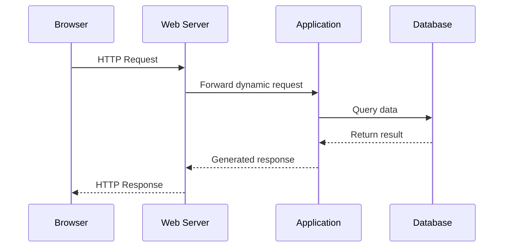
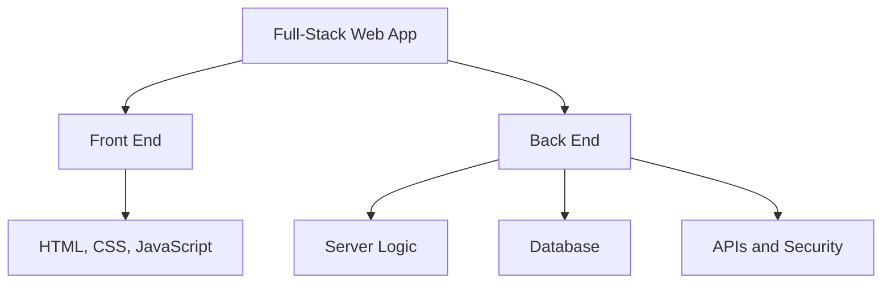
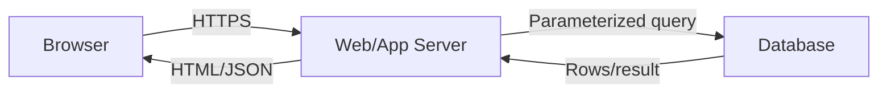
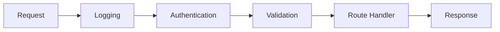
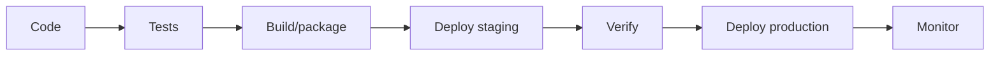

# 🖥️ Chapter 29: Introduction to Server-Side Programming


> [!TIP]
> **Chapter Goal:** Browser request server tak kaise jaati hai, server logic/database ke saath response kaise banata hai aur PHP se first dynamic webpage kaise run hota hai—ye complete foundation samajhna.

---

## 🎯 29.1 Learning Objectives

Is chapter ke baad aap:

- Client-side aur server-side programming compare karenge.
- Static aur dynamic websites explain karenge.
- HTTP request–response lifecycle trace karenge.
- Web server, application server and database ka role samjhenge.
- Routing, templates, validation, sessions and APIs ka introduction samjhenge.
- Common backend languages and architectures identify karenge.
- Local development server run karenge.
- Basic PHP dynamic page and form-response practical banayenge.
- Server-side security fundamentals follow karenge.

---

## 🗣️ 29.2 Difficult Words

| Word | Pronunciation | Simple Meaning |
|---|---|---|
| Server-Side | सर्वर साइड | Server par execute hone wala code |
| Back End | बैक एंड | Application ka server/data part |
| Dynamic | डायनैमिक — *dai-nam-ik* | Data ke according changing |
| Request | रिक्वेस्ट — *ri-kwest* | Client ki demand |
| Response | रिस्पॉन्स — *ri-spons* | Server ka answer |
| Routing | रूटिंग — *roo-ting* | URL ko handler se match karna |
| Middleware | मिडलवेयर — *mid-ul-wair* | Request pipeline ka intermediate code |
| Template | टेम्पलेट — *tem-plit* | Dynamic output structure |
| Session | सेशन — *sesh-un* | Multiple requests ke beech user state |
| Authentication | ऑथेन्टिकेशन | User identity verify karna |
| Authorization | ऑथराइजेशन | User permission check karna |
| Scalability | स्केलेबिलिटी | Growing traffic handle karne ki ability |
| Deployment | डिप्लॉयमेंट | Application live server par publish |
| Runtime | रनटाइम | Code execute hone ka environment |

---

# 🟦 Part A: Server-Side Fundamentals

## 29.3 Client and Server Revision

**Client** usually browser/app hai jo request bhejta hai.  
**Server** request receive karke resource or processed result return karta hai.



Not every request database tak jaati hai. Static file web server directly return kar sakta hai.

---

## 29.4 What Is Server-Side Programming?

Server-side programming means code server environment me execute hota hai.

It can:

- User input process
- Database read/write
- Authentication perform
- Permissions check
- Business rules apply
- Email/message trigger
- Files handle
- HTML generate
- JSON API response return
- Sessions manage

Browser normally server source code receive nahi karta. It receives generated output such as HTML, JSON, image or file.

---

## 29.5 Front End vs Back End

| Front End | Back End |
|---|---|
| Browser/user-facing | Server/data-facing |
| HTML, CSS, JavaScript | PHP, Node.js, Python, Java etc. |
| Layout and interaction | Business logic |
| DOM manipulation | Database operations |
| Client validation | Authoritative validation |
| Can be inspected by user | Source generally remains on server |
| Untrusted environment | Controlled environment, but inputs untrusted |

> [!IMPORTANT]
> Browser se aane wala every value untrusted samjhein—even if hidden field or JavaScript validation present ho.

---

## 29.6 Full-Stack Development

Full-stack developer front-end and back-end dono layers par work karta hai.



Full-stack ka meaning har technology expert hona nahi; complete application flow understand aur multiple layers me work karna hai.

---

# 🟩 Part B: Static and Dynamic Websites

## 29.7 Static Website

Static site pre-created files serve karti hai.

Examples:

- Portfolio
- Documentation
- Landing page
- Simple company information

Request:

```text
GET /about.html
```

Response file:

```html
<h1>About Us</h1>
```

Advantages:

- Simple
- Fast
- Low hosting cost
- Small attack surface
- Easy CDN caching

Limitations:

- Personalized content difficult
- Server-side data processing absent
- Manual updates for repeated content unless build tool used

---

## 29.8 Dynamic Website

Dynamic site request/user/data ke according response generate karti hai.

Examples:

- Login dashboard
- E-commerce
- Banking portal
- Social network
- College result system
- Content management system

```php
<?php
$name = "Broun";
?>
<h1>Welcome, <?= htmlspecialchars($name) ?></h1>
```

Same template different user ke liye different output generate kar sakta hai.

---

## 29.9 Static vs Dynamic

| Feature | Static | Dynamic |
|---|---|---|
| Response | Prebuilt file | Generated at request/build time |
| Database | Usually not required | Commonly used |
| Personalization | Limited | Strong |
| Complexity | Lower | Higher |
| Authentication | Usually external/absent | Common |
| Hosting | Static host/CDN | Runtime/server needed |
| Security responsibility | Lower but not zero | Higher |

Static frontend external dynamic API use karke interactive data bhi show kar sakta hai. “Static hosting” and “non-interactive” same nahi.

---

# 🟨 Part C: Server Architecture

## 29.10 Web Server

Web server HTTP connections handle aur resources serve karta hai.

Examples:

- Apache HTTP Server
- Nginx
- Caddy
- IIS

Possible work:

- Static files serve
- HTTPS terminate
- Redirect
- Compression/caching
- Reverse proxy
- Request application runtime ko forward

---

## 29.11 Application Server/Runtime

Application code execute karta hai.

Examples:

- PHP runtime with web server integration
- Node.js runtime
- Python WSGI/ASGI application server
- Java servlet container/application server
- .NET runtime/server

Beginner diagrams me “web server” and “application server” separate dikhte hain, but actual products/deployments responsibilities combine bhi kar sakte hain.

---

## 29.12 Database Server

Persistent structured data store/query karta hai.

Examples:

- MySQL
- PostgreSQL
- SQLite
- Microsoft SQL Server
- MongoDB

Application should database credentials browser ko expose nahi kare.



---

## 29.13 Three-Tier Architecture

1. **Presentation tier:** Browser/UI
2. **Application tier:** Business logic
3. **Data tier:** Database/storage

Benefits:

- Separation of concerns
- Easier maintenance
- Independent scaling
- Security boundaries
- Testing clarity

---

## 29.14 Monolith and Services Introduction

### Monolithic Application

UI-related backend, business logic and data-access code one deployable application me.

Benefits:

- Beginner-friendly
- Simple deployment
- Direct function calls
- Easier local development

### Service-Based/Microservices

Application multiple networked services me split.

Benefits may include independent deployment/scaling, but brings:

- Network complexity
- Distributed failures
- Monitoring needs
- Data consistency challenges
- Higher operational cost

> [!TIP]
> Small BCA project ke liye well-structured monolith often best starting point hai.

---

# 🟪 Part D: HTTP Request Lifecycle

## 29.15 Complete Request Flow

Example: user requests `/students/42`.

1. Browser URL parse karta hai.
2. DNS domain ko IP address me resolve karta hai.
3. Connection established; HTTPS uses TLS.
4. Browser HTTP request bhejta hai.
5. Web server request receive karta hai.
6. Router matching handler select karta hai.
7. Middleware may run.
8. Handler input validate karta hai.
9. Application database query kar sakti hai.
10. Template HTML or API JSON create hota hai.
11. Server headers/status/body return karta hai.
12. Browser response render/process karta hai.

---

## 29.16 Request Components

Example:

```http
POST /students HTTP/1.1
Host: example.com
Content-Type: application/x-www-form-urlencoded
Cookie: session=...

name=Broun&course=BCA
```

Parts:

- Method
- Path/query
- Protocol version
- Headers
- Optional body

---

## 29.17 Response Components

```http
HTTP/1.1 201 Created
Content-Type: application/json
Cache-Control: no-store

{"id":42,"name":"Broun","course":"BCA"}
```

Parts:

- Status line
- Headers
- Blank separator
- Optional body

---

## 29.18 Common Methods

| Method | Typical Intent |
|---|---|
| `GET` | Read resource |
| `POST` | Submit/create/process |
| `PUT` | Replace resource |
| `PATCH` | Partial update |
| `DELETE` | Delete resource |
| `HEAD` | Headers without body |
| `OPTIONS` | Communication options |

HTTP method alone permission/security provide nahi karta. Server must authenticate, authorize and validate.

---

## 29.19 Common Status Codes

| Code | Meaning |
|---:|---|
| 200 | OK |
| 201 | Created |
| 204 | No Content |
| 301/308 | Permanent redirect |
| 302/307 | Temporary redirect |
| 400 | Bad Request |
| 401 | Authentication required/invalid |
| 403 | Authenticated or known request not allowed |
| 404 | Not Found |
| 405 | Method Not Allowed |
| 422 | Semantically invalid input (common API use) |
| 500 | Internal Server Error |
| 503 | Service Unavailable |

Avoid returning `200 OK` for every error.

---

# 🟥 Part E: Routing and Controllers

## 29.20 What Is Routing?

Routing method + URL pattern ko handler se match karta hai.

Conceptual routing table:

| Method | Path | Handler |
|---|---|---|
| GET | `/students` | List students |
| GET | `/students/42` | Show student |
| POST | `/students` | Create student |
| PATCH | `/students/42` | Update student |
| DELETE | `/students/42` | Delete student |

---

## 29.21 Route Parameters and Query Parameters

Path parameter:

```text
/students/42
```

Here `42` specific student ID.

Query parameters:

```text
/students?course=BCA&page=2
```

Useful for filtering, sorting and pagination.

All values validate and normalize karein.

---

## 29.22 Controller/Handler

Pseudo-code:

```text
function showStudent(request):
    id = validateInteger(request.path.id)
    student = database.findStudent(id)

    if student not found:
        return response(404)

    return render("student-profile", student)
```

Handler orchestration kare; very large business logic separate services/functions me move ki ja sakti hai.

---

## 29.23 Middleware

Middleware request pipeline me handler se pehle/baad work karta hai.

Examples:

- Logging
- Authentication
- Rate limiting
- CORS
- Body parsing
- Security headers
- Error handling



Order important hai.

---

# 🟧 Part F: Templates and APIs

## 29.24 Server-Rendered HTML

Server data ko template me insert karta hai.

```php
<?php
$title = "BCA Student Portal";
$studentName = "Broun";
?>
<!DOCTYPE html>
<html lang="en">
<head>
    <meta charset="UTF-8">
    <title><?= htmlspecialchars($title) ?></title>
</head>
<body>
    <h1>Welcome, <?= htmlspecialchars($studentName) ?></h1>
</body>
</html>
```

Output encoding XSS risk reduce karne ke liye important hai.

---

## 29.25 JSON API

Server HTML ke instead data return kar sakta hai.

```json
{
  "id": 42,
  "name": "Broun",
  "course": "BCA"
}
```

Frontend:

```javascript
const response = await fetch("/api/students/42");

if (!response.ok) {
    throw new Error(`HTTP ${response.status}`);
}

const student = await response.json();
```

---

## 29.26 Server Rendering vs Client Rendering

| Server-Rendered HTML | Client-Rendered Data |
|---|---|
| Server ready HTML sends | Browser JS fetches/builds UI |
| Useful initial content | Rich interactions |
| Less JS possible | More client state/code |
| Templates on server | Components/templates on client |
| SEO often straightforward | SEO needs correct architecture |

Hybrid approaches both use kar sakti hain.

---

## 29.27 Content Types

Response header tells body format:

```http
Content-Type: text/html; charset=UTF-8
Content-Type: application/json
Content-Type: text/css
Content-Type: image/webp
```

Correct content type browser ko safe/correct processing me help karta hai.

---

# 🟫 Part G: State, Cookies and Sessions

## 29.28 HTTP Is Stateless

Default HTTP request previous request ko automatically “remember” nahi karti.

Login flow ko state chahiye:

1. User credentials submits.
2. Server verifies.
3. Server session creates.
4. Browser session identifier cookie receives.
5. Later request cookie sends.
6. Server session/user lookup karta hai.

---

## 29.29 Cookies

Server response:

```http
Set-Cookie: session=RANDOM_ID; HttpOnly; Secure; SameSite=Lax
```

Browser later sends:

```http
Cookie: session=RANDOM_ID
```

Important attributes:

- `HttpOnly`: client JS access reduce
- `Secure`: HTTPS only
- `SameSite`: cross-site sending control
- `Path` and `Domain`: scope
- `Max-Age`/`Expires`: lifetime

---

## 29.30 Sessions

Session data server-side store ho sakta hai:

```text
Session ID → User ID 42, role student, expiry...
```

Cookie ideally opaque random identifier hold karta hai, sensitive full user record nahi.

Security needs:

- Strong random IDs
- Regenerate after login
- Expiry
- Logout invalidation
- Secure cookie settings
- HTTPS
- CSRF protection where relevant

---

## 29.31 Authentication vs Authorization

**Authentication:** Aap kaun hain?

```text
Is username/password valid?
```

**Authorization:** Aapko kya permission hai?

```text
Can this student edit another student's marks?
```

A logged-in user automatically every action authorized nahi hota.

---

# 🟦 Part H: Database Interaction

## 29.32 CRUD Operations

| Operation | Meaning | Common SQL/HTTP |
|---|---|---|
| Create | New record | INSERT / POST |
| Read | Retrieve record | SELECT / GET |
| Update | Modify record | UPDATE / PUT/PATCH |
| Delete | Remove record | DELETE / DELETE |

Exact API design context ke according vary kar sakta hai.

---

## 29.33 Unsafe Query Example

Never concatenate untrusted input:

```php
$sql = "SELECT * FROM users WHERE email = '" . $_POST['email'] . "'";
```

This may enable SQL injection.

Use prepared statements:

```php
$stmt = $pdo->prepare(
    "SELECT id, name FROM users WHERE email = :email"
);

$stmt->execute([
    "email" => $email
]);
```

Prepared parameters code and data separate rakhte hain.

---

## 29.34 Transactions Introduction

Multiple related database changes all-or-nothing hone chahiye.

Example money transfer:

1. Debit Account A
2. Credit Account B

If step 2 fails, step 1 rollback hona chahiye.

Database transactions later chapters me detail se.

---

# 🟩 Part I: Backend Languages and Frameworks

## 29.35 Common Technologies

| Language/Runtime | Common Ecosystem Examples |
|---|---|
| PHP | Laravel, Symfony |
| JavaScript/Node.js | Express, Fastify, Nest |
| Python | Django, Flask, FastAPI |
| Java | Spring |
| C#/.NET | ASP.NET Core |
| Ruby | Rails |
| Go | Standard library, Gin, Echo |

Framework choose based on:

- Course/job requirements
- Team skill
- Hosting
- Ecosystem
- Security updates
- Performance needs
- Project size

This book next chapters me PHP use karegi.

---

## 29.36 Why PHP for Learning?

PHP:

- Web-focused language
- HTML ke saath easy start
- Large hosting support
- Forms/sessions/database APIs
- Popular CMS/framework ecosystem
- BCA curricula me common

Modern PHP project me:

- Supported PHP version
- Composer
- PDO
- Password hashing API
- Framework conventions
- Environment configuration
- Dependency updates

important hain.

---

# 🟨 Part J: Local Development Environment

## 29.37 What Is Localhost?

`localhost` current computer ko refer karta hai, commonly loopback IP `127.0.0.1` / `::1`.

Example:

```text
http://localhost:8000
```

Only your machine se normally accessible unless server/network configuration changes.

---

## 29.38 PHP Built-In Development Server

Project:

```text
first-server/
├── index.php
└── public/
```

Run project directory:

```bash
php -S localhost:8000
```

Open:

```text
http://localhost:8000
```

> [!WARNING]
> PHP built-in server development/testing ke liye hai, production public hosting ke liye nahi.

---

## 29.39 Local Stacks

Tools may bundle:

- Apache/Nginx
- PHP
- MySQL/MariaDB
- Admin tools

Examples include XAMPP, WampServer, MAMP or container-based environments.

Install only official/trusted sources, keep versions updated, and understand which services/ports run ho rahe hain.

---

## 29.40 Environment Configuration

Never hard-code production secrets:

```php
$password = "real-database-password";
```

Conceptual environment use:

```php
$databasePassword = getenv("DB_PASSWORD");
```

`.env` commonly local configuration ke liye used hoti hai but automatically secure nahi. It should not be committed, publicly served or logged.

---

# 🟪 Part K: First Dynamic PHP Page

## 29.41 Basic PHP Syntax Preview

`index.php`:

```php
<?php
declare(strict_types=1);

$pageTitle = "BCA Server-Side Demo";
$studentName = "Broun";
$currentHour = (int) date("G");

if ($currentHour < 12) {
    $greeting = "Good morning";
} elseif ($currentHour < 17) {
    $greeting = "Good afternoon";
} else {
    $greeting = "Good evening";
}
?>
<!DOCTYPE html>
<html lang="en">
<head>
    <meta charset="UTF-8">
    <meta
        name="viewport"
        content="width=device-width, initial-scale=1.0">
    <title><?= htmlspecialchars($pageTitle) ?></title>
</head>
<body>
    <main>
        <h1><?= htmlspecialchars($pageTitle) ?></h1>

        <p>
            <?= htmlspecialchars($greeting) ?>,
            <?= htmlspecialchars($studentName) ?>!
        </p>

        <p>
            Server time:
            <time datetime="<?= date("c") ?>">
                <?= date("d M Y, h:i:s A") ?>
            </time>
        </p>
    </main>
</body>
</html>
```

---

## 29.42 What Happens?

1. Browser requests `index.php`.
2. Server PHP runtime invokes.
3. PHP variables and condition execute.
4. `date()` server time reads.
5. PHP output HTML me inserted.
6. Server generated HTML browser ko sends.
7. Browser never receives original PHP code.

View Page Source me generated HTML dikhega.

---

## 29.43 Why Escape Output?

`htmlspecialchars()` HTML-special characters encode karta hai.

Input:

```text
<script>alert("XSS")</script>
```

Escaped output browser ko text dikhata hai, executable markup nahi.

For typical HTML text context:

```php
htmlspecialchars(
    $value,
    ENT_QUOTES | ENT_SUBSTITUTE,
    "UTF-8"
)
```

Context matters: HTML, attribute, URL, JavaScript and CSS contexts ke escaping rules differ. User data inline JavaScript me inject avoid karein.

---

# 🟥 Part L: Form Processing Practical

## 29.44 Project Structure

```text
greeting-app/
├── index.php
└── styles.css
```

---

## 29.45 Complete `index.php`

```php
<?php
declare(strict_types=1);

$name = "";
$course = "";
$message = "";
$errors = [];

if ($_SERVER["REQUEST_METHOD"] === "POST") {
    $name = trim((string) ($_POST["name"] ?? ""));
    $course = trim((string) ($_POST["course"] ?? ""));

    if ($name === "") {
        $errors["name"] = "Enter your name.";
    } elseif (mb_strlen($name) > 50) {
        $errors["name"] = "Name must be 50 characters or fewer.";
    }

    $allowedCourses = ["BCA", "MCA", "BSc CS"];

    if (!in_array($course, $allowedCourses, true)) {
        $errors["course"] = "Choose a valid course.";
    }

    if ($errors === []) {
        $safeName = htmlspecialchars(
            $name,
            ENT_QUOTES | ENT_SUBSTITUTE,
            "UTF-8"
        );

        $safeCourse = htmlspecialchars(
            $course,
            ENT_QUOTES | ENT_SUBSTITUTE,
            "UTF-8"
        );

        $message =
            "Welcome {$safeName}! You selected {$safeCourse}.";
    }
}

function old(string $value): string
{
    return htmlspecialchars(
        $value,
        ENT_QUOTES | ENT_SUBSTITUTE,
        "UTF-8"
    );
}
?>
<!DOCTYPE html>
<html lang="en">
<head>
    <meta charset="UTF-8">
    <meta
        name="viewport"
        content="width=device-width, initial-scale=1.0">
    <title>Server-Side Greeting Form</title>
    <link rel="stylesheet" href="styles.css">
</head>
<body>
    <main class="card">
        <h1>Server-Side Greeting Form</h1>

        <?php if ($message !== ""): ?>
            <p class="success" role="status">
                <?= $message ?>
            </p>
        <?php endif; ?>

        <?php if ($errors !== []): ?>
            <div class="error-summary" role="alert">
                Please correct the form errors.
            </div>
        <?php endif; ?>

        <form method="post" action="">
            <div class="field">
                <label for="name">Student name</label>

                <input
                    id="name"
                    name="name"
                    value="<?= old($name) ?>"
                    maxlength="50"
                    aria-describedby="name-error"
                    <?= isset($errors["name"])
                        ? 'aria-invalid="true"'
                        : "" ?>
                    required>

                <p id="name-error" class="error">
                    <?= old($errors["name"] ?? "") ?>
                </p>
            </div>

            <div class="field">
                <label for="course">Course</label>

                <select
                    id="course"
                    name="course"
                    aria-describedby="course-error"
                    <?= isset($errors["course"])
                        ? 'aria-invalid="true"'
                        : "" ?>
                    required>
                    <option value="">Choose course</option>

                    <?php foreach (["BCA", "MCA", "BSc CS"] as $option): ?>
                        <option
                            value="<?= old($option) ?>"
                            <?= $course === $option ? "selected" : "" ?>>
                            <?= old($option) ?>
                        </option>
                    <?php endforeach; ?>
                </select>

                <p id="course-error" class="error">
                    <?= old($errors["course"] ?? "") ?>
                </p>
            </div>

            <button type="submit">Create Greeting</button>
        </form>
    </main>
</body>
</html>
```

---

## 29.46 CSS

```css
* {
    box-sizing: border-box;
}

body {
    min-height: 100vh;
    margin: 0;
    display: grid;
    place-items: center;
    padding: 1rem;
    color: #172033;
    background: linear-gradient(135deg, #dbeafe, #ede9fe);
    font-family: system-ui, sans-serif;
}

.card {
    width: min(100%, 38rem);
    padding: 2rem;
    border-radius: 1rem;
    background: white;
    box-shadow: 0 1rem 3rem rgb(15 23 42 / 15%);
}

.field {
    margin-block: 1rem;
}

label {
    display: block;
    margin-bottom: 0.35rem;
    font-weight: 700;
}

input,
select,
button {
    width: 100%;
    padding: 0.75rem;
    font: inherit;
}

[aria-invalid="true"] {
    border: 2px solid #b91c1c;
}

.error {
    min-height: 1.5rem;
    color: #b91c1c;
}

.error-summary {
    padding: 1rem;
    border-left: 0.35rem solid #b91c1c;
    background: #fef2f2;
}

.success {
    padding: 1rem;
    border-left: 0.35rem solid #15803d;
    background: #f0fdf4;
}

button {
    border: 0;
    border-radius: 0.5rem;
    color: white;
    background: #6d28d9;
    cursor: pointer;
}
```

---

## 29.47 Run the Practical

Inside folder:

```bash
php -S localhost:8000
```

Open:

```text
http://localhost:8000
```

Test:

1. Empty form
2. Valid name and course
3. Name over 50 characters
4. Manually modified invalid course request
5. HTML-like name text
6. Refresh/resubmit behavior

---

## 29.48 Practical Explanation

1. `$_SERVER["REQUEST_METHOD"]` GET/POST identify karta hai.
2. `$_POST` submitted body fields read karta hai.
3. Null coalescing missing keys safely handles.
4. `trim()` outer whitespace normalize karta hai.
5. Server all allowed values validates.
6. Strict `in_array(..., true)` type-aware match performs.
7. Errors field-specific associative array me stored.
8. `htmlspecialchars()` output encode karta hai.
9. Old safe values form me redisplay hote hain.
10. `aria-invalid` and described error text accessibility improve karte hain.
11. Response server par generate hota hai.
12. No database used yet; next chapters progression continue karegi.

---

# 🟦 Part M: Error Handling and Logging

## 29.49 Development vs Production Errors

Development:

- Detailed message
- Stack trace
- File and line
- Debug toolbar/logs

Production user:

```text
Something went wrong. Please try again.
```

Production detailed errors public output me sensitive paths, queries, versions or data expose kar sakte hain. Details server logs me, safe message user ko.

---

## 29.50 Logging

Log useful:

- Timestamp
- Request/correlation ID
- Route
- Error type
- Safe context
- Stack trace in secure server log

Avoid logging:

- Passwords
- Full tokens
- Private keys
- Sensitive personal data
- Full payment details
- Session IDs

Logs access-controlled and rotated honi chahiye.

---

# 🟩 Part N: Security Fundamentals

## 29.51 Validate on Server

HTML and JavaScript validation UX improve karte hain. Server must validate again:

- Presence
- Type
- Length
- Range
- Format
- Allowed values
- Ownership
- Permissions
- Business rules

---

## 29.52 Output Encoding

Store or receive data karne ke baad output context ke according encode karein.

For HTML text:

```php
htmlspecialchars($value, ENT_QUOTES | ENT_SUBSTITUTE, "UTF-8")
```

Encoding ko input validation ka replacement na samjhein.

---

## 29.53 SQL Injection Prevention

Use:

- Prepared statements
- Bound parameters
- Least-privilege database user
- Validation
- Safe error handling

Never construct SQL by raw concatenation.

---

## 29.54 Password Security

Never:

- Plain-text store
- Reversible encryption as password storage
- Email/log password
- Own weak hashing algorithm

PHP provides:

```php
$hash = password_hash($password, PASSWORD_DEFAULT);
$isValid = password_verify($password, $hash);
```

Authentication chapter me detail.

---

## 29.55 CSRF Introduction

Cookie-authenticated state-changing requests may need Cross-Site Request Forgery protection.

Common measures:

- CSRF tokens
- SameSite cookies
- Origin checks where appropriate
- Correct HTTP methods
- Re-authentication for sensitive operations

GET request state change ideally na kare.

---

## 29.56 HTTPS

HTTPS:

- Data in transit encrypt
- Server identity authenticate through certificates
- Tampering resistance provide

HTTPS application bugs or malicious server ko prevent nahi karta, but production authentication/data ke liye essential hai.

---

## 29.57 Least Privilege

Give only required permissions:

- Database user
- File system
- API token
- Cloud role
- Admin account

Application compromise impact reduce hota hai.

---

# 🟨 Part O: Performance and Scalability

## 29.58 Basic Performance Areas

- Database query efficiency
- Indexes
- Avoid repeated queries
- Caching
- Compression
- Static assets via CDN
- Pagination
- Background jobs
- Connection management
- Profiling/monitoring

Measure real bottleneck before complex optimization.

---

## 29.59 Caching Layers

Possible caches:

- Browser cache
- CDN
- Reverse proxy
- Application cache
- Database cache

Challenge: stale data and invalidation. Sensitive/private responses ko public cache na karein.

---

## 29.60 Horizontal and Vertical Scaling

**Vertical:** Stronger single machine—more CPU/RAM.

**Horizontal:** More server instances.

Horizontal scaling may require:

- Shared/external sessions
- Load balancer
- Shared database/storage
- Stateless application design where possible
- Distributed monitoring

Beginner project me scaling architecture overcomplicate na karein.

---

# 🟪 Part P: Deployment Concepts

## 29.61 Development, Staging and Production

| Environment | Purpose |
|---|---|
| Development | Local coding/debugging |
| Testing | Automated/manual verification |
| Staging | Production-like pre-release |
| Production | Real users |

Configuration environment-specific ho; source code and rules consistent.

---

## 29.62 Typical Deployment Needs

Dynamic PHP app needs:

- Supported PHP runtime
- Web server
- Domain/DNS
- HTTPS certificate
- Database if required
- Environment secrets
- File permissions
- Logs/monitoring
- Backups
- Update/rollback process

GitHub Pages PHP execute nahi karta because it hosts static output.

---

## 29.63 Deployment Pipeline



Never treat deployment as only “copy files.” Database migrations, environment config, health checks and rollback matter.

---

## 🚫 29.64 Common Mistakes

1. Front-end validation ko trusted security samajhna.
2. Browser ko database credentials expose karna.
3. Static and dynamic hosting confuse karna.
4. HTTP status codes wrong use karna.
5. User input raw HTML/SQL me insert karna.
6. Authentication and authorization confuse karna.
7. Password plain text store karna.
8. Session cookie secure attributes omit karna.
9. GET request se destructive action.
10. Detailed errors production users ko show karna.
11. Logs me secrets store karna.
12. PHP built-in server production me use karna.
13. Database query inside every template section without structure.
14. Small project ko premature microservices me split karna.
15. Backups and monitoring ignore karna.

---

## 📌 29.65 Best Practices

- Request boundaries par input validate.
- Output context-aware encode.
- SQL prepared statements.
- Password APIs use.
- Authentication ke baad authorization check.
- Semantic correct status codes.
- Secrets environment/config system me.
- HTTPS production me.
- Errors safely log; users ko clear generic message.
- Small handlers and separated responsibilities.
- Supported runtimes/dependencies update.
- Backups test.
- Performance measure.
- Simple architecture se start.

---

## 📝 29.66 Chapter Summary

Server-side programming server environment me requests process, business rules apply, databases access, sessions manage and HTML/JSON responses generate karti hai. Static sites prebuilt files serve karti hain; dynamic applications request/data based output generate karti hain. Web server, application runtime and database common three-tier architecture banate hain. HTTP requests methods, path, headers and body contain kar sakti hain; responses status, headers and body return karti hain. Routing handlers choose karta hai and middleware cross-cutting work performs. HTTP stateless hai, so cookies/sessions user state manage kar sakte hain. Every browser input untrusted hai; server validation, output encoding, prepared SQL, authorization, secure password hashing and HTTPS essential hain.

---

## 🎲 29.67 MCQs

1. Server-side code kaha executes?  
   A. CSS file · **B. Server/runtime** · C. Keyboard · D. DNS only

2. Static site response usually?  
   A. Database query always · **B. Prebuilt file** · C. PHP required · D. Session required

3. URL ko handler se match?  
   A. Styling · **B. Routing** · C. Caching · D. Hashing

4. New resource typical method?  
   A. GET · **B. POST** · C. HEAD · D. OPTIONS

5. Created status?  
   A. 200 only · **B. 201** · C. 404 · D. 500

6. HTTP default nature?  
   A. Stateful · **B. Stateless** · C. Encrypted always · D. Offline

7. SQL injection defense?  
   A. Concatenation · **B. Prepared statements** · C. CSS validation · D. Hidden field

8. Password verification PHP API?  
   A. `md5()` · **B. `password_verify()`** · C. `base64_decode()` · D. `htmlspecialchars()`

---

## ✍️ 29.68 Fill in the Blanks

1. Browser-facing layer ko __________ end kehte hain.
2. Data create/read/update/delete ko __________ kehte hain.
3. User identity verification __________ hai.
4. Permission checking __________ hai.
5. Development PHP server command starts with __________.

<details>
<summary><strong>✅ Answers</strong></summary>

1. front  
2. CRUD  
3. authentication  
4. authorization  
5. `php -S`

</details>

---

## ✅ 29.69 True or False

1. Browser validation bypass nahi ho sakti — **False**
2. Server can generate HTML or JSON — **True**
3. Every request database access karti hai — **False**
4. HTTP default stateless hai — **True**
5. Hidden fields trusted server data hain — **False**
6. Prepared statements SQL injection risk reduce karte hain — **True**
7. GitHub Pages PHP execute karta hai — **False**
8. Production errors me stack trace users ko dikhana best hai — **False**

---

## ❓ 29.70 Exam Questions

### Short Answer

1. Define server-side programming.
2. Front end and back end compare karein.
3. Static and dynamic websites compare karein.
4. Web server kya karta hai?
5. Three-tier architecture explain karein.
6. HTTP request lifecycle describe karein.
7. Routing and middleware define karein.
8. Session kya hai?
9. Authentication and authorization compare karein.
10. Server validation kyun mandatory hai?

### Long Answer

1. Explain client-server dynamic web architecture.
2. Describe complete HTTP request–response lifecycle.
3. Explain routing, handlers and middleware.
4. Discuss server-rendered HTML and JSON APIs.
5. Explain cookies, sessions and authentication flow.
6. Discuss database CRUD and prepared statements.
7. Explain server-side security fundamentals.
8. Build and explain the PHP greeting form.

---

## 🧪 29.71 Practical Exercises

1. Static and dynamic response compare karein.
2. Browser Network panel me request inspect karein.
3. HTTP methods/routes table design karein.
4. Local PHP server run karein.
5. Dynamic date/greeting page banayein.
6. GET query parameter read karein safely.
7. POST greeting form banayein.
8. Allowed-course server validation add karein.
9. Output escaping test karein.
10. Correct status codes ka small PHP example banayein.
11. Session-based visit counter preview banayein.
12. Student CRUD architecture diagram banayein.
13. Security checklist apply karein.
14. PHP app and GitHub Pages limitation explain karein.
15. Practical me Post/Redirect/Get improvement plan banayein.

---

## 🎤 29.72 Viva Questions

1. Server-side programming kya hai?
2. Dynamic page kya hai?
3. Web server ka role?
4. Application runtime kya hai?
5. Database credentials browser me kyun nahi?
6. Routing kya hai?
7. Middleware kya hai?
8. HTTP stateless ka meaning?
9. Cookie and session difference?
10. Authentication kya hai?
11. Authorization kya hai?
12. Prepared statement kya hai?
13. Output escaping kyun?
14. PHP built-in server production ke liye kyun nahi?
15. Three-tier architecture ke tiers?

---

## 🏁 29.73 One-Minute Revision

| Question | Quick Answer |
|---|---|
| Browser layer? | Front end |
| Server/data layer? | Back end |
| Prebuilt response? | Static |
| Generated response? | Dynamic |
| Request handler selection? | Routing |
| Pipeline helper? | Middleware |
| Data operations? | CRUD |
| User identity? | Authentication |
| User permission? | Authorization |
| User state? | Session |
| Safe SQL? | Prepared statement |
| Safe HTML text? | Output encoding |
| Secure transport? | HTTPS |
| PHP local server? | `php -S localhost:8000` |
| Live dynamic host needs? | Server runtime |

---

## 📚 29.74 Official References

1. [MDN — Introduction to the Server Side](https://developer.mozilla.org/docs/Learn_web_development/Extensions/Server-side/First_steps/Introduction)
2. [MDN — Client-Server Overview](https://developer.mozilla.org/docs/Learn_web_development/Extensions/Server-side/First_steps/Client-Server_overview)
3. [PHP Manual — Getting Started](https://www.php.net/manual/en/getting-started.php)
4. [PHP Manual — Built-in Web Server](https://www.php.net/manual/en/features.commandline.webserver.php)
5. [OWASP — Input Validation Cheat Sheet](https://cheatsheetseries.owasp.org/cheatsheets/Input_Validation_Cheat_Sheet.html)

---

[⬅️ Previous Chapter](28-building-and-publishing-a-responsive-website.md) · [📚 Table of Contents](../SUMMARY.md) · **Next: PHP Fundamentals ➡️**
