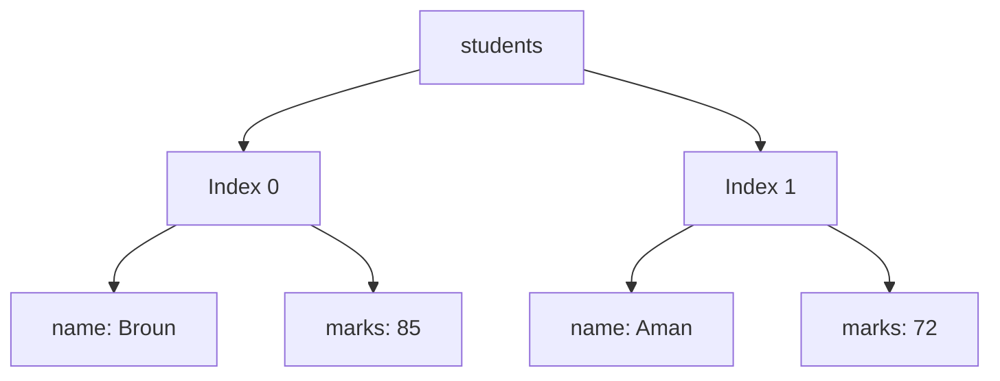

# 🐘 Chapter 30: PHP Fundamentals


> [!TIP]
> **Chapter Goal:** PHP syntax, variables, types, operators, control structures, arrays, strings and functions use karke safe dynamic server-side programs banana.

> [!NOTE]
> Examples modern supported PHP versions ke style me likhe gaye hain. Installed version check karne ke liye `php --version` run karein and version-specific behavior official manual se verify karein.

---

## 🎯 30.1 Learning Objectives

Is chapter ke baad aap:

- PHP execution model and syntax explain karenge.
- Variables, constants and data types use karenge.
- Type declarations and strict typing ka basic use samjhenge.
- Arithmetic, comparison, logical and string operators use karenge.
- Conditions, `match` and loops likhenge.
- Indexed, associative and multidimensional arrays process karenge.
- Strings safely manipulate aur output karenge.
- Typed functions with parameters and return values banayenge.
- Includes and reusable helpers use karenge.
- Complete marks-report generator practical banayenge.

---

## 🗣️ 30.2 Difficult Words

| Word | Pronunciation | Simple Meaning |
|---|---|---|
| PHP | पी-एच-पी | Server-side scripting language |
| Syntax | सिन्टैक्स — *sin-taks* | Code likhne ke grammar rules |
| Variable | वेरिएबल — *vair-ee-uh-bul* | Named value storage |
| Constant | कॉन्स्टन्ट — *kon-stunt* | Reassign na hone wala name |
| Scalar | स्केलर — *skay-ler* | Single basic value |
| Declaration | डेक्लेरेशन | Name/type define karna |
| Coercion | कोअर्शन — *koh-ur-shun* | Automatic type conversion |
| Associative | असोसिएटिव | Named keys wala |
| Iterable | इटरेबल — *it-er-uh-bul* | Loop kiya ja sakne wala |
| Callable | कॉलेबल — *kawl-uh-bul* | Function ki tarah call hone wala |
| Namespace | नेमस्पेस | Names ko organize/isolate karna |
| Escape | एस्केप — *es-kayp* | Output ko context-safe banana |
| Nullable | नलेबल — *nul-uh-bul* | Null allow karne wala type |
| Variadic | वैरिएडिक — *vair-ee-ad-ik* | Variable number of arguments |

---

# 🟦 Part A: PHP Introduction and Syntax

## 30.3 What Is PHP?

PHP ka current recursive full form **PHP: Hypertext Preprocessor** hai. It is a general-purpose scripting language especially suited to web development.

PHP can:

- Dynamic HTML generate
- Forms process
- Sessions/cookies manage
- Database access
- JSON APIs create
- Files handle
- Command-line scripts run
- Emails/jobs trigger through suitable libraries/services

PHP code server par execute hota hai; browser generated response receive karta hai.

---

## 30.4 First PHP Program

`hello.php`:

```php
<?php
echo "Hello, PHP!";
```

Run from command line:

```bash
php hello.php
```

Or development server:

```bash
php -S localhost:8000
```

Then browser:

```text
http://localhost:8000/hello.php
```

---

## 30.5 PHP Tags

Standard opening tag:

```php
<?php
echo "Hello";
```

HTML template shorthand output:

```php
<h1><?= $pageTitle ?></h1>
```

`<?= ... ?>` equivalent echo-style output tag hai.

> [!TIP]
> Pure PHP file me closing `?>` commonly omit karte hain, so accidental trailing whitespace/output avoid ho.

---

## 30.6 Statements and Semicolons

```php
<?php

$name = "Broun";
$course = "BCA";

echo $name;
```

Most PHP statements semicolon `;` se end hote hain.

---

## 30.7 Comments

```php
// Single-line comment

# Single-line comment, less commonly preferred

/*
    Multi-line comment
*/
```

Comments intention explain karein; obvious code repeat na karein.

---

## 30.8 Mixing PHP and HTML

```php
<?php
$pageTitle = "Student Profile";
$name = "Broun";
?>
<!DOCTYPE html>
<html lang="en">
<head>
    <meta charset="UTF-8">
    <title><?= htmlspecialchars($pageTitle) ?></title>
</head>
<body>
    <h1><?= htmlspecialchars($name) ?></h1>
</body>
</html>
```

Complex calculations template se pehle/helper layer me rakhein.

---

## 30.9 Output: `echo` and `print`

```php
echo "Hello";
echo "Name: ", $name;

print "Welcome";
```

- `echo` multiple expressions accept kar sakta hai.
- `print` one expression and returns `1`.
- Normal output me `echo` common hai.

Debugging:

```php
var_dump($name);
print_r($student);
```

Production user output me raw debug dump avoid karein.

---

## 30.10 Strict Types Declaration

```php
<?php
declare(strict_types=1);
```

File ke beginning me declare kiya jata hai.

It affects scalar type coercion for function calls made from that file. It PHP ko globally/static typed language nahi banata, and every included file has its own declaration behavior.

---

# 🟩 Part B: Variables and Constants

## 30.11 Variables

PHP variable dollar sign se start:

```php
$name = "Broun";
$age = 20;
$isStudent = true;
```

Rules:

- `$` required
- Letter or underscore after `$`
- Remaining letters, digits, underscores
- Case-sensitive
- Meaningful names

`$name` and `$Name` different variables hain.

---

## 30.12 Assignment

```php
$marks = 80;
$marks = 90;

$bonus = 5;
$marks += $bonus;
```

Assignment value copy/reference semantics type ke according behave karti hai. PHP references explicit `&` syntax use kar sakti hain, but beginners should normal value flow prefer karein.

---

## 30.13 Checking Variables

```php
isset($name);
empty($name);
unset($name);
```

- `isset()` false if undefined or `null`.
- `empty()` many “empty-like” values par true, including `0` and `"0"`.
- `unset()` variable remove karta hai.

> [!WARNING]
> `empty()` valid zero ko empty treat kar sakta hai. Exact business rule ke liye strict checks use karein.

---

## 30.14 Constants

Using `const`:

```php
const PASS_MARKS = 40;
const MAX_MARKS = 100;
```

Using `define()`:

```php
define("APP_NAME", "BCA Portal");
```

Naming convention often uppercase snake case. Constants ko `$` nahi lagta.

---

## 30.15 Magic Constants

Examples:

```php
echo __FILE__;
echo __DIR__;
echo __LINE__;
echo __FUNCTION__;
```

Value context/location ke according provided hoti hai.

Useful include:

```php
require __DIR__ . "/includes/header.php";
```

---

# 🟨 Part C: PHP Data Types

## 30.16 Type System Overview

PHP dynamically typed language hai, with optional type declarations.

Common types:

### Scalar

- `bool`
- `int`
- `float`
- `string`

### Compound

- `array`
- `object`
- `callable`
- `iterable`

### Special

- `null`
- `resource`

Modern PHP also supports union/intersection and other advanced type declarations in supported versions.

---

## 30.17 Boolean

```php
$isLoggedIn = true;
$hasPaid = false;
```

Falsy conversions include values such as:

- `false`
- `0`
- `0.0`
- `""`
- `"0"`
- `[]`
- `null`

Use strict comparison when distinction matters.

---

## 30.18 Integer and Float

```php
$age = 20;
$negative = -5;
$hexValue = 0xFF;

$percentage = 87.5;
$price = 199.99;
```

Floating-point precision limitations apply. Financial values ke liye integer smallest units or suitable decimal approach use karein.

---

## 30.19 String

```php
$single = 'BCA';
$double = "Web Technology";
```

Single quoted strings limited interpolation/escapes:

```php
$name = "Broun";

echo 'Hello $name'; // literal $name
echo "Hello $name"; // interpolated
```

Clear interpolation:

```php
echo "Welcome, {$name}!";
```

Concatenation uses dot:

```php
$message = "Hello, " . $name . "!";
```

JavaScript ki tarah `+` string concatenation ke liye use nahi hota.

---

## 30.20 Null

```php
$selectedCourse = null;
```

Null check:

```php
$selectedCourse === null;
```

Null coalescing:

```php
$name = $_GET["name"] ?? "Guest";
```

---

## 30.21 Array

PHP array actually ordered map hai. It can act as list or key-value map.

Indexed:

```php
$subjects = ["HTML", "CSS", "PHP"];
```

Associative:

```php
$student = [
    "name" => "Broun",
    "course" => "BCA",
];
```

Detailed arrays later in this chapter.

---

## 30.22 Object and Resource Preview

Object:

```php
$student = new stdClass();
$student->name = "Broun";
```

Resource represents external resource handle in certain APIs, such as open streams.

```php
$file = fopen("notes.txt", "r");
```

Classes/objects Chapter 33 me detail se.

---

## 30.23 Inspecting Types

```php
gettype($value);
var_dump($value);

is_string($value);
is_int($value);
is_float($value);
is_bool($value);
is_array($value);
is_null($value);
```

Runtime type check input validation ka small part ho sakta hai.

---

## 30.24 Type Casting

```php
$number = (int) "42";
$decimal = (float) "3.14";
$text = (string) 100;
$flag = (bool) 1;
```

Safer input conversion may use filter/validation:

```php
$age = filter_var(
    $rawAge,
    FILTER_VALIDATE_INT,
    [
        "options" => [
            "min_range" => 1,
            "max_range" => 120,
        ],
    ]
);
```

Remember valid integer `0` and failure `false` strictly distinguish karein.

---

# 🟪 Part D: Operators

## 30.25 Arithmetic Operators

```php
$a = 10;
$b = 3;

$a + $b; // 13
$a - $b; // 7
$a * $b; // 30
$a / $b; // 3.333...
$a % $b; // 1
$a ** $b; // 1000
```

Division by zero behavior/errors version/context dependent ho sakte hain; denominator validate karein.

---

## 30.26 Assignment Operators

```php
$total = 100;
$total += 20;
$total -= 10;
$total *= 2;
$total /= 4;

$message = "Hello";
$message .= ", Broun";
```

`.=` concatenation assignment hai.

---

## 30.27 Comparison Operators

```php
5 == "5";   // true: loose comparison
5 === "5";  // false: strict comparison

5 != "5";   // false
5 !== "5";  // true

10 > 5;
10 >= 10;
5 < 10;
5 <= 5;
```

> [!IMPORTANT]
> Most validation/business rules me `===` and `!==` prefer karein to unexpected type juggling reduce ho.

---

## 30.28 Spaceship Operator

```php
1 <=> 2; // -1
2 <=> 2; // 0
3 <=> 2; // 1
```

Sorting callbacks me useful:

```php
usort($marks, fn (int $a, int $b): int => $a <=> $b);
```

---

## 30.29 Logical Operators

```php
$isEligible = $marks >= 40 && $attendance >= 75;
$canEnter = $isStudent || $isTeacher;
$isBlocked = !$isActive;
```

PHP also has `and` and `or`, but their precedence differs from `&&`/`||`. Assignment expressions me confusion avoid karne ke liye parentheses and common operators use karein.

---

## 30.30 Null Coalescing

```php
$username = $_POST["username"] ?? "Guest";
```

Chaining:

```php
$city =
    $profile["city"]
    ?? $account["city"]
    ?? "Unknown";
```

Null coalescing assignment:

```php
$config["theme"] ??= "light";
```

---

## 30.31 Ternary Operator

```php
$result = $marks >= 40 ? "Pass" : "Fail";
```

Shorthand:

```php
$displayName = $name ?: "Guest";
```

Shorthand falsy values (including `"0"`) replace karega; null-only fallback ke liye `??`.

---

## 30.32 Operator Precedence

```php
$result = 2 + 3 * 4; // 14
$result = (2 + 3) * 4; // 20
```

Parentheses intention clear karti hain. Full precedence memorize karne ke bajay official table refer karein.

---

# 🟥 Part E: Conditional Statements

## 30.33 `if...elseif...else`

```php
if ($percentage >= 90) {
    $grade = "A+";
} elseif ($percentage >= 75) {
    $grade = "A";
} elseif ($percentage >= 60) {
    $grade = "B";
} elseif ($percentage >= 40) {
    $grade = "C";
} else {
    $grade = "Fail";
}
```

Highest range first.

---

## 30.34 Alternative Template Syntax

```php
<?php if ($isLoggedIn): ?>
    <p>Welcome back!</p>
<?php else: ?>
    <a href="/login.php">Log in</a>
<?php endif; ?>
```

Loops also:

```php
<?php foreach ($subjects as $subject): ?>
    <li><?= htmlspecialchars($subject) ?></li>
<?php endforeach; ?>
```

HTML templates me braces ke comparison me readability improve ho sakti hai.

---

## 30.35 `switch`

```php
switch ($role) {
    case "admin":
        $message = "Full access";
        break;

    case "teacher":
        $message = "Teaching access";
        break;

    default:
        $message = "Student access";
}
```

`switch` loose comparison semantics use karta hai. Missing `break` fall-through kar sakta hai.

---

## 30.36 `match` Expression

```php
$message = match ($role) {
    "admin" => "Full access",
    "teacher" => "Teaching access",
    "student" => "Student access",
    default => "Unknown role",
};
```

`match`:

- Value return karta hai
- Strict comparison use karta hai
- No fall-through
- Often concise

Multiple values:

```php
$category = match ($status) {
    200, 201, 204 => "Success",
    400, 404 => "Client issue",
    500, 503 => "Server issue",
    default => "Other",
};
```

---

# 🟧 Part F: Loops

## 30.37 `for` Loop

```php
for ($number = 1; $number <= 5; $number++) {
    echo $number;
}
```

Multiplication table:

```php
$tableOf = 7;

for ($i = 1; $i <= 10; $i++) {
    $product = $tableOf * $i;

    echo "{$tableOf} × {$i} = {$product}<br>";
}
```

If output contains untrusted values, encode them.

---

## 30.38 `while` Loop

```php
$count = 1;

while ($count <= 5) {
    echo $count;
    $count++;
}
```

Condition body se pehle check hoti hai.

---

## 30.39 `do...while`

```php
$count = 1;

do {
    echo $count;
    $count++;
} while ($count <= 5);
```

Body at least once runs.

---

## 30.40 `foreach`

Values:

```php
$subjects = ["HTML", "CSS", "PHP"];

foreach ($subjects as $subject) {
    echo $subject;
}
```

Key and value:

```php
$student = [
    "name" => "Broun",
    "course" => "BCA",
];

foreach ($student as $key => $value) {
    echo "{$key}: {$value}";
}
```

Template output encode karein.

---

## 30.41 `break` and `continue`

```php
foreach ($marks as $mark) {
    if ($mark < 0) {
        break;
    }

    if ($mark === 0) {
        continue;
    }

    echo $mark;
}
```

- `break` loop stop
- `continue` current iteration skip

Nested loop levels optional numeric arguments support karte hain, but clarity carefully maintain karein.

---

# 🟫 Part G: Arrays

## 30.42 Indexed Arrays

```php
$subjects = ["HTML", "CSS", "JavaScript"];

echo $subjects[0];

$subjects[] = "PHP";
$subjects[1] = "Advanced CSS";

unset($subjects[2]);
```

`unset()` numeric indexes automatically reindex nahi karta. If needed:

```php
$subjects = array_values($subjects);
```

---

## 30.43 Associative Arrays

```php
$student = [
    "id" => 1,
    "name" => "Broun",
    "course" => "BCA",
    "marks" => 85,
];

echo $student["name"];

$student["semester"] = 2;
$student["marks"] = 90;
```

Safe fallback:

```php
$city = $student["city"] ?? "Not provided";
```

Undefined key access warning produce kar sakta hai.

---

## 30.44 Multidimensional Arrays

```php
$students = [
    [
        "id" => 1,
        "name" => "Broun",
        "marks" => 85,
    ],
    [
        "id" => 2,
        "name" => "Aman",
        "marks" => 72,
    ],
];

echo $students[0]["name"];
```



---

## 30.45 Adding and Removing

```php
$subjects[] = "PHP";
array_push($subjects, "MySQL", "AJAX");

$last = array_pop($subjects);
$first = array_shift($subjects);

array_unshift($subjects, "Web Basics");
```

Single append ke liye `$array[] = value` concise hai.

---

## 30.46 Search and Keys

```php
in_array("PHP", $subjects, true);
array_search("PHP", $subjects, true);

array_key_exists("name", $student);
isset($student["name"]);
```

Difference:

- `array_key_exists()` true even if key value `null`.
- `isset()` false when value `null`.

Strict argument `true` type juggling avoid karta hai.

---

## 30.47 Useful Array Functions

```php
count($subjects);
array_keys($student);
array_values($student);
array_merge($firstArray, $secondArray);
array_slice($subjects, 0, 2);
```

Array unpacking:

```php
$allSubjects = [
    ...$frontendSubjects,
    ...$backendSubjects,
];
```

String keys for unpacking modern PHP versions me supported hain; duplicate string keys later values overwrite and integer keys renumber semantics follow karte hain.

---

## 30.48 `array_map()`

```php
$marks = [50, 60, 70];

$bonusMarks = array_map(
    fn (int $mark): int => $mark + 5,
    $marks
);
```

New array returns.

---

## 30.49 `array_filter()`

```php
$passingMarks = array_filter(
    $marks,
    fn (int $mark): bool => $mark >= 40
);
```

Original keys preserve ho sakte hain. JSON/list index continuity needed ho to:

```php
$passingMarks = array_values($passingMarks);
```

---

## 30.50 `array_reduce()`

```php
$total = array_reduce(
    $marks,
    fn (int $sum, int $mark): int => $sum + $mark,
    0
);
```

Simple `array_sum($marks)` sum ke liye clearer hai.

---

## 30.51 Sorting Arrays

Values ascending:

```php
sort($marks);
```

Values descending:

```php
rsort($marks);
```

Associative by value:

```php
asort($student);
arsort($student);
```

By key:

```php
ksort($student);
krsort($student);
```

Custom:

```php
usort(
    $students,
    fn (array $a, array $b): int =>
        $b["marks"] <=> $a["marks"]
);
```

Most sorting functions mutate original array.

---

# 🟦 Part H: Strings

## 30.52 String Length

```php
strlen("PHP");
```

`strlen()` bytes count karta hai. UTF-8 human characters ke liye mbstring extension ka `mb_strlen()` useful:

```php
mb_strlen($name, "UTF-8");
```

Server environment me mbstring availability verify karein.

---

## 30.53 Common String Functions

```php
trim($text);
strtolower($text);
strtoupper($text);
str_contains($text, "PHP");
str_starts_with($text, "Learn");
str_ends_with($text, "today");
str_replace("PHP", "Modern PHP", $text);
substr($text, 0, 5);
```

For Unicode-aware case/conversion operations, mbstring functions where appropriate use karein.

---

## 30.54 Split and Join

```php
$csv = "HTML,CSS,PHP";

$subjects = explode(",", $csv);
$output = implode(" | ", $subjects);
```

- `explode()` string → array
- `implode()` array → string

---

## 30.55 Heredoc and Nowdoc

Heredoc interpolates:

```php
$message = <<<TEXT
Hello {$name},
Welcome to PHP.
TEXT;
```

Nowdoc single-quoted behavior:

```php
$template = <<<'TEXT'
Hello $name
TEXT;
```

Closing identifier indentation rules depend on supported PHP syntax; keep formatting clear.

---

## 30.56 HTML Output Encoding Helper

```php
function escape(string $value): string
{
    return htmlspecialchars(
        $value,
        ENT_QUOTES | ENT_SUBSTITUTE,
        "UTF-8"
    );
}
```

Usage:

```php
<h1><?= escape($student["name"]) ?></h1>
```

Only values guaranteed strings pass karein or intentional conversion perform karein.

---

# 🟩 Part I: Functions

## 30.57 Basic Function

```php
function greet(string $name): string
{
    return "Hello, {$name}!";
}

$message = greet("Broun");
```

Parts:

- `function` keyword
- Name
- Parameters
- Parameter types
- Return type
- Body
- Return statement

---

## 30.58 Default and Named Arguments

```php
function calculateFee(
    float $amount,
    float $discount = 0.0
): float {
    return $amount - ($amount * $discount);
}

calculateFee(1000);
calculateFee(amount: 1000, discount: 0.10);
```

Named arguments parameter names ko caller API ka part bana dete hain. Library parameter rename breaking change ho sakta hai.

---

## 30.59 Nullable and Union Types

Nullable:

```php
function findName(int $id): ?string
{
    return $id === 1 ? "Broun" : null;
}
```

Equivalent union style:

```php
function findName(int $id): string|null
{
    return $id === 1 ? "Broun" : null;
}
```

Union:

```php
function normalizeId(int|string $id): string
{
    return (string) $id;
}
```

Types meaningful rakhein; excessive `mixed` avoid when clear type possible.

---

## 30.60 Variadic Functions

```php
function totalMarks(int ...$marks): int
{
    return array_sum($marks);
}

$total = totalMarks(80, 75, 92);
```

`...$marks` remaining arguments array me collect karta hai.

Unpack call:

```php
$marks = [80, 75, 92];
$total = totalMarks(...$marks);
```

---

## 30.61 Anonymous Functions

```php
$double = function (int $number): int {
    return $number * 2;
};

echo $double(5);
```

Outer variable capture:

```php
$bonus = 5;

$addBonus = function (int $mark) use ($bonus): int {
    return $mark + $bonus;
};
```

`use` capture by value normally. Reference capture `&` use carefully.

---

## 30.62 Arrow Functions

```php
$bonus = 5;

$addBonus = fn (int $mark): int => $mark + $bonus;
```

Arrow functions single expression return karti hain and outer variables automatically by value capture karti hain.

---

## 30.63 Function Scope

```php
$course = "BCA";

function showCourse(): string
{
    // $course directly available nahi
    return "Course";
}
```

Prefer parameters:

```php
function showCourse(string $course): string
{
    return "Course: {$course}";
}
```

`global` exists but hidden dependencies/testing issues create kar sakta hai.

---

## 30.64 Pass by Value and Reference

Normal:

```php
function addBonus(int $mark): int
{
    return $mark + 5;
}
```

Reference:

```php
function addBonusInPlace(int &$mark): void
{
    $mark += 5;
}
```

Prefer returned value unless mutation intentionally improves design.

---

## 30.65 Recursive Function

```php
function factorial(int $number): int
{
    if ($number < 0) {
        throw new InvalidArgumentException(
            "Number cannot be negative."
        );
    }

    if ($number <= 1) {
        return 1;
    }

    return $number * factorial($number - 1);
}
```

Base case mandatory. Large recursion stack/memory risks consider karein.

---

# 🟨 Part J: Includes and Reusable Files

## 30.66 `include` and `require`

```php
include __DIR__ . "/partials/header.php";
require __DIR__ . "/config.php";
```

General difference:

- Missing `include` warning; script may continue.
- Missing `require` error stops normal execution.

Once variants:

```php
require_once __DIR__ . "/functions.php";
include_once __DIR__ . "/partials/banner.php";
```

---

## 30.67 Simple Project Structure

```text
php-project/
├── public/
│   └── index.php
├── src/
│   └── functions.php
└── templates/
    ├── header.php
    └── footer.php
```

Public document root me only publicly accessible files rakhna safer architecture ho sakta hai.

Run:

```bash
php -S localhost:8000 -t public
```

---

# 🟪 Part K: Superglobals Preview

## 30.68 Common Superglobals

| Superglobal | Purpose |
|---|---|
| `$_GET` | Query parameters |
| `$_POST` | Form body fields |
| `$_SERVER` | Server/request info |
| `$_COOKIE` | Request cookies |
| `$_SESSION` | Session data after session start |
| `$_FILES` | Uploaded files |
| `$_ENV` | Environment variables where populated |
| `$GLOBALS` | Global symbol access |

Every external value untrusted hai.

---

## 30.69 Reading Query Input

URL:

```text
http://localhost:8000/?name=Broun
```

PHP:

```php
$name = trim((string) ($_GET["name"] ?? "Guest"));

echo escape($name);
```

Casting to string before trim handles expected scalar pathway only; arrays sent maliciously can cause issues. Robust input shape/type validation next chapter me.

---

# 🟥 Part L: Errors and Exceptions

## 30.70 Development Error Reporting

Development-only example:

```php
error_reporting(E_ALL);
ini_set("display_errors", "1");
```

Production:

- Display detailed errors off
- Log securely
- Generic user message
- Monitor alerts
- Never expose credentials/paths

Configuration server-level better managed ho sakti hai.

---

## 30.71 Throw and Catch

```php
function percentage(float $total, float $maximum): float
{
    if ($maximum <= 0) {
        throw new InvalidArgumentException(
            "Maximum must be greater than zero."
        );
    }

    return ($total / $maximum) * 100;
}

try {
    echo percentage(250, 300);
} catch (InvalidArgumentException $error) {
    echo "Could not calculate percentage.";
}
```

Technical details safely log; public output encode and keep appropriate.

---

# 🟦 Part M: Complete Marks Report Practical

## 30.72 Project Structure

```text
marks-report/
├── public/
│   ├── index.php
│   └── styles.css
└── src/
    └── functions.php
```

Run:

```bash
php -S localhost:8000 -t public
```

---

## 30.73 `src/functions.php`

```php
<?php
declare(strict_types=1);

function escape(string $value): string
{
    return htmlspecialchars(
        $value,
        ENT_QUOTES | ENT_SUBSTITUTE,
        "UTF-8"
    );
}

function calculateTotal(array $marks): int
{
    return array_sum($marks);
}

function calculatePercentage(
    int $total,
    int $subjectCount,
    int $maximumPerSubject = 100
): float {
    if ($subjectCount <= 0 || $maximumPerSubject <= 0) {
        throw new InvalidArgumentException(
            "Subject count and maximum must be positive."
        );
    }

    $maximumTotal = $subjectCount * $maximumPerSubject;

    return ($total / $maximumTotal) * 100;
}

function getGrade(float $percentage): string
{
    return match (true) {
        $percentage >= 90 => "A+",
        $percentage >= 75 => "A",
        $percentage >= 60 => "B",
        $percentage >= 40 => "C",
        default => "Fail",
    };
}

function hasPassedAll(array $marks, int $passMark = 40): bool
{
    foreach ($marks as $mark) {
        if ($mark < $passMark) {
            return false;
        }
    }

    return true;
}
```

`match (true)` conditions ko strict comparison with `true` evaluate karta hai.

---

## 30.74 `public/index.php`

```php
<?php
declare(strict_types=1);

require_once __DIR__ . "/../src/functions.php";

$student = [
    "name" => "Broun",
    "course" => "BCA",
    "semester" => 2,
];

$marks = [
    "Web Technology" => 88,
    "Programming" => 82,
    "Mathematics" => 74,
    "English" => 79,
];

$total = calculateTotal($marks);
$percentage = calculatePercentage($total, count($marks));
$grade = getGrade($percentage);
$result = hasPassedAll($marks) ? "Pass" : "Fail";

$sortedMarks = $marks;
arsort($sortedMarks);

$highestSubject = array_key_first($sortedMarks);
$highestMark = $sortedMarks[$highestSubject];
?>
<!DOCTYPE html>
<html lang="en">
<head>
    <meta charset="UTF-8">
    <meta
        name="viewport"
        content="width=device-width, initial-scale=1.0">
    <title>PHP Marks Report</title>
    <link rel="stylesheet" href="styles.css">
</head>
<body>
    <main class="report">
        <header>
            <p class="eyebrow">BCA Marks Report</p>
            <h1><?= escape($student["name"]) ?></h1>
            <p>
                <?= escape($student["course"]) ?> · Semester
                <?= escape((string) $student["semester"]) ?>
            </p>
        </header>

        <div class="table-wrapper">
            <table>
                <caption>Subject-wise marks</caption>
                <thead>
                    <tr>
                        <th scope="col">Subject</th>
                        <th scope="col">Marks</th>
                        <th scope="col">Status</th>
                    </tr>
                </thead>
                <tbody>
                    <?php foreach ($marks as $subject => $mark): ?>
                        <tr>
                            <th scope="row"><?= escape($subject) ?></th>
                            <td><?= escape((string) $mark) ?></td>
                            <td><?= $mark >= 40 ? "Pass" : "Fail" ?></td>
                        </tr>
                    <?php endforeach; ?>
                </tbody>
            </table>
        </div>

        <section class="summary" aria-labelledby="summary-title">
            <h2 id="summary-title">Summary</h2>

            <dl>
                <div>
                    <dt>Total</dt>
                    <dd><?= escape((string) $total) ?>/400</dd>
                </div>
                <div>
                    <dt>Percentage</dt>
                    <dd><?= number_format($percentage, 2) ?>%</dd>
                </div>
                <div>
                    <dt>Grade</dt>
                    <dd><?= escape($grade) ?></dd>
                </div>
                <div>
                    <dt>Result</dt>
                    <dd><?= escape($result) ?></dd>
                </div>
                <div>
                    <dt>Highest</dt>
                    <dd>
                        <?= escape($highestSubject) ?>:
                        <?= escape((string) $highestMark) ?>
                    </dd>
                </div>
            </dl>
        </section>
    </main>
</body>
</html>
```

---

## 30.75 `public/styles.css`

```css
* {
    box-sizing: border-box;
}

body {
    margin: 0;
    min-height: 100vh;
    padding: 1rem;
    color: #172033;
    background: linear-gradient(135deg, #dbeafe, #ede9fe);
    font-family: system-ui, sans-serif;
}

.report {
    width: min(100%, 52rem);
    margin: 2rem auto;
    overflow: hidden;
    border-radius: 1rem;
    background: white;
    box-shadow: 0 1rem 3rem rgb(15 23 42 / 15%);
}

.report > header,
.summary {
    padding: 1.5rem;
}

.report > header {
    color: white;
    background: linear-gradient(135deg, #6d28d9, #2563eb);
}

.eyebrow {
    text-transform: uppercase;
    font-weight: 800;
    letter-spacing: 0.08em;
}

.table-wrapper {
    overflow-x: auto;
}

table {
    width: 100%;
    border-collapse: collapse;
}

caption {
    padding: 1rem;
    font-weight: 800;
}

th,
td {
    padding: 0.85rem 1rem;
    border-bottom: 1px solid #dbe2ef;
    text-align: left;
}

thead {
    background: #eef2ff;
}

dl {
    display: grid;
    gap: 1rem;
}

dl div {
    padding: 1rem;
    border-left: 0.35rem solid #6d28d9;
    background: #f8fafc;
}

dt {
    font-weight: 800;
}

dd {
    margin: 0.25rem 0 0;
}

@media (min-width: 40rem) {
    dl {
        grid-template-columns: repeat(2, 1fr);
    }
}
```

---

## 30.76 Practical Concepts Used

1. Strict types
2. Variables and associative arrays
3. Typed functions
4. Default parameter
5. Return types
6. `match` expression
7. `foreach` template loop
8. Array sum/count/sort functions
9. Ternary expression
10. String output encoding
11. Includes with absolute `__DIR__` path
12. Semantic responsive HTML table
13. Derived total, percentage, grade and result
14. Copy before sorting to preserve original order

---

## 30.77 Practice Improvements

1. Change marks and observe result.
2. Add fifth subject and calculate maximum dynamically.
3. Validate each mark 0–100.
4. Throw exception for invalid marks.
5. Create rank sorting for multiple students.
6. Move data to separate PHP file.
7. Add subject average.
8. Add distinction status.
9. Add form input in Chapter 31.
10. Write unit-like assertion checks for helper functions.

---

## 🚫 30.78 Common Mistakes

1. Variable before `$` forget karna.
2. Semicolon omit karna.
3. String concatenate with `+`.
4. Loose `==` use when strict needed.
5. `empty("0")` behavior ignore.
6. Undefined array key access.
7. Array search without strict third argument.
8. Sorting original data unintentionally.
9. `array_filter()` keys preserve behavior ignore.
10. UTF-8 text length ke liye only `strlen()` assume.
11. Raw external data echo.
12. `htmlspecialchars()` ko all contexts ka universal sanitizer samajhna.
13. Superglobals ko trusted data samajhna.
14. `include` paths current working directory par depend karna.
15. Production me detailed errors show karna.
16. Function me hidden global state depend karna.
17. Modern version behavior older tutorial se mix karna.

---

## 📌 30.79 Best Practices

- `declare(strict_types=1)` where project policy supports.
- `const` for fixed values.
- Strict comparisons.
- Explicit input validation.
- Descriptive variable/function names.
- Small pure functions where possible.
- Parameter and return type declarations.
- Output at last moment and context-aware encode.
- `__DIR__` based include paths.
- External input as untrusted.
- Production error display off.
- Supported PHP and extensions use.
- PHP manual check for edge cases/version changes.
- Consistent formatting, commonly PSR standards in larger projects.

---

## 📝 30.80 Chapter Summary

PHP server-side scripting language hai jo dynamic HTML, forms, sessions, database logic and APIs power kar sakti hai. Variables `$` se start hote hain, constants fixed names provide karte hain, and PHP supports scalar, compound and special types. Strict type declarations function-call scalar coercion reduce kar sakti hain but PHP ko globally static typed nahi banati. Operators calculations, strict comparisons, logic, concatenation and fallbacks handle karte hain. Control structures include `if`, `switch`, strict `match` and loops. PHP arrays ordered maps hain and lists/associative collections ke roop me work karte hain. Typed functions reusable logic organize karte hain. External data always validate aur HTML output correctly encode karna chahiye.

---

## 🎲 30.81 MCQs

1. PHP variable prefix?  
   A. `#` · **B. `$`** · C. `@` · D. `%`

2. String concatenation?  
   A. `+` · **B. `.`** · C. `&` · D. `::`

3. Strict equality?  
   A. `==` · **B. `===`** · C. `=` · D. `<>`

4. Strict no-fall-through choice?  
   A. `switch` · **B. `match`** · C. `while` · D. `include`

5. Array actually?  
   A. String · **B. Ordered map** · C. Resource only · D. Class only

6. Array item count?  
   A. `length()` · **B. `count()`** · C. `size` · D. `items()`

7. HTML text output encoding?  
   A. `md5()` · **B. `htmlspecialchars()`** · C. `explode()` · D. `trim()`

8. Required file missing should stop?  
   A. `include` · **B. `require`** · C. `echo` · D. `print`

---

## ✍️ 30.82 Fill in the Blanks

1. PHP code starts with __________.
2. Fixed named value is a __________.
3. Array key and value separator __________.
4. All items iteration commonly uses __________.
5. Current directory magic constant __________.

<details>
<summary><strong>✅ Answers</strong></summary>

1. `<?php`  
2. constant  
3. `=>`  
4. `foreach`  
5. `__DIR__`

</details>

---

## ✅ 30.83 True or False

1. PHP browser me directly execute hota hai — **False**
2. Variable names case-sensitive hain — **True**
3. `+` strings concatenate karta hai — **False**
4. `match` strict comparison use karta hai — **True**
5. PHP array only numeric list hai — **False**
6. `array_filter()` original keys preserve kar sakta hai — **True**
7. `strict_types` PHP ko globally static typed banata hai — **False**
8. External data raw echo karna safe hai — **False**

---

## ❓ 30.84 Exam Questions

### Short Answer

1. PHP kya hai?
2. PHP tags explain karein.
3. Variables and constants compare karein.
4. PHP data types list karein.
5. Loose and strict comparison difference?
6. `switch` and `match` compare karein.
7. Indexed and associative arrays compare karein.
8. Common string functions list karein.
9. Type-declared function kya hai?
10. `include` and `require` compare karein.

### Long Answer

1. Explain PHP syntax, variables and types.
2. Describe PHP operators with examples.
3. Explain conditional statements and loops.
4. Discuss PHP arrays and array functions.
5. Explain string handling and output encoding.
6. Describe functions, types, closures and arrow functions.
7. Explain includes, superglobals and error handling.
8. Build and explain the marks-report practical.

---

## 🧪 30.85 Practical Exercises

1. Hello and dynamic date page.
2. Variables/types `var_dump()` demo.
3. Arithmetic calculator.
4. Grade ladder and `match` version.
5. Multiplication table loop.
6. Indexed/associative array display.
7. Multiple students sort by marks.
8. String analysis program.
9. Typed simple-interest function.
10. Variadic total function.
11. Header/footer include structure.
12. Query name safely display.
13. Exception-based percentage function.
14. Marks report add subject validation.
15. Complete marks report for multiple students.

---

## 🎤 30.86 Viva Questions

1. PHP full form?
2. PHP kaha execute hota hai?
3. PHP variable kaise start hota hai?
4. `echo` and `print` difference?
5. `strict_types` kya karta hai?
6. PHP scalar types?
7. Concatenation operator?
8. `==` and `===` difference?
9. `match` ka advantage?
10. `foreach` kab use hota hai?
11. Associative array kya hai?
12. `isset()` and `array_key_exists()` difference?
13. Typed function kya hai?
14. `__DIR__` kyun useful?
15. Output encode kyun karte hain?

---

## 🏁 30.87 One-Minute Revision

| Question | Quick Answer |
|---|---|
| Server language? | PHP |
| Opening tag? | `<?php` |
| Output shortcut? | `<?= ... ?>` |
| Variable prefix? | `$` |
| Constant? | `const` |
| Concatenate? | `.` |
| Strict equal? | `===` |
| Null fallback? | `??` |
| Strict choice? | `match` |
| Array loop? | `foreach` |
| Item count? | `count()` |
| Sum? | `array_sum()` |
| Typed result? | Return type |
| Required include? | `require_once` |
| HTML text encoding? | `htmlspecialchars()` |

---

## 📚 30.88 Official References

1. [PHP Manual — Language Reference](https://www.php.net/manual/en/langref.php)
2. [PHP Manual — Basic Syntax](https://www.php.net/manual/en/language.basic-syntax.php)
3. [PHP Manual — Types](https://www.php.net/manual/en/language.types.php)
4. [PHP Manual — Arrays](https://www.php.net/manual/en/language.types.array.php)
5. [PHP Manual — Functions](https://www.php.net/manual/en/language.functions.php)
6. [PHP Manual — Operators](https://www.php.net/manual/en/language.operators.php)

---

[⬅️ Previous Chapter](29-introduction-to-server-side-programming.md) · [📚 Table of Contents](../SUMMARY.md) · **Next: PHP Forms and File Handling ➡️**
