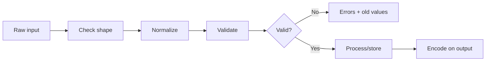
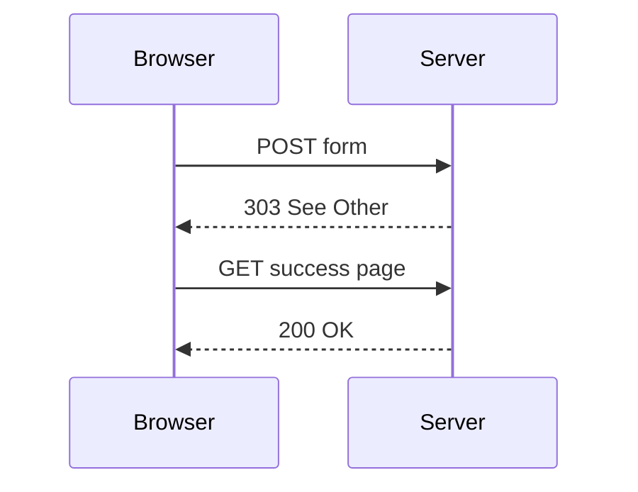
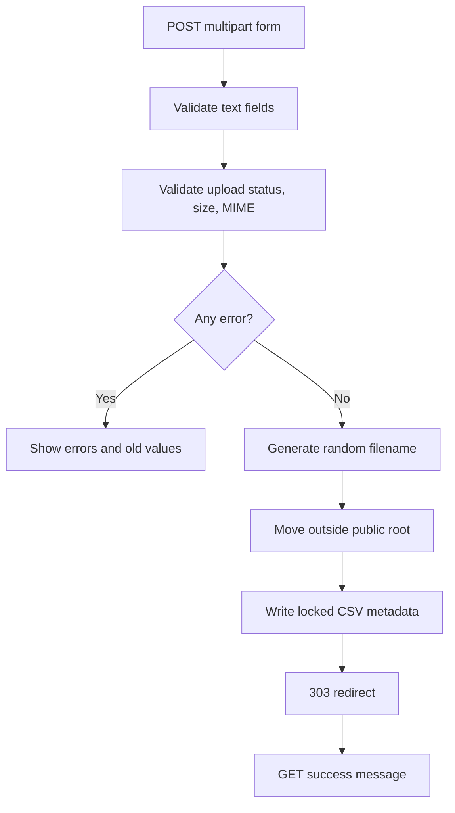

# 📤 Chapter 31: PHP Forms and File Handling


> [!TIP]
> **Chapter Goal:** PHP se GET/POST forms safely process karna, server-side validation aur PRG pattern use karna, files read/write karna aur secure uploads handle karna.

> [!WARNING]
> File upload high-risk feature hai. Filename extension or browser-provided MIME type par trust na karein. Size, upload status and actual content type validate karein; generated filename use karein; stored files ko executable/public location se door rakhein where possible.

---

## 🎯 31.1 Learning Objectives

Is chapter ke baad aap:

- GET and POST forms compare karenge.
- Superglobals se input safely read karenge.
- Input presence, shape, type, range and allowed values validate karenge.
- Error messages aur old values accessible way me display karenge.
- Post/Redirect/Get pattern explain karenge.
- Files read, write, append, lock and delete karenge.
- CSV and JSON data process karenge.
- Upload form configure karenge.
- Upload error, size and MIME type validate karenge.
- Random stored filenames generate karenge.
- Complete student-submission application banayenge.

---

## 🗣️ 31.2 Difficult Words

| Word | Pronunciation | Simple Meaning |
|---|---|---|
| Submission | सबमिशन — *sub-mish-un* | Form ka bheja hua data |
| Multipart | मल्टीपार्ट — *mul-tee-part* | File-supporting body format |
| Validation | वैलिडेशन | Data rules check |
| Sanitization | सैनिटाइजेशन | Data ko safe/consistent process |
| Persistence | परसिस्टेन्स | Data ko request ke baad bhi save rakhna |
| Upload | अपलोड — *up-lohd* | Client se server file bhejna |
| MIME Type | माइम टाइप | File content category |
| Stream | स्ट्रीम — *streem* | Data ka flowing source/destination |
| Handle | हैंडल — *han-dul* | Open file/resource reference |
| Lock | लॉक — *lok* | Concurrent writes control |
| Atomic | एटॉमिक — *uh-tom-ik* | All-at-once operation idea |
| Traversal | ट्रैवर्सल — *truh-vur-sul* | Path se unauthorized location reach |
| Collision | कोलिज़न — *kuh-lizh-un* | Two names/IDs same hona |
| PRG | पी-आर-जी | Post/Redirect/Get pattern |

---

# 🟦 Part A: HTML Forms and HTTP

## 31.3 Form Anatomy

```html
<form action="process.php" method="post">
    <label for="student-name">Student name</label>
    <input
        id="student-name"
        name="studentName"
        required>

    <button type="submit">Submit</button>
</form>
```

Important:

- `action` request destination
- `method` GET or POST
- `name` submitted key
- `value` submitted value
- Disabled controls generally submitted nahi hote
- Unchecked checkbox key usually absent hoti hai
- Button type explicitly set karein

---

## 31.4 GET Method

```html
<form action="search.php" method="get">
    <label for="query">Search</label>
    <input id="query" name="q">
    <button type="submit">Search</button>
</form>
```

Result URL:

```text
search.php?q=php+forms
```

GET suitable for:

- Search
- Filter
- Sort
- Pagination
- Bookmarkable read-only state

Sensitive data GET URL me na bhejein because URL history, logs, analytics, screenshots and referrers me appear ho sakta hai.

---

## 31.5 POST Method

```html
<form action="register.php" method="post">
    ...
</form>
```

POST suitable for:

- Create/update action
- Login submission
- Large structured form
- File upload
- Non-idempotent processing

> [!IMPORTANT]
> POST encryption nahi hai. Data-in-transit protection ke liye HTTPS required hai.

---

## 31.6 GET vs POST

| Feature | GET | POST |
|---|---|---|
| Data location | URL query | Request body |
| Bookmarkable | Yes | Normally no |
| Typical intent | Read/search | Create/change/process |
| Refresh | Repeats GET | May warn/repeat POST |
| Sensitive data | Unsuitable | Still needs HTTPS |
| File upload | No | Yes with multipart |
| PHP source | `$_GET` | `$_POST` |

Correct method security/authorization ka replacement nahi.

---

# 🟩 Part B: Reading Form Data

## 31.7 The `$_GET` Superglobal

URL:

```text
search.php?q=php&page=2
```

PHP:

```php
$query = $_GET["q"] ?? "";
$page = $_GET["page"] ?? "1";
```

External value scalar guaranteed nahi. Malicious request array submit kar sakti hai:

```text
?q[]=php
```

Shape validate karein before casting/string functions.

---

## 31.8 The `$_POST` Superglobal

```php
$name = $_POST["studentName"] ?? null;
```

Safe scalar helper:

```php
function postString(string $key): string
{
    $value = $_POST[$key] ?? "";

    return is_string($value) ? trim($value) : "";
}
```

This unexpected array shape safely rejects.

---

## 31.9 Request Method

```php
if ($_SERVER["REQUEST_METHOD"] === "POST") {
    // Process submission
}
```

Handler only intended methods accept kare.

Conceptual method rejection:

```php
if ($_SERVER["REQUEST_METHOD"] !== "POST") {
    http_response_code(405);
    header("Allow: POST");
    exit("Method not allowed");
}
```

User-facing response and headers application design ke according.

---

## 31.10 Checkboxes

HTML:

```html
<label>
    <input type="checkbox" name="terms" value="yes">
    Accept terms
</label>
```

PHP:

```php
$acceptedTerms =
    isset($_POST["terms"])
    && $_POST["terms"] === "yes";
```

Unchecked checkbox key absent ho sakti hai.

Multiple values:

```html
<label>
    <input type="checkbox" name="skills[]" value="html">
    HTML
</label>
<label>
    <input type="checkbox" name="skills[]" value="css">
    CSS
</label>
```

PHP:

```php
$skills = $_POST["skills"] ?? [];

if (!is_array($skills)) {
    $skills = [];
}
```

Every element validate against allowlist.

---

## 31.11 Radio and Select

```html
<select name="course" required>
    <option value="">Choose</option>
    <option value="bca">BCA</option>
    <option value="mca">MCA</option>
</select>
```

PHP allowlist:

```php
$allowedCourses = ["bca", "mca"];
$course = postString("course");

if (!in_array($course, $allowedCourses, true)) {
    $errors["course"] = "Choose a valid course.";
}
```

Never trust option values just because HTML limited them; requests can be modified.

---

# 🟨 Part C: Validation and Normalization

## 31.12 Validation Pipeline



Validation, storage and output encoding separate responsibilities hain.

---

## 31.13 Required and Length Validation

```php
$name = postString("name");

if ($name === "") {
    $errors["name"] = "Enter your name.";
} elseif (mb_strlen($name, "UTF-8") > 50) {
    $errors["name"] = "Name must be 50 characters or fewer.";
}
```

`mb_strlen()` needs mbstring extension. Environment verify karein.

---

## 31.14 Email Validation

```php
$email = postString("email");

if ($email === "") {
    $errors["email"] = "Enter your email.";
} elseif (
    filter_var($email, FILTER_VALIDATE_EMAIL) === false
) {
    $errors["email"] = "Enter a valid email address.";
}
```

Format validation email ownership prove nahi karti. Ownership ke liye verification email/token required.

---

## 31.15 Integer Validation

Raw input distinguish:

```php
$rawAge = $_POST["age"] ?? null;

if (!is_string($rawAge) || $rawAge === "") {
    $errors["age"] = "Enter your age.";
} else {
    $age = filter_var(
        $rawAge,
        FILTER_VALIDATE_INT,
        [
            "options" => [
                "min_range" => 16,
                "max_range" => 100,
            ],
        ]
    );

    if ($age === false) {
        $errors["age"] =
            "Enter a whole-number age from 16 to 100.";
    }
}
```

Strict `=== false` important because valid integer `0` falsy ho sakta hai in other ranges.

---

## 31.16 Validation vs Sanitization

Validation:

```php
filter_var($email, FILTER_VALIDATE_EMAIL);
```

Normalization:

```php
$email = strtolower(trim($email));
```

HTML output encoding:

```php
htmlspecialchars(
    $email,
    ENT_QUOTES | ENT_SUBSTITUTE,
    "UTF-8"
);
```

One operation doosre ka replacement nahi.

---

## 31.17 Error Collection

```php
$errors = [];

if ($name === "") {
    $errors["name"] = "Enter your name.";
}

if ($email === "") {
    $errors["email"] = "Enter your email.";
}

if ($errors === []) {
    // Safe to continue to business processing
}
```

Field-specific errors user ko exact correction batate hain.

---

## 31.18 Accessible Error Output

```php
<label for="name">Name</label>
<input
    id="name"
    name="name"
    value="<?= escape($name) ?>"
    aria-describedby="name-error"
    <?= isset($errors["name"])
        ? 'aria-invalid="true"'
        : "" ?>>

<p id="name-error" class="error">
    <?= escape($errors["name"] ?? "") ?>
</p>
```

Error summary:

```php
<?php if ($errors !== []): ?>
    <div class="error-summary" role="alert">
        Please correct <?= count($errors) ?> form error(s).
    </div>
<?php endif; ?>
```

---

# 🟪 Part D: Post/Redirect/Get

## 31.19 The Duplicate Submission Problem

Direct POST response ke baad refresh browser form resubmit warning de sakta hai. Duplicate records/actions possible.

PRG:



---

## 31.20 PRG Implementation

After successful processing:

```php
header("Location: /index.php?submitted=1", true, 303);
exit;
```

Display on GET:

```php
$submitted = ($_GET["submitted"] ?? "") === "1";
```

```php
<?php if ($submitted): ?>
    <p class="success" role="status">
        Submission saved successfully.
    </p>
<?php endif; ?>
```

> [!IMPORTANT]
> `header()` se pehle output nahi hona chahiye. Redirect ke baad `exit` karein.

Query flag user fake kar sakta hai; it is only display hint, trusted proof/authorization nahi. Session flash messages next chapter me better pattern provide karenge.

---

# 🟥 Part E: File-System Fundamentals

## 31.21 Paths

Relative:

```php
$file = "data/students.csv";
```

Stable absolute project path:

```php
$file = __DIR__ . "/../storage/students.csv";
```

`__DIR__` current PHP file directory represent karta hai.

---

## 31.22 Check Files and Directories

```php
file_exists($path);
is_file($path);
is_dir($directory);
is_readable($path);
is_writable($directory);
```

Permissions production server/user configuration par depend karti hain. World-writable permissions casually use na karein.

---

## 31.23 Create Directory

```php
$storageDirectory = __DIR__ . "/../storage";

if (
    !is_dir($storageDirectory)
    && !mkdir($storageDirectory, 0750, true)
    && !is_dir($storageDirectory)
) {
    throw new RuntimeException(
        "Could not create storage directory."
    );
}
```

Actual permission affected by server umask/platform. Directory ideally public document root ke outside.

---

## 31.24 Read Entire File

```php
$content = file_get_contents($path);

if ($content === false) {
    throw new RuntimeException("Could not read file.");
}
```

Large files ke liye whole file memory me load karna inefficient ho sakta hai; streams use karein.

---

## 31.25 Write and Append

Replace/create:

```php
$result = file_put_contents(
    $path,
    "First line" . PHP_EOL,
    LOCK_EX
);

if ($result === false) {
    throw new RuntimeException("Could not write file.");
}
```

Append:

```php
file_put_contents(
    $path,
    "Next line" . PHP_EOL,
    FILE_APPEND | LOCK_EX
);
```

`LOCK_EX` cooperative exclusive lock request karta hai. All concurrent code same locking discipline follow kare.

---

## 31.26 Stream Functions

```php
$handle = fopen($path, "ab");

if ($handle === false) {
    throw new RuntimeException("Could not open file.");
}

try {
    if (!flock($handle, LOCK_EX)) {
        throw new RuntimeException("Could not lock file.");
    }

    fwrite($handle, "New line" . PHP_EOL);
    fflush($handle);
    flock($handle, LOCK_UN);
} finally {
    fclose($handle);
}
```

Common modes:

| Mode | Meaning |
|---|---|
| `r` | Read, must exist |
| `r+` | Read/write, must exist |
| `w` | Write, truncate/create |
| `a` | Append/create |
| `x` | Create exclusively, fail if exists |
| `b` | Binary flag, combine e.g. `rb` |

---

## 31.27 Delete and Rename

Delete:

```php
if (is_file($path) && !unlink($path)) {
    throw new RuntimeException("Could not delete file.");
}
```

Rename/move:

```php
if (!rename($oldPath, $newPath)) {
    throw new RuntimeException("Could not rename file.");
}
```

Never build filesystem path directly from untrusted filename/path.

---

## 31.28 Path Traversal Risk

Dangerous:

```php
$path = __DIR__ . "/uploads/" . $_GET["file"];
readfile($path);
```

Attacker may send:

```text
../../config.php
```

Safer design:

- Use database-generated opaque ID
- Map ID to server-controlled stored path
- Fixed base directory
- Generated filenames
- Authorization check
- Canonical path verification where needed
- No direct arbitrary path input

---

# 🟧 Part F: CSV and JSON Files

## 31.29 Writing CSV

```php
$handle = fopen($csvPath, "ab");

if ($handle === false) {
    throw new RuntimeException("Could not open CSV.");
}

try {
    if (!flock($handle, LOCK_EX)) {
        throw new RuntimeException("Could not lock CSV.");
    }

    $written = fputcsv(
        $handle,
        [$name, $email, $course]
    );

    if ($written === false) {
        throw new RuntimeException("Could not write CSV row.");
    }

    fflush($handle);
    flock($handle, LOCK_UN);
} finally {
    fclose($handle);
}
```

`fputcsv()` fields correctly quote/escape karne me help karta hai.

---

## 31.30 Reading CSV

```php
$handle = fopen($csvPath, "rb");

if ($handle === false) {
    throw new RuntimeException("Could not open CSV.");
}

try {
    while (($row = fgetcsv($handle)) !== false) {
        [$name, $email, $course] = array_pad(
            $row,
            3,
            ""
        );

        // Process validated row
    }
} finally {
    fclose($handle);
}
```

Uploaded/untrusted CSV spreadsheet applications me formula injection risk create kar sakta hai. Exported fields beginning with `=`, `+`, `-` or `@` safely handle karna downstream context par depend karta hai.

---

## 31.31 Writing JSON

```php
$data = [
    "name" => "Broun",
    "course" => "BCA",
];

$json = json_encode(
    $data,
    JSON_PRETTY_PRINT
    | JSON_UNESCAPED_UNICODE
    | JSON_THROW_ON_ERROR
);

file_put_contents($jsonPath, $json, LOCK_EX);
```

`JSON_THROW_ON_ERROR` failure exceptions provide karta hai.

---

## 31.32 Reading JSON

```php
$json = file_get_contents($jsonPath);

if ($json === false) {
    throw new RuntimeException("Could not read JSON.");
}

$data = json_decode(
    $json,
    true,
    512,
    JSON_THROW_ON_ERROR
);
```

Decoded structure validate karein; syntactically valid JSON business-valid data guarantee nahi.

---

## 31.33 Flat Files vs Database

| Flat Files | Database |
|---|---|
| Simple learning/small config | Concurrent structured data |
| Easy inspect | Queries/indexes |
| Manual locking | Transactions |
| Limited relationships | Keys/relationships |
| Difficult scaling | Better integrity/scaling |
| Permissions critical | Authentication/authorization still needed |

Student production records ke liye database normally better hai. Flat file practical concept learning ke liye.

---

# 🟫 Part G: File Upload Fundamentals

## 31.34 Upload Form Requirements

```html
<form
    action="upload.php"
    method="post"
    enctype="multipart/form-data">

    <label for="document">Student document</label>
    <input
        id="document"
        name="document"
        type="file"
        accept=".pdf,image/jpeg,image/png">

    <button type="submit">Upload</button>
</form>
```

Required:

- `method="post"`
- `enctype="multipart/form-data"`
- File input `name`

`accept` browser hint hai, security validation nahi.

---

## 31.35 The `$_FILES` Structure

```php
$file = $_FILES["document"] ?? null;
```

Typical keys:

```text
name      Original client filename
full_path Browser-provided relative path in some cases; untrusted
type      Browser-provided MIME type; untrusted
tmp_name  Temporary server path
error     Upload error code
size      Size in bytes
```

---

## 31.36 Upload Error Codes

Important:

| Constant | Meaning |
|---|---|
| `UPLOAD_ERR_OK` | Successful upload |
| `UPLOAD_ERR_INI_SIZE` | Exceeds server config |
| `UPLOAD_ERR_FORM_SIZE` | Exceeds form hint |
| `UPLOAD_ERR_PARTIAL` | Partial upload |
| `UPLOAD_ERR_NO_FILE` | No file |
| `UPLOAD_ERR_NO_TMP_DIR` | Temp directory missing |
| `UPLOAD_ERR_CANT_WRITE` | Disk write failed |
| `UPLOAD_ERR_EXTENSION` | PHP extension stopped upload |

Handle code before `tmp_name` use.

---

## 31.37 Validate Uploaded File Shape

```php
function uploadedFile(string $key): ?array
{
    $file = $_FILES[$key] ?? null;

    if (!is_array($file)) {
        return null;
    }

    $requiredKeys = [
        "name",
        "type",
        "tmp_name",
        "error",
        "size",
    ];

    foreach ($requiredKeys as $requiredKey) {
        if (!array_key_exists($requiredKey, $file)) {
            return null;
        }
    }

    return $file;
}
```

For multiple uploads, structure differs.

---

## 31.38 Validate Upload Status and Size

```php
if ($file["error"] !== UPLOAD_ERR_OK) {
    throw new RuntimeException("Upload failed.");
}

$maximumBytes = 2 * 1024 * 1024;

if (
    !is_int($file["size"])
    || $file["size"] <= 0
    || $file["size"] > $maximumBytes
) {
    throw new RuntimeException(
        "File must be between 1 byte and 2 MB."
    );
}
```

Server's `upload_max_filesize` and `post_max_size` can reject request before application receives normal expected data.

---

## 31.39 Detect Actual MIME Type

Do not trust `$_FILES["type"]`.

```php
$finfo = new finfo(FILEINFO_MIME_TYPE);
$mimeType = $finfo->file($file["tmp_name"]);

if ($mimeType === false) {
    throw new RuntimeException(
        "Could not determine file type."
    );
}

$allowedMimeTypes = [
    "application/pdf" => "pdf",
    "image/jpeg" => "jpg",
    "image/png" => "png",
];

if (!isset($allowedMimeTypes[$mimeType])) {
    throw new RuntimeException(
        "Only PDF, JPEG and PNG files are allowed."
    );
}
```

Finfo useful signal hai, perfect malicious-content scanner nahi. Risky document/media workflows may need deeper parsing, malware scanning, image re-encoding, isolation and download-safe headers.

---

## 31.40 Generate a Safe Filename

Never use original name as stored path.

```php
$extension = $allowedMimeTypes[$mimeType];
$storedName = bin2hex(random_bytes(16)) . "." . $extension;
```

Original name only sanitized/encoded display metadata ke roop me store kar sakte hain if needed.

---

## 31.41 Move the Upload

Storage outside public root:

```php
$uploadDirectory =
    dirname(__DIR__) . "/storage/uploads";

if (
    !is_dir($uploadDirectory)
    && !mkdir($uploadDirectory, 0750, true)
    && !is_dir($uploadDirectory)
) {
    throw new RuntimeException(
        "Could not create upload directory."
    );
}

$destination = $uploadDirectory . "/" . $storedName;

if (!move_uploaded_file($file["tmp_name"], $destination)) {
    throw new RuntimeException(
        "Could not store uploaded file."
    );
}
```

`move_uploaded_file()` verifies source is a PHP HTTP POST upload and moves it. Existing destination can be overwritten, so random filename plus collision handling matters.

---

## 31.42 Secure Download Concept

Do not expose storage directory directly. A download handler should:

1. Authenticate user.
2. Authorize access to record/file.
3. Lookup server-controlled path.
4. Confirm regular file.
5. Send correct safe headers.
6. Stream file.
7. Prevent path injection.
8. Log access appropriately.

Example headers depend on verified type and policy:

```php
header("Content-Type: application/pdf");
header(
    'Content-Disposition: attachment; filename="document.pdf"'
);
header("X-Content-Type-Options: nosniff");
```

Never pass untrusted header filename without correct handling.

---

## 31.43 Upload Security Checklist

- POST multipart form
- Request/upload error check
- Size limits at server and application
- MIME/content validation
- Extension derived from allowlist
- Random generated name
- Store outside web root
- Non-executable permissions
- Authorization
- CSRF protection for authenticated upload
- Rate/quota limit
- Malware scanning where risk requires
- Safe download response
- Cleanup/retention policy
- Logs without sensitive content

---

# 🟦 Part H: Complete Student Submission Practical

## 31.44 Project Structure

```text
student-submission/
├── public/
│   ├── index.php
│   └── styles.css
├── src/
│   └── functions.php
└── storage/
    ├── submissions.csv
    └── uploads/
```

Only `public/` should be document root.

Run:

```bash
php -S localhost:8000 -t public
```

---

## 31.45 `src/functions.php`

```php
<?php
declare(strict_types=1);

function escape(string $value): string
{
    return htmlspecialchars(
        $value,
        ENT_QUOTES | ENT_SUBSTITUTE,
        "UTF-8"
    );
}

function postString(string $key): string
{
    $value = $_POST[$key] ?? "";

    return is_string($value) ? trim($value) : "";
}

function ensureDirectory(string $directory): void
{
    if (is_dir($directory)) {
        return;
    }

    if (
        !mkdir($directory, 0750, true)
        && !is_dir($directory)
    ) {
        throw new RuntimeException(
            "Could not create storage directory."
        );
    }
}

function validateDocumentUpload(
    string $key,
    int $maximumBytes = 2_097_152
): array {
    $file = $_FILES[$key] ?? null;

    if (!is_array($file)) {
        throw new RuntimeException(
            "Select a document to upload."
        );
    }

    foreach (
        ["name", "tmp_name", "error", "size"]
        as $requiredKey
    ) {
        if (!array_key_exists($requiredKey, $file)) {
            throw new RuntimeException(
                "Invalid upload structure."
            );
        }
    }

    if ($file["error"] === UPLOAD_ERR_NO_FILE) {
        throw new RuntimeException(
            "Select a document to upload."
        );
    }

    if ($file["error"] !== UPLOAD_ERR_OK) {
        throw new RuntimeException(
            "The upload did not complete successfully."
        );
    }

    if (
        !is_int($file["size"])
        || $file["size"] <= 0
        || $file["size"] > $maximumBytes
    ) {
        throw new RuntimeException(
            "Document must be 2 MB or smaller."
        );
    }

    if (!is_string($file["tmp_name"])) {
        throw new RuntimeException(
            "Invalid temporary upload path."
        );
    }

    $finfo = new finfo(FILEINFO_MIME_TYPE);
    $mimeType = $finfo->file($file["tmp_name"]);

    $allowed = [
        "application/pdf" => "pdf",
        "image/jpeg" => "jpg",
        "image/png" => "png",
    ];

    if (
        !is_string($mimeType)
        || !isset($allowed[$mimeType])
    ) {
        throw new RuntimeException(
            "Upload a PDF, JPEG or PNG file."
        );
    }

    return [
        "temporaryPath" => $file["tmp_name"],
        "originalName" => is_string($file["name"])
            ? $file["name"]
            : "document",
        "mimeType" => $mimeType,
        "extension" => $allowed[$mimeType],
        "size" => $file["size"],
    ];
}

function appendSubmission(
    string $csvPath,
    array $row
): void {
    $handle = fopen($csvPath, "ab");

    if ($handle === false) {
        throw new RuntimeException(
            "Could not open submission storage."
        );
    }

    try {
        if (!flock($handle, LOCK_EX)) {
            throw new RuntimeException(
                "Could not lock submission storage."
            );
        }

        if (fputcsv($handle, $row) === false) {
            throw new RuntimeException(
                "Could not save submission."
            );
        }

        fflush($handle);
        flock($handle, LOCK_UN);
    } finally {
        fclose($handle);
    }
}
```

---

## 31.46 `public/index.php` Processing

```php
<?php
declare(strict_types=1);

require_once __DIR__ . "/../src/functions.php";

$name = "";
$email = "";
$course = "";
$errors = [];

$success =
    ($_GET["submitted"] ?? null) === "1";

if ($_SERVER["REQUEST_METHOD"] === "POST") {
    $name = postString("name");
    $email = strtolower(postString("email"));
    $course = postString("course");

    if ($name === "") {
        $errors["name"] = "Enter your name.";
    } elseif (mb_strlen($name, "UTF-8") > 50) {
        $errors["name"] =
            "Name must be 50 characters or fewer.";
    }

    if (
        $email === ""
        || filter_var(
            $email,
            FILTER_VALIDATE_EMAIL
        ) === false
    ) {
        $errors["email"] =
            "Enter a valid email address.";
    }

    $allowedCourses = ["bca", "mca", "bsc-cs"];

    if (!in_array($course, $allowedCourses, true)) {
        $errors["course"] =
            "Choose a valid course.";
    }

    $document = null;

    try {
        $document = validateDocumentUpload("document");
    } catch (RuntimeException $error) {
        $errors["document"] = $error->getMessage();
    }

    if ($errors === [] && $document !== null) {
        $storageDirectory =
            __DIR__ . "/../storage";

        $uploadDirectory =
            $storageDirectory . "/uploads";

        try {
            ensureDirectory($uploadDirectory);

            $storedName =
                bin2hex(random_bytes(16))
                . "."
                . $document["extension"];

            $destination =
                $uploadDirectory . "/" . $storedName;

            if (
                !move_uploaded_file(
                    $document["temporaryPath"],
                    $destination
                )
            ) {
                throw new RuntimeException(
                    "Could not store document."
                );
            }

            try {
                appendSubmission(
                    $storageDirectory . "/submissions.csv",
                    [
                        date(DATE_ATOM),
                        $name,
                        $email,
                        $course,
                        $document["originalName"],
                        $storedName,
                        $document["mimeType"],
                        $document["size"],
                    ]
                );
            } catch (Throwable $error) {
                if (is_file($destination)) {
                    unlink($destination);
                }

                throw $error;
            }

            header(
                "Location: /index.php?submitted=1",
                true,
                303
            );
            exit;
        } catch (Throwable $error) {
            error_log(
                "Submission storage error: "
                . $error->getMessage()
            );

            $errors["form"] =
                "Could not save the submission. Please retry.";
        }
    }
}
?>
```

The file is removed if CSV metadata write fails, reducing orphaned-upload inconsistency. Real production persistence should use database transactions/robust storage workflows.

---

## 31.47 `public/index.php` Template

```php
<!DOCTYPE html>
<html lang="en">
<head>
    <meta charset="UTF-8">
    <meta
        name="viewport"
        content="width=device-width, initial-scale=1.0">
    <title>Student Document Submission</title>
    <link rel="stylesheet" href="styles.css">
</head>
<body>
    <main class="card">
        <p class="eyebrow">BCA Portal</p>
        <h1>Student Document Submission</h1>

        <?php if ($success): ?>
            <p class="success" role="status">
                Submission saved successfully.
            </p>
        <?php endif; ?>

        <?php if ($errors !== []): ?>
            <div class="error-summary" role="alert">
                <h2>Please correct the form</h2>
                <p>
                    <?= count($errors) ?> problem(s) found.
                </p>
            </div>
        <?php endif; ?>

        <?php if (isset($errors["form"])): ?>
            <p class="error"><?= escape($errors["form"]) ?></p>
        <?php endif; ?>

        <form
            method="post"
            enctype="multipart/form-data">

            <div class="field">
                <label for="name">Student name</label>
                <input
                    id="name"
                    name="name"
                    value="<?= escape($name) ?>"
                    maxlength="50"
                    aria-describedby="name-error"
                    <?= isset($errors["name"])
                        ? 'aria-invalid="true"'
                        : "" ?>
                    required>
                <p id="name-error" class="error">
                    <?= escape($errors["name"] ?? "") ?>
                </p>
            </div>

            <div class="field">
                <label for="email">Email</label>
                <input
                    id="email"
                    name="email"
                    type="email"
                    value="<?= escape($email) ?>"
                    aria-describedby="email-error"
                    <?= isset($errors["email"])
                        ? 'aria-invalid="true"'
                        : "" ?>
                    required>
                <p id="email-error" class="error">
                    <?= escape($errors["email"] ?? "") ?>
                </p>
            </div>

            <div class="field">
                <label for="course">Course</label>
                <select
                    id="course"
                    name="course"
                    aria-describedby="course-error"
                    <?= isset($errors["course"])
                        ? 'aria-invalid="true"'
                        : "" ?>
                    required>
                    <option value="">Choose course</option>
                    <option value="bca"
                        <?= $course === "bca" ? "selected" : "" ?>>
                        BCA
                    </option>
                    <option value="mca"
                        <?= $course === "mca" ? "selected" : "" ?>>
                        MCA
                    </option>
                    <option value="bsc-cs"
                        <?= $course === "bsc-cs" ? "selected" : "" ?>>
                        BSc Computer Science
                    </option>
                </select>
                <p id="course-error" class="error">
                    <?= escape($errors["course"] ?? "") ?>
                </p>
            </div>

            <div class="field">
                <label for="document">
                    Document (PDF, JPEG or PNG; maximum 2 MB)
                </label>
                <input
                    id="document"
                    name="document"
                    type="file"
                    accept=".pdf,image/jpeg,image/png"
                    aria-describedby="document-error"
                    <?= isset($errors["document"])
                        ? 'aria-invalid="true"'
                        : "" ?>
                    required>
                <p id="document-error" class="error">
                    <?= escape($errors["document"] ?? "") ?>
                </p>
            </div>

            <button type="submit">Submit Document</button>
        </form>
    </main>
</body>
</html>
```

Browsers do not repopulate file inputs after validation failure for security reasons. User must choose file again.

---

## 31.48 `public/styles.css`

```css
* {
    box-sizing: border-box;
}

body {
    min-height: 100vh;
    margin: 0;
    padding: 1rem;
    display: grid;
    place-items: center;
    color: #172033;
    background: linear-gradient(135deg, #dbeafe, #ede9fe);
    font-family: system-ui, sans-serif;
}

.card {
    width: min(100%, 42rem);
    margin-block: 2rem;
    padding: clamp(1.25rem, 5vw, 2.25rem);
    border-radius: 1rem;
    background: white;
    box-shadow: 0 1rem 3rem rgb(15 23 42 / 15%);
}

.eyebrow {
    color: #6d28d9;
    font-weight: 800;
    text-transform: uppercase;
    letter-spacing: 0.08em;
}

.field {
    margin-block: 1rem;
}

label {
    display: block;
    margin-bottom: 0.35rem;
    font-weight: 700;
}

input,
select,
button {
    width: 100%;
    padding: 0.75rem;
    font: inherit;
}

input,
select {
    border: 2px solid #94a3b8;
    border-radius: 0.5rem;
}

input:focus-visible,
select:focus-visible,
button:focus-visible {
    outline: 3px solid #60a5fa;
    outline-offset: 2px;
}

[aria-invalid="true"] {
    border-color: #b91c1c;
}

.error {
    min-height: 1.35rem;
    margin: 0.3rem 0;
    color: #b91c1c;
}

.error-summary {
    padding: 1rem;
    border-left: 0.35rem solid #b91c1c;
    background: #fef2f2;
}

.success {
    padding: 1rem;
    border-left: 0.35rem solid #15803d;
    background: #f0fdf4;
}

button {
    border: 0;
    border-radius: 0.5rem;
    color: white;
    background: #6d28d9;
    font-weight: 800;
    cursor: pointer;
}
```

---

## 31.49 Practical Flow



---

## 31.50 Practical Limitations

This learning project still needs production improvements:

- CSRF protection
- Authentication and authorization
- Rate limits and quotas
- Malware scanning
- Database instead of CSV
- Robust transaction strategy
- Duplicate submission detection
- Secure download controller
- Retention/deletion policy
- Backup/monitoring
- MIME-specific deeper validation
- Privacy notice/consent
- Server configuration limits
- Automated tests

---

# 🟩 Part I: Multiple File Upload Preview

## 31.51 HTML

```html
<input
    type="file"
    name="documents[]"
    multiple>
```

`$_FILES["documents"]` nested arrays organize karega. Normalize each entry before validation.

> [!WARNING]
> Multiple uploads increase total request size, processing time and abuse risk. Per-file and total limits enforce karein.

---

# 🟨 Part J: Raw JSON Request Preview

## 31.52 Reading JSON Body

```php
$rawBody = file_get_contents("php://input");

if ($rawBody === false) {
    throw new RuntimeException("Could not read request body.");
}

$data = json_decode(
    $rawBody,
    true,
    512,
    JSON_THROW_ON_ERROR
);
```

Then validate:

- Content-Type
- Maximum body size
- JSON structure
- Required keys
- Types/ranges
- Authorization

`$_POST` normal JSON body automatically contain nahi karti.

---

## 🚫 31.53 Common Mistakes

1. GET/POST wrong intent ke liye use karna.
2. HTTPS ke bina POST ko secure samajhna.
3. `$_REQUEST` se source ambiguity create karna.
4. Input always string assume karna.
5. Checkbox absent state ignore karna.
6. Client validation par trust.
7. Validation and sanitization confuse karna.
8. Raw form data output.
9. Success POST response directly show karke duplicate resubmit.
10. Relative file paths unpredictable use karna.
11. Concurrent writes without locking.
12. User path directly filesystem path me join karna.
13. Upload form me multipart encoding omit karna.
14. Original filename and `$_FILES["type"]` trust karna.
15. Extension-only validation.
16. Uploads executable public folder me store karna.
17. Upload errors/config limits ignore karna.
18. Database-suitable data indefinitely CSV me store karna.
19. Upload file saved but metadata failure cleanup ignore karna.
20. File retention/privacy plan omit karna.

---

## 📌 31.54 Best Practices

- Intended request method enforce karein.
- Input shape first validate.
- Normalize carefully.
- Strict allowlists and comparisons.
- Accessible field errors and old values.
- Success par PRG.
- `__DIR__` absolute paths.
- File writes lock and failure-check.
- CSV with `fputcsv()`/`fgetcsv()`.
- JSON exceptions enable.
- Upload error, size and actual MIME validate.
- Random filename and safe extension.
- Upload outside web root.
- Authenticate/authorize downloads.
- CSRF and rate limits add.
- Detailed errors logs me; safe message users ko.
- Production structured data ke liye database.

---

## 📝 31.55 Chapter Summary

PHP forms GET query data and POST request-body data process kar sakti hain. GET read/search state ke liye, POST server state-changing submissions and uploads ke liye common hai. Every input ka presence, shape, type, range and allowed value server par validate hona chahiye. Output context-aware encode hota hai. Post/Redirect/Get duplicate refresh submission reduce karta hai. PHP file APIs content read/write, stream, lock, rename and delete karte hain. CSV and JSON small structured persistence/import ke liye useful hain, but concurrency/relationships ke liye database better hai. Upload security requires multipart POST, error/size/content validation, allowlisted MIME mapping, random filenames, non-public storage and authorized download.

---

## 🎲 31.56 MCQs

1. Search form method?  
   A. DELETE · **B. GET** · C. PATCH · D. FILE

2. File upload encoding?  
   A. text/plain · **B. multipart/form-data** · C. application/json only · D. none

3. POST fields PHP me?  
   A. `$_GET` · **B. `$_POST`** · C. `$_SERVER` · D. `$_ENV`

4. Success redirect status commonly?  
   A. 404 · **B. 303** · C. 500 · D. 101

5. CSV row writer?  
   A. `implode()` only · **B. `fputcsv()`** · C. `json_encode()` · D. `readfile()`

6. Uploaded actual type signal?  
   A. Original extension only · **B. Fileinfo MIME detection** · C. Browser type only · D. Filename length

7. Safe stored name?  
   A. Raw original · **B. Random generated name** · C. User path · D. Email address

8. Uploaded file mover?  
   A. `rename()` only · **B. `move_uploaded_file()`** · C. `copy_url()` · D. `fwrite_name()`

---

## ✍️ 31.57 Fill in the Blanks

1. GET form values PHP me __________.
2. Uploaded files PHP me __________.
3. Successful POST ke baad pattern __________.
4. Exclusive file-lock flag __________.
5. Random secure bytes function __________.

<details>
<summary><strong>✅ Answers</strong></summary>

1. `$_GET`  
2. `$_FILES`  
3. Post/Redirect/Get (PRG)  
4. `LOCK_EX`  
5. `random_bytes()`

</details>

---

## ✅ 31.58 True or False

1. POST automatically encrypted hota hai — **False**
2. Client form options server par trusted hain — **False**
3. Unchecked checkbox absent ho sakta hai — **True**
4. PRG duplicate refresh submission reduce karta hai — **True**
5. `file_put_contents()` failure return check karna chahiye — **True**
6. Original upload filename safe storage path hai — **False**
7. `accept` security validation hai — **False**
8. Uploads outside public root safer ho sakte hain — **True**

---

## ❓ 31.59 Exam Questions

### Short Answer

1. GET and POST compare karein.
2. Form controls me `name` ka role?
3. Input shape validation kya hai?
4. Validation and output encoding compare karein.
5. PRG pattern explain karein.
6. File locking kyun needed hai?
7. CSV and JSON handling functions list karein.
8. Upload form requirements kya hain?
9. `$_FILES` keys explain karein.
10. File upload MIME validation kyun needed hai?

### Long Answer

1. Explain PHP form processing lifecycle.
2. Describe server validation with accessible errors.
3. Explain Post/Redirect/Get with diagram.
4. Discuss PHP file-system operations.
5. Explain CSV and JSON file handling.
6. Describe secure file upload step-by-step.
7. Discuss upload threats and controls.
8. Build and explain Student Submission practical.

---

## 🧪 31.60 Practical Exercises

1. GET search/filter form.
2. POST registration form.
3. Checkbox array allowlist validation.
4. Integer/email validation.
5. Accessible error messages and old values.
6. PRG success flow.
7. Text file write/read/append.
8. Locked visitor log.
9. CSV student writer/reader.
10. JSON settings storage.
11. Single PDF/image upload validator.
12. Invalid extension/content mismatch test.
13. Random filename storage.
14. Secure-download design pseudocode.
15. Complete Student Submission project.
16. Replace CSV persistence with database plan.

---

## 🎤 31.61 Viva Questions

1. Form `action` kya karta hai?
2. GET data kaha hota hai?
3. POST secure kab hota hai?
4. `$_POST` kya hai?
5. Checkbox unchecked ho to kya hota hai?
6. Allowlist kya hai?
7. PRG kya hai?
8. `header()` ke baad `exit` kyun?
9. `__DIR__` kyun use karte hain?
10. File lock kya hai?
11. `fputcsv()` ka benefit?
12. Upload enctype kya hai?
13. `$_FILES["type"]` trusted kyun nahi?
14. Random filename kyun?
15. Upload outside web root kyun?

---

## 🏁 31.62 One-Minute Revision

| Question | Quick Answer |
|---|---|
| Search/read form? | GET |
| Change/upload form? | POST |
| Query values? | `$_GET` |
| Body fields? | `$_POST` |
| Uploads? | `$_FILES` |
| Avoid duplicate POST? | PRG |
| Read whole file? | `file_get_contents()` |
| Write whole file? | `file_put_contents()` |
| CSV write? | `fputcsv()` |
| JSON encode? | `json_encode()` |
| Upload encoding? | `multipart/form-data` |
| Real MIME check? | `finfo` |
| Secure random name? | `random_bytes()` |
| Move upload? | `move_uploaded_file()` |
| Safer storage? | Outside public root |

---

## 📚 31.63 Official References

1. [PHP Manual — Dealing with Forms](https://www.php.net/manual/en/tutorial.forms.php)
2. [PHP Manual — Handling File Uploads](https://www.php.net/manual/en/features.file-upload.php)
3. [PHP Manual — POST Method Uploads](https://www.php.net/manual/en/features.file-upload.post-method.php)
4. [PHP Manual — `$_FILES`](https://www.php.net/manual/en/reserved.variables.files.php)
5. [PHP Manual — `move_uploaded_file()`](https://www.php.net/manual/en/function.move-uploaded-file.php)
6. [PHP Manual — Filesystem](https://www.php.net/manual/en/book.filesystem.php)
7. [OWASP — File Upload Cheat Sheet](https://cheatsheetseries.owasp.org/cheatsheets/File_Upload_Cheat_Sheet.html)

---

[⬅️ Previous Chapter](30-php-fundamentals.md) · [📚 Table of Contents](../SUMMARY.md) · **Next: Cookies, Sessions and Authentication ➡️**
