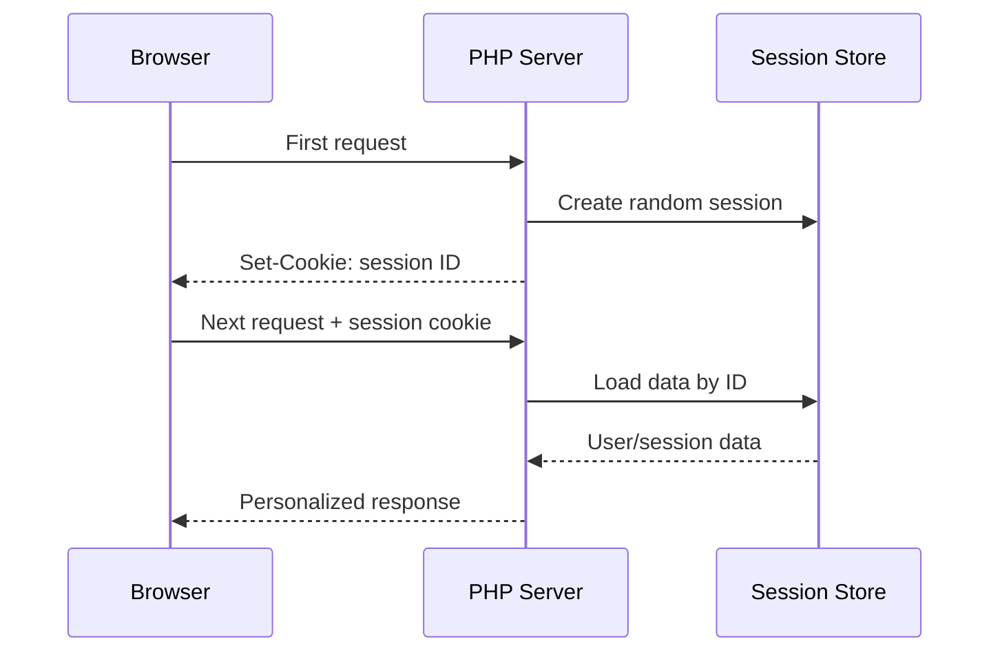
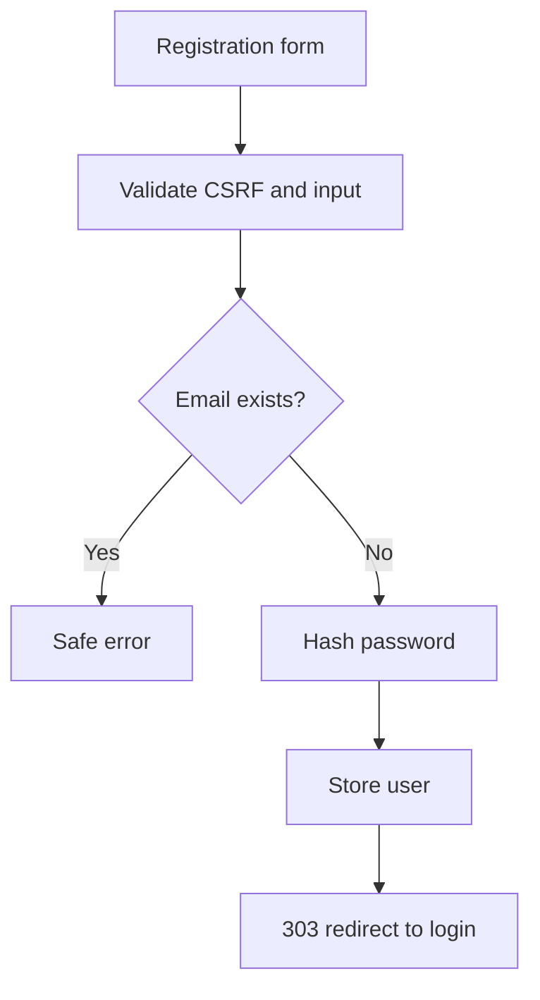
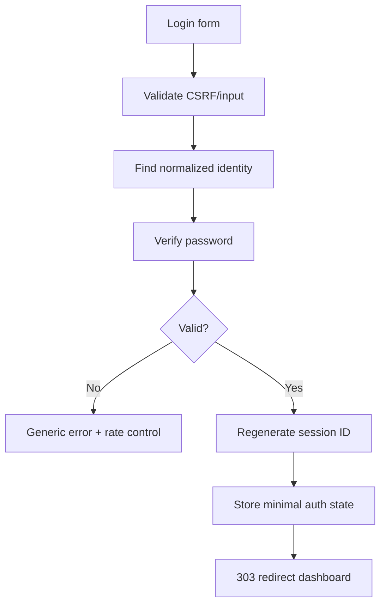

# 🔐 Chapter 32: Cookies, Sessions and Authentication


> [!TIP]
> **Chapter Goal:** Secure cookies aur PHP sessions samajhna, password hashing ke saath registration/login/logout banana, CSRF attacks prevent karna aur every protected action par authorization apply karna.

> [!WARNING]
> Authentication security-sensitive feature hai. Production applications me maintained framework/library, HTTPS, database, rate limiting, email verification, password reset, monitoring and expert security review use karein. Is chapter ka project learning foundation hai—not production-ready identity system.

---

## 🎯 32.1 Learning Objectives

Is chapter ke baad aap:

- HTTP statelessness aur state-management need explain karenge.
- Cookies create, read, update and delete karenge.
- Cookie security attributes use karenge.
- PHP session safely configure aur start karenge.
- Session fixation/hijacking risks samjhenge.
- Passwords hash and verify karenge.
- Registration, login, protected page and logout implement karenge.
- Authentication and authorization differentiate karenge.
- CSRF token create and validate karenge.
- Idle/absolute session timeout ka concept apply karenge.
- Secure authentication practical build karenge.

---

## 🗣️ 32.2 Difficult Words

| Word | Pronunciation | Simple Meaning |
|---|---|---|
| Cookie | कुकी — *koo-kee* | Browser me stored small value |
| Session | सेशन — *sesh-un* | Requests ke beech server-managed state |
| Stateless | स्टेटलेस — *stayt-les* | Previous request automatically remember na karna |
| Credential | क्रेडेन्शल | Identity proof, e.g. password |
| Authentication | ऑथेन्टिकेशन | User identity verify karna |
| Authorization | ऑथराइजेशन | Permission decide karna |
| Hashing | हैशिंग — *hash-ing* | One-way password transformation |
| Fixation | फिक्सेशन — *fik-say-shun* | Known session ID force karna |
| Hijacking | हाईजैकिंग — *hai-jak-ing* | Session chura kar impersonate karna |
| Impersonate | इम्पर्सोनेट | Kisi aur user jaisa act karna |
| Entropy | एन्ट्रॉपी — *en-truh-pee* | Random unpredictability |
| CSRF | सी-एस-आर-एफ | User se unwanted authenticated action karwana |
| Expiration | एक्सपायरेशन | Validity end time |
| Revoke | रिवोक — *ri-vohk* | Access/token cancel karna |
| Throttling | थ्रॉटलिंग | Repeated attempts slow/limit karna |

---

# 🟦 Part A: State on the Web

## 32.3 HTTP Is Stateless

Each HTTP request independent hoti hai. By default server automatically nahi jaanta:

- Ye same browser/user hai
- User logged in hai
- Shopping cart me kya hai
- Preferred language/theme kya hai
- Previous form message kya tha

State add karne ke common mechanisms:

- Cookies
- Server-side sessions
- URL/query values
- Hidden form fields
- Tokens
- Database records
- Browser storage

Security-relevant state client se blindly trust nahi hoti.

---

## 32.4 Cookie and Session Relationship

Typical session:



Browser generally session ID cookie rakhta hai; actual session data server-side store hota hai.

---

# 🟩 Part B: Cookies

## 32.5 What Is a Cookie?

Cookie browser ke cookie store me small name/value data hai. Matching later HTTP requests me browser server ko cookie send kar sakta hai.

Uses:

- Session identifier
- Language/theme preference
- Consent state
- Short-lived workflow state

Avoid storing:

- Password
- Private key
- Raw sensitive personal data
- Trusted role/price/permission
- Unprotected long-lived authentication secret

User cookie inspect, delete and sometimes modify kar sakta hai.

---

## 32.6 Setting a Cookie in PHP

`setcookie()` headers send karta hai, so output se pehle call karein.

```php
setcookie(
    "theme",
    "dark",
    [
        "expires" => time() + 60 * 60 * 24 * 30,
        "path" => "/",
        "secure" => true,
        "httponly" => true,
        "samesite" => "Lax",
    ]
);
```

Current request me `$_COOKIE["theme"]` immediately update nahi hota; cookie next request me normally available hoti hai.

---

## 32.7 Reading a Cookie

```php
$theme = $_COOKIE["theme"] ?? "light";

if (!in_array($theme, ["light", "dark"], true)) {
    $theme = "light";
}
```

Cookie value allowlist validate karein.

Output:

```php
<html data-theme="<?= escape($theme) ?>">
```

---

## 32.8 Deleting a Cookie

Same relevant name/path/domain attributes ke saath past expiration set:

```php
setcookie(
    "theme",
    "",
    [
        "expires" => time() - 3600,
        "path" => "/",
        "secure" => true,
        "httponly" => true,
        "samesite" => "Lax",
    ]
);
```

Browser may remove matching cookie. Path/domain mismatch common deletion problem hai.

---

## 32.9 Cookie Attributes

| Attribute | Purpose |
|---|---|
| `Expires` / `Max-Age` | Lifetime |
| `Path` | URL-path scope |
| `Domain` | Domain scope |
| `Secure` | HTTPS requests only |
| `HttpOnly` | JavaScript access prevent |
| `SameSite` | Cross-site sending restrictions |

### Secure

Session/auth cookie production me HTTPS and `Secure` use kare.

### HttpOnly

XSS ke through `document.cookie` access reduce karta hai, but XSS attacker victim browser se actions still perform kar sakta hai. XSS prevention still essential.

### SameSite

- `Strict`: most restrictive cross-site sending
- `Lax`: many common session cases ka practical default
- `None`: cross-site contexts; requires `Secure` in modern browsers

Exact browser behavior/current standards verify karein.

---

## 32.10 Session Cookies vs Persistent Cookies

- No expiry: usually browser-session cookie
- Explicit future expiry: persistent cookie

“Remember me” authentication ordinary long session cookie nahi hona chahiye. Secure design uses revocable, random, hashed selector/token records, rotation, expiry and theft detection considerations.

---

## 32.11 Cookie Limits and Privacy

Cookies every matching request me add network bytes kar sakti hain. Browser limits apply.

Before analytics/advertising cookies:

- Legal/consent requirements understand
- Data minimization
- Clear privacy information
- Retention controls
- Third-party behavior
- User withdrawal choice

---

# 🟨 Part C: PHP Sessions

## 32.12 Starting a Session

```php
<?php
declare(strict_types=1);

session_start();
```

Then:

```php
$_SESSION["student_name"] = "Broun";

echo $_SESSION["student_name"] ?? "Guest";
```

`session_start()` cookie headers/output se pehle call karein.

---

## 32.13 Secure Session Configuration

Configure before `session_start()`:

```php
$isHttps =
    isset($_SERVER["HTTPS"])
    && $_SERVER["HTTPS"] !== "off";

session_name("app_session");

session_set_cookie_params([
    "lifetime" => 0,
    "path" => "/",
    "domain" => "",
    "secure" => $isHttps,
    "httponly" => true,
    "samesite" => "Lax",
]);

ini_set("session.use_only_cookies", "1");
ini_set("session.use_strict_mode", "1");

session_start();
```

Production must use HTTPS, so `secure` should be true there. Local plain-HTTP development conditional is only local convenience.

Configuration is preferably centralized and server-level where appropriate.

---

## 32.14 Session Data

```php
$_SESSION["auth_user_id"] = 42;
$_SESSION["auth_role"] = "student";
$_SESSION["created_at"] = time();
$_SESSION["last_activity"] = time();
```

Store minimal server-side identifiers/state. Current role/permissions may need database re-check so changed permissions take effect.

---

## 32.15 Session ID Regeneration

After successful login or privilege change:

```php
session_regenerate_id(true);
```

Then authenticated state set:

```php
$_SESSION["auth_user_id"] = $user["id"];
$_SESSION["authenticated_at"] = time();
```

This helps prevent session fixation. Complex high-concurrency systems need careful regeneration strategy to avoid lost/racing sessions; maintained frameworks help.

---

## 32.16 Session Fixation

Attack idea:

1. Attacker obtains/sets known session ID.
2. Victim logs in using same ID.
3. Server attaches authentication to known ID.
4. Attacker reuses ID.

Defense:

- Strict mode
- Cookies-only session IDs
- Regenerate ID at login/privilege change
- HTTPS + Secure cookie
- Do not accept IDs in URLs
- Expiration and anomaly monitoring

---

## 32.17 Session Hijacking

Attacker steals valid authenticated session ID through:

- XSS
- Unencrypted connection
- Logs/screenshots
- Malware
- Weak/predictable identifiers
- Misconfigured cookie scope
- Session leakage

Defenses:

- HTTPS everywhere
- Secure/HttpOnly/SameSite
- XSS prevention
- Regeneration
- Short idle/absolute lifetime
- Logout invalidation
- Reauthentication for sensitive actions
- Monitoring
- Never log session IDs

Session ID temporarily user credentials jitna powerful ho sakta hai.

---

## 32.18 Idle and Absolute Timeout

Idle timeout:

```php
const IDLE_TIMEOUT = 30 * 60;

$lastActivity = $_SESSION["last_activity"] ?? time();

if (time() - $lastActivity > IDLE_TIMEOUT) {
    logoutCurrentSession();
    redirectToLogin("expired");
}

$_SESSION["last_activity"] = time();
```

Absolute timeout:

```php
const ABSOLUTE_TIMEOUT = 8 * 60 * 60;

$createdAt = $_SESSION["created_at"] ?? time();

if (time() - $createdAt > ABSOLUTE_TIMEOUT) {
    logoutCurrentSession();
    redirectToLogin("expired");
}
```

Exact durations application risk/usability needs par based hone chahiye.

---

## 32.19 Flash Messages

Set:

```php
$_SESSION["flash"] = [
    "type" => "success",
    "message" => "Profile updated.",
];

header("Location: /dashboard.php", true, 303);
exit;
```

Read and remove:

```php
$flash = $_SESSION["flash"] ?? null;
unset($_SESSION["flash"]);
```

Flash message one next request ke liye.

---

## 32.20 Logout Correctly

```php
function logoutCurrentSession(): void
{
    $_SESSION = [];

    if (ini_get("session.use_cookies")) {
        $parameters = session_get_cookie_params();

        setcookie(
            session_name(),
            "",
            [
                "expires" => time() - 42000,
                "path" => $parameters["path"],
                "domain" => $parameters["domain"],
                "secure" => $parameters["secure"],
                "httponly" => $parameters["httponly"],
                "samesite" => $parameters["samesite"] ?? "Lax",
            ]
        );
    }

    session_destroy();
}
```

Logout should state-changing POST action + CSRF token use kare, not simple GET link.

---

## 32.21 Session Locking

Default file-based PHP sessions may lock session for request duration, so same user ke parallel requests wait kar sakte hain.

When session data no longer needs changes:

```php
session_write_close();
```

Long API/file operations se pehle lock release performance improve kar sakta hai. Close ke baad `$_SESSION` writes persist nahi hongi in normal way.

---

# 🟪 Part D: Authentication and Authorization

## 32.22 Authentication

Authentication answers:

```text
Who is the user?
```

Factors:

- Something you know: password/PIN
- Something you have: security key/phone
- Something you are: biometric

Multi-factor authentication independent factors combine karti hai.

---

## 32.23 Authorization

Authorization answers:

```text
What may this user do?
```

Example:

```php
if ($currentUser["role"] !== "admin") {
    http_response_code(403);
    exit("Forbidden");
}
```

But role-only checks often insufficient. Ownership:

```php
if (
    $record["owner_id"] !== $currentUser["id"]
    && $currentUser["role"] !== "admin"
) {
    http_response_code(403);
    exit("Forbidden");
}
```

Every protected request/action server par authorize karein. Hidden button/UI is not authorization.

---

## 32.24 401 vs 403

- `401 Unauthorized`: Authentication missing/invalid (despite name)
- `403 Forbidden`: Request understood but permission denied

Browser app may redirect unauthenticated web user to login, while API returns structured 401.

---

# 🟥 Part E: Password Security

## 32.25 Never Store Plain Passwords

Never:

```php
$user["password"] = $_POST["password"];
```

Also avoid fast/general hashes:

```php
md5($password);
sha1($password);
hash("sha256", $password);
```

Password hashing requires intentionally slow, salted password algorithm.

---

## 32.26 Hash Passwords

```php
$passwordHash = password_hash(
    $password,
    PASSWORD_DEFAULT
);

if ($passwordHash === false) {
    throw new RuntimeException(
        "Could not hash password."
    );
}
```

Store complete returned hash string. Column/storage should support future longer hashes; commonly `VARCHAR(255)` is chosen in databases.

`PASSWORD_DEFAULT` algorithm may change over time.

---

## 32.27 Verify Password

```php
if (password_verify($password, $user["password_hash"])) {
    // Correct password
}
```

Do not compare hashes manually because secure password hashes include salt/parameters.

---

## 32.28 Rehash When Needed

```php
if (
    password_needs_rehash(
        $user["password_hash"],
        PASSWORD_DEFAULT
    )
) {
    $newHash = password_hash(
        $password,
        PASSWORD_DEFAULT
    );

    // Update stored hash safely
}
```

Successful login convenient rehash point hai.

---

## 32.29 Password Rules

Good principles:

- Sufficient length
- Long passphrases allow
- Password manager/paste allow
- Maximum length define to control resource use without overly low limit
- Breached/common password screening where available
- No silent trimming/transformation
- No arbitrary frequent rotation without reason
- Secure reset flow
- MFA for higher risk
- Generic login errors

Example basic learning limits:

```php
$passwordLength = strlen($password);

if ($passwordLength < 12 || $passwordLength > 128) {
    $errors["password"] =
        "Use a password from 12 to 128 characters.";
}
```

Password is bytes to hash; do not modify it unexpectedly.

---

## 32.30 Generic Login Error

Avoid revealing whether email exists:

```text
Invalid email or password.
```

Same general message and comparable processing timing reduce account enumeration signals, though full mitigation also needs rate limiting and consistent behavior.

---

## 32.31 Brute-Force Protection

Production needs:

- Per-account and per-IP/device-informed rate limits
- Progressive delays
- Monitoring/alerts
- Safe lockout design
- CAPTCHA only as supplementary where justified
- MFA
- Breached-password defenses
- Password reset protection

Do not permanently lock victim account solely based on attacker-controlled failures without recovery strategy.

---

# 🟧 Part F: CSRF Protection

## 32.32 What Is CSRF?

Cross-Site Request Forgery tricks logged-in user's browser into sending unwanted authenticated request. Browser automatically session cookie attach kar sakta hai.

Example dangerous logout/delete link:

```html

```

State-changing action GET par nahi honi chahiye.

---

## 32.33 Synchronizer Token Pattern

Generate once per session:

```php
function csrfToken(): string
{
    if (
        !isset($_SESSION["csrf_token"])
        || !is_string($_SESSION["csrf_token"])
    ) {
        $_SESSION["csrf_token"] =
            bin2hex(random_bytes(32));
    }

    return $_SESSION["csrf_token"];
}
```

Form:

```php
<input
    type="hidden"
    name="csrf_token"
    value="<?= escape(csrfToken()) ?>">
```

Validate:

```php
function validateCsrfToken(): bool
{
    $submitted = $_POST["csrf_token"] ?? "";
    $stored = $_SESSION["csrf_token"] ?? "";

    return
        is_string($submitted)
        && is_string($stored)
        && $stored !== ""
        && hash_equals($stored, $submitted);
}
```

Failure:

```php
if (!validateCsrfToken()) {
    http_response_code(403);
    exit("Invalid request token.");
}
```

---

## 32.34 CSRF Defense Layers

- CSRF token
- SameSite cookie
- POST/PUT/PATCH/DELETE for changes
- Origin/Referer checks where suitable
- Reauthentication for high-risk actions
- Custom headers for same-origin JS APIs
- Framework built-in protection

SameSite alone universal CSRF defense nahi.

XSS can often defeat CSRF defenses by running same-origin code, so XSS prevention critical.

---

# 🟫 Part G: Secure Login Flow

## 32.35 Registration Flow



Also consider:

- Email verification
- Terms/privacy
- Rate limit
- Audit event
- Duplicate/race-safe database constraint

---

## 32.36 Login Flow



---

## 32.37 Logout Flow

1. POST logout form
2. CSRF token validate
3. Server-side session clear
4. Session cookie expire
5. Session destroy/revoke
6. Redirect to login/home
7. For multi-device logout, revoke relevant server sessions/tokens

---

## 32.38 Protected Page Guard

```php
function requireAuthentication(): int
{
    $userId = $_SESSION["auth_user_id"] ?? null;

    if (!is_int($userId)) {
        $_SESSION["flash"] = [
            "type" => "error",
            "message" => "Please log in.",
        ];

        header("Location: /login.php", true, 303);
        exit;
    }

    return $userId;
}
```

Database may return string ID; session store policy consistent rakhein.

Protected page:

```php
$userId = requireAuthentication();
$user = findUserById($userId);

if ($user === null || !$user["active"]) {
    logoutCurrentSession();
    header("Location: /login.php", true, 303);
    exit;
}
```

Session value alone stale/deleted/disabled user guarantee nahi karta.

---

# 🟦 Part H: Complete Authentication Practical

## 32.39 Project Structure

```text
auth-demo/
├── public/
│   ├── index.php
│   ├── register.php
│   ├── login.php
│   ├── dashboard.php
│   ├── logout.php
│   └── styles.css
├── src/
│   ├── bootstrap.php
│   ├── functions.php
│   └── users.php
└── storage/
    └── users.json
```

Run:

```bash
php -S localhost:8000 -t public
```

Only `public/` web root.

---

## 32.40 `src/bootstrap.php`

```php
<?php
declare(strict_types=1);

$isHttps =
    isset($_SERVER["HTTPS"])
    && $_SERVER["HTTPS"] !== "off";

session_name("bca_auth");

session_set_cookie_params([
    "lifetime" => 0,
    "path" => "/",
    "domain" => "",
    "secure" => $isHttps,
    "httponly" => true,
    "samesite" => "Lax",
]);

ini_set("session.use_only_cookies", "1");
ini_set("session.use_strict_mode", "1");

session_start();

require_once __DIR__ . "/functions.php";
require_once __DIR__ . "/users.php";

const IDLE_TIMEOUT = 30 * 60;
const ABSOLUTE_TIMEOUT = 8 * 60 * 60;

if (isset($_SESSION["auth_user_id"])) {
    $now = time();
    $lastActivity =
        $_SESSION["last_activity"] ?? $now;
    $createdAt =
        $_SESSION["created_at"] ?? $now;

    if (
        !is_int($lastActivity)
        || !is_int($createdAt)
        || $now - $lastActivity > IDLE_TIMEOUT
        || $now - $createdAt > ABSOLUTE_TIMEOUT
    ) {
        logoutCurrentSession();

        session_start();
        $_SESSION["flash"] = [
            "type" => "error",
            "message" => "Your session expired. Please log in.",
        ];

        header("Location: /login.php", true, 303);
        exit;
    }

    $_SESSION["last_activity"] = $now;
}
```

This teaching example restarts a new anonymous session after destroying expired one so flash can be stored. Production framework/session architecture can handle this more robustly.

---

## 32.41 `src/functions.php`

```php
<?php
declare(strict_types=1);

function escape(string $value): string
{
    return htmlspecialchars(
        $value,
        ENT_QUOTES | ENT_SUBSTITUTE,
        "UTF-8"
    );
}

function postString(string $key): string
{
    $value = $_POST[$key] ?? "";

    return is_string($value) ? trim($value) : "";
}

function csrfToken(): string
{
    if (
        !isset($_SESSION["csrf_token"])
        || !is_string($_SESSION["csrf_token"])
    ) {
        $_SESSION["csrf_token"] =
            bin2hex(random_bytes(32));
    }

    return $_SESSION["csrf_token"];
}

function requireValidCsrf(): void
{
    $submitted = $_POST["csrf_token"] ?? "";
    $stored = $_SESSION["csrf_token"] ?? "";

    if (
        !is_string($submitted)
        || !is_string($stored)
        || $stored === ""
        || !hash_equals($stored, $submitted)
    ) {
        http_response_code(403);
        exit("Invalid request token.");
    }
}

function flash(string $type, string $message): void
{
    $_SESSION["flash"] = [
        "type" => $type,
        "message" => $message,
    ];
}

function consumeFlash(): ?array
{
    $message = $_SESSION["flash"] ?? null;
    unset($_SESSION["flash"]);

    return is_array($message) ? $message : null;
}

function redirect(string $path): never
{
    header("Location: {$path}", true, 303);
    exit;
}

function logoutCurrentSession(): void
{
    $_SESSION = [];

    if (ini_get("session.use_cookies")) {
        $parameters = session_get_cookie_params();

        setcookie(
            session_name(),
            "",
            [
                "expires" => time() - 42000,
                "path" => $parameters["path"],
                "domain" => $parameters["domain"],
                "secure" => $parameters["secure"],
                "httponly" => $parameters["httponly"],
                "samesite" =>
                    $parameters["samesite"] ?? "Lax",
            ]
        );
    }

    session_destroy();
}

function requireAuthentication(): int
{
    $userId = $_SESSION["auth_user_id"] ?? null;

    if (!is_int($userId)) {
        flash("error", "Please log in.");
        redirect("/login.php");
    }

    return $userId;
}
```

---

## 32.42 `src/users.php`

This locked JSON store learning-only hai. Production database with unique constraint and transactions use karein.

```php
<?php
declare(strict_types=1);

function usersPath(): string
{
    return __DIR__ . "/../storage/users.json";
}

function ensureUsersFile(): void
{
    $directory = dirname(usersPath());

    if (
        !is_dir($directory)
        && !mkdir($directory, 0750, true)
        && !is_dir($directory)
    ) {
        throw new RuntimeException(
            "Could not create storage."
        );
    }

    if (!is_file(usersPath())) {
        $written = file_put_contents(
            usersPath(),
            "[]",
            LOCK_EX
        );

        if ($written === false) {
            throw new RuntimeException(
                "Could not create user store."
            );
        }
    }
}

function readUsers(): array
{
    ensureUsersFile();

    $json = file_get_contents(usersPath());

    if ($json === false) {
        throw new RuntimeException(
            "Could not read user store."
        );
    }

    $users = json_decode(
        $json,
        true,
        512,
        JSON_THROW_ON_ERROR
    );

    return is_array($users) ? $users : [];
}

function findUserByEmail(string $email): ?array
{
    $normalized = strtolower($email);

    foreach (readUsers() as $user) {
        if (
            isset($user["email"])
            && is_string($user["email"])
            && hash_equals($user["email"], $normalized)
        ) {
            return $user;
        }
    }

    return null;
}

function findUserById(int $id): ?array
{
    foreach (readUsers() as $user) {
        if (($user["id"] ?? null) === $id) {
            return $user;
        }
    }

    return null;
}

function createUser(
    string $name,
    string $email,
    string $passwordHash
): array {
    ensureUsersFile();

    $handle = fopen(usersPath(), "c+b");

    if ($handle === false) {
        throw new RuntimeException(
            "Could not open user store."
        );
    }

    try {
        if (!flock($handle, LOCK_EX)) {
            throw new RuntimeException(
                "Could not lock user store."
            );
        }

        rewind($handle);
        $json = stream_get_contents($handle);

        $users = $json === ""
            ? []
            : json_decode(
                $json,
                true,
                512,
                JSON_THROW_ON_ERROR
            );

        if (!is_array($users)) {
            throw new RuntimeException(
                "Invalid user store."
            );
        }

        foreach ($users as $user) {
            if (($user["email"] ?? null) === $email) {
                throw new DomainException(
                    "Email already registered."
                );
            }
        }

        $ids = array_column($users, "id");
        $nextId = $ids === []
            ? 1
            : max($ids) + 1;

        $user = [
            "id" => $nextId,
            "name" => $name,
            "email" => $email,
            "password_hash" => $passwordHash,
            "role" => "student",
            "active" => true,
            "created_at" => date(DATE_ATOM),
        ];

        $users[] = $user;

        $output = json_encode(
            $users,
            JSON_PRETTY_PRINT
            | JSON_UNESCAPED_UNICODE
            | JSON_THROW_ON_ERROR
        );

        rewind($handle);

        if (!ftruncate($handle, 0)) {
            throw new RuntimeException(
                "Could not clear user store."
            );
        }

        if (fwrite($handle, $output) === false) {
            throw new RuntimeException(
                "Could not write user store."
            );
        }

        fflush($handle);
        flock($handle, LOCK_UN);

        return $user;
    } finally {
        fclose($handle);
    }
}
```

Potential failure between truncate/write shows why flat files are not robust database replacement. Atomic temp-file replacement/backups improve but database remains appropriate.

---

## 32.43 `public/register.php` Processing

```php
<?php
declare(strict_types=1);

require_once __DIR__ . "/../src/bootstrap.php";

if (isset($_SESSION["auth_user_id"])) {
    redirect("/dashboard.php");
}

$name = "";
$email = "";
$errors = [];

if ($_SERVER["REQUEST_METHOD"] === "POST") {
    requireValidCsrf();

    $name = postString("name");
    $email = strtolower(postString("email"));

    $rawPassword = $_POST["password"] ?? "";
    $password = is_string($rawPassword)
        ? $rawPassword
        : "";

    if (
        $name === ""
        || mb_strlen($name, "UTF-8") > 50
    ) {
        $errors["name"] =
            "Enter a name up to 50 characters.";
    }

    if (
        filter_var(
            $email,
            FILTER_VALIDATE_EMAIL
        ) === false
    ) {
        $errors["email"] =
            "Enter a valid email address.";
    }

    $passwordLength = strlen($password);

    if (
        $passwordLength < 12
        || $passwordLength > 128
    ) {
        $errors["password"] =
            "Use a password from 12 to 128 characters.";
    }

    if ($errors === []) {
        try {
            $passwordHash = password_hash(
                $password,
                PASSWORD_DEFAULT
            );

            if ($passwordHash === false) {
                throw new RuntimeException(
                    "Could not hash password."
                );
            }

            createUser(
                $name,
                $email,
                $passwordHash
            );

            flash(
                "success",
                "Account created. Please log in."
            );

            redirect("/login.php");
        } catch (DomainException $error) {
            $errors["email"] =
                "An account may already use this email.";
        } catch (Throwable $error) {
            error_log(
                "Registration error: "
                . $error->getMessage()
            );

            $errors["form"] =
                "Could not create the account. Please retry.";
        }
    }
}
?>
```

Generic-ish duplicate message and rate controls needed to reduce enumeration. Full production registration may not reveal account existence and may use verification workflow.

---

## 32.44 Registration Form

```php
<!DOCTYPE html>
<html lang="en">
<head>
    <meta charset="UTF-8">
    <meta
        name="viewport"
        content="width=device-width, initial-scale=1.0">
    <title>Create Account</title>
    <link rel="stylesheet" href="styles.css">
</head>
<body>
    <main class="auth-card">
        <h1>Create Account</h1>

        <?php if ($errors !== []): ?>
            <div class="error-summary" role="alert">
                Please correct the form.
            </div>
        <?php endif; ?>

        <?php if (isset($errors["form"])): ?>
            <p class="error"><?= escape($errors["form"]) ?></p>
        <?php endif; ?>

        <form method="post">
            <input
                type="hidden"
                name="csrf_token"
                value="<?= escape(csrfToken()) ?>">

            <div class="field">
                <label for="name">Name</label>
                <input
                    id="name"
                    name="name"
                    value="<?= escape($name) ?>"
                    maxlength="50"
                    autocomplete="name"
                    aria-describedby="name-error"
                    required>
                <p id="name-error" class="error">
                    <?= escape($errors["name"] ?? "") ?>
                </p>
            </div>

            <div class="field">
                <label for="email">Email</label>
                <input
                    id="email"
                    name="email"
                    type="email"
                    value="<?= escape($email) ?>"
                    autocomplete="email"
                    aria-describedby="email-error"
                    required>
                <p id="email-error" class="error">
                    <?= escape($errors["email"] ?? "") ?>
                </p>
            </div>

            <div class="field">
                <label for="password">Password</label>
                <input
                    id="password"
                    name="password"
                    type="password"
                    minlength="12"
                    maxlength="128"
                    autocomplete="new-password"
                    aria-describedby="password-help password-error"
                    required>
                <p id="password-help">
                    Use 12–128 characters. Password managers are welcome.
                </p>
                <p id="password-error" class="error">
                    <?= escape($errors["password"] ?? "") ?>
                </p>
            </div>

            <button type="submit">Create Account</button>
        </form>

        <p>
            Already registered?
            <a href="/login.php">Log in</a>
        </p>
    </main>
</body>
</html>
```

Password old value intentionally redisplay nahi hoti.

---

## 32.45 `public/login.php`

```php
<?php
declare(strict_types=1);

require_once __DIR__ . "/../src/bootstrap.php";

if (isset($_SESSION["auth_user_id"])) {
    redirect("/dashboard.php");
}

$email = "";
$error = "";
$flashMessage = consumeFlash();

if ($_SERVER["REQUEST_METHOD"] === "POST") {
    requireValidCsrf();

    $email = strtolower(postString("email"));

    $rawPassword = $_POST["password"] ?? "";
    $password = is_string($rawPassword)
        ? $rawPassword
        : "";

    try {
        $user = findUserByEmail($email);

        $valid =
            $user !== null
            && isset($user["password_hash"])
            && is_string($user["password_hash"])
            && ($user["active"] ?? false) === true
            && password_verify(
                $password,
                $user["password_hash"]
            );

        if (!$valid) {
            $error = "Invalid email or password.";
        } else {
            session_regenerate_id(true);

            $_SESSION["auth_user_id"] = $user["id"];
            $_SESSION["created_at"] = time();
            $_SESSION["last_activity"] = time();

            unset($_SESSION["csrf_token"]);

            redirect("/dashboard.php");
        }
    } catch (Throwable $exception) {
        error_log(
            "Login error: "
            . $exception->getMessage()
        );

        $error = "Could not log in. Please retry.";
    }
}
?>
<!DOCTYPE html>
<html lang="en">
<head>
    <meta charset="UTF-8">
    <meta
        name="viewport"
        content="width=device-width, initial-scale=1.0">
    <title>Log In</title>
    <link rel="stylesheet" href="styles.css">
</head>
<body>
    <main class="auth-card">
        <h1>Log In</h1>

        <?php if ($flashMessage !== null): ?>
            <p class="<?= escape(
                (string) ($flashMessage["type"] ?? "message")
            ) ?>" role="status">
                <?= escape(
                    (string) ($flashMessage["message"] ?? "")
                ) ?>
            </p>
        <?php endif; ?>

        <?php if ($error !== ""): ?>
            <p class="error-summary" role="alert">
                <?= escape($error) ?>
            </p>
        <?php endif; ?>

        <form method="post">
            <input
                type="hidden"
                name="csrf_token"
                value="<?= escape(csrfToken()) ?>">

            <div class="field">
                <label for="email">Email</label>
                <input
                    id="email"
                    name="email"
                    type="email"
                    value="<?= escape($email) ?>"
                    autocomplete="username"
                    required>
            </div>

            <div class="field">
                <label for="password">Password</label>
                <input
                    id="password"
                    name="password"
                    type="password"
                    autocomplete="current-password"
                    required>
            </div>

            <button type="submit">Log In</button>
        </form>

        <p>
            Need an account?
            <a href="/register.php">Register</a>
        </p>
    </main>
</body>
</html>
```

Production requires rate limiting. When user missing, performing a dummy password hash verification can help reduce timing differences; maintained auth framework recommended.

---

## 32.46 `public/dashboard.php`

```php
<?php
declare(strict_types=1);

require_once __DIR__ . "/../src/bootstrap.php";

$userId = requireAuthentication();
$user = findUserById($userId);

if (
    $user === null
    || ($user["active"] ?? false) !== true
) {
    logoutCurrentSession();

    session_start();
    flash(
        "error",
        "Your account is unavailable."
    );

    redirect("/login.php");
}
?>
<!DOCTYPE html>
<html lang="en">
<head>
    <meta charset="UTF-8">
    <meta
        name="viewport"
        content="width=device-width, initial-scale=1.0">
    <title>Student Dashboard</title>
    <link rel="stylesheet" href="styles.css">
</head>
<body>
    <main class="auth-card">
        <p class="eyebrow">Protected Page</p>
        <h1>Welcome, <?= escape($user["name"]) ?></h1>

        <dl>
            <div>
                <dt>Email</dt>
                <dd><?= escape($user["email"]) ?></dd>
            </div>
            <div>
                <dt>Role</dt>
                <dd><?= escape($user["role"]) ?></dd>
            </div>
        </dl>

        <form action="/logout.php" method="post">
            <input
                type="hidden"
                name="csrf_token"
                value="<?= escape(csrfToken()) ?>">
            <button type="submit">Log Out</button>
        </form>
    </main>
</body>
</html>
```

User data output encoded. User reloaded from store so disabled/deleted state can be detected.

---

## 32.47 `public/logout.php`

```php
<?php
declare(strict_types=1);

require_once __DIR__ . "/../src/bootstrap.php";

if ($_SERVER["REQUEST_METHOD"] !== "POST") {
    http_response_code(405);
    header("Allow: POST");
    exit("Method not allowed.");
}

requireValidCsrf();
logoutCurrentSession();

session_start();
flash("success", "You have been logged out.");

redirect("/login.php");
```

---

## 32.48 Basic CSS

```css
* {
    box-sizing: border-box;
}

body {
    min-height: 100vh;
    margin: 0;
    padding: 1rem;
    display: grid;
    place-items: center;
    color: #172033;
    background: linear-gradient(135deg, #dbeafe, #ede9fe);
    font-family: system-ui, sans-serif;
}

.auth-card {
    width: min(100%, 36rem);
    padding: clamp(1.25rem, 5vw, 2.25rem);
    border-radius: 1rem;
    background: white;
    box-shadow: 0 1rem 3rem rgb(15 23 42 / 15%);
}

.eyebrow {
    color: #6d28d9;
    font-weight: 800;
    text-transform: uppercase;
}

.field {
    margin-block: 1rem;
}

label {
    display: block;
    margin-bottom: 0.35rem;
    font-weight: 700;
}

input,
button {
    width: 100%;
    padding: 0.75rem;
    font: inherit;
}

input {
    border: 2px solid #94a3b8;
    border-radius: 0.5rem;
}

button {
    border: 0;
    border-radius: 0.5rem;
    color: white;
    background: #6d28d9;
    font-weight: 800;
    cursor: pointer;
}

.error,
.error-summary {
    color: #991b1b;
}

.error-summary,
.success,
.message {
    padding: 1rem;
    border-left: 0.35rem solid currentColor;
    background: #f8fafc;
}

dl div {
    padding: 1rem;
    border-left: 0.35rem solid #6d28d9;
    background: #f8fafc;
}

dd {
    margin: 0.25rem 0 0;
}
```

---

## 32.49 Practical Security Features

Included:

1. Password hashing and verification
2. Session ID regeneration after login
3. Cookies-only and strict session mode
4. HttpOnly, SameSite and HTTPS-aware Secure setting
5. CSRF tokens
6. POST logout
7. Server-side page guard
8. User active-state recheck
9. Idle and absolute timeout
10. Generic login error
11. Output encoding
12. Locked user-file writes
13. Password not redisplayed/logged
14. Storage outside public root

---

## 32.50 Still Missing for Production

- Database unique constraint/transactions
- HTTPS enforcement
- Rate limiting
- MFA
- Email verification
- Password-reset tokens
- Breached-password checks
- Dummy hash timing defense
- Account/session management
- Multi-device revocation
- Secure audit logs
- Monitoring/alerts
- Framework security middleware
- Recovery codes
- Abuse detection
- Security tests/review
- Backup and disaster recovery
- Privacy/compliance controls

---

# 🟩 Part I: Password Reset Overview

## 32.51 Secure Reset Flow

1. User submits email.
2. Always show generic response.
3. Generate random high-entropy token.
4. Store only token hash with user, purpose and expiry.
5. Email single-use link.
6. User submits new password.
7. Hash provided token and compare securely.
8. Check unused + unexpired.
9. Update password hash.
10. Mark token used/delete.
11. Revoke existing sessions as policy requires.
12. Notify user.

Never email existing password because server should not know recoverable plain password.

---

## 32.52 Reset Token Concept

Generate:

```php
$token = bin2hex(random_bytes(32));
$tokenHash = hash("sha256", $token);
```

Store hash, send raw token once in HTTPS link. Database record:

```text
user_id
token_hash
expires_at
used_at
```

Do not log raw token or include sensitive query URL in analytics unnecessarily.

---

# 🟨 Part J: Remember-Me Overview

## 32.53 Why Not Extend Session Forever?

Long-lived session ID theft gives long access. Better remember-me token design:

- Random selector + validator
- Store validator hash server-side
- Secure HttpOnly SameSite cookie
- Expiry
- Rotate after use
- Revoke on logout/password change
- Device/session list
- Theft/reuse detection where possible

Use maintained framework/library; avoid homemade persistent login in beginner production project.

---

# 🟪 Part K: Authorization Patterns

## 32.54 Role-Based Access Control

```php
function requireRole(array $user, string $role): void
{
    if (($user["role"] ?? null) !== $role) {
        http_response_code(403);
        exit("Forbidden");
    }
}
```

Roles:

- student
- teacher
- admin

Role hierarchy/policy centralize karein.

---

## 32.55 Ownership-Based Authorization

```php
function canEditRecord(
    array $user,
    array $record
): bool {
    return
        $user["role"] === "admin"
        || $record["owner_id"] === $user["id"];
}
```

Route hidden hone se protection nahi. Direct request par same authorization check run hona chahiye.

---

## 32.56 Insecure Direct Object Reference

Dangerous:

```text
/profile.php?student_id=42
```

If changing ID shows another student's private data without permission check, it is broken access control/IDOR-style issue.

Server must:

1. Authenticate
2. Load target resource
3. Authorize relationship/action
4. Return 403/404 according policy
5. Log security-relevant denial safely

Random IDs alone authorization replacement nahi.

---

## 🚫 32.57 Common Mistakes

1. Password cookie me store karna.
2. Role/admin flag client cookie trust karna.
3. Session start after output.
4. Secure/HttpOnly/SameSite omit karna.
5. Login ke baad session ID regenerate na karna.
6. Session ID URL/log me expose karna.
7. Plain/MD5/SHA password storage.
8. Password hash manually compare.
9. Existing email-specific login error.
10. Unlimited login attempts.
11. Logout GET link.
12. CSRF token missing on state changes.
13. SameSite ko only CSRF defense samajhna.
14. Authentication ko authorization samajhna.
15. UI-hidden admin button ko access control samajhna.
16. Session user ID se deleted/disabled user recheck na karna.
17. Password trim/modify karna.
18. Raw token/session/password log karna.
19. Flat JSON auth store production me use karna.
20. HTTPS local/production distinction ignore karna.

---

## 📌 32.58 Best Practices

- HTTPS everywhere in production.
- Secure, HttpOnly, SameSite cookies.
- Cookies-only, strict session mode.
- Session regenerate after login/privilege change.
- Idle and absolute expiry.
- Password API + rehash.
- Long passphrases/password managers.
- Generic errors and rate limits.
- CSRF token on state changes.
- POST logout.
- Authorization on every resource/action.
- Minimal session data.
- Disable/deleted user recheck.
- Secrets/tokens never log.
- Framework security features use.
- MFA and secure recovery for real apps.
- Security tests and monitoring.

---

## 📝 32.59 Chapter Summary

HTTP stateless hai, so cookies and server sessions requests ke beech state provide karte hain. Cookie client-controlled hai and security attributes—Secure, HttpOnly and SameSite—important defenses hain. PHP sessions server-side data ko random session identifier with cookie se connect karti hain. Login/privilege changes par ID regeneration session fixation reduce karta hai; expiration and logout hijacking exposure limit karte hain. Passwords `password_hash()` se one-way hash and `password_verify()` se check hone chahiye. Authentication identity verify karti hai; authorization every action/resource permission check karti hai. CSRF tokens cookie-authenticated state-changing requests protect karte hain. Production identity systems require database, rate limiting, MFA/recovery, monitoring and maintained security frameworks.

---

## 🎲 32.60 MCQs

1. HTTP default nature?  
   A. Stateful · **B. Stateless** · C. Encrypted · D. Local

2. JavaScript cookie access prevent?  
   A. Secure · **B. HttpOnly** · C. Path · D. Expires

3. HTTPS-only cookie?  
   A. SameSite · **B. Secure** · C. Domain · D. Max-Age

4. Session start function?  
   A. `start_session()` · **B. `session_start()`** · C. `cookie_start()` · D. `auth()`

5. Login after ID defense?  
   A. Reuse old ID · **B. `session_regenerate_id(true)`** · C. URL ID · D. MD5

6. Password storage?  
   A. Plain text · **B. `password_hash()`** · C. Base64 · D. SHA1

7. Permission check?  
   A. Authentication · **B. Authorization** · C. Hashing · D. Routing

8. Unwanted authenticated request defense?  
   A. CSS · **B. CSRF token** · C. Hidden button only · D. GET logout

---

## ✍️ 32.61 Fill in the Blanks

1. Browser small stored value __________.
2. Server-managed request state __________.
3. User identity verification __________.
4. Permission checking __________.
5. Constant-time token compare function __________.

<details>
<summary><strong>✅ Answers</strong></summary>

1. cookie  
2. session  
3. authentication  
4. authorization  
5. `hash_equals()`

</details>

---

## ✅ 32.62 True or False

1. Cookies user modify nahi kar sakta — **False**
2. HttpOnly every XSS effect stop karta hai — **False**
3. Secure cookie HTTPS only send hoti hai — **True**
4. Login par session ID regenerate karna chahiye — **True**
5. MD5 password storage suitable hai — **False**
6. Hidden admin link authorization hai — **False**
7. Logout state-changing action hai — **True**
8. SameSite alone all CSRF cases solve karta hai — **False**

---

## ❓ 32.63 Exam Questions

### Short Answer

1. HTTP statelessness explain karein.
2. Cookie and session compare karein.
3. Cookie attributes describe karein.
4. Session fixation kya hai?
5. Session hijacking kya hai?
6. Authentication and authorization compare karein.
7. Password hashing kyun?
8. `password_verify()` kya karta hai?
9. CSRF kya hai?
10. Idle and absolute timeout compare karein.

### Long Answer

1. Explain PHP cookie lifecycle.
2. Describe secure PHP session configuration.
3. Explain registration and login workflow.
4. Discuss password security and brute-force defenses.
5. Explain CSRF attack and token defense.
6. Describe logout and session expiry.
7. Discuss RBAC, ownership and IDOR.
8. Build and explain complete authentication practical.

---

## 🧪 32.64 Practical Exercises

1. Theme preference cookie.
2. Cookie attributes inspect in DevTools.
3. Session page-view counter.
4. Flash message after redirect.
5. Session ID before/after login observe.
6. Idle timeout add/test.
7. Password hash and verify demo.
8. CSRF-protected form.
9. POST logout.
10. Protected dashboard.
11. Student/admin authorization.
12. Ownership-check function.
13. Disabled user session invalidate.
14. Password reset data model design.
15. Complete auth demo test with two users.
16. Replace JSON store with future database plan.

---

## 🎤 32.65 Viva Questions

1. Cookie kya hai?
2. Session kya hai?
3. Secure attribute kya karta hai?
4. HttpOnly kya karta hai?
5. SameSite kyun?
6. `session_start()` kab call hota hai?
7. Session fixation kya hai?
8. ID regenerate kab?
9. Password plain text me kyun nahi?
10. Hash verify ka function?
11. Authentication kya hai?
12. Authorization kya hai?
13. CSRF kya hai?
14. Logout POST kyun?
15. IDOR kya hai?

---

## 🏁 32.66 One-Minute Revision

| Question | Quick Answer |
|---|---|
| Client state? | Cookie |
| Server state? | Session |
| HTTPS cookie? | Secure |
| No JS access? | HttpOnly |
| Cross-site control? | SameSite |
| Start session? | `session_start()` |
| New ID? | `session_regenerate_id()` |
| Hash password? | `password_hash()` |
| Verify password? | `password_verify()` |
| Identity? | Authentication |
| Permission? | Authorization |
| Forged action defense? | CSRF token |
| Token compare? | `hash_equals()` |
| Logout method? | POST |
| Production transport? | HTTPS |

---

## 📚 32.67 Official References

1. [PHP Manual — Cookies](https://www.php.net/manual/en/features.cookies.php)
2. [PHP Manual — Sessions](https://www.php.net/manual/en/book.session.php)
3. [PHP Manual — Session Security](https://www.php.net/manual/en/session.security.php)
4. [PHP Manual — Password Hashing](https://www.php.net/manual/en/book.password.php)
5. [OWASP — Authentication Cheat Sheet](https://cheatsheetseries.owasp.org/cheatsheets/Authentication_Cheat_Sheet.html)
6. [OWASP — Session Management Cheat Sheet](https://cheatsheetseries.owasp.org/cheatsheets/Session_Management_Cheat_Sheet.html)
7. [OWASP — CSRF Prevention Cheat Sheet](https://cheatsheetseries.owasp.org/cheatsheets/Cross-Site_Request_Forgery_Prevention_Cheat_Sheet.html)

---

[⬅️ Previous Chapter](31-php-forms-and-file-handling.md) · [📚 Table of Contents](../SUMMARY.md) · **Next: Object-Oriented PHP ➡️**
