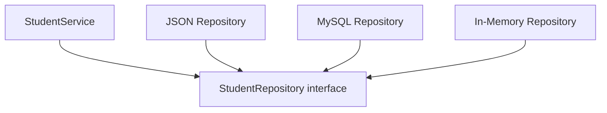
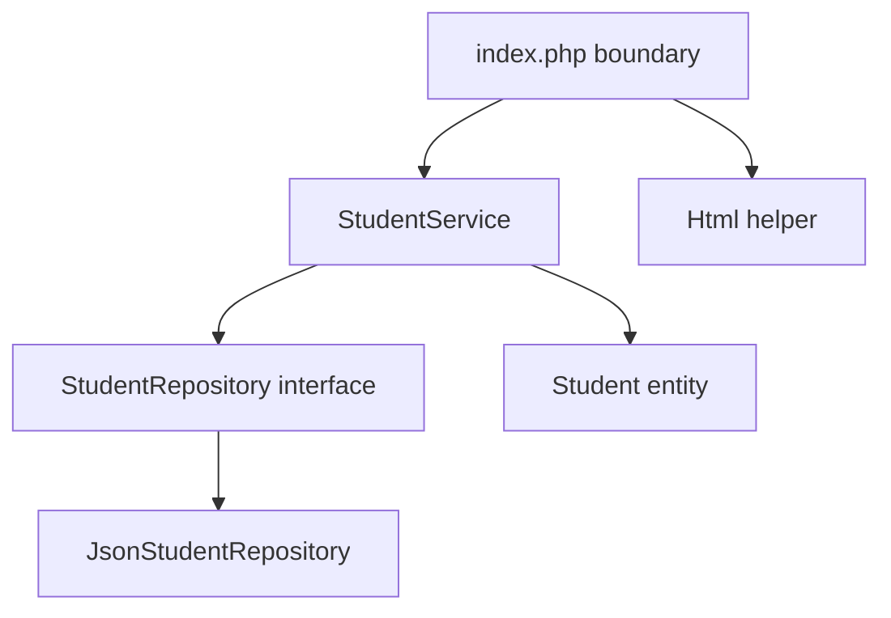

# 🧱 Chapter 33: Object-Oriented PHP


> [!TIP]
> **Chapter Goal:** Classes and objects ke through PHP code ko reusable, testable aur maintainable banana; encapsulation, inheritance, polymorphism, interfaces, traits, namespaces and dependency injection use karna.

> [!NOTE]
> PHP OOP features version ke saath evolve hote hain. Examples broadly modern PHP style use karte hain. Property hooks/lazy objects jaise newer advanced features ke liye installed PHP version and official manual verify karein.

---

## 🎯 33.1 Learning Objectives

Is chapter ke baad aap:

- Procedural and object-oriented approaches compare karenge.
- Classes, objects, properties and methods define karenge.
- Constructors and property promotion use karenge.
- Public, protected and private visibility explain karenge.
- Encapsulation and invariants apply karenge.
- Inheritance, overriding and polymorphism use karenge.
- Abstract classes and interfaces compare karenge.
- Traits safely use karenge.
- Static members, constants and readonly properties samjhenge.
- Namespaces and autoloading use karenge.
- Composition and dependency injection apply karenge.
- OOP Student Management practical build karenge.

---

## 🗣️ 33.2 Difficult Words

| Word | Pronunciation | Simple Meaning |
|---|---|---|
| Object-Oriented | ऑब्जेक्ट ओरिएन्टेड | Objects based programming style |
| Class | क्लास — *klas* | Object banane ka blueprint |
| Object | ऑब्जेक्ट — *ob-jekt* | Class ka instance |
| Property | प्रॉपर्टी | Object ka stored data |
| Method | मेथड | Class/object ka function |
| Constructor | कन्स्ट्रक्टर | Object creation par initialization method |
| Encapsulation | एनकैप्सुलेशन | Data/behavior ko controlled unit me rakhna |
| Abstraction | एब्स्ट्रैक्शन | Unnecessary detail hide karna |
| Inheritance | इनहेरिटेन्स | Parent behavior child me receive |
| Polymorphism | पॉलीमॉर्फिज़्म | Same contract, different implementations |
| Interface | इंटरफेस | Required public behavior contract |
| Trait | ट्रेट — *trayt* | Reusable method group |
| Dependency | डिपेन्डेन्सी | Object ko kaam ke liye needed collaborator |
| Immutable | इम्यूटेबल | Creation ke baad state change na hona |
| Namespace | नेमस्पेस | Class names organize/isolate karna |

---

# 🟦 Part A: OOP Fundamentals

## 33.3 What Is Object-Oriented Programming?

OOP data and related behavior ko objects/classes me organize karta hai.

Procedural:

```php
$studentName = "Broun";
$marks = [80, 90, 75];

function calculateAverage(array $marks): float
{
    return array_sum($marks) / count($marks);
}
```

Object-oriented:

```php
$student = new Student(
    name: "Broun",
    marks: [80, 90, 75]
);

echo $student->average();
```

OOP automatically better nahi. It is useful when objects/domain concepts and changing behavior benefit from encapsulation and contracts.

---

## 33.4 Four Common OOP Ideas

1. **Encapsulation:** State and rules controlled inside class.
2. **Abstraction:** Public interface important behavior shows, details hides.
3. **Inheritance:** Child parent behavior specializes.
4. **Polymorphism:** Different types same contract through interchangeable behavior.

Modern design often inheritance se zyada composition prefer karta hai.

---

## 33.5 Class and Object

```php
class Student
{
    public string $name;

    public function introduce(): string
    {
        return "I am {$this->name}.";
    }
}

$student = new Student();
$student->name = "Broun";

echo $student->introduce();
```

- `Student` = class
- `$student` = object/instance
- `$name` = property
- `introduce()` = method
- `$this` = current object

---

## 33.6 Object Operator

Instance property/method:

```php
$student->name;
$student->introduce();
```

Do not add `$` before property name after arrow:

Wrong:

```php
$student->$name;
```

That syntax means dynamic property name from variable, a different advanced behavior.

---

# 🟩 Part B: Properties and Constructors

## 33.7 Typed Properties

```php
class Student
{
    public int $id;
    public string $name;
    public string $course;
    public bool $active = true;
}
```

Uninitialized typed property read karna error produce karta hai. Constructor/default se initialize karein.

---

## 33.8 Constructor

```php
class Student
{
    public string $name;
    public string $course;

    public function __construct(
        string $name,
        string $course
    ) {
        $this->name = $name;
        $this->course = $course;
    }
}

$student = new Student("Broun", "BCA");
```

`__construct()` each new object creation par called hota hai.

---

## 33.9 Constructor Property Promotion

Concise modern syntax:

```php
class Student
{
    public function __construct(
        public int $id,
        public string $name,
        public string $course,
        public bool $active = true
    ) {
    }
}
```

Parameters with visibility automatically properties create/assign karte hain.

Use when validation/transformation needs manageable ho; complex constructors ko factories/services me simplify karein.

---

## 33.10 Validation in Constructor

```php
class Student
{
    public function __construct(
        private int $id,
        private string $name
    ) {
        if ($id <= 0) {
            throw new InvalidArgumentException(
                "Student ID must be positive."
            );
        }

        $name = trim($name);

        if ($name === "") {
            throw new InvalidArgumentException(
                "Student name is required."
            );
        }

        $this->name = $name;
    }
}
```

Promoted property assignment happens before constructor body, but body can validate/reassign non-readonly promoted property. Cleaner alternative: normal parameters + explicit assignment when strict invariant control desired.

---

## 33.11 Readonly Properties

```php
final class StudentId
{
    public function __construct(
        public readonly int $value
    ) {
        if ($value <= 0) {
            throw new InvalidArgumentException(
                "ID must be positive."
            );
        }
    }
}
```

Readonly property once initialized, normally modify nahi ki ja sakti.

> [!IMPORTANT]
> Readonly object property containing another object automatically deep immutable nahi banati; referenced object's internal state may still change.

---

## 33.12 Class Constants

```php
class Student
{
    public const PASS_MARKS = 40;
    private const MAX_MARKS = 100;
}

echo Student::PASS_MARKS;
```

Access with scope resolution operator `::`.

---

# 🟨 Part C: Visibility and Encapsulation

## 33.13 Visibility

| Visibility | Same Class | Child Class | Outside |
|---|---:|---:|---:|
| `public` | Yes | Yes | Yes |
| `protected` | Yes | Yes | No |
| `private` | Yes | No direct access | No |

---

## 33.14 Private State

```php
class BankAccount
{
    private int $balanceInPaise = 0;

    public function deposit(int $amountInPaise): void
    {
        if ($amountInPaise <= 0) {
            throw new InvalidArgumentException(
                "Deposit must be positive."
            );
        }

        $this->balanceInPaise += $amountInPaise;
    }

    public function balanceInPaise(): int
    {
        return $this->balanceInPaise;
    }
}
```

Caller invalid direct balance set nahi kar sakta. Class invariant protect karti hai.

---

## 33.15 Getters and Setters

```php
class Student
{
    public function __construct(
        private string $name
    ) {
        $this->rename($name);
    }

    public function name(): string
    {
        return $this->name;
    }

    public function rename(string $name): void
    {
        $name = trim($name);

        if ($name === "") {
            throw new InvalidArgumentException(
                "Name is required."
            );
        }

        $this->name = $name;
    }
}
```

Blind getter/setter for every field encapsulation guarantee nahi. Expose domain behavior when possible:

```php
$student->enrolIn($course);
$student->recordMarks($subject, $marks);
```

---

## 33.16 Invariants

Invariant rule object valid state me always maintain kare.

Student marks invariant:

```text
0 ≤ marks ≤ 100
```

```php
public function recordMarks(
    string $subject,
    int $marks
): void {
    if ($marks < 0 || $marks > 100) {
        throw new InvalidArgumentException(
            "Marks must be from 0 to 100."
        );
    }

    $this->marks[$subject] = $marks;
}
```

---

# 🟪 Part D: Methods and Object Behavior

## 33.17 Method Parameters and Return Types

```php
class Rectangle
{
    public function __construct(
        private float $width,
        private float $height
    ) {
    }

    public function area(): float
    {
        return $this->width * $this->height;
    }

    public function resize(
        float $width,
        float $height
    ): void {
        if ($width <= 0 || $height <= 0) {
            throw new InvalidArgumentException(
                "Dimensions must be positive."
            );
        }

        $this->width = $width;
        $this->height = $height;
    }
}
```

---

## 33.18 Fluent Interface

```php
class Query
{
    private array $filters = [];

    public function where(
        string $field,
        mixed $value
    ): self {
        $this->filters[$field] = $value;

        return $this;
    }
}

$query = (new Query())
    ->where("course", "BCA")
    ->where("active", true);
```

Fluent APIs readable ho sakti hain, but hidden mutation/long chains avoid karein.

---

## 33.19 Named Constructors/Factory Methods

```php
final class Email
{
    private function __construct(
        private string $value
    ) {
    }

    public static function fromString(
        string $value
    ): self {
        $value = strtolower(trim($value));

        if (
            filter_var(
                $value,
                FILTER_VALIDATE_EMAIL
            ) === false
        ) {
            throw new InvalidArgumentException(
                "Invalid email."
            );
        }

        return new self($value);
    }

    public function value(): string
    {
        return $this->value;
    }
}
```

Usage:

```php
$email = Email::fromString("student@example.com");
```

Named factory creation intention explain kar sakti hai.

---

# 🟥 Part E: Static Members

## 33.20 Static Method and Property

```php
class MathHelper
{
    public static function percentage(
        float $total,
        float $maximum
    ): float {
        if ($maximum <= 0) {
            throw new InvalidArgumentException(
                "Maximum must be positive."
            );
        }

        return ($total / $maximum) * 100;
    }
}

$result = MathHelper::percentage(250, 300);
```

Static member object instance ke bina class par access hota hai.

---

## 33.21 `self::`, `parent::` and `static::`

- `self::` defining class
- `parent::` parent implementation
- `static::` late static binding/current called class behavior

Beginner code me unnecessary inheritance/static complexity avoid karein.

---

## 33.22 Static State Warning

```php
class Counter
{
    public static int $count = 0;
}
```

Global-like mutable static state:

- Tests interfere
- Hidden dependency
- Request/process lifetime confusion
- Concurrency issues

Use injected object/service where state matters.

---

# 🟧 Part F: Inheritance

## 33.23 Basic Inheritance

```php
class Person
{
    public function __construct(
        protected string $name
    ) {
    }

    public function introduce(): string
    {
        return "My name is {$this->name}.";
    }
}

class Student extends Person
{
    public function __construct(
        string $name,
        private string $course
    ) {
        parent::__construct($name);
    }

    public function introduce(): string
    {
        return parent::introduce()
            . " I study {$this->course}.";
    }
}
```

Child own constructor defines kare to parent constructor automatically call nahi hota; explicit `parent::__construct()` needed.

---

## 33.24 Method Overriding

Child inherited method compatible signature ke saath redefine karta hai.

```php
class User
{
    public function dashboardPath(): string
    {
        return "/dashboard.php";
    }
}

class Admin extends User
{
    public function dashboardPath(): string
    {
        return "/admin/dashboard.php";
    }
}
```

Visibility restrict nahi kar sakte and signature compatibility rules follow karni hoti hain.

---

## 33.25 The `final` Keyword

Final class extend nahi ho sakti:

```php
final class StudentId
{
}
```

Final method override nahi ho sakta:

```php
class User
{
    final public function id(): int
    {
        return 1;
    }
}
```

Use intentional design invariant/extension boundary ke liye, randomly nahi.

---

## 33.26 “Is-A” Test

Inheritance tab use when:

```text
Student is a Person
AdminUser is a User
```

Bad:

```text
Report is a Database
Car is an Engine
```

Those are dependencies/composition:

```text
Report uses a Repository
Car has an Engine
```

---

# 🟫 Part G: Abstract Classes and Interfaces

## 33.27 Abstract Class

```php
abstract class Report
{
    public function __construct(
        protected string $title
    ) {
    }

    abstract public function render(): string;

    public function title(): string
    {
        return $this->title;
    }
}
```

Cannot instantiate:

```php
// new Report(); // Error
```

Concrete child:

```php
class HtmlReport extends Report
{
    public function render(): string
    {
        return "<h1>"
            . htmlspecialchars(
                $this->title,
                ENT_QUOTES | ENT_SUBSTITUTE,
                "UTF-8"
            )
            . "</h1>";
    }
}
```

Abstract class common state + behavior + required methods combine kar sakti hai.

---

## 33.28 Interface

```php
interface Notifier
{
    public function send(
        string $recipient,
        string $message
    ): void;
}
```

Implementations:

```php
class EmailNotifier implements Notifier
{
    public function send(
        string $recipient,
        string $message
    ): void {
        // Use configured email service
    }
}

class LogNotifier implements Notifier
{
    public function send(
        string $recipient,
        string $message
    ): void {
        error_log("To {$recipient}: {$message}");
    }
}
```

All interface methods public and compatible implementation required.

---

## 33.29 Abstract Class vs Interface

| Abstract Class | Interface |
|---|---|
| Shared state allowed | Primarily contract |
| Implemented methods allowed | Modern interfaces specify members/contracts; methods generally declarations |
| Single class inheritance | Multiple interfaces implement |
| “Is-a base type” relationship | “Can do” capability |
| Constructor possible | Constructor declarations discouraged |

A class one parent extend but multiple interfaces implement kar sakti hai.

---

## 33.30 Polymorphism

```php
function notifyStudent(
    Notifier $notifier,
    string $email
): void {
    $notifier->send(
        $email,
        "Your result is ready."
    );
}

notifyStudent(
    new EmailNotifier(),
    "student@example.com"
);

notifyStudent(
    new LogNotifier(),
    "student@example.com"
);
```

Function concrete class nahi, contract par depend karta hai. Implementations interchangeable hain.

---

# 🟦 Part H: Traits

## 33.31 What Is a Trait?

Trait horizontal code reuse mechanism hai. Trait instantiate nahi hota.

```php
trait HasTimestamps
{
    private ?DateTimeImmutable $updatedAt = null;

    public function touch(): void
    {
        $this->updatedAt = new DateTimeImmutable();
    }

    public function updatedAt(): ?DateTimeImmutable
    {
        return $this->updatedAt;
    }
}

class Student
{
    use HasTimestamps;
}
```

---

## 33.32 Trait Conflicts

```php
trait FileLogger
{
    public function log(string $message): void
    {
    }
}

trait ConsoleLogger
{
    public function log(string $message): void
    {
    }
}

class Service
{
    use FileLogger, ConsoleLogger {
        FileLogger::log insteadof ConsoleLogger;
        ConsoleLogger::log as logToConsole;
    }
}
```

Conflict resolution possible hai, but many behavior-heavy traits design confusion create kar sakte hain.

---

## 33.33 Trait vs Composition

Trait copies behavior into class context and may depend on hidden properties/methods. Composition explicit collaborator makes dependencies clearer.

Prefer composition when behavior has:

- State
- External I/O
- Replaceable strategy
- Testing need
- Complex dependencies

Traits small cross-cutting reusable implementation ke liye.

---

# 🟩 Part I: Composition and Dependency Injection

## 33.34 Composition

```php
class StudentService
{
    public function __construct(
        private StudentRepository $repository,
        private Notifier $notifier
    ) {
    }
}
```

StudentService **has** repository and notifier.

---

## 33.35 Dependency Injection

Dependency outside se constructor me provided:

```php
$service = new StudentService(
    new JsonStudentRepository($path),
    new EmailNotifier()
);
```

Benefits:

- Dependencies visible
- Replace implementation
- Unit testing easier
- Less hidden global/static state
- Single responsibility

---

## 33.36 Interface-Based Repository

```php
interface StudentRepository
{
    public function nextId(): int;

    public function save(Student $student): void;

    public function findById(int $id): ?Student;

    /** @return list<Student> */
    public function all(): array;
}
```

Service cares contract, storage mechanism nahi.

---

## 33.37 In-Memory Test Implementation

```php
final class InMemoryStudentRepository
    implements StudentRepository
{
    /** @var array<int, Student> */
    private array $students = [];

    public function nextId(): int
    {
        return $this->students === []
            ? 1
            : max(array_keys($this->students)) + 1;
    }

    public function save(Student $student): void
    {
        $this->students[$student->id()] = $student;
    }

    public function findById(int $id): ?Student
    {
        return $this->students[$id] ?? null;
    }

    public function all(): array
    {
        return array_values($this->students);
    }
}
```

Later MySQL implementation same interface implement kar sakti hai.

---

# 🟨 Part J: Namespaces

## 33.38 Why Namespaces?

Two libraries same class name define kar sakti hain:

```text
AppModelsUser
VendorPackageUser
```

Namespace name collision prevent and code organize karta hai.

---

## 33.39 Defining Namespace

`src/Domain/Student.php`:

```php
<?php
declare(strict_types=1);

namespace AppDomain;

final class Student
{
}
```

Namespace declaration generally file ke top after declare.

---

## 33.40 Importing with `use`

```php
use AppDomainStudent;
use AppRepositoryStudentRepository;
use DateTimeImmutable;

$student = new Student();
```

Alias:

```php
use AppDomainUser as DomainUser;
use VendorPackageUser as PackageUser;
```

---

## 33.41 Fully Qualified Name

```php
$date = new DateTimeImmutable();
```

Leading backslash global root namespace.

Inside namespaced code, built-in classes import or fully qualify consistently.

---

# 🟪 Part K: Autoloading and Composer

## 33.42 Why Autoloading?

Without autoloading:

```php
require "Student.php";
require "Course.php";
require "StudentService.php";
```

Autoloader class first use par relevant file loads.

---

## 33.43 Basic Autoloader Concept

```php
spl_autoload_register(
    function (string $class): void {
        $prefix = "App\";
        $baseDirectory = __DIR__ . "/src/";

        if (!str_starts_with($class, $prefix)) {
            return;
        }

        $relativeClass = substr(
            $class,
            strlen($prefix)
        );

        $file = $baseDirectory
            . str_replace("\", "/", $relativeClass)
            . ".php";

        if (is_file($file)) {
            require $file;
        }
    }
);
```

Map only trusted class naming to controlled base directory. Composer preferred for real projects.

---

## 33.44 Composer PSR-4 Autoloading

`composer.json`:

```json
{
  "autoload": {
    "psr-4": {
      "App\\": "src/"
    }
  }
}
```

Generate:

```bash
composer dump-autoload
```

Entry point:

```php
require __DIR__ . "/../vendor/autoload.php";
```

Commit `composer.json` and lock file according project policy; `vendor/` commonly ignored and installed during deployment.

---

# 🟥 Part L: Magic Methods

## 33.45 Common Magic Methods

| Method | Trigger |
|---|---|
| `__construct()` | Object creation |
| `__destruct()` | Destruction/end lifecycle |
| `__toString()` | String conversion |
| `__get()` | Inaccessible property read |
| `__set()` | Inaccessible property write |
| `__call()` | Inaccessible method call |
| `__invoke()` | Object called as function |
| `__clone()` | Cloning |
| `__serialize()` | Serialization |
| `__unserialize()` | Unserialization |

Use sparingly; hidden behavior can reduce clarity/tooling.

---

## 33.46 `__toString()`

```php
final class StudentId
{
    public function __construct(
        private int $value
    ) {
    }

    public function __toString(): string
    {
        return (string) $this->value;
    }
}
```

```php
$id = new StudentId(42);
echo $id;
```

---

## 33.47 Invokable Object

```php
final class GradeCalculator
{
    public function __invoke(
        float $percentage
    ): string {
        return match (true) {
            $percentage >= 90 => "A+",
            $percentage >= 75 => "A",
            $percentage >= 60 => "B",
            $percentage >= 40 => "C",
            default => "Fail",
        };
    }
}

$calculateGrade = new GradeCalculator();
$grade = $calculateGrade(82);
```

Useful strategy/callback object.

---

## 33.48 Serialization Warning

Never `unserialize()` untrusted data. Object injection and magic-method gadget risks ho sakte hain.

Prefer JSON for simple external data with explicit validation:

```php
$data = json_decode(
    $json,
    true,
    512,
    JSON_THROW_ON_ERROR
);
```

Then validated data se objects construct karein.

---

# 🟧 Part M: Object Identity, Cloning and Comparison

## 33.49 Object Assignment

```php
$first = new Student(1, "Broun");
$second = $first;

$second->rename("Aman");

echo $first->name(); // Aman
```

Both variables same object reference/handle point karte hain.

---

## 33.50 Cloning

```php
$copy = clone $first;
```

Shallow clone: nested object properties may still reference same nested objects unless `__clone()` explicitly clones them.

---

## 33.51 Equality and Identity

```php
$first == $second;
$first === $second;
```

- `==` same class and equal properties comparison semantics
- `===` exact same object instance

Domain equality explicit method se clearer ho sakti hai:

```php
public function equals(StudentId $other): bool
{
    return $this->value === $other->value;
}
```

---

# 🟫 Part N: Exceptions in OOP

## 33.52 Domain Exception

```php
final class InvalidMarks
    extends DomainException
{
}

final class Marks
{
    public function __construct(
        public readonly int $value
    ) {
        if ($value < 0 || $value > 100) {
            throw new InvalidMarks(
                "Marks must be from 0 to 100."
            );
        }
    }
}
```

Specific exception callers ko failure type distinguish karne deta hai.

---

## 33.53 Catching at Boundary

```php
try {
    $marks = new Marks($submittedMarks);
    $service->recordMarks($studentId, $marks);
} catch (InvalidMarks $error) {
    $formErrors["marks"] = $error->getMessage();
} catch (Throwable $error) {
    error_log($error->getMessage());

    $formErrors["form"] =
        "Could not save marks. Please retry.";
}
```

Deep class error ko silently swallow na karein. User-facing boundary par safe translation.

---

# 🟦 Part O: SOLID Introduction

## 33.54 Single Responsibility

Class ke change hone ka one focused reason.

Bad:

```text
Student class validates, saves SQL, sends email,
renders HTML and writes logs
```

Better:

- Student entity
- StudentRepository
- StudentService
- Notifier
- Controller/template

---

## 33.55 Open/Closed

Code new implementation add karke extend ho, existing stable logic repeatedly edit na karna pade.

`Notifier` interface allows Email/SMS/Log notifier additions.

---

## 33.56 Liskov Substitution

Child/implementation parent/contract ki expectations break na kare.

If function `Notifier` accepts, every implementation promised behavior/signature respect kare.

---

## 33.57 Interface Segregation

Large interface:

```text
StudentManager with 25 unrelated methods
```

Focused:

- StudentReader
- StudentWriter
- StudentNotifier

Clients only needed contract depend karein.

---

## 33.58 Dependency Inversion

High-level business logic concrete file/database class par directly depend na kare; abstraction/interface par depend kare.



---

# 🟩 Part P: Complete Student Management Practical

## 33.59 Project Structure

```text
oop-students/
├── composer.json
├── public/
│   ├── index.php
│   └── styles.css
├── src/
│   ├── Domain/
│   │   ├── Student.php
│   │   └── InvalidMarks.php
│   ├── Repository/
│   │   ├── StudentRepository.php
│   │   └── JsonStudentRepository.php
│   ├── Service/
│   │   └── StudentService.php
│   └── Support/
│       └── Html.php
└── storage/
    └── students.json
```

---

## 33.60 `composer.json`

```json
{
  "name": "bca/oop-students",
  "description": "OOP student-management learning project",
  "autoload": {
    "psr-4": {
      "App\\": "src/"
    }
  },
  "require": {}
}
```

Run:

```bash
composer dump-autoload
php -S localhost:8000 -t public
```

---

## 33.61 Domain Exception

`src/Domain/InvalidMarks.php`:

```php
<?php
declare(strict_types=1);

namespace AppDomain;

use DomainException;

final class InvalidMarks extends DomainException
{
}
```

---

## 33.62 Student Entity

`src/Domain/Student.php`:

```php
<?php
declare(strict_types=1);

namespace AppDomain;

use InvalidArgumentException;

final class Student
{
    /** @var array<string, int> */
    private array $marks = [];

    public function __construct(
        private readonly int $id,
        private string $name,
        private readonly string $course
    ) {
        if ($id <= 0) {
            throw new InvalidArgumentException(
                "ID must be positive."
            );
        }

        $this->rename($name);

        if (trim($course) === "") {
            throw new InvalidArgumentException(
                "Course is required."
            );
        }
    }

    public function id(): int
    {
        return $this->id;
    }

    public function name(): string
    {
        return $this->name;
    }

    public function course(): string
    {
        return $this->course;
    }

    public function rename(string $name): void
    {
        $name = trim($name);

        if ($name === "") {
            throw new InvalidArgumentException(
                "Name is required."
            );
        }

        $this->name = $name;
    }

    public function recordMarks(
        string $subject,
        int $marks
    ): void {
        $subject = trim($subject);

        if ($subject === "") {
            throw new InvalidArgumentException(
                "Subject is required."
            );
        }

        if ($marks < 0 || $marks > 100) {
            throw new InvalidMarks(
                "Marks must be from 0 to 100."
            );
        }

        $this->marks[$subject] = $marks;
    }

    /** @return array<string, int> */
    public function marks(): array
    {
        return $this->marks;
    }

    public function average(): float
    {
        if ($this->marks === []) {
            return 0.0;
        }

        return array_sum($this->marks)
            / count($this->marks);
    }

    public function grade(): string
    {
        return match (true) {
            $this->average() >= 90 => "A+",
            $this->average() >= 75 => "A",
            $this->average() >= 60 => "B",
            $this->average() >= 40 => "C",
            default => "Fail",
        };
    }

    public function toArray(): array
    {
        return [
            "id" => $this->id,
            "name" => $this->name,
            "course" => $this->course,
            "marks" => $this->marks,
        ];
    }

    public static function fromArray(array $data): self
    {
        $student = new self(
            id: (int) ($data["id"] ?? 0),
            name: is_string($data["name"] ?? null)
                ? $data["name"]
                : "",
            course: is_string($data["course"] ?? null)
                ? $data["course"]
                : ""
        );

        $marks = $data["marks"] ?? [];

        if (!is_array($marks)) {
            throw new InvalidArgumentException(
                "Invalid marks data."
            );
        }

        foreach ($marks as $subject => $mark) {
            if (!is_string($subject) || !is_int($mark)) {
                throw new InvalidArgumentException(
                    "Invalid subject or marks."
                );
            }

            $student->recordMarks($subject, $mark);
        }

        return $student;
    }
}
```

---

## 33.63 Repository Interface

`src/Repository/StudentRepository.php`:

```php
<?php
declare(strict_types=1);

namespace AppRepository;

use AppDomainStudent;

interface StudentRepository
{
    public function nextId(): int;

    public function save(Student $student): void;

    /** @return list<Student> */
    public function all(): array;
}
```

---

## 33.64 JSON Repository

`src/Repository/JsonStudentRepository.php`:

```php
<?php
declare(strict_types=1);

namespace AppRepository;

use AppDomainStudent;
use RuntimeException;

final class JsonStudentRepository
    implements StudentRepository
{
    public function __construct(
        private readonly string $path
    ) {
        $directory = dirname($path);

        if (
            !is_dir($directory)
            && !mkdir($directory, 0750, true)
            && !is_dir($directory)
        ) {
            throw new RuntimeException(
                "Could not create storage directory."
            );
        }

        if (!is_file($path)) {
            if (
                file_put_contents(
                    $path,
                    "[]",
                    LOCK_EX
                ) === false
            ) {
                throw new RuntimeException(
                    "Could not create storage file."
                );
            }
        }
    }

    public function nextId(): int
    {
        $students = $this->all();

        if ($students === []) {
            return 1;
        }

        return max(
            array_map(
                fn (Student $student): int =>
                    $student->id(),
                $students
            )
        ) + 1;
    }

    public function save(Student $student): void
    {
        $students = $this->all();
        $replaced = false;

        foreach ($students as $index => $existing) {
            if ($existing->id() === $student->id()) {
                $students[$index] = $student;
                $replaced = true;
                break;
            }
        }

        if (!$replaced) {
            $students[] = $student;
        }

        $data = array_map(
            fn (Student $item): array =>
                $item->toArray(),
            $students
        );

        $json = json_encode(
            $data,
            JSON_PRETTY_PRINT
            | JSON_UNESCAPED_UNICODE
            | JSON_THROW_ON_ERROR
        );

        if (
            file_put_contents(
                $this->path,
                $json,
                LOCK_EX
            ) === false
        ) {
            throw new RuntimeException(
                "Could not save students."
            );
        }
    }

    public function all(): array
    {
        $json = file_get_contents($this->path);

        if ($json === false) {
            throw new RuntimeException(
                "Could not read students."
            );
        }

        $data = json_decode(
            $json,
            true,
            512,
            JSON_THROW_ON_ERROR
        );

        if (!is_array($data)) {
            throw new RuntimeException(
                "Invalid student data."
            );
        }

        return array_map(
            fn (array $row): Student =>
                Student::fromArray($row),
            $data
        );
    }
}
```

> [!WARNING]
> Read-modify-write across separate calls is not safe for concurrent production writes despite `LOCK_EX` on final write. This repository is educational; database transactions/unique constraints come later.

---

## 33.65 Service Class

`src/Service/StudentService.php`:

```php
<?php
declare(strict_types=1);

namespace AppService;

use AppDomainStudent;
use AppRepositoryStudentRepository;

final class StudentService
{
    public function __construct(
        private readonly StudentRepository $repository
    ) {
    }

    public function create(
        string $name,
        string $course,
        array $marks
    ): Student {
        $student = new Student(
            id: $this->repository->nextId(),
            name: $name,
            course: $course
        );

        foreach ($marks as $subject => $mark) {
            $student->recordMarks(
                (string) $subject,
                (int) $mark
            );
        }

        $this->repository->save($student);

        return $student;
    }

    /** @return list<Student> */
    public function listByHighestAverage(): array
    {
        $students = $this->repository->all();

        usort(
            $students,
            fn (Student $a, Student $b): int =>
                $b->average() <=> $a->average()
        );

        return $students;
    }
}
```

---

## 33.66 HTML Helper

`src/Support/Html.php`:

```php
<?php
declare(strict_types=1);

namespace AppSupport;

final class Html
{
    public static function escape(
        string $value
    ): string {
        return htmlspecialchars(
            $value,
            ENT_QUOTES | ENT_SUBSTITUTE,
            "UTF-8"
        );
    }
}
```

---

## 33.67 Entry Point

`public/index.php`:

```php
<?php
declare(strict_types=1);

require_once __DIR__ . "/../vendor/autoload.php";

use AppDomainInvalidMarks;
use AppRepositoryJsonStudentRepository;
use AppServiceStudentService;
use AppSupportHtml;

$repository = new JsonStudentRepository(
    __DIR__ . "/../storage/students.json"
);

$service = new StudentService($repository);

$error = "";

if ($_SERVER["REQUEST_METHOD"] === "POST") {
    try {
        $name = is_string($_POST["name"] ?? null)
            ? trim($_POST["name"])
            : "";

        $course = is_string($_POST["course"] ?? null)
            ? trim($_POST["course"])
            : "";

        $service->create(
            $name,
            $course,
            [
                "Web Technology" => filter_var(
                    $_POST["web_marks"] ?? null,
                    FILTER_VALIDATE_INT
                ),
                "Programming" => filter_var(
                    $_POST["programming_marks"] ?? null,
                    FILTER_VALIDATE_INT
                ),
            ]
        );

        header("Location: /", true, 303);
        exit;
    } catch (InvalidMarks | InvalidArgumentException $exception) {
        $error = $exception->getMessage();
    } catch (Throwable $exception) {
        error_log($exception->getMessage());
        $error = "Could not save student.";
    }
}

$students = $service->listByHighestAverage();
?>
<!DOCTYPE html>
<html lang="en">
<head>
    <meta charset="UTF-8">
    <meta
        name="viewport"
        content="width=device-width, initial-scale=1.0">
    <title>OOP Student Manager</title>
    <link rel="stylesheet" href="styles.css">
</head>
<body>
    <main class="container">
        <h1>OOP Student Manager</h1>

        <?php if ($error !== ""): ?>
            <p class="error" role="alert">
                <?= Html::escape($error) ?>
            </p>
        <?php endif; ?>

        <form method="post" class="card">
            <label>
                Name
                <input name="name" required>
            </label>

            <label>
                Course
                <input name="course" required>
            </label>

            <label>
                Web Technology Marks
                <input
                    name="web_marks"
                    type="number"
                    min="0"
                    max="100"
                    required>
            </label>

            <label>
                Programming Marks
                <input
                    name="programming_marks"
                    type="number"
                    min="0"
                    max="100"
                    required>
            </label>

            <button type="submit">Add Student</button>
        </form>

        <section aria-labelledby="students-title">
            <h2 id="students-title">Students</h2>

            <div class="student-grid">
                <?php foreach ($students as $student): ?>
                    <article class="card">
                        <h3>
                            <?= Html::escape($student->name()) ?>
                        </h3>

                        <p>
                            Course:
                            <?= Html::escape($student->course()) ?>
                        </p>

                        <p>
                            Average:
                            <?= number_format(
                                $student->average(),
                                2
                            ) ?>%
                        </p>

                        <p>
                            Grade:
                            <?= Html::escape($student->grade()) ?>
                        </p>
                    </article>
                <?php endforeach; ?>
            </div>
        </section>
    </main>
</body>
</html>
```

> [!CAUTION]
> `filter_var()` may return `false`, which this example converts to integer `0` inside service—making malformed input indistinguishable from valid zero. Improve boundary validation before production. Exercise section asks you to fix this deliberately.

---

## 33.68 Practical Architecture



- Entry point handles HTTP/template boundary.
- Entity protects student rules.
- Service coordinates use case.
- Interface abstracts persistence.
- JSON repository stores learning data.
- Helper encodes output.
- Composer autoloads classes.

---

## 33.69 Improvements

1. Validate integer filter results strictly before service call.
2. Add CSRF token/session from Chapter 32.
3. Add name/course length allowlists.
4. Add find/update/delete methods.
5. Lock full JSON read-modify-write transaction.
6. Replace JSON repository with MySQL/PDO later.
7. Add Notifier interface after creation.
8. Add tests with InMemoryStudentRepository.
9. Move HTML into templates/controller.
10. Add authentication and authorization.

---

# 🟥 Part Q: Common OOP Mistakes

## 33.70 God Object

One class handles:

- Validation
- Database
- Email
- HTML
- Authentication
- Logging

Split responsibilities.

---

## 33.71 Anemic or Data-Bag Model

Only public properties, all rules outside:

```php
$student->marks = -500;
```

Put important invariant behavior inside entity/value object.

Not every data-transfer object needs rich behavior; context matters.

---

## 33.72 Inheritance for Reuse Only

Using `extends` just to reuse one method creates wrong “is-a” relationship. Prefer helper/composed service or trait for small behavior.

---

## 33.73 Service Locator/Globals

Hidden:

```php
$db = GlobalContainer::get("database");
```

Explicit constructor dependency easier test/understand:

```php
public function __construct(
    private Database $database
) {
}
```

---

## 33.74 Excessive Static Methods

Static utilities can be fine for stateless pure operation, but external dependencies/static state make testing and substitution difficult.

---

## 33.75 Premature Patterns

Do not add factories, repositories, events, decorators and 50 interfaces to tiny script without need. Complexity must solve a concrete change/testing/design problem.

---

## 🚫 33.76 Common Mistakes

1. Class/object confuse karna.
2. Uninitialized typed property access.
3. Public mutable state exposing invariants.
4. Blind getters/setters for everything.
5. Parent constructor call forget.
6. Private parent member child se access.
7. Incompatible override signature.
8. Multiple-class inheritance expect karna.
9. Abstract class instantiate karna.
10. Interface methods non-public implement karna.
11. Trait overuse/hidden dependency.
12. Static mutable state.
13. Wrong “is-a” inheritance.
14. Composition ignore.
15. Concrete dependency directly new inside service.
16. Namespace/import mistake.
17. Manual require list despite autoloading.
18. Untrusted `unserialize()`.
19. Shallow clone ko deep copy samajhna.
20. OOP architecture ko unnecessary complexity banana.

---

## 📌 33.77 Best Practices

- Domain language-based names.
- Properties typed and minimally visible.
- Constructor ensures valid initial state.
- Behavior protects invariants.
- Small focused classes.
- Interfaces at meaningful variation boundaries.
- Composition over inheritance where suitable.
- Constructor dependency injection.
- Exceptions meaningful and boundary par handle.
- PSR-4/Composer autoloading.
- External data validated before object creation.
- Entities not responsible for HTML/database/email all together.
- Tests through interface-based fakes.
- Modern supported PHP + coding standard.
- Simplicity first.

---

## 📝 33.78 Chapter Summary

Class object ka blueprint hai; object class instance. Properties state and methods behavior define karte hain. Constructors valid initialization and property promotion concise declarations provide karte hain. Visibility encapsulation controls, allowing objects to maintain invariants. Inheritance parent behavior specialize karta hai but single inheritance and tight coupling ke কারণে composition often better hai. Abstract classes shared base implementation provide karte hain; interfaces interchangeable contracts define karte hain, enabling polymorphism. Traits horizontal method reuse provide karte hain. Namespaces name collisions avoid and Composer PSR-4 autoloading files automatically load karta hai. Dependency injection explicit collaborators provide karta hai, improving testability and maintainability.

---

## 🎲 33.79 MCQs

1. Object blueprint?  
   A. Method · **B. Class** · C. Trait · D. Namespace

2. Current object?  
   A. `self` · **B. `$this`** · C. `parent` · D. `static`

3. Outside inaccessible visibility?  
   A. public · **B. private** · C. global · D. open

4. Parent class keyword?  
   A. `implements` · **B. `extends`** · C. `use` · D. `import`

5. Contract keyword?  
   A. trait · **B. interface** · C. object · D. namespace

6. Trait include keyword?  
   A. `extends` · **B. `use`** · C. `new` · D. `clone`

7. Class member access static?  
   A. `->` · **B. `::`** · C. `=>` · D. `...`

8. Dependency passed from outside?  
   A. Inheritance · **B. Dependency injection** · C. Serialization · D. Cloning

---

## ✍️ 33.80 Fill in the Blanks

1. Class instance ko __________ kehte hain.
2. Object creation method __________ hai.
3. Parent implementation access keyword __________.
4. Multiple behavior contracts can be __________.
5. Namespace-based standard autoload commonly __________.

<details>
<summary><strong>✅ Answers</strong></summary>

1. object  
2. `__construct()`  
3. `parent::`  
4. implemented  
5. PSR-4 / Composer

</details>

---

## ✅ 33.81 True or False

1. PHP class multiple classes extend kar sakti hai — **False**
2. Class multiple interfaces implement kar sakti hai — **True**
3. Private parent property child directly access karta hai — **False**
4. Trait instantiate ho sakta hai — **False**
5. Readonly nested object automatically deep immutable hai — **False**
6. Object assignment usually same object handle share karta hai — **True**
7. Composition explicit dependencies improve kar sakti hai — **True**
8. OOP every tiny script ke liye mandatory hai — **False**

---

## ❓ 33.82 Exam Questions

### Short Answer

1. Class and object define karein.
2. Property and method compare karein.
3. Constructor kya hai?
4. Visibility modifiers explain karein.
5. Encapsulation and invariant kya hain?
6. Inheritance and overriding explain karein.
7. Abstract class and interface compare karein.
8. Trait kya hai?
9. Namespace kya hai?
10. Dependency injection explain karein.

### Long Answer

1. Explain OOP principles with PHP examples.
2. Describe classes, constructors and visibility.
3. Explain inheritance, overriding and polymorphism.
4. Compare abstract classes, interfaces and traits.
5. Discuss composition and dependency injection.
6. Explain namespaces and Composer autoloading.
7. Discuss object identity, cloning and exceptions.
8. Build and explain OOP Student Manager.

---

## 🧪 33.83 Practical Exercises

1. Student class and objects create karein.
2. Constructor promotion use karein.
3. Marks invariant protect karein.
4. BankAccount encapsulation class.
5. Person/Student inheritance.
6. Report abstract class.
7. Notifier interface + two implementations.
8. Timestamp trait.
9. Value object with readonly property.
10. Namespaced classes.
11. Composer PSR-4 setup.
12. Repository interface + in-memory implementation.
13. Service dependency injection.
14. Unit-like tests with fake repository.
15. Practical invalid integer boundary fix.
16. JSON repository ko future PDO implementation plan karein.

---

## 🎤 33.84 Viva Questions

1. OOP kya hai?
2. Class kya hai?
3. Object kaise banate hain?
4. `$this` kya hai?
5. Constructor kab call hota hai?
6. Public/private/protected difference?
7. Encapsulation kya hai?
8. Inheritance ka keyword?
9. Parent constructor kaise call?
10. Abstract class instantiate hoti hai?
11. Interface ka purpose?
12. Trait kya karta hai?
13. Polymorphism kya hai?
14. Namespace kyun?
15. Dependency injection ka benefit?

---

## 🏁 33.85 One-Minute Revision

| Question | Quick Answer |
|---|---|
| Blueprint? | Class |
| Instance? | Object |
| Current object? | `$this` |
| Initialize? | `__construct()` |
| Member access? | `->` |
| Class/static access? | `::` |
| Child relation? | `extends` |
| Contract? | Interface |
| Contract use? | `implements` |
| Reusable methods? | Trait |
| Trait attach? | `use` |
| No extension/override? | `final` |
| Organized names? | Namespace |
| Automatic classes? | Autoloading |
| External collaborator? | Dependency injection |

---

## 📚 33.86 Official References

1. [PHP Manual — Classes and Objects](https://www.php.net/manual/en/language.oop5.php)
2. [PHP Manual — The Basics](https://www.php.net/manual/en/language.oop5.basic.php)
3. [PHP Manual — Constructors](https://www.php.net/manual/en/language.oop5.decon.php)
4. [PHP Manual — Inheritance](https://www.php.net/manual/en/language.oop5.inheritance.php)
5. [PHP Manual — Interfaces](https://www.php.net/manual/en/language.oop5.interfaces.php)
6. [PHP Manual — Traits](https://www.php.net/manual/en/language.oop5.traits.php)
7. [PHP Manual — Autoloading](https://www.php.net/manual/en/language.oop5.autoload.php)

---

[⬅️ Previous Chapter](32-cookies-sessions-and-authentication.md) · [📚 Table of Contents](../SUMMARY.md) · **Next: Database and SQL Fundamentals ➡️**
