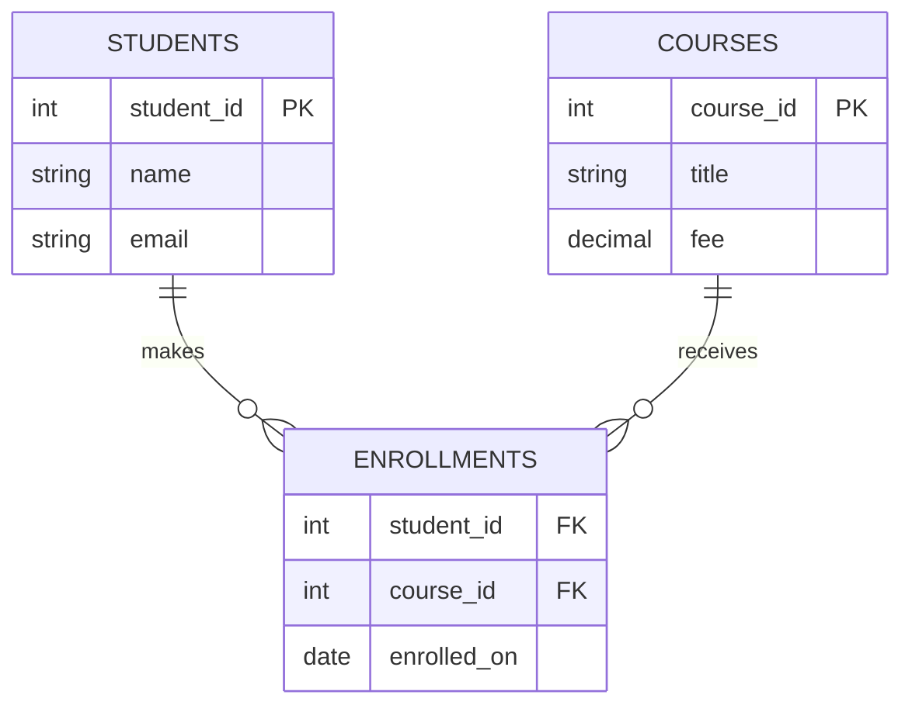

# 🗄️ Chapter 34: Database and SQL Fundamentals

> **BCA Web Technology — Beginner to Advanced**  
> Database ko samajhna full-stack development ki backbone ko samajhna hai.

---

## 🎯 Learning Objectives

Is chapter ke baad aap:

- database, DBMS aur RDBMS ka difference samjhenge;
- tables, rows, columns, schema aur relationships identify karenge;
- different keys aur constraints use kar payenge;
- SQL ki main categories aur basic commands likhenge;
- normalization se duplicate data kam karna samjhenge;
- transactions, ACID aur indexes ka purpose jaanenge;
- ek complete **College Database** design aur create karenge.

---

## 1. 📚 Database Kya Hai?

**Database** *(डे-टा-बेस)* related data ka organized collection hota hai, jise efficiently store, search, update aur manage kiya ja sakta hai.

Examples:

- college mein students, courses aur marks;
- bank mein customers, accounts aur transactions;
- e-commerce site mein products, users aur orders;
- hospital mein patients, doctors aur appointments.

Agar 10 students ka data ho to notebook ya spreadsheet chal sakti hai. Lekin lakhon records, multiple users, security, relationships aur fast searching ke liye proper database system chahiye.

> 💡 **Simple idea:** Database ek digital almirah hai; DBMS us almirah ko safely manage karne wala system hai.

---

## 2. 🧰 DBMS aur RDBMS

### 2.1 DBMS

**DBMS — Database Management System** *(मैनेजमेंट सिस्टम)* software hai jo database create, read, update, delete, secure aur recover karta hai.

Popular examples: MySQL, PostgreSQL, Oracle Database, Microsoft SQL Server aur SQLite.

### 2.2 RDBMS

**RDBMS — Relational Database Management System** data ko related **tables** mein organize karta hai. Tables ke beech connections keys se banaye jaate hain.

| Term | Meaning |
|---|---|
| Database | Organized data collection |
| DBMS | Database manage karne wala software |
| RDBMS | Tables aur relationships par based DBMS |
| SQL | Relational databases se communicate karne ki language |

### File System vs DBMS

| Feature | Normal Files | DBMS |
|---|---|---|
| Duplication | Zyada ho sakti hai | Control ki ja sakti hai |
| Searching | Manual/custom code | SQL queries |
| Relationships | Maintain karna difficult | Keys se managed |
| Multi-user access | Risky | Controlled concurrency |
| Security | Basic permissions | Users, roles, privileges |
| Backup/recovery | Mostly manual | Structured facilities |
| Integrity | Application par dependent | Constraints enforce karte hain |

---

## 3. 🧱 Relational Model

Relational database mein data tables mein hota hai.

### Example: `students` Table

| student_id | name | email | city |
|---:|---|---|---|
| 101 | Aditi | aditi@example.com | Delhi |
| 102 | Rahul | rahul@example.com | Jaipur |

Important terms:

- **Table / Relation:** related data ka structure.
- **Row / Record / Tuple** *(टपल)*: ek complete item, jaise ek student.
- **Column / Field / Attribute:** property, jaise `name`.
- **Domain:** column mein allowed values ka set/type.
- **Degree:** table mein columns ki count.
- **Cardinality** *(कार्डिनैलिटी)*: context ke anusaar rows ki count ya entities ke relationship ka ratio.

### Schema vs Instance

- **Schema** *(स्कीमा)*: database ka blueprint—tables, columns, types aur rules.
- **Instance:** kisi particular time par database mein stored actual data.

> 🧠 Ghar ka naksha = schema; ghar ke andar present furniture = instance.

---

## 4. 🔑 Database Keys

Keys records ko uniquely identify aur tables ko connect karti hain.

| Key | Explanation | Example |
|---|---|---|
| Super Key | Attributes ka koi set jo row uniquely identify kare | `student_id`, ya `student_id + name` |
| Candidate Key | Minimal super key | `student_id`, `email` |
| Primary Key | Chosen candidate key; unique and not null | `student_id` |
| Alternate Key | Candidate key jo primary nahi bani | `email` |
| Composite Key | Multiple columns ki combined key | `student_id + course_id` |
| Foreign Key | Dusri table ki key ko reference kare | `course_id` |
| Natural Key | Real-world meaningful key | Aadhaar/email, if suitable |
| Surrogate Key | System-created artificial key | auto-increment ID |

> ⚠️ Email badal sakta hai, isliye stable numeric surrogate ID often practical hoti hai. Sensitive identity numbers ko casually key banana privacy risk ho sakta hai.

---

## 5. 🛡️ Constraints aur Data Integrity

**Constraint** *(कन्स्ट्रेन्ट)* database rule hai jo invalid data ko rokta hai.

| Constraint | Purpose |
|---|---|
| `NOT NULL` | Value required hai |
| `UNIQUE` | Duplicate values allowed nahi |
| `PRIMARY KEY` | Unique row identity |
| `FOREIGN KEY` | Referenced row exist honi chahiye |
| `CHECK` | Condition true honi chahiye |
| `DEFAULT` | Value na mile to default use ho |
| Data type | Value ka permitted type/size |

### Integrity ke Types

1. **Entity Integrity:** primary key null ya duplicate nahi hoti.
2. **Referential Integrity:** foreign key valid parent row ko reference karti hai, ya allowed ho to null hoti hai.
3. **Domain Integrity:** values correct type, range aur format follow karti hain.

```sql
CREATE TABLE students (
    student_id INT PRIMARY KEY,
    name VARCHAR(100) NOT NULL,
    email VARCHAR(150) UNIQUE NOT NULL,
    age INT CHECK (age >= 16),
    city VARCHAR(50) DEFAULT 'Unknown'
);
```

---

## 6. 🔗 Relationships

### One-to-One (1:1)

Ek row ka maximum ek related row: ek user aur uski profile.

### One-to-Many (1:M)

Ek course mein many students enroll ho sakte hain. Parent table ki primary key child table mein foreign key banti hai.

### Many-to-Many (M:N)

Ek student many courses le sakta hai aur ek course mein many students ho sakte hain. Isko directly store nahi karte; beech mein **junction/bridge table** banate hain.



Symbols ka simple meaning:

- `||` = exactly one;
- `o{` = zero or many;
- enrollment junction table M:N relation ko two 1:M relations mein convert karti hai.

---

## 7. 🧮 Common SQL Data Types

Data types DBMS ke hisaab se slightly differ kar sakte hain.

| Type | Use | Example |
|---|---|---|
| `INT` | Whole numbers | 101 |
| `DECIMAL(10,2)` | Exact monetary values | 2499.50 |
| `VARCHAR(100)` | Variable-length text | "Web Technology" |
| `CHAR(2)` | Fixed-length text | "IN" |
| `TEXT` | Long text | Description |
| `DATE` | Calendar date | 2026-08-30 |
| `TIME` | Time | 14:30:00 |
| `DATETIME` / `TIMESTAMP` | Date and time | Created time |
| `BOOLEAN` | True/false concept | active |
| `BLOB` | Binary data | File bytes |

> 💡 Money ke liye floating-point ke badle `DECIMAL` prefer karein, kyunki exact precision important hoti hai.

---

## 8. 🗣️ SQL Kya Hai?

**SQL — Structured Query Language** *(स्ट्रक्चर्ड क्वेरी लैंग्वेज)* relational database ko define, query aur modify karne ke kaam aati hai.

### SQL Categories

| Category | Full Form | Common Commands |
|---|---|---|
| DDL | Data Definition Language | `CREATE`, `ALTER`, `DROP`, `TRUNCATE` |
| DML | Data Manipulation Language | `INSERT`, `UPDATE`, `DELETE` |
| DQL | Data Query Language (common teaching classification) | `SELECT` |
| DCL | Data Control Language | `GRANT`, `REVOKE` |
| TCL | Transaction Control Language | `COMMIT`, `ROLLBACK`, `SAVEPOINT` |

> Note: Exact classification terminology books aur database systems mein vary kar sakti hai, but commands ka purpose same rehta hai.

---

## 9. ✍️ Basic SQL Commands

### Create Database and Table

```sql
CREATE DATABASE college_db;

-- MySQL command:
USE college_db;

CREATE TABLE courses (
    course_id INT PRIMARY KEY,
    title VARCHAR(100) NOT NULL,
    duration_months INT CHECK (duration_months > 0),
    fee DECIMAL(10, 2) DEFAULT 0.00
);
```

### INSERT — New Rows

```sql
INSERT INTO courses (course_id, title, duration_months, fee)
VALUES
    (1, 'Web Technology', 6, 4500.00),
    (2, 'Database Systems', 5, 4000.00);
```

### SELECT — Read Data

```sql
SELECT course_id, title, fee
FROM courses
WHERE fee <= 4500
ORDER BY fee DESC
LIMIT 10;
```

Logical reading: table se columns lo → condition filter karo → order karo → result limit karo.

### UPDATE — Existing Data Change

```sql
UPDATE courses
SET fee = 4250.00
WHERE course_id = 2;
```

### DELETE — Rows Remove

```sql
DELETE FROM courses
WHERE course_id = 2;
```

> 🚨 `UPDATE` ya `DELETE` without `WHERE` sabhi rows ko affect kar sakta hai. Pehle same `WHERE` ke saath `SELECT` run karke rows verify karein.

### DELETE, TRUNCATE aur DROP

| Command | Kya remove hota hai? | Structure remains? |
|---|---|---|
| `DELETE` | Selected/all rows | Yes |
| `TRUNCATE` | All rows | Yes |
| `DROP TABLE` | Data + table definition | No |

Behavior, rollback aur identity-reset details DBMS ke according differ kar sakti hain.

---

## 10. ❓ NULL Ko Samjhein

`NULL` zero, empty string ya false nahi hai. Iska meaning hai value **missing, unknown, or not applicable**.

```sql
SELECT *
FROM students
WHERE city IS NULL;

SELECT *
FROM students
WHERE city IS NOT NULL;
```

Wrong pattern:

```sql
-- Incorrect:
WHERE city = NULL
```

SQL comparisons with `NULL` often **UNKNOWN** result deti hain. Isi wajah se `IS NULL` use hota hai.

---

## 11. 🧹 Normalization

**Normalization** *(नॉर्मलाइज़ेशन)* tables ko logically organize karne ki process hai, taaki duplication aur update anomalies kam hon.

### Unnormalized Design

| student_id | student_name | courses |
|---:|---|---|
| 101 | Aditi | HTML, SQL |

Ek cell mein multiple values querying ko difficult banati hain.

### 1NF — First Normal Form

- Har cell atomic/single value ho.
- Repeating groups na hon.
- Rows identifiable hon.

### 2NF — Second Normal Form

- Table 1NF mein ho.
- Composite key ka non-key attribute poori key par depend kare, sirf ek part par nahi.

Example: `enrollments(student_id, course_id, student_name, course_title)` mein `student_name` only `student_id` par aur `course_title` only `course_id` par depend karta hai. Unhe separate tables mein move karna chahiye.

### 3NF — Third Normal Form

- Table 2NF mein ho.
- Non-key attribute kisi dusre non-key attribute par depend na kare.

Agar `students(student_id, department_id, department_name)` hai, to `department_name`, `department_id` par depend karta hai. Separate `departments` table better hai.

### Normalized Result

- `students(student_id, name, email)`
- `courses(course_id, title, fee)`
- `enrollments(student_id, course_id, enrolled_on)`

> ⚖️ Normalization correctness improve karti hai. Advanced high-performance systems kabhi deliberate denormalization karte hain, lekin measurement aur clear reason ke saath.

---

## 12. 🔄 Transactions aur ACID

**Transaction** related operations ka logical unit hota hai: ya to poora successful ho, ya safely undo ho.

```sql
START TRANSACTION;

UPDATE accounts
SET balance = balance - 500
WHERE account_id = 1;

UPDATE accounts
SET balance = balance + 500
WHERE account_id = 2;

COMMIT;
-- Problem ho to: ROLLBACK;
```

### ACID Properties

- **Atomicity** *(एटॉमिसिटी)*: all operations or none.
- **Consistency**: rules before aur after transaction valid rahen.
- **Isolation** *(आइसोलेशन)*: concurrent transactions ek-doosre ko unsafe way mein interfere na karein.
- **Durability** *(ड्यूरेबिलिटी)*: committed change failure ke baad bhi survive kare.

> 🏦 Bank transfer ACID ka classic example hai: debit ho aur credit na ho, aisa nahi hona chahiye.

---

## 13. 🚀 Indexes

Index book ke index jaisa lookup structure hai jo searching ko faster bana sakta hai.

```sql
CREATE INDEX idx_students_email
ON students (email);
```

Benefits:

- `WHERE` filtering faster;
- joins aur sorting ko help mil sakti hai;
- primary/unique constraints commonly indexes use karte hain.

Trade-offs:

- extra storage;
- `INSERT`, `UPDATE`, `DELETE` par maintenance cost;
- har column par index banana useful nahi.

> 📌 Query pattern aur execution plan dekhkar index banayein, guess se nahi.

---

## 14. 🧪 Complete Practical: College Database

### Step 1: Database

```sql
CREATE DATABASE college_db;
USE college_db;
```

### Step 2: Tables

```sql
CREATE TABLE students (
    student_id INT PRIMARY KEY,
    name VARCHAR(100) NOT NULL,
    email VARCHAR(150) NOT NULL UNIQUE,
    city VARCHAR(60),
    admission_date DATE NOT NULL
);

CREATE TABLE courses (
    course_id INT PRIMARY KEY,
    title VARCHAR(100) NOT NULL UNIQUE,
    credits INT NOT NULL CHECK (credits BETWEEN 1 AND 10),
    fee DECIMAL(10, 2) NOT NULL CHECK (fee >= 0)
);

CREATE TABLE enrollments (
    student_id INT NOT NULL,
    course_id INT NOT NULL,
    enrolled_on DATE NOT NULL,
    marks DECIMAL(5, 2) CHECK (marks BETWEEN 0 AND 100),

    PRIMARY KEY (student_id, course_id),
    FOREIGN KEY (student_id)
        REFERENCES students(student_id),
    FOREIGN KEY (course_id)
        REFERENCES courses(course_id)
);
```

### Step 3: Sample Data

```sql
INSERT INTO students
(student_id, name, email, city, admission_date)
VALUES
(101, 'Aditi Sharma', 'aditi@example.com', 'Delhi', '2026-07-01'),
(102, 'Rahul Verma', 'rahul@example.com', 'Jaipur', '2026-07-02'),
(103, 'Neha Singh', 'neha@example.com', NULL, '2026-07-03');

INSERT INTO courses
(course_id, title, credits, fee)
VALUES
(1, 'Web Technology', 4, 4500.00),
(2, 'Database Systems', 4, 4000.00),
(3, 'Computer Networks', 3, 3500.00);

INSERT INTO enrollments
(student_id, course_id, enrolled_on, marks)
VALUES
(101, 1, '2026-07-10', 88.50),
(101, 2, '2026-07-10', 91.00),
(102, 1, '2026-07-11', 76.00),
(103, 3, '2026-07-12', NULL);
```

### Step 4: Useful Queries

```sql
-- All students
SELECT * FROM students;

-- Delhi students
SELECT name, email
FROM students
WHERE city = 'Delhi';

-- Fee range
SELECT title, fee
FROM courses
WHERE fee BETWEEN 3500 AND 4500
ORDER BY fee ASC;

-- Marks not entered yet
SELECT student_id, course_id
FROM enrollments
WHERE marks IS NULL;

-- Update marks
UPDATE enrollments
SET marks = 82.50
WHERE student_id = 103 AND course_id = 3;
```

### Expected Design Benefits

- student details only once stored;
- course details repeat nahi hoti;
- same student-course pair duplicate nahi ho sakta;
- invalid student/course enrollment foreign keys rok sakti hain;
- marks valid range mein rehte hain.

> 🔬 Practical tip: Apne DBMS mein commands run karein, tables inspect karein, intentional duplicate email insert karke constraint error observe karein.

---

## 15. 🔐 Security aur Reliability Basics

- User input ko SQL string mein concatenate na karein; **parameterized queries/prepared statements** use karein.
- Application account ko minimum required privileges dein.
- Passwords ko plain text mein store na karein; secure password hashing use karein.
- Regular automated backups lein aur restore practice karein.
- Sensitive data encrypt aur access-log karein.
- Production data ko public repository mein commit na karein.
- Schema changes ko migrations/version control se track karein.

```php
// Concept preview: parameterized query
$stmt = $pdo->prepare(
    'SELECT * FROM students WHERE email = ?'
);
$stmt->execute([$email]);
```

---

## 16. ⚠️ Common Mistakes

| Mistake | Better Approach |
|---|---|
| Har value ko `VARCHAR` banana | Correct data type choose karein |
| Primary key na rakhna | Stable unique identity define karein |
| Comma-separated IDs store karna | Junction table use karein |
| Duplicate details multiple tables mein | Normalize karein |
| `= NULL` use karna | `IS NULL` use karein |
| Money ke liye approximate float | `DECIMAL` consider karein |
| Unsafe UPDATE/DELETE | Transaction, backup aur verified WHERE |
| SQL concatenate karna | Prepared statements |
| Har column index karna | Actual query needs measure karein |

---

## 17. ✅ Best-Practice Checklist

- [ ] Meaningful plural/singular naming convention consistently follow ki?
- [ ] Har table ki primary key hai?
- [ ] Relationships foreign keys se defined hain?
- [ ] Correct types, sizes aur constraints choose kiye?
- [ ] M:N relation ke liye junction table hai?
- [ ] Repeated data normalize kiya?
- [ ] Nullable columns intentionally chosen hain?
- [ ] Dangerous query se pehle backup/transaction hai?
- [ ] Application queries parameterized hain?
- [ ] Backup restore test hua hai?

---

## 18. 🧾 Chapter Summary

- Database organized related data hai; DBMS usko manage karta hai.
- RDBMS data ko tables aur relationships mein organize karta hai.
- Primary keys unique identity aur foreign keys relationships/integrity deti hain.
- Constraints invalid data ko database level par rok sakti hain.
- SQL se structure create aur data insert, read, update, delete hota hai.
- `NULL` unknown/missing value ko represent karta hai.
- Normalization duplication aur anomalies kam karti hai.
- Transactions ACID properties se reliable operations support karti hain.
- Index read performance improve kar sakta hai, lekin write/storage cost hoti hai.
- Secure apps prepared statements, least privilege aur tested backups use karti hain.

---

## 19. 📝 MCQs

1. RDBMS data ko mainly kis form mein organize karta hai?  
   A. Videos  B. Tables  C. Threads  D. Pixels

2. Kaunsi key row ko uniquely identify karti hai?  
   A. Foreign key  B. Primary key  C. Sort key  D. Null key

3. Many-to-many relationship ko normally kaise implement karte hain?  
   A. CSS Grid  B. Junction table  C. Cookie  D. Folder

4. Missing value check karne ka correct syntax kya hai?  
   A. `= NULL`  B. `IS NULL`  C. `== NULL`  D. `NULL()`

5. Transaction ko permanent karne ka command hai:  
   A. `ROLLBACK`  B. `SELECT`  C. `COMMIT`  D. `DROP`

6. Third Normal Form primarily kis dependency ko remove karti hai?  
   A. Transitive dependency  B. Internet dependency  C. CSS dependency  D. File extension

7. SQL injection risk ko reduce karne ka best choice hai:  
   A. More indexes  B. Prepared statements  C. Longer table names  D. Comments

**Answers:** 1-B, 2-B, 3-B, 4-B, 5-C, 6-A, 7-B

---

## 20. ✏️ Fill in the Blanks

1. Table ki ek complete entry ko ______ kehte hain.
2. Dusri table ki primary key ko reference karne wali key ______ hai.
3. All-or-nothing transaction property ______ hai.
4. Query result ko sort karne ke liye ______ clause use hota hai.
5. Duplicate values prevent karne wala constraint ______ hai.

**Answers:** 1. row/record/tuple, 2. foreign key, 3. Atomicity, 4. `ORDER BY`, 5. `UNIQUE`

---

## 21. ✔️ True or False

1. `NULL` aur zero same hain. — **False**
2. Composite key multiple columns se ban sakti hai. — **True**
3. Foreign key referential integrity support karti hai. — **True**
4. Index ki koi storage ya write cost nahi hoti. — **False**
5. `DELETE` without `WHERE` all rows delete kar sakta hai. — **True**

---

## 22. 🎤 Viva Questions

1. Database aur DBMS mein difference kya hai?
2. RDBMS ko relational kyun kehte hain?
3. Schema aur instance explain karein.
4. Candidate key aur primary key mein kya relation hai?
5. Composite key kab use hoti hai?
6. Foreign key kya guarantee karti hai?
7. 1:M aur M:N relationship mein difference kya hai?
8. `NULL` ko `=` se compare kyun nahi karte?
9. 1NF, 2NF aur 3NF short mein explain karein.
10. ACID properties kya hain?
11. Index ka benefit aur cost kya hai?
12. SQL injection kya hai aur ise kaise prevent karte hain?

---

## 23. 🧪 Practical Exercises

### Beginner

1. `library_db` create karein.
2. `books` table banayein: ID, title, author, price, published date.
3. Five books insert karke price ke descending order mein display karein.
4. `NULL` author wale records find karein.

### Intermediate

5. `members` aur `borrowings` tables foreign keys ke saath banayein.
6. Duplicate borrowing rokne ke liye suitable composite key choose karein.
7. Price update aur selected book delete query likhein.
8. Constraints deliberately violate karke errors note karein.

### Advanced

9. Ek unnormalized order sheet ko 3NF tak convert karein.
10. Student-course ER diagram banakar SQL schema implement karein.
11. Transaction mein do related balance updates run karein aur rollback test karein.
12. Common search column par index create karke `EXPLAIN` output compare karein.

---

## 24. 📖 Exam-Oriented Questions

### Short Answer

1. DBMS ke four advantages likhiye.
2. Domain integrity define kijiye.
3. Primary aur foreign key ka difference likhiye.
4. DDL aur DML examples ke saath samjhaiye.
5. `DELETE`, `TRUNCATE` aur `DROP` compare kijiye.

### Long Answer

1. Relational database model ko suitable example aur diagram ke saath explain kijiye.
2. Database keys ke types examples ke saath describe kijiye.
3. Normalization ko 1NF, 2NF aur 3NF examples ke saath explain kijiye.
4. Transaction aur ACID properties ko bank-transfer example se samjhaiye.
5. College database ka normalized schema design karke SQL commands likhiye.

---

## 25. 🔁 One-Minute Revision

```text
Database → organized data
DBMS → database manager
RDBMS → related tables
Row → one record
Column → one attribute
Primary Key → unique identity
Foreign Key → table connection
Constraint → data rule
SQL → database language
Normalization → reduced redundancy
Transaction → logical work unit
ACID → reliable transaction properties
Index → faster lookup, extra cost
```

---

## 26. 🔗 Official References

- [MySQL Tutorial](https://dev.mysql.com/doc/refman/en/tutorial.html)
- [MySQL CREATE TABLE Statement](https://dev.mysql.com/doc/refman/en/create-table.html)
- [PostgreSQL SQL Language Tutorial](https://www.postgresql.org/docs/current/tutorial-sql.html)
- [PostgreSQL Constraints](https://www.postgresql.org/docs/current/ddl-constraints.html)

---

[⬅️ Previous Chapter](33-object-oriented-php.md) · [📚 Table of Contents](../SUMMARY.md) · **Next: MySQL: Tables and CRUD Operations ➡️**
