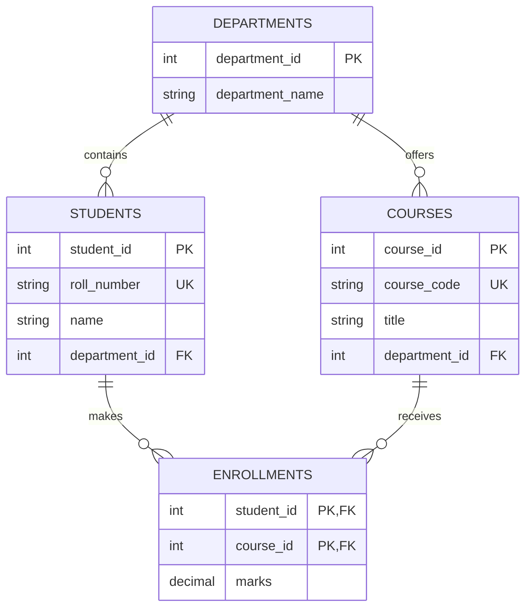

# 🔗 Chapter 36: Joins, Keys and Relationships

> **BCA Web Technology — Beginner to Advanced**  
> Related tables ko meaningful information mein combine karna is chapter ka main goal hai.

---

## 🎯 Learning Objectives

Is chapter ke baad aap:

- database keys ko identify aur correctly use karenge;
- one-to-one, one-to-many aur many-to-many relationships design karenge;
- `INNER`, `LEFT`, `RIGHT`, `CROSS` aur self join likhenge;
- multiple tables ko aliases aur conditions ke saath join karenge;
- foreign-key actions samjhenge;
- duplicate rows, missing matches aur Cartesian product जैसी problems solve karenge;
- complete College Result System ki relational queries bana payenge.

---

## 1. 🧩 Related Tables Ki Zaroorat

Ek hi giant table mein student, department, course aur marks store karne se data repeatedly save hota hai.

| student | department | department_phone | course | marks |
|---|---|---|---|---:|
| Aditi | Computer Applications | 011-4001 | Web Technology | 88 |
| Aditi | Computer Applications | 011-4001 | Database Systems | 91 |

Is design mein student aur department details repeat ho rahi hain. Better design:

- `students` — student details;
- `departments` — department details;
- `courses` — course details;
- `enrollments` — student-course relationship aur marks.

**JOIN** *(जॉइन)* related columns ke basis par in tables ka data combine karta hai.

---

## 2. 🔑 Keys Ka Quick Review

| Key | Purpose | Example |
|---|---|---|
| Primary Key | Row ki unique identity | `student_id` |
| Foreign Key | Dusri table se relation | `department_id` |
| Candidate Key | Primary banne layak minimal unique key | `email` |
| Alternate Key | Unselected candidate key | `roll_number` |
| Composite Key | Multiple columns se identity | `student_id, course_id` |
| Surrogate Key | Artificial/system ID | Auto-increment ID |
| Natural Key | Real-world meaningful value | Course code |

### Primary Key Rules

- unique hoti hai;
- `NULL` nahi ho sakti;
- table mein ek primary-key constraint hota hai;
- primary key single ya multiple columns ki ho sakti hai.

```sql
CREATE TABLE departments (
    department_id INT UNSIGNED AUTO_INCREMENT,
    department_name VARCHAR(100) NOT NULL UNIQUE,
    PRIMARY KEY (department_id)
);
```

### Composite Primary Key

```sql
CREATE TABLE enrollments (
    student_id INT UNSIGNED NOT NULL,
    course_id INT UNSIGNED NOT NULL,
    enrolled_on DATE NOT NULL,
    marks DECIMAL(5, 2),

    PRIMARY KEY (student_id, course_id)
);
```

Yeh same student ko same course mein duplicate enrollment se rokta hai.

---

## 3. 🛡️ Foreign Key aur Referential Integrity

Foreign key child table ke value ko parent table ki existing key se connect karti hai.

```sql
CREATE TABLE students (
    student_id INT UNSIGNED AUTO_INCREMENT PRIMARY KEY,
    name VARCHAR(100) NOT NULL,
    department_id INT UNSIGNED NOT NULL,

    CONSTRAINT fk_student_department
        FOREIGN KEY (department_id)
        REFERENCES departments(department_id)
);
```

Ab invalid `department_id` wala student insert nahi kiya ja sakta.

### Foreign-Key Actions

Parent row update/delete hone par behavior define kiya ja sakta hai:

| Action | Meaning |
|---|---|
| `RESTRICT` / `NO ACTION` | Referenced parent change/delete block |
| `CASCADE` | Change child rows tak propagate |
| `SET NULL` | Child foreign key null |
| `SET DEFAULT` | Standard SQL action; MySQL/InnoDB support verify karein |

```sql
FOREIGN KEY (department_id)
REFERENCES departments(department_id)
ON UPDATE CASCADE
ON DELETE RESTRICT
```

> ⚠️ `ON DELETE CASCADE` useful hai, lekin galat parent deletion se large child data bhi delete ho sakta hai. Business rule samajhkar choose karein.

`SET NULL` ke liye child column nullable hona chahiye.

---

## 4. 🔗 Relationship Types

### 4.1 One-to-One — 1:1

Ek student ka ek student profile.

```sql
CREATE TABLE student_profiles (
    student_id INT UNSIGNED PRIMARY KEY,
    address TEXT,
    guardian_name VARCHAR(100),

    FOREIGN KEY (student_id)
        REFERENCES students(student_id)
        ON DELETE CASCADE
);
```

Foreign key par `PRIMARY KEY`/`UNIQUE` one-to-one rule enforce karta hai.

### 4.2 One-to-Many — 1:M

Ek department mein many students, par ek student ek department mein.

Foreign key many-side yani `students` table mein hoti hai.

### 4.3 Many-to-Many — M:N

Ek student many courses aur ek course many students se related ho sakta hai.

Direct M:N relation ko junction table se resolve karte hain:

```sql
CREATE TABLE enrollments (
    student_id INT UNSIGNED NOT NULL,
    course_id INT UNSIGNED NOT NULL,
    enrolled_on DATE NOT NULL,
    marks DECIMAL(5, 2),

    PRIMARY KEY (student_id, course_id),
    FOREIGN KEY (student_id)
        REFERENCES students(student_id)
        ON DELETE CASCADE,
    FOREIGN KEY (course_id)
        REFERENCES courses(course_id)
        ON DELETE RESTRICT
);
```

---

## 5. 🗺️ College Database ER Diagram

**ER — Entity Relationship** *(एंटिटी रिलेशनशिप)* diagram database entities aur connections dikhata hai.



- `||` means exactly one;
- `o{` means zero or many;
- `PK` primary key;
- `FK` foreign key;
- `UK` unique key.

---

## 6. 🤝 JOIN Ka Basic Syntax

```sql
SELECT columns
FROM table_one AS a
JOIN table_two AS b
    ON a.related_column = b.related_column;
```

- `ON` batata hai rows kaise match hongi;
- aliases जैसे `s`, `d` query short aur clear banate hain;
- same-name columns ko `table.column` se qualify karein.

Example:

```sql
SELECT
    s.name,
    d.department_name
FROM students AS s
JOIN departments AS d
    ON s.department_id = d.department_id;
```

---

## 7. 🎯 INNER JOIN

`INNER JOIN` sirf matching rows return karta hai.

```sql
SELECT
    s.roll_number,
    s.name,
    d.department_name
FROM students AS s
INNER JOIN departments AS d
    ON s.department_id = d.department_id;
```

`JOIN` alone commonly `INNER JOIN` ke equivalent hota hai.

### Result Idea

| Student has matching department? | Returned? |
|---|---|
| Yes | ✅ |
| No | ❌ |

> 💡 Jab only valid matches chahiye, `INNER JOIN` use karein.

---

## 8. ⬅️ LEFT JOIN

`LEFT JOIN` left table ki sab rows aur right table ki matching rows return karta hai. Match na mile to right-side columns `NULL` hote hain.

```sql
SELECT
    s.name,
    e.course_id,
    e.marks
FROM students AS s
LEFT JOIN enrollments AS e
    ON s.student_id = e.student_id;
```

Isse unenrolled students bhi output mein aayenge.

### Unmatched Rows Find Karna

```sql
SELECT
    s.student_id,
    s.name
FROM students AS s
LEFT JOIN enrollments AS e
    ON s.student_id = e.student_id
WHERE e.student_id IS NULL;
```

Yeh **anti-join pattern** hai: students jinka enrollment nahi hai.

---

## 9. ➡️ RIGHT JOIN

`RIGHT JOIN` right table ki sab rows aur left table ke matches return karta hai.

```sql
SELECT
    e.student_id,
    c.title
FROM enrollments AS e
RIGHT JOIN courses AS c
    ON e.course_id = c.course_id;
```

Courses without enrollment bhi result mein rahenge.

> 📌 Readability ke liye same query ko tables reverse karke `LEFT JOIN` se likhna often easier hota hai.

```sql
SELECT
    e.student_id,
    c.title
FROM courses AS c
LEFT JOIN enrollments AS e
    ON c.course_id = e.course_id;
```

---

## 10. ❌ FULL OUTER JOIN aur MySQL

`FULL OUTER JOIN` dono tables ki all rows—matched aur unmatched—return karta hai. MySQL direct `FULL OUTER JOIN` syntax support nahi karta.

Simple emulation:

```sql
SELECT a.id, a.name, b.value
FROM table_a AS a
LEFT JOIN table_b AS b ON a.id = b.id

UNION

SELECT b.id, a.name, b.value
FROM table_a AS a
RIGHT JOIN table_b AS b ON a.id = b.id;
```

`UNION` duplicate result rows remove karta hai. Complex cases mein requirements aur duplicate semantics carefully test karein.

---

## 11. ✖️ CROSS JOIN

`CROSS JOIN` first table ki every row ko second table ki every row se combine karta hai.

```sql
SELECT
    s.name,
    c.title
FROM students AS s
CROSS JOIN courses AS c;
```

Agar 4 students aur 3 courses hain, result mein `4 × 3 = 12` rows hongi.

Useful cases:

- all possible combinations;
- schedules or size-color combinations;
- test data.

> 🚨 Large tables ka accidental cross join huge result bana sakta hai.

---

## 12. 🪞 SELF JOIN

Jab table ko khud se join karte hain, use **self join** kehte hain.

Employee-manager example:

```sql
CREATE TABLE employees (
    employee_id INT PRIMARY KEY,
    employee_name VARCHAR(100) NOT NULL,
    manager_id INT NULL,
    FOREIGN KEY (manager_id)
        REFERENCES employees(employee_id)
);
```

```sql
SELECT
    e.employee_name AS employee,
    m.employee_name AS manager
FROM employees AS e
LEFT JOIN employees AS m
    ON e.manager_id = m.employee_id;
```

Aliases compulsory jaise hain, kyunki same table two roles mein use ho rahi hai.

---

## 13. 🔗 Multiple-Table JOIN

Student, course aur marks ek saath:

```sql
SELECT
    s.roll_number,
    s.name,
    c.course_code,
    c.title,
    e.marks
FROM enrollments AS e
INNER JOIN students AS s
    ON e.student_id = s.student_id
INNER JOIN courses AS c
    ON e.course_id = c.course_id
ORDER BY s.name, c.title;
```

Join chain ko relationship path follow karna chahiye:

`enrollments → students` aur `enrollments → courses`.

---

## 14. 🎛️ ON vs WHERE

`ON` join matching define karta hai. `WHERE` joined result filter karta hai.

### Correct LEFT JOIN Filter

Active course matches chahiye, lekin all students retain karne hain:

```sql
SELECT s.name, c.title
FROM students AS s
LEFT JOIN enrollments AS e
    ON s.student_id = e.student_id
LEFT JOIN courses AS c
    ON e.course_id = c.course_id
   AND c.active = TRUE;
```

Agar right-table condition `WHERE c.active = TRUE` mein rakhenge, unmatched `NULL` rows remove ho sakti hain aur result inner join jaisa behave kar sakta hai.

> 🧠 Outer join mein condition placement result ko materially change kar sakti hai.

---

## 15. 🧮 JOIN Ke Saath Aggregation

### Student-wise Course Count

```sql
SELECT
    s.student_id,
    s.name,
    COUNT(e.course_id) AS total_courses
FROM students AS s
LEFT JOIN enrollments AS e
    ON s.student_id = e.student_id
GROUP BY s.student_id, s.name
ORDER BY total_courses DESC;
```

`COUNT(e.course_id)` unmatched rows ke `NULL` ko count nahi karta, isliye zero enrollment correctly show ho sakta hai.

### Course-wise Average Marks

```sql
SELECT
    c.course_code,
    c.title,
    ROUND(AVG(e.marks), 2) AS average_marks
FROM courses AS c
LEFT JOIN enrollments AS e
    ON c.course_id = e.course_id
GROUP BY c.course_id, c.course_code, c.title
ORDER BY average_marks DESC;
```

---

## 16. 🔁 UNION aur JOIN Mein Difference

| JOIN | UNION |
|---|---|
| Tables ko horizontally combine karta hai | Query results ko vertically combine karta hai |
| Related columns par match | Compatible column count/types needed |
| Columns increase ho sakte hain | Rows increase hote hain |
| `ON` condition common | Separate `SELECT` statements |

```sql
SELECT name, email, 'student' AS role
FROM students
UNION ALL
SELECT teacher_name, email, 'teacher' AS role
FROM teachers;
```

- `UNION` duplicates remove karta hai;
- `UNION ALL` duplicates retain karta hai aur often less work karta hai.

---

## 17. ⚡ Join Performance Basics

Indexes join searches ko faster bana sakte hain.

```sql
CREATE INDEX idx_students_department
ON students (department_id);

CREATE INDEX idx_courses_department
ON courses (department_id);
```

Foreign-key columns par useful indexes confirm karein. Query plan inspect karein:

```sql
EXPLAIN
SELECT s.name, d.department_name
FROM students AS s
JOIN departments AS d
    ON s.department_id = d.department_id;
```

### Performance Tips

- related columns ke compatible data types rakhein;
- join/filter columns par suitable indexes evaluate karein;
- needed columns hi select karein;
- accidental Cartesian product avoid karein;
- large result par filtering/pagination karein;
- query plan aur real timings measure karein.

---

## 18. 🧪 Complete Practical: College Result System

### Step 1: Database and Tables

```sql
CREATE DATABASE IF NOT EXISTS college_result;
USE college_result;

CREATE TABLE departments (
    department_id INT UNSIGNED AUTO_INCREMENT PRIMARY KEY,
    department_name VARCHAR(100) NOT NULL UNIQUE
);

CREATE TABLE students (
    student_id INT UNSIGNED AUTO_INCREMENT PRIMARY KEY,
    roll_number VARCHAR(20) NOT NULL UNIQUE,
    name VARCHAR(100) NOT NULL,
    department_id INT UNSIGNED NOT NULL,
    FOREIGN KEY (department_id)
        REFERENCES departments(department_id)
        ON DELETE RESTRICT
);

CREATE TABLE courses (
    course_id INT UNSIGNED AUTO_INCREMENT PRIMARY KEY,
    course_code VARCHAR(20) NOT NULL UNIQUE,
    title VARCHAR(100) NOT NULL,
    department_id INT UNSIGNED NOT NULL,
    active BOOLEAN NOT NULL DEFAULT TRUE,
    FOREIGN KEY (department_id)
        REFERENCES departments(department_id)
);

CREATE TABLE enrollments (
    student_id INT UNSIGNED NOT NULL,
    course_id INT UNSIGNED NOT NULL,
    semester TINYINT UNSIGNED NOT NULL,
    marks DECIMAL(5, 2),
    PRIMARY KEY (student_id, course_id),
    CHECK (semester BETWEEN 1 AND 8),
    CHECK (marks IS NULL OR marks BETWEEN 0 AND 100),
    FOREIGN KEY (student_id)
        REFERENCES students(student_id)
        ON DELETE CASCADE,
    FOREIGN KEY (course_id)
        REFERENCES courses(course_id)
        ON DELETE RESTRICT
);
```

### Step 2: Sample Data

```sql
INSERT INTO departments (department_name)
VALUES ('Computer Applications'), ('Commerce');

INSERT INTO students
(roll_number, name, department_id)
VALUES
('BCA-101', 'Aditi Sharma', 1),
('BCA-102', 'Rahul Verma', 1),
('BCA-103', 'Neha Singh', 1),
('BCOM-101', 'Aman Gupta', 2);

INSERT INTO courses
(course_code, title, department_id)
VALUES
('BCA-WT', 'Web Technology', 1),
('BCA-DB', 'Database Systems', 1),
('BCOM-AC', 'Accounting', 2),
('BCA-CN', 'Computer Networks', 1);

INSERT INTO enrollments
(student_id, course_id, semester, marks)
VALUES
(1, 1, 5, 88.50),
(1, 2, 5, 91.00),
(2, 1, 5, 76.00),
(3, 2, 5, NULL),
(4, 3, 1, 82.00);
```

### Step 3: Student and Department

```sql
SELECT
    s.roll_number,
    s.name,
    d.department_name
FROM students AS s
JOIN departments AS d
    ON s.department_id = d.department_id
ORDER BY d.department_name, s.name;
```

### Step 4: Complete Result Report

```sql
SELECT
    s.roll_number,
    s.name,
    c.course_code,
    c.title,
    e.semester,
    e.marks,
    CASE
        WHEN e.marks IS NULL THEN 'Pending'
        WHEN e.marks >= 40 THEN 'Pass'
        ELSE 'Fail'
    END AS result
FROM enrollments AS e
JOIN students AS s
    ON e.student_id = s.student_id
JOIN courses AS c
    ON e.course_id = c.course_id
ORDER BY s.roll_number, c.course_code;
```

### Step 5: Students Without Enrollment

```sql
SELECT s.roll_number, s.name
FROM students AS s
LEFT JOIN enrollments AS e
    ON s.student_id = e.student_id
WHERE e.student_id IS NULL;
```

### Step 6: Courses Without Students

```sql
SELECT c.course_code, c.title
FROM courses AS c
LEFT JOIN enrollments AS e
    ON c.course_id = e.course_id
WHERE e.course_id IS NULL;
```

Is sample mein Computer Networks return hoga.

### Step 7: Department Summary

```sql
SELECT
    d.department_name,
    COUNT(DISTINCT s.student_id) AS total_students,
    COUNT(e.course_id) AS total_enrollments,
    ROUND(AVG(e.marks), 2) AS average_marks
FROM departments AS d
LEFT JOIN students AS s
    ON d.department_id = s.department_id
LEFT JOIN enrollments AS e
    ON s.student_id = e.student_id
GROUP BY d.department_id, d.department_name
ORDER BY d.department_name;
```

`DISTINCT` yahan same student ke multiple enrollments ki wajah se student count repeat hone se rokta hai.

---

## 19. 🐞 Common JOIN Mistakes

| Mistake | Problem | Fix |
|---|---|---|
| `ON` condition missing | Cartesian product | Relationship condition add karein |
| Wrong columns match | Incorrect results | PK–FK mapping verify karein |
| Ambiguous column | Same column name multiple tables | Alias se qualify karein |
| `LEFT JOIN` filter in `WHERE` | Unmatched rows disappear | Right-side condition `ON` mein consider karein |
| One-to-many duplication ignore | Parent row repeated | Expected cardinality samjhein |
| `COUNT(*)` with left join | Unmatched parent bhi 1 count | Child key count karein |
| Different key types | Errors/slow joins | Compatible types use karein |
| `CASCADE` blindly use | Unexpected mass deletion | Business rule evaluate karein |

---

## 20. ✅ Best-Practice Checklist

- [ ] Har entity ki stable primary key hai?
- [ ] Foreign-key column ka type referenced key se compatible hai?
- [ ] One-to-one relation par uniqueness enforce hai?
- [ ] Many-to-many ke liye junction table hai?
- [ ] Junction table duplicate relation rokta hai?
- [ ] Join conditions correct PK–FK columns par hain?
- [ ] Outer join filters correct place par hain?
- [ ] Required columns hi selected hain?
- [ ] Join/filter columns ke indexes evaluate kiye?
- [ ] Cascade actions deliberately choose kiye?

---

## 21. 🧾 Chapter Summary

- Keys rows identify aur tables connect karti hain.
- Foreign keys referential integrity enforce karti hain.
- Relationships 1:1, 1:M aur M:N ho sakte hain.
- M:N relationship junction table se resolve hota hai.
- `INNER JOIN` only matches return karta hai.
- `LEFT`/`RIGHT JOIN` preserved side ki unmatched rows bhi return karte hain.
- MySQL direct `FULL OUTER JOIN` support nahi karta.
- `CROSS JOIN` all combinations aur self join same table ke roles connect karta hai.
- `ON` matching aur `WHERE` result filtering ke liye hota hai.
- Indexes aur `EXPLAIN` join performance analyze karne mein help karte hain.

---

## 22. 📝 MCQs

1. Sirf matching rows kaunsa join return karta hai?  
   A. Cross  B. Inner  C. Left  D. Self

2. Left table ki all rows chahiye to kaunsa join use hoga?  
   A. Left join  B. Inner join  C. Union  D. Drop

3. M:N relationship ko resolve karta hai:  
   A. CSS table  B. Junction table  C. Cookie  D. Index only

4. Foreign key ka main purpose hai:  
   A. Text format  B. Referential integrity  C. Sorting only  D. Backup

5. All possible row combinations kaunsa join deta hai?  
   A. Self  B. Inner  C. Cross  D. Left

6. MySQL direct kaunsa join support nahi karta?  
   A. Inner  B. Left  C. Right  D. Full outer

7. Query execution plan dekhne ka command hai:  
   A. `EXPLAIN`  B. `DESCRIBE USER`  C. `PRINT`  D. `PLAN`

**Answers:** 1-B, 2-A, 3-B, 4-B, 5-C, 6-D, 7-A

---

## 23. ✏️ Fill in the Blanks

1. Table ki unique row identity ______ key hoti hai.
2. Child table ko parent se connect karne wali key ______ key hai.
3. Same table ko khud se join karna ______ join hai.
4. Join matching condition ______ clause mein likhte hain.
5. Two query results vertically combine karne ke liye ______ use hota hai.

**Answers:** 1. primary, 2. foreign, 3. self, 4. `ON`, 5. `UNION`

---

## 24. ✔️ True or False

1. Primary key `NULL` ho sakti hai. — **False**
2. Junction table M:N relationship resolve karti hai. — **True**
3. `LEFT JOIN` only matching rows return karta hai. — **False**
4. Cross join ka result rows ka product ho sakta hai. — **True**
5. `ON DELETE CASCADE` ko bina business rule samjhe use karna safe hai. — **False**

---

## 25. 🎤 Viva Questions

1. Primary aur foreign key mein difference kya hai?
2. Composite key kab use karte hain?
3. Referential integrity explain karein.
4. 1:1 relation database mein kaise enforce hota hai?
5. Junction table kya hoti hai?
6. Inner aur left join compare karein.
7. Right join ko left join mein kaise rewrite karenge?
8. MySQL mein full outer join ka alternative kya hai?
9. Self join ka real-world example dein.
10. `ON` aur `WHERE` mein difference kya hai?
11. Cartesian product kya hai?
12. Left join ke saath `COUNT(child_id)` kyun useful hai?

---

## 26. 🧪 Practical Exercises

### Beginner

1. `authors` aur `books` tables ke beech 1:M relation banayein.
2. Inner join se books ke saath author names dikhayein.
3. Left join se authors without books find karein.
4. Cross join se students aur available clubs ke combinations banayein.

### Intermediate

5. `orders`, `products` aur `order_items` se M:N design banayein.
6. Order total calculate karne ke liye three-table join likhein.
7. Product without orders find karein.
8. Employee-manager self join implement karein.

### Advanced

9. College ER diagram ko MySQL schema mein implement karein.
10. Department-wise distinct student count aur average marks nikalein.
11. Foreign-key actions ko test database mein demonstrate karein.
12. Large join par indexes add karke `EXPLAIN` compare karein.

---

## 27. 📖 Exam-Oriented Questions

### Short Answer

1. Database keys ke types likhiye.
2. Referential integrity define kijiye.
3. Inner aur outer join mein difference likhiye.
4. Self join aur cross join explain kijiye.
5. `UNION` aur `JOIN` compare kijiye.

### Long Answer

1. Relationships ke types suitable ER diagram ke saath explain kijiye.
2. SQL joins ko tables, queries aur expected results ke saath samjhaiye.
3. Many-to-many relationship ko junction table se implement kijiye.
4. Foreign-key actions aur unke risks explain kijiye.
5. College Result System ka schema aur multi-table report query likhiye.

---

## 28. 🔁 One-Minute Revision

```text
Primary Key → unique row identity
Foreign Key → parent-child connection
1:1 → one with one
1:M → one with many
M:N → junction table
INNER JOIN → matching rows
LEFT JOIN → all left + matches
RIGHT JOIN → all right + matches
CROSS JOIN → all combinations
SELF JOIN → table joined with itself
ON → matching rule
WHERE → result filter
UNION → results vertically combine
EXPLAIN → query plan
```

---

## 29. 🔗 Official References

- [MySQL JOIN Clause](https://dev.mysql.com/doc/refman/en/join.html)
- [MySQL Foreign Key Constraints](https://dev.mysql.com/doc/refman/en/create-table-foreign-keys.html)
- [MySQL UNION Clause](https://dev.mysql.com/doc/refman/en/union.html)
- [MySQL EXPLAIN Statement](https://dev.mysql.com/doc/refman/en/explain.html)

---

[⬅️ Previous Chapter](35-mysql-tables-and-crud-operations.md) · [📚 Table of Contents](../SUMMARY.md) · **Next: Connecting PHP with MySQL ➡️**
