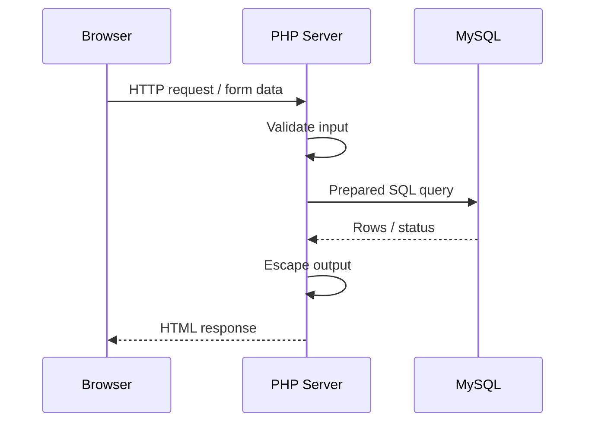

# 🔌 Chapter 37: Connecting PHP with MySQL

> **BCA Web Technology — Beginner to Advanced**  
> Ab PHP form data ko MySQL database mein safely store, read, update aur delete karenge.

---

## 🎯 Learning Objectives

Is chapter ke baad aap:

- PHP–MySQL request flow samjhenge;
- PDO aur MySQLi ka difference jaanenge;
- secure database connection bana payenge;
- prepared statements ke saath CRUD operations karenge;
- database results ko HTML mein safely display karenge;
- validation, exceptions aur transactions handle karenge;
- ek complete Student CRUD practical implement karenge.

---

## 1. 🌐 PHP aur MySQL Saath Kaise Kaam Karte Hain?

PHP server-side language hai aur MySQL database system. Browser directly MySQL se connect nahi karta.



Typical flow:

1. User form submit karta hai.
2. PHP input receive aur validate karta hai.
3. PHP database connection use karta hai.
4. Prepared SQL statement execute hota hai.
5. MySQL result PHP ko deta hai.
6. PHP safe HTML response browser ko bhejta hai.

> 🔐 Browser ko database password kabhi nahi milna chahiye.

---

## 2. 🧰 Required Setup

Local practice ke liye aapko chahiye:

- PHP;
- MySQL Server;
- web server such as Apache;
- PHP extension: `pdo_mysql` ya `mysqli`;
- code editor aur browser.

XAMPP, WAMP ya Laragon jaise local packages setup easy bana sakte hain.

### Extension Check

```php
<?php
echo extension_loaded('pdo_mysql')
    ? 'PDO MySQL available'
    : 'PDO MySQL missing';
```

Command line check:

```bash
php -m
```

---

## 3. ⚖️ PDO vs MySQLi

PHP mein MySQL connection ke two common APIs hain:

| Feature | PDO | MySQLi |
|---|---|---|
| Full Form | PHP Data Objects | MySQL Improved |
| Database support | Multiple drivers | MySQL only |
| Style | Object-oriented | Object-oriented + procedural |
| Named placeholders | Yes | No |
| Prepared statements | Yes | Yes |
| Transactions | Yes | Yes |

Is chapter mein main examples **PDO** se hain, kyunki interface clean aur portable hai. MySQLi bhi valid option hai.

> 🗣️ PDO pronunciation: **पी-डी-ओ**. MySQLi: **माई-एस-क्यू-एल-आई**.

---

## 4. 🗃️ Practice Database

MySQL mein yeh schema create karein:

```sql
CREATE DATABASE IF NOT EXISTS college_app
CHARACTER SET utf8mb4
COLLATE utf8mb4_unicode_ci;

USE college_app;

CREATE TABLE students (
    student_id INT UNSIGNED AUTO_INCREMENT PRIMARY KEY,
    roll_number VARCHAR(20) NOT NULL UNIQUE,
    name VARCHAR(100) NOT NULL,
    email VARCHAR(150) NOT NULL UNIQUE,
    course VARCHAR(50) NOT NULL,
    semester TINYINT UNSIGNED NOT NULL,
    city VARCHAR(60),
    created_at TIMESTAMP NOT NULL DEFAULT CURRENT_TIMESTAMP,
    CHECK (semester BETWEEN 1 AND 8)
);
```

Application ke liye limited user banana better hai:

```sql
CREATE USER 'college_user'@'localhost'
IDENTIFIED BY 'replace-with-a-strong-password';

GRANT SELECT, INSERT, UPDATE, DELETE
ON college_app.*
TO 'college_user'@'localhost';
```

> ⚠️ Example password ko real project mein use na karein. Production credentials repository mein commit na karein.

---

## 5. 🔌 PDO Database Connection

### `config/database.php`

```php
<?php
declare(strict_types=1);

$host = '127.0.0.1';
$port = 3306;
$dbname = 'college_app';
$username = 'college_user';
$password = 'your-local-password';
$charset = 'utf8mb4';

$dsn = "mysql:host=$host;port=$port;dbname=$dbname;charset=$charset";

$options = [
    PDO::ATTR_ERRMODE            => PDO::ERRMODE_EXCEPTION,
    PDO::ATTR_DEFAULT_FETCH_MODE => PDO::FETCH_ASSOC,
    PDO::ATTR_EMULATE_PREPARES   => false,
];

try {
    $pdo = new PDO($dsn, $username, $password, $options);
} catch (PDOException $exception) {
    error_log($exception->getMessage());
    http_response_code(500);
    exit('Database connection failed.');
}
```

### Important Parts

| Part | Meaning |
|---|---|
| DSN | Data Source Name—driver aur connection details |
| `charset=utf8mb4` | Correct text encoding |
| Exception mode | Errors ko exceptions mein convert karta hai |
| `FETCH_ASSOC` | Rows associative arrays mein milti hain |
| Native prepares | MySQL prepared statements prefer karta hai |
| `error_log()` | Technical detail server log mein |
| Generic message | User ko secrets expose nahi karta |

---

## 6. 🔒 Credentials Ko Safe Rakhna

Learning example mein values file mein dikh rahi hain, lekin real project mein credentials environment variables/configuration se load karein.

```php
$host = getenv('DB_HOST');
$dbname = getenv('DB_NAME');
$username = getenv('DB_USER');
$password = getenv('DB_PASSWORD');
```

`.env` file use karte hain to:

```gitignore
.env
/vendor/
```

Rules:

- `.env` GitHub par upload na karein;
- repository mein `.env.example` rakha ja sakta hai, without real secrets;
- production user ko minimum permissions dein;
- database error ka full text browser mein show na karein;
- exposed credential ko immediately rotate karein.

---

## 7. 🛡️ Prepared Statements

User input ko SQL string mein directly join karna SQL injection risk hai.

### Unsafe

```php
$sql = "SELECT * FROM students WHERE email = '$email'";
$result = $pdo->query($sql);
```

Attacker specially crafted input se query ka meaning change kar sakta hai.

### Safe Named Placeholder

```php
$sql = 'SELECT * FROM students WHERE email = :email';
$stmt = $pdo->prepare($sql);
$stmt->execute(['email' => $email]);
$student = $stmt->fetch();
```

### Positional Placeholder

```php
$stmt = $pdo->prepare(
    'SELECT * FROM students WHERE course = ? AND semester = ?'
);
$stmt->execute([$course, $semester]);
$students = $stmt->fetchAll();
```

> ✅ Prepared statement SQL structure aur user data ko separate rakhta hai. Validation bhi karein—dono ka purpose different hai.

---

## 8. ➕ INSERT: Form Data Save Karna

### HTML Form

```html
<form action="create.php" method="post">
  <label>Roll Number</label>
  <input type="text" name="roll_number" required>

  <label>Name</label>
  <input type="text" name="name" required>

  <label>Email</label>
  <input type="email" name="email" required>

  <label>Course</label>
  <input type="text" name="course" value="BCA" required>

  <label>Semester</label>
  <input type="number" name="semester" min="1" max="8" required>

  <label>City</label>
  <input type="text" name="city">

  <button type="submit">Save Student</button>
</form>
```

### `create.php`

```php
<?php
declare(strict_types=1);

require __DIR__ . '/config/database.php';

if ($_SERVER['REQUEST_METHOD'] !== 'POST') {
    http_response_code(405);
    exit('Method not allowed');
}

$rollNumber = trim($_POST['roll_number'] ?? '');
$name = trim($_POST['name'] ?? '');
$email = trim($_POST['email'] ?? '');
$course = trim($_POST['course'] ?? '');
$semester = filter_input(INPUT_POST, 'semester', FILTER_VALIDATE_INT);
$city = trim($_POST['city'] ?? '');

$errors = [];

if ($rollNumber === '') {
    $errors[] = 'Roll number is required.';
}
if ($name === '') {
    $errors[] = 'Name is required.';
}
if (!filter_var($email, FILTER_VALIDATE_EMAIL)) {
    $errors[] = 'Valid email is required.';
}
if ($course === '') {
    $errors[] = 'Course is required.';
}
if ($semester === false || $semester < 1 || $semester > 8) {
    $errors[] = 'Semester must be between 1 and 8.';
}

if ($errors !== []) {
    http_response_code(422);
    foreach ($errors as $error) {
        echo htmlspecialchars($error, ENT_QUOTES, 'UTF-8') . '<br>';
    }
    exit;
}

$sql = 'INSERT INTO students
        (roll_number, name, email, course, semester, city)
        VALUES
        (:roll_number, :name, :email, :course, :semester, :city)';

try {
    $stmt = $pdo->prepare($sql);
    $stmt->execute([
        'roll_number' => $rollNumber,
        'name'        => $name,
        'email'       => $email,
        'course'      => $course,
        'semester'    => $semester,
        'city'        => $city !== '' ? $city : null,
    ]);

    header('Location: index.php?created=1');
    exit;
} catch (PDOException $exception) {
    error_log($exception->getMessage());
    http_response_code(500);
    exit('Student could not be saved.');
}
```

`lastInsertId()` newly created auto-increment ID de sakta hai:

```php
$newId = $pdo->lastInsertId();
```

---

## 9. 👀 SELECT: Records Read Karna

### All Students

```php
<?php
require __DIR__ . '/config/database.php';

$stmt = $pdo->query(
    'SELECT student_id, roll_number, name, email,
            course, semester, city, created_at
     FROM students
     ORDER BY student_id DESC'
);

$students = $stmt->fetchAll();
```

Static SQL without user input ke liye `query()` acceptable hai. Input ho to prepared statement use karein.

### HTML Table Mein Safe Output

```php
<?php
function e(?string $value): string
{
    return htmlspecialchars($value ?? '', ENT_QUOTES, 'UTF-8');
}
?>

<table>
  <thead>
    <tr>
      <th>Roll No.</th>
      <th>Name</th>
      <th>Email</th>
      <th>Course</th>
      <th>Semester</th>
      <th>City</th>
    </tr>
  </thead>
  <tbody>
    <?php foreach ($students as $student): ?>
      <tr>
        <td><?= e($student['roll_number']) ?></td>
        <td><?= e($student['name']) ?></td>
        <td><?= e($student['email']) ?></td>
        <td><?= e($student['course']) ?></td>
        <td><?= (int) $student['semester'] ?></td>
        <td><?= e($student['city']) ?></td>
      </tr>
    <?php endforeach; ?>
  </tbody>
</table>
```

> 🔐 Prepared statements SQL injection ko reduce karte hain. `htmlspecialchars()` HTML output par XSS risk reduce karta hai. Dono alag protections hain.

---

## 10. 🔍 Search aur Filtering

```php
<?php
require __DIR__ . '/config/database.php';

$search = trim($_GET['search'] ?? '');

$sql = 'SELECT student_id, roll_number, name, email
        FROM students
        WHERE name LIKE :term
           OR roll_number LIKE :term
        ORDER BY name';

$stmt = $pdo->prepare($sql);
$stmt->execute([
    'term' => '%' . $search . '%'
]);

$students = $stmt->fetchAll();
```

Native named placeholders ke saath same placeholder ko repeat karne ka behavior driver-specific ho sakta hai. Maximum portability ke liye unique placeholders use karein:

```php
$sql = 'SELECT student_id, roll_number, name
        FROM students
        WHERE name LIKE :name_term
           OR roll_number LIKE :roll_term';

$stmt = $pdo->prepare($sql);
$term = '%' . $search . '%';
$stmt->execute([
    'name_term' => $term,
    'roll_term' => $term,
]);
```

---

## 11. 📄 Pagination

```php
<?php
$page = filter_input(INPUT_GET, 'page', FILTER_VALIDATE_INT);
$page = ($page !== false && $page !== null && $page > 0) ? $page : 1;

$perPage = 10;
$offset = ($page - 1) * $perPage;

$stmt = $pdo->prepare(
    'SELECT student_id, roll_number, name
     FROM students
     ORDER BY student_id
     LIMIT :limit OFFSET :offset'
);

$stmt->bindValue(':limit', $perPage, PDO::PARAM_INT);
$stmt->bindValue(':offset', $offset, PDO::PARAM_INT);
$stmt->execute();

$students = $stmt->fetchAll();
```

Integer binding important hai. Total pages:

```php
$total = (int) $pdo->query(
    'SELECT COUNT(*) FROM students'
)->fetchColumn();

$totalPages = (int) ceil($total / $perPage);
```

---

## 12. ✏️ UPDATE: Record Modify Karna

### Student Fetch

```php
$id = filter_input(INPUT_GET, 'id', FILTER_VALIDATE_INT);

if ($id === false || $id === null || $id < 1) {
    http_response_code(400);
    exit('Invalid student ID.');
}

$stmt = $pdo->prepare(
    'SELECT student_id, roll_number, name, email,
            course, semester, city
     FROM students
     WHERE student_id = :id'
);
$stmt->execute(['id' => $id]);

$student = $stmt->fetch();

if (!$student) {
    http_response_code(404);
    exit('Student not found.');
}
```

### Update Query

```php
$sql = 'UPDATE students
        SET roll_number = :roll_number,
            name = :name,
            email = :email,
            course = :course,
            semester = :semester,
            city = :city
        WHERE student_id = :id';

$stmt = $pdo->prepare($sql);
$stmt->execute([
    'roll_number' => $rollNumber,
    'name'        => $name,
    'email'       => $email,
    'course'      => $course,
    'semester'    => $semester,
    'city'        => $city !== '' ? $city : null,
    'id'          => $id,
]);

header('Location: index.php?updated=1');
exit;
```

> 🚨 ID validate karein aur `WHERE student_id = :id` kabhi omit na karein.

---

## 13. 🗑️ DELETE: Record Remove Karna

Delete ko GET link se perform nahi karna chahiye. POST form use karein.

```html
<form action="delete.php" method="post">
  <input type="hidden" name="student_id" value="12">
  <button type="submit">Delete</button>
</form>
```

### `delete.php`

```php
<?php
declare(strict_types=1);

require __DIR__ . '/config/database.php';

if ($_SERVER['REQUEST_METHOD'] !== 'POST') {
    http_response_code(405);
    exit('Method not allowed.');
}

$id = filter_input(INPUT_POST, 'student_id', FILTER_VALIDATE_INT);

if ($id === false || $id === null || $id < 1) {
    http_response_code(400);
    exit('Invalid student ID.');
}

$stmt = $pdo->prepare(
    'DELETE FROM students WHERE student_id = :id'
);
$stmt->execute(['id' => $id]);

header('Location: index.php?deleted=1');
exit;
```

Real application mein authentication, authorization aur **CSRF token** bhi required hai.

---

## 14. 🔁 Transactions

Multiple dependent operations ko ek transaction mein rakhein.

```php
<?php
try {
    $pdo->beginTransaction();

    $studentStmt = $pdo->prepare(
        'INSERT INTO students
         (roll_number, name, email, course, semester)
         VALUES (:roll, :name, :email, :course, :semester)'
    );

    $studentStmt->execute([
        'roll' => 'BCA-201',
        'name' => 'Sara Khan',
        'email' => 'sara@example.com',
        'course' => 'BCA',
        'semester' => 2,
    ]);

    $studentId = (int) $pdo->lastInsertId();

    $profileStmt = $pdo->prepare(
        'INSERT INTO student_profiles
         (student_id, guardian_name)
         VALUES (:student_id, :guardian)'
    );

    $profileStmt->execute([
        'student_id' => $studentId,
        'guardian' => 'Imran Khan',
    ]);

    $pdo->commit();
} catch (Throwable $exception) {
    if ($pdo->inTransaction()) {
        $pdo->rollBack();
    }

    error_log($exception->getMessage());
    exit('Operation failed.');
}
```

Agar second insert fail ho, first insert bhi rollback ho jayega.

---

## 15. 🧯 Exception Handling

Database exception ko three levels par handle karein:

1. **User:** simple friendly message.
2. **Developer log:** technical details.
3. **HTTP response:** correct status code.

```php
try {
    $stmt = $pdo->prepare($sql);
    $stmt->execute($data);
} catch (PDOException $exception) {
    error_log(sprintf(
        'Database error in %s:%d — %s',
        $exception->getFile(),
        $exception->getLine(),
        $exception->getMessage()
    ));

    http_response_code(500);
    echo 'Something went wrong. Please try again.';
}
```

> ⚠️ Production browser mein stack trace, SQL, username, hostname ya password expose na karein.

Duplicate email जैसे expected conflicts ko user-friendly validation/error handling mein convert kiya ja sakta hai, but database constraint final protection rehna chahiye.

---

## 16. 🔄 MySQLi Connection Example

PDO ke alternative ka basic example:

```php
<?php
mysqli_report(MYSQLI_REPORT_ERROR | MYSQLI_REPORT_STRICT);

$mysqli = new mysqli(
    '127.0.0.1',
    'college_user',
    'your-local-password',
    'college_app'
);

$mysqli->set_charset('utf8mb4');

$stmt = $mysqli->prepare(
    'SELECT student_id, name, email
     FROM students
     WHERE course = ?'
);

$course = 'BCA';
$stmt->bind_param('s', $course);
$stmt->execute();

$result = $stmt->get_result();
$students = $result->fetch_all(MYSQLI_ASSOC);
```

`bind_param('s', $course)` mein `s` string type ko indicate karta hai.

Common type characters:

- `i` — integer;
- `d` — double;
- `s` — string;
- `b` — blob.

Ek project mein consistent API use karna code maintain karna easy banata hai.

---

## 17. 🏗️ Suggested CRUD Project Structure

```text
college-app/
├── config/
│   └── database.php
├── public/
│   ├── index.php
│   ├── create.php
│   ├── edit.php
│   ├── update.php
│   └── delete.php
├── src/
│   └── StudentRepository.php
├── templates/
│   ├── header.php
│   └── footer.php
├── .env
├── .env.example
└── .gitignore
```

Public web root ko `public/` par point karna config aur source files ko direct browser access se protect karne mein help karta hai.

---

## 18. 🧩 Repository Class Example

Database queries ko reusable class mein organize kar sakte hain.

```php
<?php
declare(strict_types=1);

final class StudentRepository
{
    public function __construct(
        private PDO $pdo
    ) {}

    public function findAll(): array
    {
        $stmt = $this->pdo->query(
            'SELECT student_id, roll_number, name,
                    email, course, semester, city
             FROM students
             ORDER BY student_id DESC'
        );

        return $stmt->fetchAll();
    }

    public function findById(int $id): array|false
    {
        $stmt = $this->pdo->prepare(
            'SELECT student_id, roll_number, name,
                    email, course, semester, city
             FROM students
             WHERE student_id = :id'
        );

        $stmt->execute(['id' => $id]);
        return $stmt->fetch();
    }

    public function delete(int $id): bool
    {
        $stmt = $this->pdo->prepare(
            'DELETE FROM students WHERE student_id = :id'
        );

        return $stmt->execute(['id' => $id]);
    }
}
```

Benefits:

- SQL ek place par;
- controller/page simpler;
- repeated code kam;
- testing aur future changes easier.

---

## 19. ✅ Three-Layer Safety Model

| Layer | Responsibility | Example |
|---|---|---|
| HTML | Basic user guidance | `required`, `type="email"` |
| PHP | Validation + authorization | `filter_var()`, permission checks |
| MySQL | Final data integrity | `NOT NULL`, `UNIQUE`, foreign key |

Client-side validation bypass ho sakti hai, isliye PHP aur database rules compulsory hain.

### Input vs Output

- **Validate input:** kya value business rule follow karti hai?
- **Parameterize SQL:** input ko SQL code banne se roko.
- **Escape output:** value ko HTML/other output context mein safe banao.

---

## 20. 🐞 Common Problems

| Error/Problem | Possible Cause | Solution |
|---|---|---|
| Could not find driver | `pdo_mysql` disabled | Extension enable/install karein |
| Access denied | Wrong user/password/host | Credentials aur grants check karein |
| Unknown database | Database absent/name wrong | Schema create/name verify karein |
| Connection refused | MySQL stopped/port wrong | Server aur port check karein |
| Duplicate entry | Unique value repeated | Input check + friendly message |
| Invalid parameter number | Placeholder mismatch | Names/count match karein |
| Headers already sent | Output before `header()` | Redirect se pehle output remove |
| Garbled characters | Charset mismatch | Connection/database `utf8mb4` |
| Blank page | Errors hidden/log missing | Development logs safely inspect karein |

---

## 21. ✅ Best-Practice Checklist

- [ ] PDO/MySQLi extension enabled hai?
- [ ] Connection charset `utf8mb4` hai?
- [ ] Exceptions properly handled hain?
- [ ] Secrets Git repository ke bahar hain?
- [ ] Limited-permission database user use hua?
- [ ] Har user-input query prepared hai?
- [ ] Server-side validation present hai?
- [ ] HTML output escaped hai?
- [ ] Update/delete IDs validate kiye?
- [ ] Delete POST + authorization + CSRF protection use karta hai?
- [ ] Multi-step operations transaction mein hain?
- [ ] User ko generic aur logs ko detailed error milta hai?

---

## 22. 🧾 Chapter Summary

- PHP PDO ya MySQLi se MySQL connect kar sakta hai.
- DSN host, database, port aur charset define karta hai.
- Credentials source code/public repository se bahar hone chahiye.
- Prepared statements SQL injection risk reduce karte hain.
- `INSERT`, `SELECT`, `UPDATE` aur `DELETE` PHP se CRUD implement karte hain.
- Input validation, SQL parameterization aur output escaping alag security steps hain.
- Transactions multi-step operations ko atomic banati hain.
- Exceptions log karein, par technical secrets users ko show na karein.
- Repository class database logic ko organized rakhti hai.

---

## 23. 📝 MCQs

1. PHP mein multiple database drivers support karne wala interface hai:  
   A. CSS  B. PDO  C. DOM  D. JSON

2. DSN ka full form hai:  
   A. Data Source Name  B. Database Secure Number  C. Dynamic SQL Node  D. Data String Network

3. SQL injection ko reduce karne ke liye use hota hai:  
   A. Prepared statement  B. CSS filter  C. HTML comment  D. Longer URL

4. HTML output escape karne ka common PHP function hai:  
   A. `htmlspecialchars()`  B. `prepare()`  C. `count()`  D. `header()`

5. Successful transaction finish karne ka method hai:  
   A. `rollBack()`  B. `commit()`  C. `fetch()`  D. `exit()`

6. New auto-increment ID PDO mein mil sakti hai:  
   A. `lastInsertId()`  B. `newId()`  C. `fetchId()`  D. `autoId()`

7. Delete action ideally kis HTTP method se ho?  
   A. GET  B. POST  C. TRACE  D. HEAD

**Answers:** 1-B, 2-A, 3-A, 4-A, 5-B, 6-A, 7-B

---

## 24. ✏️ Fill in the Blanks

1. PDO error ko exception banane wala mode ______ hai.
2. SQL placeholder ko data dene ke liye ______ method use hota hai.
3. All rows associative arrays mein lane ke liye ______ use hota hai.
4. Transaction undo karne ka PDO method ______ hai.
5. Environment file ko ______ mein add karna chahiye.

**Answers:** 1. `PDO::ERRMODE_EXCEPTION`, 2. `execute()`/`bindValue()`, 3. `fetchAll()`, 4. `rollBack()`, 5. `.gitignore`

---

## 25. ✔️ True or False

1. Browser ko database password milna chahiye. — **False**
2. PDO prepared statements support karta hai. — **True**
3. HTML validation alone sufficient security hai. — **False**
4. `htmlspecialchars()` SQL injection ka replacement hai. — **False**
5. Transaction dependent database operations ke liye useful hai. — **True**

---

## 26. 🎤 Viva Questions

1. PHP–MySQL request flow explain karein.
2. PDO aur MySQLi compare karein.
3. DSN kya hota hai?
4. `utf8mb4` connection charset kyun set karte hain?
5. Prepared statement kaise work karta hai?
6. Validation aur parameterization mein difference kya hai?
7. `fetch()` aur `fetchAll()` compare karein.
8. `lastInsertId()` ka use kya hai?
9. Database credentials ko safe kaise rakhenge?
10. Delete GET request se kyun nahi karna chahiye?
11. Transaction kab use karenge?
12. Output escaping kyun required hai?

---

## 27. 🧪 Practical Exercises

### Beginner

1. PHP se MySQL connection banakar friendly success/failure response dein.
2. Books table se data fetch karke escaped HTML table mein show karein.
3. Prepared statement se category filter implement karein.
4. Form se new book insert karein.

### Intermediate

5. Student create, list, edit aur delete pages banayein.
6. Name/roll-number search add karein.
7. Ten rows per page pagination banayein.
8. Duplicate email ko user-friendly message mein handle karein.

### Advanced

9. Database credentials environment variables se load karein.
10. CRUD code ko repository class mein refactor karein.
11. Delete form mein CSRF protection aur authorization add karein.
12. Student + profile insert ko transaction mein implement karein.

---

## 28. 📖 Exam-Oriented Questions

### Short Answer

1. PDO ke advantages likhiye.
2. Prepared statements define kijiye.
3. DSN ka structure explain kijiye.
4. `fetch()` aur `fetchAll()` mein difference likhiye.
5. PHP database exceptions ko safely kaise handle karein?

### Long Answer

1. PHP ko PDO ke through MySQL se connect karne ki process explain kijiye.
2. Prepared statements ke saath complete CRUD operations likhiye.
3. Input validation, SQL injection prevention aur output escaping compare kijiye.
4. PHP transaction suitable example ke saath explain kijiye.
5. Secure Student Management CRUD application ka structure design kijiye.

---

## 29. 🔁 One-Minute Revision

```text
PDO / MySQLi → PHP database APIs
DSN → connection description
new PDO() → connection
prepare() → SQL template
execute() → values ke saath run
fetch() → one row
fetchAll() → all rows
lastInsertId() → new ID
beginTransaction() → transaction start
commit() → save
rollBack() → undo
htmlspecialchars() → safe HTML output
```

---

## 30. 🔗 Official References

- [PHP PDO Manual](https://www.php.net/manual/en/book.pdo.php)
- [PHP PDO MySQL Driver](https://www.php.net/manual/en/ref.pdo-mysql.php)
- [PHP Prepared Statements](https://www.php.net/manual/en/pdo.prepared-statements.php)
- [PHP MySQLi Quickstart](https://www.php.net/manual/en/mysqli.quickstart.php)
- [PHP Transactions](https://www.php.net/manual/en/pdo.transactions.php)

---

[⬅️ Previous Chapter](36-joins-keys-and-relationships.md) · [📚 Table of Contents](../SUMMARY.md) · **Next: Building a Database-Driven Web Application ➡️**
