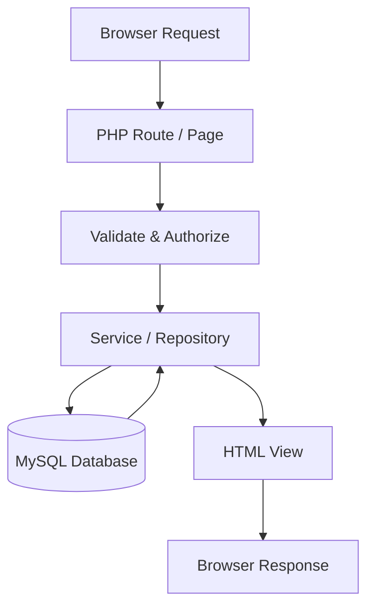
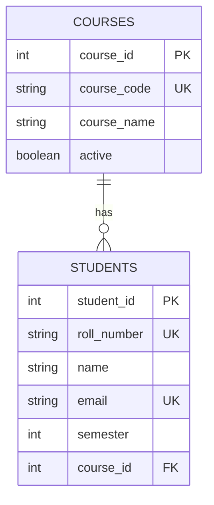
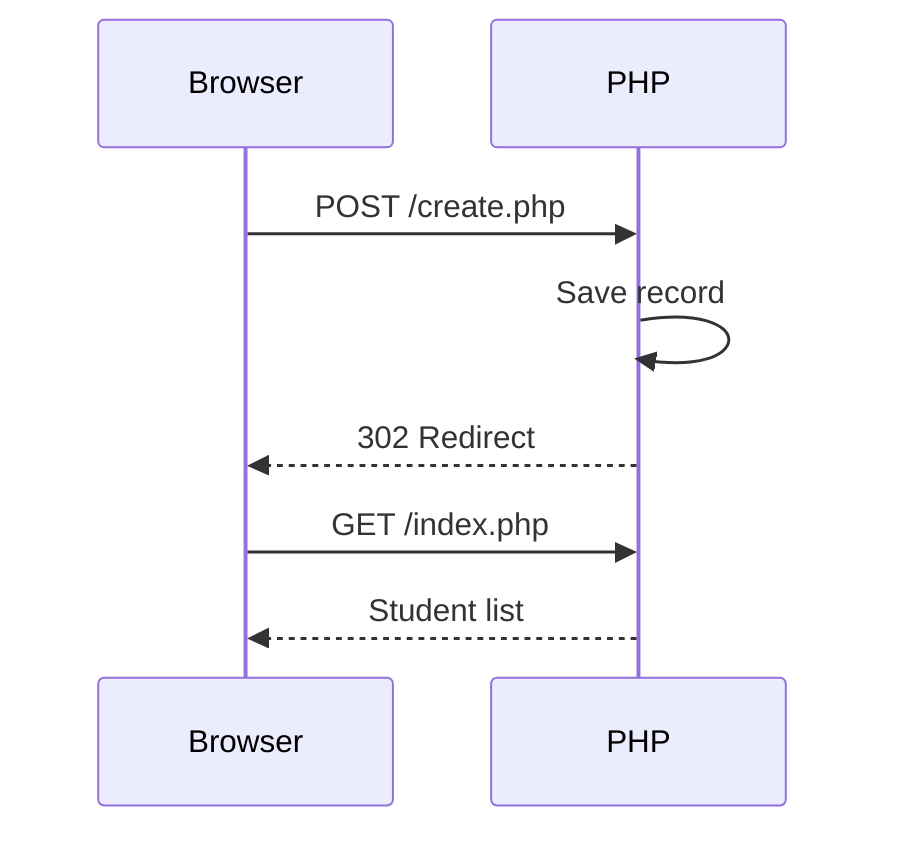
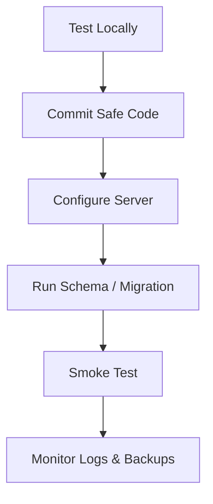

# 🏗️ Chapter 38: Building a Database-Driven Web Application

> **BCA Web Technology — Beginner to Advanced**  
> Is chapter mein HTML, CSS, PHP aur MySQL ko combine karke complete Student Management application banayenge.

---

## 🎯 Learning Objectives

Is chapter ke baad aap:

- database-driven application ka complete flow samjhenge;
- project requirements aur database schema design karenge;
- clean folder structure aur reusable components banayenge;
- secure Create, Read, Update aur Delete features implement karenge;
- search, pagination aur flash messages add karenge;
- validation, CSRF, authentication aur authorization basics apply karenge;
- application test aur deploy karne ki checklist follow karenge.

---

## 1. 🌐 Database-Driven Web Application Kya Hai?

Aisi website/application jiska content database se read ya database mein write hota hai, **database-driven web application** kehlati hai.

Examples:

- student management system;
- online shopping site;
- hospital appointment system;
- library management system;
- social media platform;
- college result portal.

Static website mein content file ke andar fixed hota hai. Database-driven app mein data user actions aur database records ke according dynamically change hota hai.

| Static Website | Database-Driven Application |
|---|---|
| Mostly fixed content | Dynamic content |
| Database optional | Database central role mein |
| Simple pages | Forms, users, search, reports |
| Manual content changes | Admin/user data manage kar sakte hain |

---

## 2. 🔄 Complete Application Flow



Example: student add karna

1. User `create.php` form open karta hai.
2. Form POST request se data bhejta hai.
3. PHP request method aur CSRF token check karta hai.
4. Input trim aur validate hota hai.
5. Repository prepared `INSERT` run karti hai.
6. Success flash message session mein store hota hai.
7. Browser list page par redirect hota hai.
8. Updated student list database se render hoti hai.

---

## 3. 📋 Project Requirements

Hum **Student Management System** banayenge.

### Functional Requirements

- students ki list;
- new student add;
- student details edit;
- student delete;
- name/roll number se search;
- course filter;
- pagination;
- success/error messages;
- admin login protection ka extension idea.

### Non-Functional Requirements

- responsive interface;
- accessible labels and controls;
- prepared SQL statements;
- server-side validation;
- escaped HTML output;
- CSRF protection;
- secrets repository se bahar;
- clear errors and logs;
- maintainable folder structure.

> 🗣️ Functional *(फंक्शनल)* = app kya karta hai. Non-functional = app kitni safely, quickly aur cleanly kaam karta hai.

---

## 4. 🗃️ Database Design

```sql
CREATE DATABASE IF NOT EXISTS student_app
CHARACTER SET utf8mb4
COLLATE utf8mb4_unicode_ci;

USE student_app;

CREATE TABLE courses (
    course_id INT UNSIGNED AUTO_INCREMENT PRIMARY KEY,
    course_code VARCHAR(20) NOT NULL UNIQUE,
    course_name VARCHAR(100) NOT NULL,
    active BOOLEAN NOT NULL DEFAULT TRUE
);

CREATE TABLE students (
    student_id INT UNSIGNED AUTO_INCREMENT PRIMARY KEY,
    roll_number VARCHAR(20) NOT NULL UNIQUE,
    name VARCHAR(100) NOT NULL,
    email VARCHAR(150) NOT NULL UNIQUE,
    phone VARCHAR(20),
    city VARCHAR(60),
    semester TINYINT UNSIGNED NOT NULL,
    course_id INT UNSIGNED NOT NULL,
    created_at TIMESTAMP NOT NULL DEFAULT CURRENT_TIMESTAMP,
    updated_at TIMESTAMP NOT NULL
        DEFAULT CURRENT_TIMESTAMP
        ON UPDATE CURRENT_TIMESTAMP,

    CONSTRAINT chk_students_semester
        CHECK (semester BETWEEN 1 AND 8),
    CONSTRAINT fk_students_course
        FOREIGN KEY (course_id)
        REFERENCES courses(course_id)
        ON UPDATE CASCADE
        ON DELETE RESTRICT
);

CREATE INDEX idx_students_name
ON students (name);

CREATE INDEX idx_students_course
ON students (course_id);

INSERT INTO courses (course_code, course_name)
VALUES
('BCA', 'Bachelor of Computer Applications'),
('BBA', 'Bachelor of Business Administration'),
('BCOM', 'Bachelor of Commerce');
```

### Relationship



Ek course mein zero ya many students ho sakte hain; each student exactly one course se connected hai.

---

## 5. 📁 Project Structure

```text
student-app/
├── config/
│   ├── bootstrap.php
│   └── database.php
├── public/
│   ├── assets/
│   │   └── css/
│   │       └── style.css
│   ├── index.php
│   ├── create.php
│   ├── edit.php
│   ├── delete.php
│   └── login.php
├── src/
│   ├── StudentRepository.php
│   └── Validator.php
├── templates/
│   ├── header.php
│   ├── footer.php
│   ├── errors.php
│   └── student-form.php
├── database/
│   └── schema.sql
├── .env
├── .env.example
└── .gitignore
```

### Responsibilities

| Folder/File | Responsibility |
|---|---|
| `public/` | Browser-accessible entry files |
| `config/` | Initialization and database connection |
| `src/` | Application classes/business logic |
| `templates/` | Reusable HTML |
| `database/` | Schema/migrations |
| `.env` | Local secrets; never commit |
| `.env.example` | Required variable names, no secrets |

---

## 6. ⚙️ Bootstrap aur Database Connection

### `config/bootstrap.php`

```php
<?php
declare(strict_types=1);

session_start();

require __DIR__ . '/database.php';
require dirname(__DIR__) . '/src/StudentRepository.php';
require dirname(__DIR__) . '/src/Validator.php';

function e(?string $value): string
{
    return htmlspecialchars(
        $value ?? '',
        ENT_QUOTES | ENT_SUBSTITUTE,
        'UTF-8'
    );
}

function redirect(string $path): never
{
    header('Location: ' . $path);
    exit;
}
```

### `config/database.php`

```php
<?php
declare(strict_types=1);

$host = getenv('DB_HOST') ?: '127.0.0.1';
$port = getenv('DB_PORT') ?: '3306';
$dbname = getenv('DB_NAME') ?: 'student_app';
$username = getenv('DB_USER') ?: 'student_user';
$password = getenv('DB_PASSWORD') ?: '';

$dsn = "mysql:host=$host;port=$port;dbname=$dbname;charset=utf8mb4";

try {
    $pdo = new PDO($dsn, $username, $password, [
        PDO::ATTR_ERRMODE            => PDO::ERRMODE_EXCEPTION,
        PDO::ATTR_DEFAULT_FETCH_MODE => PDO::FETCH_ASSOC,
        PDO::ATTR_EMULATE_PREPARES   => false,
    ]);
} catch (PDOException $exception) {
    error_log($exception->getMessage());
    http_response_code(500);
    exit('Application is temporarily unavailable.');
}
```

---

## 7. 🧩 Student Repository

Repository database queries ko pages se separate rakhti hai.

### `src/StudentRepository.php`

```php
<?php
declare(strict_types=1);

final class StudentRepository
{
    public function __construct(
        private PDO $pdo
    ) {}

    public function paginate(
        string $search,
        int $limit,
        int $offset
    ): array {
        $sql = 'SELECT
                    s.student_id,
                    s.roll_number,
                    s.name,
                    s.email,
                    s.phone,
                    s.city,
                    s.semester,
                    c.course_code,
                    c.course_name
                FROM students AS s
                JOIN courses AS c
                    ON s.course_id = c.course_id
                WHERE s.name LIKE :name_term
                   OR s.roll_number LIKE :roll_term
                ORDER BY s.student_id DESC
                LIMIT :limit OFFSET :offset';

        $stmt = $this->pdo->prepare($sql);
        $term = '%' . $search . '%';

        $stmt->bindValue(':name_term', $term);
        $stmt->bindValue(':roll_term', $term);
        $stmt->bindValue(':limit', $limit, PDO::PARAM_INT);
        $stmt->bindValue(':offset', $offset, PDO::PARAM_INT);
        $stmt->execute();

        return $stmt->fetchAll();
    }

    public function count(string $search): int
    {
        $stmt = $this->pdo->prepare(
            'SELECT COUNT(*)
             FROM students
             WHERE name LIKE :name_term
                OR roll_number LIKE :roll_term'
        );

        $term = '%' . $search . '%';
        $stmt->execute([
            'name_term' => $term,
            'roll_term' => $term,
        ]);

        return (int) $stmt->fetchColumn();
    }

    public function find(int $id): array|false
    {
        $stmt = $this->pdo->prepare(
            'SELECT student_id, roll_number, name, email,
                    phone, city, semester, course_id
             FROM students
             WHERE student_id = :id'
        );
        $stmt->execute(['id' => $id]);

        return $stmt->fetch();
    }

    public function create(array $data): int
    {
        $stmt = $this->pdo->prepare(
            'INSERT INTO students
             (roll_number, name, email, phone, city,
              semester, course_id)
             VALUES
             (:roll_number, :name, :email, :phone, :city,
              :semester, :course_id)'
        );
        $stmt->execute($data);

        return (int) $this->pdo->lastInsertId();
    }

    public function update(int $id, array $data): bool
    {
        $data['id'] = $id;

        $stmt = $this->pdo->prepare(
            'UPDATE students
             SET roll_number = :roll_number,
                 name = :name,
                 email = :email,
                 phone = :phone,
                 city = :city,
                 semester = :semester,
                 course_id = :course_id
             WHERE student_id = :id'
        );

        return $stmt->execute($data);
    }

    public function delete(int $id): bool
    {
        $stmt = $this->pdo->prepare(
            'DELETE FROM students
             WHERE student_id = :id'
        );

        return $stmt->execute(['id' => $id]);
    }
}
```

> ✅ Prepared statements ke placeholders aur data-array keys exact match hone chahiye.

---

## 8. ✅ Server-Side Validation

### `src/Validator.php`

```php
<?php
declare(strict_types=1);

final class Validator
{
    public static function student(array $input): array
    {
        $errors = [];

        if (trim($input['roll_number'] ?? '') === '') {
            $errors['roll_number'] = 'Roll number is required.';
        }

        if (mb_strlen(trim($input['name'] ?? '')) < 2) {
            $errors['name'] = 'Name must have at least 2 characters.';
        }

        if (!filter_var(
            $input['email'] ?? '',
            FILTER_VALIDATE_EMAIL
        )) {
            $errors['email'] = 'Enter a valid email.';
        }

        $semester = filter_var(
            $input['semester'] ?? null,
            FILTER_VALIDATE_INT
        );

        if ($semester === false || $semester < 1 || $semester > 8) {
            $errors['semester'] = 'Semester must be between 1 and 8.';
        }

        $courseId = filter_var(
            $input['course_id'] ?? null,
            FILTER_VALIDATE_INT
        );

        if ($courseId === false || $courseId < 1) {
            $errors['course_id'] = 'Select a valid course.';
        }

        return $errors;
    }
}
```

### Clean Data Function

```php
function studentData(array $input): array
{
    return [
        'roll_number' => trim($input['roll_number'] ?? ''),
        'name'        => trim($input['name'] ?? ''),
        'email'       => trim($input['email'] ?? ''),
        'phone'       => trim($input['phone'] ?? '') ?: null,
        'city'        => trim($input['city'] ?? '') ?: null,
        'semester'    => (int) ($input['semester'] ?? 0),
        'course_id'   => (int) ($input['course_id'] ?? 0),
    ];
}
```

Validation aur database constraints dono rakhein. Race conditions/parallel requests ke against `UNIQUE` constraint final defense hai.

---

## 9. 🛡️ CSRF Protection

**CSRF — Cross-Site Request Forgery** *(क्रॉस-साइट रिक्वेस्ट फॉर्जरी)* mein attacker logged-in user ke browser se unwanted request trigger karwa sakta hai.

### Token Create and Verify

```php
function csrfToken(): string
{
    if (empty($_SESSION['csrf_token'])) {
        $_SESSION['csrf_token'] = bin2hex(random_bytes(32));
    }

    return $_SESSION['csrf_token'];
}

function verifyCsrfToken(?string $token): void
{
    $stored = $_SESSION['csrf_token'] ?? '';

    if (
        $token === null ||
        $stored === '' ||
        !hash_equals($stored, $token)
    ) {
        http_response_code(419);
        exit('Invalid or expired form token.');
    }
}
```

Every state-changing form mein:

```html
<input
  type="hidden"
  name="csrf_token"
  value="<?= e(csrfToken()) ?>"
>
```

POST handler mein:

```php
verifyCsrfToken($_POST['csrf_token'] ?? null);
```

> 🔐 CSRF token authentication/authorization ka replacement nahi hai. Teeno ki responsibilities different hain.

---

## 10. ➕ Create Student Page

### Request Handling

```php
<?php
require dirname(__DIR__) . '/config/bootstrap.php';

$repository = new StudentRepository($pdo);
$errors = [];
$old = [];

if ($_SERVER['REQUEST_METHOD'] === 'POST') {
    verifyCsrfToken($_POST['csrf_token'] ?? null);

    $old = $_POST;
    $errors = Validator::student($_POST);

    if ($errors === []) {
        try {
            $repository->create(studentData($_POST));

            $_SESSION['flash'] = [
                'type' => 'success',
                'message' => 'Student added successfully.',
            ];

            redirect('index.php');
        } catch (PDOException $exception) {
            error_log($exception->getMessage());
            $errors['database'] =
                'Student could not be saved. Roll number or email may exist.';
        }
    }
}
```

### Form Pattern

```php
<label for="name">Student Name</label>
<input
  id="name"
  name="name"
  type="text"
  value="<?= e($old['name'] ?? '') ?>"
  aria-describedby="name-error"
  required
>

<?php if (isset($errors['name'])): ?>
  <p id="name-error" class="error">
    <?= e($errors['name']) ?>
  </p>
<?php endif; ?>
```

Invalid submission par entered values preserve hone se user experience better hota hai.

---

## 11. 👀 List, Search and Pagination

### `public/index.php` Controller Logic

```php
<?php
require dirname(__DIR__) . '/config/bootstrap.php';

$repository = new StudentRepository($pdo);

$search = trim($_GET['search'] ?? '');
$pageInput = filter_input(INPUT_GET, 'page', FILTER_VALIDATE_INT);
$page = ($pageInput !== false && $pageInput !== null && $pageInput > 0)
    ? $pageInput
    : 1;

$perPage = 10;
$total = $repository->count($search);
$totalPages = max(1, (int) ceil($total / $perPage));

if ($page > $totalPages) {
    $page = $totalPages;
}

$offset = ($page - 1) * $perPage;
$students = $repository->paginate($search, $perPage, $offset);

$flash = $_SESSION['flash'] ?? null;
unset($_SESSION['flash']);
```

### Search Form

```php
<form method="get" action="index.php" role="search">
  <label for="search">Search students</label>
  <input
    id="search"
    name="search"
    type="search"
    value="<?= e($search) ?>"
    placeholder="Name or roll number"
  >
  <button type="submit">Search</button>
  <a href="index.php">Clear</a>
</form>
```

### Safe Table Output

```php
<?php foreach ($students as $student): ?>
  <tr>
    <td><?= e($student['roll_number']) ?></td>
    <td><?= e($student['name']) ?></td>
    <td><?= e($student['email']) ?></td>
    <td><?= e($student['course_code']) ?></td>
    <td><?= (int) $student['semester'] ?></td>
    <td>
      <a href="edit.php?id=<?= (int) $student['student_id'] ?>">
        Edit
      </a>
    </td>
  </tr>
<?php endforeach; ?>
```

### Pagination Link

```php
<?php for ($number = 1; $number <= $totalPages; $number++): ?>
  <a
    href="?search=<?= urlencode($search) ?>&page=<?= $number ?>"
    <?= $number === $page ? 'aria-current="page"' : '' ?>
  >
    <?= $number ?>
  </a>
<?php endfor; ?>
```

---

## 12. ✏️ Edit Student Flow

Edit request do phases mein hota hai:

- **GET:** existing record fetch karke form fill;
- **POST:** validate karke record update.

```php
<?php
require dirname(__DIR__) . '/config/bootstrap.php';

$repository = new StudentRepository($pdo);
$id = filter_input(INPUT_GET, 'id', FILTER_VALIDATE_INT);

if ($id === false || $id === null || $id < 1) {
    http_response_code(400);
    exit('Invalid student ID.');
}

$student = $repository->find($id);

if (!$student) {
    http_response_code(404);
    exit('Student not found.');
}

$errors = [];

if ($_SERVER['REQUEST_METHOD'] === 'POST') {
    verifyCsrfToken($_POST['csrf_token'] ?? null);
    $errors = Validator::student($_POST);

    if ($errors === []) {
        $repository->update($id, studentData($_POST));

        $_SESSION['flash'] = [
            'type' => 'success',
            'message' => 'Student updated successfully.',
        ];

        redirect('index.php');
    }

    $student = array_merge($student, $_POST);
}
```

> 📌 URL ID ko integer validate karein. Record absent ho to correct 404 response dein.

---

## 13. 🗑️ Delete Student Flow

Delete form:

```php
<form
  method="post"
  action="delete.php"
  onsubmit="return confirm('Delete this student?')"
>
  <input
    type="hidden"
    name="student_id"
    value="<?= (int) $student['student_id'] ?>"
  >
  <input
    type="hidden"
    name="csrf_token"
    value="<?= e(csrfToken()) ?>"
  >
  <button type="submit">Delete</button>
</form>
```

### `public/delete.php`

```php
<?php
require dirname(__DIR__) . '/config/bootstrap.php';

if ($_SERVER['REQUEST_METHOD'] !== 'POST') {
    http_response_code(405);
    exit('Method not allowed.');
}

verifyCsrfToken($_POST['csrf_token'] ?? null);

$id = filter_input(INPUT_POST, 'student_id', FILTER_VALIDATE_INT);

if ($id === false || $id === null || $id < 1) {
    http_response_code(400);
    exit('Invalid student ID.');
}

$repository = new StudentRepository($pdo);
$student = $repository->find($id);

if (!$student) {
    http_response_code(404);
    exit('Student not found.');
}

// Real app: current user ki delete permission bhi check karein.
$repository->delete($id);

$_SESSION['flash'] = [
    'type' => 'success',
    'message' => 'Student deleted successfully.',
];

redirect('index.php');
```

Client-side confirmation convenient hai, security control nahi.

---

## 14. 🔁 Post/Redirect/Get Pattern

Successful POST ke baad redirect karna **PRG — Post/Redirect/Get** pattern hai.



Benefits:

- refresh par duplicate form submission avoid;
- clean URL;
- success message easily show;
- browser back/refresh experience better.

---

## 15. 💬 Flash Messages

Flash message session mein one request ke liye stored message hota hai.

Set:

```php
$_SESSION['flash'] = [
    'type' => 'success',
    'message' => 'Student saved successfully.',
];
```

Read and remove:

```php
$flash = $_SESSION['flash'] ?? null;
unset($_SESSION['flash']);
```

Display:

```php
<?php if ($flash): ?>
  <div
    class="alert alert-<?= e($flash['type']) ?>"
    role="status"
  >
    <?= e($flash['message']) ?>
  </div>
<?php endif; ?>
```

Sirf allowed type list use karna better hai, kyunki class attribute bhi output context hai.

---

## 16. 🎨 Responsive Interface Basics

```css
:root {
  --primary: #2563eb;
  --danger: #dc2626;
  --surface: #ffffff;
  --background: #eff6ff;
  --text: #172033;
}

* {
  box-sizing: border-box;
}

body {
  margin: 0;
  font-family: system-ui, sans-serif;
  color: var(--text);
  background: linear-gradient(135deg, #eff6ff, #f5f3ff);
}

.container {
  width: min(1100px, 92%);
  margin: 2rem auto;
}

.card {
  padding: 1.25rem;
  border-radius: 1rem;
  background: var(--surface);
  box-shadow: 0 12px 30px rgb(15 23 42 / 10%);
}

.table-wrapper {
  overflow-x: auto;
}

input,
select,
button {
  min-height: 44px;
  font: inherit;
}

button {
  border: 0;
  border-radius: 0.6rem;
  color: white;
  background: var(--primary);
  cursor: pointer;
}

.error {
  color: var(--danger);
}

@media (max-width: 640px) {
  .form-grid {
    display: grid;
    grid-template-columns: 1fr;
  }
}
```

Accessibility basics:

- every field ka visible `label`;
- keyboard focus clearly visible;
- color alone se error communicate na karein;
- table ko small screen par horizontally scrollable banayein;
- buttons/links meaningful text use karein.

---

## 17. 🔐 Authentication and Authorization

- **Authentication** *(ऑथेन्टिकेशन)*: user kaun hai?
- **Authorization** *(ऑथराइज़ेशन)*: user kya kar sakta hai?

Example rules:

| Role | View | Create | Edit | Delete |
|---|---:|---:|---:|---:|
| Viewer | ✅ | ❌ | ❌ | ❌ |
| Editor | ✅ | ✅ | ✅ | ❌ |
| Admin | ✅ | ✅ | ✅ | ✅ |

Protected page:

```php
function requireLogin(): void
{
    if (empty($_SESSION['user_id'])) {
        redirect('login.php');
    }
}

function requireRole(string $role): void
{
    requireLogin();

    if (($_SESSION['role'] ?? '') !== $role) {
        http_response_code(403);
        exit('You are not allowed to perform this action.');
    }
}
```

Password storage:

```php
$hash = password_hash($password, PASSWORD_DEFAULT);

if (password_verify($loginPassword, $hash)) {
    session_regenerate_id(true);
    $_SESSION['user_id'] = $user['user_id'];
}
```

Plain-text passwords kabhi store na karein.

---

## 18. 🧪 Testing Strategy

### Manual CRUD Test

1. Valid student create karein.
2. Duplicate roll number/email try karein.
3. Blank name aur invalid semester try karein.
4. List mein output verify karein.
5. Search with normal and special characters test karein.
6. First/last pagination page check karein.
7. Record edit karein.
8. Invalid/nonexistent ID open karein.
9. Invalid CSRF token se request try karein.
10. Authorized and unauthorized delete test karein.

### Important Test Categories

| Type | Example |
|---|---|
| Happy path | Valid form successfully save |
| Validation | Invalid email reject |
| Boundary | Semester 1 and 8 accepted; 0 and 9 rejected |
| Security | SQL-like input data hi rahe |
| Authorization | Viewer delete na kar sake |
| Error | DB unavailable par secret leak na ho |
| Accessibility | Keyboard se form use ho |
| Responsive | Mobile width par table usable ho |

> 🧠 Sirf “works on my computer” sufficient testing nahi hai. Invalid aur malicious inputs bhi test karein.

---

## 19. 🐞 Debugging Workflow

1. Exact error reproduce karein.
2. Browser Network tab se method/status inspect karein.
3. PHP/server error log dekhein.
4. Input aur validated data ka safe shape check karein.
5. SQL query placeholders verify karein.
6. Same query controlled values se database client mein test karein.
7. Connection, foreign keys aur constraints check karein.
8. Fix ke baad related flows retest karein.

Development environment mein errors log karein. Production browser mein details hide rakhein.

---

## 20. 🚀 Deployment Checklist

### Before Deployment

- [ ] Production database/user created?
- [ ] Minimum grants assigned?
- [ ] Schema/migrations run?
- [ ] Real credentials environment mein stored?
- [ ] `.env` Git se excluded?
- [ ] Debug display disabled?
- [ ] HTTPS enabled?
- [ ] Session cookie secure settings configured?
- [ ] Web root `public/` par set?
- [ ] Backups automated aur restore tested?
- [ ] Database errors logs tak limited?
- [ ] Authentication/authorization tested?
- [ ] CSRF and prepared statements present?
- [ ] File permissions minimum required?
- [ ] Application URLs and redirects verified?

### Deployment Flow



> 🚨 Production database ka backup verify kiye bina destructive migration run na karein.

---

## 21. 🌟 Possible Improvements

Basic app complete hone ke baad:

- course filter and advanced search;
- sortable columns;
- user registration/login;
- role-based permissions;
- soft delete and audit logs;
- profile photo upload;
- CSV export/import;
- dashboard charts;
- email notifications;
- AJAX-based operations;
- REST API;
- automated tests;
- MVC framework such as Laravel.

Features step-by-step add karein. Har feature ke saath validation, permissions aur testing update karein.

---

## 22. ⚠️ Common Mistakes

| Mistake | Risk | Better Approach |
|---|---|---|
| SQL pages mein everywhere | Repeated/unmaintainable code | Repository/service layer |
| User input concatenate | SQL injection | Prepared statements |
| Output raw print | XSS | Context-aware escaping |
| Only HTML validation | Easily bypassed | Server + DB validation |
| Delete via GET | Accidental/forged action | POST + CSRF + permission |
| No PRG | Duplicate submission | Redirect after success |
| Detailed DB error show | Sensitive info leak | Log detail, generic response |
| Password plain text | Account compromise | `password_hash()` |
| Secrets commit | Credential leak | Environment config |
| Root DB account | Excessive privileges | Limited app user |
| No backup testing | Unrecoverable data loss | Automated tested backups |

---

## 23. ✅ Final Project Checklist

### Database

- [ ] Normalized tables and relationships
- [ ] Primary, unique and foreign keys
- [ ] Correct types and constraints
- [ ] Useful indexes
- [ ] Schema file/version history

### Back End

- [ ] PDO exception mode and `utf8mb4`
- [ ] Prepared CRUD queries
- [ ] Server-side validation
- [ ] Correct status codes
- [ ] PRG and flash messages
- [ ] Search and pagination
- [ ] Logs without public secrets

### Security

- [ ] Authentication
- [ ] Authorization per action
- [ ] CSRF tokens
- [ ] Escaped output
- [ ] Password hashing
- [ ] Environment-based secrets
- [ ] HTTPS and secure sessions

### Front End

- [ ] Responsive design
- [ ] Labels and keyboard access
- [ ] Clear error messages
- [ ] Empty state
- [ ] Confirmation for destructive action
- [ ] Accessible status messages

---

## 24. 🧾 Chapter Summary

- Database-driven app browser, PHP aur MySQL ko connect karti hai.
- Requirements aur schema implementation se pehle plan hone chahiye.
- Clear folder structure code ko maintainable banata hai.
- Repository database logic ko pages se separate karti hai.
- Prepared statements, validation aur escaping different security layers hain.
- CSRF tokens state-changing requests protect karte hain.
- PRG duplicate submissions avoid karta hai.
- Search and pagination large data ko usable banate hain.
- Authentication identity aur authorization permissions control karti hai.
- Testing, logging, HTTPS, limited privileges aur backups production readiness ke parts hain.

---

## 25. 📝 MCQs

1. POST success ke baad redirect pattern ka naam hai:  
   A. DOM  B. PRG  C. DNS  D. AJAX

2. Database queries organize karne wali class ho sakti hai:  
   A. Repository  B. Stylesheet  C. Cookie  D. Browser

3. Unwanted state-changing request prevent karne ke liye use hota hai:  
   A. CSRF token  B. CSS variable  C. SQL alias  D. Image alt

4. User “kya kar sakta hai” decide karta hai:  
   A. Authentication  B. Authorization  C. Pagination  D. Validation only

5. HTML output safely display karne ka common PHP function hai:  
   A. `htmlspecialchars()`  B. `prepare()`  C. `password_hash()`  D. `count()`

6. Password securely store karne ke liye use hota hai:  
   A. Base64  B. Plain text  C. `password_hash()`  D. URL encoding

7. Production database user ko milni chahiye:  
   A. All global privileges  B. Minimum required privileges  C. Root access  D. No password

**Answers:** 1-B, 2-A, 3-A, 4-B, 5-A, 6-C, 7-B

---

## 26. ✏️ Fill in the Blanks

1. Browser se publicly accessible files ______ folder mein rakhe gaye hain.
2. SQL injection se protection ke liye ______ statements use hote hain.
3. One-request success message ko ______ message kehte hain.
4. User ki identity verify karna ______ hai.
5. Multi-page result ke process ko ______ kehte hain.

**Answers:** 1. `public`, 2. prepared, 3. flash, 4. authentication, 5. pagination

---

## 27. ✔️ True or False

1. CSRF token SQL injection ka replacement hai. — **False**
2. Invalid record ID par 404 response suitable ho sakta hai. — **True**
3. Delete operation GET link se karna best practice hai. — **False**
4. Database constraints server validation ke saath useful hain. — **True**
5. Production mein detailed database error public show karna chahiye. — **False**

---

## 28. 🎤 Viva Questions

1. Database-driven application define karein.
2. Request-to-response flow explain karein.
3. Repository pattern ka benefit kya hai?
4. PRG pattern kya problem solve karta hai?
5. CSRF attack aur token explain karein.
6. Validation, prepared statements aur escaping compare karein.
7. Search query mein unique placeholders kyun use kiye?
8. Pagination ka offset formula kya hai?
9. Authentication aur authorization mein difference kya hai?
10. Delete request mein kaunse security checks honge?
11. Production mein database errors kaise handle honge?
12. Deployment se pehle backup restore test kyun important hai?

---

## 29. 🧪 Practical Exercises

### Beginner

1. Student app ka database aur tables create karein.
2. PDO connection aur student list page banayein.
3. Accessible create form aur validation add karein.
4. Edit aur delete operations implement karein.

### Intermediate

5. Search aur ten-record pagination banayein.
6. PRG pattern aur flash messages implement karein.
7. Reusable header, footer aur form template banayein.
8. All forms mein CSRF protection add karein.

### Advanced

9. Login aur viewer/editor/admin roles implement karein.
10. Student repository ke automated tests likhein.
11. Audit table mein create/update/delete events log karein.
12. HTTPS server par deploy karke security checklist verify karein.

---

## 30. 📖 Exam-Oriented Questions

### Short Answer

1. Database-driven application kya hoti hai?
2. Functional aur non-functional requirements compare karein.
3. PRG pattern explain karein.
4. CSRF token ka purpose batayein.
5. Authentication aur authorization mein difference likhiye.

### Long Answer

1. Student Management System ka architecture aur database design explain kijiye.
2. Secure CRUD application ki complete flow suitable code ke saath likhiye.
3. Search, pagination aur flash messages ka implementation explain kijiye.
4. Web form ki multi-layer security describe kijiye.
5. Database-driven PHP application ke testing aur deployment steps likhiye.

---

## 31. 🔁 One-Minute Revision

```text
Requirements → app ka plan
Schema → database blueprint
Repository → database query layer
CRUD → create, read, update, delete
Validation → input rules
Prepared SQL → injection protection
Escaping → safe output
CSRF token → forged request protection
PRG → POST, redirect, GET
Flash → one-time message
Pagination → data in pages
Authentication → who are you?
Authorization → what can you do?
Deployment → app to production
```

---

## 32. 🔗 Official References

- [PHP PDO Manual](https://www.php.net/manual/en/book.pdo.php)
- [PHP Sessions](https://www.php.net/manual/en/book.session.php)
- [PHP Password Hashing](https://www.php.net/manual/en/faq.passwords.php)
- [PHP Filter Functions](https://www.php.net/manual/en/book.filter.php)
- [OWASP Cross-Site Request Forgery Prevention](https://owasp.org/www-community/attacks/csrf)
- [MySQL Reference Manual](https://dev.mysql.com/doc/refman/en/)

---

[⬅️ Previous Chapter](37-connecting-php-with-mysql.md) · [📚 Table of Contents](../SUMMARY.md) · **Next: AJAX and Asynchronous Web Applications ➡️**
