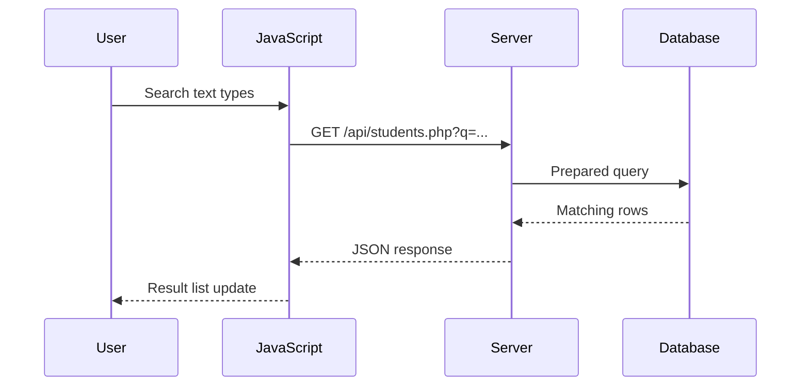

# ⚡ Chapter 39: AJAX and Asynchronous Web Applications

> **BCA Web Technology — Beginner to Advanced**  
> Page ko baar-baar reload kiye bina server se data lena aur interface update karna seekhein.

---

## 🎯 Learning Objectives

Is chapter ke baad aap:

- synchronous aur asynchronous execution compare karenge;
- AJAX ka request–response flow samjhenge;
- Promise, `async` aur `await` use karenge;
- Fetch API se GET, POST, JSON aur form requests bhejenge;
- XMLHttpRequest ka traditional approach samjhenge;
- loading, success, empty aur error UI states handle karenge;
- timeout, cancellation, race condition, CORS aur security basics jaanenge;
- PHP–MySQL ke saath live student search practical banayenge.

---

## 1. ⚡ AJAX Kya Hai?

**AJAX — Asynchronous JavaScript and XML**  
Pronunciation: **ए-जैक्स**

AJAX ek single technology nahi, balki browser techniques ka approach hai. JavaScript background mein server ko HTTP request bhejta hai, response receive karta hai aur DOM ka required part update karta hai—poora page reload kiye bina.

Name mein XML hai, lekin modern apps commonly **JSON** use karti hain. Response text, HTML, JSON, XML, file ya binary data bhi ho sakta hai.

### Common Examples

- search suggestions;
- “Load More” button;
- cart quantity update;
- like/follow action;
- username availability;
- form submission;
- dashboard auto-refresh;
- chat messages.

> 💡 AJAX ka main benefit sirf speed nahi; user ko uninterrupted experience dena bhi hai.

---

## 2. 🔄 Traditional vs AJAX Request

### Traditional Page Request

1. User form submit karta hai.
2. Browser full request bhejta hai.
3. Server complete HTML page banata hai.
4. Browser old page replace karta hai.

### AJAX Request

1. JavaScript event detect karta hai.
2. Background HTTP request bhejta hai.
3. Server data/partial result return karta hai.
4. JavaScript only required DOM part update karta hai.



---

## 3. ⏳ Synchronous aur Asynchronous

**Synchronous** *(सिन्क्रोनस)* code generally one operation complete hone ka wait karke next operation karta hai.

**Asynchronous** *(ए-सिन्क्रोनस)* operation background/event mechanism se complete ho sakta hai. JavaScript runtime meanwhile other work handle kar sakta hai.

```javascript
console.log("First");

setTimeout(() => {
  console.log("Second");
}, 1000);

console.log("Third");
```

Output:

```text
First
Third
Second
```

Network response kab aayega fixed nahi hota. Promise, callbacks aur events result ready hone par code chalane mein help karte hain.

> 🧠 `await` poore browser ko block nahi karta; woh current async function ki further execution ko promise settle hone tak pause karta hai.

---

## 4. 🤝 Promise Basics

**Promise** *(प्रॉमिस)* future result represent karta hai.

Promise states:

- **pending** — result abhi nahi;
- **fulfilled** — operation successful;
- **rejected** — operation failed.

```javascript
fetch("/api/students.php")
  .then((response) => response.json())
  .then((data) => {
    console.log(data);
  })
  .catch((error) => {
    console.error(error);
  });
```

Promise chain readable hai, lekin `async/await` same logic ko sequential-looking syntax mein likhta hai.

```javascript
async function loadStudents() {
  try {
    const response = await fetch("/api/students.php");
    const data = await response.json();
    console.log(data);
  } catch (error) {
    console.error(error);
  }
}
```

---

## 5. 🌐 Fetch API

Fetch API JavaScript se HTTP requests bhejne aur responses process karne ka modern promise-based interface hai.

### Basic GET Request

```javascript
async function getStudents() {
  const response = await fetch("/api/students.php");

  if (!response.ok) {
    throw new Error(`HTTP error: ${response.status}`);
  }

  const students = await response.json();
  return students;
}
```

Important points:

- `fetch()` Promise return karta hai;
- promise resolve hone par `Response` object milta hai;
- `response.ok` status 200–299 range ko represent karta hai;
- `response.json()` response body ko parse karta hai;
- 404/500 response normally automatic promise rejection nahi banta, isliye status manually check karein;
- actual network failure generally reject hoti hai.

---

## 6. 📦 Response Body Methods

| Method | Result |
|---|---|
| `response.json()` | Parsed JavaScript value |
| `response.text()` | Plain text |
| `response.blob()` | Binary/file-like Blob |
| `response.arrayBuffer()` | Raw binary buffer |
| `response.formData()` | Parsed form data |

Response body normally ek baar consume ki ja sakti hai.

```javascript
const response = await fetch("/message.txt");
const message = await response.text();
```

`Content-Type` header response format batata hai:

```javascript
const type = response.headers.get("content-type");

if (!type?.includes("application/json")) {
  throw new Error("Expected JSON response");
}
```

---

## 7. 🔍 GET Request aur Query Parameters

`URLSearchParams` values safely encode karta hai.

```javascript
const params = new URLSearchParams({
  q: "Aditi Sharma",
  course: "BCA",
  page: "1",
});

const response = await fetch(
  `/api/students.php?${params.toString()}`
);
```

Generated URL:

```text
/api/students.php?q=Aditi+Sharma&course=BCA&page=1
```

> 🔐 Sensitive data URL mein avoid karein. URLs browser history, server logs aur analytics mein appear ho sakte hain.

---

## 8. ➕ JSON POST Request

```javascript
async function createStudent(student) {
  const response = await fetch("/api/students.php", {
    method: "POST",
    headers: {
      "Content-Type": "application/json",
      "Accept": "application/json",
    },
    body: JSON.stringify(student),
  });

  const data = await response.json();

  if (!response.ok) {
    throw new Error(data.message ?? "Student could not be saved");
  }

  return data;
}

createStudent({
  roll_number: "BCA-105",
  name: "Sara Khan",
  email: "sara@example.com",
  semester: 2,
});
```

### PHP Mein JSON Read Karna

```php
<?php
declare(strict_types=1);

header('Content-Type: application/json; charset=utf-8');

$raw = file_get_contents('php://input');
$data = json_decode($raw, true);

if (!is_array($data)) {
    http_response_code(400);
    echo json_encode([
        'ok' => false,
        'message' => 'Invalid JSON body.',
    ]);
    exit;
}
```

---

## 9. 📝 FormData POST Request

File ya normal HTML form data ke liye `FormData` useful hai.

```javascript
const form = document.querySelector("#student-form");

form.addEventListener("submit", async (event) => {
  event.preventDefault();

  const formData = new FormData(form);

  const response = await fetch("/api/create-student.php", {
    method: "POST",
    body: formData,
  });

  const result = await response.json();
  console.log(result);
});
```

> ⚠️ `FormData` bhejte waqt `Content-Type` manually set na karein. Browser correct multipart boundary ke saath header set karta hai.

PHP values normally `$_POST` aur uploaded files `$_FILES` mein milte hain.

---

## 10. 🧾 PHP JSON Response

Reusable helper:

```php
<?php
function jsonResponse(array $data, int $status = 200): never
{
    http_response_code($status);
    header('Content-Type: application/json; charset=utf-8');

    echo json_encode(
        $data,
        JSON_UNESCAPED_UNICODE | JSON_UNESCAPED_SLASHES
    );
    exit;
}
```

Usage:

```php
jsonResponse([
    'ok' => true,
    'message' => 'Student created successfully.',
    'student' => [
        'student_id' => 15,
        'name' => 'Sara Khan',
    ],
], 201);
```

Consistent response shape front end ko easier banata hai:

```json
{
  "ok": true,
  "message": "Student created successfully.",
  "data": {}
}
```

---

## 11. 🚦 HTTP Status Codes

| Code | Meaning | AJAX Example |
|---:|---|---|
| 200 | OK | Data fetched/updated |
| 201 | Created | New record created |
| 204 | No Content | Delete success without body |
| 400 | Bad Request | Invalid request format |
| 401 | Unauthorized | Login required |
| 403 | Forbidden | Permission missing |
| 404 | Not Found | Record absent |
| 409 | Conflict | Duplicate record |
| 422 | Unprocessable Content | Validation failed |
| 429 | Too Many Requests | Rate limited |
| 500 | Server Error | Unexpected failure |

Front end ko status aur response message dono handle karne chahiye.

---

## 12. 🎨 UI States

Good async interface four basic states clearly show karta hai:

1. **Loading** — request chal rahi hai.
2. **Success** — result available hai.
3. **Empty** — request successful, data nahi.
4. **Error** — request fail hui.

```javascript
async function loadStudents() {
  const status = document.querySelector("#status");
  const list = document.querySelector("#student-list");

  status.textContent = "Loading students…";
  list.replaceChildren();

  try {
    const response = await fetch("/api/students.php");

    if (!response.ok) {
      throw new Error(`Request failed: ${response.status}`);
    }

    const data = await response.json();

    if (data.students.length === 0) {
      status.textContent = "No students found.";
      return;
    }

    status.textContent = `${data.students.length} students found.`;
    renderStudents(data.students, list);
  } catch (error) {
    console.error(error);
    status.textContent = "Could not load students. Try again.";
  }
}
```

HTML:

```html
<p id="status" role="status" aria-live="polite"></p>
<ul id="student-list"></ul>
```

`aria-live="polite"` screen-reader users ko status update announce karne mein help karta hai.

---

## 13. 🛡️ Safe DOM Rendering

Server data ko `innerHTML` se blindly inject karna XSS risk create kar sakta hai.

### Risky

```javascript
list.innerHTML = `<li>${student.name}</li>`;
```

### Safer

```javascript
function renderStudents(students, list) {
  const fragment = document.createDocumentFragment();

  for (const student of students) {
    const item = document.createElement("li");
    const name = document.createElement("strong");
    const details = document.createElement("span");

    name.textContent = student.name;
    details.textContent =
      ` — ${student.roll_number} — Semester ${student.semester}`;

    item.append(name, details);
    fragment.append(item);
  }

  list.replaceChildren(fragment);
}
```

`textContent` data ko HTML markup ke roop mein interpret nahi karta.

---

## 14. 🔎 Complete Practical: Live Student Search

### 14.1 Database Query Endpoint

`api/students.php`:

```php
<?php
declare(strict_types=1);

require dirname(__DIR__) . '/config/database.php';

header('Content-Type: application/json; charset=utf-8');

$query = trim($_GET['q'] ?? '');

if (mb_strlen($query) > 100) {
    http_response_code(422);
    echo json_encode([
        'ok' => false,
        'message' => 'Search text is too long.',
    ]);
    exit;
}

$sql = 'SELECT
            student_id,
            roll_number,
            name,
            email,
            semester
        FROM students
        WHERE name LIKE :name_term
           OR roll_number LIKE :roll_term
        ORDER BY name
        LIMIT 20';

$stmt = $pdo->prepare($sql);
$term = '%' . $query . '%';

$stmt->execute([
    'name_term' => $term,
    'roll_term' => $term,
]);

echo json_encode([
    'ok' => true,
    'students' => $stmt->fetchAll(),
], JSON_UNESCAPED_UNICODE);
```

### 14.2 HTML Interface

```html
<label for="search">Search student</label>
<input
  id="search"
  type="search"
  autocomplete="off"
  placeholder="Name or roll number"
>

<p id="status" role="status" aria-live="polite"></p>
<ul id="results"></ul>
```

### 14.3 Debounce Function

Har keystroke par immediate request server load badha sakti hai. **Debounce** user typing stop karne ke baad function run karta hai.

```javascript
function debounce(callback, delay = 300) {
  let timerId;

  return (...args) => {
    clearTimeout(timerId);
    timerId = setTimeout(() => callback(...args), delay);
  };
}
```

### 14.4 Search JavaScript with Cancellation

```javascript
const searchInput = document.querySelector("#search");
const status = document.querySelector("#status");
const results = document.querySelector("#results");

let controller = null;

const searchStudents = debounce(async () => {
  const query = searchInput.value.trim();

  controller?.abort();
  controller = new AbortController();

  status.textContent = "Searching…";

  try {
    const params = new URLSearchParams({ q: query });

    const response = await fetch(
      `/api/students.php?${params}`,
      { signal: controller.signal }
    );

    const data = await response.json();

    if (!response.ok) {
      throw new Error(data.message ?? "Search failed");
    }

    renderResults(data.students);
  } catch (error) {
    if (error.name === "AbortError") {
      return;
    }

    console.error(error);
    results.replaceChildren();
    status.textContent = "Search failed. Please try again.";
  }
}, 300);

searchInput.addEventListener("input", searchStudents);

function renderResults(students) {
  results.replaceChildren();

  if (students.length === 0) {
    status.textContent = "No matching students.";
    return;
  }

  const fragment = document.createDocumentFragment();

  for (const student of students) {
    const item = document.createElement("li");
    item.textContent =
      `${student.name} (${student.roll_number}), Semester ${student.semester}`;
    fragment.append(item);
  }

  results.append(fragment);
  status.textContent = `${students.length} result(s) found.`;
}
```

### Yeh Practical Kya Solve Karta Hai?

- `URLSearchParams` encoding;
- PHP validation;
- prepared SQL;
- JSON response;
- debounce;
- old request cancellation;
- status handling;
- safe DOM rendering;
- no full-page refresh.

---

## 15. 🏁 Race Condition

User quickly “A”, then “Ad”, then “Aditi” type karta hai. Earlier request later finish ho sakti hai aur fresh result ko overwrite kar sakti hai. Isse **race condition** *(रेस कंडीशन)* kehte hain.

Solutions:

- previous `fetch` ko `AbortController` se cancel;
- latest request number/token compare;
- debounce;
- server response mein query identifier return.

Request ID pattern:

```javascript
let latestRequest = 0;

async function search(query) {
  const requestId = ++latestRequest;
  const response = await fetch(
    `/api/search.php?q=${encodeURIComponent(query)}`
  );
  const data = await response.json();

  if (requestId !== latestRequest) {
    return;
  }

  renderResults(data.students);
}
```

---

## 16. ⏱️ Timeout and Cancellation

Fetch mein timeout option directly supply karne ke badle signal use kiya ja sakta hai.

```javascript
async function fetchWithTimeout(url, options = {}, ms = 8000) {
  const controller = new AbortController();
  const timer = setTimeout(() => controller.abort(), ms);

  try {
    return await fetch(url, {
      ...options,
      signal: controller.signal,
    });
  } finally {
    clearTimeout(timer);
  }
}
```

Modern environments mein `AbortSignal.timeout()` availability browser/runtime compatibility check ke baad use ki ja sakti hai.

---

## 17. 🔁 Retry with Backoff

Temporary network/server problems par limited retry useful ho sakti hai.

```javascript
async function fetchWithRetry(url, attempts = 3) {
  let lastError;

  for (let attempt = 1; attempt <= attempts; attempt++) {
    try {
      const response = await fetch(url);

      if (response.ok) {
        return response;
      }

      if (response.status < 500) {
        throw new Error(`HTTP ${response.status}`);
      }

      lastError = new Error(`HTTP ${response.status}`);
    } catch (error) {
      lastError = error;
    }

    if (attempt < attempts) {
      await new Promise((resolve) =>
        setTimeout(resolve, 500 * 2 ** (attempt - 1))
      );
    }
  }

  throw lastError;
}
```

> ⚠️ POST/payment जैसे non-idempotent operations ko blindly retry karna duplicate action create kar sakta hai. Retry policy request type ke according design karein.

---

## 18. 📜 XMLHttpRequest (XHR)

AJAX historically `XMLHttpRequest` se kiya jata tha. XHR ab bhi legacy projects aur some progress-event use cases mein milta hai.

```javascript
const xhr = new XMLHttpRequest();

xhr.open("GET", "/api/students.php");

xhr.responseType = "json";

xhr.addEventListener("load", () => {
  if (xhr.status >= 200 && xhr.status < 300) {
    console.log(xhr.response);
  } else {
    console.error("HTTP error:", xhr.status);
  }
});

xhr.addEventListener("error", () => {
  console.error("Network error");
});

xhr.send();
```

### Fetch vs XHR

| Fetch | XMLHttpRequest |
|---|---|
| Promise-based | Event/callback-based |
| Clean `async/await` syntax | More verbose |
| Modern default choice | Legacy code mein common |
| Response status manually check | Status event handler mein |
| AbortController cancellation | `xhr.abort()` |
| Upload progress less direct | Upload progress events available |

XHR ke naam mein XML hai, but woh JSON, text aur binary data bhi receive kar sakta hai.

---

## 19. 🌍 Same-Origin Policy and CORS

**Origin** protocol + hostname + port se banta hai.

Examples:

- `https://example.com:443`
- `http://example.com:80`

Origin different hua to browser **Same-Origin Policy** ke under access restrict kar sakta hai.

**CORS — Cross-Origin Resource Sharing** server headers ke through permitted cross-origin access define karta hai.

Example response header:

```http
Access-Control-Allow-Origin: https://app.example.com
```

Important:

- CORS browser security mechanism hai;
- CORS authentication ka replacement nahi;
- sensitive authenticated responses ke liye wildcard origin avoid;
- server ko allowed origins, methods aur headers carefully configure karne chahiye;
- kuch requests se pehle browser `OPTIONS` preflight bhejta hai.

---

## 20. 🍪 Credentials and Sessions

Same-origin fetch generally relevant credentials rules follow karta hai. Cross-origin cookies ke liye explicit configuration required ho sakti hai.

```javascript
const response = await fetch(
  "https://api.example.com/profile",
  {
    credentials: "include",
  }
);
```

Server ko compatible CORS headers, exact allowed origin aur credential permission configure karni hoti hai.

> 🔐 Session cookie use karne wali POST/PUT/PATCH/DELETE requests par CSRF protection apply karein.

---

## 21. 🔐 AJAX Security Checklist

- user input server par validate;
- SQL prepared statements;
- authorization every endpoint par;
- state-changing requests par CSRF protection;
- JSON ka correct `Content-Type`;
- DOM output safe APIs se render;
- secrets/browser code mein expose nahi;
- CORS allowlist minimal;
- HTTPS;
- request size and rate limits;
- generic client error, detailed server log;
- sensitive data GET URL mein nahi;
- file uploads separately validate;
- client-side checks par trust nahi.

> 🚨 AJAX request normal HTTP request hi hai. DevTools se koi bhi request modify/send kar sakta hai; server must independently verify everything.

---

## 22. ⚙️ Performance and UX Tips

- search input debounce;
- old requests cancel;
- only required fields return;
- server-side pagination;
- response compression/caching carefully;
- duplicate requests avoid;
- loading button disable;
- skeleton/spinner meaningful use;
- retry button provide;
- empty state explain;
- optimistic UI only when rollback possible;
- slow network and offline behavior test.

### Button Loading State

```javascript
async function saveStudent(event) {
  const button = event.submitter;
  button.disabled = true;
  button.textContent = "Saving…";

  try {
    await submitStudent();
    showMessage("Student saved.");
  } catch (error) {
    showMessage("Could not save student.");
  } finally {
    button.disabled = false;
    button.textContent = "Save Student";
  }
}
```

---

## 23. 🐞 Debugging AJAX Requests

Browser DevTools → **Network** panel mein check karein:

- request URL;
- HTTP method;
- query string;
- request headers/body;
- response status;
- response headers/body;
- request timing;
- CORS/preflight errors.

### Common Problems

| Problem | Likely Cause | Fix |
|---|---|---|
| `Unexpected token <` | JSON expected, HTML error returned | Network response inspect |
| 404 | Wrong endpoint path | URL/document root check |
| 405 | Wrong HTTP method | Front/back-end method match |
| 419/403 | CSRF/permission issue | Token/session/role verify |
| 422 | Validation failed | Error JSON render |
| CORS blocked | Server allowlist missing | Correct server CORS config |
| Old result replaces new | Race condition | Abort/request ID |
| Spinner never ends | Missing `finally` | Cleanup in `finally` |
| Duplicate records | Double submit/retry | Disable + idempotency design |

---

## 24. ✅ Best-Practice Checklist

- [ ] Full reload really unnecessary hai?
- [ ] Correct HTTP method used?
- [ ] `response.ok` checked?
- [ ] Response content type handled?
- [ ] Loading, empty, success, error states exist?
- [ ] Form/button during request correctly managed?
- [ ] Search debounced and stale request cancelled?
- [ ] Server input validate and authorize karta hai?
- [ ] SQL parameterized hai?
- [ ] DOM output safely rendered?
- [ ] CSRF protection state-changing action par hai?
- [ ] CORS intentionally configured?
- [ ] Network failure/timeout tested?
- [ ] No-JavaScript fallback requirement considered?

---

## 25. 🧾 Chapter Summary

- AJAX page reload ke bina server communication aur partial DOM update enable karta hai.
- Modern AJAX commonly Fetch API aur JSON use karta hai.
- `fetch()` Promise return karta hai; HTTP error status manually check karna hota hai.
- `async/await` asynchronous code ko readable banata hai.
- GET query parameters ke liye `URLSearchParams` useful hai.
- JSON POST mein correct header aur `JSON.stringify()` use hota hai.
- `FormData` forms/files ke liye useful hai.
- Good UI loading, empty, success aur error states dikhata hai.
- Debounce, cancellation aur request IDs stale search results avoid karte hain.
- XHR traditional event-based API hai.
- CORS cross-origin browser access control karta hai.
- AJAX endpoints ko validation, authorization, CSRF, parameterized SQL aur safe output chahiye.

---

## 26. 📝 MCQs

1. AJAX ka full form hai:  
   A. Automatic Java XML  B. Asynchronous JavaScript and XML  
   C. Advanced JSON and XHTML  D. Assembled Java API

2. Fetch API return karti hai:  
   A. Promise  B. CSS rule  C. SQL row  D. Cookie only

3. JSON response parse karne ka method hai:  
   A. `response.json()`  B. `response.parse()`  C. `JSON.fetch()`  D. `readJson()`

4. Har keystroke ke baad delay se search chalana hai:  
   A. Cascade  B. Debounce  C. Join  D. Hash

5. Old request cancel karne mein help karta hai:  
   A. `AbortController`  B. `Date`  C. `localStorage`  D. `Math`

6. Cross-origin permission mechanism hai:  
   A. CRUD  B. CORS  C. CSS  D. DOM

7. Fetch 404 par generally kya karna chahiye?  
   A. Ignore  B. `response.ok` check  C. Page close  D. XML required

**Answers:** 1-B, 2-A, 3-A, 4-B, 5-A, 6-B, 7-B

---

## 27. ✏️ Fill in the Blanks

1. Promise ki initial state ______ hoti hai.
2. Promise result wait karne ka keyword ______ hai.
3. Form data ke liye browser class ______ hai.
4. AJAX status inspect karne ke liye DevTools ka ______ panel useful hai.
5. Safe text DOM rendering ke liye ______ property use ki ja sakti hai.

**Answers:** 1. pending, 2. `await`, 3. `FormData`, 4. Network, 5. `textContent`

---

## 28. ✔️ True or False

1. AJAX ke liye XML compulsory hai. — **False**
2. Fetch promise-based hai. — **True**
3. 404 response hamesha fetch promise reject karta hai. — **False**
4. Debounce server requests reduce kar sakta hai. — **True**
5. Client validation ke baad server validation unnecessary hai. — **False**

---

## 29. 🎤 Viva Questions

1. AJAX kya hai aur iska use kyun hota hai?
2. Synchronous aur asynchronous execution compare karein.
3. Promise ki states kya hain?
4. Fetch request ka flow explain karein.
5. `response.ok` kyun check karte hain?
6. JSON aur FormData POST compare karein.
7. Debounce kya karta hai?
8. Race condition kya hai?
9. AbortController ka use kya hai?
10. Fetch aur XMLHttpRequest compare karein.
11. Same-Origin Policy aur CORS explain karein.
12. AJAX application mein XSS aur CSRF kaise prevent karenge?

---

## 30. 🧪 Practical Exercises

### Beginner

1. Fetch se text file load karke page par dikhayein.
2. JSON file se products list render karein.
3. Loading aur error message add karein.
4. Button click par PHP endpoint se current server time load karein.

### Intermediate

5. JSON POST se student form submit karein.
6. Debounced live search implement karein.
7. Old requests AbortController se cancel karein.
8. AJAX delete with CSRF token aur confirmation banayein.

### Advanced

9. Pagination ke saath product search API banayein.
10. Timeout aur safe retry strategy implement karein.
11. Role-protected PHP JSON endpoints banayein.
12. Slow network, 401, 403, 404, 422 aur 500 states test karein.

---

## 31. 📖 Exam-Oriented Questions

### Short Answer

1. AJAX define kijiye.
2. Promise aur async/await explain kijiye.
3. Fetch aur XHR mein difference likhiye.
4. Debouncing kya hai?
5. CORS ka purpose batayiye.

### Long Answer

1. AJAX request–response architecture diagram ke saath explain kijiye.
2. Fetch API se GET aur POST requests suitable examples ke saath likhiye.
3. PHP–MySQL live search application implement kijiye.
4. Asynchronous UI ke loading, error, empty aur race-condition handling explain kijiye.
5. AJAX endpoints ke security measures describe kijiye.

---

## 32. 🔁 One-Minute Revision

```text
AJAX → partial page update
Asynchronous → result later
Promise → future result
async → promise-returning function
await → promise wait
fetch() → HTTP request
Response → status, headers, body
JSON → structured data
FormData → form/file data
Debounce → delayed input action
AbortController → cancellation
XHR → traditional AJAX API
CORS → cross-origin permission
```

---

## 33. 🔗 Official References

- [MDN Fetch API](https://developer.mozilla.org/en-US/docs/Web/API/Fetch_API)
- [MDN Using the Fetch API](https://developer.mozilla.org/en-US/docs/Web/API/Fetch_API/Using_Fetch)
- [MDN XMLHttpRequest](https://developer.mozilla.org/en-US/docs/Web/API/XMLHttpRequest)
- [MDN Asynchronous JavaScript](https://developer.mozilla.org/en-US/docs/Learn_web_development/Extensions/Async_JS)
- [MDN async function](https://developer.mozilla.org/en-US/docs/Web/JavaScript/Reference/Statements/async_function)
- [OWASP AJAX Security Cheat Sheet](https://cheatsheetseries.owasp.org/cheatsheets/AJAX_Security_Cheat_Sheet.html)

---

[⬅️ Previous Chapter](38-building-a-database-driven-web-application.md) · [📚 Table of Contents](../SUMMARY.md) · **Next: JSON and XML ➡️**
