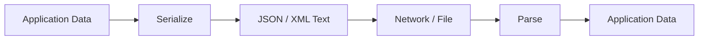

# 📦 Chapter 40: JSON and XML

> **BCA Web Technology — Beginner to Advanced**  
> Web applications ke beech structured data exchange karne ke two important formats ko detail mein samjhein.

---

## 🎯 Learning Objectives

Is chapter ke baad aap:

- data-interchange format ka purpose samjhenge;
- valid JSON aur well-formed XML likhenge;
- JSON values, objects, arrays aur escaping use karenge;
- JavaScript aur PHP mein JSON encode/decode karenge;
- XML elements, attributes, namespaces, CDATA aur schemas samjhenge;
- DOM, SimpleXML aur XPath se XML process karenge;
- JSON aur XML compare karke suitable format choose karenge;
- validation aur security risks—including XXE—identify karenge;
- student data ko JSON aur XML mein convert karne ka practical karenge.

---

## 1. 🔄 Data Interchange Kya Hai?

**Data interchange** *(डेटा इंटरचेंज)* different systems ke beech structured information exchange karna hai.

Example:

1. Browser server se student list request karta hai.
2. Server database se rows read karta hai.
3. Server data ko JSON ya XML mein serialize karta hai.
4. Browser response parse karke UI update karta hai.



- **Serialization** *(सीरियलाइज़ेशन)*: in-memory data ko transferable format mein convert karna.
- **Parsing** *(पार्सिंग)*: text format ko application data structure mein convert karna.

---

# Part A — JSON

## 2. 🟨 JSON Kya Hai?

**JSON — JavaScript Object Notation**  
Pronunciation: **जे-सन**

JSON ek lightweight text-based data-interchange format hai. Syntax JavaScript object literals se inspired hai, lekin JSON language-independent format hai.

Common uses:

- REST API responses;
- AJAX data exchange;
- configuration files;
- database/document storage;
- logs and messages;
- mobile and web app communication.

Example:

```json
{
  "student_id": 101,
  "name": "Aditi Sharma",
  "course": "BCA",
  "semester": 5,
  "active": true,
  "phone": null
}
```

---

## 3. 🧱 JSON Values and Structure

JSON mein six value types hote hain:

| Type | Example |
|---|---|
| String | `"BCA"` |
| Number | `42`, `89.5` |
| Boolean | `true`, `false` |
| Null | `null` |
| Object | `{"name": "Aditi"}` |
| Array | `["HTML", "CSS", "SQL"]` |

### JSON Object

Object curly braces ke andar name–value pairs ka collection hai.

```json
{
  "roll_number": "BCA-101",
  "name": "Aditi",
  "marks": 88.5
}
```

Rules:

- property names double quotes mein;
- key aur value ke beech colon;
- pairs comma se separate;
- final pair ke baad trailing comma nahi.

### JSON Array

```json
[
  {
    "roll_number": "BCA-101",
    "name": "Aditi"
  },
  {
    "roll_number": "BCA-102",
    "name": "Rahul"
  }
]
```

Array ordered values ka collection hai. Values same type ki hona compulsory nahi, lekin consistent structure APIs ko easier banata hai.

---

## 4. ✅ JSON Syntax Rules

Valid JSON:

```json
{
  "college": "City College",
  "students": 450,
  "government": false,
  "departments": ["BCA", "BBA", "B.Com"],
  "address": {
    "city": "Delhi",
    "pin": "110001"
  },
  "website": null
}
```

### Invalid JSON Examples

```javascript
{
  name: "Aditi",       // key quoted nahi
  'course': 'BCA',     // single quotes invalid
  "semester": 5,       // trailing comma invalid
  "joined": undefined, // undefined valid JSON value nahi
  "created": new Date()// expression/function invalid
}
```

JSON mein comments standard syntax ka part nahi hain.

> 📌 JSON data hai, executable JavaScript code nahi. JSON parse karne ke liye `eval()` kabhi use na karein.

---

## 5. ✍️ Strings and Escaping

JSON strings double quotes mein hoti hain.

Common escape sequences:

| Sequence | Meaning |
|---|---|
| `\"` | Double quote |
| `\\` | Backslash |
| `\n` | New line |
| `\t` | Tab |
| `\r` | Carriage return |
| `\uXXXX` | Unicode code unit |

Example:

```json
{
  "message": "She said, \"Welcome!\"",
  "path": "C:\\books\\web",
  "lines": "First\nSecond"
}
```

---

## 6. 🔢 JSON Numbers

JSON number:

```json
{
  "integer": 42,
  "decimal": 89.5,
  "negative": -12,
  "scientific": 6.02e23
}
```

JSON mein `NaN` aur `Infinity` standard valid numbers nahi hain.

Large integers par receiver language ki precision limit matter kar sakti hai. IDs jo safe integer range se bahar ho sakte hain, unhe string ke form mein exchange karna suitable ho sakta hai.

```json
{
  "transaction_id": "98765432109876543210"
}
```

---

## 7. 🧠 JavaScript: JSON.parse()

JSON text ko JavaScript value mein convert:

```javascript
const jsonText = `{
  "name": "Aditi",
  "semester": 5,
  "active": true
}`;

try {
  const student = JSON.parse(jsonText);
  console.log(student.name);
} catch (error) {
  console.error("Invalid JSON:", error.message);
}
```

### Reviver Function

Dates JSON mein special date type nahi; commonly ISO 8601 string use hoti hai.

```javascript
const text = `{
  "name": "Aditi",
  "admission_date": "2026-07-01"
}`;

const student = JSON.parse(text, (key, value) => {
  if (key === "admission_date") {
    return new Date(value);
  }

  return value;
});
```

Reviver parsed values transform kar sakta hai. Untrusted dates validate karein.

---

## 8. 🧠 JavaScript: JSON.stringify()

JavaScript value ko JSON text mein convert:

```javascript
const student = {
  roll_number: "BCA-101",
  name: "Aditi",
  semester: 5,
  active: true,
};

const jsonText = JSON.stringify(student);
console.log(jsonText);
```

Pretty print:

```javascript
const prettyJson = JSON.stringify(student, null, 2);
```

Replacer se selected fields:

```javascript
const publicJson = JSON.stringify(
  student,
  ["roll_number", "name", "semester"],
  2
);
```

Important behavior:

- object properties with `undefined`/functions/symbols omitted ho sakti hain;
- array mein unsupported values `null` ban sakti hain;
- `Date` commonly ISO string mein serialize hoti hai;
- circular references error throw karti hain;
- `BigInt` ko default stringify karna error de sakta hai.

---

## 9. 🌐 Fetch Ke Saath JSON

```javascript
async function loadStudents() {
  const response = await fetch("/api/students.php", {
    headers: {
      Accept: "application/json",
    },
  });

  const contentType = response.headers.get("content-type");

  if (!contentType?.includes("application/json")) {
    throw new Error("Server did not return JSON");
  }

  const data = await response.json();

  if (!response.ok) {
    throw new Error(data.message ?? `HTTP ${response.status}`);
  }

  return data.students;
}
```

JSON request:

```javascript
const response = await fetch("/api/students.php", {
  method: "POST",
  headers: {
    "Content-Type": "application/json",
    Accept: "application/json",
  },
  body: JSON.stringify({
    name: "Neha Singh",
    email: "neha@example.com",
  }),
});
```

---

## 10. 🐘 PHP: JSON Encode and Decode

### PHP Array to JSON

```php
<?php
declare(strict_types=1);

header('Content-Type: application/json; charset=utf-8');

$student = [
    'student_id' => 101,
    'name' => 'Aditi Sharma',
    'course' => 'BCA',
    'active' => true,
];

echo json_encode(
    $student,
    JSON_UNESCAPED_UNICODE |
    JSON_UNESCAPED_SLASHES |
    JSON_THROW_ON_ERROR
);
```

### JSON to PHP Array

```php
<?php
try {
    $raw = file_get_contents('php://input');

    $data = json_decode(
        $raw,
        true,
        512,
        JSON_THROW_ON_ERROR
    );
} catch (JsonException $exception) {
    http_response_code(400);
    echo json_encode([
        'ok' => false,
        'message' => 'Invalid JSON.',
    ]);
    exit;
}
```

- second argument `true` associative array return karta hai;
- without `true` objects commonly `stdClass` bante hain;
- `JSON_THROW_ON_ERROR` explicit exception handling enable karta hai.

> ✅ Decode successful hone ka meaning data valid business input hai, aisa nahi. Required fields, types, length aur permissions separately validate karein.

---

## 11. 📐 Good JSON API Design

Consistent success:

```json
{
  "ok": true,
  "data": {
    "student_id": 101,
    "name": "Aditi"
  },
  "message": "Student found."
}
```

Consistent validation error:

```json
{
  "ok": false,
  "message": "Validation failed.",
  "errors": {
    "email": "Enter a valid email.",
    "semester": "Semester must be between 1 and 8."
  }
}
```

Guidelines:

- stable property names;
- suitable HTTP status;
- predictable error format;
- dates in documented ISO 8601 format;
- units/currency explicit;
- pagination metadata;
- sensitive fields never include;
- null vs missing-property meaning document.

---

# Part B — XML

## 12. 🟦 XML Kya Hai?

**XML — Extensible Markup Language**  
Pronunciation: **एक्स-एम-एल**

XML hierarchical text format hai jisme custom elements data ko describe karte hain.

```xml
<?xml version="1.0" encoding="UTF-8"?>
<student>
  <studentId>101</studentId>
  <name>Aditi Sharma</name>
  <course>BCA</course>
  <semester>5</semester>
  <active>true</active>
</student>
```

Uses:

- enterprise integrations;
- SOAP web services;
- document formats;
- RSS/Atom feeds;
- configuration;
- SVG and office-document internals;
- systems requiring namespaces/schema validation.

---

## 13. 🌳 XML Document Structure

An XML document may contain:

- XML declaration;
- exactly one root element;
- child elements;
- attributes;
- text content;
- comments;
- processing instructions;
- namespace declarations.

```xml
<?xml version="1.0" encoding="UTF-8"?>
<college id="C101">
  <name>City College</name>
  <students>
    <student rollNumber="BCA-101">
      <name>Aditi Sharma</name>
      <semester>5</semester>
    </student>
  </students>
</college>
```

Here:

- `college` root element;
- `id` attribute;
- `students` container element;
- `student` repeated child;
- `name` and `semester` data elements.

---

## 14. ✅ Well-Formed XML Rules

XML document **well-formed** tab hota hai jab syntax rules follow kare:

1. exactly one root element;
2. every start tag ka closing tag;
3. proper nesting;
4. case-sensitive tag names;
5. attribute values quoted;
6. reserved characters escaped;
7. declaration ho to start mein.

Valid:

```xml
<student>
  <name>Aditi</name>
  <active>true</active>
</student>
```

Invalid nesting:

```xml
<student>
  <name>Aditi
</student>
  </name>
```

Empty element:

```xml
<phone />
```

> 🧠 **Well-formed** means XML syntax correct. **Valid** often means document defined DTD/XSD rules bhi follow karta hai.

---

## 15. 🔤 XML Entities and CDATA

Reserved characters:

| Character | Entity |
|---|---|
| `<` | `&lt;` |
| `>` | `&gt;` |
| `&` | `&amp;` |
| `"` | `&quot;` |
| `'` | `&apos;` |

Example:

```xml
<condition>marks &gt;= 40 &amp; attendance &gt;= 75</condition>
```

### CDATA

CDATA section mein markup-like text ko normal character data treat kiya ja sakta hai.

```xml
<scriptExample><![CDATA[
  if (marks < 40 && attendance < 75) {
    result = "Fail";
  }
]]></scriptExample>
```

CDATA sequence `]]>` ko directly contain nahi kar sakta.

---

## 16. 🏷️ Elements vs Attributes

Two possible designs:

```xml
<student id="101" active="true">
  <name>Aditi</name>
</student>
```

```xml
<student>
  <id>101</id>
  <active>true</active>
  <name>Aditi</name>
</student>
```

General guidance:

- metadata/identifier ke liye attribute suitable ho sakta hai;
- structured/repeated/extensible content ke liye elements;
- ek project mein consistent rule;
- schema and consumer requirements follow karein.

Attributes order ko business meaning ke liye depend nahi karna chahiye.

---

## 17. 🌐 XML Namespaces

Different vocabularies mein same element names conflict kar sakte hain. Namespace URI names ko distinguish karta hai.

```xml
<root
  xmlns:student="https://example.com/student"
  xmlns:course="https://example.com/course"
>
  <student:name>Aditi</student:name>
  <course:name>Web Technology</course:name>
</root>
```

- `xmlns:student` prefix declare karta hai;
- namespace URI identifier hai; zaroori nahi ki browser us URL se file download kare;
- qualified name `student:name` aur `course:name` different hain.

Default namespace:

```xml
<students xmlns="https://example.com/student">
  <student>
    <name>Aditi</name>
  </student>
</students>
```

---

## 18. 📋 DTD and XSD

### DTD — Document Type Definition

Basic structure rules define kar sakta hai.

```dtd
<!ELEMENT student (name, course, semester)>
<!ELEMENT name (#PCDATA)>
<!ELEMENT course (#PCDATA)>
<!ELEMENT semester (#PCDATA)>
```

### XSD — XML Schema Definition

XSD XML syntax use karta hai aur richer data types/constraints support karta hai.

```xml
<?xml version="1.0" encoding="UTF-8"?>
<xs:schema xmlns:xs="http://www.w3.org/2001/XMLSchema">
  <xs:element name="student">
    <xs:complexType>
      <xs:sequence>
        <xs:element name="name" type="xs:string"/>
        <xs:element name="course" type="xs:string"/>
        <xs:element name="semester">
          <xs:simpleType>
            <xs:restriction base="xs:positiveInteger">
              <xs:minInclusive value="1"/>
              <xs:maxInclusive value="8"/>
            </xs:restriction>
          </xs:simpleType>
        </xs:element>
      </xs:sequence>
    </xs:complexType>
  </xs:element>
</xs:schema>
```

> 📌 Schema validation format/structure verify karti hai. Application authorization aur business logic still required hain.

---

## 19. 🧭 XPath Basics

**XPath — XML Path Language** XML document ke nodes select karta hai.

Given XML:

```xml
<students>
  <student id="101">
    <name>Aditi</name>
    <semester>5</semester>
  </student>
  <student id="102">
    <name>Rahul</name>
    <semester>3</semester>
  </student>
</students>
```

| XPath | Selection |
|---|---|
| `/students/student` | All student children |
| `//name` | Any name elements |
| `//student[@id="101"]` | Student with ID 101 |
| `//student[semester >= 5]` | Semester 5+ students |
| `//student/name/text()` | Name text nodes |

---

## 20. 🧠 JavaScript: Parsing XML

`DOMParser` XML string ko DOM document mein parse karta hai.

```javascript
const xmlText = `
<students>
  <student id="101">
    <name>Aditi</name>
    <semester>5</semester>
  </student>
</students>
`;

const parser = new DOMParser();
const xmlDocument = parser.parseFromString(
  xmlText,
  "application/xml"
);

const parseError = xmlDocument.querySelector("parsererror");

if (parseError) {
  throw new Error("Invalid XML");
}

const name = xmlDocument.querySelector("student > name")
  ?.textContent;

console.log(name);
```

XML DOM ko HTML page mein inject na karein. Extracted text ko safe DOM APIs se render karein.

### XML Serialize

```javascript
const serializer = new XMLSerializer();
const text = serializer.serializeToString(xmlDocument);
```

---

## 21. 🐘 PHP: SimpleXML

### XML Read

```php
<?php
declare(strict_types=1);

libxml_use_internal_errors(true);

$xmlText = file_get_contents(__DIR__ . '/students.xml');

$xml = simplexml_load_string(
    $xmlText,
    SimpleXMLElement::class,
    LIBXML_NONET
);

if ($xml === false) {
    foreach (libxml_get_errors() as $error) {
        error_log(trim($error->message));
    }

    libxml_clear_errors();
    exit('Invalid XML document.');
}

foreach ($xml->student as $student) {
    echo htmlspecialchars(
        (string) $student->name,
        ENT_QUOTES,
        'UTF-8'
    );
}
```

`LIBXML_NONET` network access prevent karne mein help karta hai. XML parser configuration/security carefully review karein.

### XML Create

```php
<?php
$xml = new SimpleXMLElement(
    '<?xml version="1.0" encoding="UTF-8"?><students/>'
);

$student = $xml->addChild('student');
$student->addAttribute('id', '101');
$student->addChild('name', 'Aditi Sharma');
$student->addChild('course', 'BCA');
$student->addChild('semester', '5');

header('Content-Type: application/xml; charset=utf-8');
echo $xml->asXML();
```

Dynamic text ke correct escaping/encoding ko test karein. DOM APIs complex XML creation par more control de sakti hain.

---

## 22. 🐘 PHP DOMDocument and XPath

```php
<?php
declare(strict_types=1);

libxml_use_internal_errors(true);

$dom = new DOMDocument();

if (!$dom->load(
    __DIR__ . '/students.xml',
    LIBXML_NONET
)) {
    libxml_clear_errors();
    exit('Could not parse XML.');
}

$xpath = new DOMXPath($dom);
$nodes = $xpath->query('//student[semester >= 5]/name');

foreach ($nodes as $node) {
    echo htmlspecialchars(
        $node->textContent,
        ENT_QUOTES,
        'UTF-8'
    );
}
```

SimpleXML convenient hai; DOMDocument detailed tree manipulation aur XPath handling ke liye useful hai. Very large XML ke liye streaming parser such as XMLReader memory-efficient ho sakta hai.

---

## 23. 🔐 XML Security and XXE

**XXE — XML External Entity** attack improperly configured parser ko external entity resolve karwa kar local files, internal network resources ya service availability ko affect kar sakta hai.

Safety rules:

- untrusted XML parsing avoid/minimize;
- external entities and DTD processing disable;
- network access disable, e.g. suitable parser flags;
- parser/library version and documentation check;
- input size, nesting depth and processing time limit;
- schema validation carefully;
- parsed content ko untrusted hi treat;
- sensitive error details public response mein hide;
- allowlisted formats and media types.

> 🚨 Old tutorials blindly entity loading enable kar sakti hain. Production parser ko current platform security guidance ke according configure karein.

---

## 24. ⚖️ JSON vs XML

| Feature | JSON | XML |
|---|---|---|
| Style | Key–value and arrays | Elements, attributes, hierarchy |
| Verbosity | Usually compact | Usually more verbose |
| Web API usage | Very common | Enterprise/legacy/document systems |
| Native JavaScript fit | Excellent | DOM/parser required |
| Comments | Standard JSON mein no | Yes |
| Namespaces | No built-in namespace system | Strong namespace support |
| Schema options | JSON Schema ecosystem | DTD/XSD |
| Mixed document content | Limited suitability | Strong |
| Type representation | Basic types | Text + schema-defined types |
| Closing tags | No | Yes |
| Typical media type | `application/json` | `application/xml` |

### JSON Choose Karein Jab

- browser/mobile API;
- compact payload;
- object/array-oriented data;
- simple parsing required;
- JavaScript-heavy app.

### XML Choose Karein Jab

- existing system/protocol demands;
- namespaces required;
- document-centric or mixed content;
- XSD validation;
- SOAP, feeds or industry standard XML format.

> ✅ “JSON always better” ya “XML always better” correct nahi. Format consumer, protocol, schema aur business requirement se choose hota hai.

---

## 25. 🔄 Complete Practical: Student Data Conversion

### 25.1 JSON Input

```json
{
  "college": "City College",
  "students": [
    {
      "id": 101,
      "name": "Aditi Sharma",
      "course": "BCA",
      "semester": 5
    },
    {
      "id": 102,
      "name": "Rahul Verma",
      "course": "BCA",
      "semester": 3
    }
  ]
}
```

### 25.2 Equivalent XML

```xml
<?xml version="1.0" encoding="UTF-8"?>
<college>
  <name>City College</name>
  <students>
    <student id="101">
      <name>Aditi Sharma</name>
      <course>BCA</course>
      <semester>5</semester>
    </student>
    <student id="102">
      <name>Rahul Verma</name>
      <course>BCA</course>
      <semester>3</semester>
    </student>
  </students>
</college>
```

JSON `students` array ko XML mein `students` container aur repeated `student` elements represent karte hain.

### 25.3 PHP: JSON to XML

```php
<?php
declare(strict_types=1);

$data = json_decode(
    file_get_contents(__DIR__ . '/students.json'),
    true,
    512,
    JSON_THROW_ON_ERROR
);

$dom = new DOMDocument('1.0', 'UTF-8');
$dom->formatOutput = true;

$college = $dom->createElement('college');
$dom->appendChild($college);

$college->appendChild(
    $dom->createElement('name', $data['college'])
);

$studentsElement = $dom->createElement('students');
$college->appendChild($studentsElement);

foreach ($data['students'] as $item) {
    $student = $dom->createElement('student');
    $student->setAttribute('id', (string) $item['id']);

    foreach (['name', 'course', 'semester'] as $field) {
        $element = $dom->createElement($field);
        $element->appendChild(
            $dom->createTextNode((string) $item[$field])
        );
        $student->appendChild($element);
    }

    $studentsElement->appendChild($student);
}

$dom->save(__DIR__ . '/students.xml');
```

`createTextNode()` reserved XML characters correctly escape karne mein help karta hai.

### 25.4 PHP: XML to JSON-Friendly Array

```php
<?php
declare(strict_types=1);

libxml_use_internal_errors(true);

$xml = simplexml_load_file(
    __DIR__ . '/students.xml',
    SimpleXMLElement::class,
    LIBXML_NONET
);

if ($xml === false) {
    exit('Invalid XML.');
}

$data = [
    'college' => (string) $xml->name,
    'students' => [],
];

foreach ($xml->students->student as $student) {
    $data['students'][] = [
        'id' => (int) $student['id'],
        'name' => (string) $student->name,
        'course' => (string) $student->course,
        'semester' => (int) $student->semester,
    ];
}

header('Content-Type: application/json; charset=utf-8');

echo json_encode(
    $data,
    JSON_PRETTY_PRINT |
    JSON_UNESCAPED_UNICODE |
    JSON_THROW_ON_ERROR
);
```

> 📌 Conversion always perfectly lossless nahi hoti. XML attributes, element order, namespaces, mixed content aur numeric/string types ki mapping explicitly design karni padti hai.

---

## 26. 📂 Content Negotiation Preview

Client desired format `Accept` header se indicate kar sakta hai:

```http
Accept: application/json
```

ya:

```http
Accept: application/xml
```

Server response:

```http
Content-Type: application/json; charset=utf-8
```

Next chapter mein web services aur REST APIs ke context mein content negotiation aur detail mein aayega.

---

## 27. 🐞 Common Errors

| Problem | Reason | Fix |
|---|---|---|
| JSON parse error | Trailing comma/single quote | Strict JSON syntax |
| Unexpected token `<` | HTML error page received | Response/status inspect |
| Missing JSON field | Optional/version mismatch | Validate and default |
| Large ID changed | Number precision | Document/string representation |
| XML parse failure | Unclosed/wrongly nested tag | Well-formedness check |
| XML namespace query empty | Namespace handling missing | Prefix register/use |
| Special characters break XML | Raw text concatenated | DOM/text-node API |
| XXE risk | Unsafe entity/parser config | External access disable |
| Lost data in conversion | Mapping incomplete | Explicit mapping/schema |

---

## 28. ✅ Best-Practice Checklist

### JSON

- [ ] Double quotes and no trailing commas?
- [ ] Correct `Content-Type`?
- [ ] Parse errors caught?
- [ ] Input schema/business rules validated?
- [ ] Large-number and date format documented?
- [ ] Sensitive fields removed?
- [ ] Consistent error response?

### XML

- [ ] Exactly one root and proper nesting?
- [ ] UTF-8 encoding clear?
- [ ] Reserved characters escaped?
- [ ] Namespace handling correct?
- [ ] DTD/external entity access restricted?
- [ ] Size/depth limits considered?
- [ ] Schema validation required and configured?
- [ ] XPath queries tested with namespaces?

---

## 29. 🧾 Chapter Summary

- JSON and XML structured data-interchange formats hain.
- JSON objects, arrays, strings, numbers, booleans aur null support karta hai.
- `JSON.parse()` text to value aur `JSON.stringify()` value to text convert karta hai.
- PHP mein `json_encode()` aur `json_decode()` use hote hain.
- XML custom elements, attributes, namespaces aur document hierarchy support karta hai.
- Well-formed XML correct syntax aur valid XML additional schema rules follow karta hai.
- DTD aur XSD XML structure define/validate kar sakte hain.
- XPath XML nodes select karta hai.
- SimpleXML, DOMDocument aur XMLReader different XML workloads ke liye useful hain.
- Untrusted XML secure parser settings ke bina XXE risk create kar sakta hai.
- JSON web APIs ke liye common; XML document/enterprise/schema-heavy systems mein useful hai.
- Conversion ke time types, arrays, attributes, namespaces aur ordering explicitly map karein.

---

## 30. 📝 MCQs

1. JSON ka full form hai:  
   A. Java Source Object Network  B. JavaScript Object Notation  
   C. Joined String Object Name  D. Java Standard Output Node

2. Valid JSON property name hota hai:  
   A. `name`  B. `'name'`  C. `"name"`  D. `<name>`

3. JSON text parse karne ka JavaScript method hai:  
   A. `JSON.parse()`  B. `JSON.read()`  C. `JSON.open()`  D. `parse.json()`

4. XML document mein root elements kitne hone chahiye?  
   A. Zero  B. Exactly one  C. Exactly two  D. Unlimited top-level

5. XML schema language hai:  
   A. XSD  B. CSS  C. SQL  D. AJAX

6. XML nodes select karne ke liye use hota hai:  
   A. XPath  B. Flexbox  C. JSONPath only  D. HTTP

7. Unsafe XML entity processing ka attack hai:  
   A. XSS only  B. XXE  C. CSRF only  D. DDoS only

**Answers:** 1-B, 2-C, 3-A, 4-B, 5-A, 6-A, 7-B

---

## 31. ✏️ Fill in the Blanks

1. JavaScript value ko JSON text banane ka method ______ hai.
2. PHP array ko JSON banane ka function ______ hai.
3. XML ka top-level element ______ element kehlata hai.
4. XML vocabularies ke name conflicts ko ______ solve karte hain.
5. XML node-selection language ______ hai.

**Answers:** 1. `JSON.stringify()`, 2. `json_encode()`, 3. root, 4. namespaces, 5. XPath

---

## 32. ✔️ True or False

1. Standard JSON comments support karta hai. — **False**
2. JSON object keys double quotes mein hoti hain. — **True**
3. XML tags case-insensitive hote hain. — **False**
4. Well-formed XML automatically business-valid data guarantee karta hai. — **False**
5. JSON aur XML dono text-based data formats hain. — **True**

---

## 33. 🎤 Viva Questions

1. Data interchange kya hai?
2. Serialization aur parsing compare karein.
3. JSON ke value types kya hain?
4. JSON aur JavaScript object literal mein difference kya hai?
5. `JSON.parse()` aur `JSON.stringify()` kya karte hain?
6. JSON dates kaise represent ki ja sakti hain?
7. Well-formed aur valid XML compare karein.
8. XML elements aur attributes mein difference kya hai?
9. Namespace ka purpose kya hai?
10. DTD aur XSD compare karein.
11. XPath kya hai?
12. XXE attack kya hai aur prevention kya hai?
13. JSON vs XML selection kaise karenge?

---

## 34. 🧪 Practical Exercises

### Beginner

1. Five books ka valid JSON document banayein.
2. Same data ka well-formed XML document banayein.
3. JavaScript mein JSON parse karke HTML list safely render karein.
4. Invalid JSON/XML errors identify aur correct karein.

### Intermediate

5. PHP array ko JSON API response mein convert karein.
6. SimpleXML se student XML read karein.
7. XPath se semester 5+ students select karein.
8. XSD mein semester 1–8 constraint define karein.

### Advanced

9. JSON-to-XML and XML-to-JSON converter banayein.
10. Namespace-based XML parse karein.
11. Secure untrusted XML parsing settings test karein.
12. Same API ko `Accept` header ke according JSON/XML return karne dein.

---

## 35. 📖 Exam-Oriented Questions

### Short Answer

1. JSON define kijiye aur types likhiye.
2. JSON syntax rules likhiye.
3. XML well-formedness rules explain kijiye.
4. XML namespace kya hai?
5. DTD aur XSD mein difference likhiye.

### Long Answer

1. JSON objects, arrays aur parsing examples ke saath explain kijiye.
2. XML document structure suitable example ke saath describe kijiye.
3. JavaScript aur PHP mein JSON processing explain kijiye.
4. SimpleXML, DOM aur XPath ka use demonstrate kijiye.
5. JSON aur XML ka detailed comparison kijiye.
6. XML security risks aur secure parsing measures likhiye.

---

## 36. 🔁 One-Minute Revision

```text
JSON → lightweight structured data
Object → key–value pairs
Array → ordered values
JSON.parse() → text to JavaScript
JSON.stringify() → JavaScript to text
XML → extensible hierarchical markup
Element → tagged data
Attribute → element metadata
Well-formed → syntax correct
Valid → schema rules correct
Namespace → name conflict prevention
DTD/XSD → XML rules
XPath → node selection
XXE → external entity attack
```

---

## 37. 🔗 Official References

- [JSON Data Interchange Format — RFC 8259](https://www.rfc-editor.org/rfc/rfc8259)
- [MDN JSON](https://developer.mozilla.org/en-US/docs/Web/JavaScript/Reference/Global_Objects/JSON)
- [PHP JSON Manual](https://www.php.net/manual/en/book.json.php)
- [W3C XML Specification](https://www.w3.org/TR/xml/)
- [W3C XML Schema](https://www.w3.org/XML/Schema)
- [MDN XML Introduction](https://developer.mozilla.org/en-US/docs/Web/XML/Guides/XML_introduction)
- [OWASP XML External Entity Prevention](https://cheatsheetseries.owasp.org/cheatsheets/XML_External_Entity_Prevention_Cheat_Sheet.html)

---

[⬅️ Previous Chapter](39-ajax-and-asynchronous-web-applications.md) · [📚 Table of Contents](../SUMMARY.md) · **Next: Web Services and REST APIs ➡️**
