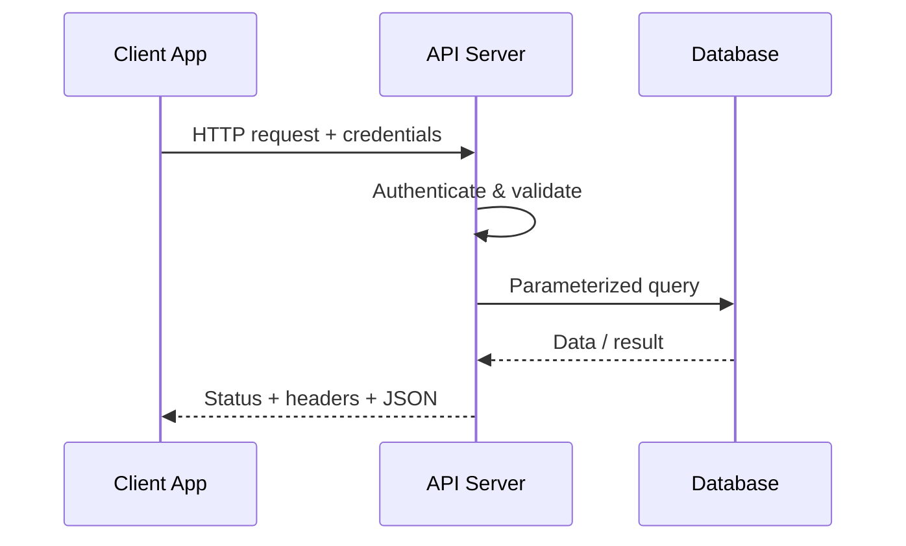

# 🌐 Chapter 41: Web Services and REST APIs

> **BCA Web Technology — Beginner to Advanced**  
> Applications ko HTTP ke through clearly, consistently aur securely communicate karna seekhein.

---

## 🎯 Learning Objectives

Is chapter ke baad aap:

- web service aur API ka meaning samjhenge;
- SOAP, RPC aur REST-style services compare karenge;
- REST architectural constraints explain karenge;
- resources, URIs, representations aur HTTP methods use karenge;
- correct status codes, headers aur error responses design karenge;
- pagination, filtering, sorting, caching aur versioning implement karenge;
- authentication, authorization, CORS aur rate limiting basics apply karenge;
- PHP, PDO aur MySQL se complete Student CRUD API bana payenge;
- cURL aur Fetch API se endpoints test/consume karenge.

---

## 1. 🔌 API aur Web Service Kya Hain?

### API

**API — Application Programming Interface**  
Pronunciation: **ए-पी-आई**

API rules aur operations ka interface hai jiske through one software component dusre component se communicate karta hai.

Har API web-based nahi hoti. Operating system, library aur database APIs bhi hoti hain.

### Web Service

Web service network/web protocols ke through application-to-application communication provide karti hai.

Examples:

- weather data service;
- payment gateway;
- maps service;
- college result API;
- login/identity service;
- shipping tracking service.

> 💡 Simple idea: UI humans ke liye interface hai; API software clients ke liye interface hai.

---

## 2. 🧩 Web Service Ke Main Parts

| Part | Role |
|---|---|
| Client / Consumer | Service ko request bhejta hai |
| Server / Provider | Request process karke response deta hai |
| Endpoint | Resource/action ka network address |
| Protocol | Communication rules, commonly HTTP |
| Representation | JSON, XML, HTML, file, etc. |
| Contract | Inputs, outputs, errors aur auth rules |
| Authentication | Caller identity verify |
| Authorization | Caller permission decide |



---

## 3. 🧭 Web Service Styles

### SOAP

**SOAP — Simple Object Access Protocol**  
Pronunciation: **सोप**

- XML messaging;
- formal contracts commonly WSDL;
- enterprise standards and extensions;
- strict structure;
- comparatively verbose.

### RPC

**RPC — Remote Procedure Call**

Client remote function/action jaisa call karta hai.

```text
POST /calculateResult
POST /sendInvoice
```

JSON-RPC and XML-RPC examples hain.

### REST

**REST — Representational State Transfer**  
Pronunciation: **रेस्ट**

REST distributed hypermedia systems ke liye architectural style hai. Practical “REST API” designs HTTP resources, representations, standard methods aur status codes use karte hain.

| Style | Focus | Common Format |
|---|---|---|
| SOAP | Message/protocol contract | XML |
| RPC | Remote actions/procedures | JSON/XML |
| REST-style HTTP API | Resources and representations | Often JSON |

> 📌 REST sirf “JSON over HTTP” ka synonym nahi. REST architectural constraints ka set hai.

---

## 4. 🏛️ REST Architectural Constraints

Roy Fielding ke REST style mein core constraints include:

### 4.1 Client–Server

User interface/client concerns aur server data/logic separate hote hain.

### 4.2 Stateless

Har request mein us request ko understand karne ke liye necessary information honi chahiye. Server conversation state par depend nahi karta.

> Stateless ka meaning “database mein koi state nahi” nahi hai. Resource state database mein ho sakti hai; request context self-contained hona chahiye.

### 4.3 Cacheable

Responses batati hain ki unhe cache kiya ja sakta hai ya nahi. Correct caching latency aur server load reduce karti hai.

### 4.4 Uniform Interface

Client aur server common consistent interface se interact karte hain. Resource identification, representations, self-descriptive messages aur hypermedia REST ke uniform interface ka part hain.

### 4.5 Layered System

Client ko necessary nahi pata ki woh origin server, gateway, proxy ya cache se directly communicate kar raha hai.

### 4.6 Code on Demand — Optional

Server client ko executable code bhej sakta hai, jaise JavaScript. Yeh optional constraint hai.

---

## 5. 📚 Resource and Representation

**Resource** application concept/entity hai:

- student;
- course;
- order;
- invoice.

**Representation** resource ki current transferable form hai—commonly JSON.

Resource URI:

```text
/api/students/101
```

JSON representation:

```json
{
  "student_id": 101,
  "roll_number": "BCA-101",
  "name": "Aditi Sharma",
  "semester": 5
}
```

Same resource different representations support kar sakta hai, but API contract clearly document hona chahiye.

---

## 6. 🛣️ REST-Style URI Design

Recommended noun-based routes:

| Purpose | Method + URI |
|---|---|
| All students | `GET /api/students` |
| One student | `GET /api/students/101` |
| Create student | `POST /api/students` |
| Replace student | `PUT /api/students/101` |
| Partially update | `PATCH /api/students/101` |
| Delete student | `DELETE /api/students/101` |
| Student enrollments | `GET /api/students/101/enrollments` |

Avoid unnecessary verbs:

```text
GET /api/getStudents
POST /api/createStudent
POST /api/deleteStudent?id=101
```

Better:

```text
GET    /api/students
POST   /api/students
DELETE /api/students/101
```

Guidelines:

- resource nouns use karein;
- consistent plural naming;
- stable identifiers;
- query string filtering/sorting/pagination ke liye;
- nesting limited aur meaningful;
- sensitive data URI mein avoid.

---

## 7. 📨 HTTP Methods

| Method | Typical Purpose | Safe? | Idempotent? |
|---|---|---:|---:|
| `GET` | Resource read | ✅ | ✅ |
| `HEAD` | Headers, no response body | ✅ | ✅ |
| `POST` | Create/process | ❌ | Usually ❌ |
| `PUT` | Full replacement at known URI | ❌ | ✅ |
| `PATCH` | Partial modification | ❌ | Not guaranteed |
| `DELETE` | Remove resource | ❌ | ✅ |
| `OPTIONS` | Communication options | ✅ | ✅ |

### Safe

Method intended to be read-only.

### Idempotent

Same request multiple times perform karne ka intended effect once perform karne jaisa hota hai.

> 🧠 Idempotent ka meaning response identical hona zaroori nahi. Timestamps/status differ ho sakte hain; intended server effect repeat se multiply nahi hota.

---

## 8. 📬 HTTP Request Anatomy

```http
POST /api/students HTTP/1.1
Host: college.example.com
Content-Type: application/json
Accept: application/json
Authorization: Bearer token-value

{
  "roll_number": "BCA-105",
  "name": "Sara Khan",
  "email": "sara@example.com",
  "semester": 2
}
```

Parts:

- request line: method + target + HTTP version;
- headers: metadata;
- blank line;
- optional body.

### Important Request Headers

| Header | Use |
|---|---|
| `Accept` | Desired response media type |
| `Content-Type` | Request body media type |
| `Authorization` | Credentials/token |
| `If-None-Match` | Conditional cache request |
| `Idempotency-Key` | Supported APIs mein duplicate action protection |
| `User-Agent` | Client information |

---

## 9. 📤 HTTP Response Anatomy

```http
HTTP/1.1 201 Created
Content-Type: application/json; charset=utf-8
Location: /api/students/105

{
  "ok": true,
  "data": {
    "student_id": 105,
    "roll_number": "BCA-105",
    "name": "Sara Khan"
  }
}
```

Important response parts:

- status code and reason concept;
- headers;
- representation body.

`201 Created` response mein new resource location provide karna useful hai.

---

## 10. 🚦 HTTP Status Codes

### Success

| Code | Meaning | Example |
|---:|---|---|
| 200 | OK | GET/update with response |
| 201 | Created | POST created resource |
| 202 | Accepted | Async processing accepted |
| 204 | No Content | Successful delete, no body |

### Client Errors

| Code | Meaning | Example |
|---:|---|---|
| 400 | Bad Request | Malformed JSON |
| 401 | Unauthorized | Valid authentication missing |
| 403 | Forbidden | Identity known, permission denied |
| 404 | Not Found | Resource absent |
| 405 | Method Not Allowed | Unsupported endpoint method |
| 409 | Conflict | Duplicate/state conflict |
| 415 | Unsupported Media Type | Wrong request content type |
| 422 | Unprocessable Content | Validation errors |
| 429 | Too Many Requests | Rate limit exceeded |

### Server Errors

| Code | Meaning |
|---:|---|
| 500 | Unexpected server failure |
| 502 | Bad upstream response |
| 503 | Temporarily unavailable |
| 504 | Upstream timeout |

> ✅ “Every response 200 with an error field” HTTP semantics ko weak banata hai. Correct status plus useful error body dein.

---

## 11. 🧾 Consistent JSON Responses

Success:

```json
{
  "data": {
    "student_id": 101,
    "name": "Aditi"
  }
}
```

Collection:

```json
{
  "data": [
    {
      "student_id": 101,
      "name": "Aditi"
    }
  ],
  "meta": {
    "page": 1,
    "per_page": 20,
    "total": 84,
    "total_pages": 5
  }
}
```

Validation error:

```json
{
  "type": "https://example.com/problems/validation-error",
  "title": "Validation failed",
  "status": 422,
  "detail": "One or more fields are invalid.",
  "errors": {
    "email": ["Enter a valid email."],
    "semester": ["Value must be between 1 and 8."]
  }
}
```

RFC 9457 defines a standardized “Problem Details” format for HTTP API errors. Custom extensions can add field errors or tracing identifiers.

---

## 12. 🔍 Filtering, Sorting and Pagination

### Filtering

```text
GET /api/students?course=BCA&semester=5
```

### Search

```text
GET /api/students?q=aditi
```

### Sorting

```text
GET /api/students?sort=name&direction=asc
```

### Pagination

```text
GET /api/students?page=2&per_page=20
```

Server rules:

- page/per-page ranges validate;
- sort fields allowlist;
- query values parameterize;
- maximum page size;
- metadata or pagination links return;
- stable ordering use.

> 🚨 SQL column name/value ko same way bind nahi kar sakte. Dynamic sort column ko explicit allowlist se map karein.

```php
$allowedSorts = [
    'name' => 's.name',
    'created_at' => 's.created_at',
];

$sort = $_GET['sort'] ?? 'name';
$orderBy = $allowedSorts[$sort] ?? $allowedSorts['name'];
```

---

## 13. 📦 Content Negotiation

Client `Accept` se response format preference batata hai:

```http
Accept: application/json
```

Server `Content-Type` se actual format batata hai:

```http
Content-Type: application/json; charset=utf-8
```

Request body JSON ho to:

```http
Content-Type: application/json
```

`Accept` aur `Content-Type` different roles perform karte hain.

Unsupported request format par `415 Unsupported Media Type` suitable ho sakta hai.

---

## 14. 🗂️ API Versioning

API change clients break kar sakta hai. Version strategy plan karein.

### URI Version

```text
/api/v1/students
```

### Header/Media Type Version

```http
Accept: application/vnd.example.v1+json
```

### Versioning Guidelines

- compatible additive changes ko unnecessarily new version na banayein;
- breaking changes clearly version/deprecate;
- migration guide and deadline;
- old version usage monitor;
- clients ko testing time;
- API contract/documentation versioned.

---

## 15. 🔐 Authentication and Authorization

### API Key

Simple server-issued key. Often project/application identify karta hai. HTTPS compulsory.

```http
X-API-Key: secret-key
```

### Bearer Token

```http
Authorization: Bearer eyJ...
```

Bearer token possession access de sakta hai, isliye secure transport/storage/expiration important hai.

### Session Cookie

Same web application APIs session cookie use kar sakti hain. State-changing requests ke liye CSRF protection consider karein.

### Authorization

Authentication ke baad every request par verify karein:

- user ka role;
- requested resource ownership;
- allowed action;
- tenant/organization boundary;
- record-level permissions.

> 🚨 Login hona automatically “any record access allowed” nahi banata.

---

## 16. 🛡️ API Security Basics

- HTTPS only;
- prepared SQL statements;
- strict input validation;
- authorization on every endpoint;
- secrets/tokens logs and URLs se out;
- response mein required fields only;
- rate limiting and abuse detection;
- request body size limit;
- CORS minimal allowlist;
- safe file upload rules;
- secure error handling;
- dependency updates;
- audit logs for sensitive actions;
- token expiry/revocation/rotation;
- pagination maximum;
- object-level access controls.

### Mass Assignment Risk

Client ka poora JSON directly model/database update mein pass karna risky hai.

Unsafe concept:

```php
$repository->update($id, $data);
```

Agar client `role: "admin"` add kar de to unauthorized field update ho sakta hai.

Better allowlist:

```php
$allowed = [
    'name',
    'email',
    'semester',
    'course_id',
];

$clean = [];

foreach ($allowed as $field) {
    if (array_key_exists($field, $data)) {
        $clean[$field] = $data[$field];
    }
}
```

---

## 17. 🌍 CORS

**CORS — Cross-Origin Resource Sharing** browser cross-origin access ko response headers se control karta hai.

```http
Access-Control-Allow-Origin: https://app.example.com
Access-Control-Allow-Methods: GET, POST, PATCH, DELETE
Access-Control-Allow-Headers: Content-Type, Authorization
```

Important:

- origin dynamically reflect karne se pehle allowlist verify;
- credentialed sensitive APIs ke liye wildcard avoid;
- preflight `OPTIONS` handle;
- CORS server-side authorization ka replacement nahi;
- non-browser clients CORS restriction se governed nahi, isliye API security independently strong honi chahiye.

---

## 18. ⏱️ Rate Limiting

Rate limiting fixed time mein client requests restrict karta hai.

Response:

```http
HTTP/1.1 429 Too Many Requests
Retry-After: 60
```

Uses:

- brute-force slow;
- accidental loops control;
- fair usage;
- infrastructure protection.

Rate limit key API key, user ID, IP aur endpoint combination ho sakti hai. Shared networks aur attackers ke behavior ko consider karke design karein.

---

## 19. ⚡ HTTP Caching

GET response cacheable ho sakti hai.

```http
Cache-Control: private, max-age=60
ETag: "students-v17"
```

Client conditional request:

```http
If-None-Match: "students-v17"
```

Unchanged resource:

```http
HTTP/1.1 304 Not Modified
```

> 🔐 Personalized/sensitive response ko public cache mein accidentally store na hone dein. Correct `Cache-Control` policy use karein.

---

## 20. 🔁 Idempotency and Retries

Network timeout par client ko unsure ho sakta hai ki POST process hua ya nahi. Supported API state-changing operation ke liye idempotency key accept kar sakti hai.

```http
Idempotency-Key: 7f4f0cf7-unique-value
```

Server same key aur same operation ko safely deduplicate kar sakta hai.

Use cases:

- payments;
- bookings;
- order creation;
- webhook processing.

Idempotency storage, scope, expiry and body mismatch behavior document karein.

---

## 21. 🐘 Complete Practical: PHP Student REST API

### 21.1 Database

```sql
CREATE DATABASE IF NOT EXISTS college_api
CHARACTER SET utf8mb4
COLLATE utf8mb4_unicode_ci;

USE college_api;

CREATE TABLE students (
    student_id INT UNSIGNED AUTO_INCREMENT PRIMARY KEY,
    roll_number VARCHAR(20) NOT NULL UNIQUE,
    name VARCHAR(100) NOT NULL,
    email VARCHAR(150) NOT NULL UNIQUE,
    course VARCHAR(50) NOT NULL,
    semester TINYINT UNSIGNED NOT NULL,
    created_at TIMESTAMP NOT NULL DEFAULT CURRENT_TIMESTAMP,
    updated_at TIMESTAMP NOT NULL
        DEFAULT CURRENT_TIMESTAMP
        ON UPDATE CURRENT_TIMESTAMP,
    CHECK (semester BETWEEN 1 AND 8)
);
```

### 21.2 Suggested Routes

```text
GET    /api/students
GET    /api/students/{id}
POST   /api/students
PATCH  /api/students/{id}
DELETE /api/students/{id}
```

### 21.3 JSON Helper

```php
<?php
declare(strict_types=1);

function jsonResponse(
    mixed $data,
    int $status = 200,
    array $headers = []
): never {
    http_response_code($status);
    header('Content-Type: application/json; charset=utf-8');

    foreach ($headers as $name => $value) {
        header($name . ': ' . $value);
    }

    echo json_encode(
        $data,
        JSON_UNESCAPED_UNICODE |
        JSON_UNESCAPED_SLASHES |
        JSON_THROW_ON_ERROR
    );
    exit;
}

function readJsonBody(): array
{
    $contentType = $_SERVER['CONTENT_TYPE'] ?? '';

    if (!str_starts_with($contentType, 'application/json')) {
        jsonResponse([
            'title' => 'Unsupported Media Type',
            'status' => 415,
        ], 415);
    }

    try {
        $data = json_decode(
            file_get_contents('php://input'),
            true,
            512,
            JSON_THROW_ON_ERROR
        );
    } catch (JsonException) {
        jsonResponse([
            'title' => 'Invalid JSON',
            'status' => 400,
        ], 400);
    }

    if (!is_array($data)) {
        jsonResponse([
            'title' => 'JSON object required',
            'status' => 400,
        ], 400);
    }

    return $data;
}
```

### 21.4 Basic Router

Web-server rewriting commonly request ko one entry file par direct karti hai. Simplified learning router:

```php
<?php
declare(strict_types=1);

require __DIR__ . '/../config/database.php';
require __DIR__ . '/../src/api-helpers.php';

$method = $_SERVER['REQUEST_METHOD'];
$path = parse_url($_SERVER['REQUEST_URI'], PHP_URL_PATH);
$segments = array_values(array_filter(explode('/', $path)));

$studentPosition = array_search('students', $segments, true);
$id = null;

if ($studentPosition !== false && isset($segments[$studentPosition + 1])) {
    $id = filter_var(
        $segments[$studentPosition + 1],
        FILTER_VALIDATE_INT
    );

    if ($id === false || $id < 1) {
        jsonResponse([
            'title' => 'Invalid student ID',
            'status' => 400,
        ], 400);
    }
}

if ($method === 'GET' && $id === null) {
    listStudents($pdo);
}

if ($method === 'GET' && $id !== null) {
    showStudent($pdo, $id);
}

if ($method === 'POST' && $id === null) {
    createStudent($pdo);
}

if ($method === 'PATCH' && $id !== null) {
    updateStudent($pdo, $id);
}

if ($method === 'DELETE' && $id !== null) {
    deleteStudent($pdo, $id);
}

header('Allow: GET, POST, PATCH, DELETE');
jsonResponse([
    'title' => 'Method or route not allowed',
    'status' => 405,
], 405);
```

Production routing framework/web-server configuration more robust path handling provide kar sakti hai.

---

## 22. 📋 List Endpoint

```php
function listStudents(PDO $pdo): never
{
    $page = filter_input(INPUT_GET, 'page', FILTER_VALIDATE_INT);
    $perPage = filter_input(
        INPUT_GET,
        'per_page',
        FILTER_VALIDATE_INT
    );

    $page = ($page !== false && $page !== null && $page > 0)
        ? $page : 1;
    $perPage = (
        $perPage !== false &&
        $perPage !== null &&
        $perPage >= 1 &&
        $perPage <= 100
    ) ? $perPage : 20;

    $offset = ($page - 1) * $perPage;

    $stmt = $pdo->prepare(
        'SELECT student_id, roll_number, name,
                email, course, semester, created_at
         FROM students
         ORDER BY student_id
         LIMIT :limit OFFSET :offset'
    );

    $stmt->bindValue(':limit', $perPage, PDO::PARAM_INT);
    $stmt->bindValue(':offset', $offset, PDO::PARAM_INT);
    $stmt->execute();

    $total = (int) $pdo->query(
        'SELECT COUNT(*) FROM students'
    )->fetchColumn();

    jsonResponse([
        'data' => $stmt->fetchAll(),
        'meta' => [
            'page' => $page,
            'per_page' => $perPage,
            'total' => $total,
            'total_pages' => (int) ceil($total / $perPage),
        ],
    ]);
}
```

---

## 23. 🔎 Single Resource Endpoint

```php
function showStudent(PDO $pdo, int $id): never
{
    $stmt = $pdo->prepare(
        'SELECT student_id, roll_number, name,
                email, course, semester, created_at, updated_at
         FROM students
         WHERE student_id = :id'
    );

    $stmt->execute(['id' => $id]);
    $student = $stmt->fetch();

    if (!$student) {
        jsonResponse([
            'title' => 'Student not found',
            'status' => 404,
        ], 404);
    }

    jsonResponse(['data' => $student]);
}
```

---

## 24. ➕ Create Endpoint

Validation:

```php
function validateStudent(array $data, bool $partial = false): array
{
    $errors = [];

    if (!$partial || array_key_exists('roll_number', $data)) {
        if (trim($data['roll_number'] ?? '') === '') {
            $errors['roll_number'][] = 'Roll number is required.';
        }
    }

    if (!$partial || array_key_exists('name', $data)) {
        if (mb_strlen(trim($data['name'] ?? '')) < 2) {
            $errors['name'][] = 'Name must have 2+ characters.';
        }
    }

    if (!$partial || array_key_exists('email', $data)) {
        if (!filter_var($data['email'] ?? '', FILTER_VALIDATE_EMAIL)) {
            $errors['email'][] = 'Valid email is required.';
        }
    }

    if (!$partial || array_key_exists('semester', $data)) {
        $semester = filter_var(
            $data['semester'] ?? null,
            FILTER_VALIDATE_INT
        );

        if ($semester === false || $semester < 1 || $semester > 8) {
            $errors['semester'][] = 'Semester must be 1–8.';
        }
    }

    return $errors;
}
```

Creation:

```php
function createStudent(PDO $pdo): never
{
    $data = readJsonBody();
    $errors = validateStudent($data);

    if ($errors !== []) {
        jsonResponse([
            'title' => 'Validation failed',
            'status' => 422,
            'errors' => $errors,
        ], 422);
    }

    $stmt = $pdo->prepare(
        'INSERT INTO students
         (roll_number, name, email, course, semester)
         VALUES
         (:roll_number, :name, :email, :course, :semester)'
    );

    try {
        $stmt->execute([
            'roll_number' => trim($data['roll_number']),
            'name' => trim($data['name']),
            'email' => trim($data['email']),
            'course' => trim($data['course'] ?? ''),
            'semester' => (int) $data['semester'],
        ]);
    } catch (PDOException $exception) {
        error_log($exception->getMessage());

        jsonResponse([
            'title' => 'Student conflicts with existing data',
            'status' => 409,
        ], 409);
    }

    $id = (int) $pdo->lastInsertId();

    jsonResponse([
        'data' => [
            'student_id' => $id,
            'roll_number' => trim($data['roll_number']),
            'name' => trim($data['name']),
        ],
    ], 201, [
        'Location' => '/api/students/' . $id,
    ]);
}
```

In real app, exact database error classify karein; every DB error ko conflict label na dein.

---

## 25. ✏️ PATCH Endpoint

```php
function updateStudent(PDO $pdo, int $id): never
{
    $existingStmt = $pdo->prepare(
        'SELECT student_id, name, email, semester
         FROM students WHERE student_id = :id'
    );
    $existingStmt->execute(['id' => $id]);
    $existing = $existingStmt->fetch();

    if (!$existing) {
        jsonResponse([
            'title' => 'Student not found',
            'status' => 404,
        ], 404);
    }

    $data = readJsonBody();
    $allowed = ['name', 'email', 'semester'];
    $updates = [];
    $params = ['id' => $id];

    $errors = validateStudent($data, true);

    if ($errors !== []) {
        jsonResponse([
            'title' => 'Validation failed',
            'status' => 422,
            'errors' => $errors,
        ], 422);
    }

    foreach ($allowed as $field) {
        if (array_key_exists($field, $data)) {
            $updates[] = "$field = :$field";
            $params[$field] = $field === 'semester'
                ? (int) $data[$field]
                : trim((string) $data[$field]);
        }
    }

    if ($updates === []) {
        jsonResponse([
            'title' => 'No supported fields supplied',
            'status' => 422,
        ], 422);
    }

    $sql = 'UPDATE students SET ' .
        implode(', ', $updates) .
        ' WHERE student_id = :id';

    $stmt = $pdo->prepare($sql);
    $stmt->execute($params);

    showStudent($pdo, $id);
}
```

Dynamic SQL field names only fixed allowlist se aa rahe hain.

---

## 26. 🗑️ DELETE Endpoint

```php
function deleteStudent(PDO $pdo, int $id): never
{
    // Real app: authenticate + delete permission/ownership verify.
    $stmt = $pdo->prepare(
        'DELETE FROM students WHERE student_id = :id'
    );
    $stmt->execute(['id' => $id]);

    if ($stmt->rowCount() === 0) {
        jsonResponse([
            'title' => 'Student not found',
            'status' => 404,
        ], 404);
    }

    http_response_code(204);
    exit;
}
```

`204 No Content` response body nahi rakhta.

---

## 27. 💻 JavaScript API Client

```javascript
async function apiRequest(path, options = {}) {
  const response = await fetch(path, {
    ...options,
    headers: {
      Accept: "application/json",
      ...options.headers,
    },
  });

  if (response.status === 204) {
    return null;
  }

  const type = response.headers.get("content-type");
  const data = type?.includes("application/json")
    ? await response.json()
    : null;

  if (!response.ok) {
    const error = new Error(
      data?.detail ?? data?.title ?? `HTTP ${response.status}`
    );
    error.status = response.status;
    error.data = data;
    throw error;
  }

  return data;
}

const students = await apiRequest(
  "/api/students?page=1&per_page=20"
);

const created = await apiRequest("/api/students", {
  method: "POST",
  headers: {
    "Content-Type": "application/json",
  },
  body: JSON.stringify({
    roll_number: "BCA-105",
    name: "Sara Khan",
    email: "sara@example.com",
    course: "BCA",
    semester: 2,
  }),
});
```

---

## 28. 🧪 API Testing with cURL

List:

```bash
curl -i "http://localhost/api/students?page=1"
```

Single student:

```bash
curl -i "http://localhost/api/students/101"
```

Create:

```bash
curl -i   -X POST   -H "Content-Type: application/json"   -H "Accept: application/json"   -d '{"roll_number":"BCA-105","name":"Sara Khan","email":"sara@example.com","course":"BCA","semester":2}'   "http://localhost/api/students"
```

Patch:

```bash
curl -i   -X PATCH   -H "Content-Type: application/json"   -d '{"semester":3}'   "http://localhost/api/students/105"
```

Delete:

```bash
curl -i   -X DELETE   "http://localhost/api/students/105"
```

Test:

- correct status;
- response headers;
- success schema;
- validation errors;
- auth/authorization;
- nonexistent ID;
- duplicate data;
- malformed JSON;
- wrong method/media type;
- rate limit and pagination boundaries.

---

## 29. 📖 API Documentation

Good documentation includes:

- base URL and versions;
- authentication;
- every endpoint and method;
- path/query parameters;
- request schemas/examples;
- response schemas/examples;
- status and error codes;
- pagination;
- rate limits;
- version/deprecation policy;
- sample clients.

**OpenAPI** machine-readable API description format hai. Isse interactive documentation, client generation aur validation tools support mil sakta hai.

Simplified example:

```yaml
openapi: 3.1.0
info:
  title: College Student API
  version: 1.0.0
paths:
  /api/v1/students:
    get:
      summary: List students
      responses:
        "200":
          description: Student collection
    post:
      summary: Create a student
      responses:
        "201":
          description: Student created
        "422":
          description: Validation failed
```

Documentation implementation ke saath update honi chahiye.

---

## 30. 🔔 Webhooks

Normal API mein client request initiate karta hai. **Webhook** mein provider event hone par consumer ke configured URL ko HTTP request bhejta hai.

Example events:

- `payment.completed`;
- `student.registered`;
- `order.shipped`.

Webhook safety:

- signature verify;
- HTTPS;
- timestamp/replay protection;
- event ID deduplicate;
- quick response + background processing;
- retry-safe/idempotent handler;
- secrets rotate;
- source IP alone par trust nahi.

---

## 31. 🐞 Common API Mistakes

| Mistake | Problem | Better Approach |
|---|---|---|
| Verbs everywhere in URIs | Inconsistent resource model | Noun resources + methods |
| Every response 200 | Client cannot use HTTP semantics | Correct status codes |
| Raw DB errors | Information leak | Generic problem + logs |
| No pagination | Huge responses | Bounded pagination |
| Dynamic sort directly in SQL | Injection risk | Field allowlist |
| Client fields blindly save | Mass assignment | Explicit allowlist |
| Auth only on UI | Endpoint bypass | Every endpoint authorization |
| Secrets in URL | Logs/history exposure | Authorization header |
| Broad CORS | Unwanted browser origins | Minimal allowlist |
| Breaking changes silently | Client failures | Version/deprecation plan |
| No rate limit | Abuse/overload | Limits + monitoring |
| Documentation outdated | Integration failures | Contract-driven updates |

---

## 32. ✅ API Design Checklist

- [ ] Resources and URIs clear hain?
- [ ] HTTP methods semantics follow karte hain?
- [ ] Correct status codes?
- [ ] JSON shapes consistent?
- [ ] Validation errors field-specific?
- [ ] Authentication and record-level authorization?
- [ ] Prepared statements and field allowlists?
- [ ] Pagination maximum set?
- [ ] Filtering/sorting documented?
- [ ] CORS minimal?
- [ ] Rate limits and retry guidance?
- [ ] Caching safe and intentional?
- [ ] Secrets/logging policy?
- [ ] Version/deprecation policy?
- [ ] OpenAPI/examples updated?
- [ ] Automated success/error/security tests?

---

## 33. 🧾 Chapter Summary

- API software components ka interface hai; web service network-based application communication provide karti hai.
- SOAP, RPC aur REST-style services different approaches hain.
- REST constraints include client-server, statelessness, cacheability, uniform interface and layered system.
- Resources URI se identify aur representations se transfer hote hain.
- GET reads, POST commonly creates/processes, PUT replaces, PATCH partially updates and DELETE removes.
- HTTP status, headers and body together response meaning define karte hain.
- Filtering, sorting and pagination collection endpoints ko usable banate hain.
- Correct content types and version policy integrations stable rakhte hain.
- Authentication caller identity aur authorization permitted action verify karti hai.
- CORS, rate limiting, caching and idempotency API behavior ke important parts hain.
- Secure PHP APIs JSON parsing, validation, field allowlists, prepared SQL and safe errors use karti hain.
- Documentation and automated testing API contract ko dependable banate hain.

---

## 34. 📝 MCQs

1. REST ka full form hai:  
   A. Remote Execution Service Tool  
   B. Representational State Transfer  
   C. Resource Encoding Standard Text  
   D. Response State Technology

2. Resource read karne ka standard method hai:  
   A. GET  B. DELETE  C. PATCH  D. CONNECT

3. Successful creation ka suitable status hai:  
   A. 201  B. 404  C. 500  D. 301

4. Authentication missing hone ka common status hai:  
   A. 401  B. 403  C. 409  D. 422

5. Request body media type batata hai:  
   A. Accept  B. Content-Type  C. Location  D. ETag

6. Too many requests ka status hai:  
   A. 204  B. 400  C. 429  D. 503

7. API contract format ka example hai:  
   A. OpenAPI  B. CSS Grid  C. DNS  D. DOM

**Answers:** 1-B, 2-A, 3-A, 4-A, 5-B, 6-C, 7-A

---

## 35. ✏️ Fill in the Blanks

1. REST request context ko self-contained rakhne wala constraint ______ hai.
2. New resource ki URI batane wala response header ______ hai.
3. Partial update ke liye commonly ______ method use hota hai.
4. Conditional caching mein resource identifier header ______ ho sakta hai.
5. Caller ki permission check karna ______ hai.

**Answers:** 1. statelessness, 2. `Location`, 3. `PATCH`, 4. `ETag`, 5. authorization

---

## 36. ✔️ True or False

1. Har API web service hoti hai. — **False**
2. REST ka meaning only JSON over HTTP hai. — **False**
3. GET safe and idempotent method hai. — **True**
4. 204 response normally body include karta hai. — **False**
5. CORS authorization ka replacement hai. — **False**
6. Dynamic SQL sort columns ko allowlist karna chahiye. — **True**

---

## 37. 🎤 Viva Questions

1. API aur web service mein difference kya hai?
2. SOAP, RPC aur REST compare karein.
3. REST constraints explain karein.
4. Resource aur representation kya hain?
5. Safe aur idempotent methods mein difference kya hai?
6. PUT aur PATCH compare karein.
7. 401 aur 403 mein difference kya hai?
8. `Accept` aur `Content-Type` ka role kya hai?
9. API pagination kyun required hai?
10. API versioning strategies kya hain?
11. CORS aur rate limiting explain karein.
12. Mass assignment kya hai?
13. Webhook aur normal API call compare karein.

---

## 38. 🧪 Practical Exercises

### Beginner

1. Library API ke resources aur routes design karein.
2. Five CRUD endpoints ke request/response examples likhein.
3. PHP JSON helper banayein.
4. cURL se GET and POST test karein.

### Intermediate

5. PDO-based Student CRUD API complete karein.
6. Validation problem response add karein.
7. Search, filtering and pagination implement karein.
8. Bearer-token check aur roles add karein.

### Advanced

9. ETag conditional GET implement karein.
10. Rate limiting with `Retry-After` response banayein.
11. Idempotency-key based order creation design karein.
12. OpenAPI 3.1 document and automated API tests likhein.
13. Signed, replay-protected webhook receiver banayein.

---

## 39. 📖 Exam-Oriented Questions

### Short Answer

1. Web service define kijiye.
2. REST ke architectural constraints likhiye.
3. HTTP methods aur status codes ka mapping explain kijiye.
4. Content negotiation kya hai?
5. API authentication aur authorization compare kijiye.

### Long Answer

1. REST architecture suitable diagram aur example ke saath explain kijiye.
2. Resource-oriented Student API design kijiye.
3. PHP aur MySQL se secure CRUD API implement kijiye.
4. API versioning, caching, pagination and rate limiting explain kijiye.
5. API security threats aur controls describe kijiye.
6. API testing and documentation process likhiye.

---

## 40. 🔁 One-Minute Revision

```text
API → software interface
Web Service → network application service
REST → architectural style
Resource → addressable concept
Representation → transferred form
GET → read
POST → create/process
PUT → replace
PATCH → partial update
DELETE → remove
Status code → outcome
Content-Type → body format
Accept → desired response
Stateless → each request self-contained
CORS → browser origin access
Rate limit → request control
OpenAPI → API description
Webhook → event callback
```

---

## 41. 🔗 Official References

- [Roy Fielding — REST Architectural Style](https://www.ics.uci.edu/~fielding/pubs/dissertation/rest_arch_style.htm)
- [RFC 9110 — HTTP Semantics](https://www.rfc-editor.org/rfc/rfc9110.html)
- [RFC 9457 — Problem Details for HTTP APIs](https://www.rfc-editor.org/rfc/rfc9457.html)
- [RFC 8259 — JSON](https://www.rfc-editor.org/rfc/rfc8259)
- [PHP json_encode()](https://www.php.net/manual/en/function.json-encode.php)
- [OpenAPI Specification](https://spec.openapis.org/oas/latest.html)
- [OWASP REST Security Cheat Sheet](https://cheatsheetseries.owasp.org/cheatsheets/REST_Security_Cheat_Sheet.html)

---

[⬅️ Previous Chapter](40-json-and-xml.md) · [📚 Table of Contents](../SUMMARY.md) · **Next: Web Security ➡️**
