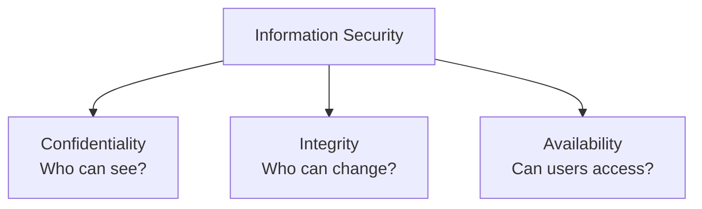
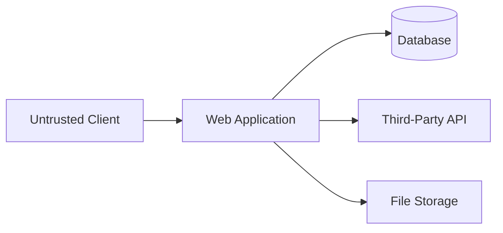

# 🔐 Chapter 42: Web Security

> **BCA Web Technology — Beginner to Advanced**  
> Secure web development ek final feature nahi—design se deployment tak continuous process hai.

---

## 🎯 Learning Objectives

Is chapter ke baad aap:

- security goals, assets, threats, vulnerabilities aur risk samjhenge;
- OWASP Top 10:2025 categories identify karenge;
- broken access control, SQL injection, XSS aur CSRF prevent karenge;
- passwords, authentication aur sessions safely handle karenge;
- HTTPS, cookies aur security headers configure karenge;
- file uploads, errors, secrets aur dependencies secure karenge;
- logging, backups aur incident response basics apply karenge;
- PHP application ko defense-in-depth checklist se harden karenge.

---

## 1. 🛡️ Web Security Kya Hai?

Web security applications, users, data aur infrastructure ko unauthorized access, modification, disclosure, disruption aur misuse se protect karne ki practice hai.

Important terms:

| Term | Meaning |
|---|---|
| Asset | Valuable item—data, account, service |
| Threat | Possible harmful event/actor |
| Vulnerability | Weakness that can be abused |
| Attack | Weakness exploit karne ka attempt |
| Risk | Likelihood × impact ka practical evaluation |
| Control | Risk prevent/detect/reduce/recover karne ka measure |
| Exploit | Vulnerability abuse karne ka technique/code |
| Patch | Vulnerability fix |

> 💡 Example: Student records **asset** hain. Missing authorization **vulnerability** hai. Kisi aur ka record view karna **attack** hai. Per-record permission check **control** hai.

---

## 2. 🔺 CIA Triad

### Confidentiality

Data sirf authorized people/systems dekhein.

Controls: authentication, authorization, encryption, minimum data exposure.

### Integrity

Data unauthorized way mein change na ho.

Controls: validation, access control, digital signatures, database constraints, audit logs.

### Availability

System authorized users ke liye required time par accessible rahe.

Controls: backups, redundancy, capacity limits, monitoring, disaster recovery.



Security mein authenticity, accountability, privacy aur non-repudiation bhi important ho sakte hain.

---

## 3. 🧅 Defense in Depth

Single security control fail ho sakta hai. Multiple independent layers ko **defense in depth** kehte hain.

Example secure form flow:

1. browser user guidance;
2. server input validation;
3. authorization check;
4. CSRF validation;
5. prepared SQL;
6. database constraints;
7. escaped output;
8. audit logging;
9. backups and monitoring.

> 🚨 “Frontend validation hai” server security ka replacement nahi. Attacker browser UI bypass karke direct HTTP request bhej sakta hai.

---

## 4. 🧭 Threat Modeling

Implementation se pehle sochiye:

1. **Kya protect karna hai?** Assets.
2. **Kaun attack/misuse kar sakta hai?** Threat actors.
3. **Entry points kya hain?** Forms, APIs, uploads, admin pages.
4. **Trust boundaries kahan hain?** Browser/server, server/database, third party.
5. **Kya wrong ho sakta hai?**
6. **Impact aur likelihood kya hai?**
7. **Controls and tests kya honge?**



Arrows/trust boundaries par authentication, validation, encryption, timeouts, authorization aur logging evaluate karein.

---

## 5. 🔟 OWASP Top 10:2025

OWASP Top 10 web-application security awareness document hai. 2025 release ki categories:

| Rank | Category |
|---:|---|
| A01 | Broken Access Control |
| A02 | Security Misconfiguration |
| A03 | Software Supply Chain Failures |
| A04 | Cryptographic Failures |
| A05 | Injection |
| A06 | Insecure Design |
| A07 | Authentication Failures |
| A08 | Software or Data Integrity Failures |
| A09 | Security Logging and Alerting Failures |
| A10 | Mishandling of Exceptional Conditions |

> 📌 Top 10 complete security checklist nahi. Application-specific business risks, privacy, abuse cases aur infrastructure threats separately evaluate karein.

---

## 6. 🚪 Broken Access Control

Authentication checks “user kaun hai.” Authorization checks “user ko yeh action/resource allowed hai?”

Vulnerable idea:

```php
// Login check alone enough nahi:
$id = (int) $_GET['id'];
$student = $repository->find($id);
```

A logged-in user URL ID change karke dusre user ka record access kar sakta hai.

Better:

```php
requireLogin();

$id = filter_input(INPUT_GET, 'id', FILTER_VALIDATE_INT);

if ($id === false || $id === null || $id < 1) {
    http_response_code(400);
    exit('Invalid ID.');
}

$student = $repository->find($id);

if (!$student) {
    http_response_code(404);
    exit('Not found.');
}

if (
    $_SESSION['role'] !== 'admin' &&
    $student['owner_user_id'] !== $_SESSION['user_id']
) {
    http_response_code(403);
    exit('Forbidden.');
}
```

Rules:

- deny by default;
- every request/action par permission;
- object/record ownership verify;
- admin endpoints server-side protect;
- unguessable IDs helpful but authorization replacement nahi;
- role changes and sensitive actions audit.

---

## 7. 💉 SQL Injection

SQL injection tab hoti hai jab untrusted input query structure ka part ban jata hai.

Unsafe:

```php
$sql = "SELECT * FROM users
        WHERE email = '$email'
        AND password = '$password'";

$user = $pdo->query($sql)->fetch();
```

Problems:

- input SQL meaning change kar sakta hai;
- plain-text password handling;
- query details leak ho sakti hain.

Safe:

```php
$stmt = $pdo->prepare(
    'SELECT user_id, email, password_hash, role
     FROM users
     WHERE email = :email'
);

$stmt->execute(['email' => $email]);
$user = $stmt->fetch();

if (
    $user &&
    password_verify($password, $user['password_hash'])
) {
    // Successful authentication flow
}
```

### Injection Prevention

- prepared statements/parameterized queries;
- allowlist dynamic column/order identifiers;
- least-privilege DB user;
- stored procedures only if internally safe;
- detailed DB errors public hide;
- input validation as additional layer;
- security tests.

> ❌ Manual string escaping ko primary SQL-injection defense na banayein.

---

## 8. 🧨 Cross-Site Scripting (XSS)

XSS mein untrusted content browser mein executable markup/script context mein interpret ho jata hai.

Types:

- **Stored XSS:** malicious content server/database mein stored;
- **Reflected XSS:** request value immediate response mein reflected;
- **DOM-based XSS:** unsafe client-side DOM manipulation.

Unsafe PHP output:

```php
<p>Welcome, <?= $_GET['name'] ?></p>
```

Safer HTML-text output:

```php
<?php
function e(?string $value): string
{
    return htmlspecialchars(
        $value ?? '',
        ENT_QUOTES | ENT_SUBSTITUTE,
        'UTF-8'
    );
}
?>

<p>Welcome, <?= e($_GET['name'] ?? '') ?></p>
```

Unsafe JavaScript:

```javascript
results.innerHTML = user.name;
```

Safer:

```javascript
results.textContent = user.name;
```

### Context Matters

HTML text, HTML attribute, URL, JavaScript aur CSS contexts ke escaping rules different hain. Framework ki auto-escaping use karein aur dangerous sinks avoid karein.

Additional defenses:

- untrusted HTML required ho to vetted sanitizer;
- Content Security Policy;
- HTTP-only session cookies;
- template auto-escaping;
- URL schemes allowlist;
- inline scripts avoid.

> 📌 CSP extra defense hai; correct output handling ka replacement nahi.

---

## 9. 🎭 Cross-Site Request Forgery (CSRF)

CSRF attacker ko victim ke authenticated browser se unwanted state-changing request trigger karne deta hai.

Protection:

- framework built-in CSRF mechanism use;
- unpredictable token session se bind;
- every state-changing request validate;
- `SameSite` cookies;
- sensitive action par reauthentication;
- Origin/Referer checks as additional layer;
- GET requests ko state-changing na banayein.

### PHP CSRF Token

```php
function csrfToken(): string
{
    if (!isset($_SESSION['csrf_token'])) {
        $_SESSION['csrf_token'] = bin2hex(random_bytes(32));
    }

    return $_SESSION['csrf_token'];
}

function verifyCsrfToken(?string $submitted): void
{
    $stored = $_SESSION['csrf_token'] ?? '';

    if (
        $submitted === null ||
        $stored === '' ||
        !hash_equals($stored, $submitted)
    ) {
        http_response_code(403);
        exit('Invalid request token.');
    }
}
```

Form:

```php
<input
  type="hidden"
  name="csrf_token"
  value="<?= e(csrfToken()) ?>"
>
```

Handler:

```php
if ($_SERVER['REQUEST_METHOD'] !== 'POST') {
    http_response_code(405);
    exit;
}

verifyCsrfToken($_POST['csrf_token'] ?? null);
```

XSS often CSRF protections ko undermine kar sakta hai, isliye XSS prevention bhi critical hai.

---

## 10. 🔑 Password Security

### Never Store Plain Passwords

```php
$hash = password_hash($password, PASSWORD_DEFAULT);
```

Verify:

```php
if (password_verify($password, $user['password_hash'])) {
    if (password_needs_rehash(
        $user['password_hash'],
        PASSWORD_DEFAULT
    )) {
        $newHash = password_hash(
            $password,
            PASSWORD_DEFAULT
        );
        // Prepared UPDATE se new hash save karein.
    }
}
```

Best practices:

- modern password-hashing API;
- password column future hash length accommodate kare;
- long passwords/passphrases support;
- arbitrary composition rules se better current identity guidance follow;
- login rate limit and monitoring;
- generic login/reset messages;
- secure password-reset tokens with expiry and one-time use;
- MFA for important accounts;
- breached/default passwords controls where appropriate;
- reauthentication for email/password/payment changes.

> 🔐 Password encryption aur hashing different hain. Password verification ke liye one-way adaptive hashing use hoti hai.

---

## 11. 🍪 Secure Session Management

Session ID temporary authentication secret jaisa sensitive hota hai.

### PHP Session Cookie Settings

```php
<?php
declare(strict_types=1);

session_name('app_session');

session_set_cookie_params([
    'lifetime' => 0,
    'path' => '/',
    'domain' => '',
    'secure' => true,
    'httponly' => true,
    'samesite' => 'Lax',
]);

session_start();
```

Login success:

```php
session_regenerate_id(true);

$_SESSION['user_id'] = (int) $user['user_id'];
$_SESSION['role'] = $user['role'];
$_SESSION['last_activity'] = time();
```

Logout:

```php
$_SESSION = [];

if (ini_get('session.use_cookies')) {
    $params = session_get_cookie_params();

    setcookie(session_name(), '', [
        'expires' => time() - 42000,
        'path' => $params['path'],
        'domain' => $params['domain'],
        'secure' => $params['secure'],
        'httponly' => $params['httponly'],
        'samesite' => $params['samesite'] ?? 'Lax',
    ]);
}

session_destroy();
```

Also:

- idle and absolute timeouts;
- session regenerate after privilege/login change;
- HTTPS only;
- logout/session revocation;
- session IDs URL mein nahi;
- sensitive pages cache policy;
- anomaly monitoring carefully.

---

## 12. 🔒 HTTPS and TLS

HTTPS HTTP traffic ko TLS se protect karta hai.

Benefits:

- transit confidentiality;
- integrity;
- server identity through certificates.

HTTPS does not automatically fix:

- SQL injection;
- XSS;
- broken access control;
- weak passwords;
- compromised server.

Requirements:

- valid certificate;
- HTTP to HTTPS redirect;
- no mixed content;
- secure cookies;
- current TLS/server configuration;
- certificate renewal monitoring;
- HSTS carefully deploy.

---

## 13. 🧾 Security Headers

Headers browser protections improve karte hain.

```php
header("Content-Security-Policy: default-src 'self'; script-src 'self'; object-src 'none'; base-uri 'self'; frame-ancestors 'none'");
header('X-Content-Type-Options: nosniff');
header('Referrer-Policy: strict-origin-when-cross-origin');
header('Permissions-Policy: camera=(), microphone=(), geolocation=()');
header('Strict-Transport-Security: max-age=31536000; includeSubDomains');
```

| Header | Purpose |
|---|---|
| Content-Security-Policy | Allowed content sources; XSS impact reduce |
| Strict-Transport-Security | Browser ko HTTPS use instruct |
| X-Content-Type-Options | MIME sniffing reduce |
| Referrer-Policy | Referrer information control |
| Permissions-Policy | Browser features restrict |
| CSP `frame-ancestors` | Clickjacking protection |

> ⚠️ HSTS and CSP ko production se pehle test karein. Incorrect settings assets break ya subdomains affect kar sakti hain. CSP Report-Only mode rollout mein useful ho sakta hai.

---

## 14. 🖱️ Clickjacking

Clickjacking mein application malicious page ke frame mein overlay karke user se unintended click karwaya ja sakta hai.

Modern defense:

```http
Content-Security-Policy: frame-ancestors 'none'
```

Agar trusted parent frame required:

```http
Content-Security-Policy: frame-ancestors 'self' https://trusted.example
```

Legacy defense `X-Frame-Options: DENY` or `SAMEORIGIN` bhi use ho sakti hai, but CSP policy prefer/document karein.

---

## 15. 📁 Secure File Uploads

File uploads complex attack surface hain.

Controls:

- authorization;
- CSRF protection;
- server-side size limits;
- extension allowlist;
- actual content/MIME inspection;
- random server-generated filename;
- uploads web root ke bahar;
- executable permission disabled;
- image/document reprocessing where suitable;
- malware scanning where required;
- quota/rate limits;
- safe download response headers;
- original filename only display metadata;
- decompression/archive limits;
- logging and cleanup.

### PHP Upload Skeleton

```php
<?php
$allowedTypes = [
    'image/jpeg' => 'jpg',
    'image/png' => 'png',
];

$file = $_FILES['photo'] ?? null;

if (!$file || $file['error'] !== UPLOAD_ERR_OK) {
    exit('Upload failed.');
}

if ($file['size'] > 2 * 1024 * 1024) {
    exit('File is too large.');
}

$finfo = new finfo(FILEINFO_MIME_TYPE);
$mime = $finfo->file($file['tmp_name']);

if (!isset($allowedTypes[$mime])) {
    exit('Unsupported file type.');
}

$filename = bin2hex(random_bytes(16))
    . '.'
    . $allowedTypes[$mime];

$destination = '/srv/app-uploads/' . $filename;

if (!move_uploaded_file($file['tmp_name'], $destination)) {
    exit('Could not save file.');
}
```

> 🚨 `Content-Type` supplied by browser par alone trust na karein. Validation still perfect guarantee nahi; isolation and safe serving matter.

---

## 16. 📂 Path Traversal Prevention

User-provided filename/path ko filesystem path mein directly join karna risky hai.

Unsafe:

```php
$file = '/srv/reports/' . $_GET['file'];
readfile($file);
```

Better pattern: user ko opaque database ID dein, server stored internal path lookup kare aur authorization verify kare.

If names required:

- strict allowlist;
- canonical path check;
- base directory boundary;
- separators/control characters reject;
- symlink behavior evaluate;
- permissions restrict;
- direct filesystem error hide.

---

## 17. 🌐 SSRF Basics

**SSRF — Server-Side Request Forgery** mein attacker server ko attacker-chosen destination par request karwata hai.

Risky features:

- URL preview;
- image import by URL;
- webhook tester;
- PDF generation from URL;
- cloud metadata access.

Controls:

- destination allowlist;
- scheme/host/port restrictions;
- DNS resolution and redirect checks;
- private/loopback/link-local ranges block;
- network egress restrictions;
- timeouts and size limits;
- response not blindly relay;
- credentials/internal tokens separate.

> 📌 String-prefix URL check sufficient nahi. URL parsing, DNS and redirects all matter.

---

## 18. 🧩 Security Misconfiguration

Examples:

- default passwords/accounts;
- debug mode in production;
- directory listing;
- unnecessary services/modules;
- public backups/config files;
- broad database privileges;
- permissive CORS;
- missing security headers;
- verbose stack traces;
- insecure cloud/storage access;
- weak file permissions.

Hardening:

- secure baseline;
- environment-specific configuration;
- infrastructure as code/review;
- automated configuration scans;
- unused features remove;
- secrets manager/environment settings;
- production smoke/security checks.

---

## 19. 📦 Software Supply Chain Security

Modern apps packages, build tools, containers and external scripts par depend karti hain.

Controls:

- minimal trusted dependencies;
- official sources;
- lock files;
- dependency inventory/SBOM where appropriate;
- vulnerability monitoring;
- timely tested updates;
- package integrity/signature verification where available;
- CI/CD least privilege;
- protected branches and reviews;
- build secrets isolation;
- third-party script risk control;
- abandoned dependency replace.

> ⚠️ “Package popular hai” security proof nahi. Maintenance, provenance, permissions aur update policy evaluate karein.

---

## 20. 🔐 Cryptographic Failures

Common problems:

- HTTP/plain transport;
- secrets hard-coded;
- weak/outdated algorithms;
- encryption key data ke saath stored;
- predictable tokens;
- sensitive logs/backups unprotected;
- passwords reversibly encrypted instead of hashed.

Rules:

- established platform cryptographic APIs;
- cryptographically secure randomness: `random_bytes()`;
- keys/secrets lifecycle—generation, storage, access, rotation, revocation;
- TLS;
- data classification and minimum retention;
- passwords with `password_hash()`;
- custom crypto design avoid;
- backups encryption and access control.

---

## 21. 🧠 Insecure Design and Business Logic

Perfect input validation bhi flawed business rule fix nahi karti.

Examples:

- user unlimited discount apply kar sake;
- same coupon repeatedly redeem;
- negative quantity order;
- approval step bypass;
- balance check and update non-atomic;
- password reset token multiple times use;
- reservation without expiry.

Controls:

- abuse cases in requirements;
- server-side invariants;
- transactions and locking where needed;
- rate/quantity limits;
- state machine transitions;
- one-time tokens;
- high-risk action review/reauthentication;
- business-logic tests.

---

## 22. 🧯 Exceptional Conditions

Failures safely handle na hon to security and availability risks ban sakte hain.

Handle:

- malformed input;
- missing fields/resources;
- database unavailable;
- timeouts;
- partial multi-step operations;
- disk full;
- third-party failure;
- unexpected states.

Pattern:

```php
try {
    $pdo->beginTransaction();

    performFirstStep($pdo);
    performSecondStep($pdo);

    $pdo->commit();
} catch (Throwable $exception) {
    if ($pdo->inTransaction()) {
        $pdo->rollBack();
    }

    error_log($exception->getMessage());
    http_response_code(500);
    echo 'Operation could not be completed.';
}
```

Fail securely:

- access decision error → deny;
- incomplete transaction → rollback;
- user → generic actionable message;
- logs → diagnostic detail without secrets;
- timeout/retry with bounds;
- cleanup resources.

---

## 23. 📝 Logging, Monitoring and Alerting

Log security-relevant events:

- login success/failure;
- password/MFA/reset changes;
- authorization denial;
- admin actions;
- account/role changes;
- suspicious input/rate-limit events;
- file uploads;
- data export/deletion;
- critical config change;
- application errors.

Do not log:

- passwords;
- full session/token values;
- payment card secrets;
- unnecessary sensitive personal data;
- encryption keys;
- raw request bodies without review.

Useful log fields:

- UTC timestamp;
- event type;
- outcome;
- user/account ID if known;
- request/correlation ID;
- source context;
- resource/action;
- safe error code.

Alerts actionable hone chahiye. Logs protect, centralize, retain appropriately aur review karein.

---

## 24. 💾 Backup and Recovery

Backups availability, ransomware, accidental deletion and failed deployments se recovery mein help karti hain.

Checklist:

- automated schedule;
- multiple copies/locations according to risk;
- encryption;
- restricted access;
- retention policy;
- integrity verification;
- restore drills;
- recovery time objective (RTO);
- recovery point objective (RPO);
- backup deletion/tampering protection.

> ✅ Backup tabhi useful prove hota hai jab restore successfully test hua ho.

---

## 25. 🚨 Incident Response Basics

Security incident hone par planned flow:

1. **Prepare** — roles, contacts, logging, backups.
2. **Detect and analyze** — alert validate and scope.
3. **Contain** — affected accounts/systems isolate.
4. **Eradicate** — root cause remove and patch.
5. **Recover** — safely restore and monitor.
6. **Learn** — timeline, impact, improvements, required communication.

Evidence preserve karein. Random destructive actions investigation damage kar sakti hain. Legal/privacy/reporting obligations context-specific hoti hain; responsible team guidance follow karein.

---

## 26. 🧪 Complete Practical: Secure PHP Login and Profile Update

### 26.1 Users Table

```sql
CREATE TABLE users (
    user_id INT UNSIGNED AUTO_INCREMENT PRIMARY KEY,
    email VARCHAR(150) NOT NULL UNIQUE,
    password_hash VARCHAR(255) NOT NULL,
    display_name VARCHAR(100) NOT NULL,
    role ENUM('student', 'admin') NOT NULL DEFAULT 'student',
    failed_attempts INT UNSIGNED NOT NULL DEFAULT 0,
    locked_until DATETIME NULL,
    created_at TIMESTAMP NOT NULL DEFAULT CURRENT_TIMESTAMP
);
```

### 26.2 Registration

```php
<?php
$email = trim($_POST['email'] ?? '');
$password = $_POST['password'] ?? '';
$displayName = trim($_POST['display_name'] ?? '');

$errors = [];

if (!filter_var($email, FILTER_VALIDATE_EMAIL)) {
    $errors[] = 'Enter a valid email.';
}

if (mb_strlen($displayName) < 2) {
    $errors[] = 'Display name is too short.';
}

if (strlen($password) < 12) {
    $errors[] = 'Use a longer password.';
}

if ($errors === []) {
    $stmt = $pdo->prepare(
        'INSERT INTO users
         (email, password_hash, display_name)
         VALUES (:email, :password_hash, :display_name)'
    );

    $stmt->execute([
        'email' => $email,
        'password_hash' => password_hash(
            $password,
            PASSWORD_DEFAULT
        ),
        'display_name' => $displayName,
    ]);
}
```

Actual password policy current organizational/identity guidance and threat model ke according set karein.

### 26.3 Login

```php
<?php
$email = trim($_POST['email'] ?? '');
$password = $_POST['password'] ?? '';

$stmt = $pdo->prepare(
    'SELECT user_id, email, password_hash, role, locked_until
     FROM users
     WHERE email = :email'
);
$stmt->execute(['email' => $email]);

$user = $stmt->fetch();

$isLocked = $user &&
    $user['locked_until'] !== null &&
    strtotime($user['locked_until']) > time();

$isValid = !$isLocked &&
    $user &&
    password_verify($password, $user['password_hash']);

if (!$isValid) {
    // Rate limit / failed-attempt policy apply and safely log.
    // Generic message prevents account enumeration.
    exit('Email or password is incorrect.');
}

session_regenerate_id(true);
$_SESSION['user_id'] = (int) $user['user_id'];
$_SESSION['role'] = $user['role'];
```

Timing/account-enumeration defenses framework/guidance ke according review karein.

### 26.4 Protected Profile Update

```php
<?php
requireLogin();

if ($_SERVER['REQUEST_METHOD'] !== 'POST') {
    http_response_code(405);
    exit;
}

verifyCsrfToken($_POST['csrf_token'] ?? null);

$displayName = trim($_POST['display_name'] ?? '');

if (mb_strlen($displayName) < 2) {
    http_response_code(422);
    exit('Invalid display name.');
}

$stmt = $pdo->prepare(
    'UPDATE users
     SET display_name = :display_name
     WHERE user_id = :user_id'
);

$stmt->execute([
    'display_name' => $displayName,
    'user_id' => $_SESSION['user_id'],
]);

$_SESSION['flash'] = 'Profile updated.';
header('Location: /profile.php');
exit;
```

Security layers:

- login required;
- POST only;
- CSRF token;
- validation;
- prepared query;
- record ID session identity se;
- output escaping required on profile view;
- generic errors and safe logging.

---

## 27. 🔍 Secure Code Review Questions

### Input and Output

- Kya every untrusted input validated?
- Kya output correct context mein escaped?
- Kya HTML sanitization only trusted library se?

### Database

- Kya every value parameterized?
- Dynamic identifiers allowlisted?
- DB account least privilege?

### Identity

- Password hashing correct?
- Login/reset rate limits?
- Session regenerate and secure cookie?
- MFA/high-risk reauthentication where needed?

### Authorization

- Every endpoint/action/record checked?
- Deny by default?
- Tenant/user ownership enforced?

### Operations

- Secrets repo/logs se out?
- Debug production mein off?
- Dependencies monitored?
- Backups restored/tested?
- Alerts and incident plan?

---

## 28. 🐞 Common Security Mistakes

| Mistake | Risk | Better Approach |
|---|---|---|
| Frontend validation only | Direct requests bypass | Server + DB rules |
| “Logged in” = all access | Data exposure | Per-action/object authorization |
| SQL concatenation | Injection | Prepared statements |
| Raw HTML output | XSS | Context-aware escaping |
| State change via GET | CSRF/accidents | POST/etc. + CSRF |
| Plain passwords | Account compromise | Adaptive hash |
| Session ID unchanged after login | Fixation risk | Regenerate |
| Secrets in Git | Credential theft | Secrets manager/env + rotation |
| Upload in public executable path | Code/malware risk | Isolated storage |
| Detailed error page | Information leak | Logs + generic message |
| Wildcard CORS | Broad browser access | Exact allowlist |
| No dependency policy | Supply chain exposure | Inventory + updates |
| Backups never restored | False safety | Restore drills |

---

## 29. ✅ Production Security Checklist

### Application

- [ ] Threat model and data classification?
- [ ] Server-side validation?
- [ ] Prepared SQL?
- [ ] Context-aware output escaping?
- [ ] CSRF on state changes?
- [ ] File upload isolation?
- [ ] Safe errors and transactions?

### Identity and Access

- [ ] Secure password hashing?
- [ ] MFA for high-value/admin accounts?
- [ ] Login/reset rate limits?
- [ ] Secure session cookie and rotation?
- [ ] Per-resource authorization?
- [ ] Least privilege everywhere?

### Platform

- [ ] HTTPS and certificate monitoring?
- [ ] Security headers tested?
- [ ] Debug/default accounts disabled?
- [ ] Secrets outside code?
- [ ] Dependencies and images updated?
- [ ] DB/storage/network restricted?

### Detection and Recovery

- [ ] Security events logged without secrets?
- [ ] Useful alerts?
- [ ] Time synchronized?
- [ ] Backups encrypted and restore-tested?
- [ ] Incident response plan?
- [ ] Vulnerability reporting process?

---

## 30. 🧾 Chapter Summary

- Security assets ko threats and vulnerabilities se protect karti hai.
- CIA triad confidentiality, integrity and availability define karti hai.
- Threat modeling design phase mein risks identify karta hai.
- OWASP Top 10:2025 awareness baseline hai, complete security program nahi.
- Broken access control har request/resource par authorization se prevent hota hai.
- SQL injection ke liye prepared statements and least privilege essential hain.
- XSS ke liye context-aware escaping, safe DOM APIs and CSP useful hain.
- CSRF tokens state-changing authenticated requests protect karte hain.
- Passwords modern adaptive hash se store aur sessions safely configure/regenerate honi chahiye.
- HTTPS transit protect karta hai; application bugs automatically fix nahi karta.
- File uploads, paths, outbound URLs, dependencies and configuration separate attack surfaces hain.
- Safe exception handling, logging, monitoring, backups and incident response resilience improve karte hain.
- Defense in depth means multiple tested controls across design, code, database and operations.

---

## 31. 📝 MCQs

1. CIA mein “I” ka meaning hai:  
   A. Internet  B. Integrity  C. Identity  D. Injection

2. SQL injection ka primary defense hai:  
   A. CSS  B. Prepared statements  C. CAPTCHA only  D. Base64

3. HTML text output safe banane ka common PHP function hai:  
   A. `htmlspecialchars()`  B. `password_hash()`  C. `json_decode()`  D. `session_start()`

4. Forged state-changing browser request se protection hai:  
   A. CSRF token  B. SQL join  C. DNS  D. Flexbox

5. Password storage ke liye suitable hai:  
   A. Plain text  B. Reversible basic encoding  C. `password_hash()`  D. URL encoding

6. Browser frame embedding control karta hai:  
   A. CSP `frame-ancestors`  B. `ORDER BY`  C. PDO  D. JSON

7. Current OWASP Top 10 release discussed hai:  
   A. 2013  B. 2017  C. 2021  D. 2025

**Answers:** 1-B, 2-B, 3-A, 4-A, 5-C, 6-A, 7-D

---

## 32. ✏️ Fill in the Blanks

1. User kya kar sakta hai decide karna ______ hai.
2. Login ke baad session ID ______ karni chahiye.
3. Random security token ke liye PHP function ______ useful hai.
4. Transport encryption ke liye web par ______ use hota hai.
5. Restore hone ka maximum acceptable time ______ kehlata hai.

**Answers:** 1. authorization, 2. regenerate, 3. `random_bytes()`, 4. HTTPS/TLS, 5. RTO

---

## 33. ✔️ True or False

1. HTTPS SQL injection prevent karta hai. — **False**
2. Client-side validation bypass ho sakti hai. — **True**
3. CSP correct output escaping ka complete replacement hai. — **False**
4. Session ID authentication secret jaisa sensitive ho sakta hai. — **True**
5. Backup ko restore test karna unnecessary hai. — **False**
6. Authorization sirf UI buttons hide karke enforce ho sakti hai. — **False**

---

## 34. 🎤 Viva Questions

1. Threat, vulnerability aur risk compare karein.
2. CIA triad explain karein.
3. Defense in depth kya hai?
4. Threat modeling ke steps kya hain?
5. OWASP Top 10 ka purpose kya hai?
6. Authentication aur authorization mein difference?
7. SQL injection kaise prevent hoti hai?
8. Stored, reflected and DOM XSS compare karein.
9. CSRF kya hai aur token kaise help karta hai?
10. Password hashing and encryption compare karein.
11. Secure session cookie attributes kya hain?
12. HTTPS kya protect karta hai aur kya nahi?
13. File uploads kaise secure karenge?
14. SSRF kya hai?
15. Security logging mein kya log nahi karna chahiye?

---

## 35. 🧪 Practical Exercises

### Beginner

1. Unsafe SQL login ko prepared statement mein convert karein.
2. All dynamic HTML output escape karein.
3. Registration mein `password_hash()` and login mein `password_verify()` use karein.
4. Session cookies secure configure karein.

### Intermediate

5. All state-changing forms mein CSRF tokens add karein.
6. Admin/student role permissions implement and test karein.
7. Security headers with CSP Report-Only rollout karein.
8. Secure image upload with size, type and random name banayein.

### Advanced

9. Application threat model and trust-boundary diagram banayein.
10. Security event logs and alerts design karein.
11. Dependency inventory and update workflow create karein.
12. Backup restore drill document karein.
13. Incident-response tabletop exercise karein.
14. OWASP Top 10:2025 ke against application review karein.

---

## 36. 📖 Exam-Oriented Questions

### Short Answer

1. CIA triad define kijiye.
2. Broken access control kya hai?
3. SQL injection aur prevention likhiye.
4. XSS ke types batayiye.
5. CSRF token ka working explain kijiye.
6. Secure cookie attributes likhiye.

### Long Answer

1. Defense-in-depth web security model explain kijiye.
2. OWASP Top 10:2025 categories describe kijiye.
3. Secure authentication and session management suitable PHP code ke saath likhiye.
4. SQL injection, XSS and CSRF ko examples and controls ke saath explain kijiye.
5. Secure file upload and server configuration checklist banaiye.
6. Logging, backup and incident response lifecycle explain kijiye.

---

## 37. 🔁 One-Minute Revision

```text
Asset → valuable item
Threat → possible harm
Vulnerability → weakness
Risk → likelihood × impact
CIA → confidentiality, integrity, availability
Authentication → who are you?
Authorization → what can you do?
Prepared SQL → injection defense
Escaping → XSS defense
CSRF token → forged request defense
Password hash → safe password verification
Secure session → protected login state
HTTPS → transit protection
CSP → content source policy
Least privilege → minimum access
Logs → detection
Backups → recovery
```

---

## 38. 🔗 Official References

- [OWASP Top 10:2025](https://owasp.org/Top10/2025/)
- [OWASP Cheat Sheet Series](https://cheatsheetseries.owasp.org/)
- [OWASP SQL Injection Prevention](https://cheatsheetseries.owasp.org/cheatsheets/SQL_Injection_Prevention_Cheat_Sheet.html)
- [OWASP XSS Prevention](https://cheatsheetseries.owasp.org/cheatsheets/Cross_Site_Scripting_Prevention_Cheat_Sheet.html)
- [OWASP CSRF Prevention](https://cheatsheetseries.owasp.org/cheatsheets/Cross-Site_Request_Forgery_Prevention_Cheat_Sheet.html)
- [OWASP Authentication Cheat Sheet](https://cheatsheetseries.owasp.org/cheatsheets/Authentication_Cheat_Sheet.html)
- [OWASP Session Management](https://cheatsheetseries.owasp.org/cheatsheets/Session_Management_Cheat_Sheet.html)
- [PHP Password Hashing](https://www.php.net/manual/en/book.password.php)
- [MDN Web Security](https://developer.mozilla.org/en-US/docs/Web/Security)

---

[⬅️ Previous Chapter](41-web-services-and-rest-apis.md) · [📚 Table of Contents](../SUMMARY.md) · **Next: Performance Optimization and SEO ➡️**
