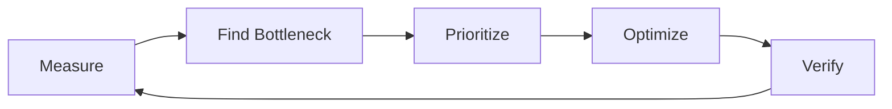
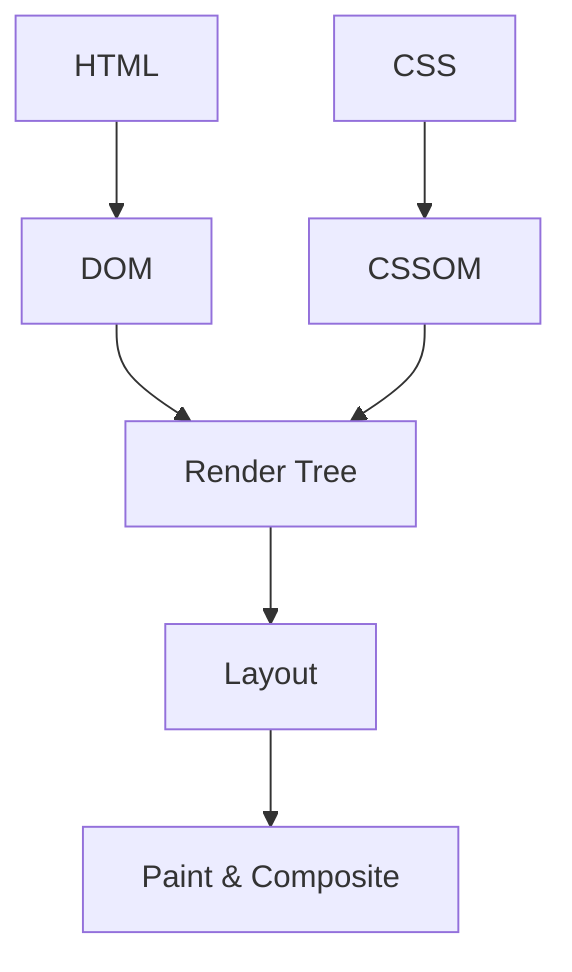
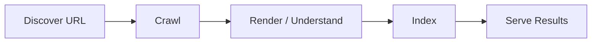

# 🚀 Chapter 43: Performance Optimization and SEO

> **BCA Web Technology — Beginner to Advanced**  
> Fast, discoverable aur user-friendly website banane ke liye measurement-based optimization aur people-first SEO seekhein.

---

## 🎯 Learning Objectives

Is chapter ke baad aap:

- web performance ke business and user impacts samjhenge;
- lab aur field data compare karenge;
- Core Web Vitals—LCP, INP and CLS—measure karenge;
- HTML, CSS, JavaScript, images aur fonts optimize karenge;
- browser caching, compression and CDN basics apply karenge;
- PHP and MySQL bottlenecks improve karenge;
- crawling, indexing and serving/ranking concepts samjhenge;
- technical, on-page and content SEO implement karenge;
- sitemap, robots, canonical and structured data use karenge;
- complete performance and SEO audit bana payenge.

---

# Part A — Web Performance

## 1. ⚡ Web Performance Kya Hai?

Web performance measure karti hai ki page kitni quickly load, display aur user interaction ka response deta hai.

Performance sirf “page load time” nahi hai. User experience mein include hai:

- useful content kab visible hua;
- button click ka response kitni jaldi mila;
- layout unexpectedly shift hua ya nahi;
- scrolling/animation smooth thi ya nahi;
- slow network/device par app usable thi ya nahi.

### Performance Kyun Important Hai?

- better user experience;
- lower bounce/frustration;
- more conversions and engagement;
- mobile/data-constrained users ke liye accessibility;
- server and bandwidth cost control;
- crawling efficiency;
- search experience ka support.

> 📌 Fast page poor content ko good nahi banata, aur SEO ranking guarantee nahi karta. Performance overall quality ka important part hai.

---

## 2. 📏 Measure First, Optimize Second

Guess-based optimization time waste kar sakti hai. Process:



### Lab Data

Controlled test environment mein generated.

Tools/examples:

- Lighthouse;
- browser DevTools;
- local performance profiles;
- WebPageTest.

Benefits: reproducible debugging.  
Limitation: every real user/network/device represent nahi karta.

### Field Data

Real users se collected performance data—RUM, browser reports or aggregated datasets.

Benefits: actual devices, networks and behavior.  
Limitation: sufficient traffic/data aur privacy-aware collection required.

> ✅ Lab data problem diagnose karta hai; field data real impact batata hai. Dono useful hain.

---

## 3. ❤️ Core Web Vitals

Core Web Vitals user experience ke three areas assess karte hain.

| Metric | Measures | Good Threshold |
|---|---|---:|
| LCP | Loading performance | ≤ 2.5 seconds |
| INP | Interaction responsiveness | ≤ 200 ms |
| CLS | Visual stability | ≤ 0.1 |

Evaluation generally page visits ke 75th percentile par mobile and desktop separately consider karti hai.

### LCP — Largest Contentful Paint

Viewport ka largest relevant content element kab paint hua.

Common LCP problems:

- slow server response;
- hero image late discovery;
- large unoptimized image;
- render-blocking CSS;
- client-side rendering delay;
- slow font/resource chain.

### INP — Interaction to Next Paint

User interactions ki responsiveness assess karta hai.

Common problems:

- long JavaScript tasks;
- heavy event handlers;
- excessive DOM work;
- synchronous expensive computation;
- third-party scripts;
- large rendering/layout work.

### CLS — Cumulative Layout Shift

Unexpected layout movement measure karta hai.

Common causes:

- images/ads without reserved dimensions;
- content existing content ke above insert;
- late font layout change;
- animations using layout-affecting properties.

---

## 4. 🛤️ Critical Rendering Path

Browser broadly:

1. HTML download and parse;
2. DOM build;
3. CSS download/parse → CSSOM;
4. render tree;
5. layout;
6. paint;
7. composite.

Render-blocking resources useful content delay kar sakte hain.



Optimization goal: above-the-fold content ke critical path ko short, small and predictable rakhein.

---

## 5. 🧱 HTML Optimization

- semantic, valid and reasonably small HTML;
- unnecessary deeply nested DOM reduce;
- critical resources early discoverable;
- image dimensions specify;
- below-fold images lazy load;
- scripts appropriate `defer`/`async`;
- duplicate/unneeded markup remove;
- redirects minimize;
- meaningful page content server response mein where practical;
- DOM size and generated elements measure.

### Script Loading

```html
<script src="/assets/app.js" defer></script>
```

`defer` script download parallel karta hai, HTML parsing block nahi karta, and document parse ke baad ordered execution hoti hai.

```html
<script src="https://analytics.example/script.js" async></script>
```

`async` independent script ke liye suitable ho sakta hai; execution order guarantee nahi.

---

## 6. 🖼️ Image Optimization

Images often page weight ka large part hoti hain.

### Correct Format

| Format | Suitable Use |
|---|---|
| JPEG | Photographs, no transparency |
| PNG | Lossless/transparency where needed |
| WebP | Modern compressed photos/graphics |
| AVIF | Strong compression; support/workflow verify |
| SVG | Logos, icons, simple vector graphics |

### Responsive Images

```html

```

Benefits:

- browser suitable file choose;
- width/height layout space reserve;
- meaningful `alt` accessibility and image understanding support.

### Lazy Loading

```html

```

> ⚠️ Main above-the-fold/LCP image ko casually lazy-load na karein; isse LCP delay ho sakta hai.

High-priority hero image—after measurement:

```html

```

Priority hints ko overuse na karein.

---

## 7. 🎨 CSS Optimization

- unused CSS identify and remove;
- production minification;
- stylesheets size/request count measure;
- critical CSS carefully;
- expensive selectors/layout patterns profile;
- animations for `transform` and `opacity` prefer;
- CSS imports/chains avoid where they delay;
- third-party frameworks ka required subset;
- responsive CSS mobile-first;
- duplicate rules reduce.

Example efficient animation:

```css
.card {
  transition:
    transform 180ms ease,
    opacity 180ms ease;
}

.card:hover {
  transform: translateY(-4px);
}
```

Layout properties बार-बार animate karne se expensive layout work ho sakta hai.

---

## 8. 🧠 JavaScript Optimization

- ship less JavaScript;
- unused libraries/features remove;
- tree shaking and minification;
- code splitting;
- noncritical modules lazy load;
- long tasks break;
- event handlers light;
- DOM reads/writes batch;
- search debounce;
- expensive work Web Worker mein where suitable;
- third-party scripts audit;
- memory leaks avoid;
- caching and compression.

Dynamic import:

```javascript
const button = document.querySelector("#open-chart");

button.addEventListener("click", async () => {
  const { renderChart } = await import("./chart.js");
  renderChart();
});
```

Yielding work concept:

```javascript
async function processItems(items) {
  for (let index = 0; index < items.length; index++) {
    processOne(items[index]);

    if (index % 100 === 0) {
      await new Promise((resolve) => setTimeout(resolve, 0));
    }
  }
}
```

Exact scheduling technique app/browser support and measurements ke according choose karein.

---

## 9. 🔤 Web Font Optimization

Fonts text render delay/layout shift create kar sakti hain.

- minimum families/weights;
- subset only required characters;
- compressed web formats;
- self-host or trusted provider based on privacy/performance;
- preload only critical font;
- `font-display` strategy;
- fallback metrics/stack choose;
- font response cache.

```css
@font-face {
  font-family: "InterCustom";
  src: url("/fonts/inter-regular.woff2") format("woff2");
  font-weight: 400;
  font-style: normal;
  font-display: swap;
}

body {
  font-family: "InterCustom", system-ui, sans-serif;
}
```

Preload:

```html
<link
  rel="preload"
  href="/fonts/inter-regular.woff2"
  as="font"
  type="font/woff2"
  crossorigin
>
```

Unused preloads waste bandwidth; critical ones only.

---

## 10. 📦 Compression and Minification

### Minification

Unnecessary whitespace/comments/long identifiers reduce karke production file smaller banata hai.

Typical:

- `app.css` → `app.min.css`;
- `app.js` → `app.min.js`.

### Compression

Server transfer par Brotli or gzip response compress kar sakta hai.

Good candidates:

- HTML;
- CSS;
- JavaScript;
- JSON;
- XML;
- SVG.

Already compressed images/videos ko re-compress transfer layer par limited benefit.

Check DevTools response headers:

```http
Content-Encoding: br
```

---

## 11. 🗄️ Browser Caching

Static versioned assets long cache kar sakte hain:

```http
Cache-Control: public, max-age=31536000, immutable
```

Filename content hash:

```text
app.a8f31c2.js
styles.61de90a.css
```

HTML commonly shorter/revalidation policy use karta hai:

```http
Cache-Control: no-cache
ETag: "page-v42"
```

`no-cache` means response reuse se pehle revalidate; “do not store” nahi.

Sensitive response:

```http
Cache-Control: no-store
```

> 📌 Cache policy resource sensitivity and update strategy se decide karein.

---

## 12. 🌍 CDN and Network Optimization

**CDN — Content Delivery Network** geographically distributed servers se assets/content closer location se deliver kar sakta hai.

Benefits:

- lower latency;
- origin offload;
- caching;
- resilience/security features depending on service.

Costs/risks:

- configuration complexity;
- cache invalidation;
- privacy/vendor dependence;
- stale or sensitive data caching;
- cost.

Other network techniques:

- HTTPS and modern protocol support;
- redirect chains reduce;
- connection origins reduce;
- DNS/preconnect hints only measured need;
- resource size/request priority optimize.

---

## 13. 🐘 PHP Back-End Performance

- production opcode cache;
- efficient autoloading/build config;
- unnecessary file/network work remove;
- response caching where safe;
- external API timeouts;
- repeated calls cache/batch;
- expensive reports background jobs;
- pagination;
- memory/time limits;
- slow-request profiling;
- debug tooling production disable;
- horizontal scaling when measurement justifies.

### Simple Timing

```php
<?php
$start = hrtime(true);

// Operation to measure
$students = $repository->findAll();

$elapsedMs = (hrtime(true) - $start) / 1_000_000;

error_log(sprintf(
    'findAll duration: %.2f ms',
    $elapsedMs
));
```

Avoid sensitive data logs. Real monitoring request duration, DB time, external API time, errors and percentiles track kar sakta hai.

---

## 14. 🐬 MySQL Performance

- query-specific indexes;
- `EXPLAIN` query plan;
- select needed columns only;
- N+1 query pattern avoid;
- bounded pagination;
- proper joins;
- suitable types;
- connection handling;
- transactions short;
- aggregate/precomputed data where justified;
- slow-query logging;
- backups/maintenance;
- cache only with invalidation plan.

Example:

```sql
EXPLAIN
SELECT student_id, name, semester
FROM students
WHERE course_id = 2
ORDER BY student_id
LIMIT 20;
```

Potential index:

```sql
CREATE INDEX idx_students_course_id
ON students (course_id, student_id);
```

> ⚠️ Index reads help kar sakta hai but writes/storage cost badhata hai. Actual query plan and workload measure karein.

### N+1 Problem

Inefficient:

1. all students query;
2. each student ke liye separate course query.

Better join:

```sql
SELECT
    s.student_id,
    s.name,
    c.course_name
FROM students AS s
JOIN courses AS c
    ON s.course_id = c.course_id
ORDER BY s.student_id
LIMIT 20;
```

---

## 15. 🧪 Performance Tools

| Tool | Use |
|---|---|
| Chrome/Edge DevTools Network | Requests, size, waterfall, cache |
| Performance panel | Main-thread work, rendering |
| Lighthouse | Lab audit and opportunities |
| PageSpeed Insights | Lab + available field data |
| Search Console | Search and Core Web Vitals reports |
| WebPageTest | Detailed controlled tests |
| MySQL `EXPLAIN` | Query execution plan |
| Server/APM logs | Back-end timings and errors |

### Waterfall Reading

Look for:

- slow initial response;
- redirect chain;
- render-blocking CSS;
- late-discovered LCP image;
- large JS;
- sequential dependency chain;
- no compression;
- cache misses;
- slow third parties.

---

# Part B — Search Engine Optimization

## 16. 🔎 SEO Kya Hai?

**SEO — Search Engine Optimization**  
Pronunciation: **एस-ई-ओ**

SEO search engines ko content discover and understand karne, aur users ko relevant pages find/choose karne mein help karne ki practice hai.

SEO ka focus hona chahiye:

- helpful, reliable, people-first content;
- crawlable and understandable pages;
- good user experience;
- clear site structure;
- honest metadata;
- technical accessibility.

> 🚫 No one can guarantee a specific ranking. Search engines many systems/signals use karte hain, aur practices change ho sakti hain.

---

## 17. 🕷️ Search Process

Simplified stages:

1. **Crawling:** automated crawlers pages discover/download.
2. **Indexing:** content analyze/store.
3. **Serving search results:** query ke liye useful results select/display.



Crawled page necessarily indexed/ranked ho, guarantee nahi.

---

## 18. 📝 Title and Meta Description

### Unique Page Title

```html
<title>BCA Web Technology Course | City College</title>
```

Good title:

- page-specific;
- descriptive and concise;
- natural important terms;
- misleading/repetitive stuffing nahi;
- site/brand context where useful.

### Meta Description

```html
<meta
  name="description"
  content="Explore the BCA Web Technology course, subjects, practical projects and admission details at City College."
>
```

Meta description directly ranking guarantee nahi, but search result snippet understanding/click decision support kar sakti hai. Search engine query ke according different snippet choose kar sakta hai.

---

## 19. 🧱 Heading and Semantic Structure

```html
<main>
  <h1>BCA Web Technology Course</h1>

  <section>
    <h2>Course Overview</h2>
    <p>...</p>
  </section>

  <section>
    <h2>Subjects</h2>
    <h3>Web Development</h3>
    <p>...</p>
  </section>
</main>
```

- clear page topic;
- logical heading hierarchy;
- semantic HTML;
- visible content and headings aligned;
- headings styling shortcut ke liye misuse na karein.

Accessibility and SEO often same good structure se benefit karte hain.

---

## 20. 🔗 Crawlable Links and Site Architecture

Prefer real links:

```html
<a href="/courses/bca/web-technology">
  Web Technology
</a>
```

Avoid only JavaScript click handler for essential navigation when a normal link works.

Good architecture:

```text
Home
├── Courses
│   ├── BCA
│   │   └── Web Technology
│   └── BBA
└── Admissions
    ├── Eligibility
    └── Apply
```

Benefits:

- users navigate;
- crawlers discover;
- contextual internal links;
- important pages not orphaned;
- breadcrumbs.

Anchor text descriptive:

- weak: “Click here”
- better: “Download the BCA admission guide”

---

## 21. 🌍 SEO-Friendly URLs

Good:

```text
https://college.example/courses/bca/web-technology
```

Less useful:

```text
https://college.example/page.php?id=843&cat=7
```

Guidelines:

- readable;
- concise;
- stable;
- lowercase/hyphen convention;
- unnecessary parameters avoid;
- same content ke duplicate URL variants control;
- old URL move par suitable redirect.

URL keywords alone se quality replace nahi hoti.

---

## 22. 🧭 Canonical URLs

Duplicate/similar pages ke preferred URL indicate:

```html
<link
  rel="canonical"
  href="https://college.example/courses/bca"
>
```

Canonical hint useful hai when:

- tracking parameters;
- print/filter variants;
- same content multiple paths;
- HTTP/HTTPS or hostname consolidation.

Support with:

- internal links preferred URL par;
- sitemap preferred URLs;
- consistent redirects;
- no conflicting directives.

---

## 23. 🤖 robots.txt and Meta Robots

### robots.txt

Root par:

```text
User-agent: *
Disallow: /admin/
Disallow: /private-reports/

Sitemap: https://college.example/sitemap.xml
```

> 🚨 `robots.txt` access control/security nahi. Disallowed URL still known/linked ho sakti hai. Sensitive resources proper authentication se protect karein.

### Meta Robots

```html
<meta name="robots" content="noindex, nofollow">
```

Page ko indexing se control karne ke liye directives use ho sakti hain. Crawler ko page directive see karne ke liye access required ho sakta hai—robots blocking and noindex ko conflicting way mein use na karein.

---

## 24. 🗺️ XML Sitemap

```xml
<?xml version="1.0" encoding="UTF-8"?>
<urlset xmlns="http://www.sitemaps.org/schemas/sitemap/0.9">
  <url>
    <loc>https://college.example/</loc>
    <lastmod>2026-08-30</lastmod>
  </url>
  <url>
    <loc>https://college.example/courses/bca</loc>
    <lastmod>2026-08-25</lastmod>
  </url>
</urlset>
```

Sitemap:

- important canonical URLs list;
- accurate last modification;
- large sites mein index/split;
- Search Console/robots declaration;
- discovery help, indexing guarantee nahi.

---

## 25. 🧩 Structured Data

Structured data page meaning machine-readable form mein describe kar sakta hai. Search features eligibility may improve, but rich result guarantee nahi.

JSON-LD example:

```html
<script type="application/ld+json">
{
  "@context": "https://schema.org",
  "@type": "Course",
  "name": "BCA Web Technology",
  "description": "Beginner to advanced web technology course.",
  "provider": {
    "@type": "CollegeOrUniversity",
    "name": "City College",
    "url": "https://college.example"
  }
}
</script>
```

Rules:

- page visible content se match;
- correct supported type/properties;
- misleading/fake markup nahi;
- official rich-result guidelines;
- validator/rich-results test;
- errors monitor.

---

## 26. 🖼️ Image SEO and Accessibility

```html
<figure>
  
  <figcaption>
    Web development practical session
  </figcaption>
</figure>
```

- descriptive filename;
- relevant alt text;
- decorative image alt empty;
- nearby context;
- responsive/compressed;
- dimensions;
- searchable page access;
- image sitemap only if needed.

Keyword stuffing in alt text accessibility harm karta hai.

---

## 27. 📱 Mobile, Accessibility and HTTPS

Good search/user experience:

- responsive layout;
- readable text;
- appropriately sized tap targets;
- no intrusive content blocking;
- keyboard access;
- form labels;
- color contrast;
- semantic landmarks;
- HTTPS;
- stable and fast experience.

Accessibility SEO trick nahi; equal access ka core requirement hai. Multiple benefits overlap kar sakte hain.

---

## 28. 🧠 People-First Content

Good content:

- user ka actual question solve;
- first-hand expertise/evidence where relevant;
- clear author/source;
- accurate and updated;
- original value;
- easy structure;
- honest title;
- citations where needed;
- no mass low-value duplication.

Avoid:

- keyword stuffing;
- hidden text/links;
- copied thin pages;
- misleading titles;
- doorway pages;
- buying/manipulating links;
- automatic content without quality/user value.

> ✅ Content search engine ke liye nahi, users ke liye banayein—while making it understandable and discoverable.

---

## 29. ⚙️ JavaScript SEO

JavaScript-heavy pages mein ensure:

- essential content accessible/renderable;
- meaningful URLs;
- navigation uses crawlable links;
- server errors proper status codes;
- titles/meta per route;
- canonical correct;
- robots not blocking essential resources;
- lazy-loaded content discoverable;
- client-side errors monitor;
- server-side rendering/static generation where beneficial, not blindly.

User and crawler rendered view inspect with URL Inspection/Rich Results testing when applicable.

---

## 30. 🔁 Redirects and Error Pages

Permanent move:

```http
HTTP/1.1 301 Moved Permanently
Location: https://example.com/new-page
```

Temporary:

```http
HTTP/1.1 302 Found
Location: https://example.com/temporary-page
```

Guidelines:

- redirect chains/loops avoid;
- old page to closest relevant new page;
- removed content may return 404/410 as appropriate;
- custom 404 helpful but actual 404 status;
- soft 404 avoid;
- internal links update.

---

## 31. 📊 SEO Measurement

Useful tools/data:

- Search Console impressions, clicks, queries, coverage;
- analytics engagement/conversions;
- server logs/crawl patterns;
- rank visibility as one signal;
- link/index checks;
- performance field data;
- accessibility audits.

Focus:

- organic users goals complete kar rahe?
- relevant pages discovered/indexed?
- technical errors?
- content useful and current?
- performance stable across devices?

SEO measurement privacy and consent requirements follow kare.

---

## 32. 🧪 Complete Practical: Performance and SEO Audit

Suppose college course page slow and poorly discoverable hai.

### Step 1: Baseline

Record:

- LCP, INP, CLS;
- transfer size/request count;
- server response time;
- mobile/desktop data;
- indexed status;
- title/description;
- crawl errors;
- organic clicks/conversions.

### Step 2: Inspect Problems

Example findings:

| Finding | Impact |
|---|---|
| 4 MB hero JPEG | Slow LCP |
| Hero lazy-loaded | Late LCP |
| No image dimensions | CLS |
| 600 KB unused JS | Slow interaction |
| CSS import chain | Render delay |
| No caching | Repeat visits slow |
| Duplicate page titles | Poor page distinction |
| Orphan course page | Discovery difficult |
| Multiple URL variants | Duplicate signals |
| No sitemap | Discovery support missing |

### Step 3: Optimized HTML

```html
<!doctype html>
<html lang="en">
<head>
  <meta charset="utf-8">
  <meta name="viewport" content="width=device-width, initial-scale=1">

  <title>BCA Web Technology Course | City College</title>

  <meta
    name="description"
    content="Learn HTML, CSS, JavaScript, PHP and MySQL in the BCA Web Technology course at City College."
  >

  <link
    rel="canonical"
    href="https://college.example/courses/bca/web-technology"
  >

  <link rel="stylesheet" href="/assets/app.61de90a.css">
  <script src="/assets/app.a8f31c2.js" defer></script>
</head>
<body>
  <header>
    <nav aria-label="Main navigation">
      <a href="/">Home</a>
      <a href="/courses">Courses</a>
      <a href="/admissions">Admissions</a>
    </nav>
  </header>

  <main>
    <h1>BCA Web Technology Course</h1>

    

    <section>
      <h2>What You Will Learn</h2>
      <p>
        Build responsive front ends and secure PHP–MySQL applications.
      </p>
    </section>
  </main>
</body>
</html>
```

### Step 4: Back-End Query

Before: full table and repeated course lookup.  
After:

```sql
SELECT
    c.course_id,
    c.course_name,
    c.description,
    d.department_name
FROM courses AS c
JOIN departments AS d
    ON c.department_id = d.department_id
WHERE c.slug = :slug
LIMIT 1;
```

Index after plan measurement:

```sql
CREATE UNIQUE INDEX uq_courses_slug
ON courses (slug);
```

### Step 5: Cache Policy

```http
# Hashed static assets
Cache-Control: public, max-age=31536000, immutable

# HTML that should revalidate
Cache-Control: no-cache
```

### Step 6: Verify

- same test settings;
- mobile and desktop;
- field data later;
- visual/accessibility regression;
- form/function tests;
- search page inspection;
- structured-data validation;
- server logs/error rates.

### Step 7: Document

```text
Metric            Before      After       Goal
LCP               4.8 s       2.2 s       ≤ 2.5 s
INP               310 ms      170 ms      ≤ 200 ms
CLS               0.24        0.04        ≤ 0.1
Page transfer     5.1 MB      1.2 MB      Budget met
JS transfer       620 KB      210 KB      Budget met
```

Numbers example hain; real page se actual measurements record karein.

---

## 33. 💰 Performance Budgets

Performance budget regressions stop karta hai.

Example:

| Metric | Budget |
|---|---:|
| Total initial transfer | ≤ 1.5 MB |
| JavaScript compressed | ≤ 250 KB |
| Initial requests | ≤ 50 |
| LCP lab target | ≤ 2.5 s |
| CLS | ≤ 0.1 |
| Main-thread long tasks | Project-specific limit |

Budgets build/CI checks mein automate kiye ja sakte hain. User field data still monitor karein.

---

## 34. 🐞 Common Mistakes

| Mistake | Problem | Better Approach |
|---|---|---|
| Optimize without baseline | Wrong work | Measure bottleneck |
| Only desktop test | Mobile users missed | Device/network variety |
| Hero image lazy | LCP delayed | Eager/high priority if measured |
| No dimensions | Layout shifts | Width/height/aspect ratio |
| Huge framework for tiny page | JS/CSS cost | Required code only |
| Cache everything forever | Stale/sensitive content | Resource-specific policy |
| Index every DB column | Write/storage cost | Query-driven indexes |
| Keyword stuffing | Poor user/spam risk | Natural helpful content |
| Same title everywhere | Pages unclear | Unique descriptive titles |
| robots.txt for secrets | No access control | Authentication/authorization |
| Sitemap with bad URLs | Crawl waste | Canonical valid URLs |
| SEO ranking guarantee | Misleading | Evidence-based improvement |

---

## 35. ✅ Performance Checklist

- [ ] Lab and field baseline?
- [ ] LCP, INP, CLS tracked?
- [ ] LCP resource identified/prioritized?
- [ ] Images responsive, compressed and dimensioned?
- [ ] Below-fold content lazy-loaded?
- [ ] JS/CSS minimized and unused code removed?
- [ ] Fonts limited and optimized?
- [ ] Compression enabled?
- [ ] Hashed static assets cached?
- [ ] Third-party scripts justified?
- [ ] PHP requests profiled?
- [ ] SQL plans/indexes measured?
- [ ] Performance budget and regression checks?

---

## 36. ✅ SEO Checklist

- [ ] Helpful people-first content?
- [ ] Unique title and useful description?
- [ ] One clear main topic/heading?
- [ ] Semantic and accessible HTML?
- [ ] Crawlable internal links?
- [ ] Stable readable URLs?
- [ ] Canonical consistent?
- [ ] robots directives intentional?
- [ ] Sitemap only canonical URLs?
- [ ] Correct status/redirect behavior?
- [ ] Image alt and context?
- [ ] Structured data matches visible content?
- [ ] Mobile/HTTPS/performance good?
- [ ] Search Console/analytics monitored?
- [ ] No manipulative spam tactics?

---

## 37. 🧾 Chapter Summary

- Web performance loading, responsiveness and visual stability measure karti hai.
- Lab tests debugging aur field data real-user impact dikhate hain.
- Core Web Vitals LCP, INP and CLS hain.
- Critical rendering path ko shorten karna useful content faster show karta hai.
- Responsive compressed images, correct dimensions and selective lazy loading important hain.
- Less CSS/JS, optimized fonts, compression and caching transfer/main-thread cost reduce karte hain.
- PHP/MySQL performance profiling, efficient queries and correct indexes se improve hoti hai.
- SEO crawlers ko content discover/understand aur users ko relevant pages find karne mein help karta hai.
- Search broadly crawling, indexing and serving stages use karta hai.
- Titles, descriptions, headings, links, URLs, canonical, robots and sitemaps technical clarity improve karte hain.
- Structured data accurate visible content se match hona chahiye.
- People-first content, accessibility, mobile usability, security and speed sustainable quality support karte hain.
- Rankings guaranteed nahi; measure, improve and monitor continuously.

---

## 38. 📝 MCQs

1. Loading performance ka Core Web Vital hai:  
   A. LCP  B. CLS  C. DNS  D. SEO

2. Interactivity measure karta hai:  
   A. INP  B. XML  C. ALT  D. CDN only

3. Visual stability metric hai:  
   A. LCP  B. CLS  C. PHP  D. HTTP

4. Below-fold image loading delay karne ka attribute hai:  
   A. `loading="lazy"`  B. `defer="image"`  C. `cache="no"`  D. `async="img"`

5. Preferred duplicate URL indicate karta hai:  
   A. Canonical link  B. H1 only  C. CSS  D. Cookie

6. Crawlers ko important URLs list karta hai:  
   A. XML sitemap  B. Session  C. SQL index  D. JavaScript loop

7. People-first SEO ka focus hai:  
   A. Keyword stuffing  B. Helpful user content  C. Hidden links  D. Ranking guarantee

**Answers:** 1-A, 2-A, 3-B, 4-A, 5-A, 6-A, 7-B

---

## 39. ✏️ Fill in the Blanks

1. Real-user performance data ______ data kehlata hai.
2. Static assets worldwide edge locations se serve karne wala network ______ hai.
3. Search engine URL discover/download process ______ hai.
4. Page ko index na karne ka meta directive ______ hai.
5. Query plan inspect karne ka MySQL command ______ hai.

**Answers:** 1. field/RUM, 2. CDN, 3. crawling, 4. `noindex`, 5. `EXPLAIN`

---

## 40. ✔️ True or False

1. Fast page automatically number-one rank guarantee karta hai. — **False**
2. Image dimensions CLS reduce kar sakti hain. — **True**
3. `robots.txt` sensitive pages secure karta hai. — **False**
4. Sitemap every listed page indexing guarantee karta hai. — **False**
5. Prepared performance baseline useful hai. — **True**
6. Accessibility aur SEO mein overlap ho sakta hai. — **True**

---

## 41. 🎤 Viva Questions

1. Web performance kya hai?
2. Lab and field data compare karein.
3. LCP, INP and CLS explain karein.
4. Critical rendering path kya hai?
5. Hero image optimization kaise karenge?
6. `defer` and `async` compare karein.
7. Browser caching and hashed filename ka relation kya hai?
8. N+1 query problem kya hai?
9. SEO define karein.
10. Crawling, indexing and serving compare karein.
11. Canonical URL ka purpose kya hai?
12. robots.txt and noindex compare karein.
13. Structured data kya hai?
14. People-first content kya hota hai?
15. Performance budget kyun useful hai?

---

## 42. 🧪 Practical Exercises

### Beginner

1. Page image sizes and request count DevTools se note karein.
2. Images WebP/responsive markup mein optimize karein.
3. Missing width/height fix karein.
4. Unique title, description and heading add karein.

### Intermediate

5. Lighthouse audit before/after compare karein.
6. CSS/JS minification and caching configure karein.
7. MySQL slow query ko `EXPLAIN` and index se improve karein.
8. robots.txt, sitemap.xml and canonical implement karein.
9. Course structured data add and validate karein.

### Advanced

10. Real-user Core Web Vitals collection design karein.
11. Performance budgets CI mein enforce karein.
12. Full technical SEO audit and prioritized backlog banayein.
13. JavaScript-rendered page ko crawl/render test karein.
14. Migration ke liye redirects, canonicals and monitoring plan banayein.

---

## 43. 📖 Exam-Oriented Questions

### Short Answer

1. Core Web Vitals define kijiye.
2. Lab and field measurement mein difference likhiye.
3. Browser caching explain kijiye.
4. SEO-friendly URL kya hota hai?
5. robots.txt and XML sitemap ka role likhiye.
6. Canonical tag kya hai?

### Long Answer

1. Front-end performance optimization techniques examples ke saath explain kijiye.
2. PHP and MySQL application performance improve karne ke steps likhiye.
3. Technical and on-page SEO ko suitable HTML example ke saath explain kijiye.
4. Core Web Vitals measurement and improvement workflow describe kijiye.
5. Complete website performance and SEO audit process likhiye.
6. People-first content and unethical SEO tactics compare kijiye.

---

## 44. 🔁 One-Minute Revision

```text
Performance → speed + responsiveness + stability
Lab data → controlled test
Field data → real users
LCP → loading
INP → interaction response
CLS → layout stability
Critical path → display-required work
Lazy loading → defer noncritical resource
Cache → reuse response
CDN → distributed delivery
SEO → search understanding/discovery
Crawling → page discovery/download
Indexing → content analysis/storage
Canonical → preferred URL
robots.txt → crawl directives
Sitemap → URL discovery list
Structured data → machine-readable meaning
People-first → useful for users
```

---

## 45. 🔗 Official References

- [web.dev — Web Vitals](https://web.dev/articles/vitals)
- [web.dev — Core Web Vitals Tools](https://web.dev/articles/vitals-tools)
- [MDN Web Performance](https://developer.mozilla.org/en-US/docs/Web/Performance)
- [Google SEO Starter Guide](https://developers.google.com/search/docs/fundamentals/seo-starter-guide)
- [Google Search Essentials](https://developers.google.com/search/docs/essentials)
- [Google — How Search Works](https://developers.google.com/search/docs/fundamentals/how-search-works)
- [Google — SEO Guide for Developers](https://developers.google.com/search/docs/fundamentals/get-started-developers)
- [Schema.org](https://schema.org/)

---

[⬅️ Previous Chapter](42-web-security.md) · [📚 Table of Contents](../SUMMARY.md) · **Next: Progressive Web Applications and Modern Web Trends ➡️**
