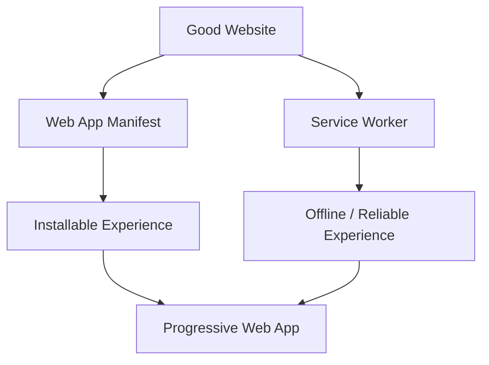
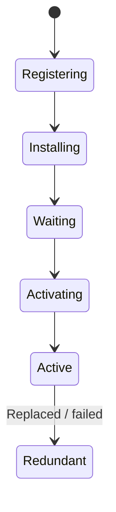

# 📱 Chapter 44: Progressive Web Applications and Modern Web Trends

> **BCA Web Technology — Beginner to Advanced**  
> Website ki reach ko app-like reliability, installability aur modern platform capabilities ke saath combine karna seekhein.

---

## 🎯 Learning Objectives

Is chapter ke baad aap:

- Progressive Web Application ka meaning aur benefits samjhenge;
- progressive enhancement and capability detection apply karenge;
- web app manifest create karenge;
- service worker lifecycle and scope explain karenge;
- offline cache strategies implement karenge;
- IndexedDB, background sync and notifications ka purpose jaanenge;
- PWA installation/update experience design karenge;
- PWA security, privacy and cache pitfalls identify karenge;
- modern architectures—SPA, SSR, SSG, islands, serverless/edge—compare karenge;
- Web Components, WebAssembly, Workers and current CSS/platform trends evaluate karenge.

---

# Part A — Progressive Web Applications

## 1. 📱 PWA Kya Hai?

**PWA — Progressive Web Application**  
Pronunciation: **प्रोग्रेसिव वेब एप्लिकेशन**

PWA ek web application hai jo modern web APIs se enhanced capabilities, reliability aur installable/app-like experience offer kar sakti hai—while normal web URL and reach maintain karti hai.

PWA ek single framework ya file format nahi. Yeh web foundation plus progressive features ka approach hai.

### Core Ideas

| Quality | Meaning |
|---|---|
| Reachable | URL/link se access |
| Responsive | Different screens par usable |
| Reliable | Weak/offline network mein planned experience |
| Installable | Supporting platforms par app-like launch |
| Secure | HTTPS/secure context |
| Progressive | Basic functionality widest users ke liye |
| Capable | Platform APIs where supported/needed |

> 💡 PWA “website ko APK bana dena” nahi. Good PWA pehle good, fast, accessible website hoti hai.

---

## 2. 📈 Progressive Enhancement

**Progressive enhancement** mein basic content and actions broad platform support par work karte hain. Extra capabilities available hon to enhance hoti hain.

Example:

```html
<form action="/search.php" method="get" id="search-form">
  <label for="q">Search students</label>
  <input id="q" name="q" type="search">
  <button type="submit">Search</button>
</form>
```

JavaScript available ho to AJAX enhance:

```javascript
const form = document.querySelector("#search-form");

if ("fetch" in window && form) {
  form.addEventListener("submit", async (event) => {
    event.preventDefault();
    // Fetch and update results progressively.
  });
}
```

JavaScript fail ho tab normal form still server par submit hota hai.

---

## 3. 🧱 PWA Building Blocks

Common foundation:

1. responsive, accessible web application;
2. HTTPS;
3. web app manifest;
4. suitable icons;
5. service worker for offline/caching when useful;
6. good performance;
7. install/update UX;
8. testing across target browsers/devices.



Browser/platform support and install criteria differ, so current compatibility test karein.

---

## 4. 🗂️ Web App Manifest

Manifest JSON file browser/OS ko installed web app ke name, icon, start location and display preferences batati hai.

### `app.webmanifest`

```json
{
  "id": "/student-app/",
  "name": "College Student App",
  "short_name": "Student App",
  "description": "View courses and manage student records.",
  "start_url": "/student-app/",
  "scope": "/student-app/",
  "display": "standalone",
  "background_color": "#eff6ff",
  "theme_color": "#2563eb",
  "lang": "en",
  "icons": [
    {
      "src": "/student-app/icons/icon-192.png",
      "sizes": "192x192",
      "type": "image/png"
    },
    {
      "src": "/student-app/icons/icon-512.png",
      "sizes": "512x512",
      "type": "image/png"
    },
    {
      "src": "/student-app/icons/icon-maskable-512.png",
      "sizes": "512x512",
      "type": "image/png",
      "purpose": "maskable"
    }
  ]
}
```

HTML mein link:

```html
<link rel="manifest" href="/student-app/app.webmanifest">
<meta name="theme-color" content="#2563eb">
```

All installable pages manifest reference karein.

### Important Members

| Member | Purpose |
|---|---|
| `id` | App ki stable identity |
| `name` | Full app name |
| `short_name` | Compact name |
| `start_url` | Installed app launch URL |
| `scope` | App navigation boundary |
| `display` | Browser UI/display preference |
| `theme_color` | UI theme color |
| `background_color` | Initial launch background |
| `icons` | Install/launcher icons |
| `description` | App description |

> 📌 Manifest installability metadata hai. Service worker offline behavior separately implement karta hai.

---

## 5. 🖼️ Icons and Display Modes

### Icon Guidelines

- multiple required/recommended sizes;
- crisp square icons;
- transparent and maskable variants as needed;
- important logo safe area;
- files actually accessible;
- correct MIME types;
- device testing.

### Display Modes

| Mode | Experience |
|---|---|
| `browser` | Full browser interface |
| `standalone` | Separate app-like window |
| `minimal-ui` | Limited browser controls |
| `fullscreen` | Fullscreen where supported |

Fallback behavior platform/browser decide kar sakta hai.

CSS detect:

```css
@media (display-mode: standalone) {
  .install-help {
    display: none;
  }
}
```

JavaScript:

```javascript
const isStandalone = window.matchMedia(
  "(display-mode: standalone)"
).matches;
```

---

## 6. ⚙️ Service Worker Kya Hai?

Service worker browser-managed JavaScript worker hai jo application aur network ke beech requests intercept kar sakta hai and background events handle kar sakta hai.

Capabilities may include:

- offline caching;
- request strategies;
- push events;
- background sync;
- update lifecycle.

Limitations:

- DOM direct access nahi;
- browser lifecycle control karta hai;
- in-memory state persistent assume nahi;
- secure context generally required;
- support varies by feature/browser;
- wrong caching logic stale/broken app create kar sakti hai.

> 🗣️ Service Worker pronunciation: **सर्विस वर्कर**.

---

## 7. 🔄 Service Worker Lifecycle

Main stages:

1. **Register**
2. **Install**
3. **Waiting**
4. **Activate**
5. **Control pages**
6. **Update**



New worker commonly waiting state mein rehta hai jab old worker pages control kar raha ho. Update UX carefully design karein.

---

## 8. 📝 Service Worker Registration

Main application JavaScript:

```javascript
if ("serviceWorker" in navigator) {
  window.addEventListener("load", async () => {
    try {
      const registration = await navigator.serviceWorker.register(
        "/student-app/service-worker.js",
        {
          scope: "/student-app/",
        }
      );

      console.log(
        "Service worker scope:",
        registration.scope
      );
    } catch (error) {
      console.error("Registration failed:", error);
    }
  });
}
```

Scope service worker ke controlled URLs decide karta hai. Worker file placement/scope carefully choose karein.

> 📌 Service worker file ka URL stable rakhein. Asset bundling hash strategy worker updates ke lifecycle se align honi chahiye.

---

## 9. 📦 App Shell Precaching

**App shell** basic UI resources hain:

- core HTML/offline page;
- CSS;
- essential JS;
- logo/icons.

### `service-worker.js`

```javascript
const CACHE_VERSION = "student-app-v1";
const APP_SHELL = [
  "/student-app/",
  "/student-app/offline.html",
  "/student-app/assets/app.css",
  "/student-app/assets/app.js",
  "/student-app/icons/icon-192.png",
];

self.addEventListener("install", (event) => {
  event.waitUntil(
    caches.open(CACHE_VERSION)
      .then((cache) => cache.addAll(APP_SHELL))
  );
});
```

If one `addAll()` request fails, install may fail. Precache list valid and reliably accessible honi chahiye.

---

## 10. 🧹 Activation and Old Cache Cleanup

```javascript
self.addEventListener("activate", (event) => {
  event.waitUntil(
    caches.keys().then((keys) =>
      Promise.all(
        keys
          .filter((key) => key !== CACHE_VERSION)
          .map((key) => caches.delete(key))
      )
    )
  );
});
```

> ⚠️ Same origin par multiple apps/service workers ho sakte hain. Cache names app-specific prefix use karein; unrelated cache blindly delete na karein.

Optional control after activation:

```javascript
self.addEventListener("activate", (event) => {
  event.waitUntil(self.clients.claim());
});
```

`skipWaiting()`/`clients.claim()` update behavior change karte hain. Incompatible app versions mein unexpected issues ho sakte hain, so update plan ke saath use karein.

---

## 11. 🌐 Fetch Event

```javascript
self.addEventListener("fetch", (event) => {
  if (event.request.method !== "GET") {
    return;
  }

  event.respondWith(
    caches.match(event.request).then((cached) => {
      return cached ?? fetch(event.request);
    })
  );
});
```

Yeh basic cache-first logic hai. Har resource ke liye same strategy suitable nahi.

---

## 12. 🧠 Caching Strategies

### Cache First

1. cache check;
2. found → return;
3. missing → network and optionally cache.

Suitable: hashed static assets, icons.

### Network First

1. network try;
2. success → update cache;
3. failure → cached response.

Suitable: changing pages/data when freshness important and offline fallback allowed.

### Stale-While-Revalidate

1. cached response immediately;
2. background network fetch;
3. cache update for next time.

Suitable: content where slightly stale response acceptable.

### Network Only

Always network.

Suitable: sensitive/current state, transactions.

### Cache Only

Only precached resources.

Suitable: fixed app-shell resources in controlled cases.

| Resource | Possible Strategy |
|---|---|
| Hashed CSS/JS | Cache first |
| Page navigation | Network first + offline fallback |
| News/catalog | Stale-while-revalidate |
| Payment/login action | Network only |
| Offline page | Cache only/precache |

> 🔐 Sensitive authenticated responses ko casual shared/cache storage mein save na karein.

---

## 13. 📴 Offline Navigation Fallback

```javascript
self.addEventListener("fetch", (event) => {
  const request = event.request;

  if (
    request.mode === "navigate" &&
    request.method === "GET"
  ) {
    event.respondWith(
      fetch(request).catch(() =>
        caches.match("/student-app/offline.html")
      )
    );
  }
});
```

Offline page:

```html
<!doctype html>
<html lang="en">
<head>
  <meta charset="utf-8">
  <meta name="viewport" content="width=device-width, initial-scale=1">
  <title>You Are Offline | Student App</title>
</head>
<body>
  <main>
    <h1>You’re offline</h1>
    <p>
      Previously saved content may still be available.
      Reconnect and try again.
    </p>
    <button type="button" onclick="location.reload()">
      Retry
    </button>
  </main>
</body>
</html>
```

Offline UX honest ho: action queued/saved hai ya nahi clearly batayein.

---

## 14. 🔁 Network-First Example

```javascript
async function networkFirst(request) {
  const cache = await caches.open("student-runtime-v1");

  try {
    const response = await fetch(request);

    if (response.ok) {
      await cache.put(request, response.clone());
    }

    return response;
  } catch {
    const cached = await cache.match(request);

    if (cached) {
      return cached;
    }

    throw new Error("Network and cache unavailable");
  }
}

self.addEventListener("fetch", (event) => {
  if (event.request.mode === "navigate") {
    event.respondWith(networkFirst(event.request));
  }
});
```

Responses clone karna necessary ho sakta hai because bodies streams hain and once consume hoti hain.

---

## 15. 🔄 Stale-While-Revalidate Example

```javascript
async function staleWhileRevalidate(request) {
  const cache = await caches.open("student-data-v1");
  const cached = await cache.match(request);

  const networkPromise = fetch(request).then((response) => {
    if (response.ok) {
      cache.put(request, response.clone());
    }

    return response;
  });

  return cached ?? networkPromise;
}
```

For APIs, decide:

- data sensitivity;
- stale data acceptable duration;
- per-user cache isolation;
- logout cleanup;
- authorization changes;
- cache key variations;
- storage quota.

---

## 16. 🗃️ Cache Storage vs IndexedDB

| Cache Storage | IndexedDB |
|---|---|
| Request/Response pairs | Structured records |
| Network resource caching | App data/offline drafts |
| Service-worker friendly | Pages and workers |
| URL-based lookup | Key/index-based lookup |
| HTTP response objects | JavaScript-compatible data |

Examples:

- CSS/image/offline HTML → Cache Storage;
- unsent form drafts/course records → IndexedDB.

Do not treat browser storage as permanent backup. Browser/user can clear it and quota/eviction policies apply.

---

## 17. 🧾 Offline Data and Synchronization

Possible offline workflow:

1. User form fills.
2. Data validate locally.
3. Offline request/draft IndexedDB mein queue.
4. UI clearly says “pending sync.”
5. Network return par background/manual sync.
6. Server authenticates, validates and deduplicates.
7. Conflict result user ko show.

Challenges:

- duplicate requests;
- record conflicts;
- auth token expiry;
- ordering;
- partial failure;
- privacy on shared device;
- storage limits;
- background API support variability.

Idempotency keys and server-side conflict handling important hain.

---

## 18. 🔔 Push Notifications

Push flow broadly:

1. user permission after clear benefit/context;
2. service worker subscription;
3. subscription server par safely store;
4. push service event;
5. worker notification show;
6. click app route open.

Service worker notification event concept:

```javascript
self.addEventListener("push", (event) => {
  const data = event.data?.json() ?? {
    title: "Student App",
    body: "New update available.",
  };

  event.waitUntil(
    self.registration.showNotification(data.title, {
      body: data.body,
      icon: "/student-app/icons/icon-192.png",
      data: {
        url: data.url ?? "/student-app/",
      },
    })
  );
});

self.addEventListener("notificationclick", (event) => {
  event.notification.close();

  event.waitUntil(
    clients.openWindow(event.notification.data.url)
  );
});
```

### Notification Ethics

- permission prompt immediately on first page load avoid;
- exact value explain;
- optional;
- frequency control;
- easy unsubscribe;
- sensitive data lock-screen notification mein avoid;
- user preferences;
- platform/browser support test;
- server subscription authorization and cleanup.

> 🚫 Notifications engagement trick nahi. Irrelevant notifications users ko permission revoke/uninstall karne par force karti hain.

---

## 19. 📥 Installation Experience

Browser/platform install UI vary karti hai. App should remain usable without installation.

Principles:

- installation ke pehle app value demonstrate;
- user choice respect;
- repeated aggressive prompt avoid;
- install benefits clearly explain;
- unsupported browsers ke liye manual guidance only when needed;
- installed/browser modes both test.

Some Chromium environments `beforeinstallprompt` event expose karte hain:

```javascript
let installPrompt = null;
const installButton = document.querySelector("#install-app");

window.addEventListener("beforeinstallprompt", (event) => {
  event.preventDefault();
  installPrompt = event;
  installButton.hidden = false;
});

installButton.addEventListener("click", async () => {
  if (!installPrompt) return;

  await installPrompt.prompt();
  const choice = await installPrompt.userChoice;

  installPrompt = null;
  installButton.hidden = true;

  console.log("Install choice:", choice.outcome);
});
```

Feature/browser specific event par only rely na karein.

---

## 20. 🔃 Service Worker Updates

New service worker code detected hone par install ho sakta hai, then old version ke clients close hone tak wait kar sakta hai.

Update UI:

- “New version available” message;
- user save complete kare;
- reload/apply button;
- compatibility between cached assets/data;
- migration and rollback plan.

Page detects waiting worker concept:

```javascript
navigator.serviceWorker.register(
  "/student-app/service-worker.js"
).then((registration) => {
  if (registration.waiting) {
    showUpdateBanner(registration.waiting);
  }

  registration.addEventListener("updatefound", () => {
    const worker = registration.installing;

    worker?.addEventListener("statechange", () => {
      if (
        worker.state === "installed" &&
        navigator.serviceWorker.controller
      ) {
        showUpdateBanner(worker);
      }
    });
  });
});
```

Blind immediate takeover user ke open unsaved form ko disturb kar sakta hai.

---

## 21. 🔐 PWA Security and Privacy

- HTTPS;
- minimal service-worker scope;
- cache only intended resources;
- authenticated/private responses carefully handle;
- logout par relevant local data clean where required;
- IndexedDB data XSS-accessible context consider;
- CSP and output escaping;
- notification consent and minimal content;
- subscription endpoints authorize;
- cache keys/versions app-specific;
- third-party requests caching carefully;
- offline actions server revalidate;
- storage quota/error handling;
- supply-chain security;
- no secrets in manifest/client code;
- permission only just-in-time.

> ⚠️ Service worker powerful network proxy hai. Buggy/compromised worker entire scoped app behavior affect kar sakta hai.

---

## 22. 🧪 PWA Testing

### DevTools

- manifest fields/icons;
- service worker registration/state;
- Cache Storage;
- IndexedDB;
- offline simulation;
- update/unregister;
- network requests;
- storage usage.

### Test Cases

- first visit online;
- second visit offline;
- deep-link navigation offline;
- slow network;
- missing precache resource;
- service-worker update;
- two tabs with old/new app;
- logout after cached private data;
- storage cleared/quota issue;
- install and uninstall;
- notification denied/accepted;
- keyboard/screen-reader access;
- mobile and desktop target browsers.

Lighthouse PWA-related checks helpful ho sakte hain, but manual cross-browser testing replace nahi karte.

---

# Part B — Modern Web Trends

## 23. 🏛️ MPA, SPA, SSR and SSG

### MPA — Multi-Page Application

Each navigation commonly new document from server.

Benefits:

- web fundamentals and progressive enhancement;
- simple routing/content;
- natural page isolation.

### SPA — Single-Page Application

JavaScript current document mein views update karta hai.

Benefits:

- rich app interactions;
- client-side navigation/state.

Trade-offs:

- JavaScript cost;
- routing/data/loading complexity;
- accessibility/SEO/performance require care.

### SSR — Server-Side Rendering

Server request par HTML render karta hai.

Benefits: earlier content, linkability; trade-off: server work/hydration complexity.

### SSG — Static Site Generation

Build time par HTML generate.

Benefits: fast/cachable; trade-off: rebuild/update strategy.

| Approach | Render Time | Suitable Example |
|---|---|---|
| MPA | Request/navigation | Traditional PHP app |
| SPA | Browser | Dashboard |
| SSR | Server request | Dynamic content/app |
| SSG | Build time | Documentation/blog |
| Hybrid | Mixed | Modern content + app |

> ✅ Architecture trend se nahi, requirements, team and measurable constraints se choose karein.

---

## 24. 🏝️ Islands Architecture and Partial Hydration

Server/static page mostly HTML hoti hai. Only interactive “islands” JavaScript hydrate/load karti hain.

Example:

- article content → static HTML;
- search widget → interactive island;
- cart → interactive island;
- comments → lazy interactive island.

Goal: less JavaScript while targeted interactivity.

Trade-offs:

- framework/tooling complexity;
- shared state;
- component boundaries;
- debugging and deployment knowledge.

---

## 25. 🧩 Web Components

Web Components reusable custom elements and encapsulation-related platform APIs ka set hai.

Key technologies:

- Custom Elements;
- Shadow DOM;
- HTML templates/slots.

```javascript
class StudentBadge extends HTMLElement {
  connectedCallback() {
    const name = this.getAttribute("name") ?? "Student";

    const shadow = this.attachShadow({ mode: "open" });

    const badge = document.createElement("span");
    badge.textContent = name;

    shadow.append(badge);
  }
}

customElements.define("student-badge", StudentBadge);
```

Use:

```html
<student-badge name="Aditi"></student-badge>
```

Consider:

- accessibility semantics;
- styling/theming;
- forms behavior;
- server rendering;
- browser support;
- framework integration.

---

## 26. ⚙️ WebAssembly

**WebAssembly (Wasm)** browser and other runtimes mein compact low-level code format/execution target hai.

Suitable workloads:

- image/video processing;
- games;
- scientific computation;
- language runtimes;
- CAD/data-heavy algorithms.

Not automatic choice for:

- simple DOM manipulation;
- ordinary form validation;
- basic application logic.

JavaScript often orchestration/DOM and Wasm compute-heavy module handle karta hai.

Trade-offs:

- build/debug complexity;
- boundary data-transfer cost;
- bundle size;
- security/dependency review;
- accessibility/UI still web technologies se.

---

## 27. 🧵 Web Workers

Web Worker JavaScript ko background thread mein run karke main UI thread block reduce kar sakta hai.

Main:

```javascript
const worker = new Worker("/workers/calculate.js", {
  type: "module",
});

worker.postMessage({ marks: [82, 90, 76, 88] });

worker.addEventListener("message", (event) => {
  console.log("Average:", event.data.average);
});
```

Worker:

```javascript
self.addEventListener("message", (event) => {
  const marks = event.data.marks;
  const total = marks.reduce((sum, mark) => sum + mark, 0);

  self.postMessage({
    average: total / marks.length,
  });
});
```

Workers DOM direct manipulate nahi karte; messages se communicate karte hain.

---

## 28. ☁️ Serverless and Edge Computing

### Serverless Functions

Cloud platform request/event par functions run karti hai. Infrastructure management abstract hoti hai.

Benefits:

- event-driven scaling;
- quick APIs/tasks;
- pay model depending on provider.

Trade-offs:

- cold starts;
- limits/timeouts;
- vendor coupling;
- observability;
- database connection management;
- unpredictable cost.

### Edge Computing

Code/data user ke closer distributed location par process/cache ho sakte hain.

Suitable:

- redirects/personalization;
- authentication checks where architecture permits;
- content transformation;
- low-latency responses.

Risks:

- distributed consistency;
- data residency/privacy;
- limited runtime APIs;
- debugging/monitoring complexity.

---

## 29. 🗄️ Jamstack and Headless Systems

**Headless CMS** content management backend API se content provide karta hai; frontend separate hota hai.

**Jamstack** broadly prebuilt/decomposed web architecture, APIs and deployment/CDN workflows ko describe karta raha hai.

Benefits:

- frontend/content separation;
- caching;
- multiple consumers;
- editorial workflows.

Trade-offs:

- preview/build complexity;
- API dependency;
- authentication/dynamic features;
- content consistency;
- vendor integration.

Terminology evolves; actual architecture details label se more important hain.

---

## 30. 🎞️ View Transitions and Modern CSS

Modern platform features richer UI with less custom code offer kar rahe hain.

Examples:

- View Transitions API;
- container queries;
- cascade layers;
- CSS nesting;
- relational selector `:has()`;
- logical properties;
- subgrid;
- color functions;
- scroll-driven effects (support check).

Container query example:

```css
.course-list {
  container-type: inline-size;
}

.course-card {
  display: grid;
  gap: 1rem;
}

@container (min-width: 520px) {
  .course-card {
    grid-template-columns: 180px 1fr;
  }
}
```

Feature query:

```css
@supports (view-transition-name: none) {
  .page-title {
    view-transition-name: page-title;
  }
}
```

Always:

- current compatibility check;
- progressive fallback;
- reduced motion preference;
- accessibility;
- performance measurement.

---

## 31. 📐 Baseline and Capability Detection

Browsers rapidly evolve. Calendar year alone support decide nahi karta.

Use:

- Baseline/browser compatibility data;
- target audience analytics;
- `@supports`;
- `CSS.supports()`;
- `"feature" in object`;
- real device/browser tests.

JavaScript detection:

```javascript
if ("startViewTransition" in document) {
  document.startViewTransition(() => {
    updatePage();
  });
} else {
  updatePage();
}
```

CSS:

```css
.grid {
  display: flex;
  flex-wrap: wrap;
}

@supports (display: grid) {
  .grid {
    display: grid;
    grid-template-columns: repeat(auto-fit, minmax(16rem, 1fr));
  }
}
```

Avoid brittle user-agent sniffing when capability detection works.

---

## 32. 🤖 AI-Enabled Web Applications

Modern apps AI services ko integrate kar sakti hain:

- search/summarization;
- recommendations;
- support assistants;
- content classification;
- accessibility assistance;
- document extraction.

Responsible design:

- output inaccurate ho sakta hai;
- important decisions human review;
- user disclosure;
- private data minimization;
- consent and retention;
- prompt/input injection risks;
- output sanitization;
- authorization before data retrieval/actions;
- cost/rate limits;
- logs without sensitive content;
- fallback when service unavailable;
- copyright and organizational/legal policies.

> 🚨 Model output ko trusted code, SQL, HTML, authorization decision ya factual truth automatically treat na karein.

---

## 33. 🔒 Passkeys and Modern Authentication

Passkeys public-key credentials use karke phishing-resistant sign-in improve kar sakti hain.

Potential benefits:

- no reusable shared password sent;
- platform authenticators;
- user verification;
- phishing resistance.

Implementation considerations:

- secure account recovery;
- device/ecosystem support;
- registration/login UX;
- fallback and migration;
- server challenge validation;
- credential management;
- current WebAuthn guidance/library.

Authentication ko custom low-level crypto se implement karna risky hai. Mature identity platform/framework and expert-reviewed guidance use karein.

---

## 34. 📡 Real-Time Web

Use cases:

- chat;
- live dashboard;
- notifications;
- collaborative editing;
- status updates.

Technologies:

| Technology | Direction | Suitable Use |
|---|---|---|
| Polling | Repeated client requests | Simple low-frequency updates |
| Server-Sent Events | Server → client | Event stream |
| WebSocket | Bidirectional | Chat/collaboration |
| WebRTC | Peer/media/data | Calls and peer communication |

Evaluate:

- proxy/infrastructure;
- reconnection;
- message ordering;
- authentication;
- authorization per channel;
- rate limits;
- offline behavior;
- backpressure;
- horizontal scaling.

---

## 35. 🧪 Complete Practical: Convert Student App into a PWA

### Step 1: Foundation

- responsive pages;
- HTTPS in deployment;
- accessible navigation/forms;
- optimized assets;
- proper errors/status;
- normal server functionality without PWA enhancements.

### Step 2: Add Manifest

Create `app.webmanifest`, icons and link it in all pages.

### Step 3: Offline Page

Create lightweight `offline.html` with retry and clear limits.

### Step 4: Register Worker

Register from main app JavaScript under correct scope.

### Step 5: Cache App Shell

Precache only essential stable resources.

### Step 6: Route Strategies

| Request | Strategy |
|---|---|
| Hashed CSS/JS/icons | Cache first |
| Public page navigation | Network first + offline |
| Public course list | Stale-while-revalidate if acceptable |
| Login/profile/private API | Network only unless explicitly designed |
| POST/PATCH/DELETE | Network; offline queue only with robust design |

### Step 7: Update Handling

Show update banner and protect unsaved form data.

### Step 8: Test

- online/offline;
- fresh/repeat install;
- cache version;
- multiple tabs;
- logout/privacy;
- device/browser matrix;
- accessibility/performance.

### Step 9: Monitor

- service worker failures;
- cache/storage errors;
- offline fallback usage;
- update adoption;
- API failures;
- install/notification consent—not dark patterns.

---

## 36. 🐞 Common Mistakes

| Mistake | Result | Better Approach |
|---|---|---|
| PWA before basic site quality | Bad installable app | Fix foundation first |
| Cache every request | Stale/private data | Per-resource strategy |
| Worker scope wrong | Requests uncontrolled | Plan file location/scope |
| Old caches never delete | Storage waste | Versioned safe cleanup |
| Delete all origin caches | Other apps break | App-specific prefix |
| Immediate forced update | Unsaved work loss | Update UX |
| Aggressive install prompt | User annoyance | Contextual user choice |
| Notification on first load | Permission denial | Explain value first |
| Offline action “saved” falsely | Data loss/confusion | Pending/synced states |
| SPA chosen by trend | Unneeded JS/complexity | Requirement-based architecture |
| Unsupported API no fallback | Broken experience | Capability detection |
| AI output trusted blindly | Security/accuracy harm | Validate, authorize, review |

---

## 37. ✅ PWA Checklist

- [ ] Core website responsive, accessible and fast?
- [ ] HTTPS?
- [ ] Manifest linked and valid?
- [ ] Name, ID, scope and start URL correct?
- [ ] Icons including maskable tested?
- [ ] Service worker feature-detected?
- [ ] Minimal correct scope?
- [ ] Cache strategies resource-specific?
- [ ] Offline fallback truthful?
- [ ] Private/authenticated data policy?
- [ ] Old cache cleanup app-specific?
- [ ] Update experience tested?
- [ ] Install optional/contextual?
- [ ] Notifications permission-respecting?
- [ ] Storage/error/quota cases?
- [ ] Cross-browser/device tests?

---

## 38. ✅ Modern Technology Evaluation Checklist

Before adopting a trend:

1. Kaunsi real user/business problem solve karta hai?
2. Target browsers/devices support?
3. Fallback/progressive enhancement?
4. Performance bundle/runtime cost?
5. Accessibility?
6. Security/privacy?
7. Team skills and maintenance?
8. Vendor lock-in/portability?
9. Testing and observability?
10. Simpler web platform solution available?
11. Exit/migration plan?
12. Evidence after pilot?

> ✅ Newest technology automatically best technology nahi. Stable, understandable and maintainable solution often better hota hai.

---

## 39. 🧾 Chapter Summary

- PWA modern web APIs se web app ko enhanced capability, reliability and installability de sakti hai.
- Progressive enhancement basic experience ko widest users ke liye preserve karta hai.
- Manifest installation metadata and appearance define karta hai.
- Service worker lifecycle register, install, wait, activate and update stages se chalta hai.
- Cache-first, network-first and stale-while-revalidate different resources ke liye suitable hain.
- Cache Storage network responses and IndexedDB structured offline data ke liye use hota hai.
- Offline writes duplicate/conflict/auth problems ke saath carefully sync honi chahiye.
- Installation and notifications user choice/value respect karni chahiye.
- PWA security mein HTTPS, scope, cache privacy, updates and permissions important hain.
- MPA, SPA, SSR, SSG and islands architecture different trade-offs offer karte hain.
- Web Components, Wasm, Workers, serverless and edge specific problems solve karte hain.
- Modern CSS/platform features progressive detection and fallback ke saath adopt karein.
- AI features require privacy, authorization, validation and human review.
- Trends requirements and evidence se select karein, hype se nahi.

---

## 40. 📝 MCQs

1. PWA ka full form hai:  
   A. Personal Web API  B. Progressive Web Application  
   C. Programmed Worker App  D. Public Web Access

2. Installation metadata file hai:  
   A. `robots.txt`  B. Web app manifest  C. SQL schema  D. Sitemap only

3. Network requests intercept kar sakta hai:  
   A. Service worker  B. CSS variable  C. MySQL trigger  D. XML schema

4. Hashed static assets ke liye common strategy hai:  
   A. Cache first  B. Network only always  C. Delete first  D. No response

5. Structured offline browser data ke liye suitable hai:  
   A. IndexedDB  B. CSSOM  C. DNS  D. robots.txt

6. Build time par HTML generation hai:  
   A. SSR  B. SSG  C. SPA  D. XHR

7. Main thread se compute work separate kar sakta hai:  
   A. Web Worker  B. Meta tag  C. Cookie  D. Canonical link

**Answers:** 1-B, 2-B, 3-A, 4-A, 5-A, 6-B, 7-A

---

## 41. ✏️ Fill in the Blanks

1. PWA appearance/install metadata ______ file mein hoti hai.
2. Worker ke URLs control boundary ko ______ kehte hain.
3. Current resource cache se aur update background mein strategy ______ hai.
4. Installed app launch location manifest ka ______ member define karta hai.
5. Compute-focused portable low-level format ______ hai.

**Answers:** 1. manifest, 2. scope, 3. stale-while-revalidate, 4. `start_url`, 5. WebAssembly/Wasm

---

## 42. ✔️ True or False

1. PWA banane ke liye specific JavaScript framework compulsory hai. — **False**
2. Manifest and service worker same responsibility perform karte hain. — **False**
3. Service worker DOM directly manipulate karta hai. — **False**
4. Offline data browser se clear ho sakta hai. — **True**
5. Every API response cache karna safe hai. — **False**
6. Progressive enhancement fallback preserve karta hai. — **True**

---

## 43. 🎤 Viva Questions

1. PWA kya hai?
2. Progressive enhancement explain karein.
3. Manifest ke important members kya hain?
4. `start_url` and `scope` compare karein.
5. Service worker lifecycle explain karein.
6. Cache first and network first compare karein.
7. Stale-while-revalidate kab use hoga?
8. Cache Storage and IndexedDB mein difference kya hai?
9. Offline form synchronization ki problems kya hain?
10. PWA update waiting state kyun hoti hai?
11. MPA, SPA, SSR and SSG compare karein.
12. Web Components and Wasm ka purpose kya hai?
13. Web Worker and service worker compare karein.
14. Serverless and edge computing kya hain?
15. Modern API adoption se pehle kya evaluate karenge?

---

## 44. 🧪 Practical Exercises

### Beginner

1. Existing responsive site ke liye manifest and icons add karein.
2. Service worker register karke install/activate log observe karein.
3. Offline page precache and navigation fallback banayein.
4. DevTools se Cache Storage inspect karein.

### Intermediate

5. Static assets ke liye cache-first strategy implement karein.
6. Public API ke liye stale-while-revalidate test karein.
7. Old app caches safely delete karein.
8. New-version update banner implement karein.
9. IndexedDB mein offline draft save karein.

### Advanced

10. Idempotent offline sync queue design karein.
11. Permission-respecting push notifications implement karein.
12. PWA security/privacy test plan banayein.
13. Same project ka MPA, SPA, SSR and SSG trade-off report likhein.
14. Web Worker mein heavy calculation move karke INP compare karein.
15. Modern feature ko capability detection and fallback ke saath implement karein.

---

## 45. 📖 Exam-Oriented Questions

### Short Answer

1. PWA define kijiye.
2. Web app manifest kya hai?
3. Service worker scope explain kijiye.
4. Cache strategies ke names and use likhiye.
5. IndexedDB ka use kya hai?
6. Progressive enhancement define kijiye.

### Long Answer

1. PWA architecture suitable diagram ke saath explain kijiye.
2. Service worker lifecycle and caching strategies examples ke saath likhiye.
3. Existing website ko installable/offline PWA banane ke steps explain kijiye.
4. PWA security, privacy and update challenges describe kijiye.
5. MPA, SPA, SSR, SSG and islands architecture compare kijiye.
6. Web Components, WebAssembly, Workers, serverless and edge trends explain kijiye.
7. Modern technology selection framework design kijiye.

---

## 46. 🔁 One-Minute Revision

```text
PWA → progressive web app
Manifest → install metadata
Service Worker → network/background worker
Scope → controlled URL boundary
Install → worker setup
Activate → worker ready/control
Cache First → fast static assets
Network First → fresh, offline fallback
Stale-While-Revalidate → fast cached + refresh
Cache Storage → requests/responses
IndexedDB → structured local data
MPA → multiple documents
SPA → client-side views
SSR → request-time server render
SSG → build-time render
Islands → partial interactivity
Wasm → compute target
Web Worker → background computation
Serverless/Edge → distributed cloud execution
```

---

## 47. 🔗 Official References

- [web.dev — Learn PWA](https://web.dev/learn/pwa/)
- [web.dev — Web App Manifest](https://web.dev/learn/pwa/web-app-manifest)
- [web.dev — Service Workers](https://web.dev/learn/pwa/service-workers)
- [MDN — Progressive Web Apps](https://developer.mozilla.org/en-US/docs/Web/Progressive_web_apps)
- [MDN — Web App Manifest](https://developer.mozilla.org/en-US/docs/Web/Progressive_web_apps/Manifest)
- [MDN — Service Worker API](https://developer.mozilla.org/en-US/docs/Web/API/Service_Worker_API)
- [MDN — Cache API](https://developer.mozilla.org/en-US/docs/Web/API/Cache)
- [MDN — IndexedDB API](https://developer.mozilla.org/en-US/docs/Web/API/IndexedDB_API)
- [web.dev — Baseline](https://web.dev/baseline)
- [MDN — WebAssembly](https://developer.mozilla.org/en-US/docs/WebAssembly)

---

[⬅️ Previous Chapter](43-performance-optimization-and-seo.md) · [📚 Table of Contents](../SUMMARY.md) · **Next: Final Full-Stack Project ➡️**
