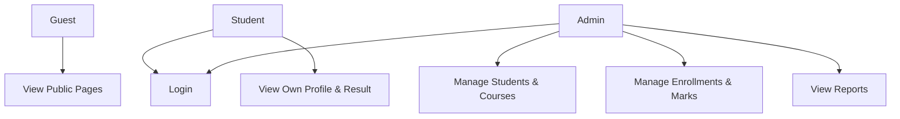
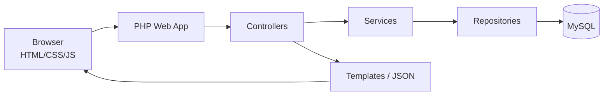
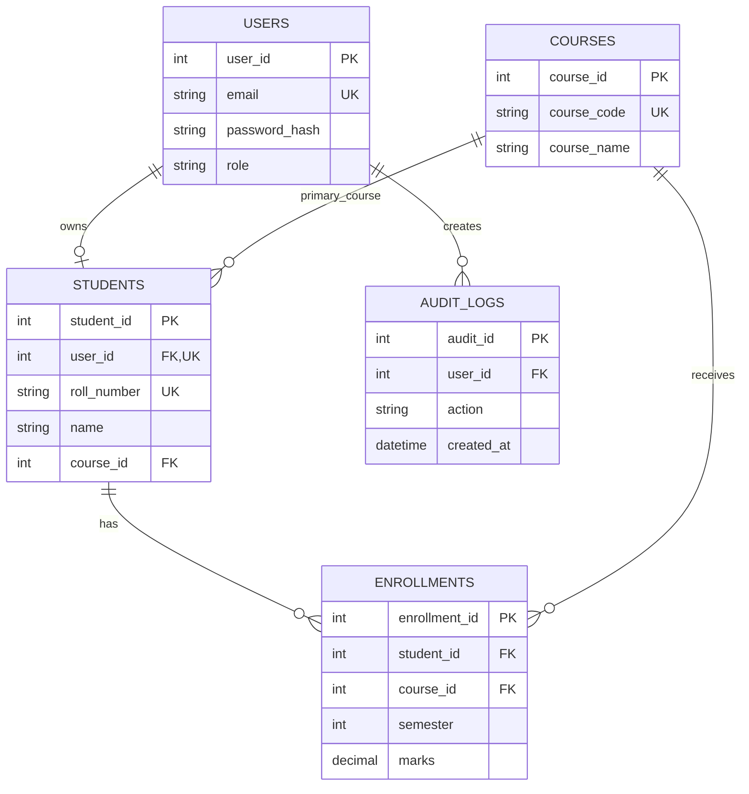

# 🎓 Chapter 45: Final Full-Stack Project

> **BCA Web Technology — Beginner to Advanced**  
> Ab tak seekhe HTML, CSS, JavaScript, PHP, MySQL, AJAX, API, security, performance aur PWA concepts ko ek complete project mein combine karein.

---

## 🎯 Project Outcome

Is chapter ke end tak aap **College Connect — Student Management Portal** plan, build, test, document aur deploy kar payenge.

Project mein:

- responsive public website;
- secure user login/logout;
- Admin and Student roles;
- student and course management;
- enrollments and marks;
- dashboard and reports;
- AJAX live search;
- JSON REST-style API;
- file upload;
- security controls;
- performance and SEO;
- optional PWA/offline experience;
- Git/GitHub workflow;
- testing and deployment documentation.

> 🏁 Goal sirf “project chal gaya” nahi. Goal hai ki aap design decisions explain, security justify aur complete application demonstrate kar saken.

---

# Part A — Project Planning

## 1. 💡 Project Title

**College Connect — Student Management Portal**

### Problem Statement

College mein student details, courses, enrollments and results multiple files/registers mein manage hone se duplication, searching difficulty, inconsistent records and reporting delays ho sakte hain.

### Proposed Solution

A secure web portal jisme:

- admin students/courses/enrollments manage kare;
- student apni profile, enrolled courses and marks dekhe;
- data MySQL mein structured form mein store ho;
- responsive pages desktop/mobile par work karein;
- API/AJAX se smooth interaction mile;
- validation and authorization server par enforce ho.

---

## 2. 👥 Users and Roles

| Role | Main Permissions |
|---|---|
| Guest | Home, about, courses and contact view |
| Student | Own profile, own enrollments and results view |
| Admin | Students, courses, enrollments and marks CRUD; reports |
| Super Admin — optional | Admin accounts and system settings |

> 🔐 Role button visibility UI concern hai. Actual permission हर server request par check hogi.

---

## 3. 📋 Functional Requirements

### Public Module

- home page;
- course listing;
- course details;
- about/contact;
- accessible navigation;
- search-engine-friendly pages.

### Authentication Module

- admin-created or controlled registration policy;
- login;
- logout;
- password hashing;
- password change;
- session timeout;
- optional password reset/MFA extension.

### Student Module

- profile;
- own photo;
- enrolled courses;
- marks/result;
- contact information update with validation.

### Admin Module

- dashboard counts;
- students CRUD;
- courses CRUD;
- enrollments CRUD;
- marks update;
- live search/filter;
- pagination;
- reports/export extension;
- security audit log extension.

### API Module

- student collection;
- one student;
- course list;
- role-protected create/update/delete;
- validation error responses;
- pagination and search.

---

## 4. 🧱 Non-Functional Requirements

| Area | Requirement |
|---|---|
| Security | Prepared SQL, CSRF, escaping, roles, secure sessions |
| Performance | Optimized assets, pagination, measured queries |
| Accessibility | Labels, keyboard access, semantic structure |
| Responsive | Mobile, tablet and desktop layouts |
| Reliability | Error handling, transactions, backups |
| Maintainability | Clear folders, reusable classes/templates |
| Privacy | Minimum data, protected uploads, safe logs |
| SEO | Public pages with metadata, crawlable links |
| Compatibility | Target browsers documented/tested |
| Documentation | README, schema, setup, test cases, screenshots |

---

## 5. 🧭 Use Cases



### Sample User Stories

- As a guest, I want to view courses so I can understand available programs.
- As a student, I want to view my results without seeing another student's data.
- As an admin, I want to search students by roll number or name.
- As an admin, I want validation errors to appear without losing entered data.
- As a user, I want the portal to work on mobile and slow networks.

### Acceptance Criteria Example

**Story:** Admin creates student.

- only authorized admin can open/submit form;
- required fields validated;
- email/roll number unique;
- course must exist;
- prepared query used;
- success redirect and flash message;
- duplicate/invalid input shows safe error;
- new student appears in list;
- action logged if audit feature enabled.

---

# Part B — System Design

## 6. 🏗️ Architecture



### Layers

| Layer | Responsibility |
|---|---|
| Browser/UI | Forms, display, progressive AJAX |
| Controller | Request method, input, response flow |
| Service | Business rules and transactions |
| Repository | SQL and database mapping |
| Template | Escaped HTML output |
| API Response | Consistent JSON |
| Database | Data, constraints, relationships |

Small student project mein layers simple ho sakti hain, but responsibilities separate rakhein.

---

## 7. 🗃️ Database ER Diagram



---

## 8. 🐬 Complete Database Schema

```sql
CREATE DATABASE IF NOT EXISTS college_connect
CHARACTER SET utf8mb4
COLLATE utf8mb4_unicode_ci;

USE college_connect;

CREATE TABLE users (
    user_id INT UNSIGNED AUTO_INCREMENT PRIMARY KEY,
    email VARCHAR(150) NOT NULL UNIQUE,
    password_hash VARCHAR(255) NOT NULL,
    role ENUM('student', 'admin') NOT NULL DEFAULT 'student',
    active BOOLEAN NOT NULL DEFAULT TRUE,
    created_at TIMESTAMP NOT NULL DEFAULT CURRENT_TIMESTAMP,
    updated_at TIMESTAMP NOT NULL
        DEFAULT CURRENT_TIMESTAMP
        ON UPDATE CURRENT_TIMESTAMP
);

CREATE TABLE courses (
    course_id INT UNSIGNED AUTO_INCREMENT PRIMARY KEY,
    course_code VARCHAR(20) NOT NULL UNIQUE,
    course_name VARCHAR(100) NOT NULL,
    description TEXT,
    duration_semesters TINYINT UNSIGNED NOT NULL,
    active BOOLEAN NOT NULL DEFAULT TRUE,
    created_at TIMESTAMP NOT NULL DEFAULT CURRENT_TIMESTAMP,

    CONSTRAINT chk_course_duration
        CHECK (duration_semesters BETWEEN 1 AND 12)
);

CREATE TABLE students (
    student_id INT UNSIGNED AUTO_INCREMENT PRIMARY KEY,
    user_id INT UNSIGNED NULL UNIQUE,
    roll_number VARCHAR(20) NOT NULL UNIQUE,
    name VARCHAR(100) NOT NULL,
    phone VARCHAR(20),
    city VARCHAR(60),
    date_of_birth DATE,
    photo_path VARCHAR(255),
    course_id INT UNSIGNED NOT NULL,
    admission_date DATE NOT NULL,
    created_at TIMESTAMP NOT NULL DEFAULT CURRENT_TIMESTAMP,
    updated_at TIMESTAMP NOT NULL
        DEFAULT CURRENT_TIMESTAMP
        ON UPDATE CURRENT_TIMESTAMP,

    CONSTRAINT fk_students_user
        FOREIGN KEY (user_id)
        REFERENCES users(user_id)
        ON DELETE SET NULL,

    CONSTRAINT fk_students_course
        FOREIGN KEY (course_id)
        REFERENCES courses(course_id)
        ON DELETE RESTRICT
        ON UPDATE CASCADE
);

CREATE TABLE enrollments (
    enrollment_id INT UNSIGNED AUTO_INCREMENT PRIMARY KEY,
    student_id INT UNSIGNED NOT NULL,
    course_id INT UNSIGNED NOT NULL,
    semester TINYINT UNSIGNED NOT NULL,
    academic_year VARCHAR(9) NOT NULL,
    marks DECIMAL(5, 2) NULL,
    status ENUM('enrolled', 'completed', 'cancelled')
        NOT NULL DEFAULT 'enrolled',
    enrolled_at TIMESTAMP NOT NULL DEFAULT CURRENT_TIMESTAMP,

    CONSTRAINT uq_enrollment
        UNIQUE (
            student_id,
            course_id,
            semester,
            academic_year
        ),

    CONSTRAINT chk_enrollment_semester
        CHECK (semester BETWEEN 1 AND 12),

    CONSTRAINT chk_enrollment_marks
        CHECK (marks IS NULL OR marks BETWEEN 0 AND 100),

    CONSTRAINT fk_enrollment_student
        FOREIGN KEY (student_id)
        REFERENCES students(student_id)
        ON DELETE CASCADE,

    CONSTRAINT fk_enrollment_course
        FOREIGN KEY (course_id)
        REFERENCES courses(course_id)
        ON DELETE RESTRICT
);

CREATE TABLE audit_logs (
    audit_id BIGINT UNSIGNED AUTO_INCREMENT PRIMARY KEY,
    user_id INT UNSIGNED NULL,
    action VARCHAR(80) NOT NULL,
    entity_type VARCHAR(50),
    entity_id VARCHAR(50),
    details_json JSON,
    ip_address VARCHAR(45),
    created_at TIMESTAMP NOT NULL DEFAULT CURRENT_TIMESTAMP,

    CONSTRAINT fk_audit_user
        FOREIGN KEY (user_id)
        REFERENCES users(user_id)
        ON DELETE SET NULL
);

CREATE INDEX idx_students_name
ON students (name);

CREATE INDEX idx_students_course
ON students (course_id);

CREATE INDEX idx_enrollments_student
ON enrollments (student_id);

CREATE INDEX idx_audit_created
ON audit_logs (created_at);
```

> 📌 MySQL version/engine and chosen constraints support verify karein. Schema migrations ko Git mein track karein.

---

## 9. 📁 Project Folder Structure

```text
college-connect/
├── app/
│   ├── Controllers/
│   │   ├── AuthController.php
│   │   ├── StudentController.php
│   │   ├── CourseController.php
│   │   └── ApiController.php
│   ├── Repositories/
│   │   ├── StudentRepository.php
│   │   ├── CourseRepository.php
│   │   └── UserRepository.php
│   ├── Services/
│   │   ├── AuthService.php
│   │   ├── StudentService.php
│   │   └── UploadService.php
│   ├── Support/
│   │   ├── Auth.php
│   │   ├── Csrf.php
│   │   ├── Validator.php
│   │   └── Response.php
│   └── Views/
│       ├── layouts/
│       ├── auth/
│       ├── students/
│       ├── courses/
│       └── errors/
├── config/
│   ├── app.php
│   └── database.php
├── database/
│   ├── schema.sql
│   └── seed.sql
├── public/
│   ├── assets/
│   │   ├── css/app.css
│   │   ├── js/app.js
│   │   └── images/
│   ├── icons/
│   ├── uploads/
│   ├── app.webmanifest
│   ├── service-worker.js
│   └── index.php
├── storage/
│   ├── logs/
│   └── private-uploads/
├── tests/
│   ├── unit/
│   └── feature/
├── .env
├── .env.example
├── .gitignore
├── composer.json
└── README.md
```

Sensitive uploads preferably public web root ke bahar.

---

## 10. 🛣️ Route Plan

| Method | Route | Purpose | Role |
|---|---|---|---|
| GET | `/` | Home | Public |
| GET | `/courses` | Course list | Public |
| GET/POST | `/login` | Login | Guest |
| POST | `/logout` | Logout | Logged-in |
| GET | `/dashboard` | Dashboard | Logged-in |
| GET | `/students` | Student list | Admin |
| GET/POST | `/students/create` | Create | Admin |
| GET/POST | `/students/{id}/edit` | Update | Admin |
| POST | `/students/{id}/delete` | Delete | Admin |
| GET | `/profile` | Own profile | Student |
| GET | `/results` | Own result | Student |
| GET | `/api/students` | JSON list/search | Admin |
| POST | `/api/students` | JSON create | Admin |
| PATCH | `/api/students/{id}` | JSON update | Admin |

Router not found → 404; wrong method → 405.

---

# Part C — Core Implementation

## 11. ⚙️ Environment Configuration

### `.env.example`

```text
APP_ENV=local
APP_DEBUG=false
APP_URL=http://localhost

DB_HOST=127.0.0.1
DB_PORT=3306
DB_NAME=college_connect
DB_USER=college_user
DB_PASSWORD=

SESSION_SECURE=false
```

### `.gitignore`

```gitignore
.env
/vendor/
/storage/logs/*.log
/storage/private-uploads/*
!/storage/private-uploads/.gitkeep
```

Never commit real passwords, API keys, session secrets or production data.

---

## 12. 🔌 PDO Connection

```php
<?php
declare(strict_types=1);

$dsn = sprintf(
    'mysql:host=%s;port=%s;dbname=%s;charset=utf8mb4',
    getenv('DB_HOST') ?: '127.0.0.1',
    getenv('DB_PORT') ?: '3306',
    getenv('DB_NAME') ?: 'college_connect'
);

try {
    $pdo = new PDO(
        $dsn,
        getenv('DB_USER') ?: 'college_user',
        getenv('DB_PASSWORD') ?: '',
        [
            PDO::ATTR_ERRMODE
                => PDO::ERRMODE_EXCEPTION,
            PDO::ATTR_DEFAULT_FETCH_MODE
                => PDO::FETCH_ASSOC,
            PDO::ATTR_EMULATE_PREPARES
                => false,
        ]
    );
} catch (PDOException $exception) {
    error_log($exception->getMessage());
    http_response_code(500);
    exit('Application is temporarily unavailable.');
}
```

Application database account ko required tables/operations ki minimum permissions dein.

---

## 13. 🔐 Secure Session Bootstrap

```php
<?php
declare(strict_types=1);

session_name('college_connect_session');

session_set_cookie_params([
    'lifetime' => 0,
    'path' => '/',
    'secure' => filter_var(
        getenv('SESSION_SECURE') ?: 'false',
        FILTER_VALIDATE_BOOL
    ),
    'httponly' => true,
    'samesite' => 'Lax',
]);

session_start();

function e(?string $value): string
{
    return htmlspecialchars(
        $value ?? '',
        ENT_QUOTES | ENT_SUBSTITUTE,
        'UTF-8'
    );
}

function redirect(string $path): never
{
    header('Location: ' . $path);
    exit;
}
```

Production under HTTPS → secure cookie true.

---

## 14. 👤 Authentication

### Registration/Account Creation

```php
$passwordHash = password_hash(
    $password,
    PASSWORD_DEFAULT
);

$stmt = $pdo->prepare(
    'INSERT INTO users
     (email, password_hash, role)
     VALUES (:email, :password_hash, :role)'
);

$stmt->execute([
    'email' => $email,
    'password_hash' => $passwordHash,
    'role' => 'student',
]);
```

Role user input se blindly accept nahi karna.

### Login

```php
$stmt = $pdo->prepare(
    'SELECT user_id, email, password_hash, role, active
     FROM users
     WHERE email = :email'
);

$stmt->execute(['email' => $email]);
$user = $stmt->fetch();

$valid = $user
    && (bool) $user['active']
    && password_verify($password, $user['password_hash']);

if (!$valid) {
    // Apply rate-limit/failure logging policy.
    $errors['login'] = 'Email or password is incorrect.';
} else {
    session_regenerate_id(true);

    $_SESSION['user_id'] = (int) $user['user_id'];
    $_SESSION['role'] = $user['role'];
    $_SESSION['last_activity'] = time();

    redirect('/dashboard');
}
```

Use generic failure, rate limiting and secure reset flow.

---

## 15. 🚪 Authorization Helpers

```php
function requireLogin(): void
{
    if (empty($_SESSION['user_id'])) {
        redirect('/login');
    }
}

function requireRole(string ...$allowedRoles): void
{
    requireLogin();

    if (!in_array(
        $_SESSION['role'] ?? '',
        $allowedRoles,
        true
    )) {
        http_response_code(403);
        exit('Forbidden.');
    }
}
```

Admin action:

```php
requireRole('admin');
```

Student-owned result:

```php
requireRole('student');

$stmt = $pdo->prepare(
    'SELECT student_id
     FROM students
     WHERE user_id = :user_id'
);
$stmt->execute([
    'user_id' => $_SESSION['user_id'],
]);
```

Ownership trusted session identity se resolve ho, query-string user ID se nahi.

---

## 16. 🛡️ CSRF Protection

```php
final class Csrf
{
    public static function token(): string
    {
        if (empty($_SESSION['csrf_token'])) {
            $_SESSION['csrf_token'] = bin2hex(
                random_bytes(32)
            );
        }

        return $_SESSION['csrf_token'];
    }

    public static function verify(?string $submitted): void
    {
        $stored = $_SESSION['csrf_token'] ?? '';

        if (
            $submitted === null ||
            $stored === '' ||
            !hash_equals($stored, $submitted)
        ) {
            http_response_code(403);
            exit('Invalid request token.');
        }
    }
}
```

Form:

```php
<input
  type="hidden"
  name="csrf_token"
  value="<?= e(Csrf::token()) ?>"
>
```

Every state-changing browser form/API using cookie session par verify.

---

## 17. ✅ Student Validation

```php
function validateStudent(array $input): array
{
    $errors = [];

    $roll = trim($input['roll_number'] ?? '');
    $name = trim($input['name'] ?? '');
    $email = trim($input['email'] ?? '');
    $courseId = filter_var(
        $input['course_id'] ?? null,
        FILTER_VALIDATE_INT
    );

    if (!preg_match('/^[A-Z0-9-]{3,20}$/', $roll)) {
        $errors['roll_number'] =
            'Use 3–20 uppercase letters, numbers or hyphens.';
    }

    if (mb_strlen($name) < 2 || mb_strlen($name) > 100) {
        $errors['name'] =
            'Name must contain 2–100 characters.';
    }

    if (!filter_var($email, FILTER_VALIDATE_EMAIL)) {
        $errors['email'] = 'Enter a valid email.';
    }

    if ($courseId === false || $courseId < 1) {
        $errors['course_id'] = 'Select a valid course.';
    }

    return $errors;
}
```

Then database verifies unique values, foreign key and constraints.

---

## 18. 🗄️ Student Repository CRUD

```php
<?php
declare(strict_types=1);

final class StudentRepository
{
    public function __construct(
        private PDO $pdo
    ) {}

    public function create(array $data): int
    {
        $stmt = $this->pdo->prepare(
            'INSERT INTO students
             (user_id, roll_number, name, phone, city,
              date_of_birth, course_id, admission_date)
             VALUES
             (:user_id, :roll_number, :name, :phone, :city,
              :date_of_birth, :course_id, :admission_date)'
        );

        $stmt->execute($data);

        return (int) $this->pdo->lastInsertId();
    }

    public function find(int $id): array|false
    {
        $stmt = $this->pdo->prepare(
            'SELECT
                s.student_id,
                s.user_id,
                s.roll_number,
                s.name,
                u.email,
                s.phone,
                s.city,
                s.date_of_birth,
                s.course_id,
                c.course_code,
                c.course_name,
                s.admission_date
             FROM students AS s
             LEFT JOIN users AS u
                ON s.user_id = u.user_id
             JOIN courses AS c
                ON s.course_id = c.course_id
             WHERE s.student_id = :id'
        );

        $stmt->execute(['id' => $id]);
        return $stmt->fetch();
    }

    public function update(int $id, array $data): bool
    {
        $data['student_id'] = $id;

        $stmt = $this->pdo->prepare(
            'UPDATE students
             SET roll_number = :roll_number,
                 name = :name,
                 phone = :phone,
                 city = :city,
                 date_of_birth = :date_of_birth,
                 course_id = :course_id,
                 admission_date = :admission_date
             WHERE student_id = :student_id'
        );

        return $stmt->execute($data);
    }

    public function delete(int $id): bool
    {
        $stmt = $this->pdo->prepare(
            'DELETE FROM students
             WHERE student_id = :id'
        );

        $stmt->execute(['id' => $id]);
        return $stmt->rowCount() > 0;
    }
}
```

Delete transaction and business rules decide karein—student user account, enrollments and audit data kya hoga?

---

## 19. 🔁 Transaction: User + Student Create

```php
try {
    $pdo->beginTransaction();

    $userStmt = $pdo->prepare(
        'INSERT INTO users
         (email, password_hash, role)
         VALUES (:email, :password_hash, :role)'
    );

    $userStmt->execute([
        'email' => $email,
        'password_hash' => password_hash(
            $temporaryPassword,
            PASSWORD_DEFAULT
        ),
        'role' => 'student',
    ]);

    $userId = (int) $pdo->lastInsertId();

    $studentData['user_id'] = $userId;
    $studentId = $studentRepository->create($studentData);

    $auditStmt = $pdo->prepare(
        'INSERT INTO audit_logs
         (user_id, action, entity_type, entity_id)
         VALUES (:user_id, :action, :type, :entity_id)'
    );

    $auditStmt->execute([
        'user_id' => $_SESSION['user_id'],
        'action' => 'student.created',
        'type' => 'student',
        'entity_id' => (string) $studentId,
    ]);

    $pdo->commit();
} catch (Throwable $exception) {
    if ($pdo->inTransaction()) {
        $pdo->rollBack();
    }

    error_log($exception->getMessage());
    $errors['database'] = 'Student could not be created.';
}
```

All dependent steps succeed, otherwise rollback.

---

## 20. 🔍 AJAX Live Search

### API Route

```php
requireRole('admin');

$search = trim($_GET['q'] ?? '');

if (mb_strlen($search) > 100) {
    jsonResponse([
        'title' => 'Search text too long',
        'status' => 422,
    ], 422);
}

$stmt = $pdo->prepare(
    'SELECT
        s.student_id,
        s.roll_number,
        s.name,
        c.course_code
     FROM students AS s
     JOIN courses AS c
        ON s.course_id = c.course_id
     WHERE s.name LIKE :name_term
        OR s.roll_number LIKE :roll_term
     ORDER BY s.name
     LIMIT 20'
);

$term = '%' . $search . '%';

$stmt->execute([
    'name_term' => $term,
    'roll_term' => $term,
]);

jsonResponse([
    'data' => $stmt->fetchAll(),
]);
```

### JavaScript

```javascript
const search = document.querySelector("#student-search");
const results = document.querySelector("#search-results");
const status = document.querySelector("#search-status");

let controller = null;
let timer = null;

search.addEventListener("input", () => {
  clearTimeout(timer);

  timer = setTimeout(async () => {
    controller?.abort();
    controller = new AbortController();

    const params = new URLSearchParams({
      q: search.value.trim(),
    });

    status.textContent = "Searching…";

    try {
      const response = await fetch(
        `/api/students?${params}`,
        { signal: controller.signal }
      );

      const body = await response.json();

      if (!response.ok) {
        throw new Error(body.title ?? "Search failed");
      }

      results.replaceChildren();

      for (const student of body.data) {
        const item = document.createElement("li");
        item.textContent =
          `${student.name} — ${student.roll_number} — ${student.course_code}`;
        results.append(item);
      }

      status.textContent =
        body.data.length > 0
          ? `${body.data.length} result(s)`
          : "No students found.";
    } catch (error) {
      if (error.name === "AbortError") return;

      status.textContent = "Search could not be completed.";
    }
  }, 300);
});
```

---

## 21. 📊 Dashboard Reports

### Counts

```sql
SELECT
    (SELECT COUNT(*) FROM students) AS total_students,
    (SELECT COUNT(*) FROM courses WHERE active = TRUE)
        AS active_courses,
    (SELECT COUNT(*) FROM enrollments
     WHERE status = 'enrolled') AS active_enrollments;
```

### Course-Wise Students

```sql
SELECT
    c.course_code,
    c.course_name,
    COUNT(s.student_id) AS total_students
FROM courses AS c
LEFT JOIN students AS s
    ON c.course_id = s.course_id
GROUP BY c.course_id, c.course_code, c.course_name
ORDER BY total_students DESC;
```

### Result Report

```sql
SELECT
    s.roll_number,
    s.name,
    c.course_code,
    e.semester,
    e.academic_year,
    e.marks,
    CASE
        WHEN e.marks IS NULL THEN 'Pending'
        WHEN e.marks >= 40 THEN 'Pass'
        ELSE 'Fail'
    END AS result
FROM enrollments AS e
JOIN students AS s
    ON e.student_id = s.student_id
JOIN courses AS c
    ON e.course_id = c.course_id
ORDER BY s.roll_number, e.semester;
```

Student role query must additionally scope to current user's `student_id`.

---

## 22. 📁 Secure Profile Photo Upload

```php
final class UploadService
{
    private const MAX_BYTES = 2 * 1024 * 1024;

    private const ALLOWED = [
        'image/jpeg' => 'jpg',
        'image/png' => 'png',
        'image/webp' => 'webp',
    ];

    public function storeImage(array $file): string
    {
        if (($file['error'] ?? UPLOAD_ERR_NO_FILE) !== UPLOAD_ERR_OK) {
            throw new RuntimeException('Upload failed.');
        }

        if (($file['size'] ?? 0) > self::MAX_BYTES) {
            throw new RuntimeException('Image is too large.');
        }

        $mime = (new finfo(FILEINFO_MIME_TYPE))
            ->file($file['tmp_name']);

        if (!isset(self::ALLOWED[$mime])) {
            throw new RuntimeException('Unsupported image type.');
        }

        $filename = bin2hex(random_bytes(16))
            . '.'
            . self::ALLOWED[$mime];

        $destination = dirname(__DIR__, 2)
            . '/storage/private-uploads/'
            . $filename;

        if (!move_uploaded_file(
            $file['tmp_name'],
            $destination
        )) {
            throw new RuntimeException('Could not save image.');
        }

        return $filename;
    }
}
```

Serving endpoint:

- login/permission check;
- database filename lookup;
- safe exact storage path;
- correct MIME and content length;
- `X-Content-Type-Options: nosniff`;
- no direct user path;
- placeholder if absent.

---

# Part D — Front End

## 23. 🎨 Design System

### Colors

```css
:root {
  --primary: #2563eb;
  --primary-dark: #1d4ed8;
  --secondary: #7c3aed;
  --success: #15803d;
  --warning: #b45309;
  --danger: #b91c1c;
  --background: #eff6ff;
  --surface: #ffffff;
  --text: #172033;
  --muted: #64748b;
  --border: #cbd5e1;
}
```

### Base Layout

```css
* {
  box-sizing: border-box;
}

body {
  margin: 0;
  color: var(--text);
  background:
    linear-gradient(135deg, #eff6ff, #f5f3ff);
  font-family: system-ui, sans-serif;
  line-height: 1.6;
}

.container {
  width: min(1120px, 92%);
  margin-inline: auto;
}

.card {
  padding: 1.25rem;
  border: 1px solid var(--border);
  border-radius: 1rem;
  background: var(--surface);
  box-shadow: 0 12px 30px rgb(15 23 42 / 8%);
}

.dashboard-grid {
  display: grid;
  grid-template-columns:
    repeat(auto-fit, minmax(220px, 1fr));
  gap: 1rem;
}

.table-wrapper {
  overflow-x: auto;
}

:focus-visible {
  outline: 3px solid #f59e0b;
  outline-offset: 3px;
}
```

---

## 24. ♿ Accessible Form Pattern

```php
<div class="field">
  <label for="email">
    Email <span aria-hidden="true">*</span>
  </label>

  <input
    id="email"
    name="email"
    type="email"
    value="<?= e($old['email'] ?? '') ?>"
    autocomplete="email"
    aria-describedby="email-help email-error"
    aria-invalid="<?= isset($errors['email'])
      ? 'true'
      : 'false' ?>"
    required
  >

  <p id="email-help" class="help">
    College or personal active email.
  </p>

  <?php if (isset($errors['email'])): ?>
    <p id="email-error" class="error">
      <?= e($errors['email']) ?>
    </p>
  <?php endif; ?>
</div>
```

Accessibility checks:

- semantic headings/landmarks;
- label for every field;
- keyboard navigation;
- visible focus;
- contrast;
- error text and summary;
- status announcement;
- table headers/caption;
- reduced-motion preference;
- responsive zoom.

---

## 25. 🧭 Navigation by Role

```php
<nav aria-label="Main navigation">
  <a href="/">Home</a>
  <a href="/courses">Courses</a>

  <?php if (!empty($_SESSION['user_id'])): ?>
    <a href="/dashboard">Dashboard</a>

    <?php if ($_SESSION['role'] === 'admin'): ?>
      <a href="/students">Students</a>
      <a href="/admin/courses">Manage Courses</a>
    <?php else: ?>
      <a href="/profile">My Profile</a>
      <a href="/results">My Results</a>
    <?php endif; ?>

    <form method="post" action="/logout">
      <input
        type="hidden"
        name="csrf_token"
        value="<?= e(Csrf::token()) ?>"
      >
      <button type="submit">Logout</button>
    </form>
  <?php else: ?>
    <a href="/login">Login</a>
  <?php endif; ?>
</nav>
```

Again, route authorization required even if link hidden.

---

# Part E — Security, Performance and PWA

## 26. 🔐 Project Security Matrix

| Risk | Required Control |
|---|---|
| SQL injection | Prepared statements |
| XSS | Escaped templates, safe DOM, CSP |
| CSRF | Session-bound token on changes |
| Broken access control | Route + record ownership checks |
| Password theft | `password_hash()`, HTTPS |
| Session fixation | ID regenerate after login |
| File upload abuse | Type/size checks, random name, isolation |
| Brute force | Rate limiting and logs |
| Data leak in errors | Generic response, protected logs |
| Mass assignment | Allowed fields only |
| Dependency risk | Lock file, review and updates |
| Data loss | Automated tested backups |

### Suggested Headers

```php
header("Content-Security-Policy: default-src 'self'; script-src 'self'; style-src 'self'; img-src 'self' data:; object-src 'none'; base-uri 'self'; frame-ancestors 'none'");
header('X-Content-Type-Options: nosniff');
header('Referrer-Policy: strict-origin-when-cross-origin');
header('Permissions-Policy: camera=(), microphone=(), geolocation=()');
```

HSTS production HTTPS configuration after testing.

---

## 27. ⚡ Performance Plan

### Front End

- responsive WebP/AVIF images with dimensions;
- lazy load below-fold only;
- minified and cached CSS/JS;
- defer JS;
- minimal third-party code;
- system/optimized fonts;
- pagination;
- Core Web Vitals audit.

### Back End

- PHP production configuration/opcode cache;
- limited select columns;
- query plans and indexes;
- N+1 avoid;
- external call timeouts;
- logs/profile slow routes;
- public content caching;
- compressed responses.

### Performance Budget

| Item | Target Example |
|---|---:|
| Initial transfer | ≤ 1.5 MB |
| Compressed JS | ≤ 250 KB |
| LCP | ≤ 2.5 s |
| INP | ≤ 200 ms |
| CLS | ≤ 0.1 |
| Students per API page | 20; maximum 100 |

Real measurements and target audience ke according adjust karein.

---

## 28. 🔎 Public SEO Plan

Only public pages need search indexing. Private dashboard/profile:

```html
<meta name="robots" content="noindex, nofollow">
```

Public course page:

```html
<title>BCA Course Details | College Connect</title>
<meta
  name="description"
  content="Explore the BCA course, subjects, duration and web technology practicals."
>
<link
  rel="canonical"
  href="https://college.example/courses/bca"
>
```

Also:

- semantic page;
- crawlable course links;
- unique title;
- XML sitemap for public canonical URLs;
- robots rules;
- correct 404/redirects;
- structured data only if accurate/eligible;
- helpful people-first content;
- Search Console after deployment.

Authentication is required for private content—robots rules security नहीं.

---

## 29. 📱 Optional PWA Enhancement

Manifest:

```json
{
  "id": "/",
  "name": "College Connect",
  "short_name": "College",
  "start_url": "/",
  "scope": "/",
  "display": "standalone",
  "background_color": "#eff6ff",
  "theme_color": "#2563eb",
  "icons": [
    {
      "src": "/icons/icon-192.png",
      "sizes": "192x192",
      "type": "image/png"
    },
    {
      "src": "/icons/icon-512.png",
      "sizes": "512x512",
      "type": "image/png",
      "purpose": "any maskable"
    }
  ]
}
```

PWA caching policy:

- public app shell/assets → cache;
- public course content → network first/stale if acceptable;
- authenticated HTML/API → network only by default;
- POST/update/delete → network only;
- offline page → precache;
- logout → clear private local data if any.

Do not cache marks/profile just to show “offline feature” without privacy and staleness design.

---

# Part F — Testing

## 30. 🧪 Test Plan

### Authentication

- valid/invalid login;
- inactive account;
- session fixation prevention;
- logout invalidates access;
- role restrictions;
- timeout.

### Student CRUD

- valid create/update/delete;
- duplicate email/roll;
- invalid foreign key;
- invalid date;
- missing fields;
- nonexistent ID;
- unauthorized role;
- CSRF invalid;
- transaction rollback.

### Search/API

- normal and Unicode search;
- special characters;
- no results;
- maximum length;
- pagination boundaries;
- malformed JSON;
- wrong method/content type;
- authorization;
- rapid input/race cancellation.

### Upload

- valid JPEG/PNG/WebP;
- too large;
- disguised/wrong content;
- no file;
- random filename;
- permission denied;
- orphan cleanup.

### Non-Functional

- mobile widths;
- keyboard/screen reader;
- slow/offline network;
- Core Web Vitals;
- SQL plan;
- errors/logs;
- browser matrix;
- backup restore.

---

## 31. 🧾 Sample Test Cases

| ID | Scenario | Expected |
|---|---|---|
| AUTH-01 | Correct admin login | Dashboard; new session ID |
| AUTH-02 | Wrong password | Generic error; no login |
| ACL-01 | Student opens admin URL | 403/redirect; no data |
| ACL-02 | Student changes result ID | Own records only |
| CRUD-01 | Valid student create | 201/redirect; row exists |
| CRUD-02 | Duplicate roll | Safe validation/conflict |
| SEC-01 | Missing CSRF | Request rejected |
| SEC-02 | HTML-like name | Displayed as text |
| API-01 | Page 2 request | Correct stable rows/meta |
| FILE-01 | Oversized image | Rejected; no saved file |
| PERF-01 | Course page audit | Budget met/no regression |
| REC-01 | Restore backup | Data/app verified |

---

## 32. 🔍 Review and Quality Gates

Before merge/deployment:

- code review;
- formatting/static checks;
- automated tests;
- schema migration review;
- dependency audit;
- secrets scan;
- accessibility check;
- performance budget;
- security checklist;
- backup/rollback readiness.

Git workflow:

```text
main
└── feature/student-create
    ├── validation commit
    ├── repository commit
    ├── UI commit
    └── tests commit
```

Commit messages meaningful:

```text
Add server-side student validation
Implement role checks for student routes
Add pagination to student search API
Fix profile image output escaping
```

---

# Part G — Deployment and Documentation

## 33. 🚀 Deployment Steps

1. production server/database prepare;
2. HTTPS/certificate;
3. restricted DB user;
4. code deploy from reviewed commit;
5. production environment variables;
6. dependency install/build;
7. schema migration;
8. writable directories narrowly configure;
9. web root `public/`;
10. debug display off/logging on;
11. security headers;
12. smoke tests;
13. scheduled backups;
14. monitoring/alerts;
15. rollback plan.

> 🚨 Production secrets or real data GitHub par upload na karein.

---

## 34. 📘 README Structure

```markdown
# College Connect

## Project Overview
Student management full-stack web application.

## Features
- Role-based authentication
- Student/course/enrollment management
- AJAX search
- JSON API
- Reports

## Technology
HTML, CSS, JavaScript, PHP, MySQL

## Requirements
PHP, MySQL, web server, PDO MySQL

## Local Setup
1. Clone repository
2. Copy .env.example to .env
3. Create database
4. Run database/schema.sql
5. Configure web root to public/
6. Start server

## Test Accounts
Explain seed process; do not publish real passwords.

## Security
Prepared SQL, CSRF, escaping, secure sessions and roles.

## Testing
Commands/manual test plan.

## Screenshots
Add desktop/mobile pages.

## Future Improvements
MFA, exports, automated tests, notifications.
```

README must match actual project.

---

## 35. 📄 Project Report Structure

1. Title page
2. Certificate/declaration if college requires
3. Acknowledgement
4. Abstract
5. Table of contents
6. Problem statement
7. Objectives
8. Existing vs proposed system
9. Requirements
10. Technology stack
11. System architecture
12. Use cases
13. Database ER diagram/schema
14. Module descriptions
15. Important code explanations
16. Security measures
17. Testing and results
18. Screenshots
19. Deployment
20. Limitations
21. Future scope
22. Conclusion
23. References

Never pad report with unexplained screenshots/code. Every diagram and test result explain karein.

---

## 36. 🎤 Final Demonstration Flow

College viva/demo ke liye:

1. problem and users explain;
2. architecture and stack;
3. ER diagram;
4. responsive public page;
5. admin login;
6. create student with validation;
7. search/pagination;
8. edit student;
9. enrollment/marks update;
10. student login and own result;
11. access-control denial demonstrate;
12. AJAX/JSON API;
13. security controls;
14. performance audit;
15. Git history and README;
16. deployment and future scope.

Keep backup local demo environment and sample data ready.

---

## 37. 🗓️ Suggested 6-Week Roadmap

| Week | Deliverable |
|---:|---|
| 1 | Requirements, wireframes, ER diagram, repository |
| 2 | Database, routing, templates, public pages |
| 3 | Authentication, roles, sessions, CSRF |
| 4 | Student/course/enrollment CRUD |
| 5 | AJAX/API, reports, uploads, responsive polish |
| 6 | Security review, tests, performance, docs, deployment |

Daily small commits; feature complete hone par test and document.

---

## 38. 📊 Evaluation Rubric

| Area | Marks |
|---|---:|
| Problem analysis and requirements | 10 |
| Database design and SQL | 15 |
| Frontend/responsiveness/accessibility | 15 |
| PHP architecture and CRUD | 20 |
| Authentication and security | 15 |
| AJAX/API/advanced feature | 10 |
| Testing and error handling | 5 |
| Git, documentation and deployment | 5 |
| Viva/demo understanding | 5 |
| **Total** | **100** |

Rubric college rules ke according adjust ho sakta hai.

---

## 39. 🌱 Future Scope

- password reset/MFA/passkeys;
- attendance;
- fees/payment integration;
- teacher role;
- timetable;
- email/SMS notifications;
- CSV/PDF exports;
- audit dashboard;
- signed webhooks;
- mobile install/PWA notifications;
- automated unit/integration/end-to-end tests;
- framework migration;
- localization;
- accessible data visualizations;
- privacy/data-retention controls.

Future scope present project ki limitations honestly reflect kare.

---

## 40. ⚠️ Common Project Mistakes

| Mistake | Better Approach |
|---|---|
| Coding without requirements | User stories and acceptance criteria |
| One huge PHP file | Routes, services, repositories, templates |
| Database without keys | Constraints and relationships |
| Password plain text | `password_hash()` |
| Login only, no authorization | Per-action/per-record checks |
| SQL concatenation | Prepared statements |
| Raw output | Context-aware escaping |
| Delete via GET | POST + CSRF + permission |
| Upload in public path | Isolated validated storage |
| Copy-pasted code unexplained | Understand and document |
| No invalid tests | Boundary/security/error tests |
| Git only final commit | Regular meaningful commits |
| Screenshots instead of testing | Expected vs actual test cases |
| Public real credentials/data | Environment config + sample data |
| “100% secure” claim | Honest scope and continuing review |

---

## 41. ✅ Final Submission Checklist

### Planning and Design

- [ ] Problem statement clear?
- [ ] Roles, requirements and scope documented?
- [ ] Wireframes/use cases?
- [ ] Normalized ER diagram?
- [ ] Route and permission matrix?

### Implementation

- [ ] Responsive semantic UI?
- [ ] Accessible forms/errors/navigation?
- [ ] Authentication and logout?
- [ ] Role/object authorization?
- [ ] Complete CRUD?
- [ ] Search, filter and pagination?
- [ ] AJAX and JSON API?
- [ ] Transactions for dependent actions?
- [ ] Secure uploads if included?

### Security

- [ ] Prepared statements?
- [ ] Server validation?
- [ ] Escaped output?
- [ ] CSRF tokens?
- [ ] Secure sessions?
- [ ] Password hashing?
- [ ] Secrets excluded?
- [ ] Safe error/log behavior?
- [ ] Security headers?
- [ ] Least privilege?

### Quality

- [ ] Automated/manual tests?
- [ ] Mobile/browser/accessibility test?
- [ ] Performance measured?
- [ ] Query plans reviewed?
- [ ] No broken links/console errors?
- [ ] Backup restore tested?

### Delivery

- [ ] Clean GitHub repository?
- [ ] README and setup steps?
- [ ] `.env.example`?
- [ ] Database schema/seed?
- [ ] Screenshots/report?
- [ ] Live deployment or clear local demo?
- [ ] Demo data and presentation ready?

---

## 42. 🧾 Project Summary

- College Connect book ke complete full-stack learning ko integrate karta hai.
- Requirements, roles and acceptance criteria coding se pehle clarity dete hain.
- Layered architecture UI, controllers, services, repositories and database responsibilities separate karti hai.
- Relational schema keys, foreign keys, uniqueness, checks and indexes use karta hai.
- PDO prepared statements and transactions reliable data operations provide karte hain.
- Authentication identity and authorization roles/record ownership enforce karti hai.
- CSRF, escaping, validation, secure sessions and isolated uploads defense in depth banate hain.
- AJAX live search and JSON API modern interaction demonstrate karte hain.
- Responsive, accessible frontend all users/devices ko support karta hai.
- Performance budgets, query analysis and caching measurable optimization enable karte hain.
- Public SEO and optional privacy-aware PWA enhancement responsible advanced features hain.
- Tests, documentation, Git history, backups and deployment plan project ko professional submission banate hain.

---

## 43. 📝 Final MCQs

1. Dependent database operations ko atomic banata hai:  
   A. CSS Grid  B. Transaction  C. Sitemap  D. Cookie only

2. Role permission server par enforce karna hai:  
   A. Authorization  B. Authentication only  C. SEO  D. Minification

3. SQL injection ka primary defense hai:  
   A. Prepared statements  B. Hidden button  C. CSS  D. robots.txt

4. AJAX API response ka common format hai:  
   A. JSON  B. PSD  C. EXE  D. WAV only

5. Password securely store karne ka PHP function hai:  
   A. `password_hash()`  B. `htmlspecialchars()`  
   C. `json_encode()`  D. `header()`

6. M:N relation resolve karta hai:  
   A. Junction table  B. Session  C. Media query  D. Manifest

7. Code history track karta hai:  
   A. Git  B. DNS  C. XML only  D. CDN

**Answers:** 1-B, 2-A, 3-A, 4-A, 5-A, 6-A, 7-A

---

## 44. 🎤 Final Viva Questions

1. Project problem statement and objective kya hai?
2. Technology stack kyun choose kiya?
3. Architecture layers explain karein.
4. Database normalization kaise apply ki?
5. Primary/foreign/composite keys kahan use hui?
6. Authentication and authorization compare karein.
7. Session fixation and CSRF prevention kaise ki?
8. SQL injection and XSS kaise prevent ki?
9. Transaction kahan and kyun use ki?
10. AJAX live search ka flow explain karein.
11. API status codes and validation format kya hai?
12. File upload kaise secure kiya?
13. N+1 query kya hai and project mein kaise avoid?
14. Performance metrics kya measure kiye?
15. Public and private pages ki SEO policy kya hai?
16. PWA mein private data cache kyun nahi kiya?
17. Testing strategy explain karein.
18. Deployment and rollback plan kya hai?
19. Project ki limitations kya hain?
20. Future scope mein first priority kya and kyun?

---

## 45. 🧪 Final Challenge Tasks

### Bronze — Minimum Working Project

- public course pages;
- admin login;
- students and courses CRUD;
- prepared queries;
- validation and escaped output;
- responsive design;
- README and schema.

### Silver — Strong BCA Project

Bronze plus:

- student login/own result;
- enrollments/marks;
- roles and CSRF;
- AJAX search and pagination;
- secure upload;
- test cases;
- deployment.

### Gold — Advanced Portfolio Project

Silver plus:

- REST-style API;
- audit logs;
- automated tests;
- performance budgets;
- accessibility audit;
- offline public PWA;
- CI quality checks;
- secure backup/monitoring plan;
- detailed project report/demo.

---

## 46. 🔁 Full Book Revision Map

```text
Web Foundations
  → Internet, client–server, URL, DNS, HTTP

HTML + CSS
  → Semantic, accessible, responsive UI

JavaScript
  → Logic, DOM, validation, async/AJAX

Git + Deployment
  → Version control and publishing

PHP
  → Server logic, forms, sessions, OOP

MySQL
  → Schema, CRUD, relationships, joins

Full-Stack
  → PHP + MySQL application

Advanced Web
  → JSON, APIs, security, performance, SEO, PWA

Final Project
  → Plan, build, test, secure, document, deploy
```

---

## 47. 🔗 Key Official References

- [MDN Web Docs](https://developer.mozilla.org/)
- [PHP Manual](https://www.php.net/manual/en/)
- [MySQL Reference Manual](https://dev.mysql.com/doc/refman/en/)
- [OWASP Cheat Sheet Series](https://cheatsheetseries.owasp.org/)
- [W3C Web Standards](https://www.w3.org/standards/)
- [Google Search Central](https://developers.google.com/search/docs)
- [web.dev](https://web.dev/)
- [GitHub Docs](https://docs.github.com/)

---

[⬅️ Previous Chapter](44-progressive-web-applications-and-modern-web-trends.md) · [📚 Table of Contents](../SUMMARY.md) · **Next: Appendix A — Important Technical Terms ➡️**
